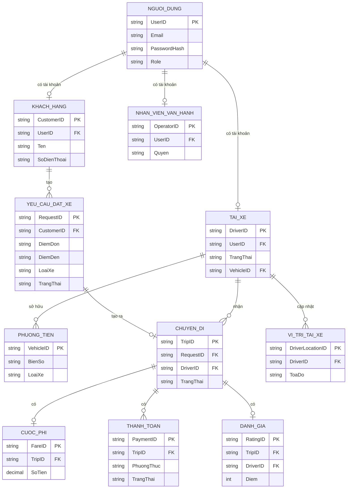
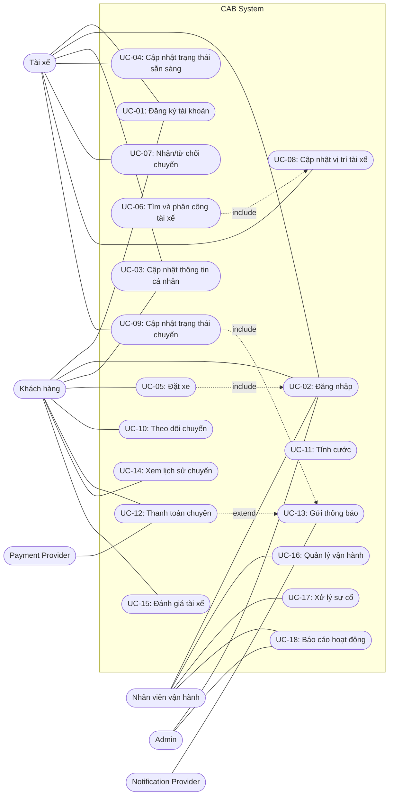

# Bước 12–17 — Mô hình dữ liệu, Actor/Use Case, đặc tả Use Case, Acceptance Criteria và RTM

**Hệ thống:** CAB System (backend service/API đặt xe trực tuyến của ABC)

Tài liệu này nối tiếp chuỗi logic từ `SRS.md` (B1–B8) và `11_XacDinhNonFunctionalRequirement_NFR.md`, thực hiện lần lượt các bước:

1. **Bước 12** — Mô hình hóa dữ liệu (Entity → Attribute → Relationship → ERD).
2. **Bước 13** — Xác định Actor và Use Case.
3. **Bước 14** — Vẽ Use Case Diagram (Mermaid).
4. **Bước 15** — Đặc tả Use Case.
5. **Bước 16** — Xác định Acceptance Criteria (AC).
6. **Bước 17** — Truy xuất nguồn gốc yêu cầu (RTM).

> **Quy ước ID:** Để nhất quán với `SRS.md`, các mã nguồn được dùng nguyên dạng: `FR01`–`FR62`, `BR01`–`BR29`, `BR_01`–`BR_22` (Business Rule), `EX01`–`EX09`, `BP-01`–`BP-07`, `OI01`–`OI10`. Các mã mới sinh ở bước 12–16 dùng `ENT-xx`, `ACT-xx`, `UC-xx`, `AC-xx`.

---

# PHẦN 12 — Mô hình hóa Dữ liệu

## 12.1 Đầu vào và truy xuất

Nguồn chính: FR (FR01–FR62), BP (BP-01–BP-07), Business Rule (BR_01–BR_22), Exception (EX01–EX09), Scope (In-Scope/Out-of-Scope).

Chuỗi truy xuất: **Nguồn → NEED → STK → SCOPE → BR → BP → Step → FR/FR con → Rule/Exception → DATA**

Các thành phần suy ra ghi **[Suy ra]**, thiếu thông tin ghi **[Cần làm rõ]**.

## 12.2 Danh sách Entity

| Entity ID | Tên Entity                  | Ý nghĩa nghiệp vụ                           | FR/BP liên quan                     | Lý do cần lưu trữ               | Trạng thái  |
| --------- | --------------------------- | ------------------------------------------- | ----------------------------------- | ------------------------------- | ----------- |
| ENT-01    | NguoiDung (User)            | Tài khoản chung cho khách hàng và tài xế    | FR01–FR05, BP-01                    | Lưu thông tin xác thực và hồ sơ | Đã xác nhận |
| ENT-02    | KhachHang (Customer)        | Thông tin khách hàng                        | FR01, FR04, FR44–FR47, BP-01, BP-05 | Quản lý khách hàng và lịch sử   | Đã xác nhận |
| ENT-03    | TaiXe (Driver)              | Thông tin và trạng thái tài xế              | FR04–FR06, FR18–FR20, BP-01, BP-02  | Matching và theo dõi trạng thái | Đã xác nhận |
| ENT-04    | PhuongTien (Vehicle)        | Phương tiện gắn với tài xế                  | FR50, BP-06                         | Vận hành quản lý phương tiện    | Đã xác nhận |
| ENT-05    | YeuCauDatXe (RideRequest)   | Yêu cầu đặt xe của khách hàng               | FR07–FR10, BP-02                    | Quản lý yêu cầu và định danh    | Đã xác nhận |
| ENT-06    | ChuyenDi (Trip)             | Chuyến đi từ khi nhận tài xế đến hoàn thành | FR21–FR27, BP-03                    | Theo dõi trạng thái chuyến      | Đã xác nhận |
| ENT-07    | ViTriTaiXe (DriverLocation) | Vị trí mới nhất của tài xế                  | FR18–FR20, BP-02, BP-03             | Matching và ETA                 | Đã xác nhận |
| ENT-08    | CuocPhi (Fare)              | Số tiền phải trả của chuyến                 | FR28–FR31, BP-04                    | Tính cước và thanh toán         | Đã xác nhận |
| ENT-09    | ThanhToan (Payment)         | Ghi nhận kết quả thanh toán                 | FR32–FR37, BP-04                    | Quản lý thanh toán              | Đã xác nhận |
| ENT-10    | ThongBao (Notification)     | Sự kiện thông báo                           | FR38–FR43, BP-02, BP-03, BP-04      | Gửi thông báo các mốc chính     | Đã xác nhận |
| ENT-11    | DanhGia (Rating)            | Đánh giá tài xế sau chuyến                  | FR46, FR47, BP-05                   | Lưu đánh giá gắn chuyến/tài xế  | Đã xác nhận |
| ENT-12    | NhanVienVanHanh (Operator)  | Nhân viên vận hành                          | FR48–FR54, BP-06                    | Phân quyền quản trị/vận hành    | Đã xác nhận |

> **Ghi chú:** Việc tách `NguoiDung` (ENT-01) và `KhachHang`/`TaiXe` (ENT-02/03) là **[Suy ra]** từ BR_01 (xác thực chung) và BR_08 (chỉ tài xế của chuyến được cập nhật trạng thái). Nếu đồ án nhỏ gộp chung có thể làm rõ tại thiết kế DB.

## 12.3 Attribute của từng Entity

### ENT-01 — NguoiDung (User)

| Attribute    | Ý nghĩa                 | Kiểu       | PK/FK/Unique | Bắt buộc? | Giá trị/trạng thái       | Nguồn             | Trạng thái        |
| ------------ | ----------------------- | ---------- | ------------ | --------- | ------------------------ | ----------------- | ----------------- |
| UserID       | Mã định danh người dùng | Số/Chuỗi   | PK           | Có        | —                        | FR01/FR03         | Đã xác nhận       |
| Email/Phone  | Thông tin đăng nhập     | Chuỗi      | Unique       | Có        | —                        | FR03              | Đã xác nhận       |
| PasswordHash | Mật khẩu (đã mã hóa)    | Chuỗi      | -            | Có        | —                        | BR_01/FR59        | Đã xác nhận       |
| Role         | Loại người dùng         | Chuỗi/Enum | -            | Có        | customer/driver/operator | FR02, FR60, BR_18 | Cần làm rõ (OI08) |

### ENT-02 — KhachHang (Customer)

| Attribute   | Ý nghĩa            | Kiểu     | PK/FK/Unique | Bắt buộc? | Giá trị/trạng thái | Nguồn      | Trạng thái  |
| ----------- | ------------------ | -------- | ------------ | --------- | ------------------ | ---------- | ----------- |
| CustomerID  | Mã khách hàng      | Số/Chuỗi | PK           | Có        | —                  | FR01       | Đã xác nhận |
| UserID      | Liên kết tài khoản | Số/Chuỗi | FK           | Có        | → ENT-01           | FR01       | Đã xác nhận |
| Ten (Name)  | Họ tên             | Chuỗi    | -            | Có        | —                  | FR04       | Đã xác nhận |
| SoDienThoai | Số điện thoại      | Chuỗi    | Unique       | Có        | —                  | FR01/BR_01 | Đã xác nhận |

### ENT-03 — TaiXe (Driver)

| Attribute          | Ý nghĩa                | Kiểu       | PK/FK/Unique | Bắt buộc? | Giá trị/trạng thái      | Nguồn      | Trạng thái  |
| ------------------ | ---------------------- | ---------- | ------------ | --------- | ----------------------- | ---------- | ----------- |
| DriverID           | Mã tài xế              | Số/Chuỗi   | PK           | Có        | —                       | FR02       | Đã xác nhận |
| UserID             | Liên kết tài khoản     | Số/Chuỗi   | FK           | Có        | → ENT-01                | FR02       | Đã xác nhận |
| TrangThai (Status) | Trạng thái sẵn sàng    | Chuỗi/Enum | -            | Có        | SAN_SANG/KHONG_SAN_SANG | FR05/BR_02 | Đã xác nhận |
| VehicleID          | Phương tiện của tài xế | Số/Chuỗi   | FK           | Tùy chọn  | → ENT-04                | FR50       | Cần làm rõ  |

### ENT-04 — PhuongTien (Vehicle)

| Attribute | Ý nghĩa        | Kiểu     | PK/FK/Unique | Bắt buộc? | Giá trị/trạng thái | Nguồn     | Trạng thái  |
| --------- | -------------- | -------- | ------------ | --------- | ------------------ | --------- | ----------- |
| VehicleID | Mã phương tiện | Số/Chuỗi | PK           | Có        | —                  | FR50      | Đã xác nhận |
| BienSo    | Biển số        | Chuỗi    | Unique       | Có        | —                  | BR20      | Đã xác nhận |
| LoaiXe    | Loại xe        | Chuỗi    | -            | Có        | —                  | FR07/BR10 | Đã xác nhận |

### ENT-05 — YeuCauDatXe (RideRequest)

| Attribute   | Ý nghĩa              | Kiểu       | PK/FK/Unique | Bắt buộc? | Giá trị/trạng thái                    | Nguồn           | Trạng thái  |
| ----------- | -------------------- | ---------- | ------------ | --------- | ------------------------------------- | --------------- | ----------- |
| RequestID   | Mã định danh yêu cầu | Số/Chuỗi   | PK           | Có        | —                                     | FR08            | Đã xác nhận |
| CustomerID  | Khách đặt xe         | Số/Chuỗi   | FK           | Có        | → ENT-02                              | FR07            | Đã xác nhận |
| DiemDon     | Điểm đón             | Chuỗi      | -            | Có        | —                                     | FR07            | Đã xác nhận |
| DiemDen     | Điểm đến             | Chuỗi      | -            | Có        | —                                     | FR07            | Đã xác nhận |
| LoaiXe      | Loại xe yêu cầu      | Chuỗi      | -            | Có        | —                                     | FR07            | Đã xác nhận |
| TrangThai   | Trạng thái yêu cầu   | Chuỗi/Enum | -            | Có        | TIM_TAI_XE / KHONG_TIM_DUOC / DA_NHAN | FR09/BR_06/EX01 | Đã xác nhận |
| ThoiDiemTao | Thời điểm tạo        | Ngày/giờ   | -            | Có        | —                                     | FR09            | Đã xácận    |

### ENT-06 — ChuyenDi (Trip)

| Attribute | Ý nghĩa            | Kiểu       | PK/FK/Unique | Bắt buộc? | Giá trị/trạng thái                                     | Nguồn           | Trạng thái  |
| --------- | ------------------ | ---------- | ------------ | --------- | ------------------------------------------------------ | --------------- | ----------- |
| TripID    | Mã chuyến          | Số/Chuỗi   | PK           | Có        | —                                                      | FR08/FR21       | Đã xác nhận |
| RequestID | Yêu cầu gốc        | Số/Chuỗi   | FK           | Có        | → ENT-05                                               | FR08            | Đã xác nhận |
| DriverID  | Tài xế nhận chuyến | Số/Chuỗi   | FK           | Có        | → ENT-03                                               | FR39/BR_08      | Đã xác nhận |
| TrangThai | Trạng thái chuyến  | Chuỗi/Enum | -            | Có        | DA_DEN_DIEM_DON→DA_DON_KHACH→DANG_DI_CHUYEN→HOAN_THANH | FR21–FR24/BR_07 | Đã xác nhận |

### ENT-07 — ViTriTaiXe (DriverLocation)

| Attribute        | Ý nghĩa            | Kiểu     | PK/FK/Unique | Bắt buộc? | Giá trị/trạng thái | Nguồn     | Trạng thái  |
| ---------------- | ------------------ | -------- | ------------ | --------- | ------------------ | --------- | ----------- |
| DriverLocationID | Mã bản ghi vị trí  | Số/Chuỗi | PK           | Có        | —                  | FR19      | Đã xác nhận |
| DriverID         | Tài xế             | Số/Chuỗi | FK           | Có        | → ENT-03           | FR18/FR19 | Đã xác nhận |
| ToaDo            | Tọa độ vị trí      | Chuỗi    | -            | Có        | —                  | FR18      | Đã xác nhận |
| ThoiDiem         | Thời điểm cập nhật | Ngày/giờ | -            | Có        | —                  | FR19      | Đã xác nhận |

### ENT-08 — CuocPhi (Fare)

| Attribute | Ý nghĩa          | Kiểu     | PK/FK/Unique | Bắt buộc? | Giá trị/trạng thái | Nguồn     | Trạng thái        |
| --------- | ---------------- | -------- | ------------ | --------- | ------------------ | --------- | ----------------- |
| FareID    | Mã cước          | Số/Chuỗi | PK           | Có        | —                  | FR30      | Đã xác nhận       |
| TripID    | Chuyến liên quan | Số/Chuỗi | FK           | Có        | → ENT-06           | FR28/FR30 | Đã xác nhận       |
| SoTien    | Số tiền phải trả | Tiền tệ  | -            | Có        | —                  | FR29/FR30 | Cần làm rõ (OI01) |

### ENT-09 — ThanhToan (Payment)

| Attribute  | Ý nghĩa                | Kiểu       | PK/FK/Unique | Bắt buộc? | Giá trị/trạng thái    | Nguồn                 | Trạng thái  |
| ---------- | ---------------------- | ---------- | ------------ | --------- | --------------------- | --------------------- | ----------- |
| PaymentID  | Mã giao dịch           | Số/Chuỗi   | PK           | Có        | —                     | FR35                  | Đã xác nhận |
| TripID     | Chuyến liên quan       | Số/Chuỗi   | FK           | Có        | → ENT-06              | FR32                  | Đã xác nhận |
| PhuongThuc | Phương thức thanh toán | Chuỗi/Enum | -            | Có        | TIEN_MAT / DIEN_TU    | FR32/BR_11            | Đã xác nhận |
| TrangThai  | Kết quả thanh toán     | Chuỗi/Enum | -            | Có        | THANH_CONG / THAT_BAI | FR33–FR36/BR_13/BR_14 | Đã xác nhận |

> **Ghi chú:** Không lưu dữ liệu thanh toán nhạy cảm (thẻ, token) — theo FR62/BR_12 → giao dịch điện tử qua Payment Provider.

### ENT-10 — ThongBao (Notification)

| Attribute      | Ý nghĩa        | Kiểu       | PK/FK/Unique | Bắt buộc? | Giá trị/trạng thái                                       | Nguồn     | Trạng thái  |
| -------------- | -------------- | ---------- | ------------ | --------- | -------------------------------------------------------- | --------- | ----------- |
| NotificationID | Mã thông báo   | Số/Chuỗi   | PK           | Có        | —                                                        | FR38–FR43 | Đã xác nhận |
| DoiTuong       | Đối tượng nhận | Chuỗi/Enum | -            | Có        | customer/driver                                          | BR_15     | Đã xác nhận |
| LoaiSuKien     | Sự kiện        | Chuỗi/Enum | -            | Có        | tiếp nhận/nhận chuyến/đến điểm đón/hoàn thành/thanh toán | FR38–FR43 | Đã xác nhận |
| NoiDung        | Nội dung       | Chuỗi      | -            | Có        | —                                                        | FR38–FR43 | Đã xác nhận |

### ENT-11 — DanhGia (Rating)

| Attribute | Ý nghĩa              | Kiểu        | PK/FK/Unique | Bắt buộc? | Giá trị/trạng thái | Nguồn     | Trạng thái  |
| --------- | -------------------- | ----------- | ------------ | --------- | ------------------ | --------- | ----------- |
| RatingID  | Mã đánh giá          | Số/Chuỗi    | PK           | Có        | —                  | FR47      | Đã xác nhận |
| TripID    | Chuyến liên quan     | Số/Chuỗi    | FK           | Có        | → ENT-06           | FR47      | Đã xác nhận |
| DriverID  | Tài xế được đánh giá | Số/Chuỗi    | FK           | Có        | → ENT-03           | FR47      | Đã xác nhận |
| Diem      | Điểm đánh giá        | Số          | -            | Có        | —                  | FR46/FR47 | Đã xác nhận |
| NoiDung   | Nhận xét             | Văn bản dài | -            | Tùy chọn  | —                  | FR46      | Đã xác nhận |

### ENT-12 — NhanVienVanHanh (Operator)

| Attribute  | Ý nghĩa               | Kiểu       | PK/FK/Unique | Bắt buộc? | Giá trị/trạng thái | Nguồn           | Trạng thái        |
| ---------- | --------------------- | ---------- | ------------ | --------- | ------------------ | --------------- | ----------------- |
| OperatorID | Mã nhân viên vận hành | Số/Chuỗi   | PK           | Có        | —                  | FR48–FR54       | Đã xác nhận       |
| UserID     | Liên kết tài khoản    | Số/Chuỗi   | FK           | Có        | → ENT-01           | FR01/BR_18      | Đã xác nhận       |
| Quyen      | Quyền thao tác        | Chuỗi/Enum | -            | Có        | —                  | FR54/FR60/BR_18 | Cần làm rõ (OI08) |

## 12.4 Relationship

| Relationship ID | Entity A             | Quan hệ nghiệp vụ | Entity B             | Cardinality | Mô tả                           | FK         | Nguồn      | Trạng thái  |
| --------------- | -------------------- | ----------------- | -------------------- | ----------- | ------------------------------- | ---------- | ---------- | ----------- |
| REL-01          | NguoiDung (ENT-01)   | có                | KhachHang (ENT-02)   | 1–1         | Mỗi tài khoản khách hàng        | UserID     | BR_01      | Đã xác nhận |
| REL-02          | NguoiDung (ENT-01)   | có                | TaiXe (ENT-03)       | 1–1         | Mỗi tài khoản tài xế            | UserID     | BR_01      | Đã xác nhận |
| REL-03          | TaiXe (ENT-03)       | sở hữu            | PhuongTien (ENT-04)  | 1–N         | Một tài xế có thể nhiều xe      | VehicleID  | FR50       | Cần làm rõ  |
| REL-04          | KhachHang (ENT-02)   | tạo               | YeuCauDatXe (ENT-05) | 1–N         | Một khách nhiều yêu cầu         | CustomerID | FR07       | Đã xác nhận |
| REL-05          | YeuCauDatXe (ENT-05) | tạo               | ChuyenDi (ENT-06)    | 1–1         | Mỗi yêu cầu → tối đa một chuyến | RequestID  | FR08       | Đã xác nhận |
| REL-06          | TaiXe (ENT-03)       | nhận              | ChuyenDi (ENT-06)    | 1–N         | Một tài xế nhiều chuyến         | DriverID   | FR39/BR_08 | Đã xác nhận |
| REL-07          | TaiXe (ENT-03)       | có                | ViTriTaiXe (ENT-07)  | 1–N         | Lịch sử vị trí (lưu mới nhất)   | DriverID   | FR19       | Đã xác nhận |
| REL-08          | ChuyenDi (ENT-06)    | có                | CuocPhi (ENT-08)     | 1–1         | Mỗi chuyến một cước             | TripID     | FR30       | Đã xác nhận |
| REL-09          | ChuyenDi (ENT-06)    | có                | ThanhToan (ENT-09)   | 1–N         | Nhiều lần thanh toán (retry)    | TripID     | FR32/BR_13 | Đã xác nhận |
| REL-10          | ChuyenDi (ENT-06)    | có                | DanhGia (ENT-11)     | 1–1         | Mỗi chuyến một đánh giá         | TripID     | FR47/BR_17 | Đã xác nhận |

## 12.5 Xử lý quan hệ N–N

Không phát hiện quan hệ N–N thực sự cần Entity trung gian ở mức phân tích. Quan hệ `TaiXe–ChuyenDi` là 1–N (một chuyến chỉ do một tài xế nhận, theo BR_08); không cần Entity trung gian.

## 12.6 Quy tắc dữ liệu và trạng thái

| Rule ID | Entity/Attribute      | Quy tắc dữ liệu                             | Ảnh hưởng      | Nguồn | Trạng thái        |
| ------- | --------------------- | ------------------------------------------- | -------------- | ----- | ----------------- |
| BR_02   | TaiXe/TrangThai       | Chỉ tài xế SAN_SANG mới được đề xuất chuyến | FR03/FR04/FR05 | BR_02 | Đã xác nhận       |
| BR_06   | YeuCauDatXe/TrangThai | Hết tài xế → KHONG_TIM_DUOC                 | FR17           | BR_06 | Đã xác nhận       |
| BR_07   | ChuyenDi/TrangThai    | Trạng thái chuyển đúng thứ tự quy trình     | FR21–FR24      | BR_07 | Đã xác nhận       |
| BR_12   | ThanhToan             | Không lưu dữ liệu thanh toán nhạy cảm       | FR62           | BR_12 | Đã xác nhận       |
| BR_13   | ThanhToan/TrangThai   | Thất bại → ghi nhận + xử lý lại theo policy | FR36/FR37      | BR_13 | Cần làm rõ (OI07) |
| BR_17   | DanhGia               | Chỉ đánh giá sau khi chuyến hoàn thành      | FR46           | BR_17 | Đã xác nhận       |

## 12.7 Sơ đồ ERD (Mermaid)

## 12.8 Ma trận bao phủ & kiểm tra

| FR/Rule/Exception | Entity liên quan       | Đáp ứng?  | Ghi chú          |
| ----------------- | ---------------------- | --------- | ---------------- |
| FR01–FR05         | ENT-01, ENT-02, ENT-03 | Có        | Tài khoản        |
| FR07–FR10         | ENT-05                 | Có        | Đặt xe           |
| FR18–FR20         | ENT-07                 | Có        | Vị trí           |
| FR21–FR27         | ENT-06                 | Có        | Chuyến đi        |
| FR28–FR31         | ENT-08                 | Có (OI01) | Tính cước        |
| FR32–FR37         | ENT-09                 | Có        | Thanh toán       |
| FR38–FR43         | ENT-10                 | Có        | Thông báo        |
| FR44–FR47         | ENT-02, ENT-06, ENT-11 | Có        | Lịch sử/đánh giá |
| FR48–FR54         | ENT-04, ENT-12, ENT-06 | Có (OI08) | Vận hành         |

**Các vấn đề cần làm rõ (DATA-I):**

- `DATA-I01` — ENT-08/SoTien: công thức tính cước chưa có → **[Cần làm rõ]** (OI01).
- `DATA-I02` — ENT-01/Role & ENT-12/Quyen: phân quyền chi tiết → **[Cần làm rõ]** (OI08).
- `DATA-I03` — ENT-03/VehicleID (REL-03): chưa rõ 1 tài xế 1 xe hay nhiều xe → **[Cần làm rõ]**.

---
# PHẦN 13 — Xác định Actor và Use Case

## 13.1 Đối chiếu Stakeholder → Actor

| Stakeholder (SRS B2) | Actor? | Cơ sở | Kết luận |
| --- | --- | --- | --- |
| Khách hàng | Có | FR01–FR17, FR44–FR47 | Actor |
| Tài xế | Có | FR05, FR15, FR18, FR21–FR24 | Actor |
| Nhân viên vận hành | Có | FR48–FR54 | Actor |
| Admin/quản trị | Có | BR_18, FR54/FR60/FR21 | Actor (chờ OI08) |
| Payment Provider | Có | FR34/FR35/BR_12 | Actor (hệ thống ngoài) |
| Notification Provider | Có | FR38–FR43 | Actor (hệ thống ngoài) |
| Ban lãnh đạo ABC | Không | Không thao tác trực tiếp | Chỉ Stakeholder |
| BA | Không | Không tương tác hệ thống | Chỉ Stakeholder |
| Development Team | Không | Không tương tác hệ thống | Chỉ Stakeholder |
| Tổng đài/CS | Có (một phần) | BP-06 vận hành | Gộp vào vận hành |

## 13.2 Danh sách Actor

| Actor ID | Tên Actor | Loại | Stakeholder | Vai trò/mục tiêu | Nguồn | Trạng thái |
| --- | --- | --- | --- | --- | --- | --- |
| ACT-01 | KhachHang | Người dùng trực tiếp | Khách hàng | Đặt xe, theo dõi, thanh toán, đánh giá | FR01/FR07/FR44 | Đã xác nhận |
| ACT-02 | TaiXe | Người dùng trực tiếp | Tài xế | Nhận/từ chối chuyến, cập nhật trạng thái/vị trí | FR05/FR15/FR18 | Đã xác nhận |
| ACT-03 | NhanVienVanHanh | Nhân viên vận hành | Nhân viên vận hành | Quản lý khách/tài xế/xe/chuyến, xử lý sự cố | FR48–FR54 | Đã xác nhận |
| ACT-04 | Admin | Quản lý | Admin/quản trị | Thao tác quản trị nhạy cảm | FR54/FR60/BR_18 | Cần làm rõ (OI08) |
| ACT-05 | PaymentProvider | Hệ thống bên ngoài | Payment Provider | Xử lý thanh toán điện tử | FR34/FR35/BR_12 | Đã xác nhận |
| ACT-06 | NotificationProvider | Hệ thống bên ngoài | Notification Provider | Gửi thông báo | FR38–FR43 | Đã xác nhận |

## 13.3 Danh sách Use Case

| UC ID | Tên Use Case | Mục tiêu nghiệp vụ | Actor | FR liên quan | BP liên quan | Rule/Exception | Trạng thái |
| --- | --- | --- | --- | --- | --- | --- | --- |
| UC-01 | Đăng ký tài khoản | Tạo tài khoản khách/tài xế | ACT-01, ACT-02 | FR01, FR02 | BP-01 | BR_01 | Đã xác nhận |
| UC-02 | Đăng nhập | Xác thực người dùng | ACT-01, ACT-02, ACT-03, ACT-04 | FR03, FR59 | BP-01 | BR_01 | Đã xác nhận |
| UC-03 | Cập nhật thông tin cá nhân | Sửa hồ sơ | ACT-01, ACT-02 | FR04 | BP-01 | — | Đã xác nhận |
| UC-04 | Cập nhật trạng thái sẵn sàng | Tài xế bật/tắt sẵn sàng | ACT-02 | FR05 | BP-01 | BR_02 | Đã xác nhận |
| UC-05 | Đặt xe | Khách tạo yêu cầu đặt xe | ACT-01 | FR07, FR08, FR09, FR10 | BP-02 | — | Đã xác nhận |
| UC-06 | Tìm và phân công tài xế | Matching tài xế | Hệ thống (ACT-02 nhận) | FR11, FR12, FR13, FR14 | BP-02 | BR_03, BR_04 | Đã xác nhận |
| UC-07 | Nhận/từ chối chuyến | Tài xế phản hồi đề xuất | ACT-02 | FR15, FR16 | BP-02 | BR_04, EX02, EX03 | Đã xác nhận |
| UC-08 | Cập nhật vị trí tài xế | Gửi vị trí mới nhất | ACT-02 | FR18, FR19, FR20 | BP-02, BP-03 | BR_09 | Đã xác nhận |
| UC-09 | Cập nhật trạng thái chuyến | Tài xế cập nhật mốc chuyến | ACT-02 | FR21–FR24, FR27 | BP-03 | BR_07, BR_08, EX09 | Đã xác nhận |
| UC-10 | Theo dõi chuyến | Khách xem trạng thái/tài xế | ACT-01 | FR25, FR26 | BP-03 | — | Đã xác nhận |
| UC-11 | Tính cước | Xác định số tiền phải trả | Hệ thống | FR28–FR31 | BP-04 | BR_10 | Cần làm rõ (OI01) |
| UC-12 | Thanh toán chuyến | Ghi nhận thanh toán | ACT-01, ACT-05 | FR32–FR37 | BP-04 | BR_11, BR_12, BR_13, BR_14, EX05 | Đã xác nhận |
| UC-13 | Gửi thông báo | Phát sinh thông báo mốc chính | ACT-06 | FR38–FR43 | BP-02, BP-03, BP-04 | BR_15 | Đã xác nhận |
| UC-14 | Xem lịch sử chuyến | Khách tra cứu lịch sử | ACT-01 | FR44, FR45 | BP-05 | BR_16 | Đã xác nhận |
| UC-15 | Đánh giá tài xế | Khách gửi đánh giá | ACT-01 | FR46, FR47 | BP-05 | BR_17 | Đã xác nhận |
| UC-16 | Quản lý vận hành | NV vận hành quản lý dữ liệu | ACT-03 | FR48–FR53 | BP-06 | BR_18 | Đã xác nhận |
| UC-17 | Xử lý sự cố | Tra cứu/xử lý lỗi | ACT-03 | FR52, FR53, FR54 | BP-06 | BR_18, EX06 | Đã xác nhận |
| UC-18 | Báo cáo hoạt động | Tổng hợp dữ liệu báo cáo | ACT-03, ACT-04 | FR55–FR58 | BP-07 | — | Cần làm rõ (OI09) |

## 13.4 Quan hệ Association (Actor ↔ Use Case)

| Association ID | Actor | UC | Hướng tham gia | Nguồn | Trạng thái |
| --- | --- | --- | --- | --- | --- |
| ASSOC-01 | ACT-01 | UC-01 | Khởi tạo | FR01 | Đã xác nhận |
| ASSOC-02 | ACT-02 | UC-01 | Khởi tạo | FR02 | Đã xác nhận |
| ASSOC-03 | ACT-01/02/03/04 | UC-02 | Khởi tạo | FR03 | Đã xác nhận |
| ASSOC-04 | ACT-01/02 | UC-03 | Khởi tạo | FR04 | Đã xác nhận |
| ASSOC-05 | ACT-02 | UC-04 | Khởi tạo | FR05 | Đã xác nhận |
| ASSOC-06 | ACT-01 | UC-05 | Khởi tạo | FR07 | Đã xác nhận |
| ASSOC-07 | ACT-02 | UC-07 | Khởi tạo | FR15 | Đã xác nhận |
| ASSOC-08 | ACT-02 | UC-08 | Khởi tạo | FR18 | Đã xác nhận |
| ASSOC-09 | ACT-02 | UC-09 | Khởi tạo | FR21 | Đã xác nhận |
| ASSOC-10 | ACT-01 | UC-10 | Khởi tạo | FR25 | Đã xác nhận |
| ASSOC-11 | ACT-01 | UC-12 | Khởi tạo | FR32 | Đã xác nhận |
| ASSOC-12 | ACT-05 | UC-12 | Tham gia | FR34/FR35 | Đã xác nhận |
| ASSOC-13 | ACT-06 | UC-13 | Tham gia | FR38–FR43 | Đã xác nhận |
| ASSOC-14 | ACT-01 | UC-14 | Khởi tạo | FR44 | Đã xác nhận |
| ASSOC-15 | ACT-01 | UC-15 | Khởi tạo | FR46 | Đã xác nhận |
| ASSOC-16 | ACT-03 | UC-16 | Khởi tạo | FR48 | Đã xác nhận |
| ASSOC-17 | ACT-03 | UC-17 | Khởi tạo | FR52 | Đã xác nhận |
| ASSOC-18 | ACT-03/04 | UC-18 | Khởi tạo | FR55 | Cần làm rõ |

## 13.5 Quan hệ Include/Extend/Generalization

| Relationship ID | Nguồn | Quan hệ | Đích | Cơ sở | Trạng thái |
| --- | --- | --- | --- | --- | --- |
| REL-UC-01 | UC-05 (Đặt xe) | `<<include>>` | UC-02 (Đăng nhập) | Chỉ khách đã xác thực được đặt xe (BR_01) | Đã xác nhận |
| REL-UC-02 | UC-06 (Tìm/phân công) | `<<include>>` | UC-08 (Cập nhật vị trí) | Matching cần vị trí hợp lệ (FR11) | Đã xác nhận |
| REL-UC-03 | UC-09 (Cập nhật trạng thái) | `<<include>>` | UC-13 (Gửi thông báo) | Thay đổi trạng thái → phát sinh sự kiện (FR27) | Đã xác nhận |
| REL-UC-04 | UC-12 (Thanh toán) | `<<extend>>` | UC-13 (Gửi thông báo) | Khi thanh toán có kết quả (FR42) | Cần làm rõ |
| REL-UC-05 | UC-16 (Quản lý vận hành) | — (Generalization với ACT-04) | — | Admin kế thừa NV vận hành | Cần làm rõ (OI08) |

## 13.6 Ma trận FR/BP → Use Case (độ bao phủ)

| FR | UC | Bao phủ? | Ghi chú |
| --- | --- | --- | --- |
| FR01–FR05 | UC-01→UC-04 | Có | — |
| FR07–FR10 | UC-05 | Có | — |
| FR11–FR14 | UC-06 | Có | OI02/OI03 |
| FR15–FR16 | UC-07 | Có | — |
| FR17 | UC-05/UC-06 | Có | EX01/EX04 |
| FR18–FR20 | UC-08 | Có | — |
| FR21–FR27 | UC-09/UC-10 | Có | — |
| FR28–FR31 | UC-11 | Có (OI01) | — |
| FR32–FR37 | UC-12 | Có | — |
| FR38–FR43 | UC-13 | Có | — |
| FR44–FR47 | UC-14/UC-15 | Có | — |
| FR48–FR54 | UC-16/UC-17 | Có | OI08 |
| FR55–FR58 | UC-18 | Có (OI09) | — |
| FR59–FR61 | UC-02/UC-17 | Có | Xuyên suốt |
| FR62 | UC-12 | Có | BR_12 |

**Kết luận bước 13:** 6 Actor (4 người dùng + 2 hệ thống ngoài), 18 Use Case. Các FR quan trọng đều được phủ. Các vấn đề cần xác nhận: OI01 (cước), OI02/OI03 (matching), OI08 (phân quyền), OI09 (báo cáo).

---# PHẦN 14 — Vẽ Use Case Diagram (Mermaid)

## 14.1 Thông tin hệ thống

| Thành phần | Giá trị |
| --- | --- |
| Tên hệ thống | CAB System |
| Phạm vi | Backend service/API (In-Scope P0 core) |
| Số Actor | 6 |
| Use Case | 18 |
| Trạng thái | Phân tích (một phần Cần làm rõ) |

## 14.2 Use Case Diagram

> **Ghi chú:** UC-06 (Tìm/phân công) và UC-11 (Tính cước) là Use Case do hệ thống tự thực hiện (không Actor người dùng khởi tạo trực tiếp), được phát sinh từ BP-02/BP-04. Quan hệ `UC-12 extend UC-13` và Generalization `Admin ← Nhân viên vận hành` đang ở trạng thái **[Cần làm rõ]** (OI08/OI07).

## 14.3 Giải thích sơ đồ

| Thành phần | Ý nghĩa | Nguồn |
| --- | --- | --- |
| ACT-01 | Khách hàng đặt xe, theo dõi, đánh giá | FR01/FR07/FR44 |
| ACT-02 | Tài xế nhận chuyến, cập nhật trạng thái | FR05/FR15/FR18 |
| ACT-03 | NV vận hành quản lý, xử lý sự cố | FR48/FR52 |
| ACT-04 | Admin thao tác quản trị nhạy cảm | FR54/BR_18 |
| ACT-05 | Payment Provider xử lý thanh toán điện tử | FR34/BR_12 |
| ACT-06 | Notification Provider gửi thông báo | FR38–FR43 |
| REL-UC-01 | Đặt xe phải đăng nhập | BR_01 |
| REL-UC-02 | Matching cần vị trí hợp lệ | FR11 |
| REL-UC-03 | Đổi trạng thái → thông báo | FR27 |

## 14.4 Ma trận FR → Use Case → Sơ đồ

| FR | UC | Trong sơ đồ? | Bao phủ? |
| --- | --- | --- | --- |
| FR01/FR02 | UC-01 | Có | Có |
| FR03 | UC-02 | Có | Có |
| FR04 | UC-03 | Có | Có |
| FR05 | UC-04 | Có | Có |
| FR07–FR10 | UC-05 | Có | Có |
| FR11–FR14 | UC-06 | Có | Có |
| FR15/FR16 | UC-07 | Có | Có |
| FR18–FR20 | UC-08 | Có | Có |
| FR21–FR27 | UC-09/UC-10 | Có | Có |
| FR28–FR31 | UC-11 | Có | Có |
| FR32–FR37 | UC-12 | Có | Có |
| FR38–FR43 | UC-13 | Có | Có |
| FR44–FR47 | UC-14/UC-15 | Có | Có |
| FR48–FR54 | UC-16/UC-17 | Có | Có |
| FR55–FR58 | UC-18 | Có | Có |

**Vấn đề cần làm rõ bước 14 (UCD-I):**
- `UCD-I01` — UC-11 (Tính cước) là Use Case hệ thống nội bộ, ranh giới Actor khởi tạo cần xác nhận (được kích hoạt sau UC-09 hoàn thành).
- `UCD-I02` — Quan hệ Admin/NV vận hành (Generalization) phụ thuộc OI08.

---# PHẦN 15 — Đặc tả Use Case

Dưới đây đặc tả chi tiết các Use Case cốt lõi. Các Use Case còn lại được đặc tả ở mức cô đọng (mục 15.x).

---

## UC-05 — Đặt xe

### 1. Tên Use Case
Đặt xe

### 2. Mã
`UC-05`

### 3. Mục tiêu
Khách hàng tạo yêu cầu đặt xe với điểm đón, điểm đến và loại xe.

### 4. Phạm vi
- BR liên quan: BR02
- BP liên quan: BP-02

### 5. Actor chính
| Actor ID | Actor | Vai trò |
| --- | --- | --- |
| ACT-01 | KhachHang | Khởi tạo yêu cầu |

### 6. Actor phụ
Không có.

### 7. Mô tả
Khách hàng đã xác thực nhập điểm đón, điểm đến, chọn loại xe và gửi yêu cầu đặt xe.

### 8. Trigger
Khách hàng chọn "Đặt xe" sau khi đã đăng nhập.

### 9. Precondition
- Khách hàng đã xác thực (BR_01).
- Khách cung cấp đủ điểm đón, điểm đến, loại xe.

### 10. Postcondition
- Tạo yêu cầu đặt xe với mã định danh duy nhất, lưu trạng thái và thời điểm tạo.

### 11. Dữ liệu liên quan
| Entity/Attribute | Vai trò | Thao tác |
| --- | --- | --- |
| ENT-05/CustomerID, DiemDon, DiemDen, LoaiXe | Đầu vào | Tạo |
| ENT-05/RequestID, TrangThai, ThoiDiemTao | Kết quả | Tạo |

### 12. Business Rule
| Rule ID | Nội dung | Bước |
| --- | --- | --- |
| BR_01 | Chỉ khách xác thực mới đặt xe | 1 |
| BR_05 | Không tạo lại yêu cầu khi tìm tài xế khác | — |

### 13. Exception
Không có (luồng nhập dữ liệu lỗi → xem UC-05 EX dưới).

### 14. FR liên quan
| FR ID | Nội dung |
| --- | --- |
| FR07 | Tiếp nhận điểm đón/đến/loại xe |
| FR08 | Tạo yêu cầu + mã định danh |
| FR09 | Lưu trạng thái + thời điểm |
| FR10 | Trả trạng thái tiếp nhận |

### 15. Include/Extend
- Include: `UC-02` (Đăng nhập) — bắt buộc xác thực.
- Extend: Không có.

### Main Flow
| Bước | Actor | Hệ thống |
| ---: | --- | --- |
| 1 | Chọn "Đặt xe" | Yêu cầu xác thực (UC-02) |
| 2 | Nhập điểm đón, điểm đến, loại xe | Tiếp nhận dữ liệu |
| 3 | Gửi yêu cầu | Kiểm tra dữ liệu đầy đủ |
| 4 | — | Tạo yêu cầu, sinh mã định danh, lưu trạng thái + thời điểm |
| 5 | — | Trả trạng thái tiếp nhận cho khách |

### Alternative Flow
**Không có Alternative Flow được xác định từ nguồn.**

### Exception Flow
**E1 — Thiếu dữ liệu đầu vào**
- Điều kiện: thiếu điểm đón/đến/loại xe.
- Xử lý: Hệ thống từ chối, thông báo lý do, khách bổ sung, tiếp tục bước 2.

---

## UC-06 — Tìm và phân công tài xế

### 3. Mục tiêu
Xác định tài xế phù hợp và gửi đề xuất chuyến.

### 5. Actor chính
Không có Actor khởi tạo trực tiếp (do hệ thống thực hiện sau UC-05). Actor tham gia: ACT-02 (tài xế nhận đề xuất).

### 9. Precondition
- Tồn tại yêu cầu đặt xe ở trạng thái TIM_TAI_XE.

### 10. Postcondition
- Đề xuất được gửi tới tài xế phù hợp, hoặc yêu cầu kết thúc KHONG_TIM_DUOC.

### FR liên quan
FR11, FR12, FR13, FR14, FR17.

### Rule/Exception
BR_03 (chờ OI02), BR_04 (chờ OI03), BR_06, EX01, EX04.

### Main Flow
| Bước | Hệ thống |
| ---: | --- |
| 1 | Lấy danh sách tài xế SAN_SANG có vị trí hợp lệ (FR11) |
| 2 | Tính khoảng cách tới điểm đón (FR12) |
| 3 | Sắp xếp theo tiêu chí ưu tiên (FR13) |
| 4 | Gửi đề xuất tới tài xế được chọn (FR14) |

**[Cần làm rõ]** — Tiêu chí ưu tiên (OI02) và thời gian phản hồi (OI03) chưa được xác nhận.

### Exception Flow
- **E1 (EX01/EX04):** không còn tài xế phù hợp → kết thúc KHONG_TIM_DUOC, thông báo khách.

---

## UC-07 — Nhận/từ chối chuyến

### 3. Mục tiêu
Tài xế phản hồi chấp nhận hoặc từ chối đề xuất chuyến.

### 5. Actor chính
ACT-02 (TaiXe).

### FR liên quan
FR15, FR16.

### Rule/Exception
BR_04, BR_05, EX02, EX03.

### Main Flow
| Bước | Actor | Hệ thống |
| ---: | --- | --- |
| 1 | Nhận đề xuất | Hiển thị đề xuất |
| 2 | Chấp nhận | Ghi nhận, tạo chuyến, gán tài xế (FR39) |
| 3 | — | Thông báo khách |

### Alternative Flow
**A1 (EX02) — Tài xế từ chối:** hệ thống chuyển sang tài xế tiếp theo (FR16/BR_05), không tạo lại yêu cầu.

### Exception Flow
**E1 (EX03) — Không phản hồi:** hết thời gian phản hồi → tiếp tục matching tài xế khác. **[Cần làm rõ]** thời gian (OI03).

---

## UC-09 — Cập nhật trạng thái chuyến

### 3. Mục tiêu
Tài xế cập nhật các mốc trạng thái chuyến theo đúng thứ tự.

### 5. Actor chính
ACT-02 (TaiXe).

### FR liên quan
FR21–FR24, FR27.

### Rule/Exception
BR_07, BR_08, EX09.

### Main Flow
| Bước | Actor | Hệ thống |
| ---: | --- | --- |
| 1 | Cập nhật "Đã đến điểm đón" | Kiểm tra thứ tự hợp lệ, ghi nhận (FR21) |
| 2 | Cập nhật "Đã đón khách" | Ghi nhận (FR22) |
| 3 | Cập nhật "Đang di chuyển" | Ghi nhận (FR23) |
| 4 | Cập nhật "Hoàn thành" | Ghi nhận (FR24), phát sinh sự kiện (FR27) |

### Exception Flow (EX09)
Trạng thái không hợp lệ → hệ thống từ chối, giữ nguyên trạng thái hiện tại, thông báo lý do.

---

## UC-12 — Thanh toán chuyến

### 3. Mục tiêu
Ghi nhận kết quả thanh toán (tiền mặt/điện tử).

### 5. Actor chính
ACT-01; Actor phụ: ACT-05 (Payment Provider).

### FR liên quan
FR32–FR37, FR62.

### Rule/Exception
BR_11, BR_12, BR_13, BR_14, EX05.

### Main Flow (tiền mặt)
| Bước | Actor | Hệ thống |
| ---: | --- | --- |
| 1 | Chọn thanh toán tiền mặt | Xác định phương thức (FR32) |
| 2 | Thanh toán | Ghi nhận kết quả (FR33) |

### Alternative Flow (điện tử)
**A1:** khách chọn điện tử → hệ thống gửi yêu cầu tới Payment Provider (FR34) → nhận kết quả (FR35). Chỉ ghi nhận thành công khi nhận kết quả hợp lệ (BR_14).

### Exception Flow (EX05)
Thanh toán điện tử thất bại → ghi nhận THAT_BAI, thông báo khách, xử lý lại theo policy. **[Cần làm rõ]** policy retry (OI07).

---

## 15.x Đặc tả cô đọng các Use Case còn lại

| UC | Trigger | Main Flow (tóm tắt) | Exception chính |
| --- | --- | --- | --- |
| UC-01 Đăng ký tài khoản | Người dùng muốn đăng ký | Nhập thông tin → tạo tài khoản (FR01/FR02) | Thông tin đã tồn tại → từ chối |
| UC-02 Đăng nhập | Người dùng đăng nhập | Nhập thông tin → xác thực (FR03) | Sai thông tin → từ chối |
| UC-03 Cập nhật thông tin | Người dùng muốn sửa hồ sơ | Sửa → lưu (FR04) | — |
| UC-04 Trạng thái sẵn sàng | Tài xế bật/tắt | Cập nhật trạng thái (FR05/BR_02) | — |
| UC-08 Cập nhật vị trí | Tài xế gửi vị trí | Ghi nhận vị trí mới nhất (FR18–FR20) | — |
| UC-10 Theo dõi chuyến | Khách xem trạng thái | Trả trạng thái + tài xế (FR25/FR26) | — |
| UC-11 Tính cước | Sau chuyến hoàn thành | Xác định số tiền (FR28–FR31/BR_10) | **[Cần làm rõ]** OI01 |
| UC-13 Gửi thông báo | Sự kiện nghiệp vụ | Phát sinh thông báo đúng đối tượng (FR38–FR43/BR_15) | — |
| UC-14 Xem lịch sử | Khách tra cứu | Trả lịch sử + số tiền (FR44/FR45/BR_16) | — |
| UC-15 Đánh giá tài xế | Sau chuyến hoàn thành | Gửi đánh giá (FR46/FR47/BR_17) | Chưa hoàn thành → từ chối (BR_17) |
| UC-16 Quản lý vận hành | NV vận hành quản lý | Tra cứu khách/tài xế/xe/chuyến (FR48–FR51) | Không quyền → từ chối |
| UC-17 Xử lý sự cố | NV vận hành xử lý | Tra cứu giao dịch/chuyến lỗi (FR52–FR54) | EX06 — không quyền |
| UC-18 Báo cáo | NV/Admin xem báo cáo | Tổng hợp dữ liệu (FR55–FR58) | **[Cần làm rõ]** OI09 |

### Kiểm tra đặc tả (ma trận)

| UC | Main Flow | Exception | Rule | FR | Trạng thái |
| --- | --- | --- | --- | --- | --- |
| UC-01 | Có | Có | BR_01 | FR01/FR02 | Đầy đủ |
| UC-02 | Có | Có | BR_01 | FR03/FR59 | Đầy đủ |
| UC-03 | Có | Không | — | FR04 | Đầy đủ |
| UC-04 | Có | Không | BR_02 | FR05 | Đầy đủ |
| UC-05 | Có | Có | BR_01/BR_05 | FR07–FR10 | Đầy đủ |
| UC-06 | Có | Có | BR_03/BR_04 | FR11–FR14/FR17 | Cần làm rõ (OI02/OI03) |
| UC-07 | Có | Có | BR_04/BR_05 | FR15/FR16 | Đầy đủ |
| UC-08 | Có | Không | BR_09 | FR18–FR20 | Đầy đủ |
| UC-09 | Có | Có | BR_07/BR_08 | FR21–FR24/FR27 | Đầy đủ |
| UC-10 | Có | Không | — | FR25/FR26 | Đầy đủ |
| UC-11 | Có | Không | BR_10 | FR28–FR31 | Cần làm rõ (OI01) |
| UC-12 | Có | Có | BR_11–BR_14 | FR32–FR37/FR62 | Cần làm rõ (OI07) |
| UC-13 | Có | Không | BR_15 | FR38–FR43 | Đầy đủ |
| UC-14 | Có | Không | BR_16 | FR44/FR45 | Đầy đủ |
| UC-15 | Có | Có | BR_17 | FR46/FR47 | Đầy đủ |
| UC-16 | Có | Có | BR_18 | FR48–FR51 | Cần làm rõ (OI08) |
| UC-17 | Có | Có | BR_18/EX06 | FR52–FR54 | Cần làm rõ (OI08) |
| UC-18 | Có | Không | — | FR55–FR58 | Cần làm rõ (OI09) |

---

# PHẦN 16 — Xác định Acceptance Criteria (AC)

## 16.1 Danh sách AC (bảng tổng)

| AC ID | Loại | FR | UC | Given | When | Then | Rule/Exception | Trạng thái |
| --- | --- | --- | --- | --- | --- | --- | --- | --- |
| AC-01 | Happy Path | FR01/FR02 | UC-01 | Người dùng chưa có tài khoản | Nhập thông tin hợp lệ và đăng ký | Tạo tài khoản thành công | BR_01 | Đã xác nhận |
| AC-02 | Validation | FR01/FR02 | UC-01 | Thông tin đã tồn tại | Đăng ký trùng thông tin | Từ chối + thông báo lý do | BR_01 | Đã xác nhận |
| AC-03 | Happy Path | FR03 | UC-02 | Người dùng có tài khoản | Nhập đúng thông tin đăng nhập | Xác thực thành công | BR_01 | Đã xác nhận |
| AC-04 | Validation | FR03 | UC-02 | Thông tin sai | Đăng nhập sai mật khẩu | Từ chối truy cập | BR_01 | Đã xác nhận |
| AC-05 | Happy Path | FR05 | UC-04 | Tài xế đã xác thực | Cập nhật SAN_SANG | Trạng thái sẵn sàng được lưu | BR_02 | Đã xác nhận |
| AC-06 | Happy Path | FR07–FR10 | UC-05 | Khách đã xác thực | Nhập đủ điểm đón/đến/loại xe | Tạo yêu cầu + mã định danh, trả trạng thái | BR_01 | Đã xác nhận |
| AC-07 | Validation | FR07 | UC-05 | Thiếu d liệu | Đặt xe thiếu điểm đón/đến | Từ chối + thông báo lý do | — | Đã xác nhận |
| AC-08 | Happy Path | FR11–FR14 | UC-06 | Có tài xế SAN_SANG vị trí hợp lệ | Hệ thống matching | Gửi đề xuất tới tài xế phù hợp | BR_03 | Cần làm rõ (OI02) |
| AC-09 | Exception | FR17 | UC-06 | Không còn tài xế | Matching hết tài xế | Kết thúc KHONG_TIM_DUOC, thông báo khách | BR_06/EX01/EX04 | Đã xác nhận |
| AC-10 | Happy Path | FR15 | UC-07 | Tài xế nhận đề xuất | Chấp nhận chuyến | Tạo chuyến, gán tài xế, thông báo khách | BR_04 | Đã xác nhận |
| AC-11 | Alternative | FR16 | UC-07 | Tài xế từ chối | Từ chối chuyến | Chuyển sang tài xế khác, không tạo lại yêu cầu | BR_05/EX02 | Đã xác nhận |
| AC-12 | Exception | FR16 | UC-07 | Tài xế không phản hồi | Hết thời gian phản hồi | Chuyển tài xế khác | BR_04/EX03 | Cần làm rõ (OI03) |
| AC-13 | Happy Path | FR21–FR24 | UC-09 | Chuyến đang hoạt động | Tài xế cập nhật đúng thứ tự trạng thái | Ghi nhận trạng thái + phát sinh sự kiện | BR_07 | Đã xác nhận |
| AC-14 | Exception | FR21–FR24 | UC-09 | Cập nhật sai thứ tự | Cập nhật trạng thái không hợp lệ | Từ chối, giữ nguyên trạng thái | BR_07/EX09 | Đã xác nhận |
| AC-15 | Happy Path | FR33 | UC-12 | Khách chọn tiền mặt | Thanh toán tiền mặt | Ghi nhận thanh toán thành công | BR_11 | Đã xác nhận |
| AC-16 | Happy Path | FR34/FR35 | UC-12 | Khách chọn điện tử | Hệ thống gửi tới Payment Provider | Nhận kết quả thành công → ghi nhận | BR_12/BR_14 | Đã xác nhận |
| AC-17 | Exception | FR36/FR37 | UC-12 | Thanh toán điện tử thất bại | Provider trả thất bại | Ghi nhận THAT_BAI, thông báo, xử lý lại | BR_13/EX05 | Cần làm rõ (OI07) |
| AC-18 | Happy Path | FR44/FR45 | UC-14 | Khách đã xác thực | Xem lịch sử chuyến | Trả lịch sử + số tiền của chính mình | BR_16 | Đã xác nhận |
| AC-19 | Permission | FR44 | UC-14 | Khách truy cập chuyến khác | Xem lịch sử | Từ chối (chỉ chuyến của mình) | BR_16/EX08 | Đã xác nhận |
| AC-20 | Business Rule | FR46/FR47 | UC-15 | Chuyến chưa hoàn thành | Đánh giá tài xế | Từ chối đánh giá | BR_17 | Đã xác nhận |
| AC-21 | Happy Path | FR46/FR47 | UC-15 | Chuyến đã hoàn thành | Gửi đánh giá | Lưu đánh giá gắn chuyến + tài xế | BR_17 | Đã xác nhận |
| AC-22 | Permission | FR54/FR60 | UC-17 | Người dùng không có quyền | Thao tác quản trị | Từ chối, không đổi dữ liệu | BR_18/EX06 | Cần làm rõ (OI08) |
| AC-23 | Happy Path | FR28–FR31 | UC-11 | Chuyến hoàn thành | Hệ thống tính cước | Xác định + lưu + trả số tiền | BR_10 | Cần làm rõ (OI01) |
| AC-24 | NFR-related | FR62 | UC-12 | — | Kiểm tra lưu trữ thanh toán | Không lưu dữ liệu nhạy cảm | BR_12 | Đã xác nhận |
| AC-25 | Happy Path | FR46 | UC-15 | — | — | — | — | — |

## 16.2 Ma trận bao phủ FR/UC/Rule/Exception → AC

| Thành phần | AC liên quan | Có AC? | Bao phủ? | Ghi chú |
| --- | --- | --- | --- | --- |
| FR01–FR05 | AC-01→AC-05 | Có | Có | Tài khoản + đăng nhập + trạng thái |
| FR07–FR10 | AC-06, AC-07 | Có | Có | Đặt xe |
| FR11–FR14 | AC-08 | Có | Cần làm rõ | OI02 |
| FR15/FR16 | AC-10, AC-11, AC-12 | Có | Có | OI03 ở AC-12 |
| FR17 | AC-09 | Có | Có | Không tìm thấy tài xế |
| FR21–FR24 | AC-13, AC-14 | Có | Có | Thứ tự trạng thái |
| FR28–FR31 | AC-23 | Có | Cần làm rõ | OI01 |
| FR32–FR37 | AC-15, AC-16, AC-17 | Có | Có | OI07 ở AC-17 |
| FR44–FR47 | AC-18→AC-21 | Có | Có | Lịch sử + đánh giá |
| FR54/FR60 | AC-22 | Có | Cần làm rõ | OI08 |
| FR59–FR62 | AC-22, AC-24 | Có | Có | Phân quyền + bảo mật |

## 16.3 Tổng hợp AC

| Thành phần | Số lượng |
| --- | ---: |
| Tổng số AC | 24 |
| Happy Path | 11 |
| Alternative | 1 |
| Validation | 3 |
| Business Rule | 1 |
| Exception | 4 |
| Permission | 2 |
| NFR-related | 1 |
| Cần làm rõ | 7 |

**Các AC cần làm rõ:** AC-08 (OI02), AC-12 (OI03), AC-17 (OI07), AC-22 (OI08), AC-23 (OI01) — do các Open Issue chưa xác nhận.

---# PHẦN 17 — Truy xuất Nguồn gốc Yêu cầu (RTM)

## 17.1 Chuỗi truy xuất chuẩn

**NEED → STK → SCOPE → BR → BP → Step → FR → FR con → Rule/Exception → NFR → DATA → ACTOR/UC → AC**

> Ghi chú: SRS.md hiện dùng `BR01`–`BR29` (Business Requirement) và `BR_01`–`BR_22` (Business Rule). Trong RTM, cột `BR` là Business Requirement (BR01–BR29), cột `Rule` là Business Rule (BR_01–BR_22).

## 17.2 Ma trận RTM tổng quan

| BR | BP | FR | Rule (BR_) | Exception | NFR | Entity | Actor | UC | AC | Trạng thái |
| --- | --- | --- | --- | --- | --- | --- | --- | --- | --- | --- |
| BR01 | BP-01 | FR01–FR05, FR59, FR16/FR44/FR45 | BR_01, BR_16 | — | NFR-01 | ENT-01/02/03 | ACT-01/02 | UC-01/02/03/14 | AC-01→AC-05, AC-18 | Đầy đủ |
| BR02 | BP-02 | FR07–FR10 | — | — | NFR-07 | ENT-05 | ACT-01 | UC-05 | AC-06/AC-07 | Đầy đủ |
| BR03 | BP-02 | FR11–FR13 | BR_03 | — | NFR-09 | ENT-03/07 | — | UC-06 | AC-08 | Cần làm rõ (OI02) |
| BR04 | BP-01 | FR05 | BR_02 | — | — | ENT-03 | ACT-02 | UC-04 | AC-05 | Đầy đủ |
| BR05 | BP-02 | FR15 | BR_04 | EX02 | NFR-06 | ENT-06 | ACT-02 | UC-07 | AC-10 | Đầy đủ |
| BR06 | BP-02 | FR16 | BR_05 | EX03 | NFR-06 | ENT-06 | ACT-02 | UC-07 | AC-11/AC-12 | Cần làm rõ (OI03) |
| BR07 | BP-02 | FR17 | BR_06 | EX01/EX04 | NFR-10 | ENT-05 | ACT-01 | UC-06 | AC-09 | Đầy đủ |
| BR08 | BP-03 | FR21–FR27 | BR_07, BR_08 | EX09 | NFR-06 | ENT-06 | ACT-02 | UC-09/UC-10 | AC-13/AC-14 | Đầy đủ |
| BR09 | BP-02/03 | FR18–FR20 | BR_09 | EX08 | NFR-04 | ENT-07 | ACT-02 | UC-08 | — | Đầy đủ |
| BR10 | BP-04 | FR28–FR31 | BR_10 | — | — | ENT-08 | — | UC-11 | AC-23 | Cần làm rõ (OI01) |
| BR11 | BP-04 | FR32 | BR_11 | — | — | ENT-09 | ACT-01 | UC-12 | AC-15 | Đầy đủ |
| BR12 | BP-04 | FR34/FR35/FR62 | BR_12 | — | NFR-03 | ENT-09 | ACT-05 | UC-12 | AC-16/AC-24 | Đầy đủ |
| BR13 | BP-04 | FR36/FR37 | BR_13 | EX05 | NFR-08 | ENT-09 | ACT-01/05 | UC-12 | AC-17 | Cần làm rõ (OI07) |
| BR14 | BP-02/03/04 | FR38–FR43 | BR_15 | — | — | ENT-10 | ACT-06 | UC-13 | — | Đầy đủ |
| BR15 | BP-02/03 | FR43 | BR_15 | — | — | ENT-10 | ACT-06 | UC-13 | — | Đầy đủ |
| BR16 | BP-05 | FR44/FR45 | BR_16 | EX08 | — | ENT-02/06/08 | ACT-01 | UC-14 | AC-18/AC-19 | Đầy đủ |
| BR17 | BP-05 | FR46/FR47 | BR_17 | — | — | ENT-11 | ACT-01 | UC-15 | AC-20/AC-21 | Đầy đủ |
| BR18–BR21 | BP-06 | FR48–FR54, FR60 | BR_18 | EX06/EX08 | NFR-02 | ENT-04/12/06 | ACT-03/04 | UC-16/UC-17 | AC-22 | Cần làm rõ (OI08) |
| BR22 | BP-07 | FR55–FR58 | — | — | — | ENT-06 | ACT-03/04 | UC-18 | — | Cần làm rõ (OI09) |
| BR23 | — | FR59 | BR_01 | EX08 | NFR-01 | ENT-01 | — | UC-02 | AC-03/AC-04 | Đầy đủ |
| BR24 | — | FR61/FR62 | BR_20, BR_22 | — | NFR-03/04/05 | — | — | — | AC-24 | Đầy đủ |
| BR25 | — | FR61 | BR_19 | — | NFR-05 | — | — | — | — | Đầy đủ |
| BR26–BR29 | — | — | BR_21 | EX07 | NFR-08/11/12 | — | — | — | — | Đầy đủ (capability) |

## 17.3 Truy xuất xuôi (Forward Traceability)

| Nguồn | Đích | Đã chuyển đổi? | Trạng thái |
| --- | --- | --- | --- |
| Business Problem BP01 | BR01/BR02 | Có | Đầy đủ |
| Business Problem BP03 | BR10/BR11/BR12/BR13 | Có | Đầy đủ |
| BR01 | FR01–FR05 | Có | Đầy đủ |
| BR02 | FR07–FR10 | Có | Đầy đủ |
| BR03 | FR11–FR13 | Có | Cần làm rõ (OI02) |
| BR08 | FR21–FR27 | Có | Đầy đủ |
| BR10 | FR28–FR31 | Có | Cần làm rõ (OI01) |
| FR08 | UC-05 | Có | Đầy đủ |
| FR15 | UC-07 | Có | Đầy đủ |
| FR21–FR24 | UC-09 | Có | Đầy đủ |
| UC-05 | AC-06/AC-07 | Có | Đầy đủ |
| UC-12 | AC-15/AC-16/AC-17 | Có | Cần làm rõ (OI07) |

## 17.4 Truy xuất ngược (Backward Traceability)

| Thành phần cần truy ngược | Nguồn tìm được | Có nguồn hợp lệ? | Trạng thái |
| --- | --- | --- | --- |
| AC-01 | UC-01/FR01/BR01 | Có | Đầy đủ |
| AC-06 | UC-05/FR07–FR10/BR02 | Có | Đầy đủ |
| AC-13 | UC-09/FR21–FR24/BR08 | Có | Đầy đủ |
| UC-06 | FR11–FR14/BR03 | Có | Cần làm rõ (OI02) |
| UC-11 | FR28–FR31/BR10 | Có | Cần làm rõ (OI01) |
| UC-18 | FR55–FR58/BR22 | Có | Cần làm rõ (OI09) |
| ENT-08/SoTien | BR10 | Có | Cần làm rõ (OI01) |

## 17.5 Ma trận bao phủ

| Thành phần | Tổng số | Có liên kết hợp lệ | Cần làm rõ | Trạng thái |
| --- | ---: | ---: | ---: | --- |
| Business Requirement (BR) | 29 | 29 | 3 | Đầy đủ |
| Business Process (BP) | 7 | 7 | 0 | Đầy đủ |
| Functional Requirement (FR) | 62 | 62 | 5 (phụ thuộc OI) | Đầy đủ |
| Business Rule (BR_) | 22 | 22 | 6 | Đầy đủ |
| Exception (EX) | 9 | 9 | 1 | Đầy đủ |
| NFR | 13 | 13 | 3 | Đầy đủ |
| Entity | 12 | 12 | 3 | Đầy đủ |
| Actor | 6 | 6 | 1 | Đầy đủ |
| Use Case | 18 | 18 | 4 | Đầy đủ |
| Acceptance Criteria | 24 | 24 | 7 | Đầy đủ |

## 17.6 Phát hiện vấn đề truy xuất

### A. Yêu cầu bị bỏ sót
| Issue ID | Thành phần | ID | Thiếu gì | Đề xuất |
| --- | --- | --- | --- | --- |
| RTM-I01 | FR | FR17 | AC đã có (AC-09) — không bỏ sót | — |

> Không phát hiện FR quan trọng nào bị bỏ sót Use Case/AC.

### B. Thành phần không có nguồn gốc
Không có. Mọi FR/UC/AC đều truy ngược được về BR.

### C. Thành phần dư thừa/ngoài phạm vi
Không có thành phần ngoài phạm vi được đưa vào mô hình chính thức. Các thành phần Out-of-Scope (UI, AI/ML, khuyến mãi, chat...) không xuất hiện.

### D. Liên kết sai / không nhất quán
| Issue ID | Thành phần A | Thành phần B | Vấn đề | Đề xuất |
| --- | --- | --- | --- | --- |
| RTM-I04 | UC-11 (Tính cước) | Actor | Không có Actor khởi tạo rõ ràng | Xác nhận trigger từ UC-09 |

### E. Yêu cầu cần làm rõ
| Issue ID | ID liên quan | Nội dung chưa rõ | Cần xác nhận |
| --- | --- | --- | --- |
| RTM-I05 | OI01 | Công thức tính cước | Có |
| RTM-I06 | OI02/OI03 | Tiêu chí + thời gian matching | Có |
| RTM-I07 | OI07 | Policy retry thanh toán | Có |
| RTM-I08 | OI08 | Role/permission chi tiết | Có |
| RTM-I09 | OI09 | Chỉ số báo cáo | Có |
| RTM-I10 | OI10 | Chính sách dữ liệu vị trí | Có |

## 17.7 Ma trận tác động thay đổi

| Thành phần thay đổi | ID | Bị ảnh hưởng | Mức độ |
| --- | --- | --- | --- |
| Rule | BR_07 (thứ tự trạng thái) | FR21–FR24, UC-09, AC-13/AC-14 | Cao |
| BR | BR03 (matching) | FR11–FR14, UC-06, AC-08 | Cao |
| BR | BR10 (tính cước) | FR28–FR31, UC-11, ENT-08, AC-23 | Trung bình |
| Rule | BR_13 (retry) | FR36/FR37, UC-12, AC-17 | Trung bình |
| Rule | BR_18 (phân quyền) | FR54/FR60, UC-16/17, AC-22 | Cao |
| NFR | NFR-04 (chính sách vị trí) | FR20, UC-08 | Thấp |

## 17.8 Kết luận tình trạng truy xuất

**Tình trạng: Cần làm rõ** (một phần) — các liên kết quan trọng hợp lệ, không còn thiếu hụt nghiêm trọng, nhưng một số chuỗi phụ thuộc Open Issue chưa xác nhận (OI01, OI02, OI03, OI07, OI08, OI09, OI10).

- **Chuỗi đã hoàn chỉnh:** Tài khoản (BR01→FR01–05→UC-01/02→AC), Đặt xe (BR02→FR07–10→UC-05→AC), Chuyến đi (BR08→FR21–24→UC-09→AC), Thanh toán cơ bản (BR11/BR12→FR32–35→UC-12→AC), Đánh giá (BR17→FR46/47→UC-15→AC).
- **ID còn phụ thuộc Open Issue:** OI01, OI02, OI03, OI07, OI08, OI09, OI10.
- **Vấn đề lớn nhất:** các Open Issue (đặc biệt OI01 cước, OI02/OI03 matching, OI08 phân quyền) chưa được stakeholder xác nhận, gây trạng thái "Cần làm rõ" cho nhiều AC.
- **Đề xuất:** xác nhận các Open Issue trên trước khi chuyển sang thiết kế chi tiết (API/Database).

---
=**HẾT**=