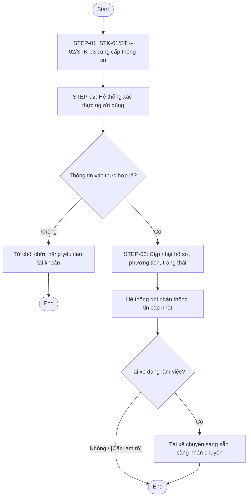
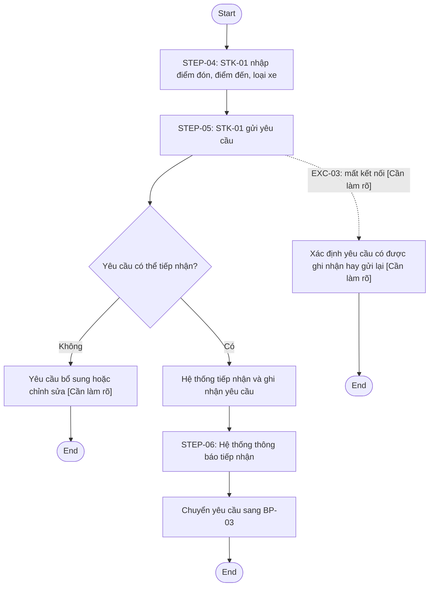
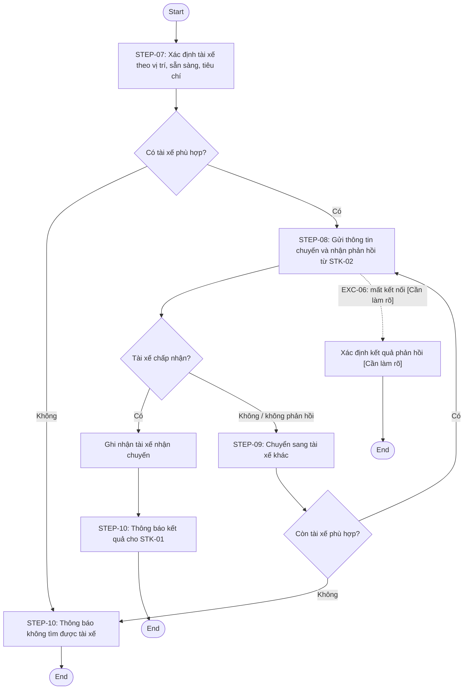
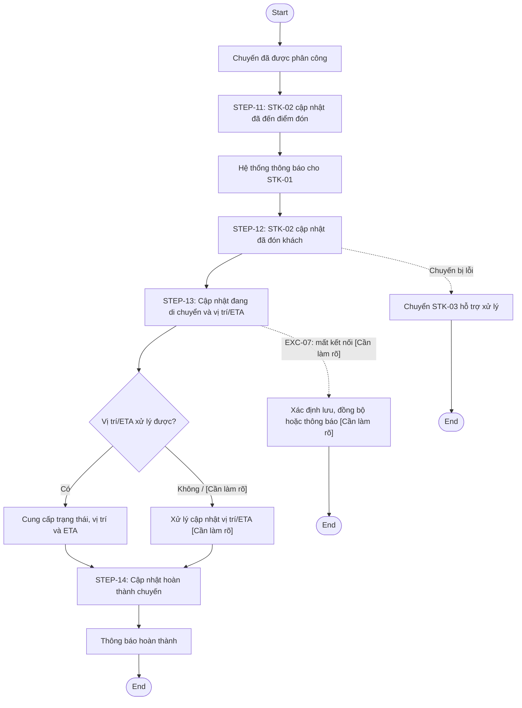
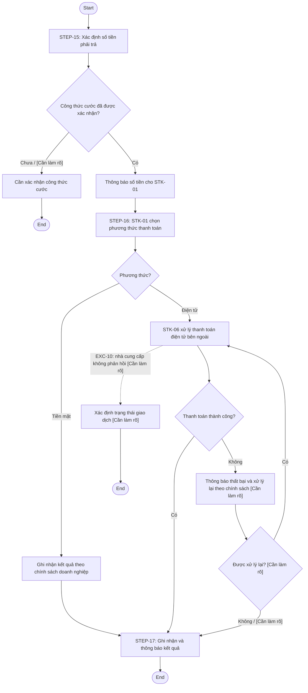
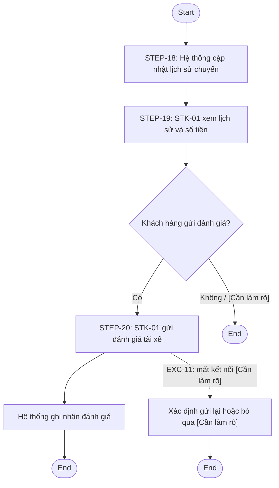
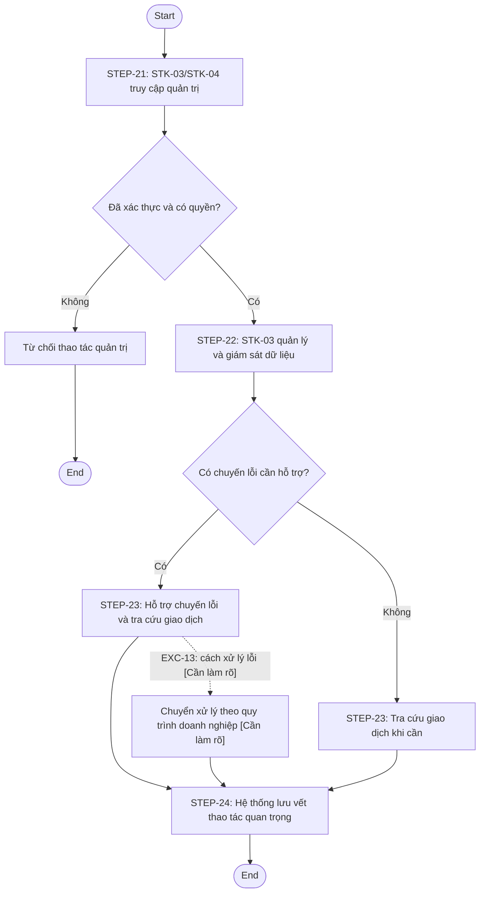
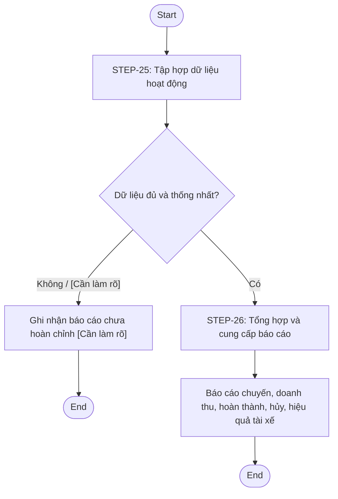
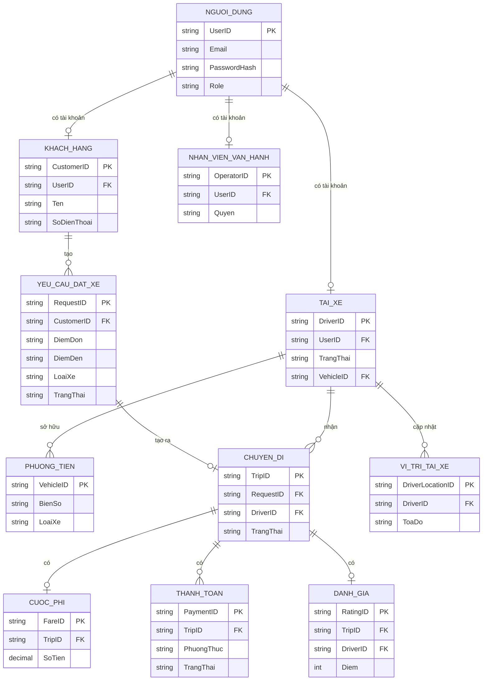
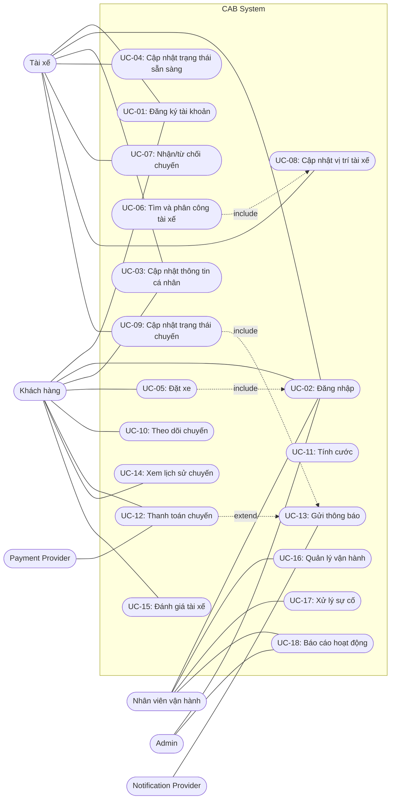

# Đặc tả yêu cầu phần mềm (SRS) - CAB System

> Tài liệu này gồm các kết quả phân tích yêu cầu từ bước 02 đến bước 18. Các phần đầu ghi nhận và chuẩn hóa nguồn yêu cầu; các phần sau lần lượt xác định phạm vi, BR, BP, FR, Business Rule, Exception, NFR, Data, Actor, Use Case, Acceptance Criteria, RTM và yêu cầu sẵn sàng cho API. Nội dung chưa được doanh nghiệp xác nhận được đánh dấu `[Cần làm rõ]` hoặc `[NEED CLARIFICATION]`, không được tự suy đoán.

## 1. Thông tin tổng quan dự án

| Nội dung                      | Thông tin                                                                                                                                                                        | Nguồn                                                                 |
| ----------------------------- | -------------------------------------------------------------------------------------------------------------------------------------------------------------------------------- | --------------------------------------------------------------------- |
| Tên dự án                     | CAB System - Nền tảng đặt xe                                                                                                                                                     | Tiêu đề: "Dự án xây dựng hệ thống CAB System - Nền tảng đặt xe"       |
| Tổ chức/khách hàng            | Công ty ABC, doanh nghiệp cung cấp dịch vụ đặt xe trực tuyến                                                                                                                     | "Công ty ABC là một doanh nghiệp cung cấp dịch vụ đặt xe trực tuyến." |
| Mục tiêu dự án                | Xây dựng một nền tảng CAB có thể phục vụ số lượng lớn khách hàng và tài xế, hỗ trợ quy trình đặt xe đến đánh giá, phối hợp vận hành và phát triển thêm tính năng trong tương lai | Phần mô tả hiện trạng và "Kỳ vọng của khách hàng"                     |
| Thời gian                     | 7 tuần xây dựng và triển khai sản phẩm                                                                                                                                           | "Thời gian xây dựng và triển khai sản phẩm 7 tuần"                    |
| Đối tượng sử dụng được đề cập | Khách hàng, tài xế, nhân viên vận hành; ban lãnh đạo là bên có nhu cầu báo cáo/giám sát                                                                                          | Phần mô tả nhóm người dùng và yêu cầu vận hành                        |
| Vấn đề hiện tại               | Phân công tài xế chủ yếu thủ công; khách hàng khó theo dõi trạng thái chuyến đi; thông tin thanh toán chưa tập trung; vận hành khó mở rộng hệ thống                              | Đoạn mô tả hạn chế của hệ thống hiện tại                              |
| Kỳ vọng chính                 | Nền tảng hoạt động ổn định khi nhu cầu tăng, có thể mở rộng độc lập và bổ sung dịch vụ, phương thức thanh toán, nhà cung cấp thông báo hoặc thành phần kỹ thuật                  | Các phần về kỳ vọng, ổn định, mở rộng và linh hoạt                    |
| Ràng buộc được đề cập         | Thời gian 7 tuần; không lưu dữ liệu nhạy cảm thanh toán trực tiếp; phải xác thực và phân quyền; phải lưu vết thao tác quan trọng; nhiều chính sách nghiệp vụ chưa chốt           | Các đoạn về thời gian, thanh toán, bảo mật và nội dung chưa chốt      |

## 2. Xác định vấn đề nghiệp vụ

| Problem ID | Vấn đề                                                | Nguyên nhân                                                   | Hậu quả                                                                                             | Bằng chứng trong file                                                                             |
| ---------- | ----------------------------------------------------- | ------------------------------------------------------------- | --------------------------------------------------------------------------------------------------- | ------------------------------------------------------------------------------------------------- |
| P-01       | Việc phân công tài xế chủ yếu được thực hiện thủ công | Hệ thống hiện tại phân công tài xế chủ yếu thủ công           | Khó mở rộng hoạt động; việc tìm và phân công tài xế cần được hỗ trợ tự động hơn                     | "việc phân công tài xế chủ yếu được thực hiện thủ công"; "gặp khó khăn khi muốn mở rộng hệ thống" |
| P-02       | Khách hàng khó theo dõi trạng thái chuyến đi          | Hệ thống hiện tại chưa đáp ứng tốt việc theo dõi trạng thái   | Khách hàng không thuận tiện biết quá trình tìm tài xế, tài xế nhận chuyến, ETA và trạng thái chuyến | "khách hàng khó theo dõi trạng thái chuyến đi"                                                    |
| P-03       | Thông tin thanh toán chưa được quản lý tập trung      | Hệ thống hiện tại quản lý thông tin thanh toán chưa tập trung | Việc tra cứu và quản lý giao dịch của doanh nghiệp gặp hạn chế                                      | "thông tin thanh toán chưa được quản lý tập trung"                                                |
| P-04       | Bộ phận vận hành gặp khó khăn khi mở rộng hệ thống    | Hệ thống hiện tại khó mở rộng                                 | Hoạt động vận hành và khả năng phục vụ số lượng lớn bị ảnh hưởng                                    | "bộ phận vận hành gặp khó khăn khi muốn mở rộng hệ thống"                                         |

## 3. Xác định nhu cầu khách hàng

Đây là nhu cầu gốc được trích xuất, chưa chuẩn hóa thành Business Requirement.

| Need ID | Nhu cầu                                                                                                   | Đối tượng được đề cập                                | Mức độ rõ ràng                                       | Nguồn                                                                             |
| ------- | --------------------------------------------------------------------------------------------------------- | ---------------------------------------------------- | ---------------------------------------------------- | --------------------------------------------------------------------------------- |
| NEED-01 | Có nền tảng CAB mới phục vụ số lượng lớn khách hàng và tài xế                                             | Doanh nghiệp/ban lãnh đạo                            | Rõ                                                   | "có khả năng phục vụ số lượng lớn khách hàng và tài xế"                           |
| NEED-02 | Khách hàng quản lý tài khoản, thông tin cá nhân, yêu cầu đặt xe và theo dõi chuyến đi                     | Khách hàng                                           | Rõ                                                   | Đoạn bắt đầu "Khách hàng cần đăng ký tài khoản..."                                |
| NEED-03 | Khách hàng biết tiến trình tìm tài xế, tài xế nhận chuyến, ETA và trạng thái chuyến                       | Khách hàng                                           | Rõ                                                   | Đoạn "Sau khi gửi yêu cầu..."                                                     |
| NEED-04 | Khách hàng xem lịch sử, số tiền phải trả và đánh giá tài xế                                               | Khách hàng                                           | Rõ                                                   | Đoạn yêu cầu của khách hàng                                                       |
| NEED-05 | Tài xế có tài khoản, hồ sơ, phương tiện và trạng thái hoạt động                                           | Tài xế, nhân viên vận hành                           | Rõ                                                   | Đoạn "Đối với tài xế..."                                                          |
| NEED-06 | Tài xế nhận thông báo chuyến phù hợp, chấp nhận hoặc từ chối, cập nhật trạng thái chuyến                  | Tài xế                                               | Rõ                                                   | Đoạn mô tả hoạt động của tài xế                                                   |
| NEED-07 | Lưu vị trí tài xế để hỗ trợ tìm tài xế gần khách hàng và cải thiện ETA                                    | Doanh nghiệp, tài xế                                 | Rõ                                                   | "Doanh nghiệp cũng muốn lưu thông tin vị trí của tài xế..."                       |
| NEED-08 | Tìm tài xế theo vị trí, trạng thái sẵn sàng và tiêu chí vận hành; tiếp tục tìm khi không phản hồi/từ chối | Hệ thống, khách hàng, tài xế                         | Rõ về nhu cầu, chưa rõ chính sách chi tiết           | Phần "Việc tìm tài xế là một yêu cầu quan trọng..."                               |
| NEED-09 | Thông báo rõ ràng khi không tìm được tài xế                                                               | Khách hàng                                           | Rõ                                                   | "Trong trường hợp không tìm được tài xế, khách hàng phải được thông báo rõ ràng." |
| NEED-10 | Tính cước sau chuyến và hỗ trợ tiền mặt hoặc thanh toán điện tử                                           | Khách hàng, doanh nghiệp                             | Rõ về nhu cầu, chưa rõ cách tính                     | Phần "Hệ thống cũng phải hỗ trợ thanh toán và tính cước."                         |
| NEED-11 | Tích hợp nhà cung cấp thanh toán bên ngoài mà không lưu thông tin nhạy cảm trực tiếp                      | Doanh nghiệp, nhà cung cấp thanh toán                | Rõ về mong muốn, chưa rõ nhà cung cấp/chính sách     | Đoạn về thanh toán điện tử                                                        |
| NEED-12 | Gửi thông báo cho khách hàng và tài xế về các sự kiện/chuyến đi                                           | Khách hàng, tài xế, doanh nghiệp                     | Rõ về sự kiện, chưa rõ kênh và chính sách gửi        | Phần "Thông báo là một thành phần quan trọng."                                    |
| NEED-13 | Nhân viên vận hành quản lý, giám sát, hỗ trợ chuyến lỗi và tra cứu giao dịch                              | Nhân viên vận hành                                   | Rõ                                                   | Phần "Về phía nhân viên vận hành..."                                              |
| NEED-14 | Phân quyền các chức năng quản trị nhạy cảm                                                                | Nhân viên vận hành, ban lãnh đạo                     | Rõ về nhu cầu, chưa rõ ma trận quyền                 | "Một số chức năng quản trị cần được phân quyền..."                                |
| NEED-15 | Có báo cáo về chuyến, doanh thu, hoàn thành, hủy và hiệu quả tài xế                                       | Ban lãnh đạo/doanh nghiệp                            | Rõ về nhóm báo cáo, chưa rõ định nghĩa và kỳ báo cáo | "Ban lãnh đạo cũng mong muốn có báo cáo..."                                       |
| NEED-16 | Hệ thống ổn định, mở rộng độc lập, lỗi cục bộ không làm dừng đặt xe                                       | Doanh nghiệp                                         | Rõ về định hướng, chưa rõ chỉ tiêu đo lường          | Phần về ổn định và mở rộng                                                        |
| NEED-17 | Bảo vệ dữ liệu, xác thực người dùng, kiểm soát quyền và lưu vết thao tác                                  | Khách hàng, tài xế, nhân viên vận hành, doanh nghiệp | Rõ về mong muốn, chưa rõ tiêu chuẩn/thời hạn         | Phần "Về bảo mật..."                                                              |
| NEED-18 | Kiến trúc linh hoạt cho dịch vụ, thanh toán, thông báo và thành phần kỹ thuật mới                         | Doanh nghiệp                                         | Rõ về định hướng, chưa rõ mức độ/ưu tiên             | Đoạn cuối yêu cầu khách hàng                                                      |

## 4. Ghi nhận nội dung liên quan đến phạm vi

Bảng này chỉ ghi nhận nội dung có dấu hiệu liên quan đến phạm vi, chưa kết luận trong/ngoài phạm vi.

| Scope Item ID | Nội dung được đề cập                                                                 | Bằng chứng                                | Ghi chú                                                                |
| ------------- | ------------------------------------------------------------------------------------ | ----------------------------------------- | ---------------------------------------------------------------------- |
| SCOPE-01      | Nền tảng đặt xe cho khách hàng, tài xế và vận hành                                   | "ít nhất ba nhóm người dùng chính"        | Có khả năng là phạm vi trung tâm; cần bước xác định phạm vi chính thức |
| SCOPE-02      | Quản lý tài khoản, hồ sơ, phương tiện và thông tin cá nhân                           | Các đoạn yêu cầu của khách hàng và tài xế | Có nhiều loại dữ liệu cần bảo vệ                                       |
| SCOPE-03      | Tạo yêu cầu, tìm/phân công tài xế và theo dõi chuyến                                 | Các đoạn về đặt xe và tìm tài xế          | Quy trình nghiệp vụ cốt lõi được mô tả                                 |
| SCOPE-04      | Lưu vị trí và hỗ trợ ETA                                                             | "lưu thông tin vị trí của tài xế"         | Có thể ảnh hưởng đáng kể đến dữ liệu và vận hành                       |
| SCOPE-05      | Tính cước, thanh toán tiền mặt và điện tử                                            | Phần thanh toán và tính cước              | Phụ thuộc nhà cung cấp thanh toán bên ngoài                            |
| SCOPE-06      | Thông báo đa sự kiện, có khả năng mở rộng kênh                                       | Phần thông báo                            | Kênh cụ thể chưa được nêu                                              |
| SCOPE-07      | Giao diện quản trị, xử lý chuyến lỗi, tra cứu giao dịch và báo cáo                   | Phần yêu cầu nhân viên vận hành           | Cần xác nhận mức độ chi tiết và quyền                                  |
| SCOPE-08      | Xác thực, phân quyền, bảo vệ dữ liệu và audit                                        | Phần bảo mật                              | Có thể là yêu cầu xuyên suốt toàn hệ thống                             |
| SCOPE-09      | Khả năng mở rộng độc lập, triển khai từng phần, bổ sung dịch vụ/thanh toán/thông báo | Các phần về ổn định và linh hoạt          | Có khả năng vượt phạm vi đồ án nhỏ                                     |

## 5. Ghi nhận các đối tượng được đề cập

| Object ID | Đối tượng                         | Vai trò/ngữ cảnh được mô tả                                                                                                       | Nguồn                                                |
| --------- | --------------------------------- | --------------------------------------------------------------------------------------------------------------------------------- | ---------------------------------------------------- |
| OBJ-01    | Khách hàng                        | Đăng ký, đăng nhập, quản lý thông tin, đặt và theo dõi xe, thanh toán, xem lịch sử, đánh giá                                      | Các đoạn mô tả nhu cầu khách hàng                    |
| OBJ-02    | Tài xế                            | Quản lý hồ sơ/phương tiện, sẵn sàng nhận chuyến, nhận/từ chối chuyến, cập nhật trạng thái và vị trí                               | Đoạn "Đối với tài xế..."                             |
| OBJ-03    | Nhân viên vận hành                | Tạo tài khoản tài xế, quản lý các đối tượng, giám sát, hỗ trợ chuyến lỗi, tra cứu giao dịch và thực hiện chức năng được cấp quyền | Phần "Về phía nhân viên vận hành..."                 |
| OBJ-04    | Ban lãnh đạo                      | Mong muốn hệ thống và báo cáo hoạt động, doanh thu, hoàn thành, hủy và hiệu quả tài xế                                            | Các đoạn về kỳ vọng và báo cáo                       |
| OBJ-05    | Công ty ABC/doanh nghiệp          | Chủ thể cung cấp dịch vụ, đặt ra mục tiêu, chính sách và yêu cầu vận hành                                                         | Toàn bộ tài liệu                                     |
| OBJ-06    | Nhà cung cấp thanh toán bên ngoài | Được tích hợp để xử lý thanh toán điện tử                                                                                         | "tích hợp với một nhà cung cấp thanh toán bên ngoài" |
| OBJ-07    | Nhà cung cấp thông báo            | Được nhắc đến như thành phần có thể bổ sung/thay đổi trong tương lai                                                              | "thêm nhà cung cấp thông báo"                        |

Ở thời điểm trích xuất ban đầu, các đối tượng chưa được phân loại thành Primary Actor, Supporting Actor hoặc External System và chưa xác định Use Case. Việc phân loại chính thức được thực hiện tại PHẦN 13.

## 6. Trích xuất các nội dung nghiệp vụ được mô tả

Các hoạt động dưới đây được ghi nhận ở mức nguyên bản, không phân rã thành Functional Requirement.

| Activity ID | Hoạt động/nghiệp vụ được đề cập                                                                             | Đối tượng liên quan                 | Mục đích được mô tả                    | Nguồn                       |
| ----------- | ----------------------------------------------------------------------------------------------------------- | ----------------------------------- | -------------------------------------- | --------------------------- |
| ACTV-01     | Khách hàng đăng ký tài khoản và đăng nhập                                                                   | Khách hàng                          | Sử dụng chức năng yêu cầu tài khoản    | Đoạn yêu cầu của khách hàng |
| ACTV-02     | Khách hàng cập nhật thông tin cá nhân                                                                       | Khách hàng                          | Quản lý thông tin cá nhân              | Đoạn yêu cầu của khách hàng |
| ACTV-03     | Khách hàng nhập điểm đón, điểm đến, chọn loại xe và gửi yêu cầu đặt xe                                      | Khách hàng                          | Tạo yêu cầu xe                         | Đoạn yêu cầu của khách hàng |
| ACTV-04     | Hệ thống tìm tài xế phù hợp và ưu tiên tài xế gần khách hàng                                                | Hệ thống, tài xế                    | Phân công tài xế                       | Phần tìm tài xế             |
| ACTV-05     | Tài xế nhận được thông báo và chấp nhận hoặc từ chối chuyến                                                 | Tài xế                              | Phản hồi yêu cầu chuyến                | Đoạn mô tả hoạt động tài xế |
| ACTV-06     | Hệ thống tiếp tục tìm tài xế khác khi tài xế không phản hồi hoặc từ chối                                    | Hệ thống, khách hàng                | Không buộc khách hàng tạo lại yêu cầu  | Phần tìm tài xế             |
| ACTV-07     | Tài xế cập nhật các trạng thái: đã đến, đã đón, đang di chuyển, hoàn thành                                  | Tài xế                              | Cập nhật tiến trình chuyến             | Đoạn mô tả hoạt động tài xế |
| ACTV-08     | Hệ thống lưu thông tin vị trí tài xế                                                                        | Hệ thống, tài xế                    | Hỗ trợ tìm tài xế gần và cải thiện ETA | Đoạn về vị trí tài xế       |
| ACTV-09     | Hệ thống tính số tiền phải trả sau khi chuyến hoàn thành                                                    | Hệ thống, khách hàng                | Xác định cước                          | Phần tính cước              |
| ACTV-10     | Khách hàng thanh toán bằng tiền mặt hoặc điện tử                                                            | Khách hàng, nhà cung cấp thanh toán | Hoàn tất thanh toán                    | Phần thanh toán             |
| ACTV-11     | Hệ thống thông báo kết quả khi thanh toán điện tử thành công/thất bại và cho phép xử lý lại theo chính sách | Hệ thống, khách hàng                | Xử lý kết quả thanh toán               | Phần thanh toán             |
| ACTV-12     | Hệ thống gửi thông báo về các sự kiện đặt xe và chuyến đi                                                   | Hệ thống, khách hàng, tài xế        | Cập nhật thông tin cho các bên         | Phần thông báo              |
| ACTV-13     | Khách hàng xem lịch sử, số tiền phải trả và đánh giá tài xế                                                 | Khách hàng                          | Theo dõi và phản hồi sau chuyến        | Đoạn yêu cầu của khách hàng |
| ACTV-14     | Nhân viên vận hành quản lý khách hàng, tài xế, phương tiện và chuyến đi                                     | Nhân viên vận hành                  | Vận hành hệ thống                      | Phần quản trị               |
| ACTV-15     | Nhân viên vận hành xem chuyến đang diễn ra, trạng thái tài xế, hỗ trợ chuyến lỗi và tra cứu giao dịch       | Nhân viên vận hành                  | Giám sát và hỗ trợ vận hành            | Phần quản trị               |
| ACTV-16     | Ban lãnh đạo sử dụng báo cáo hoạt động                                                                      | Ban lãnh đạo                        | Theo dõi hiệu quả kinh doanh/vận hành  | Phần báo cáo                |

## 7. Ghi nhận các ràng buộc và yêu cầu chất lượng được đề cập

| Constraint ID | Nội dung được đề cập                                                                                                                              | Nhóm                        | Mức độ rõ                                                | Nguồn                           |
| ------------- | ------------------------------------------------------------------------------------------------------------------------------------------------- | --------------------------- | -------------------------------------------------------- | ------------------------------- |
| CON-01        | Xây dựng và triển khai trong 7 tuần                                                                                                               | Ràng buộc thời gian         | Rõ                                                       | Tiêu đề yêu cầu                 |
| CON-02        | Phục vụ số lượng lớn khách hàng và tài xế                                                                                                         | Khả năng mở rộng            | Cần làm rõ chỉ tiêu số lượng/tải                         |
| CON-03        | Hoạt động ổn định vào thời điểm nhu cầu tăng cao                                                                                                  | Khả dụng/khả năng mở rộng   | Cần làm rõ mức tải và chỉ tiêu ổn định                   |
| CON-04        | Lỗi thanh toán hoặc thông báo không được làm toàn bộ hệ thống đặt xe ngừng hoạt động                                                              | Độ tin cậy/cô lập lỗi       | Rõ về mục tiêu, chưa rõ tiêu chí đo                      |
| CON-05        | Các thành phần có khả năng mở rộng độc lập khi tải tăng                                                                                           | Khả năng mở rộng            | Rõ về định hướng, chưa rõ thành phần/chỉ tiêu            |
| CON-06        | Chức năng mới triển khai từng phần, hạn chế ảnh hưởng chức năng đang hoạt động                                                                    | Khả năng triển khai/bảo trì | Rõ về định hướng, chưa rõ tiêu chí                       |
| CON-07        | Không lưu trực tiếp thông tin nhạy cảm của thẻ hoặc tài khoản thanh toán                                                                          | Bảo mật/thanh toán          | Rõ                                                       | Đoạn về nhà cung cấp thanh toán |
| CON-08        | Người dùng phải được xác thực trước khi dùng chức năng yêu cầu tài khoản                                                                          | Bảo mật/xác thực            | Rõ                                                       | Phần bảo mật                    |
| CON-09        | Thao tác quản trị phải được kiểm soát quyền truy cập                                                                                              | Bảo mật/phân quyền          | Rõ về mục tiêu, chưa rõ ma trận quyền                    |
| CON-10        | Thông tin cá nhân, phương tiện, vị trí và giao dịch phải được bảo vệ                                                                              | Bảo mật/dữ liệu             | Rõ về mục tiêu, chưa rõ tiêu chuẩn                       |
| CON-11        | Lưu vết các thao tác quan trọng để kiểm tra khi có sự cố                                                                                          | Logging/Audit               | Rõ về mục tiêu, chưa rõ loại thao tác và thời hạn        |
| CON-12        | Cho phép bổ sung dịch vụ, phương thức thanh toán, nhà cung cấp thông báo hoặc thay đổi thành phần kỹ thuật mà không xây dựng lại toàn bộ ứng dụng | Khả năng mở rộng/bảo trì    | Rõ về định hướng, chưa rõ tiêu chí                       |
| CON-13        | Có xử lý khi mất kết nối mạng                                                                                                                     | Độ tin cậy/vận hành         | Cần làm rõ; tài liệu chỉ nêu đây là chính sách chưa chốt |

Các nội dung sau không được nêu cụ thể trong yêu cầu: thời gian phản hồi, uptime, số người dùng đồng thời, cấu hình, công nghệ, tiêu chuẩn bảo mật, cơ chế backup/recovery, thời gian lưu trữ dữ liệu và kênh thông báo cụ thể.

## 8. Xác định thông tin chưa rõ

| Question ID | Nội dung chưa rõ                                 | Thông tin hiện tại                                                     | Tại sao cần làm rõ                                                      | Thành phần có thể ảnh hưởng                       |
| ----------- | ------------------------------------------------ | ---------------------------------------------------------------------- | ----------------------------------------------------------------------- | ------------------------------------------------- |
| Q-01        | Công thức tính cước                              | Chỉ biết dựa trên loại dịch vụ và thông tin chuyến đi                  | Xác định số tiền phải trả và báo cáo doanh thu                          | Nhu cầu, hoạt động, quy tắc nghiệp vụ, thanh toán |
| Q-02        | Tiêu chí ưu tiên tài xế                          | Có vị trí, trạng thái sẵn sàng và "một số tiêu chí vận hành khác"      | Xác định thứ tự tìm và phân công tài xế                                 | Nhu cầu, quy trình, quy tắc                       |
| Q-03        | Thời gian tài xế phải phản hồi                   | Chưa chốt                                                              | Xác định khi nào chuyển sang tài xế khác                                | Quy trình, ngoại lệ, thông báo                    |
| Q-04        | Chính sách hủy chuyến                            | Chưa chốt                                                              | Ảnh hưởng trạng thái, phí, báo cáo tỷ lệ hủy                            | Nhu cầu, quy tắc, thanh toán                      |
| Q-05        | Xử lý khi mất kết nối mạng                       | Chưa chốt                                                              | Ảnh hưởng cập nhật trạng thái, vị trí và giao tiếp với người dùng       | Quy trình, ngoại lệ, NFR                          |
| Q-06        | Thời gian lưu trữ dữ liệu                        | Chưa chốt                                                              | Ảnh hưởng dữ liệu lịch sử, giao dịch, vị trí và audit                   | Dữ liệu, bảo mật, vận hành                        |
| Q-07        | Nhà cung cấp thanh toán và chính sách retry      | Có nhà cung cấp bên ngoài; cách xử lý lại theo chính sách doanh nghiệp | Cần xác định tích hợp và cách xử lý giao dịch thất bại                  | Nhu cầu, ngoại lệ, hệ thống bên ngoài             |
| Q-08        | Kênh thông báo                                   | Muốn mở rộng thêm kênh nhưng chưa nêu kênh ban đầu                     | Ảnh hưởng nghiệp vụ thông báo và phạm vi tích hợp                       | Nhu cầu, hoạt động, hệ thống bên ngoài            |
| Q-09        | Định nghĩa ETA và dữ liệu vị trí                 | Muốn cải thiện thời gian dự kiến; chưa có độ chính xác/tần suất        | Ảnh hưởng theo dõi chuyến và vận hành                                   | Nhu cầu, dữ liệu, NFR                             |
| Q-10        | Ma trận quyền của nhân viên và ban lãnh đạo      | Chỉ biết một số thao tác nhạy cảm phải phân quyền                      | Cần phân biệt quyền xem, sửa và xử lý                                   | Nhu cầu, bảo mật, actor/use case                  |
| Q-11        | Định nghĩa báo cáo và kỳ báo cáo                 | Chỉ nêu các nhóm chỉ số                                                | Cần thống nhất cách tính chuyến, doanh thu, hoàn thành, hủy và hiệu quả | Nhu cầu, dữ liệu, báo cáo                         |
| Q-12        | Quy mô phục vụ và tải cao                        | Chỉ nêu "số lượng lớn" và thời điểm nhu cầu tăng cao                   | Cần xác định mức năng lực và kiểm thử                                   | Phạm vi, NFR, vận hành                            |
| Q-13        | Phạm vi chức năng trong 7 tuần và thứ tự ưu tiên | Đề bài yêu cầu nền tảng rộng nhưng không chia giai đoạn                | Cần lập kế hoạch và xác định nội dung bàn giao                          | Phạm vi, tiến độ, tất cả yêu cầu                  |
| Q-14        | Các loại dịch vụ/loại xe cụ thể                  | Có loại xe và loại dịch vụ nhưng chưa liệt kê                          | Ảnh hưởng đặt xe, cước và báo cáo                                       | Nhu cầu, dữ liệu, quy tắc                         |
| Q-15        | Tiêu chuẩn bảo vệ dữ liệu và audit               | Chỉ nêu dữ liệu phải được bảo vệ và thao tác phải lưu vết              | Cần xác định mức kiểm soát và thời hạn lưu                              | Bảo mật, dữ liệu, vận hành                        |

## 9. Kiểm tra tính nhất quán của tài liệu

Không phát hiện mâu thuẫn trực tiếp giữa các phần. Tuy nhiên có các nội dung chung chung hoặc phụ thuộc quyết định chưa có trong tài liệu:

| Issue ID | Nội dung                           | Phát hiện                                                                               | Cần xử lý                                                               |
| -------- | ---------------------------------- | --------------------------------------------------------------------------------------- | ----------------------------------------------------------------------- |
| I-01     | Phạm vi và tiến độ                 | Nền tảng được mô tả rất rộng trong khi thời gian xây dựng và triển khai là 7 tuần       | [Cần làm rõ] ưu tiên, giai đoạn bàn giao và tiêu chí hoàn thành         |
| I-02     | "Số lượng lớn" và nhu cầu tăng cao | Không có số lượng, tải, thời gian đáp ứng hoặc mức ổn định cụ thể                       | [Cần làm rõ] chỉ tiêu vận hành                                          |
| I-03     | Tính cước                          | Yêu cầu tính cước nhưng chưa có công thức/chính sách                                    | [Cần làm rõ] quy tắc tính và trường hợp đặc biệt                        |
| I-04     | Tìm tài xế                         | Có "một số tiêu chí vận hành khác" nhưng chưa liệt kê                                   | [Cần làm rõ] tiêu chí, trọng số và cách xử lý hòa                       |
| I-05     | Thanh toán thất bại                | Có yêu cầu cho phép xử lý lại theo chính sách nhưng chính sách chưa được cung cấp       | [Cần làm rõ] số lần, thời điểm và trạng thái giao dịch                  |
| I-06     | Thông báo                          | Sự kiện cần thông báo đã nêu nhưng kênh, thời điểm và đảm bảo gửi chưa nêu              | [Cần làm rõ] kênh và quy tắc gửi                                        |
| I-07     | Báo cáo                            | Các chỉ số được nêu nhưng chưa có định nghĩa tính toán                                  | [Cần làm rõ] nguồn dữ liệu và kỳ báo cáo                                |
| I-08     | Linh hoạt kiến trúc                | Kỳ vọng thay đổi thành phần kỹ thuật nhưng không nêu tiêu chí đánh giá                  | [Cần làm rõ] mức độ độc lập và ưu tiên                                  |
| I-09     | Chính sách chưa chốt               | Cước, ưu tiên tài xế, phản hồi, hủy, mất mạng và lưu trữ đều được xác nhận là chưa chốt | [Cần làm rõ với các bên liên quan] trước khi xây dựng các bước chi tiết |

## 10. Nội dung có khả năng vượt phạm vi đồ án nhỏ

Các mục dưới đây vẫn được giữ lại vì khách hàng đã yêu cầu; chỉ đánh dấu để bước xác định phạm vi xem xét.

| Item ID | Nội dung                                                                   | Lý do có khả năng vượt phạm vi đồ án                                         | Mức độ     |
| ------- | -------------------------------------------------------------------------- | ---------------------------------------------------------------------------- | ---------- |
| S-01    | Phục vụ số lượng lớn khách hàng và tài xế, ổn định khi cao điểm            | Đòi hỏi năng lực và kiểm thử tải đáng kể nhưng chưa có chỉ tiêu              | Cao        |
| S-02    | Tìm tài xế theo vị trí, ưu tiên và tiếp tục tìm khi từ chối/không phản hồi | Có logic điều phối, thời gian thực và nhiều ngoại lệ                         | Cao        |
| S-03    | Lưu vị trí và cải thiện ETA                                                | Có dữ liệu vị trí liên tục và yêu cầu xử lý định vị                          | Cao        |
| S-04    | Tích hợp thanh toán điện tử bên ngoài, retry khi thất bại                  | Phụ thuộc hệ thống/chính sách bên ngoài và yêu cầu bảo mật giao dịch         | Cao        |
| S-05    | Hệ thống thông báo có khả năng thêm nhiều kênh/nhà cung cấp                | Có nhiều sự kiện, kênh và phụ thuộc tích hợp                                 | Trung bình |
| S-06    | Quản trị, phân quyền, audit, hỗ trợ chuyến lỗi và báo cáo                  | Là một phân hệ vận hành tương đối rộng                                       | Cao        |
| S-07    | Cho phép thay đổi thành phần kỹ thuật và triển khai từng phần              | Là kỳ vọng xuyên suốt về khả năng mở rộng/bảo trì, có thể cần nhiều công sức | Cao        |
| S-08    | Toàn bộ chuỗi từ đặt xe đến thanh toán, đánh giá và phối hợp doanh nghiệp  | Bao phủ nhiều nhóm người dùng và nhiều nghiệp vụ trong 7 tuần                | Cao        |

## 11. Tổng hợp đầu vào cho bước phân tích tiếp theo

| Thành phần                                  | Số lượng |
| ------------------------------------------- | -------: |
| Thông tin tổng quan                         |        8 |
| Problem                                     |        4 |
| Need                                        |       18 |
| Scope Item được đề cập                      |        9 |
| Đối tượng được đề cập                       |        7 |
| Hoạt động/nghiệp vụ được đề cập             |       16 |
| Ràng buộc/yêu cầu chất lượng được đề cập    |       13 |
| Vấn đề cần làm rõ                           |       15 |
| Mâu thuẫn/phát hiện                         |        9 |
| Nội dung có khả năng vượt phạm vi đồ án nhỏ |        8 |

## 12. Kết luận

### 12.1. Mục tiêu hệ thống được tài liệu mô tả

Xây dựng nền tảng CAB mới cho Công ty ABC, hỗ trợ quy trình từ tạo yêu cầu đặt xe, tìm và phân công tài xế, thực hiện chuyến, tính cước, thanh toán, thông báo đến đánh giá; đồng thời hỗ trợ vận hành, báo cáo và phát triển thêm trong tương lai.

### 12.2. Các vấn đề nghiệp vụ chính

Phân công tài xế còn thủ công; khách hàng khó theo dõi chuyến; thanh toán chưa tập trung; bộ phận vận hành khó mở rộng hệ thống.

### 12.3. Các nhu cầu chính

Nhu cầu tập trung vào đặt xe và theo dõi chuyến, điều phối tài xế theo vị trí, tính cước và thanh toán, thông báo, quản trị vận hành, báo cáo, bảo mật, khả năng chịu tải và khả năng mở rộng lâu dài.

### 12.4. Các nghiệp vụ/hoạt động được đề cập

Đăng ký/đăng nhập; quản lý hồ sơ; tạo yêu cầu; tìm và nhận/từ chối chuyến; cập nhật trạng thái/vị trí; tính cước; thanh toán; thông báo; lịch sử và đánh giá; quản trị; giám sát; hỗ trợ chuyến lỗi; tra cứu giao dịch; báo cáo.

### 12.5. Các đối tượng được đề cập

Khách hàng, tài xế, nhân viên vận hành, ban lãnh đạo, Công ty ABC/doanh nghiệp, nhà cung cấp thanh toán bên ngoài và nhà cung cấp thông báo.

### 12.6. Các điểm chưa rõ cần xác nhận

Công thức cước; tiêu chí và thời gian tìm tài xế; chính sách hủy; xử lý mất mạng; thời gian lưu trữ; nhà cung cấp và retry thanh toán; kênh thông báo; ETA/vị trí; ma trận quyền; định nghĩa báo cáo; quy mô tải; ưu tiên triển khai; loại xe/dịch vụ và tiêu chuẩn bảo mật/audit.

### 12.7. Các nội dung có khả năng vượt phạm vi đồ án nhỏ

Điều phối tài xế theo vị trí và thời gian thực, ETA, tải cao, thanh toán điện tử, thông báo đa kênh, quản trị/báo cáo đầy đủ và mục tiêu thay đổi thành phần kỹ thuật/triển khai từng phần đều có khả năng vượt phạm vi đồ án nhỏ. Đây là cảnh báo quy mô, không phải kết luận loại khỏi phạm vi.

## Giới hạn của bước phân tích

Tài liệu này không tự xác định phạm vi chính thức, Business Requirement, Business Process, Functional Requirement, Business Rule/Exception, Non-Functional Requirement, Data Model, Actor/Use Case, Use Case Specification, Acceptance Criteria, RTM, Database, Architecture hoặc Code. Các nội dung tương ứng cần được thực hiện ở các bước tiếp theo của quy trình BA.

---

# BƯỚC 03 - XÁC ĐỊNH STAKEHOLDER

> Phần này được thực hiện dựa trên kết quả bước 02 trong tài liệu này và yêu cầu khách hàng CAB System. Đây là phân tích bên liên quan, chưa phải xác định Actor chính thức, Scope, BR, FR, Business Rule hoặc Use Case.

## I. Xác định Stakeholder

| Stakeholder ID | Stakeholder                       | Loại                        | Mối liên quan với hệ thống                                                                               | Nguồn                                                        | Trạng thái                                     |
| -------------- | --------------------------------- | --------------------------- | -------------------------------------------------------------------------------------------------------- | ------------------------------------------------------------ | ---------------------------------------------- |
| STK-01         | Khách hàng                        | Người sử dụng               | Sử dụng dịch vụ đặt xe; cung cấp thông tin đặt chuyến, nhận trạng thái/thông báo, thanh toán và đánh giá | OBJ-01; NEED-02, NEED-03, NEED-04, NEED-10, NEED-12          | Đã xác định trực tiếp                          |
| STK-02         | Tài xế                            | Người sử dụng               | Cung cấp thông tin hồ sơ/phương tiện/vị trí; nhận, từ chối và thực hiện chuyến; cập nhật trạng thái      | OBJ-02; NEED-05, NEED-06, NEED-07, NEED-12                   | Đã xác định trực tiếp                          |
| STK-03         | Nhân viên vận hành                | Nhân viên/đơn vị vận hành   | Quản lý dữ liệu vận hành, giám sát chuyến và tài xế, hỗ trợ chuyến lỗi, tra cứu giao dịch                | OBJ-03; NEED-05, NEED-13, NEED-14, NEED-17                   | Đã xác định trực tiếp                          |
| STK-04         | Ban lãnh đạo                      | Quản lý/người ra quyết định | Quan tâm đến báo cáo chuyến, doanh thu, tỷ lệ hoàn thành, tỷ lệ hủy và hiệu quả tài xế                   | OBJ-04; NEED-01, NEED-15, NEED-16, NEED-18                   | Đã xác định trực tiếp                          |
| STK-05         | Công ty ABC/doanh nghiệp          | Chủ doanh nghiệp            | Cung cấp dịch vụ, đặt mục tiêu, chính sách, yêu cầu vận hành, bảo mật và định hướng phát triển nền tảng  | OBJ-05; NEED-01, NEED-08, NEED-11, NEED-16, NEED-17, NEED-18 | Đã xác định trực tiếp                          |
| STK-06         | Nhà cung cấp thanh toán bên ngoài | Đối tác/hệ thống bên ngoài  | Được tích hợp để xử lý thanh toán điện tử; chi tiết tích hợp và trách nhiệm chưa rõ                      | OBJ-06; NEED-10, NEED-11                                     | Đã xác định trực tiếp; [Cần làm rõ]            |
| STK-07         | Nhà cung cấp thông báo            | Đối tác/hệ thống bên ngoài  | Được đề cập như nhà cung cấp có thể bổ sung trong tương lai; vai trò cụ thể chưa được xác định           | OBJ-07; NEED-12, NEED-18                                     | [Suy ra] từ định hướng tương lai; [Cần làm rõ] |

Không bổ sung stakeholder mới ngoài các đối tượng đã được nêu hoặc có cơ sở trực tiếp trong bước 02.

## II. Phân tích Stakeholder

| Stakeholder ID | Vai trò/liên quan                                                      | Mối quan tâm                                                                 | Lợi ích/mục tiêu được thể hiện                                                | Ảnh hưởng    | Nguồn                                                  |
| -------------- | ---------------------------------------------------------------------- | ---------------------------------------------------------------------------- | ----------------------------------------------------------------------------- | ------------ | ------------------------------------------------------ |
| STK-01         | Đặt và theo dõi chuyến, thanh toán, đánh giá                           | Biết trạng thái tìm tài xế/chuyến, số tiền phải trả và kết quả thanh toán    | Đặt xe và theo dõi toàn bộ chuyến thuận tiện hơn                              | Cao          | OBJ-01; NEED-02 đến NEED-04, NEED-09, NEED-10, NEED-12 |
| STK-02         | Nhận và thực hiện chuyến, cập nhật hồ sơ/phương tiện/trạng thái/vị trí | Nhận được chuyến phù hợp và cập nhật đúng tiến trình                         | Tham gia cung cấp dịch vụ và hỗ trợ tìm tài xế gần khách hàng                 | Cao          | OBJ-02; NEED-05 đến NEED-08, NEED-12                   |
| STK-03         | Vận hành, giám sát và hỗ trợ                                           | Quản lý chuyến/tài xế, xử lý chuyến lỗi, tra cứu giao dịch và quyền quản trị | Theo dõi và hỗ trợ hoạt động dịch vụ                                          | Cao          | OBJ-03; NEED-13, NEED-14, NEED-17                      |
| STK-04         | Quản lý/giám sát ở cấp doanh nghiệp                                    | Báo cáo hoạt động, doanh thu, hoàn thành, hủy và hiệu quả tài xế             | Có dữ liệu để theo dõi hoạt động                                              | Cao          | OBJ-04; NEED-15, NEED-16                               |
| STK-05         | Chủ thể cung cấp và định hướng dịch vụ                                 | Khả năng phục vụ lớn, ổn định, bảo mật, mở rộng và phát triển lâu dài        | Nền tảng CAB đáp ứng hoạt động hiện tại và thay đổi tương lai                 | Cao          | OBJ-05; NEED-01, NEED-08, NEED-11, NEED-16 đến NEED-18 |
| STK-06         | Xử lý thanh toán điện tử bên ngoài                                     | Kết quả giao dịch và cách xử lý khi thất bại                                 | [Cần làm rõ] Chưa có thông tin trực tiếp về mục tiêu/lợi ích của nhà cung cấp | [Cần làm rõ] | OBJ-06; NEED-10, NEED-11                               |
| STK-07         | Cung cấp kênh thông báo trong tương lai                                | Khả năng thêm nhà cung cấp/kênh thông báo                                    | [Cần làm rõ] Chưa có thông tin trực tiếp về mục tiêu/lợi ích                  | [Cần làm rõ] | OBJ-07; NEED-12, NEED-18                               |

Mức độ ảnh hưởng được đánh dấu “Cần làm rõ” khi nguồn chưa mô tả quyền quyết định, quyền kiểm soát hoặc mục tiêu của đối tượng; không tự suy đoán thay nguồn.

## III. Phân tích mức độ tham gia

| Stakeholder ID | Mức độ tham gia   | Hình thức liên quan                                                                           | Nguồn                                                  |
| -------------- | ----------------- | --------------------------------------------------------------------------------------------- | ------------------------------------------------------ |
| STK-01         | Cao               | Sử dụng dịch vụ, cung cấp yêu cầu/chọn thông tin chuyến, nhận kết quả, thanh toán và đánh giá | OBJ-01; ACTV-01 đến ACTV-03, ACTV-09 đến ACTV-13       |
| STK-02         | Cao               | Cung cấp hồ sơ/phương tiện/vị trí, nhận thông báo, phản hồi chuyến và cập nhật tiến trình     | OBJ-02; ACTV-05, ACTV-07, ACTV-08, ACTV-12             |
| STK-03         | Cao               | Quản lý nghiệp vụ, giám sát, hỗ trợ và tra cứu thông tin vận hành                             | OBJ-03; ACTV-14, ACTV-15                               |
| STK-04         | Trung bình        | Nhận kết quả báo cáo và giám sát hoạt động                                                    | OBJ-04; ACTV-16                                        |
| STK-05         | Cao               | Quản lý/định hướng nghiệp vụ, cung cấp chính sách và nhận kết quả vận hành                    | OBJ-05; NEED-01, NEED-08, NEED-11, NEED-15 đến NEED-18 |
| STK-06         | [Cần làm rõ]      | Cung cấp dịch vụ xử lý thanh toán điện tử theo nội dung được đề cập                           | OBJ-06; NEED-11                                        |
| STK-07         | Thấp/[Cần làm rõ] | Có thể cung cấp kênh thông báo khi được bổ sung trong tương lai                               | OBJ-07; NEED-18                                        |

Chưa có cơ sở xác định stakeholder nào có quyền phê duyệt cụ thể. Quyền hạn của nhân viên vận hành, ban lãnh đạo và các đối tác cần được xác nhận.

## IV. Ma trận Stakeholder tổng quan

| Stakeholder | Mối quan tâm chính                                | Ảnh hưởng    | Tham gia          | Nhu cầu liên quan                                             |
| ----------- | ------------------------------------------------- | ------------ | ----------------- | ------------------------------------------------------------- |
| STK-01      | Đặt xe, theo dõi, thanh toán, đánh giá            | Cao          | Cao               | NEED-02, NEED-03, NEED-04, NEED-09, NEED-10, NEED-12          |
| STK-02      | Nhận/thực hiện chuyến, hồ sơ, phương tiện, vị trí | Cao          | Cao               | NEED-05, NEED-06, NEED-07, NEED-08, NEED-12                   |
| STK-03      | Quản lý và hỗ trợ vận hành                        | Cao          | Cao               | NEED-05, NEED-13, NEED-14, NEED-17                            |
| STK-04      | Báo cáo và giám sát hiệu quả                      | Cao          | Trung bình        | NEED-01, NEED-15, NEED-16                                     |
| STK-05      | Mục tiêu kinh doanh, ổn định, bảo mật, mở rộng    | Cao          | Cao               | NEED-01, NEED-08, NEED-11, NEED-15, NEED-16, NEED-17, NEED-18 |
| STK-06      | Xử lý thanh toán điện tử                          | [Cần làm rõ] | [Cần làm rõ]      | NEED-10, NEED-11                                              |
| STK-07      | Mở rộng nhà cung cấp/kênh thông báo               | [Cần làm rõ] | Thấp/[Cần làm rõ] | NEED-12, NEED-18                                              |

Ma trận trên chỉ liên kết các NEED đã có ở bước 02, không tạo NEED mới và không gán Scope.

## V. Ma trận Stakeholder × Nhu cầu

Quy ước: **✓** liên quan trực tiếp; **○** liên quan gián tiếp; **?** chưa đủ thông tin; **—** chưa có cơ sở xác định.

| Stakeholder                     | NEED-01 | NEED-02 | NEED-03 | NEED-04 | NEED-05 | NEED-06 | NEED-07 | NEED-08 | NEED-09 | NEED-10 | NEED-11 | NEED-12 | NEED-13 | NEED-14 | NEED-15 | NEED-16 | NEED-17 | NEED-18 |
| ------------------------------- | ------- | ------- | ------- | ------- | ------- | ------- | ------- | ------- | ------- | ------- | ------- | ------- | ------- | ------- | ------- | ------- | ------- | ------- |
| STK-01 Khách hàng               | ○       | ✓       | ✓       | ✓       | —       | —       | —       | ○       | ✓       | ✓       | ○       | ✓       | —       | —       | ○       | ○       | ○       | ○       |
| STK-02 Tài xế                   | ○       | —       | ○       | ○       | ✓       | ✓       | ✓       | ✓       | —       | —       | —       | ✓       | —       | —       | ○       | ○       | ○       | ○       |
| STK-03 Nhân viên vận hành       | ○       | ○       | ○       | ○       | ✓       | ○       | ✓       | ✓       | ○       | ○       | ○       | ✓       | ✓       | ✓       | ○       | ○       | ✓       | ○       |
| STK-04 Ban lãnh đạo             | ✓       | —       | —       | —       | —       | —       | —       | ○       | —       | ○       | ○       | ○       | ○       | ○       | ✓       | ✓       | ○       | ✓       |
| STK-05 Công ty ABC/doanh nghiệp | ✓       | ○       | ○       | ○       | ○       | ○       | ✓       | ✓       | ✓       | ✓       | ✓       | ✓       | ✓       | ✓       | ✓       | ✓       | ✓       | ✓       |
| STK-06 Nhà cung cấp thanh toán  | —       | —       | —       | —       | —       | —       | —       | —       | —       | ✓       | ✓       | ○       | —       | —       | ○       | —       | ✓       | —       |
| STK-07 Nhà cung cấp thông báo   | —       | —       | —       | —       | —       | —       | —       | —       | —       | —       | —       | ✓       | —       | —       | —       | ○       | —       | ✓       |

Các ô “○” phản ánh mối quan tâm hoặc ảnh hưởng gián tiếp được thể hiện qua vai trò/ngữ cảnh; các ô “—” nghĩa là chưa có cơ sở xác định liên quan trong nguồn.

## VI. Kiểm tra Stakeholder với Actor

Đây chỉ là kiểm tra sơ bộ, chưa xác định Actor chính thức.

| Stakeholder                     | Có khả năng trực tiếp tương tác hệ thống? | Cơ sở                                                                           | Trạng thái       |
| ------------------------------- | ----------------------------------------- | ------------------------------------------------------------------------------- | ---------------- |
| STK-01 Khách hàng               | Có                                        | Đăng ký/đăng nhập, đặt xe, theo dõi, thanh toán, xem lịch sử và đánh giá        | [Ứng viên Actor] |
| STK-02 Tài xế                   | Có                                        | Nhận/từ chối chuyến, cập nhật trạng thái và vị trí                              | [Ứng viên Actor] |
| STK-03 Nhân viên vận hành       | Có                                        | Quản lý, giám sát, hỗ trợ và tra cứu qua giao diện quản trị                     | [Ứng viên Actor] |
| STK-04 Ban lãnh đạo             | ?                                         | Có nhu cầu báo cáo nhưng chưa nêu trực tiếp cách nhận hoặc sử dụng báo cáo      | [Cần làm rõ]     |
| STK-05 Công ty ABC/doanh nghiệp | ?                                         | Là chủ thể đặt mục tiêu và chính sách, chưa đủ thông tin về tương tác trực tiếp | [Cần làm rõ]     |
| STK-06 Nhà cung cấp thanh toán  | ?                                         | Có tích hợp bên ngoài nhưng chưa mô tả cách tương tác cụ thể                    | [Cần làm rõ]     |
| STK-07 Nhà cung cấp thông báo   | ?                                         | Chỉ được đề cập như khả năng bổ sung trong tương lai                            | [Cần làm rõ]     |

## VII. Stakeholder cần làm rõ

| Question ID | Stakeholder            | Nội dung chưa rõ                                                                          | Tại sao cần làm rõ                                          | Ảnh hưởng           |
| ----------- | ---------------------- | ----------------------------------------------------------------------------------------- | ----------------------------------------------------------- | ------------------- |
| Q-STK-01    | STK-05, STK-04         | Ai là người phê duyệt công thức cước, ưu tiên tài xế, hủy chuyến và retry thanh toán?     | Xác định chủ thể quyết định nghiệp vụ                       | Scope/BR/BP/FR      |
| Q-STK-02    | STK-03, STK-05         | Vai trò, quyền hạn và ma trận phân quyền của nhân viên vận hành/ban lãnh đạo              | Tránh gán quyền không có nguồn                              | Scope/BR/FR/UC      |
| Q-STK-03    | STK-06                 | Nhà cung cấp thanh toán nào, trách nhiệm mỗi bên và cách phối hợp khi giao dịch thất bại? | Xác định quan hệ với hệ thống bên ngoài                     | BR/BP/FR/Exception  |
| Q-STK-04    | STK-07                 | Kênh và nhà cung cấp thông báo ban đầu/tương lai là gì?                                   | Làm rõ bên nhận/cung cấp thông tin và phạm vi tích hợp      | Scope/BR/FR         |
| Q-STK-05    | STK-04, STK-05         | Ai sử dụng báo cáo, định nghĩa chỉ số và tần suất báo cáo?                                | Xác định nhu cầu giám sát và dữ liệu đầu ra                 | BR/BP/FR            |
| Q-STK-06    | STK-01, STK-02, STK-03 | Cơ chế phối hợp khi mất mạng và bên chịu trách nhiệm xử lý                                | Xác định trách nhiệm trong ngoại lệ vận hành                | BP/FR/Exception/NFR |
| Q-STK-07    | STK-05                 | Ưu tiên chức năng nào trong thời hạn xây dựng và triển khai 7 tuần?                       | Có thể ảnh hưởng trực tiếp đến phạm vi và kế hoạch bàn giao | Scope/BR            |

## VIII. Kiểm tra tính nhất quán

| Issue ID | Nội dung                    | Phát hiện                                                                                          | Cần xử lý                                               |
| -------- | --------------------------- | -------------------------------------------------------------------------------------------------- | ------------------------------------------------------- |
| I-STK-01 | Công ty ABC và ban lãnh đạo | Đều có vai trò định hướng/mục tiêu nhưng nguồn chưa phân biệt rõ quyền quyết định của từng bên     | [Cần làm rõ] vai trò và quyền phê duyệt                 |
| I-STK-02 | Nhà cung cấp thanh toán     | Được nêu là bên tích hợp nhưng chưa có tên, trách nhiệm hoặc cơ chế phối hợp                       | [Cần làm rõ] trước khi xác định tương tác chi tiết      |
| I-STK-03 | Nhà cung cấp thông báo      | Chỉ được nhắc đến ở tương lai, chưa đủ dữ liệu để xác nhận stakeholder tham gia hiện tại           | [Cần làm rõ] trạng thái và vai trò                      |
| I-STK-04 | Ban lãnh đạo                | Có nhu cầu báo cáo nhưng chưa biết có trực tiếp sử dụng hệ thống hay chỉ nhận kết quả              | [Cần làm rõ] để phân biệt stakeholder và ứng viên Actor |
| I-STK-05 | Nhân viên vận hành          | Có yêu cầu phân quyền nhưng chưa có nhóm quyền hoặc quyền nhạy cảm cụ thể                          | [Cần làm rõ] ma trận quyền                              |
| I-STK-06 | Quy mô và 7 tuần            | Mục tiêu phục vụ lớn/phát triển lâu dài liên quan nhiều stakeholder nhưng chưa có ưu tiên bàn giao | [Cần làm rõ] ảnh hưởng Scope/BR                         |

Không phát hiện hai stakeholder chắc chắn là cùng một đối tượng. “Công ty ABC/doanh nghiệp” là tổ chức, còn “ban lãnh đạo” và “nhân viên vận hành” là các nhóm người được mô tả trong tổ chức; quyền phân biệt cụ thể vẫn cần xác nhận.

## IX. Tổng hợp

| Thành phần                                     | Số lượng |
| ---------------------------------------------- | -------: |
| Tổng số Stakeholder                            |        7 |
| Stakeholder xác định trực tiếp                 |        6 |
| Stakeholder [Suy ra]                           |        1 |
| Stakeholder [Cần làm rõ]                       |        4 |
| Stakeholder có khả năng là Actor               |        3 |
| Stakeholder không trực tiếp tương tác hệ thống |        0 |
| Vấn đề cần làm rõ                              |        7 |
| Mâu thuẫn/phát hiện                            |        6 |

Lưu ý: một stakeholder có thể vừa được xác định trực tiếp vừa còn một số thuộc tính cần làm rõ; vì vậy các nhóm thống kê trên không loại trừ lẫn nhau.

## X. Kết luận bước 03

### 1. Stakeholder chính

Khách hàng, tài xế, nhân viên vận hành, ban lãnh đạo và Công ty ABC/doanh nghiệp là các stakeholder chính vì được mô tả trực tiếp và có lợi ích/ảnh hưởng rõ đối với hoạt động CAB.

### 2. Stakeholder phụ

Nhà cung cấp thanh toán bên ngoài là đối tác/hệ thống bên ngoài được đề cập trực tiếp. Nhà cung cấp thông báo được ghi nhận là stakeholder [Suy ra] do chỉ xuất hiện trong định hướng bổ sung tương lai.

### 3. Stakeholder có khả năng là Actor

Khách hàng, tài xế và nhân viên vận hành là các ứng viên Actor vì nguồn mô tả hoạt động tương tác trực tiếp. Ban lãnh đạo, Công ty ABC và hai nhà cung cấp vẫn cần làm rõ trước khi xác định Actor chính thức.

### 4. Stakeholder cần làm rõ

Vai trò/quyền quyết định của Công ty ABC và ban lãnh đạo; quyền của nhân viên vận hành; trách nhiệm của nhà cung cấp thanh toán; trạng thái và vai trò của nhà cung cấp thông báo.

### 5. Lưu ý cho bước Phạm vi

Các stakeholder liên quan đến điều phối tài xế, vị trí/ETA, thanh toán, thông báo, quản trị, báo cáo, bảo mật và khả năng mở rộng có thể làm phạm vi rộng. Bước này không kết luận nội dung nào trong hoặc ngoài phạm vi.

### 6. Lưu ý cho bước Business Requirement

Các BR tiếp theo cần phản ánh lợi ích và mối quan tâm của khách hàng, tài xế, vận hành, ban lãnh đạo/doanh nghiệp và các đối tác bên ngoài; đồng thời cần xác nhận chủ thể quyết định chính sách trước khi chuẩn hóa yêu cầu.

## Giới hạn của bước 03

Bước này chỉ thực hiện: **Nguồn yêu cầu → Stakeholder**. Chưa thực hiện chính thức phân loại phạm vi, Business Requirement, Business Process, Functional Requirement, Business Rule, Exception, Non-Functional Requirement, Data Model, Actor, Use Case, Acceptance Criteria, RTM, Database, Architecture, API hoặc Code.

---

# BƯỚC 04 - XÁC ĐỊNH PHẠM VI HỆ THỐNG

> Phạm vi dưới đây được xác định từ các NEED ở bước 02, Stakeholder ở bước 03 và yêu cầu khách hàng CAB System. Đây là phạm vi ở mức nhóm nghiệp vụ, dữ liệu và ranh giới trách nhiệm; chưa chuyển hóa thành BR, BP chi tiết, FR, Use Case hoặc thiết kế kỹ thuật.

## I. Mục tiêu và ranh giới hệ thống

CAB System được xây dựng để hỗ trợ dịch vụ đặt xe trực tuyến của Công ty ABC, từ lúc khách hàng tạo yêu cầu đến tìm/phân công tài xế, thực hiện chuyến, tính cước, thanh toán, thông báo và đánh giá sau chuyến. Hệ thống đồng thời hỗ trợ nhân viên vận hành quản lý, giám sát, xử lý chuyến lỗi, tra cứu giao dịch và cung cấp báo cáo cho doanh nghiệp/ban lãnh đạo.

Hệ thống chịu trách nhiệm xử lý và quản lý các thông tin, trạng thái, kết quả và thông báo thuộc các nghiệp vụ trên. Khách hàng, tài xế và nhân viên vận hành chịu trách nhiệm cung cấp thông tin hoặc thực hiện các hoạt động tương ứng như được mô tả trong yêu cầu. Nhà cung cấp thanh toán bên ngoài chịu trách nhiệm xử lý thanh toán điện tử ở phía dịch vụ bên ngoài; chi tiết phân chia trách nhiệm cần xác nhận.

## II. Đối tượng trong phạm vi

| ID     | Đối tượng/Stakeholder             | Vai trò trong phạm vi                                                            | Cơ sở                                                | Trạng thái                                            |
| ------ | --------------------------------- | -------------------------------------------------------------------------------- | ---------------------------------------------------- | ----------------------------------------------------- |
| STK-01 | Khách hàng                        | Sử dụng dịch vụ đặt xe, theo dõi chuyến, thanh toán, xem lịch sử và đánh giá     | NEED-02, NEED-03, NEED-04, NEED-09, NEED-10, NEED-12 | [Đã xác nhận]                                         |
| STK-02 | Tài xế                            | Cung cấp hồ sơ/phương tiện/vị trí, nhận hoặc từ chối chuyến, cập nhật tiến trình | NEED-05, NEED-06, NEED-07, NEED-08, NEED-12          | [Đã xác nhận]                                         |
| STK-03 | Nhân viên vận hành                | Quản lý khách hàng, tài xế, phương tiện, chuyến đi; giám sát, hỗ trợ và tra cứu  | NEED-13, NEED-14, NEED-17                            | [Đã xác nhận]                                         |
| STK-04 | Ban lãnh đạo                      | Nhận và sử dụng thông tin báo cáo để theo dõi hoạt động                          | NEED-15; OBJ-04                                      | [Đã xác nhận về nhu cầu, cách tương tác cần xác nhận] |
| STK-05 | Công ty ABC/doanh nghiệp          | Chủ thể cung cấp dịch vụ, đặt mục tiêu, chính sách và định hướng phát triển      | NEED-01, NEED-16, NEED-17, NEED-18                   | [Đã xác nhận]                                         |
| STK-06 | Nhà cung cấp thanh toán bên ngoài | Tham gia xử lý thanh toán điện tử                                                | NEED-10, NEED-11; OBJ-06                             | [Đã xác nhận có phụ thuộc, chi tiết cần xác nhận]     |
| STK-07 | Nhà cung cấp thông báo            | Có thể cung cấp kênh thông báo bổ sung trong tương lai                           | NEED-12, NEED-18; OBJ-07                             | [Cần xác nhận]                                        |

Chưa phân loại các đối tượng trên thành Primary Actor/Supporting Actor; Actor chính thức sẽ được xác định ở bước 13.

## III. Nhóm chức năng/nghiệp vụ trong phạm vi

| Scope-F ID | Nhóm chức năng/nghiệp vụ                        | Mục đích                                                                                                  | Cơ sở                                                   | Trạng thái                                                        |
| ---------- | ----------------------------------------------- | --------------------------------------------------------------------------------------------------------- | ------------------------------------------------------- | ----------------------------------------------------------------- |
| S-F01      | Quản lý tài khoản và hồ sơ khách hàng           | Đăng ký, đăng nhập và cập nhật thông tin cá nhân                                                          | NEED-02; ACTV-01, ACTV-02                               | [Đã xác nhận]                                                     |
| S-F02      | Tạo yêu cầu đặt xe                              | Nhập điểm đón, điểm đến, chọn loại xe và gửi yêu cầu                                                      | NEED-02; ACTV-03                                        | [Đã xác nhận]                                                     |
| S-F03      | Tìm và phân công tài xế                         | Tìm tài xế theo vị trí, trạng thái sẵn sàng và tiêu chí vận hành; tiếp tục tìm khi không phản hồi/từ chối | NEED-08; ACTV-04, ACTV-06                               | [Đã xác nhận] [Có khả năng vượt phạm vi đồ án]                    |
| S-F04      | Theo dõi và thực hiện chuyến                    | Theo dõi tài xế, ETA và các trạng thái từ nhận chuyến đến hoàn thành                                      | NEED-03, NEED-06; ACTV-07                               | [Đã xác nhận] [Có khả năng vượt phạm vi đồ án đối với vị trí/ETA] |
| S-F05      | Quản lý hồ sơ, phương tiện và trạng thái tài xế | Cho phép tài xế hoặc vận hành quản lý thông tin liên quan đến tài xế                                      | NEED-05; ACTV-14                                        | [Đã xác nhận]                                                     |
| S-F06      | Quản lý vị trí tài xế                           | Lưu vị trí để hỗ trợ tìm tài xế gần khách hàng và cải thiện ETA                                           | NEED-07; ACTV-08                                        | [Đã xác nhận] [Có khả năng vượt phạm vi đồ án]                    |
| S-F07      | Tính cước và thanh toán                         | Xác định số tiền sau chuyến; hỗ trợ tiền mặt và điện tử                                                   | NEED-10, NEED-11; ACTV-09, ACTV-10                      | [Đã xác nhận] [Công thức cước cần xác nhận]                       |
| S-F08      | Thông báo                                       | Thông báo các sự kiện đặt xe, chuyến đi và kết quả thanh toán cho khách hàng/tài xế                       | NEED-09, NEED-12; ACTV-11, ACTV-12                      | [Đã xác nhận] [Kênh cần xác nhận]                                 |
| S-F09      | Lịch sử chuyến, giao dịch và đánh giá           | Cho phép khách hàng xem lịch sử/số tiền, đánh giá; vận hành tra cứu giao dịch                             | NEED-04, NEED-13; ACTV-13, ACTV-15                      | [Đã xác nhận]                                                     |
| S-F10      | Quản trị, hỗ trợ vận hành và báo cáo            | Quản lý đối tượng, giám sát, xử lý chuyến lỗi, phân quyền và cung cấp báo cáo                             | NEED-13, NEED-14, NEED-15, NEED-17; ACTV-14 đến ACTV-16 | [Đã xác nhận] [Có khả năng vượt phạm vi đồ án]                    |

Không đưa AI, Big Data, Machine Learning, phân tích nâng cao, bản đồ thời gian thực hoặc module doanh nghiệp nâng cao vào phạm vi vì không có cơ sở trực tiếp trong yêu cầu. Đây là các nội dung `[Không được đề cập]`, không phải yêu cầu bị khách hàng loại bỏ.

## IV. Dữ liệu chính trong phạm vi

| Data ID | Nhóm dữ liệu                       | Mục đích quản lý                                                   | Chức năng liên quan | Cơ sở                     | Trạng thái                                        |
| ------- | ---------------------------------- | ------------------------------------------------------------------ | ------------------- | ------------------------- | ------------------------------------------------- |
| DATA-01 | Tài khoản và thông tin khách hàng  | Hỗ trợ xác thực và quản lý thông tin cá nhân                       | S-F01, S-F02, S-F09 | NEED-02, NEED-17          | [Đã xác nhận]                                     |
| DATA-02 | Hồ sơ và thông tin tài xế          | Quản lý tài xế và thông tin phục vụ nhận chuyến                    | S-F03, S-F05        | NEED-05, NEED-08          | [Đã xác nhận]                                     |
| DATA-03 | Phương tiện và loại xe             | Gắn thông tin phương tiện/loại xe với nhu cầu đặt xe               | S-F02, S-F05        | NEED-02, NEED-05          | [Đã xác nhận]                                     |
| DATA-04 | Yêu cầu đặt xe và thông tin chuyến | Theo dõi yêu cầu, điểm đón, điểm đến, loại xe và tiến trình chuyến | S-F02, S-F03, S-F04 | NEED-02, NEED-03, ACTV-03 | [Đã xác nhận]                                     |
| DATA-05 | Vị trí tài xế và thời gian dự kiến | Hỗ trợ tìm tài xế gần và cung cấp ETA                              | S-F03, S-F04, S-F06 | NEED-03, NEED-07          | [Đã xác nhận] [Chi tiết cần xác nhận]             |
| DATA-06 | Cước và giao dịch thanh toán       | Quản lý số tiền phải trả và kết quả giao dịch                      | S-F07, S-F09        | NEED-10, NEED-11          | [Đã xác nhận]                                     |
| DATA-07 | Thông báo và trạng thái gửi        | Ghi nhận thông tin cần thông báo cho các bên                       | S-F08               | NEED-12                   | [Suy ra] cần thiết để thực hiện nhu cầu thông báo |
| DATA-08 | Đánh giá tài xế                    | Lưu kết quả đánh giá sau chuyến                                    | S-F09               | NEED-04, ACTV-13          | [Đã xác nhận]                                     |
| DATA-09 | Báo cáo hoạt động và audit         | Cung cấp số liệu quản lý và lưu vết thao tác quan trọng            | S-F10               | NEED-15, NEED-17          | [Đã xác nhận về nhu cầu; chi tiết cần xác nhận]   |

Chỉ xác định nhóm dữ liệu nghiệp vụ; chưa thiết kế bảng, khóa, kiểu dữ liệu, cơ sở dữ liệu hoặc mô hình ERD.

## V. Quy trình nghiệp vụ trong phạm vi

| BP ID | Quy trình                          | Mục tiêu                                                                              | Chức năng liên quan | Cơ sở                     | Trạng thái                                        |
| ----- | ---------------------------------- | ------------------------------------------------------------------------------------- | ------------------- | ------------------------- | ------------------------------------------------- |
| BP-01 | Đăng ký và quản lý tài khoản/hồ sơ | Cho phép khách hàng, tài xế quản lý thông tin tài khoản/hồ sơ theo nhu cầu được mô tả | S-F01, S-F05        | NEED-02, NEED-05          | [Đã xác nhận]                                     |
| BP-02 | Tạo và tiếp nhận yêu cầu đặt xe    | Tiếp nhận yêu cầu gồm điểm đón, điểm đến và loại xe                                   | S-F02               | NEED-02                   | [Đã xác nhận]                                     |
| BP-03 | Tìm và phân công tài xế            | Tìm tài xế phù hợp, chuyển sang tài xế khác khi cần hoặc thông báo không tìm được     | S-F03, S-F08        | NEED-08, NEED-09          | [Đã xác nhận] [Có khả năng vượt phạm vi đồ án]    |
| BP-04 | Thực hiện và theo dõi chuyến       | Cập nhật và cung cấp trạng thái chuyến từ nhận đến hoàn thành                         | S-F04, S-F06, S-F08 | NEED-03, NEED-06, NEED-07 | [Đã xác nhận]                                     |
| BP-05 | Tính cước và thanh toán            | Xác định số tiền và xử lý tiền mặt/thanh toán điện tử                                 | S-F07, S-F08        | NEED-10, NEED-11          | [Đã xác nhận] [Công thức/chính sách cần xác nhận] |
| BP-06 | Hoàn tất chuyến và đánh giá        | Cung cấp lịch sử, số tiền và tiếp nhận đánh giá sau chuyến                            | S-F09               | NEED-04                   | [Đã xác nhận]                                     |
| BP-07 | Giám sát và hỗ trợ vận hành        | Quản lý đối tượng, xem chuyến đang diễn ra, xử lý chuyến lỗi và tra cứu giao dịch     | S-F10               | NEED-13, NEED-14          | [Đã xác nhận]                                     |
| BP-08 | Báo cáo hoạt động                  | Cung cấp dữ liệu về chuyến, doanh thu, hoàn thành, hủy và hiệu quả tài xế             | S-F10               | NEED-15                   | [Đã xác nhận về nhu cầu; định nghĩa cần xác nhận] |

Đây chỉ là tên và mục tiêu quy trình, chưa mô tả các bước xử lý chi tiết.

## VI. Ngoài phạm vi phiên bản hiện tại

| Out ID | Nội dung ngoài phạm vi                                                                                                           | Lý do                                                                                | Cơ sở                                                       | Trạng thái                                |
| ------ | -------------------------------------------------------------------------------------------------------------------------------- | ------------------------------------------------------------------------------------ | ----------------------------------------------------------- | ----------------------------------------- |
| OUT-01 | Lưu trực tiếp thông tin nhạy cảm của thẻ hoặc tài khoản thanh toán                                                               | Khách hàng yêu cầu không lưu trực tiếp trong CAB                                     | NEED-11; yêu cầu về thanh toán điện tử                      | [Đã xác định không thuộc trách nhiệm CAB] |
| OUT-02 | AI, Big Data, Machine Learning, phân tích nâng cao và module doanh nghiệp nâng cao                                               | Không có cơ sở cho các nội dung này trong nguồn đầu vào                              | Quy tắc prompt 04; không xuất hiện trong yêu cầu khách hàng | [Không được đề cập]                       |
| OUT-03 | Tự quyết định công thức cước, tiêu chí ưu tiên tài xế, thời gian phản hồi, chính sách hủy, retry thanh toán hoặc lưu trữ dữ liệu | Các chính sách này chưa được khách hàng chốt; hệ thống không được tự quyết định thay | NEED-08, NEED-10, Q-01 đến Q-07                             | [Cần xác nhận]                            |

OUT-03 là ranh giới trách nhiệm phân tích tại thời điểm hiện tại, không phải khẳng định các nghiệp vụ này sẽ bị loại bỏ khỏi sản phẩm.

## VII. Nội dung có khả năng vượt phạm vi đồ án

| Item ID  | Yêu cầu gốc                                                               | Lý do                                                              | Phương án thu gọn đề xuất                                 | Tác động                                                     | Cần xác nhận |
| -------- | ------------------------------------------------------------------------- | ------------------------------------------------------------------ | --------------------------------------------------------- | ------------------------------------------------------------ | ------------ |
| LIMIT-01 | Phục vụ số lượng lớn và ổn định khi cao điểm                              | Chưa có quy mô/tải cụ thể, có thể đòi hỏi kiểm thử và năng lực lớn | Xác định một quy mô thí điểm cho đồ án                    | Có thể không đáp ứng mục tiêu số lượng lớn ban đầu           | Có           |
| LIMIT-02 | Tìm tài xế theo vị trí, ưu tiên và tự tiếp tục khi từ chối/không phản hồi | Có logic điều phối và nhiều ngoại lệ                               | Giới hạn số tiêu chí và mô phỏng danh sách tài xế phù hợp | Làm giảm mức độ tự động/độ đầy đủ của điều phối              | Có           |
| LIMIT-03 | Lưu vị trí tài xế và cải thiện ETA                                        | Có dữ liệu vị trí và yêu cầu cập nhật theo thời gian               | Chỉ lưu/hiển thị vị trí gần nhất                          | Không còn đầy đủ ý nghĩa theo dõi vị trí/ETA; [Cần xác nhận] | Có           |
| LIMIT-04 | Tích hợp thanh toán điện tử và xử lý lại khi thất bại                     | Phụ thuộc nhà cung cấp, chính sách và yêu cầu bảo mật bên ngoài    | Mô phỏng hoặc giới hạn một luồng thanh toán thử nghiệm    | Không đại diện đầy đủ tích hợp thực tế; [Cần xác nhận]       | Có           |
| LIMIT-05 | Thông báo nhiều sự kiện và mở rộng nhiều kênh/nhà cung cấp                | Phát sinh nhiều tích hợp và chính sách gửi                         | Chọn kênh ban đầu và một tập sự kiện tối thiểu            | Không bao phủ toàn bộ khả năng mở rộng; [Cần xác nhận]       | Có           |
| LIMIT-06 | Quản trị, phân quyền, audit, hỗ trợ lỗi và báo cáo                        | Là phân hệ vận hành rộng                                           | Chọn các thao tác quản trị và chỉ số báo cáo cốt lõi      | Giảm khả năng quản trị đầy đủ; [Cần xác nhận]                | Có           |
| LIMIT-07 | Toàn bộ chuỗi đặt xe đến thanh toán, đánh giá trong 7 tuần                | Bao phủ nhiều stakeholder và quy trình                             | Xác định ưu tiên/giai đoạn bàn giao                       | Có thể trì hoãn một số yêu cầu đã xác nhận; [Cần xác nhận]   | Có           |

Các phương án thu gọn trên chỉ là đề xuất để khách hàng xem xét, không phải yêu cầu chính thức và không tự thay thế yêu cầu gốc.

## VIII. Ranh giới hệ thống

### Hệ thống chịu trách nhiệm

- Tiếp nhận và quản lý yêu cầu đặt xe, thông tin chuyến và trạng thái chuyến.
- Hỗ trợ tìm/phân công tài xế theo các tiêu chí được khách hàng chốt.
- Quản lý thông tin tài khoản, hồ sơ, phương tiện, vị trí, cước, giao dịch, thông báo, lịch sử, đánh giá và báo cáo ở mức nghiệp vụ.
- Cung cấp các chức năng quản trị, giám sát và hỗ trợ vận hành được phân quyền.
- Thông báo cho khách hàng/tài xế theo các sự kiện và kênh được xác nhận.

### Hệ thống không chịu trách nhiệm

- Lưu trực tiếp dữ liệu nhạy cảm của thẻ hoặc tài khoản thanh toán.
- Tự quyết định các chính sách nghiệp vụ chưa được Công ty ABC xác nhận.
- Thực hiện các nội dung không được đề cập như AI, Big Data, Machine Learning hoặc phân tích nâng cao.
- Các chức năng/chi tiết kỹ thuật Database, Architecture, API và Code trong phạm vi phân tích bước 04.

### Hệ thống phụ thuộc bên ngoài

- Nhà cung cấp thanh toán bên ngoài cho thanh toán điện tử.
- Nhà cung cấp/kênh thông báo, nếu được doanh nghiệp lựa chọn và xác nhận.
- Chi tiết trách nhiệm, dữ liệu trao đổi và cách xử lý lỗi của các bên ngoài cần xác nhận.

## IX. Kiểm tra phạm vi

### 9.1. Yêu cầu bị bỏ sót

Không phát hiện NEED nào bị bỏ qua hoàn toàn. NEED-01 đến NEED-18 đều được liên kết với ít nhất một nhóm chức năng, dữ liệu, quy trình, đối tượng hoặc mục cần xác nhận. Các yêu cầu có nguy cơ lớn vẫn được giữ lại trong phần giới hạn.

### 9.2. Chức năng tự phát sinh

Không đưa thêm chức năng sản phẩm ngoài nguồn. Nhóm `DATA-07` là dữ liệu `[Suy ra]` vì cần thiết để thực hiện nhu cầu thông báo; AI, Big Data, Machine Learning, bản đồ thời gian thực và phân tích nâng cao được ghi là `[Không được đề cập]`, không đưa vào phạm vi.

### 9.3. Chức năng suy ra

Các nhóm dữ liệu tài khoản, yêu cầu đặt xe, giao dịch, thông báo và audit là nhóm dữ liệu tối thiểu `[Suy ra]` hoặc đã được nêu trực tiếp để hệ thống thực hiện các nhu cầu tương ứng. Chúng chưa được chuyển thành mô hình dữ liệu chi tiết.

### 9.4. Chức năng quá lớn

Đã đánh dấu LIMIT-01 đến LIMIT-07. Không mục nào bị tự động loại bỏ; mọi phương án thu gọn đều cần khách hàng xác nhận.

### 9.5. Ranh giới không rõ

| Issue ID  | Vấn đề                                                            | Phân tích                                          | Cơ sở      | Xử lý          |
| --------- | ----------------------------------------------------------------- | -------------------------------------------------- | ---------- | -------------- |
| SCOPE-I01 | Công thức cước và tiêu chí ưu tiên tài xế                         | Chưa biết quy tắc mà hệ thống phải áp dụng         | Q-01, Q-02 | [Cần xác nhận] |
| SCOPE-I02 | Thời gian phản hồi và chuyển sang tài xế khác                     | Chưa biết điều kiện chuyển tiếp                    | Q-03       | [Cần xác nhận] |
| SCOPE-I03 | Chính sách hủy chuyến                                             | Chưa biết trách nhiệm, phí và trạng thái           | Q-04       | [Cần xác nhận] |
| SCOPE-I04 | Mất kết nối mạng                                                  | Chưa biết hệ thống/người dùng phải xử lý đến đâu   | Q-05       | [Cần xác nhận] |
| SCOPE-I05 | Thời gian lưu dữ liệu và audit                                    | Chưa biết dữ liệu nào, lưu bao lâu và mức truy cập | Q-06, Q-15 | [Cần xác nhận] |
| SCOPE-I06 | Kênh thông báo, nhà cung cấp thanh toán và nhà cung cấp thông báo | Chưa biết tích hợp nào thuộc phiên bản hiện tại    | Q-07, Q-08 | [Cần xác nhận] |
| SCOPE-I07 | Quy mô tải và ưu tiên 7 tuần                                      | Chưa biết mức năng lực và thứ tự bàn giao          | Q-12, Q-13 | [Cần xác nhận] |

### 9.6. Stakeholder bị bỏ sót

Không phát hiện stakeholder nào trong bước 03 bị bỏ sót. STK-01 đến STK-07 đều đã được xem xét; STK-07 vẫn ở trạng thái cần xác nhận vì chỉ được nhắc đến cho tương lai.

## X. Tổng hợp phạm vi

| Thành phần                        | Số lượng |
| --------------------------------- | -------: |
| Đối tượng trong phạm vi           |        7 |
| Nhóm chức năng trong phạm vi      |       10 |
| Nhóm dữ liệu chính                |        9 |
| Quy trình nghiệp vụ               |        8 |
| Nội dung ngoài phạm vi            |        3 |
| Nội dung có khả năng vượt phạm vi |        7 |
| Nội dung cần xác nhận             |        7 |
| Vấn đề phạm vi phát hiện          |        7 |

## XI. Kết luận phạm vi

### Trong phạm vi

Phiên bản hiện tại bao gồm các nhóm nghiệp vụ cốt lõi: quản lý tài khoản/hồ sơ; tạo yêu cầu đặt xe; tìm và phân công tài xế; theo dõi và thực hiện chuyến; quản lý phương tiện/vị trí; tính cước và thanh toán; thông báo; lịch sử/đánh giá; quản trị, hỗ trợ và báo cáo. Các nhóm dữ liệu và quy trình tương ứng đã được liệt kê ở mức khái quát.

### Ngoài phạm vi

CAB không lưu trực tiếp dữ liệu nhạy cảm thẻ/tài khoản thanh toán. Các công nghệ hoặc chức năng không được đề cập như AI, Big Data, Machine Learning, phân tích nâng cao và module doanh nghiệp nâng cao không được đưa vào phạm vi. Các chính sách chưa chốt không được hệ thống tự quyết định.

### Cần xác nhận

Khách hàng cần xác nhận công thức cước, tiêu chí ưu tiên và thời gian phản hồi tài xế, chính sách hủy, xử lý mất mạng, retry thanh toán, thời gian lưu dữ liệu, kênh thông báo, nhà cung cấp bên ngoài, ma trận quyền, định nghĩa báo cáo, quy mô tải và thứ tự ưu tiên trong 7 tuần.

### Có khả năng vượt phạm vi đồ án

Phục vụ tải lớn, điều phối theo vị trí/thời gian, ETA, thanh toán điện tử, thông báo đa kênh, quản trị/báo cáo đầy đủ và toàn bộ chuỗi nghiệp vụ đều có nguy cơ vượt phạm vi đồ án nhỏ. Các yêu cầu gốc vẫn được giữ lại; phương án thu gọn chỉ có hiệu lực sau khi khách hàng xác nhận.

## XII. Giới hạn của bước 04

Giới hạn của riêng bước 04: bước này chỉ xác định phạm vi hệ thống. Các thành phần Business Requirement, Business Process chi tiết, Functional Requirement, Business Rule, Data Model, Actor, Use Case, Acceptance Criteria, RTM và API được thực hiện ở các bước sau; không dùng đoạn này để kết luận rằng toàn bộ SRS chưa có các thành phần đó. Kết quả chuyển tiếp chính là các quan hệ `NEED/STK → SCOPE → BR` cho bước 05 và các bước sau.

---

# BƯỚC 05 - XÁC ĐỊNH BUSINESS REQUIREMENT

> Các BR dưới đây được chuyển hóa từ NEED, Stakeholder và Scope đã xác định ở các bước trước. BR mô tả mục tiêu nghiệp vụ cần đạt, không mô tả cách triển khai kỹ thuật và chưa phải Functional Requirement.

## I. Danh sách Business Requirement

| BR ID | Business Requirement                                                                                                                                                                      | Nguồn            | Stakeholder liên quan          | Scope liên quan                        | Trạng thái                                                                                             |
| ----- | ----------------------------------------------------------------------------------------------------------------------------------------------------------------------------------------- | ---------------- | ------------------------------ | -------------------------------------- | ------------------------------------------------------------------------------------------------------ |
| BR-01 | Hệ thống cần hỗ trợ Công ty ABC cung cấp nền tảng đặt xe cho số lượng lớn khách hàng và tài xế.                                                                                           | NEED-01, P-04    | STK-05, STK-04                 | SCOPE-01                               | [Đã xác nhận] [Có khả năng vượt phạm vi đồ án - cần xác nhận]                                          |
| BR-02 | Hệ thống cần hỗ trợ khách hàng quản lý tài khoản và thông tin cá nhân để sử dụng dịch vụ đặt xe.                                                                                          | NEED-02          | STK-01                         | SCOPE-02                               | [Đã xác nhận]                                                                                          |
| BR-03 | Hệ thống cần hỗ trợ khách hàng tạo yêu cầu đặt xe với điểm đón, điểm đến và loại xe.                                                                                                      | NEED-02          | STK-01                         | SCOPE-03                               | [Đã xác nhận]                                                                                          |
| BR-04 | Hệ thống cần hỗ trợ khách hàng theo dõi tiến trình tìm tài xế, tài xế nhận chuyến, thời gian dự kiến đến và trạng thái chuyến.                                                            | NEED-03          | STK-01                         | SCOPE-03, SCOPE-04                     | [Đã xác nhận] [Có khả năng vượt phạm vi đồ án - cần xác nhận đối với vị trí/ETA]                       |
| BR-05 | Hệ thống cần hỗ trợ khách hàng xem lịch sử chuyến đi và số tiền phải trả.                                                                                                                 | NEED-04          | STK-01                         | SCOPE-03, SCOPE-05                     | [Đã xác nhận]                                                                                          |
| BR-06 | Hệ thống cần hỗ trợ khách hàng đánh giá tài xế sau khi chuyến hoàn thành.                                                                                                                 | NEED-04          | STK-01                         | SCOPE-03                               | [Đã xác nhận]                                                                                          |
| BR-07 | Hệ thống cần hỗ trợ tài xế quản lý tài khoản, hồ sơ, thông tin phương tiện và trạng thái hoạt động.                                                                                       | NEED-05          | STK-02, STK-03                 | SCOPE-02                               | [Đã xác nhận]                                                                                          |
| BR-08 | Hệ thống cần hỗ trợ tài xế chuyển sang trạng thái sẵn sàng nhận chuyến khi đang làm việc.                                                                                                 | NEED-05, NEED-06 | STK-02                         | SCOPE-03                               | [Đã xác nhận]                                                                                          |
| BR-09 | Hệ thống cần hỗ trợ tìm và ưu tiên tài xế phù hợp dựa trên vị trí, trạng thái sẵn sàng và các tiêu chí vận hành đã được xác nhận.                                                         | NEED-08          | STK-02, STK-05, STK-01         | SCOPE-03, SCOPE-04                     | [Đã xác nhận] [Cần làm rõ tiêu chí] [Có khả năng vượt phạm vi đồ án - cần xác nhận]                    |
| BR-10 | Hệ thống cần tiếp tục tìm tài xế khác khi tài xế được đề xuất không phản hồi hoặc từ chối, không yêu cầu khách hàng tạo lại yêu cầu.                                                      | NEED-08          | STK-01, STK-02, STK-05         | SCOPE-03                               | [Đã xác nhận] [Cần làm rõ thời gian phản hồi] [Có khả năng vượt phạm vi đồ án - cần xác nhận]          |
| BR-11 | Hệ thống cần thông báo rõ ràng cho khách hàng khi không tìm được tài xế.                                                                                                                  | NEED-09          | STK-01, STK-05                 | SCOPE-03, SCOPE-06                     | [Đã xác nhận]                                                                                          |
| BR-12 | Hệ thống cần hỗ trợ tài xế nhận thông tin chuyến phù hợp và quyết định chấp nhận hoặc từ chối chuyến.                                                                                     | NEED-06          | STK-02                         | SCOPE-03, SCOPE-06                     | [Đã xác nhận]                                                                                          |
| BR-13 | Hệ thống cần hỗ trợ tài xế cập nhật tiến trình chuyến gồm đã đến điểm đón, đã đón khách, đang di chuyển và hoàn thành chuyến.                                                             | NEED-06          | STK-02                         | SCOPE-03                               | [Đã xác nhận]                                                                                          |
| BR-14 | Hệ thống cần quản lý thông tin vị trí của tài xế để hỗ trợ tìm tài xế gần khách hàng và cải thiện thời gian dự kiến đến.                                                                  | NEED-07          | STK-02, STK-05, STK-01         | SCOPE-04                               | [Đã xác nhận] [Có khả năng vượt phạm vi đồ án - cần xác nhận]                                          |
| BR-15 | Hệ thống cần xác định số tiền khách hàng phải trả sau khi chuyến hoàn thành dựa trên loại dịch vụ và thông tin chuyến đi.                                                                 | NEED-10          | STK-01, STK-05                 | SCOPE-05                               | [Đã xác nhận] [Cần làm rõ công thức cước]                                                              |
| BR-16 | Hệ thống cần hỗ trợ khách hàng thanh toán bằng tiền mặt hoặc phương thức thanh toán điện tử.                                                                                              | NEED-10          | STK-01, STK-05                 | SCOPE-05                               | [Đã xác nhận]                                                                                          |
| BR-17 | Hệ thống cần phối hợp với nhà cung cấp thanh toán bên ngoài để xử lý thanh toán điện tử mà không lưu trực tiếp thông tin nhạy cảm của thẻ hoặc tài khoản thanh toán.                      | NEED-11          | STK-05, STK-06                 | SCOPE-05                               | [Đã xác nhận] [Cần làm rõ nhà cung cấp và trách nhiệm] [Có khả năng vượt phạm vi đồ án - cần xác nhận] |
| BR-18 | Hệ thống cần thông báo cho khách hàng về việc tiếp nhận yêu cầu, tài xế nhận chuyến, tài xế đến điểm đón, chuyến hoàn thành và kết quả thanh toán.                                        | NEED-12          | STK-01, STK-05                 | SCOPE-06                               | [Đã xác nhận] [Cần làm rõ kênh thông báo]                                                              |
| BR-19 | Hệ thống cần thông báo cho tài xế về chuyến mới và những thay đổi liên quan đến chuyến đang thực hiện.                                                                                    | NEED-12          | STK-02                         | SCOPE-06                               | [Đã xác nhận] [Cần làm rõ kênh thông báo]                                                              |
| BR-20 | Hệ thống cần thông báo cho khách hàng khi thanh toán điện tử thất bại và hỗ trợ xử lý lại theo chính sách của doanh nghiệp.                                                               | NEED-10, NEED-11 | STK-01, STK-05, STK-06         | SCOPE-05, SCOPE-06                     | [Đã xác nhận] [Cần làm rõ chính sách retry]                                                            |
| BR-21 | Hệ thống cần hỗ trợ nhân viên vận hành quản lý khách hàng, tài xế, phương tiện và chuyến đi.                                                                                              | NEED-13          | STK-03, STK-05                 | SCOPE-07                               | [Đã xác nhận]                                                                                          |
| BR-22 | Hệ thống cần hỗ trợ nhân viên vận hành xem chuyến đang diễn ra, kiểm tra trạng thái tài xế, hỗ trợ xử lý chuyến lỗi và tra cứu lịch sử giao dịch.                                         | NEED-13          | STK-03                         | SCOPE-07                               | [Đã xác nhận]                                                                                          |
| BR-23 | Hệ thống cần kiểm soát quyền truy cập đối với các chức năng quản trị theo vai trò được doanh nghiệp xác nhận.                                                                             | NEED-14          | STK-03, STK-04, STK-05         | SCOPE-07, SCOPE-08                     | [Đã xác nhận] [Cần làm rõ ma trận quyền]                                                               |
| BR-24 | Hệ thống cần cung cấp báo cáo về số lượng chuyến, doanh thu, tỷ lệ hoàn thành, tỷ lệ hủy và hiệu quả hoạt động của tài xế.                                                                | NEED-15          | STK-04, STK-05                 | SCOPE-07                               | [Đã xác nhận] [Cần làm rõ định nghĩa chỉ số]                                                           |
| BR-25 | Hệ thống cần duy trì hoạt động ổn định khi nhu cầu tăng cao và hạn chế để lỗi ở thanh toán hoặc thông báo làm dừng toàn bộ hoạt động đặt xe.                                              | NEED-16          | STK-05, STK-04                 | SCOPE-01, SCOPE-09                     | [Đã xác nhận] [Cần làm rõ chỉ tiêu] [Có khả năng vượt phạm vi đồ án - cần xác nhận]                    |
| BR-26 | Hệ thống cần hỗ trợ khả năng mở rộng độc lập của các thành phần khi tải tăng và triển khai chức năng mới từng phần với ảnh hưởng hạn chế đến chức năng đang hoạt động.                    | NEED-16, NEED-18 | STK-05                         | SCOPE-09                               | [Đã xác nhận] [Cần làm rõ tiêu chí] [Có khả năng vượt phạm vi đồ án - cần xác nhận]                    |
| BR-27 | Hệ thống cần xác thực khách hàng và tài xế trước khi sử dụng chức năng yêu cầu tài khoản.                                                                                                 | NEED-17          | STK-01, STK-02, STK-05         | SCOPE-02, SCOPE-08                     | [Đã xác nhận]                                                                                          |
| BR-28 | Hệ thống cần bảo vệ thông tin cá nhân, thông tin phương tiện, dữ liệu vị trí và dữ liệu giao dịch.                                                                                        | NEED-17          | STK-01, STK-02, STK-03, STK-05 | SCOPE-02, SCOPE-04, SCOPE-05, SCOPE-08 | [Đã xác nhận] [Cần làm rõ tiêu chuẩn]                                                                  |
| BR-29 | Hệ thống cần lưu vết các thao tác quan trọng để phục vụ kiểm tra khi có sự cố.                                                                                                            | NEED-17          | STK-03, STK-05                 | SCOPE-07, SCOPE-08                     | [Đã xác nhận] [Cần làm rõ loại thao tác và thời hạn]                                                   |
| BR-30 | Hệ thống cần cho phép bổ sung loại dịch vụ, phương thức thanh toán, nhà cung cấp thông báo hoặc thay đổi thành phần kỹ thuật trong tương lai mà không phải xây dựng lại toàn bộ ứng dụng. | NEED-18          | STK-05, STK-07                 | SCOPE-09                               | [Đã xác nhận] [Cần làm rõ mức độ và ưu tiên] [Có khả năng vượt phạm vi đồ án - cần xác nhận]           |

## II. Liên kết BR với Stakeholder

| BR ID                         | Stakeholder ID                 | Mối liên quan                                                                            |
| ----------------------------- | ------------------------------ | ---------------------------------------------------------------------------------------- |
| BR-01                         | STK-05, STK-04                 | Doanh nghiệp và ban lãnh đạo cần nền tảng phục vụ hoạt động và theo dõi kết quả          |
| BR-02 đến BR-06               | STK-01                         | Khách hàng sử dụng dịch vụ từ tài khoản, đặt xe, theo dõi đến đánh giá                   |
| BR-07, BR-08, BR-12 đến BR-14 | STK-02, STK-03                 | Tài xế thực hiện chuyến; vận hành hỗ trợ quản lý thông tin                               |
| BR-09 đến BR-11               | STK-01, STK-02, STK-05         | Điều phối ảnh hưởng khách hàng, tài xế và mục tiêu vận hành                              |
| BR-15 đến BR-20               | STK-01, STK-05, STK-06         | Khách hàng thanh toán; doanh nghiệp quản lý; nhà cung cấp xử lý điện tử                  |
| BR-21 đến BR-23               | STK-03, STK-04, STK-05         | Vận hành và quản lý sử dụng/chịu trách nhiệm về quản trị                                 |
| BR-24 đến BR-26               | STK-04, STK-05                 | Ban lãnh đạo/doanh nghiệp theo dõi và đặt mục tiêu hoạt động                             |
| BR-27 đến BR-29               | STK-01, STK-02, STK-03, STK-05 | Người dùng và doanh nghiệp liên quan đến bảo mật/audit                                   |
| BR-30                         | STK-05, STK-07                 | Doanh nghiệp định hướng mở rộng; nhà cung cấp thông báo có thể liên quan trong tương lai |

Chưa xác định Actor chính thức; các stakeholder trên chỉ là bên liên quan của BR.

## III. Kiểm tra BR với phạm vi

| Nhóm Scope                                                | BR liên quan                  | Kết quả                                                                      |
| --------------------------------------------------------- | ----------------------------- | ---------------------------------------------------------------------------- |
| SCOPE-01 Nền tảng đặt xe và phục vụ quy mô lớn            | BR-01, BR-25                  | Trong phạm vi nghiệp vụ; quy mô và chỉ tiêu cần xác nhận                     |
| SCOPE-02 Tài khoản, hồ sơ, phương tiện, thông tin cá nhân | BR-02, BR-07, BR-27, BR-28    | Trong phạm vi                                                                |
| SCOPE-03 Đặt xe, tìm/phân công và theo dõi chuyến         | BR-03, BR-04, BR-08 đến BR-13 | Trong phạm vi; điều phối có khả năng vượt phạm vi đồ án                      |
| SCOPE-04 Vị trí và ETA                                    | BR-04, BR-09, BR-14           | Trong phạm vi yêu cầu gốc; chi tiết cần xác nhận và có khả năng vượt phạm vi |
| SCOPE-05 Cước và thanh toán                               | BR-05, BR-15 đến BR-17, BR-20 | Trong phạm vi; công thức, retry và tích hợp cần xác nhận                     |
| SCOPE-06 Thông báo                                        | BR-11, BR-12, BR-18 đến BR-20 | Trong phạm vi; kênh cần xác nhận                                             |
| SCOPE-07 Quản trị, hỗ trợ và báo cáo                      | BR-21 đến BR-24, BR-29        | Trong phạm vi; ma trận quyền và chỉ số cần xác nhận                          |
| SCOPE-08 Xác thực, phân quyền, bảo vệ và audit            | BR-23, BR-27 đến BR-29        | Trong phạm vi; tiêu chuẩn/chi tiết cần xác nhận                              |
| SCOPE-09 Mở rộng và triển khai từng phần                  | BR-26, BR-30                  | Trong phạm vi định hướng; có khả năng vượt phạm vi đồ án                     |

Không có BR nào được xác định là `[Ngoài phạm vi]`. OUT-01 của bước 04 được phản ánh trong BR-17 dưới dạng trách nhiệm không lưu dữ liệu nhạy cảm; OUT-02 là nội dung `[Không được đề cập]`, không tạo BR; OUT-03 là các chính sách chưa được phép tự quyết định.

## IV. BR cần làm rõ

| BR ID        | Nội dung chưa rõ                                        | Vấn đề                                                     | Ảnh hưởng               | Cần xác nhận |
| ------------ | ------------------------------------------------------- | ---------------------------------------------------------- | ----------------------- | ------------ |
| BR-09, BR-10 | Tiêu chí ưu tiên và thời gian tài xế phản hồi           | Chưa biết điều kiện chọn/chuyển tài xế                     | BP, FR, Rule, Exception | Có           |
| BR-14        | Mức độ cập nhật vị trí và cách xác định ETA             | Chưa có độ chính xác, tần suất hoặc định nghĩa ETA         | BP, FR, NFR, Data       | Có           |
| BR-15        | Công thức tính cước                                     | Chưa có quy tắc theo loại dịch vụ/thông tin chuyến         | BR, BP, FR, Rule        | Có           |
| BR-17, BR-20 | Nhà cung cấp thanh toán và chính sách xử lý lại         | Chưa rõ trách nhiệm, số lần và trạng thái retry            | BP, FR, Exception       | Có           |
| BR-18, BR-19 | Kênh và quy tắc gửi thông báo                           | Chưa xác định kênh ban đầu, thời điểm và đảm bảo gửi       | BP, FR, NFR             | Có           |
| BR-23        | Ma trận quyền quản trị                                  | Chưa biết vai trò nào được xem/sửa/xử lý thao tác nhạy cảm | FR, Rule, UC            | Có           |
| BR-24        | Định nghĩa và kỳ báo cáo                                | Chưa biết cách tính các chỉ số                             | BR, Data, FR            | Có           |
| BR-25, BR-26 | Quy mô, tải cao và tiêu chí ổn định/mở rộng             | Chưa có chỉ tiêu đo lường                                  | Scope, NFR, triển khai  | Có           |
| BR-30        | Mức độ mở rộng tương lai và thứ tự ưu tiên trong 7 tuần | Chưa có kế hoạch/giai đoạn bàn giao                        | Scope, BR, BP           | Có           |

## V. BR có khả năng vượt phạm vi đồ án

| BR ID                      | Yêu cầu                                                      | Lý do                                                   | Phương án thu gọn                                                       | Trạng thái                                      |
| -------------------------- | ------------------------------------------------------------ | ------------------------------------------------------- | ----------------------------------------------------------------------- | ----------------------------------------------- |
| BR-01, BR-25               | Phục vụ số lượng lớn và ổn định khi cao điểm                 | Chưa có quy mô/tải, có thể cần kiểm thử và năng lực lớn | Xác định quy mô thí điểm                                                | [Có khả năng vượt phạm vi đồ án - cần xác nhận] |
| BR-04, BR-09, BR-10, BR-14 | Theo dõi vị trí/ETA và điều phối tài xế                      | Có logic vị trí, điều phối và ngoại lệ                  | Giới hạn tiêu chí, dùng vị trí gần nhất hoặc mô phỏng danh sách phù hợp | [Có khả năng vượt phạm vi đồ án - cần xác nhận] |
| BR-17, BR-20               | Thanh toán điện tử bên ngoài và xử lý lại                    | Phụ thuộc nhà cung cấp và chính sách giao dịch          | Giới hạn một luồng thử nghiệm hoặc mô phỏng                             | [Có khả năng vượt phạm vi đồ án - cần xác nhận] |
| BR-18, BR-19               | Thông báo nhiều sự kiện và khả năng mở rộng kênh             | Có nhiều sự kiện và phụ thuộc tích hợp                  | Chọn một kênh và tập sự kiện tối thiểu                                  | [Có khả năng vượt phạm vi đồ án - cần xác nhận] |
| BR-21 đến BR-24, BR-29     | Quản trị, phân quyền, audit, hỗ trợ và báo cáo               | Phân hệ vận hành rộng                                   | Chọn thao tác quản trị, chỉ số và audit cốt lõi                         | [Có khả năng vượt phạm vi đồ án - cần xác nhận] |
| BR-26, BR-30               | Mở rộng độc lập, triển khai từng phần và thay đổi thành phần | Là định hướng xuyên suốt, có thể cần nhiều công sức     | Xác nhận một số điểm mở rộng ưu tiên                                    | [Có khả năng vượt phạm vi đồ án - cần xác nhận] |

Các phương án thu gọn chỉ là đề xuất, không thay thế yêu cầu gốc nếu chưa được khách hàng xác nhận.

## VI. Ma trận NEED → BR

| NEED ID | BR ID               | Mức độ liên quan | Ghi chú                                       |
| ------- | ------------------- | ---------------- | --------------------------------------------- |
| NEED-01 | BR-01               | Trực tiếp        | Nền tảng phục vụ số lượng lớn                 |
| NEED-02 | BR-02, BR-03        | Trực tiếp        | Quản lý tài khoản và tạo yêu cầu đặt xe       |
| NEED-03 | BR-04               | Trực tiếp        | Theo dõi tiến trình, tài xế và ETA            |
| NEED-04 | BR-05, BR-06        | Trực tiếp        | Lịch sử/số tiền và đánh giá                   |
| NEED-05 | BR-07, BR-08        | Trực tiếp        | Hồ sơ, phương tiện và trạng thái sẵn sàng     |
| NEED-06 | BR-08, BR-12, BR-13 | Trực tiếp        | Nhận/từ chối và cập nhật tiến trình           |
| NEED-07 | BR-14               | Trực tiếp        | Vị trí và ETA                                 |
| NEED-08 | BR-09, BR-10        | Trực tiếp        | Tiêu chí tìm và chuyển sang tài xế khác       |
| NEED-09 | BR-11               | Trực tiếp        | Thông báo không tìm được tài xế               |
| NEED-10 | BR-15, BR-16, BR-20 | Trực tiếp        | Cước, tiền mặt/điện tử và thất bại thanh toán |
| NEED-11 | BR-17, BR-20        | Trực tiếp        | Nhà cung cấp bên ngoài và retry               |
| NEED-12 | BR-18, BR-19        | Trực tiếp        | Thông báo cho khách hàng và tài xế            |
| NEED-13 | BR-21, BR-22        | Trực tiếp        | Quản lý và hỗ trợ vận hành                    |
| NEED-14 | BR-23               | Trực tiếp        | Phân quyền quản trị                           |
| NEED-15 | BR-24               | Trực tiếp        | Báo cáo hoạt động                             |
| NEED-16 | BR-25, BR-26        | Trực tiếp        | Ổn định, cô lập lỗi, mở rộng và triển khai    |
| NEED-17 | BR-27, BR-28, BR-29 | Trực tiếp        | Xác thực, bảo vệ dữ liệu và audit             |
| NEED-18 | BR-26, BR-30        | Trực tiếp        | Mở rộng tương lai                             |

Mọi NEED-01 đến NEED-18 đều có ít nhất một BR tương ứng.

## VII. Ma trận Stakeholder → BR

| Stakeholder ID | BR ID                                                                      | Mối quan tâm/yêu cầu                                                         |
| -------------- | -------------------------------------------------------------------------- | ---------------------------------------------------------------------------- |
| STK-01         | BR-02 đến BR-06, BR-09 đến BR-11, BR-15, BR-16, BR-18, BR-20, BR-27, BR-28 | Đặt xe, theo dõi, thanh toán, thông báo, lịch sử, đánh giá và bảo vệ dữ liệu |
| STK-02         | BR-07 đến BR-14, BR-18, BR-19, BR-27, BR-28                                | Hồ sơ, nhận/thực hiện chuyến, vị trí, trạng thái và thông báo                |
| STK-03         | BR-07, BR-21 đến BR-23, BR-28, BR-29                                       | Quản lý và hỗ trợ vận hành, phân quyền, bảo vệ dữ liệu và audit              |
| STK-04         | BR-01, BR-24 đến BR-26                                                     | Báo cáo, quy mô, ổn định và định hướng hoạt động                             |
| STK-05         | BR-01, BR-09 đến BR-11, BR-15 đến BR-18, BR-20 đến BR-30                   | Mục tiêu kinh doanh, vận hành, thanh toán, bảo mật và phát triển lâu dài     |
| STK-06         | BR-17, BR-20                                                               | Xử lý thanh toán điện tử và kết quả giao dịch                                |
| STK-07         | BR-30                                                                      | Khả năng bổ sung nhà cung cấp thông báo trong tương lai                      |

## VIII. Ma trận Scope → BR

| Scope ID | BR ID                         | Mối liên hệ                                        | Trạng thái                                         |
| -------- | ----------------------------- | -------------------------------------------------- | -------------------------------------------------- |
| SCOPE-01 | BR-01, BR-25                  | Đáp ứng nền tảng và mục tiêu vận hành              | Trong phạm vi; cần xác nhận chỉ tiêu               |
| SCOPE-02 | BR-02, BR-07, BR-27, BR-28    | Đáp ứng quản lý tài khoản/hồ sơ và dữ liệu         | Trong phạm vi                                      |
| SCOPE-03 | BR-03, BR-04, BR-08 đến BR-13 | Đáp ứng đặt xe, điều phối và thực hiện chuyến      | Trong phạm vi; một phần có khả năng vượt phạm vi   |
| SCOPE-04 | BR-04, BR-09, BR-14           | Đáp ứng vị trí và ETA                              | Trong phạm vi yêu cầu gốc; cần xác nhận chi tiết   |
| SCOPE-05 | BR-05, BR-15 đến BR-17, BR-20 | Đáp ứng cước, thanh toán và lịch sử giao dịch      | Trong phạm vi; phụ thuộc chính sách/đối tác        |
| SCOPE-06 | BR-11, BR-12, BR-18 đến BR-20 | Đáp ứng thông báo các sự kiện                      | Trong phạm vi; kênh cần xác nhận                   |
| SCOPE-07 | BR-21 đến BR-24, BR-29        | Đáp ứng quản trị, hỗ trợ, báo cáo và audit         | Trong phạm vi; chi tiết cần xác nhận               |
| SCOPE-08 | BR-23, BR-27 đến BR-29        | Đáp ứng xác thực, quyền, bảo vệ và lưu vết         | Trong phạm vi; tiêu chuẩn cần xác nhận             |
| SCOPE-09 | BR-26, BR-30                  | Đáp ứng định hướng mở rộng và triển khai từng phần | Trong phạm vi định hướng; có khả năng vượt phạm vi |

## IX. Kiểm tra tính đầy đủ và nhất quán

| Issue ID | Nội dung                       | Phân tích                                                                                                                    | Xử lý                                                      |
| -------- | ------------------------------ | ---------------------------------------------------------------------------------------------------------------------------- | ---------------------------------------------------------- |
| BR-I01   | NEED chưa được chuyển thành BR | NEED-01 đến NEED-18 đều đã có liên kết trong ma trận NEED → BR                                                               | Không còn NEED bị bỏ sót                                   |
| BR-I02   | Scope chưa có BR               | SCOPE-01 đến SCOPE-09 đều có BR liên quan                                                                                    | Không còn Scope thiếu BR                                   |
| BR-I03   | BR không có nguồn              | Mỗi BR có NEED và Scope; các BR liên quan hệ thống bên ngoài có thêm STK tương ứng                                           | Không phát hiện                                            |
| BR-I04   | BR chưa đủ thông tin           | Các BR về tiêu chí điều phối, cước, thanh toán, thông báo, quyền, báo cáo và chỉ tiêu chất lượng đã được đánh dấu cần làm rõ | Chuyển sang phần BR cần làm rõ và bước phân tích tiếp theo |
| BR-I05   | BR có khả năng vượt phạm vi    | Các BR đã được yêu cầu nhưng có nguy cơ quá lớn được giữ lại và liên kết với phương án thu gọn                               | Cần khách hàng xác nhận, không tự loại bỏ                  |
| BR-I06   | BR trùng mục tiêu              | BR-05/BR-06 và BR-18/BR-19 có kết quả nghiệp vụ khác nhau; việc tách được giữ để truy xuất riêng                             | Không phát hiện trùng cần gộp                              |
| BR-I07   | BR ngoài phạm vi               | Không tạo BR cho AI, Big Data, Machine Learning hoặc nội dung không được đề cập; không có BR ngoài phạm vi                   | Giữ ở trạng thái không được đề cập theo bước 04            |

## X. Tổng hợp Business Requirement

| Thành phần                  | Số lượng |
| --------------------------- | -------: |
| Tổng số BR                  |       30 |
| BR đã xác nhận              |       30 |
| BR suy ra                   |        0 |
| BR cần làm rõ               |       13 |
| BR ngoài phạm vi            |        0 |
| BR có khả năng vượt phạm vi |       17 |
| NEED chưa có BR             |        0 |
| BR không có nguồn           |        0 |
| BR trùng lặp                |        0 |

Lưu ý: các nhóm “đã xác nhận”, “cần làm rõ” và “có khả năng vượt phạm vi” có thể giao nhau. “BR đã xác nhận” thể hiện yêu cầu gốc đã được nêu; “cần làm rõ” thể hiện chi tiết chưa chốt.

## XI. Kết luận bước 05

### Business Requirement chính

CAB System cần hỗ trợ đặt xe, tìm/phân công tài xế, thực hiện và theo dõi chuyến, tính cước, thanh toán, thông báo, lịch sử/đánh giá, quản trị vận hành và báo cáo. Hệ thống cũng cần đáp ứng các mục tiêu về xác thực, bảo vệ dữ liệu, audit, ổn định và khả năng phát triển lâu dài.

### Business Requirement cần làm rõ

Các nội dung cần khách hàng xác nhận gồm công thức cước; tiêu chí và thời gian phản hồi tài xế; vị trí/ETA; nhà cung cấp và retry thanh toán; kênh thông báo; ma trận quyền; định nghĩa báo cáo; chỉ tiêu tải/ổn định; mức độ mở rộng và ưu tiên trong thời hạn 7 tuần.

### Business Requirement có khả năng vượt phạm vi

Quy mô lớn và cao điểm, điều phối theo vị trí/ETA, thanh toán điện tử, thông báo đa kênh, quản trị/báo cáo đầy đủ và khả năng mở rộng/triển khai từng phần cần được xem xét riêng. Không BR nào bị loại bỏ vì lý do quy mô.

### Các vấn đề phát hiện

Không phát hiện NEED hoặc Scope bị bỏ sót và không có BR không nguồn. Vấn đề chính là nhiều chi tiết chính sách/chỉ tiêu chưa được chốt và phạm vi nghiệp vụ rộng so với thời gian 7 tuần; các vấn đề này phải được xác nhận trước khi chuyển sang BP/FR chi tiết.

## XII. Giới hạn của bước 05

Giới hạn của riêng bước 05: bước này chỉ thực hiện **Nguồn yêu cầu → Business Requirement**. Các thành phần Functional Requirement, Business Rule, NFR, Data Model, Actor, Use Case, Acceptance Criteria, RTM và API được xác định ở các bước sau của SRS.

Các ID BR phải được giữ nguyên khi chuyển tiếp sang BP, FR, Rule/Exception, NFR, Actor/UC, AC và RTM theo luồng `NEED → STK → SCOPE → BR → BP/FR`.

---

# BƯỚC 06 - XÁC ĐỊNH BUSINESS PROCESS

> Các BP dưới đây chuyển hóa 30 BR thành các quy trình nghiệp vụ có điểm bắt đầu, luồng chính, rẽ nhánh và kết quả. Nội dung chưa đi vào FR, Use Case, Business Rule chi tiết, Database, API hoặc kiến trúc.

## I. Danh sách Business Process

| BP ID | Tên Business Process               | Mục tiêu                                                              | BR liên quan                             | Trạng thái                                                                            |
| ----- | ---------------------------------- | --------------------------------------------------------------------- | ---------------------------------------- | ------------------------------------------------------------------------------------- |
| BP-01 | Đăng ký và quản lý tài khoản/hồ sơ | Quản lý thông tin tài khoản, khách hàng, tài xế và phương tiện        | BR-02, BR-07, BR-08, BR-27, BR-28        | [Đã xác nhận]                                                                         |
| BP-02 | Tạo và tiếp nhận yêu cầu đặt xe    | Tiếp nhận yêu cầu đặt xe từ khách hàng                                | BR-03                                    | [Đã xác nhận]                                                                         |
| BP-03 | Tìm và phân công tài xế            | Tìm tài xế phù hợp và chuyển tiếp yêu cầu khi cần                     | BR-09, BR-10, BR-11, BR-12               | [Đã xác nhận] [Có khả năng vượt phạm vi đồ án - cần xác nhận]                         |
| BP-04 | Thực hiện và theo dõi chuyến       | Cập nhật tiến trình, vị trí và thông tin theo dõi chuyến              | BR-04, BR-13, BR-14, BR-18, BR-19        | [Đã xác nhận] [Có khả năng vượt phạm vi đồ án - cần xác nhận đối với vị trí/ETA]      |
| BP-05 | Tính cước và thanh toán chuyến xe  | Xác định số tiền và tiếp nhận kết quả thanh toán                      | BR-15, BR-16, BR-17, BR-20               | [Đã xác nhận] [Cần làm rõ chính sách] [Có khả năng vượt phạm vi đồ án - cần xác nhận] |
| BP-06 | Hoàn tất chuyến và đánh giá        | Hoàn tất thông tin sau chuyến, cung cấp lịch sử và tiếp nhận đánh giá | BR-05, BR-06                             | [Đã xác nhận]                                                                         |
| BP-07 | Giám sát và hỗ trợ vận hành        | Quản lý, giám sát, phân quyền, hỗ trợ chuyến lỗi và audit             | BR-21, BR-22, BR-23, BR-27, BR-28, BR-29 | [Đã xác nhận] [Có khả năng vượt phạm vi đồ án - cần xác nhận]                         |
| BP-08 | Báo cáo hoạt động                  | Cung cấp thông tin tổng hợp cho quản lý/doanh nghiệp                  | BR-01, BR-24, BR-25, BR-26, BR-30        | [Đã xác nhận] [Cần làm rõ chỉ tiêu] [Có khả năng vượt phạm vi đồ án - cần xác nhận]   |

## II. Chi tiết các Business Process

## BP-01 - Đăng ký và quản lý tài khoản/hồ sơ

### 1. Mục tiêu

Hỗ trợ khách hàng và tài xế có, cập nhật và sử dụng thông tin tài khoản/hồ sơ; hỗ trợ quản lý thông tin phương tiện và trạng thái sẵn sàng theo nhu cầu đã xác định.

### 2. BR liên quan

BR-02, BR-07, BR-08, BR-27, BR-28.

### 3. Stakeholder/đối tượng tham gia

| ID     | Đối tượng          | Vai trò trong quy trình                                                 | Trạng thái                               |
| ------ | ------------------ | ----------------------------------------------------------------------- | ---------------------------------------- |
| STK-01 | Khách hàng         | Đăng ký, đăng nhập và cập nhật thông tin cá nhân                        | Đã xác định                              |
| STK-02 | Tài xế             | Quản lý hồ sơ, phương tiện và trạng thái hoạt động                      | Đã xác định                              |
| STK-03 | Nhân viên vận hành | Có thể tạo tài khoản tài xế và quản lý dữ liệu theo quyền được xác nhận | Đã xác định; quyền chi tiết [Cần làm rõ] |

### 4. Điều kiện bắt đầu

- Khách hàng hoặc tài xế có nhu cầu đăng ký, đăng nhập hoặc cập nhật hồ sơ.
- Nhân viên vận hành có nhu cầu tạo/quản lý tài khoản tài xế theo yêu cầu được nêu.

### 5. Quy trình chính

1. Đối tượng cung cấp thông tin tài khoản hoặc hồ sơ cần quản lý.
2. Hệ thống tiếp nhận và xác thực đối tượng trước chức năng yêu cầu tài khoản.
3. Đối tượng cập nhật thông tin cá nhân, hồ sơ, phương tiện hoặc trạng thái hoạt động phù hợp.
4. Hệ thống ghi nhận thông tin được cập nhật để phục vụ đặt xe và vận hành.
5. Tài xế chuyển sang trạng thái sẵn sàng nhận chuyến khi đang làm việc.

### 6. Điều kiện/rẽ nhánh

- Nếu thông tin đăng nhập/xác thực hợp lệ, tiếp tục quy trình.
- Nếu không hợp lệ, quy trình không cho phép sử dụng chức năng yêu cầu tài khoản; cách xử lý chi tiết [Cần làm rõ].
- Việc ai được tạo tài khoản tài xế và quyền cập nhật từng loại thông tin [Cần làm rõ].

### 7. Ngoại lệ nghiệp vụ

| Exception ID | Điều kiện xảy ra                          | Xử lý nghiệp vụ                                | Kết quả                   | Trạng thái               |
| ------------ | ----------------------------------------- | ---------------------------------------------- | ------------------------- | ------------------------ |
| EXC-01       | Thông tin xác thực không hợp lệ           | Không cho tiếp tục chức năng yêu cầu tài khoản | Quy trình chưa hoàn thành | Đã xác nhận về điều kiện |
| EXC-02       | Mất kết nối khi cập nhật hồ sơ/trạng thái | [Cần làm rõ] cơ chế tiếp tục hoặc cập nhật lại | [Cần làm rõ]              | [Cần làm rõ]             |

### 8. Kết quả

Thông tin tài khoản, hồ sơ, phương tiện hoặc trạng thái hoạt động được tạo/cập nhật; đối tượng tương ứng nhận kết quả. Chính sách chi tiết về quyền và dữ liệu bắt buộc [Cần làm rõ].

## BP-02 - Tạo và tiếp nhận yêu cầu đặt xe

### 1. Mục tiêu

Tiếp nhận yêu cầu đặt xe của khách hàng với các thông tin được tài liệu nêu.

### 2. BR liên quan

BR-03.

### 3. Stakeholder/đối tượng tham gia

| ID     | Đối tượng                | Vai trò trong quy trình                             | Trạng thái  |
| ------ | ------------------------ | --------------------------------------------------- | ----------- |
| STK-01 | Khách hàng               | Cung cấp điểm đón, điểm đến, loại xe và gửi yêu cầu | Đã xác định |
| STK-05 | Công ty ABC/doanh nghiệp | Nhận kết quả vận hành theo chính sách được xác nhận | Đã xác định |

### 4. Điều kiện bắt đầu

Khách hàng đã có quyền sử dụng chức năng yêu cầu tài khoản và có nhu cầu đặt xe.

### 5. Quy trình chính

1. Khách hàng nhập điểm đón, điểm đến và chọn loại xe.
2. Khách hàng gửi yêu cầu đặt xe.
3. Hệ thống tiếp nhận và ghi nhận yêu cầu.
4. Hệ thống thông báo việc tiếp nhận cho khách hàng.
5. Yêu cầu được chuyển sang BP-03 để tìm tài xế.

### 6. Điều kiện/rẽ nhánh

- Nếu thông tin yêu cầu có thể tiếp nhận, chuyển sang tìm tài xế.
- Nếu thông tin không đủ hoặc không hợp lệ, yêu cầu bổ sung/chỉnh sửa; tiêu chí cụ thể [Cần làm rõ].

### 7. Ngoại lệ nghiệp vụ

| Exception ID | Điều kiện xảy ra            | Xử lý nghiệp vụ                                              | Kết quả      | Trạng thái   |
| ------------ | --------------------------- | ------------------------------------------------------------ | ------------ | ------------ |
| EXC-03       | Mất kết nối khi gửi yêu cầu | [Cần làm rõ] yêu cầu có được ghi nhận hay khách hàng gửi lại | [Cần làm rõ] | [Cần làm rõ] |

### 8. Kết quả

Một yêu cầu đặt xe được tiếp nhận hoặc được yêu cầu bổ sung; khách hàng nhận thông báo tiếp nhận khi áp dụng.

## BP-03 - Tìm và phân công tài xế

### 1. Mục tiêu

Tìm tài xế phù hợp, ưu tiên tài xế gần khách hàng và tiếp tục tìm tài xế khác khi không phản hồi hoặc từ chối.

### 2. BR liên quan

BR-09, BR-10, BR-11, BR-12.

### 3. Stakeholder/đối tượng tham gia

| ID     | Đối tượng                | Vai trò trong quy trình                    | Trạng thái                         |
| ------ | ------------------------ | ------------------------------------------ | ---------------------------------- |
| STK-01 | Khách hàng               | Chờ kết quả tìm tài xế và nhận thông báo   | Đã xác định                        |
| STK-02 | Tài xế                   | Nhận thông tin chuyến và chấp nhận/từ chối | Đã xác định                        |
| STK-05 | Công ty ABC/doanh nghiệp | Đặt tiêu chí vận hành cần áp dụng          | Đã xác định; tiêu chí [Cần làm rõ] |

### 4. Điều kiện bắt đầu

BP-02 đã tiếp nhận một yêu cầu đặt xe cần tìm tài xế.

### 5. Quy trình chính

1. Hệ thống xác định các tài xế dựa trên vị trí, trạng thái sẵn sàng và tiêu chí vận hành đã được xác nhận.
2. Hệ thống ưu tiên tài xế phù hợp và gần khách hàng.
3. Hệ thống gửi thông tin chuyến đến tài xế được đề xuất.
4. Tài xế chấp nhận hoặc từ chối chuyến.
5. Nếu tài xế chấp nhận, hệ thống ghi nhận tài xế nhận chuyến và thông báo cho khách hàng.
6. Nếu tài xế không phản hồi hoặc từ chối, hệ thống tiếp tục tìm tài xế khác mà không yêu cầu khách hàng tạo lại yêu cầu.
7. Nếu không còn tài xế phù hợp, hệ thống thông báo rõ ràng cho khách hàng.

### 6. Điều kiện/rẽ nhánh

- Nếu có tài xế phù hợp và chấp nhận, kết thúc tìm kiếm thành công.
- Nếu tài xế từ chối/không phản hồi, chuyển sang tài xế khác.
- Tiêu chí ưu tiên, thời gian phản hồi và điều kiện dừng tìm [Cần làm rõ].

### 7. Ngoại lệ nghiệp vụ

| Exception ID | Điều kiện xảy ra                      | Xử lý nghiệp vụ                                      | Kết quả                                  | Trạng thái                          |
| ------------ | ------------------------------------- | ---------------------------------------------------- | ---------------------------------------- | ----------------------------------- |
| EXC-04       | Không có tài xế phù hợp               | Thông báo rõ ràng cho khách hàng                     | Yêu cầu không được phân công             | Đã xác nhận                         |
| EXC-05       | Tài xế không phản hồi hoặc từ chối    | Tiếp tục tìm tài xế khác                             | Yêu cầu còn đang tìm hoặc được phân công | Đã xác nhận; thời gian [Cần làm rõ] |
| EXC-06       | Mất kết nối trong khi phản hồi chuyến | [Cần làm rõ] cách xác định kết quả chấp nhận/từ chối | [Cần làm rõ]                             | [Cần làm rõ]                        |

### 8. Kết quả

Yêu cầu được phân công cho một tài xế, tiếp tục ở trạng thái tìm kiếm, hoặc kết thúc với thông báo không tìm được tài xế.

## BP-04 - Thực hiện và theo dõi chuyến

### 1. Mục tiêu

Theo dõi và cập nhật tiến trình chuyến từ khi tài xế nhận chuyến đến khi hoàn thành, đồng thời sử dụng vị trí/ETA theo yêu cầu đã nêu.

### 2. BR liên quan

BR-04, BR-13, BR-14, BR-18, BR-19.

### 3. Stakeholder/đối tượng tham gia

| ID     | Đối tượng                | Vai trò trong quy trình                                 | Trạng thái  |
| ------ | ------------------------ | ------------------------------------------------------- | ----------- |
| STK-01 | Khách hàng               | Theo dõi tài xế, ETA và trạng thái chuyến               | Đã xác định |
| STK-02 | Tài xế                   | Cập nhật trạng thái và vị trí trong quá trình thực hiện | Đã xác định |
| STK-05 | Công ty ABC/doanh nghiệp | Nhận thông tin phục vụ vận hành                         | Đã xác định |

### 4. Điều kiện bắt đầu

BP-03 đã phân công tài xế và chuyến đang chờ được thực hiện.

### 5. Quy trình chính

1. Hệ thống thông báo tài xế đã nhận chuyến cho khách hàng.
2. Tài xế cập nhật trạng thái đã đến điểm đón.
3. Hệ thống thông báo trạng thái tài xế đến điểm đón cho khách hàng.
4. Tài xế cập nhật trạng thái đã đón khách.
5. Tài xế cập nhật trạng thái đang di chuyển.
6. Hệ thống cung cấp thông tin trạng thái, vị trí và thời gian dự kiến đến theo dữ liệu được quản lý.
7. Tài xế cập nhật trạng thái hoàn thành chuyến.
8. Hệ thống thông báo hoàn thành và chuyển sang BP-05/BP-06.

### 6. Điều kiện/rẽ nhánh

- Các trạng thái phải được cập nhật theo tiến trình nghiệp vụ đã được mô tả.
- Cách xác định ETA, tần suất vị trí và xử lý cập nhật không theo thứ tự [Cần làm rõ].
- Chính sách hủy chuyến chưa chốt; nhánh hủy [Cần làm rõ].

### 7. Ngoại lệ nghiệp vụ

| Exception ID | Điều kiện xảy ra                           | Xử lý nghiệp vụ                               | Kết quả                                      | Trạng thái                    |
| ------------ | ------------------------------------------ | --------------------------------------------- | -------------------------------------------- | ----------------------------- |
| EXC-07       | Mất kết nối khi cập nhật trạng thái/vị trí | [Cần làm rõ] cách lưu, đồng bộ hoặc thông báo | [Cần làm rõ]                                 | [Cần làm rõ]                  |
| EXC-08       | Chuyến bị lỗi trong quá trình thực hiện    | Chuyển nhân viên vận hành hỗ trợ xử lý        | Chuyến được hỗ trợ hoặc kết quả [Cần làm rõ] | Đã xác nhận về nhu cầu hỗ trợ |

### 8. Kết quả

Chuyến đạt trạng thái hoàn thành hoặc được chuyển xử lý hỗ trợ khi có lỗi; khách hàng nhận thông báo trạng thái theo các sự kiện được xác nhận.

## BP-05 - Tính cước và thanh toán chuyến xe

### 1. Mục tiêu

Xác định số tiền phải trả sau chuyến và xử lý thanh toán tiền mặt hoặc điện tử.

### 2. BR liên quan

BR-15, BR-16, BR-17, BR-20.

### 3. Stakeholder/đối tượng tham gia

| ID     | Đối tượng                         | Vai trò trong quy trình                            | Trạng thái                           |
| ------ | --------------------------------- | -------------------------------------------------- | ------------------------------------ |
| STK-01 | Khách hàng                        | Nhận số tiền và thực hiện phương thức thanh toán   | Đã xác định                          |
| STK-05 | Công ty ABC/doanh nghiệp          | Xác định chính sách cước, retry và quản lý kết quả | Đã xác định; chính sách [Cần làm rõ] |
| STK-06 | Nhà cung cấp thanh toán bên ngoài | Tham gia xử lý thanh toán điện tử                  | Đã xác định; chi tiết [Cần làm rõ]   |

### 4. Điều kiện bắt đầu

BP-04 đã xác định chuyến hoàn thành và có thông tin chuyến cần tính cước.

### 5. Quy trình chính

1. Hệ thống xác định số tiền phải trả dựa trên loại dịch vụ và thông tin chuyến.
2. Hệ thống thông báo số tiền cho khách hàng.
3. Khách hàng chọn tiền mặt hoặc phương thức điện tử.
4. Với tiền mặt, kết quả thanh toán được ghi nhận theo chính sách doanh nghiệp.
5. Với phương thức điện tử, hệ thống phối hợp nhà cung cấp bên ngoài để xử lý.
6. Hệ thống nhận và ghi nhận kết quả giao dịch.
7. Hệ thống thông báo kết quả thanh toán cho khách hàng.

### 6. Điều kiện/rẽ nhánh

- Nếu thanh toán điện tử thành công, ghi nhận kết quả thành công.
- Nếu thất bại, thông báo cho khách hàng và xử lý lại theo chính sách doanh nghiệp.
- Công thức cước, phương thức điện tử, số lần/thời điểm retry và trạng thái giao dịch [Cần làm rõ].

### 7. Ngoại lệ nghiệp vụ

| Exception ID | Điều kiện xảy ra                       | Xử lý nghiệp vụ                                            | Kết quả                                | Trạng thái                           |
| ------------ | -------------------------------------- | ---------------------------------------------------------- | -------------------------------------- | ------------------------------------ |
| EXC-09       | Thanh toán điện tử thất bại            | Thông báo khách hàng và cho phép xử lý lại theo chính sách | Giao dịch thất bại hoặc được xử lý lại | Đã xác nhận; chính sách [Cần làm rõ] |
| EXC-10       | Nhà cung cấp thanh toán không phản hồi | [Cần làm rõ] trạng thái giao dịch và cách xử lý tiếp       | [Cần làm rõ]                           | [Cần làm rõ]                         |

### 8. Kết quả

Số tiền phải trả và kết quả thanh toán được ghi nhận; khách hàng nhận thông báo. CAB không lưu trực tiếp thông tin nhạy cảm của thẻ/tài khoản thanh toán.

## BP-06 - Hoàn tất chuyến và đánh giá

### 1. Mục tiêu

Cho phép khách hàng xem kết quả sau chuyến và đánh giá tài xế.

### 2. BR liên quan

BR-05, BR-06.

### 3. Stakeholder/đối tượng tham gia

| ID     | Đối tượng  | Vai trò trong quy trình                          | Trạng thái  |
| ------ | ---------- | ------------------------------------------------ | ----------- |
| STK-01 | Khách hàng | Xem lịch sử, số tiền phải trả và đánh giá tài xế | Đã xác định |
| STK-02 | Tài xế     | Là đối tượng được khách hàng đánh giá            | Đã xác định |

### 4. Điều kiện bắt đầu

Chuyến đã hoàn thành và thông tin cước/kết quả chuyến đã được ghi nhận.

### 5. Quy trình chính

1. Hệ thống cập nhật chuyến vào lịch sử chuyến đi.
2. Khách hàng xem thông tin chuyến và số tiền phải trả.
3. Khách hàng đánh giá tài xế sau chuyến.
4. Hệ thống ghi nhận kết quả đánh giá.

### 6. Điều kiện/rẽ nhánh

- Nếu khách hàng gửi đánh giá, hệ thống ghi nhận đánh giá.
- Điều kiện, thời hạn và số lần đánh giá [Cần làm rõ].

### 7. Ngoại lệ nghiệp vụ

| Exception ID | Điều kiện xảy ra                                 | Xử lý nghiệp vụ                       | Kết quả      | Trạng thái   |
| ------------ | ------------------------------------------------ | ------------------------------------- | ------------ | ------------ |
| EXC-11       | Khách hàng không thể gửi đánh giá do mất kết nối | [Cần làm rõ] việc gửi lại hoặc bỏ qua | [Cần làm rõ] | [Cần làm rõ] |

### 8. Kết quả

Lịch sử chuyến và số tiền được cung cấp; đánh giá được ghi nhận nếu khách hàng thực hiện.

## BP-07 - Giám sát và hỗ trợ vận hành

### 1. Mục tiêu

Hỗ trợ nhân viên vận hành quản lý dữ liệu, theo dõi hoạt động, xử lý chuyến lỗi, tra cứu giao dịch và thực hiện chức năng được phân quyền.

### 2. BR liên quan

BR-21, BR-22, BR-23, BR-27, BR-28, BR-29.

### 3. Stakeholder/đối tượng tham gia

| ID     | Đối tượng                | Vai trò trong quy trình                                                    | Trạng thái  |
| ------ | ------------------------ | -------------------------------------------------------------------------- | ----------- |
| STK-03 | Nhân viên vận hành       | Quản lý, giám sát, hỗ trợ và tra cứu theo quyền                            | Đã xác định |
| STK-04 | Ban lãnh đạo             | Có thể liên quan đến chức năng quản trị/báo cáo; quyền cụ thể [Cần làm rõ] | Đã xác định |
| STK-05 | Công ty ABC/doanh nghiệp | Xác nhận vai trò, quyền và chính sách vận hành                             | Đã xác định |

### 4. Điều kiện bắt đầu

Nhân viên vận hành có nhu cầu quản lý/giám sát hoặc phát sinh chuyến lỗi cần hỗ trợ.

### 5. Quy trình chính

1. Nhân viên vận hành truy cập chức năng quản trị sau khi được xác thực.
2. Nhân viên quản lý khách hàng, tài xế, phương tiện và chuyến đi theo quyền được cấp.
3. Nhân viên xem các chuyến đang diễn ra và kiểm tra trạng thái tài xế.
4. Khi có chuyến lỗi, nhân viên tiếp nhận và hỗ trợ xử lý.
5. Nhân viên tra cứu lịch sử giao dịch.
6. Hệ thống lưu vết các thao tác quan trọng để phục vụ kiểm tra khi có sự cố.

### 6. Điều kiện/rẽ nhánh

- Nếu người dùng có quyền phù hợp, cho phép thực hiện thao tác.
- Nếu không có quyền, không cho thực hiện thao tác nhạy cảm.
- Ma trận quyền và danh sách thao tác nhạy cảm [Cần làm rõ].

### 7. Ngoại lệ nghiệp vụ

| Exception ID | Điều kiện xảy ra                             | Xử lý nghiệp vụ                                      | Kết quả                                   | Trạng thái                        |
| ------------ | -------------------------------------------- | ---------------------------------------------------- | ----------------------------------------- | --------------------------------- |
| EXC-12       | Người dùng không có quyền quản trị tương ứng | Từ chối thao tác                                     | Dữ liệu không bị thay đổi bởi thao tác đó | Đã xác nhận về yêu cầu phân quyền |
| EXC-13       | Không xác định được cách xử lý chuyến lỗi    | Ghi nhận và chuyển xử lý theo quy trình doanh nghiệp | Kết quả [Cần làm rõ]                      | [Cần làm rõ]                      |

### 8. Kết quả

Dữ liệu vận hành được quản lý/tra cứu, chuyến lỗi được tiếp nhận hỗ trợ, thao tác quan trọng được lưu vết; quyền và kết quả xử lý chi tiết [Cần làm rõ].

## BP-08 - Báo cáo hoạt động

### 1. Mục tiêu

Cung cấp thông tin về số lượng chuyến, doanh thu, tỷ lệ hoàn thành, tỷ lệ hủy và hiệu quả hoạt động tài xế cho doanh nghiệp/ban lãnh đạo.

### 2. BR liên quan

BR-01, BR-24, BR-25, BR-26, BR-30.

### 3. Stakeholder/đối tượng tham gia

| ID     | Đối tượng                | Vai trò trong quy trình                             | Trạng thái                             |
| ------ | ------------------------ | --------------------------------------------------- | -------------------------------------- |
| STK-04 | Ban lãnh đạo             | Nhận và theo dõi thông tin báo cáo                  | Đã xác định; cách sử dụng [Cần làm rõ] |
| STK-05 | Công ty ABC/doanh nghiệp | Đặt nhu cầu báo cáo và mục tiêu vận hành            | Đã xác định                            |
| STK-03 | Nhân viên vận hành       | Có thể cung cấp/tra cứu dữ liệu vận hành theo quyền | Đã xác định; quyền [Cần làm rõ]        |

### 4. Điều kiện bắt đầu

Có dữ liệu chuyến, giao dịch, trạng thái và hoạt động tài xế cần tổng hợp.

### 5. Quy trình chính

1. Hệ thống tập hợp dữ liệu nghiệp vụ đã được ghi nhận.
2. Hệ thống tổng hợp các chỉ số được doanh nghiệp yêu cầu.
3. Ban lãnh đạo/doanh nghiệp nhận thông tin báo cáo để theo dõi hoạt động.
4. Kết quả báo cáo được sử dụng cho việc giám sát và đánh giá hiệu quả theo chính sách được xác nhận.

### 6. Điều kiện/rẽ nhánh

- Nếu dữ liệu đủ, tạo kết quả báo cáo.
- Nếu dữ liệu hoặc định nghĩa chỉ số chưa đủ, kết quả/ cách tính [Cần làm rõ].
- Kỳ báo cáo, quyền xem và định nghĩa doanh thu/hoàn thành/hủy/hiệu quả [Cần làm rõ].

### 7. Ngoại lệ nghiệp vụ

| Exception ID | Điều kiện xảy ra                             | Xử lý nghiệp vụ                                                | Kết quả                 | Trạng thái   |
| ------------ | -------------------------------------------- | -------------------------------------------------------------- | ----------------------- | ------------ |
| EXC-14       | Dữ liệu báo cáo chưa đủ hoặc chưa thống nhất | Ghi nhận trạng thái chưa đủ dữ liệu và [Cần làm rõ] cách xử lý | Báo cáo chưa hoàn chỉnh | [Cần làm rõ] |

### 8. Kết quả

Thông tin báo cáo về các nhóm chỉ số được cung cấp cho bên có quyền; định nghĩa và kỳ báo cáo cần doanh nghiệp xác nhận.

## III. Điều kiện và quy tắc liên quan

| BP ID | Điều kiện/quy tắc                                                               | Ảnh hưởng đến bước nào        | Nguồn        | Trạng thái                      |
| ----- | ------------------------------------------------------------------------------- | ----------------------------- | ------------ | ------------------------------- |
| BP-01 | Người dùng phải được xác thực trước chức năng yêu cầu tài khoản                 | Bắt đầu, truy cập và cập nhật | BR-27        | Đã xác nhận                     |
| BP-02 | Yêu cầu gồm điểm đón, điểm đến và loại xe                                       | Tiếp nhận yêu cầu             | BR-03        | Đã xác nhận                     |
| BP-03 | Tài xế được ưu tiên theo vị trí, trạng thái sẵn sàng và tiêu chí vận hành       | Chọn và chuyển tài xế         | BR-09, BR-10 | [Cần làm rõ tiêu chí/thời gian] |
| BP-04 | Tài xế cập nhật các trạng thái đã đến, đã đón, đang di chuyển và hoàn thành     | Theo dõi tiến trình           | BR-13        | Đã xác nhận                     |
| BP-05 | Không lưu trực tiếp thông tin nhạy cảm thanh toán trong CAB                     | Thanh toán điện tử            | BR-17        | Đã xác nhận                     |
| BP-05 | Thanh toán thất bại phải thông báo và xử lý lại theo chính sách doanh nghiệp    | Kết quả và retry              | BR-20        | [Cần làm rõ chính sách]         |
| BP-07 | Thao tác quản trị phải được kiểm soát quyền và thao tác quan trọng được lưu vết | Quản trị, audit               | BR-23, BR-29 | [Cần làm rõ chi tiết]           |
| BP-08 | Báo cáo gồm chuyến, doanh thu, hoàn thành, hủy và hiệu quả tài xế               | Tổng hợp kết quả              | BR-24        | [Cần làm rõ định nghĩa/kỳ]      |

Chưa xác định Business Rule chi tiết; các điều kiện trên sẽ được chuyển sang bước 10.

## IV. Kiểm tra BR → BP

| BR ID           | BP ID                      | Mối liên hệ                                          | Được bao phủ?                                   | Trạng thái                       |
| --------------- | -------------------------- | ---------------------------------------------------- | ----------------------------------------------- | -------------------------------- |
| BR-01           | BP-08                      | Cung cấp nền tảng và dữ liệu phục vụ doanh nghiệp    | Một phần; quy mô cần xác nhận                   | [Cần làm rõ]                     |
| BR-02 đến BR-08 | BP-01, BP-02, BP-04, BP-06 | Tài khoản, đặt xe, theo dõi và sau chuyến            | Có                                              | Đã xác nhận                      |
| BR-09 đến BR-14 | BP-03, BP-04               | Điều phối, phản hồi, vị trí, trạng thái và thông báo | Có                                              | [Có khả năng vượt phạm vi đồ án] |
| BR-15 đến BR-20 | BP-05, BP-06               | Cước, thanh toán, retry và thông báo                 | Có                                              | [Cần làm rõ chính sách]          |
| BR-21 đến BR-24 | BP-07, BP-08               | Vận hành, quyền, audit và báo cáo                    | Có                                              | [Cần làm rõ chi tiết]            |
| BR-25, BR-26    | BP-07, BP-08               | Ổn định, mở rộng và triển khai từng phần             | Một phần; chưa có chỉ tiêu/quy trình triển khai | [Cần làm rõ]                     |
| BR-27 đến BR-30 | BP-01, BP-07, BP-08        | Xác thực, bảo vệ, audit và mở rộng tương lai         | Có                                              | [Cần làm rõ chi tiết]            |

Mọi BR-01 đến BR-30 đều được phản ánh trong ít nhất một BP; BR-25, BR-26 và BR-30 chỉ có thể mô tả ở mức mục tiêu vì nguồn chưa cung cấp quy trình chi tiết.

## V. Kiểm tra BP với phạm vi

| BP ID | Scope ID                     | Trong phạm vi? | Lý do                                                  | Trạng thái                       |
| ----- | ---------------------------- | -------------- | ------------------------------------------------------ | -------------------------------- |
| BP-01 | SCOPE-02, SCOPE-08           | Có             | Quản lý tài khoản/hồ sơ và xác thực được yêu cầu       | Đã xác nhận                      |
| BP-02 | SCOPE-03                     | Có             | Tạo yêu cầu đặt xe là nghiệp vụ cốt lõi                | Đã xác nhận                      |
| BP-03 | SCOPE-03, SCOPE-04           | Có             | Điều phối theo vị trí và chuyển tài xế đã được yêu cầu | [Có khả năng vượt phạm vi đồ án] |
| BP-04 | SCOPE-03, SCOPE-04, SCOPE-06 | Có             | Thực hiện, theo dõi, vị trí/ETA và thông báo           | [Cần làm rõ chi tiết]            |
| BP-05 | SCOPE-05, SCOPE-06           | Có             | Tính cước, thanh toán và thông báo kết quả             | [Cần làm rõ chính sách]          |
| BP-06 | SCOPE-03, SCOPE-05           | Có             | Lịch sử, số tiền và đánh giá sau chuyến                | Đã xác nhận                      |
| BP-07 | SCOPE-07, SCOPE-08           | Có             | Quản trị, hỗ trợ, phân quyền và audit                  | [Cần làm rõ chi tiết]            |
| BP-08 | SCOPE-01, SCOPE-07, SCOPE-09 | Có             | Báo cáo, quy mô và định hướng phát triển               | [Có khả năng vượt phạm vi đồ án] |

Không có BP ngoài phạm vi. Các BP có nguy cơ vượt đồ án vẫn được giữ lại và cần xác nhận khi lập kế hoạch triển khai.

## VI. Ma trận Stakeholder/đối tượng → BP

| Stakeholder ID | BP ID                                    | Vai trò trong quy trình                                                 | Mức độ tham gia   | Trạng thái                              |
| -------------- | ---------------------------------------- | ----------------------------------------------------------------------- | ----------------- | --------------------------------------- |
| STK-01         | BP-01, BP-02, BP-03, BP-04, BP-05, BP-06 | Sử dụng dịch vụ, cung cấp yêu cầu, theo dõi, thanh toán và đánh giá     | Cao               | Đã xác định                             |
| STK-02         | BP-01, BP-03, BP-04, BP-06               | Quản lý hồ sơ/phương tiện, nhận/thực hiện chuyến và cập nhật tiến trình | Cao               | Đã xác định                             |
| STK-03         | BP-01, BP-07, BP-08                      | Quản lý, giám sát, hỗ trợ, tra cứu và có thể cung cấp dữ liệu báo cáo   | Cao               | Đã xác định; quyền báo cáo [Cần làm rõ] |
| STK-04         | BP-07, BP-08                             | Giám sát, nhận báo cáo và có thể liên quan đến quyền quản trị           | Trung bình        | Quyền tương tác [Cần làm rõ]            |
| STK-05         | BP-01 đến BP-08                          | Đặt mục tiêu, chính sách và định hướng nghiệp vụ                        | Cao               | Đã xác định                             |
| STK-06         | BP-05                                    | Xử lý thanh toán điện tử bên ngoài                                      | [Cần làm rõ]      | Chi tiết tích hợp [Cần làm rõ]          |
| STK-07         | BP-04, BP-08                             | Có thể liên quan đến kênh thông báo và mở rộng tương lai                | Thấp/[Cần làm rõ] | [Cần làm rõ]                            |

Chưa xác định Primary Actor hoặc Supporting Actor chính thức.

## VII. Ma trận BP → bước xử lý

| BP ID | Step ID | Bước nghiệp vụ                           | Đối tượng thực hiện      | Điều kiện/kết quả liên quan                          |
| ----- | ------- | ---------------------------------------- | ------------------------ | ---------------------------------------------------- |
| BP-01 | STEP-01 | Cung cấp thông tin tài khoản/hồ sơ       | STK-01, STK-02, STK-03   | Bắt đầu quản lý tài khoản/hồ sơ                      |
| BP-01 | STEP-02 | Xác thực người dùng                      | Hệ thống, STK-01, STK-02 | Hợp lệ thì tiếp tục; không hợp lệ thì dừng           |
| BP-01 | STEP-03 | Cập nhật hồ sơ/phương tiện/trạng thái    | STK-01, STK-02, STK-03   | Thông tin được ghi nhận; quyền chi tiết [Cần làm rõ] |
| BP-02 | STEP-04 | Nhập điểm đón, điểm đến và loại xe       | STK-01                   | Tạo thông tin yêu cầu                                |
| BP-02 | STEP-05 | Gửi và tiếp nhận yêu cầu                 | STK-01, hệ thống         | Yêu cầu được tiếp nhận hoặc cần bổ sung              |
| BP-02 | STEP-06 | Thông báo tiếp nhận                      | Hệ thống                 | Chuyển sang BP-03                                    |
| BP-03 | STEP-07 | Xác định tài xế phù hợp                  | Hệ thống                 | Dựa trên vị trí, sẵn sàng và tiêu chí đã chốt        |
| BP-03 | STEP-08 | Gửi thông tin chuyến và nhận phản hồi    | Hệ thống, STK-02         | Chấp nhận, từ chối hoặc không phản hồi               |
| BP-03 | STEP-09 | Chuyển sang tài xế khác nếu cần          | Hệ thống                 | Thời gian phản hồi/dừng tìm [Cần làm rõ]             |
| BP-03 | STEP-10 | Thông báo kết quả tìm tài xế             | Hệ thống, STK-01         | Được phân công hoặc không tìm được                   |
| BP-04 | STEP-11 | Cập nhật đã đến điểm đón                 | STK-02                   | Thông báo khách hàng                                 |
| BP-04 | STEP-12 | Cập nhật đã đón khách                    | STK-02                   | Tiếp tục thực hiện chuyến                            |
| BP-04 | STEP-13 | Cập nhật đang di chuyển và vị trí/ETA    | STK-02, hệ thống         | Chi tiết vị trí/ETA [Cần làm rõ]                     |
| BP-04 | STEP-14 | Cập nhật hoàn thành chuyến               | STK-02, hệ thống         | Chuyển BP-05/BP-06                                   |
| BP-05 | STEP-15 | Xác định số tiền phải trả                | Hệ thống                 | Công thức cước [Cần làm rõ]                          |
| BP-05 | STEP-16 | Chọn và thực hiện phương thức thanh toán | STK-01, STK-06           | Tiền mặt hoặc điện tử                                |
| BP-05 | STEP-17 | Ghi nhận kết quả và thông báo thanh toán | Hệ thống, STK-01         | Thất bại thì retry theo chính sách [Cần làm rõ]      |
| BP-06 | STEP-18 | Cập nhật lịch sử chuyến                  | Hệ thống                 | Có thông tin chuyến sau hoàn thành                   |
| BP-06 | STEP-19 | Xem lịch sử và số tiền                   | STK-01                   | Khách hàng nhận kết quả                              |
| BP-06 | STEP-20 | Gửi đánh giá tài xế                      | STK-01, hệ thống         | Điều kiện đánh giá [Cần làm rõ]                      |
| BP-07 | STEP-21 | Truy cập chức năng quản trị              | STK-03, STK-04           | Phải xác thực và có quyền                            |
| BP-07 | STEP-22 | Quản lý và giám sát dữ liệu vận hành     | STK-03                   | Theo quyền được cấp                                  |
| BP-07 | STEP-23 | Hỗ trợ chuyến lỗi và tra cứu giao dịch   | STK-03                   | Kết quả xử lý lỗi [Cần làm rõ]                       |
| BP-07 | STEP-24 | Lưu vết thao tác quan trọng              | Hệ thống                 | Phục vụ kiểm tra sự cố                               |
| BP-08 | STEP-25 | Tập hợp dữ liệu hoạt động                | Hệ thống, STK-03         | Dữ liệu đủ để tổng hợp                               |
| BP-08 | STEP-26 | Tổng hợp và cung cấp báo cáo             | Hệ thống, STK-04, STK-05 | Định nghĩa/kỳ báo cáo [Cần làm rõ]                   |

## VIII. Kiểm tra tính đầy đủ và nhất quán

| Issue ID | Nội dung                            | Phân tích                                                                                  | Ảnh hưởng           | Xử lý/Đề xuất                            |
| -------- | ----------------------------------- | ------------------------------------------------------------------------------------------ | ------------------- | ---------------------------------------- |
| BP-I01   | BR chưa có BP                       | BR-01 đến BR-30 đều có trong ma trận BR → BP; BR-25/26/30 chỉ ở mức mục tiêu               | FR, NFR, triển khai | Giữ lại và làm rõ ở bước sau             |
| BP-I02   | BP không có BR                      | BP-01 đến BP-08 đều truy xuất được về BR và Scope                                          | Truy xuất nguồn     | Không phát hiện                          |
| BP-I03   | Thiếu điều kiện/kết quả             | Mỗi BP đã có điểm bắt đầu và kết quả; một số chính sách chưa chốt                          | BP, Rule, Exception | Đánh dấu [Cần làm rõ]                    |
| BP-I04   | Ngoại lệ mất kết nối                | Nguồn yêu cầu có nêu nhưng chưa có chính sách xử lý                                        | BP, Exception, NFR  | Không tự quyết định                      |
| BP-I05   | Điều phối, vị trí/ETA và thanh toán | Là các quy trình được yêu cầu nhưng có khả năng vượt đồ án và phụ thuộc chính sách/đối tác | Scope, FR, NFR      | Giữ lại, cần xác nhận phương án thu gọn  |
| BP-I06   | Báo cáo và quyền quản trị           | Nhu cầu được nêu nhưng định nghĩa chỉ số và ma trận quyền chưa có                          | FR, Rule, Data      | Cần xác nhận                             |
| BP-I07   | Chồng chéo BP-04/BP-05/BP-06        | Các BP có điểm chuyển tiếp khác nhau: hoàn thành chuyến, tính cước, lịch sử/đánh giá       | BP, sơ đồ BP        | Giữ tách vì mục tiêu nghiệp vụ khác nhau |

Không phát hiện BP không có nguồn hoặc mâu thuẫn trực tiếp. Các điểm chưa rõ được giữ nguyên thay vì suy đoán.

## IX. Tổng hợp Business Process

| Thành phần                  | Số lượng |
| --------------------------- | -------: |
| Tổng số BP                  |        8 |
| BP đã xác nhận              |        8 |
| BP suy ra                   |        0 |
| BP cần làm rõ               |        5 |
| BP ngoài phạm vi            |        0 |
| BP có khả năng vượt phạm vi |        5 |
| Tổng số bước nghiệp vụ      |       26 |
| Tổng số nhánh quan trọng    |       17 |
| Tổng số ngoại lệ            |       14 |
| BR chưa có BP               |        0 |
| BP không có BR              |        0 |

Lưu ý: các nhóm trạng thái có thể giao nhau. “Đã xác nhận” thể hiện BP xuất phát từ BR đã nêu; “cần làm rõ” và “có khả năng vượt phạm vi” thể hiện các chi tiết hoặc quy mô chưa chốt.

## X. Kết luận bước 06

### Business Process chính

CAB System có 8 quy trình cốt lõi: quản lý tài khoản/hồ sơ; tạo yêu cầu đặt xe; tìm và phân công tài xế; thực hiện và theo dõi chuyến; tính cước và thanh toán; hoàn tất và đánh giá; giám sát/hỗ trợ vận hành; báo cáo hoạt động.

### Business Process cần làm rõ

Các nội dung cần xác nhận gồm công thức cước, tiêu chí và thời gian phản hồi tài xế, chính sách hủy, xử lý mất kết nối, vị trí/ETA, retry thanh toán, kênh thông báo, quyền quản trị, định nghĩa báo cáo và chỉ tiêu tải/ổn định.

### Business Process có khả năng vượt phạm vi

BP-03, BP-04, BP-05, BP-07 và BP-08 có khả năng vượt phạm vi đồ án do điều phối vị trí/ETA, tích hợp thanh toán, thông báo, quản trị/báo cáo và mục tiêu quy mô lớn. Không BP nào bị loại bỏ.

### Các vấn đề phát hiện

Không có BR bị bỏ sót và không có BP không nguồn. Các quy trình có phụ thuộc chính sách chưa chốt hoặc hệ thống bên ngoài phải được làm rõ trước khi chuyển sang sơ đồ BP và FR chi tiết.

## XI. Giới hạn của bước 06

Giới hạn của riêng bước 06: bước này chỉ thực hiện **Business Requirement → Business Process**. Các thành phần sơ đồ quy trình, Functional Requirement, Business Rule/Exception, NFR, Data Model, Actor/Use Case, Acceptance Criteria, RTM và API được thực hiện ở các bước sau của SRS.

Các ID BP, BR, Stakeholder và Step phải được giữ nguyên khi chuyển sang bước 07, 08, 10, 13 và các bước tiếp theo theo luồng `NEED → STK → SCOPE → BR → BP → Sơ đồ BP → FR → Rule/Exception → NFR → DATA → ACTOR/UC → AC → RTM`.

---

# BƯỚC 07 - VẼ SƠ ĐỒ QUY TRÌNH NGHIỆP VỤ

> Mỗi BP có đúng một sơ đồ Mermaid Flowchart. Sơ đồ chỉ mô tả luồng nghiệp vụ đã xác định ở bước 06; các nội dung chưa chốt được giữ bằng nhãn `[Cần làm rõ]`.

## BP-01 - Đăng ký và quản lý tài khoản/hồ sơ

### Thông tin truy xuất

| Thành phần   | Giá trị                                                       |
| ------------ | ------------------------------------------------------------- |
| BP ID        | BP-01                                                         |
| BR liên quan | BR-02, BR-07, BR-08, BR-27, BR-28                             |
| Mục tiêu     | Quản lý tài khoản, hồ sơ, phương tiện và trạng thái hoạt động |
| Trạng thái   | Đã xác nhận; quyền chi tiết [Cần làm rõ]                      |



### Kiểm tra đối chiếu

| Thành phần                     | Đã thể hiện?        | Ghi chú                        |
| ------------------------------ | ------------------- | ------------------------------ |
| STEP-01 đến STEP-03            | Có                  | Đúng thứ tự nghiệp vụ          |
| Ngoại lệ xác thực không hợp lệ | Có                  | EXC-01                         |
| Mất kết nối khi cập nhật       | Chưa có hướng xử lý | EXC-02 được giữ `[Cần làm rõ]` |

## BP-02 - Tạo và tiếp nhận yêu cầu đặt xe

### Thông tin truy xuất

| Thành phần   | Giá trị                                             |
| ------------ | --------------------------------------------------- |
| BP ID        | BP-02                                               |
| BR liên quan | BR-03                                               |
| Mục tiêu     | Tiếp nhận yêu cầu với điểm đón, điểm đến và loại xe |
| Trạng thái   | Đã xác nhận; tiêu chí hợp lệ [Cần làm rõ]           |



### Kiểm tra đối chiếu

| Thành phần                 | Đã thể hiện? | Ghi chú                        |
| -------------------------- | ------------ | ------------------------------ |
| STEP-04 đến STEP-06        | Có           | Đúng thứ tự nghiệp vụ          |
| Nhánh yêu cầu không hợp lệ | Có           | Yêu cầu bổ sung/chỉnh sửa      |
| EXC-03                     | Có           | Hướng xử lý vẫn `[Cần làm rõ]` |

## BP-03 - Tìm và phân công tài xế

### Thông tin truy xuất

| Thành phần   | Giá trị                                                         |
| ------------ | --------------------------------------------------------------- |
| BP ID        | BP-03                                                           |
| BR liên quan | BR-09, BR-10, BR-11, BR-12                                      |
| Mục tiêu     | Tìm tài xế phù hợp và tiếp tục tìm khi không phản hồi/từ chối   |
| Trạng thái   | Đã xác nhận; tiêu chí, thời gian và điều kiện dừng [Cần làm rõ] |



### Kiểm tra đối chiếu

| Thành phần                  | Đã thể hiện? | Ghi chú                  |
| --------------------------- | ------------ | ------------------------ |
| STEP-07 đến STEP-10         | Có           | Có vòng quay lại STEP-08 |
| Từ chối/không phản hồi      | Có           | EXC-05                   |
| Không tìm được tài xế       | Có           | EXC-04 và EndNo          |
| Tiêu chí/thời gian phản hồi | Có ghi chú   | `[Cần làm rõ]`           |

## BP-04 - Thực hiện và theo dõi chuyến

### Thông tin truy xuất

| Thành phần   | Giá trị                                                  |
| ------------ | -------------------------------------------------------- |
| BP ID        | BP-04                                                    |
| BR liên quan | BR-04, BR-13, BR-14, BR-18, BR-19                        |
| Mục tiêu     | Cập nhật tiến trình, vị trí và thông tin theo dõi chuyến |
| Trạng thái   | Đã xác nhận; vị trí/ETA và hủy chuyến [Cần làm rõ]       |



### Kiểm tra đối chiếu

| Thành phần          | Đã thể hiện?  | Ghi chú                       |
| ------------------- | ------------- | ----------------------------- |
| STEP-11 đến STEP-14 | Có            | Đúng thứ tự trạng thái        |
| Vị trí/ETA          | Có            | Nhánh chưa rõ được giữ nguyên |
| EXC-07, EXC-08      | Có            | Mất kết nối và chuyến lỗi     |
| Nhánh hủy chuyến    | Chưa xác định | Chính sách hủy `[Cần làm rõ]` |

## BP-05 - Tính cước và thanh toán chuyến xe

### Thông tin truy xuất

| Thành phần   | Giá trị                                                    |
| ------------ | ---------------------------------------------------------- |
| BP ID        | BP-05                                                      |
| BR liên quan | BR-15, BR-16, BR-17, BR-20                                 |
| Mục tiêu     | Xác định số tiền và xử lý thanh toán tiền mặt/điện tử      |
| Trạng thái   | Đã xác nhận; công thức cước, retry và đối tác [Cần làm rõ] |



### Kiểm tra đối chiếu

| Thành phần          | Đã thể hiện? | Ghi chú                                 |
| ------------------- | ------------ | --------------------------------------- |
| STEP-15 đến STEP-17 | Có           | Bao phủ tính cước và thanh toán         |
| Tiền mặt/điện tử    | Có           | Hai nhánh nghiệp vụ                     |
| EXC-09, EXC-10      | Có           | Thất bại và nhà cung cấp không phản hồi |
| Công thức/retry     | Có           | Giữ `[Cần làm rõ]`                      |

## BP-06 - Hoàn tất chuyến và đánh giá

### Thông tin truy xuất

| Thành phần   | Giá trị                                                    |
| ------------ | ---------------------------------------------------------- |
| BP ID        | BP-06                                                      |
| BR liên quan | BR-05, BR-06                                               |
| Mục tiêu     | Cung cấp lịch sử, số tiền và tiếp nhận đánh giá sau chuyến |
| Trạng thái   | Đã xác nhận; điều kiện đánh giá [Cần làm rõ]               |



### Kiểm tra đối chiếu

| Thành phần          | Đã thể hiện? | Ghi chú                              |
| ------------------- | ------------ | ------------------------------------ |
| STEP-18 đến STEP-20 | Có           | Bao phủ lịch sử, số tiền và đánh giá |
| Điều kiện đánh giá  | Có           | Giữ `[Cần làm rõ]`                   |
| EXC-11              | Có           | Mất kết nối khi gửi đánh giá         |

## BP-07 - Giám sát và hỗ trợ vận hành

### Thông tin truy xuất

| Thành phần   | Giá trị                                                |
| ------------ | ------------------------------------------------------ |
| BP ID        | BP-07                                                  |
| BR liên quan | BR-21, BR-22, BR-23, BR-27, BR-28, BR-29               |
| Mục tiêu     | Quản lý, giám sát, hỗ trợ chuyến lỗi, tra cứu và audit |
| Trạng thái   | Đã xác nhận; ma trận quyền và xử lý lỗi [Cần làm rõ]   |



### Kiểm tra đối chiếu

| Thành phần               | Đã thể hiện? | Ghi chú                           |
| ------------------------ | ------------ | --------------------------------- |
| STEP-21 đến STEP-24      | Có           | Bao phủ quản trị, hỗ trợ và audit |
| Không có quyền           | Có           | EXC-12                            |
| Xử lý chuyến lỗi chưa rõ | Có           | EXC-13 được giữ `[Cần làm rõ]`    |

## BP-08 - Báo cáo hoạt động

### Thông tin truy xuất

| Thành phần   | Giá trị                                                      |
| ------------ | ------------------------------------------------------------ |
| BP ID        | BP-08                                                        |
| BR liên quan | BR-01, BR-24, BR-25, BR-26, BR-30                            |
| Mục tiêu     | Cung cấp báo cáo hoạt động cho doanh nghiệp/ban lãnh đạo     |
| Trạng thái   | Đã xác nhận; chỉ tiêu, định nghĩa và kỳ báo cáo [Cần làm rõ] |



### Kiểm tra đối chiếu

| Thành phần            | Đã thể hiện? | Ghi chú               |
| --------------------- | ------------ | --------------------- |
| STEP-25 đến STEP-26   | Có           | Đúng thứ tự nghiệp vụ |
| Dữ liệu chưa đủ       | Có           | EXC-14                |
| Định nghĩa/kỳ báo cáo | Có ghi chú   | `[Cần làm rõ]`        |

## IX. Ma trận BP → Sơ đồ

| BP ID | Tên BP                             | Sơ đồ đã tạo? | Có Start? | Có End? | Trạng thái                                      |
| ----- | ---------------------------------- | ------------- | --------- | ------- | ----------------------------------------------- |
| BP-01 | Đăng ký và quản lý tài khoản/hồ sơ | Có            | Có        | Có      | Đã xác nhận                                     |
| BP-02 | Tạo và tiếp nhận yêu cầu đặt xe    | Có            | Có        | Có      | Đã xác nhận; EXC-03 cần làm rõ                  |
| BP-03 | Tìm và phân công tài xế            | Có            | Có        | Có      | Có khả năng vượt phạm vi; chính sách cần làm rõ |
| BP-04 | Thực hiện và theo dõi chuyến       | Có            | Có        | Có      | Vị trí/ETA và hủy cần làm rõ                    |
| BP-05 | Tính cước và thanh toán chuyến xe  | Có            | Có        | Có      | Chính sách cước/retry cần làm rõ                |
| BP-06 | Hoàn tất chuyến và đánh giá        | Có            | Có        | Có      | Điều kiện đánh giá cần làm rõ                   |
| BP-07 | Giám sát và hỗ trợ vận hành        | Có            | Có        | Có      | Quyền và xử lý lỗi cần làm rõ                   |
| BP-08 | Báo cáo hoạt động                  | Có            | Có        | Có      | Chỉ tiêu và định nghĩa cần làm rõ               |

Mỗi BP có đúng một sơ đồ, không có sơ đồ không truy xuất được về BP.

## X. Các vấn đề cần làm rõ khi vẽ sơ đồ

| Issue ID | BP ID | Nội dung chưa rõ                                           | Ảnh hưởng đến sơ đồ                             | Cần xác nhận |
| -------- | ----- | ---------------------------------------------------------- | ----------------------------------------------- | ------------ |
| BPD-I01  | BP-01 | Xử lý khi mất kết nối lúc cập nhật hồ sơ/trạng thái        | Không xác định được nhánh kết thúc hoặc gửi lại | Có           |
| BPD-I02  | BP-02 | Yêu cầu có được ghi nhận khi mất kết nối hay không         | Không xác định được điểm kết thúc EXC-03        | Có           |
| BPD-I03  | BP-03 | Tiêu chí ưu tiên, thời gian phản hồi và điều kiện dừng tìm | Ảnh hưởng vòng lặp tìm tài xế                   | Có           |
| BPD-I04  | BP-04 | Cách cập nhật vị trí/ETA và chính sách hủy                 | Ảnh hưởng nhánh theo dõi và kết thúc chuyến     | Có           |
| BPD-I05  | BP-05 | Công thức cước, nhà cung cấp và retry thanh toán           | Ảnh hưởng nhánh thanh toán và kết quả           | Có           |
| BPD-I06  | BP-06 | Điều kiện, thời hạn và xử lý mất mạng khi đánh giá         | Ảnh hưởng nhánh kết thúc sau chuyến             | Có           |
| BPD-I07  | BP-07 | Ma trận quyền và cách xử lý chuyến lỗi                     | Ảnh hưởng nhánh từ chối/hỗ trợ                  | Có           |
| BPD-I08  | BP-08 | Định nghĩa chỉ số và kỳ báo cáo                            | Ảnh hưởng điều kiện dữ liệu và đầu ra           | Có           |

## XI. Kiểm tra tính đúng đắn

- **Bao phủ BP:** BP-01 đến BP-08 đều có đúng một sơ đồ.
- **Bao phủ Step:** STEP-01 đến STEP-26 đều xuất hiện trong sơ đồ tương ứng.
- **Start/End:** Mỗi sơ đồ có ít nhất một node `Start` và một node `End` hoặc node kết thúc tương đương.
- **Nhánh:** Các nhánh tìm tài xế, thanh toán thất bại, xác thực, dữ liệu chưa đủ và ngoại lệ mất kết nối đều có hướng xử lý; nơi nguồn chưa đủ thông tin được gắn `[Cần làm rõ]`.
- **Truy xuất:** Sơ đồ giữ nguyên BP ID, BR liên quan và Step ID; không tạo Actor chính thức.
- **Giới hạn:** Không đưa Code, Database, SQL, API, Framework, Architecture hoặc thiết kế giao diện vào sơ đồ.

## XII. Giới hạn của bước 07

Bước này chỉ thực hiện **Business Process → Business Process Diagram bằng Mermaid**. Chưa thực hiện xác định/phân rã Functional Requirement, Business Rule hoặc Exception mới, Actor/Use Case chính thức, Acceptance Criteria, mô hình dữ liệu, Database, Architecture, API hoặc Code.

Kết quả được chuyển tiếp tham khảo cho bước 08, 13 và 14 theo luồng `NEED → STK → SCOPE → BR → BP → Sơ đồ BP → FR → Rule/Exception → NFR → DATA → ACTOR/UC → AC → RTM`.

---

# BƯỚC 08 - XÁC ĐỊNH FUNCTIONAL REQUIREMENT CẤP CAO

> Các FR dưới đây được chuyển hóa từ BR, BP, Step và sơ đồ quy trình đã xác định. FR chỉ mô tả chức năng hệ thống cần cung cấp ở mức cấp cao; chưa phân rã thành FR con, chưa tạo Business Rule/Exception chi tiết, NFR, Use Case hoặc Acceptance Criteria.

## I. Danh sách Functional Requirement

| FR ID | Functional Requirement                                                                                                 | BR liên quan               | BP liên quan | Step liên quan   | Đối tượng sử dụng      | Trạng thái                                                                                     |
| ----- | ---------------------------------------------------------------------------------------------------------------------- | -------------------------- | ------------ | ---------------- | ---------------------- | ---------------------------------------------------------------------------------------------- |
| FR-01 | Hệ thống cho phép khách hàng cung cấp thông tin đăng ký tài khoản.                                                     | BR-02                      | BP-01        | STEP-01          | STK-01                 | [Đã xác nhận]                                                                                  |
| FR-02 | Hệ thống cho phép tài xế cung cấp thông tin tài khoản và hồ sơ.                                                        | BR-07                      | BP-01        | STEP-01          | STK-02                 | [Đã xác nhận]                                                                                  |
| FR-03 | Hệ thống cho phép nhân viên vận hành tạo hoặc quản lý tài khoản tài xế theo quyền được cấp.                            | BR-07                      | BP-01        | STEP-01, STEP-03 | STK-03                 | [Đã xác nhận] [Cần làm rõ quyền]                                                               |
| FR-04 | Hệ thống xác thực khách hàng và tài xế trước khi cho sử dụng chức năng yêu cầu tài khoản.                              | BR-27                      | BP-01        | STEP-02          | STK-01, STK-02         | [Đã xác nhận]                                                                                  |
| FR-05 | Hệ thống cho phép khách hàng cập nhật thông tin cá nhân.                                                               | BR-02                      | BP-01        | STEP-03          | STK-01                 | [Đã xác nhận]                                                                                  |
| FR-06 | Hệ thống cho phép tài xế cập nhật hồ sơ, thông tin phương tiện và trạng thái hoạt động.                                | BR-07, BR-08               | BP-01        | STEP-03          | STK-02                 | [Đã xác nhận]                                                                                  |
| FR-07 | Hệ thống cho phép khách hàng nhập điểm đón, điểm đến và chọn loại xe.                                                  | BR-03                      | BP-02        | STEP-04          | STK-01                 | [Đã xác nhận]                                                                                  |
| FR-08 | Hệ thống tiếp nhận và ghi nhận yêu cầu đặt xe của khách hàng.                                                          | BR-03                      | BP-02        | STEP-05          | STK-01                 | [Đã xác nhận]                                                                                  |
| FR-09 | Hệ thống thông báo cho khách hàng khi yêu cầu đặt xe được tiếp nhận.                                                   | BR-18                      | BP-02        | STEP-06          | STK-01                 | [Đã xác nhận] [Cần làm rõ kênh]                                                                |
| FR-10 | Hệ thống xác định danh sách tài xế phù hợp dựa trên vị trí, trạng thái sẵn sàng và tiêu chí vận hành đã được xác nhận. | BR-09                      | BP-03        | STEP-07          | STK-01, STK-02, STK-05 | [Đã xác nhận] [Cần làm rõ tiêu chí] [Có khả năng vượt phạm vi đồ án - cần xác nhận]            |
| FR-11 | Hệ thống ưu tiên tài xế phù hợp và gần khách hàng theo tiêu chí đã được xác nhận.                                      | BR-09                      | BP-03        | STEP-07          | STK-01, STK-02, STK-05 | [Đã xác nhận] [Cần làm rõ tiêu chí] [Có khả năng vượt phạm vi đồ án - cần xác nhận]            |
| FR-12 | Hệ thống gửi thông tin yêu cầu chuyến đến tài xế được đề xuất và tiếp nhận phản hồi.                                   | BR-12                      | BP-03        | STEP-08          | STK-02                 | [Đã xác nhận]                                                                                  |
| FR-13 | Hệ thống ghi nhận việc tài xế chấp nhận hoặc từ chối chuyến.                                                           | BR-12                      | BP-03        | STEP-08          | STK-02                 | [Đã xác nhận]                                                                                  |
| FR-14 | Hệ thống tiếp tục chuyển yêu cầu đến tài xế khác khi tài xế không phản hồi hoặc từ chối.                               | BR-10                      | BP-03        | STEP-09          | STK-01, STK-02         | [Đã xác nhận] [Cần làm rõ thời gian] [Có khả năng vượt phạm vi đồ án - cần xác nhận]           |
| FR-15 | Hệ thống thông báo cho khách hàng kết quả tìm và phân công tài xế.                                                     | BR-04, BR-11               | BP-03        | STEP-10          | STK-01                 | [Đã xác nhận] [Cần làm rõ kênh]                                                                |
| FR-16 | Hệ thống thông báo rõ ràng cho khách hàng khi không tìm được tài xế.                                                   | BR-11                      | BP-03        | STEP-10          | STK-01                 | [Đã xác nhận]                                                                                  |
| FR-17 | Hệ thống cho phép tài xế cập nhật trạng thái đã đến điểm đón.                                                          | BR-13                      | BP-04        | STEP-11          | STK-02                 | [Đã xác nhận]                                                                                  |
| FR-18 | Hệ thống thông báo cho khách hàng khi tài xế đến điểm đón.                                                             | BR-18                      | BP-04        | STEP-11          | STK-01                 | [Đã xác nhận] [Cần làm rõ kênh]                                                                |
| FR-19 | Hệ thống cho phép tài xế cập nhật trạng thái đã đón khách.                                                             | BR-13                      | BP-04        | STEP-12          | STK-02                 | [Đã xác nhận]                                                                                  |
| FR-20 | Hệ thống cho phép tài xế cập nhật trạng thái đang di chuyển.                                                           | BR-13                      | BP-04        | STEP-13          | STK-02                 | [Đã xác nhận]                                                                                  |
| FR-21 | Hệ thống quản lý và cung cấp thông tin vị trí tài xế cùng thời gian dự kiến đến theo dữ liệu được xác định.            | BR-04, BR-14               | BP-04        | STEP-13          | STK-01, STK-02         | [Đã xác nhận] [Cần làm rõ vị trí/ETA] [Có khả năng vượt phạm vi đồ án - cần xác nhận]          |
| FR-22 | Hệ thống cho phép tài xế cập nhật trạng thái hoàn thành chuyến.                                                        | BR-13                      | BP-04        | STEP-14          | STK-02                 | [Đã xác nhận]                                                                                  |
| FR-23 | Hệ thống xác định số tiền khách hàng phải trả sau khi chuyến hoàn thành.                                               | BR-15                      | BP-05        | STEP-15          | STK-01, STK-05         | [Đã xác nhận] [Cần làm rõ công thức cước]                                                      |
| FR-24 | Hệ thống cho phép khách hàng lựa chọn thanh toán bằng tiền mặt hoặc phương thức điện tử.                               | BR-16                      | BP-05        | STEP-16          | STK-01                 | [Đã xác nhận]                                                                                  |
| FR-25 | Hệ thống phối hợp với nhà cung cấp thanh toán bên ngoài để xử lý thanh toán điện tử.                                   | BR-17                      | BP-05        | STEP-16          | STK-06                 | [Đã xác nhận] [Cần làm rõ đối tác/trách nhiệm] [Có khả năng vượt phạm vi đồ án - cần xác nhận] |
| FR-26 | Hệ thống ghi nhận kết quả thanh toán và thông báo kết quả cho khách hàng.                                              | BR-20                      | BP-05        | STEP-17          | STK-01, STK-05         | [Đã xác nhận]                                                                                  |
| FR-27 | Hệ thống thông báo cho khách hàng khi thanh toán điện tử thất bại và hỗ trợ xử lý lại theo chính sách đã xác nhận.     | BR-20                      | BP-05        | STEP-17          | STK-01                 | [Đã xác nhận] [Cần làm rõ chính sách retry]                                                    |
| FR-28 | Hệ thống cập nhật thông tin chuyến đã hoàn thành vào lịch sử chuyến đi.                                                | BR-05                      | BP-06        | STEP-18          | STK-01                 | [Suy ra] cần thiết để đáp ứng việc xem lịch sử                                                 |
| FR-29 | Hệ thống cho phép khách hàng xem lịch sử chuyến và số tiền phải trả.                                                   | BR-05                      | BP-06        | STEP-19          | STK-01                 | [Đã xác nhận]                                                                                  |
| FR-30 | Hệ thống cho phép khách hàng gửi đánh giá tài xế sau chuyến hoàn thành.                                                | BR-06                      | BP-06        | STEP-20          | STK-01                 | [Đã xác nhận] [Cần làm rõ điều kiện đánh giá]                                                  |
| FR-31 | Hệ thống cho phép nhân viên vận hành truy cập chức năng quản trị sau khi được xác thực và cấp quyền.                   | BR-23                      | BP-07        | STEP-21          | STK-03                 | [Đã xác nhận] [Cần làm rõ ma trận quyền]                                                       |
| FR-32 | Hệ thống cho phép nhân viên vận hành quản lý khách hàng, tài xế, phương tiện và chuyến đi theo quyền được cấp.         | BR-21, BR-23               | BP-07        | STEP-22          | STK-03                 | [Đã xác nhận] [Cần làm rõ quyền]                                                               |
| FR-33 | Hệ thống cho phép nhân viên vận hành xem chuyến đang diễn ra và kiểm tra trạng thái tài xế.                            | BR-22                      | BP-07        | STEP-22          | STK-03                 | [Đã xác nhận]                                                                                  |
| FR-34 | Hệ thống cho phép nhân viên vận hành tiếp nhận hỗ trợ chuyến lỗi và tra cứu lịch sử giao dịch.                         | BR-22                      | BP-07        | STEP-23          | STK-03                 | [Đã xác nhận] [Cần làm rõ kết quả xử lý lỗi]                                                   |
| FR-35 | Hệ thống lưu vết các thao tác quan trọng phục vụ kiểm tra khi có sự cố.                                                | BR-29                      | BP-07        | STEP-24          | STK-03, STK-05         | [Đã xác nhận] [Cần làm rõ thao tác/thời hạn]                                                   |
| FR-36 | Hệ thống tập hợp dữ liệu hoạt động để phục vụ báo cáo.                                                                 | BR-24                      | BP-08        | STEP-25          | STK-03, STK-05         | [Suy ra] cần thiết để đáp ứng báo cáo                                                          |
| FR-37 | Hệ thống tổng hợp và cung cấp báo cáo về số lượng chuyến, doanh thu, tỷ lệ hoàn thành, tỷ lệ hủy và hiệu quả tài xế.   | BR-24                      | BP-08        | STEP-26          | STK-04, STK-05         | [Đã xác nhận] [Cần làm rõ định nghĩa/kỳ báo cáo]                                               |
| FR-38 | Hệ thống cung cấp thông tin phục vụ theo dõi mục tiêu quy mô, ổn định và khả năng mở rộng của doanh nghiệp.            | BR-01, BR-25, BR-26, BR-30 | BP-08        | STEP-25, STEP-26 | STK-04, STK-05         | [Cần làm rõ chỉ tiêu] [Có khả năng vượt phạm vi đồ án - cần xác nhận]                          |

## II. Nguồn và cấu trúc chi tiết của các FR

Mỗi FR trong danh sách trên có chuỗi truy xuất `NEED → STK → SCOPE → BR → BP → Step → FR`. Các FR được đánh dấu `[Suy ra]` là FR tối thiểu cần thiết để thực hiện kết quả đã xác nhận, cụ thể:

- FR-28 được suy ra từ yêu cầu khách hàng xem lịch sử chuyến và từ STEP-18 cập nhật lịch sử.
- FR-36 được suy ra từ việc BP-08 phải tập hợp dữ liệu trước khi tổng hợp báo cáo.

Các FR đã có đủ thông tin nguồn nhưng chi tiết chính sách chưa chốt được giữ `[Cần làm rõ]`; không tự chuyển thành Business Rule hoặc Acceptance Criteria.

## III. Ma trận BR → BP → Step → FR

| BR ID               | BP ID                      | Step ID                            | FR ID                             | Mối liên hệ                         | Được bao phủ? | Ghi chú                                             |
| ------------------- | -------------------------- | ---------------------------------- | --------------------------------- | ----------------------------------- | ------------- | --------------------------------------------------- |
| BR-02               | BP-01                      | STEP-01, STEP-03                   | FR-01, FR-05                      | Quản lý tài khoản/thông tin cá nhân | Có            |                                                     |
| BR-03               | BP-02                      | STEP-04, STEP-05                   | FR-07, FR-08                      | Tạo và tiếp nhận yêu cầu            | Có            |                                                     |
| BR-04               | BP-03, BP-04               | STEP-10, STEP-13                   | FR-15, FR-18, FR-21               | Theo dõi tài xế, ETA và trạng thái  | Có            | Vị trí/ETA cần làm rõ                               |
| BR-05               | BP-06                      | STEP-18, STEP-19                   | FR-28, FR-29                      | Lịch sử và số tiền                  | Có            | FR-28 suy ra                                        |
| BR-06               | BP-06                      | STEP-20                            | FR-30                             | Đánh giá tài xế                     | Có            |                                                     |
| BR-07, BR-08        | BP-01                      | STEP-01, STEP-03                   | FR-02, FR-03, FR-06               | Hồ sơ, phương tiện, trạng thái      | Có            | Quyền cần làm rõ                                    |
| BR-09, BR-10        | BP-03                      | STEP-07 đến STEP-09                | FR-10 đến FR-14                   | Tìm, ưu tiên và chuyển tài xế       | Có            | Chính sách cần làm rõ                               |
| BR-11, BR-12        | BP-03                      | STEP-08, STEP-10                   | FR-12, FR-13, FR-15, FR-16        | Phản hồi và kết quả phân công       | Có            |                                                     |
| BR-13, BR-14        | BP-04                      | STEP-11 đến STEP-14                | FR-17, FR-19 đến FR-22            | Trạng thái, vị trí, ETA             | Có            | Vị trí/ETA cần làm rõ                               |
| BR-15, BR-16        | BP-05                      | STEP-15, STEP-16                   | FR-23, FR-24                      | Cước và phương thức thanh toán      | Có            | Công thức cần làm rõ                                |
| BR-17, BR-20        | BP-05                      | STEP-16, STEP-17                   | FR-25 đến FR-27                   | Thanh toán bên ngoài và thất bại    | Có            | Đối tác/retry cần làm rõ                            |
| BR-18, BR-19        | BP-02, BP-03, BP-04, BP-05 | STEP-06, STEP-10, STEP-11, STEP-17 | FR-09, FR-15, FR-18, FR-26, FR-27 | Thông báo sự kiện                   | Có            | Kênh cần làm rõ                                     |
| BR-21, BR-22, BR-23 | BP-07                      | STEP-21 đến STEP-23                | FR-31 đến FR-34                   | Quản trị, hỗ trợ và quyền           | Có            | Ma trận quyền cần làm rõ                            |
| BR-24               | BP-08                      | STEP-25, STEP-26                   | FR-36, FR-37                      | Báo cáo hoạt động                   | Có            | Định nghĩa/kỳ cần làm rõ                            |
| BR-25, BR-26, BR-30 | BP-08                      | STEP-25, STEP-26                   | FR-38                             | Quy mô, ổn định và mở rộng          | Một phần      | Chỉ tiêu và cách đánh giá cần làm rõ                |
| BR-27, BR-28, BR-29 | BP-01, BP-07               | STEP-02, STEP-21, STEP-24          | FR-04, FR-31, FR-35               | Xác thực, bảo vệ và audit           | Có            | Chi tiết bảo vệ/audit cần làm rõ                    |
| BR-01               | BP-08                      | STEP-25, STEP-26                   | FR-38                             | Mục tiêu nền tảng quy mô lớn        | Một phần      | Không tự biến mục tiêu chất lượng thành FR chi tiết |

## IV. Kiểm tra phạm vi và trạng thái

| FR ID           | Scope ID                               | Trong phạm vi? | Có khả năng vượt phạm vi?        | Trạng thái                | Xử lý                                |
| --------------- | -------------------------------------- | -------------- | -------------------------------- | ------------------------- | ------------------------------------ |
| FR-01 đến FR-09 | SCOPE-02, SCOPE-03, SCOPE-06, SCOPE-08 | Có             | Không                            | Đã xác nhận               | Giữ lại                              |
| FR-10 đến FR-22 | SCOPE-03, SCOPE-04, SCOPE-06           | Có             | Có đối với điều phối/vị trí/ETA  | Cần làm rõ                | Giữ lại, xác nhận phương án          |
| FR-23 đến FR-27 | SCOPE-05, SCOPE-06                     | Có             | Có đối với tích hợp điện tử      | Cần làm rõ                | Giữ lại, xác nhận chính sách/đối tác |
| FR-28 đến FR-30 | SCOPE-03, SCOPE-05                     | Có             | Không                            | Đã xác nhận; FR-28 suy ra | Giữ lại                              |
| FR-31 đến FR-35 | SCOPE-07, SCOPE-08                     | Có             | Có đối với phân hệ vận hành rộng | Cần làm rõ                | Giữ lại, xác nhận quyền và mức độ    |
| FR-36 đến FR-38 | SCOPE-01, SCOPE-07, SCOPE-09           | Có             | Có                               | Cần làm rõ                | Giữ lại, xác nhận chỉ tiêu/ưu tiên   |

Không có FR `[Ngoài phạm vi]`. Các nội dung AI, Big Data, Machine Learning, phân tích nâng cao và module doanh nghiệp nâng cao không có nguồn nên không tạo FR.

## V. FR cần làm rõ

| FR ID                      | Nội dung chưa rõ                                 | Nguyên nhân                                        | Ảnh hưởng           | Cần xác nhận |
| -------------------------- | ------------------------------------------------ | -------------------------------------------------- | ------------------- | ------------ |
| FR-03, FR-06, FR-31, FR-32 | Quyền quản lý tài khoản và quản trị              | Chưa có ma trận quyền                              | BP, Rule, UC, AC    | Có           |
| FR-10, FR-11, FR-14        | Tiêu chí tìm/ưu tiên và thời gian phản hồi       | Chính sách điều phối chưa chốt                     | BP, Rule, Exception | Có           |
| FR-21                      | Cách quản lý vị trí và xác định ETA              | Chưa có tần suất, độ chính xác hoặc định nghĩa ETA | BP, NFR, Data       | Có           |
| FR-23                      | Công thức tính cước                              | Chưa có quy tắc theo loại dịch vụ/chuyến           | BP, Rule, AC        | Có           |
| FR-25, FR-27               | Nhà cung cấp và xử lý lại thanh toán             | Chưa rõ trách nhiệm và chính sách retry            | BP, Exception, NFR  | Có           |
| FR-09, FR-15, FR-18, FR-26 | Kênh và quy tắc gửi thông báo                    | Sự kiện có nhưng kênh chưa chốt                    | BP, NFR, UC         | Có           |
| FR-30                      | Điều kiện/thời hạn đánh giá                      | Chưa được mô tả                                    | BP, Rule, AC        | Có           |
| FR-34, FR-35               | Kết quả xử lý chuyến lỗi và audit                | Chưa rõ thao tác, kết quả và thời hạn lưu vết      | BP, Rule, NFR, Data | Có           |
| FR-37, FR-38               | Định nghĩa chỉ số, kỳ báo cáo và chỉ tiêu quy mô | Chưa có cách tính/mức đo                           | BR, NFR, Data       | Có           |

## VI. Kiểm tra tính đầy đủ và chất lượng

| Issue ID | Nội dung                    | Phân tích                                                                                                         | Ảnh hưởng         | Xử lý/Đề xuất                                                |
| -------- | --------------------------- | ----------------------------------------------------------------------------------------------------------------- | ----------------- | ------------------------------------------------------------ |
| FR-I01   | FR bị bỏ sót                | STEP-01 đến STEP-26 đều được phản ánh trong ít nhất một FR; các bước có thể là điều kiện/đầu vào đã được liên kết | FR, UC            | Không phát hiện Step bị bỏ sót                               |
| FR-I02   | BR chưa có FR               | BR-01 đến BR-30 đều có trong ma trận hoặc được phản ánh qua FR-38                                                 | FR, RTM           | BR-25/26/30 chỉ được bao phủ một phần, cần xác nhận chỉ tiêu |
| FR-I03   | FR không có nguồn           | Mỗi FR có BR, BP và Step; FR-28/FR-36 được ghi rõ là suy ra                                                       | Truy xuất         | Không phát hiện                                              |
| FR-I04   | FR cần phân rã              | FR-10, FR-21, FR-25, FR-32, FR-34, FR-37 và FR-38 chứa nhiều mục tiêu/điều kiện liên quan                         | Bước 09           | Xem xét phân rã, không tạo FR con ở bước này                 |
| FR-I05   | FR quá chi tiết             | Không đưa bảng, API, Code, Database, giao diện hoặc công nghệ vào FR                                              | Phạm vi phân tích | Không phát hiện                                              |
| FR-I06   | FR không kiểm tra được      | Các FR đều nêu chức năng và kết quả ở mức quan sát; chi tiết chưa rõ đã được đánh dấu                             | BP, AC            | Xác nhận chính sách trước khi đặc tả                         |
| FR-I07   | FR có khả năng vượt phạm vi | Điều phối, vị trí/ETA, thanh toán điện tử, quản trị/báo cáo và quy mô lớn đã được đánh dấu                        | Scope, NFR        | Giữ lại và cần khách hàng xác nhận                           |

## VII. Tổng hợp Functional Requirement

| Thành phần                  | Số lượng |
| --------------------------- | -------: |
| Tổng số FR cấp cao          |       38 |
| FR đã xác nhận              |       30 |
| FR suy ra                   |        2 |
| FR cần làm rõ               |       22 |
| FR ngoài phạm vi            |        0 |
| FR có khả năng vượt phạm vi |       19 |
| BR chưa có FR               |        0 |
| BP chưa có FR               |        0 |
| Step chưa có FR             |        0 |
| FR trùng lặp                |        0 |
| FR cần phân rã ở bước 09    |        7 |

Lưu ý: các nhóm trạng thái có thể giao nhau. FR đã xác nhận là chức năng có nguồn gốc yêu cầu; FR cần làm rõ là chức năng có chi tiết chưa chốt; FR vượt phạm vi là chức năng vẫn được giữ vì khách hàng đã yêu cầu nhưng có nguy cơ quá lớn.

## VIII. Kết luận bước 08

### Functional Requirement chính

FR cấp cao bao phủ quản lý tài khoản/hồ sơ, tạo yêu cầu đặt xe, tìm và phân công tài xế, theo dõi/trạng thái chuyến, tính cước/thanh toán, thông báo, lịch sử/đánh giá, quản trị/hỗ trợ, audit và báo cáo.

### Functional Requirement cần làm rõ

Các chi tiết cần xác nhận gồm quyền quản trị, tiêu chí và thời gian điều phối, vị trí/ETA, công thức cước, nhà cung cấp và retry thanh toán, kênh thông báo, điều kiện đánh giá, xử lý chuyến lỗi/audit, định nghĩa báo cáo và chỉ tiêu quy mô.

### Functional Requirement có khả năng vượt phạm vi

FR-10 đến FR-14, FR-21, FR-25, FR-31 đến FR-35 và FR-38 có nguy cơ vượt phạm vi đồ án do điều phối vị trí, tích hợp thanh toán, phân hệ vận hành, báo cáo và mục tiêu quy mô/mở rộng. Không FR nào bị tự loại bỏ.

### FR cần phân rã

FR-10, FR-21, FR-25, FR-32, FR-34, FR-37 và FR-38 cần xem xét phân rã ở bước 09 vì có nhiều mục tiêu hoặc điều kiện chức năng liên quan. Việc phân rã chưa được thực hiện trong phần này.

### Các vấn đề phát hiện

Không phát hiện FR không có nguồn, BR/BP/Step bị bỏ sót hoặc FR trùng lặp. Các điểm chưa rõ về chính sách nghiệp vụ, tích hợp bên ngoài và chỉ tiêu vận hành cần được xác nhận trước khi đặc tả chi tiết.

## IX. Giới hạn của bước 08

Giới hạn của riêng bước 08: bước này chỉ thực hiện **Business Requirement/Business Process → Functional Requirement cấp cao**. Việc phân rã FR, xác định Business Rule/Exception, NFR, Data Model, Actor/Use Case, Acceptance Criteria, RTM và API được thực hiện ở các bước sau của SRS.

Các FR ID, BR ID, BP ID, Step ID và Stakeholder ID phải được giữ nguyên khi chuyển sang bước 09, 10, 11, 13 và các bước tiếp theo theo luồng `NEED → STK → SCOPE → BR → BP → Step → FR → FR con → Rule/Exception → NFR → DATA → ACTOR/UC → AC → RTM`.

---

# BƯỚC 09 - PHÂN RÃ FUNCTIONAL REQUIREMENT

> Bước này phân rã có chọn lọc các FR cấp cao đã xác định ở bước 08. Chỉ các FR có nhiều mục tiêu, nhiều kết quả hoặc nhiều nhánh nghiệp vụ được tách; không tạo thêm nghiệp vụ ngoài FR cha.

## I. Danh sách phân rã

| FR cha ID | Yêu cầu chức năng cấp cao                          | FR con ID | Yêu cầu chức năng chi tiết                                                              | BR liên quan | BP/Step liên quan      | Đối tượng      | Trạng thái   | Ghi chú                        |
| --------- | -------------------------------------------------- | --------- | --------------------------------------------------------------------------------------- | ------------ | ---------------------- | -------------- | ------------ | ------------------------------ |
| FR-10     | Xác định danh sách tài xế phù hợp                  | FR-10.1   | Hệ thống xác định tài xế đang ở trạng thái sẵn sàng nhận chuyến.                        | BR-09        | BP-03/STEP-07          | STK-02         | Đã xác nhận  |                                |
| FR-10     | Xác định danh sách tài xế phù hợp                  | FR-10.2   | Hệ thống xác định tài xế phù hợp với vị trí của khách hàng.                             | BR-09        | BP-03/STEP-07          | STK-01, STK-02 | Đã xác nhận  | Chi tiết vị trí [Cần làm rõ]   |
| FR-10     | Xác định danh sách tài xế phù hợp                  | FR-10.3   | Hệ thống áp dụng các tiêu chí vận hành đã được xác nhận để xác định tài xế phù hợp.     | BR-09        | BP-03/STEP-07          | STK-05         | [Cần làm rõ] | Tiêu chí chưa chốt             |
| FR-21     | Quản lý và cung cấp vị trí tài xế/ETA              | FR-21.1   | Hệ thống quản lý thông tin vị trí tài xế phục vụ theo dõi chuyến.                       | BR-04, BR-14 | BP-04/STEP-13          | STK-01, STK-02 | Đã xác nhận  | Mức cập nhật [Cần làm rõ]      |
| FR-21     | Quản lý và cung cấp vị trí tài xế/ETA              | FR-21.2   | Hệ thống cung cấp vị trí tài xế cho khách hàng theo thông tin được quản lý.             | BR-04, BR-14 | BP-04/STEP-13          | STK-01         | Đã xác nhận  |                                |
| FR-21     | Quản lý và cung cấp vị trí tài xế/ETA              | FR-21.3   | Hệ thống cung cấp thời gian dự kiến tài xế đến theo dữ liệu được xác định.              | BR-04, BR-14 | BP-04/STEP-13          | STK-01         | [Cần làm rõ] | Định nghĩa ETA chưa chốt       |
| FR-25     | Phối hợp thanh toán điện tử bên ngoài              | FR-25.1   | Hệ thống chuyển yêu cầu thanh toán điện tử đến nhà cung cấp thanh toán bên ngoài.       | BR-17        | BP-05/STEP-16          | STK-01, STK-06 | Đã xác nhận  | Chi tiết đối tác [Cần làm rõ]  |
| FR-25     | Phối hợp thanh toán điện tử bên ngoài              | FR-25.2   | Hệ thống tiếp nhận kết quả xử lý thanh toán điện tử từ nhà cung cấp bên ngoài.          | BR-17        | BP-05/STEP-17          | STK-06         | Đã xác nhận  |                                |
| FR-25     | Phối hợp thanh toán điện tử bên ngoài              | FR-25.3   | Hệ thống không lưu trực tiếp thông tin nhạy cảm của thẻ hoặc tài khoản thanh toán.      | BR-17        | BP-05/STEP-16, STEP-17 | STK-05, STK-06 | Đã xác nhận  |                                |
| FR-32     | Quản lý dữ liệu vận hành theo quyền                | FR-32.1   | Hệ thống cho phép nhân viên vận hành quản lý thông tin khách hàng theo quyền được cấp.  | BR-21, BR-23 | BP-07/STEP-22          | STK-03         | Đã xác nhận  | Ma trận quyền [Cần làm rõ]     |
| FR-32     | Quản lý dữ liệu vận hành theo quyền                | FR-32.2   | Hệ thống cho phép nhân viên vận hành quản lý thông tin tài xế theo quyền được cấp.      | BR-21, BR-23 | BP-07/STEP-22          | STK-03         | Đã xác nhận  | Ma trận quyền [Cần làm rõ]     |
| FR-32     | Quản lý dữ liệu vận hành theo quyền                | FR-32.3   | Hệ thống cho phép nhân viên vận hành quản lý thông tin phương tiện theo quyền được cấp. | BR-21, BR-23 | BP-07/STEP-22          | STK-03         | Đã xác nhận  | Ma trận quyền [Cần làm rõ]     |
| FR-32     | Quản lý dữ liệu vận hành theo quyền                | FR-32.4   | Hệ thống cho phép nhân viên vận hành quản lý thông tin chuyến đi theo quyền được cấp.   | BR-21, BR-23 | BP-07/STEP-22          | STK-03         | Đã xác nhận  | Ma trận quyền [Cần làm rõ]     |
| FR-34     | Hỗ trợ chuyến lỗi và tra cứu giao dịch             | FR-34.1   | Hệ thống cho phép nhân viên vận hành tiếp nhận thông tin chuyến lỗi để hỗ trợ xử lý.    | BR-22        | BP-07/STEP-23          | STK-03         | Đã xác nhận  | Kết quả xử lý lỗi [Cần làm rõ] |
| FR-34     | Hỗ trợ chuyến lỗi và tra cứu giao dịch             | FR-34.2   | Hệ thống cho phép nhân viên vận hành tra cứu lịch sử giao dịch.                         | BR-22        | BP-07/STEP-23          | STK-03         | Đã xác nhận  |                                |
| FR-37     | Tổng hợp và cung cấp báo cáo hoạt động             | FR-37.1   | Hệ thống cung cấp thông tin về số lượng chuyến trong báo cáo.                           | BR-24        | BP-08/STEP-26          | STK-04, STK-05 | Đã xác nhận  | Định nghĩa/kỳ [Cần làm rõ]     |
| FR-37     | Tổng hợp và cung cấp báo cáo hoạt động             | FR-37.2   | Hệ thống cung cấp thông tin về doanh thu trong báo cáo.                                 | BR-24        | BP-08/STEP-26          | STK-04, STK-05 | Đã xác nhận  | Định nghĩa/kỳ [Cần làm rõ]     |
| FR-37     | Tổng hợp và cung cấp báo cáo hoạt động             | FR-37.3   | Hệ thống cung cấp tỷ lệ chuyến hoàn thành trong báo cáo.                                | BR-24        | BP-08/STEP-26          | STK-04, STK-05 | Đã xác nhận  | Định nghĩa/kỳ [Cần làm rõ]     |
| FR-37     | Tổng hợp và cung cấp báo cáo hoạt động             | FR-37.4   | Hệ thống cung cấp tỷ lệ chuyến hủy trong báo cáo.                                       | BR-24        | BP-08/STEP-26          | STK-04, STK-05 | Đã xác nhận  | Định nghĩa/kỳ [Cần làm rõ]     |
| FR-37     | Tổng hợp và cung cấp báo cáo hoạt động             | FR-37.5   | Hệ thống cung cấp thông tin về hiệu quả hoạt động của tài xế trong báo cáo.             | BR-24        | BP-08/STEP-26          | STK-04, STK-05 | Đã xác nhận  | Định nghĩa/kỳ [Cần làm rõ]     |
| FR-38     | Cung cấp thông tin theo dõi quy mô/ổn định/mở rộng | FR-38.1   | Hệ thống cung cấp thông tin phục vụ theo dõi quy mô phục vụ của doanh nghiệp.           | BR-01, BR-25 | BP-08/STEP-25, STEP-26 | STK-04, STK-05 | [Cần làm rõ] | Chưa có chỉ tiêu               |
| FR-38     | Cung cấp thông tin theo dõi quy mô/ổn định/mở rộng | FR-38.2   | Hệ thống cung cấp thông tin phục vụ theo dõi hoạt động ổn định của doanh nghiệp.        | BR-25        | BP-08/STEP-25, STEP-26 | STK-04, STK-05 | [Cần làm rõ] | Chưa có tiêu chí đo            |
| FR-38     | Cung cấp thông tin theo dõi quy mô/ổn định/mở rộng | FR-38.3   | Hệ thống cung cấp thông tin phục vụ theo dõi khả năng mở rộng và triển khai từng phần.  | BR-26, BR-30 | BP-08/STEP-25, STEP-26 | STK-04, STK-05 | [Cần làm rõ] | Chưa có tiêu chí/ưu tiên       |

## II. Chi tiết phân tích các FR cha cần phân rã

### FR-10 - Xác định danh sách tài xế phù hợp

- Có cần phân rã không: Có.
- Cơ sở: FR cha bao gồm trạng thái sẵn sàng, vị trí và tiêu chí vận hành, là các điều kiện có thể kiểm tra riêng trong STEP-07.
- Các FR con: FR-10.1, FR-10.2, FR-10.3.
- Giữ nguyên ý nghĩa FR cha: Có; không thêm tiêu chí mới. Tiêu chí vận hành cụ thể vẫn `[Cần làm rõ]`.

### FR-21 - Quản lý và cung cấp vị trí tài xế/ETA

- Có cần phân rã không: Có.
- Cơ sở: Quản lý vị trí, cung cấp vị trí và cung cấp ETA là các kết quả chức năng khác nhau trong STEP-13.
- Các FR con: FR-21.1, FR-21.2, FR-21.3.
- Giữ nguyên ý nghĩa FR cha: Có; mức cập nhật và định nghĩa ETA chưa được tự quyết định.

### FR-25 - Phối hợp thanh toán điện tử bên ngoài

- Có cần phân rã không: Có.
- Cơ sở: FR cha bao gồm gửi yêu cầu, nhận kết quả và ràng buộc không lưu thông tin nhạy cảm.
- Các FR con: FR-25.1, FR-25.2, FR-25.3.
- Giữ nguyên ý nghĩa FR cha: Có; không tạo thêm nhà cung cấp hoặc phương thức thanh toán mới.

### FR-32 - Quản lý dữ liệu vận hành theo quyền

- Có cần phân rã không: Có.
- Cơ sở: FR cha bao gồm bốn nhóm đối tượng nghiệp vụ được quản lý riêng trong STEP-22.
- Các FR con: FR-32.1 đến FR-32.4.
- Giữ nguyên ý nghĩa FR cha: Có; mọi thao tác vẫn phụ thuộc quyền được cấp, ma trận quyền `[Cần làm rõ]`.

### FR-34 - Hỗ trợ chuyến lỗi và tra cứu giao dịch

- Có cần phân rã không: Có.
- Cơ sở: Hỗ trợ chuyến lỗi và tra cứu lịch sử giao dịch có mục tiêu và kết quả khác nhau trong STEP-23.
- Các FR con: FR-34.1, FR-34.2.
- Giữ nguyên ý nghĩa FR cha: Có; kết quả xử lý chuyến lỗi chưa được tự xác định.

### FR-37 - Tổng hợp và cung cấp báo cáo hoạt động

- Có cần phân rã không: Có.
- Cơ sở: FR cha yêu cầu năm nhóm chỉ số báo cáo có thể quản lý và kiểm tra riêng.
- Các FR con: FR-37.1 đến FR-37.5.
- Giữ nguyên ý nghĩa FR cha: Có; không tự định nghĩa cách tính hoặc kỳ báo cáo.

### FR-38 - Cung cấp thông tin theo dõi quy mô/ổn định/mở rộng

- Có cần phân rã không: Có.
- Cơ sở: FR cha chứa ba mục tiêu theo dõi khác nhau tương ứng BR-01, BR-25, BR-26 và BR-30.
- Các FR con: FR-38.1, FR-38.2, FR-38.3.
- Giữ nguyên ý nghĩa FR cha: Có ở mức mục tiêu; chỉ tiêu và cách đo `[Cần làm rõ]`.

## III. FR cấp cao không cần phân rã

| FR cấp cao          | Kết quả       | Lý do                                                                          |
| ------------------- | ------------- | ------------------------------------------------------------------------------ |
| FR-01 đến FR-09     | Không áp dụng | Mỗi FR đã mô tả một chức năng đơn nhất ở cấp cao                               |
| FR-11 đến FR-20     | Không áp dụng | Chức năng đơn nhất hoặc đã được tách hợp lý ở bước 08                          |
| FR-22 đến FR-31     | Không áp dụng | Chức năng đơn nhất; việc tách tiếp chỉ tạo thao tác nhỏ hoặc chi tiết kỹ thuật |
| FR-33, FR-35, FR-36 | Không áp dụng | Mục tiêu chức năng đủ rõ và có thể truy xuất trực tiếp về Step                 |

## IV. Ma trận truy xuất FR cha → FR con

| FR cha ID | FR con ID                 | BR ID                      | BP ID | Step ID          | Mục tiêu được bao phủ                                      | Trạng thái                    |
| --------- | ------------------------- | -------------------------- | ----- | ---------------- | ---------------------------------------------------------- | ----------------------------- |
| FR-10     | FR-10.1, FR-10.2, FR-10.3 | BR-09                      | BP-03 | STEP-07          | Xác định tài xế phù hợp theo các điều kiện đã nêu          | Có; tiêu chí cần làm rõ       |
| FR-21     | FR-21.1, FR-21.2, FR-21.3 | BR-04, BR-14               | BP-04 | STEP-13          | Quản lý vị trí và cung cấp vị trí/ETA                      | Có; vị trí/ETA cần làm rõ     |
| FR-25     | FR-25.1, FR-25.2, FR-25.3 | BR-17                      | BP-05 | STEP-16, STEP-17 | Phối hợp thanh toán bên ngoài và bảo vệ thông tin nhạy cảm | Có                            |
| FR-32     | FR-32.1 đến FR-32.4       | BR-21, BR-23               | BP-07 | STEP-22          | Quản lý bốn nhóm dữ liệu vận hành theo quyền               | Có; quyền cần làm rõ          |
| FR-34     | FR-34.1, FR-34.2          | BR-22                      | BP-07 | STEP-23          | Hỗ trợ chuyến lỗi và tra cứu giao dịch                     | Có; xử lý lỗi cần làm rõ      |
| FR-37     | FR-37.1 đến FR-37.5       | BR-24                      | BP-08 | STEP-26          | Cung cấp năm nhóm chỉ số báo cáo                           | Có; định nghĩa/kỳ cần làm rõ  |
| FR-38     | FR-38.1, FR-38.2, FR-38.3 | BR-01, BR-25, BR-26, BR-30 | BP-08 | STEP-25, STEP-26 | Theo dõi quy mô, ổn định và mở rộng                        | Một phần; chỉ tiêu cần làm rõ |

## V. Kiểm tra phạm vi và chất lượng FR con

| FR con ID           | Scope ID           | Trong phạm vi? | Có chức năng mới không? | Có chi tiết kỹ thuật không? | Kết luận                            |
| ------------------- | ------------------ | -------------- | ----------------------- | --------------------------- | ----------------------------------- |
| FR-10.1 đến FR-10.3 | SCOPE-03, SCOPE-04 | Có             | Không                   | Không                       | Đạt; chính sách cần xác nhận        |
| FR-21.1 đến FR-21.3 | SCOPE-04           | Có             | Không                   | Không                       | Đạt; vị trí/ETA cần xác nhận        |
| FR-25.1 đến FR-25.3 | SCOPE-05           | Có             | Không                   | Không                       | Đạt; đối tác cần xác nhận           |
| FR-32.1 đến FR-32.4 | SCOPE-07, SCOPE-08 | Có             | Không                   | Không                       | Đạt; quyền cần xác nhận             |
| FR-34.1 đến FR-34.2 | SCOPE-07           | Có             | Không                   | Không                       | Đạt; kết quả lỗi cần xác nhận       |
| FR-37.1 đến FR-37.5 | SCOPE-07           | Có             | Không                   | Không                       | Đạt; cách tính cần xác nhận         |
| FR-38.1 đến FR-38.3 | SCOPE-01, SCOPE-09 | Có             | Không                   | Không                       | Đạt một phần; chỉ tiêu cần xác nhận |

Không tạo FR con ngoài phạm vi, không tạo FR con ở cấp sâu hơn `FR-x.y`, không đưa API/Database/Code/Framework vào nội dung phân rã.

## VI. FR con cần làm rõ

| Issue ID | FR cha | FR con dự kiến      | Nội dung chưa rõ                                 | Ảnh hưởng        | Cần xác nhận |
| -------- | ------ | ------------------- | ------------------------------------------------ | ---------------- | ------------ |
| FRD-I01  | FR-10  | FR-10.2, FR-10.3    | Cách xác định vị trí và tiêu chí vận hành        | BP-03, Rule, UC  | Có           |
| FRD-I02  | FR-21  | FR-21.1, FR-21.3    | Mức cập nhật vị trí và định nghĩa ETA            | BP-04, NFR, Data | Có           |
| FRD-I03  | FR-25  | FR-25.1, FR-25.2    | Nhà cung cấp, trách nhiệm và trạng thái phản hồi | BP-05, Exception | Có           |
| FRD-I04  | FR-32  | FR-32.1 đến FR-32.4 | Ma trận quyền thao tác của nhân viên vận hành    | BP-07, Rule, UC  | Có           |
| FRD-I05  | FR-34  | FR-34.1             | Kết quả và hướng xử lý chuyến lỗi                | BP-07, Exception | Có           |
| FRD-I06  | FR-37  | FR-37.1 đến FR-37.5 | Định nghĩa chỉ số và kỳ báo cáo                  | BP-08, Data, AC  | Có           |
| FRD-I07  | FR-38  | FR-38.1 đến FR-38.3 | Chỉ tiêu quy mô, ổn định, mở rộng và ưu tiên     | Scope, NFR, BR   | Có           |

## VII. Kiểm tra tính đầy đủ

| FR cấp cao | Các FR con          | Bao phủ đầy đủ? | Có trùng lặp? | Cần làm rõ? | Kết luận                         |
| ---------- | ------------------- | --------------- | ------------- | ----------- | -------------------------------- |
| FR-10      | FR-10.1 đến FR-10.3 | Có              | Không         | Có          | Đạt; giữ chính sách chưa chốt    |
| FR-21      | FR-21.1 đến FR-21.3 | Có              | Không         | Có          | Đạt; giữ vị trí/ETA chưa chốt    |
| FR-25      | FR-25.1 đến FR-25.3 | Có              | Không         | Có          | Đạt; giữ phụ thuộc bên ngoài     |
| FR-32      | FR-32.1 đến FR-32.4 | Có              | Không         | Có          | Đạt; giữ ma trận quyền chưa chốt |
| FR-34      | FR-34.1, FR-34.2    | Có              | Không         | Có          | Đạt; giữ xử lý lỗi chưa chốt     |
| FR-37      | FR-37.1 đến FR-37.5 | Có              | Không         | Có          | Đạt; không tự định nghĩa chỉ số  |
| FR-38      | FR-38.1 đến FR-38.3 | Một phần        | Không         | Có          | Cần xác nhận chỉ tiêu            |
| FR còn lại | Không áp dụng       | Có              | Không         | Không       | Không cần phân rã                |

Không có FR con không có FR cha; mỗi FR con thuộc đúng một FR cha. Các FR cấp cao còn lại được ghi nhận rõ là không cần phân rã.

## VIII. Tổng hợp phân rã

| Thành phần                          | Số lượng |
| ----------------------------------- | -------: |
| Tổng số FR cấp cao                  |       38 |
| FR cần phân rã                      |        7 |
| FR không cần phân rã                |       31 |
| Tổng số FR con                      |       23 |
| FR con đã xác nhận                  |       18 |
| FR con suy ra                       |        0 |
| FR con cần làm rõ                   |        5 |
| FR con ngoài phạm vi                |        0 |
| FR con trùng lặp                    |        0 |
| FR cấp cao chưa được bao phủ đầy đủ |        1 |

Lưu ý: các nhóm trạng thái FR con có thể giao nhau; FR-38 được đánh dấu bao phủ một phần vì chỉ tiêu quy mô/ổn định/mở rộng chưa được nguồn xác định.

## IX. Kết luận bước 09

### FR đã phân rã

FR-10, FR-21, FR-25, FR-32, FR-34, FR-37 và FR-38 đã được phân rã thành 25 FR con, giữ nguyên nguồn BR/BP/Step/Stakeholder.

### FR không cần phân rã

31 FR còn lại được giữ nguyên vì đã mô tả chức năng đơn nhất hoặc việc tách tiếp sẽ tạo thao tác nhỏ không làm tăng khả năng kiểm tra.

### FR cần làm rõ

Các FR con liên quan đến tiêu chí điều phối, vị trí/ETA, nhà cung cấp thanh toán, quyền vận hành, xử lý chuyến lỗi, định nghĩa báo cáo và chỉ tiêu quy mô đều cần xác nhận.

### Các vấn đề phát hiện

Không phát hiện FR con không có FR cha, ngoài phạm vi, trùng lặp hoặc chứa chi tiết kỹ thuật. FR-38 mới được bao phủ một phần do nguồn chưa có chỉ tiêu đo lường; không tự bổ sung chỉ tiêu.

## X. Giới hạn của bước 09

Bước này chỉ thực hiện **Functional Requirement cấp cao → Functional Requirement con**. Chưa thực hiện tạo BR/BP mới, Business Rule/Exception chi tiết, NFR, Actor/Use Case, Use Case Specification, Acceptance Criteria, mô hình dữ liệu, Database, Architecture, API, Code hoặc mở rộng phạm vi hệ thống.

Các FR cha, FR con, BR, BP, Step và Stakeholder ID phải được giữ nguyên khi chuyển sang bước 10, 11, 13, 15 và các bước tiếp theo theo luồng `NEED → STK → SCOPE → BR → BP → Step → FR → FR con → Rule/Exception → NFR → DATA → ACTOR/UC → AC → RTM`.

---

# BƯỚC 10 - XÁC ĐỊNH BUSINESS RULE VÀ BUSINESS EXCEPTION

> Phần này chuyển các điều kiện, rẽ nhánh và ngoại lệ đã có trong BR/BP/FR thành Rule và Exception có thể truy xuất. Không tạo nghiệp vụ mới, không tự quyết định các chính sách còn bỏ ngỏ.

## I. Business Rule

| Rule ID  | Tên quy tắc                                | Nội dung quy tắc                                                                                                                               | Điều kiện áp dụng                                                | Đối tượng liên quan            | FR/BP/Step liên quan                                     | Nguồn               | Trạng thái                                    |
| -------- | ------------------------------------------ | ---------------------------------------------------------------------------------------------------------------------------------------------- | ---------------------------------------------------------------- | ------------------------------ | -------------------------------------------------------- | ------------------- | --------------------------------------------- |
| BRULE-01 | Xác thực trước chức năng yêu cầu tài khoản | Chỉ người dùng đã được xác thực mới được sử dụng chức năng yêu cầu tài khoản.                                                                  | Trước khi khách hàng/tài xế truy cập chức năng yêu cầu tài khoản | STK-01, STK-02                 | FR-04/BP-01/STEP-02                                      | BR-27, CON-08       | Đã xác nhận                                   |
| BRULE-02 | Ghi nhận hồ sơ và phương tiện              | Thông tin hồ sơ, phương tiện và trạng thái tài xế phải được ghi nhận để phục vụ vận hành/nhận chuyến.                                          | Khi thông tin được cung cấp hoặc cập nhật                        | STK-02, STK-03                 | FR-02, FR-03, FR-06/BP-01/STEP-01, STEP-03               | BR-07, NEED-05      | Đã xác nhận                                   |
| BRULE-03 | Thông tin tối thiểu của yêu cầu            | Yêu cầu đặt xe phải có điểm đón, điểm đến và loại xe được chọn.                                                                                | Khi khách hàng gửi yêu cầu                                       | STK-01                         | FR-07, FR-08/BP-02/STEP-04, STEP-05                      | BR-03               | Đã xác nhận                                   |
| BRULE-04 | Tìm tài xế phù hợp                         | Việc tìm tài xế phải xem xét vị trí, trạng thái sẵn sàng và tiêu chí vận hành đã được doanh nghiệp xác nhận.                                   | Khi yêu cầu đặt xe được tiếp nhận                                | STK-01, STK-02, STK-05         | FR-10, FR-11/FR-10.1 đến FR-10.3/BP-03/STEP-07           | BR-09               | [Cần làm rõ tiêu chí]                         |
| BRULE-05 | Ưu tiên tài xế gần khách hàng              | Tài xế phù hợp và gần khách hàng được ưu tiên theo tiêu chí đã xác nhận.                                                                       | Khi có nhiều tài xế phù hợp                                      | STK-01, STK-02, STK-05         | FR-11/BP-03/STEP-07                                      | BR-09, NEED-08      | [Cần làm rõ cách ưu tiên]                     |
| BRULE-06 | Tiếp tục tìm tài xế                        | Khi tài xế không phản hồi hoặc từ chối, yêu cầu phải tiếp tục được tìm tài xế khác mà không yêu cầu khách hàng tạo lại.                        | Sau phản hồi từ chối hoặc hết thời gian phản hồi                 | STK-01, STK-02                 | FR-14/FR-10, FR-12, FR-13/BP-03/STEP-08, STEP-09         | BR-10               | Đã xác nhận; thời gian [Cần làm rõ]           |
| BRULE-07 | Cập nhật tiến trình chuyến                 | Tiến trình chuyến phải phản ánh các trạng thái đã đến điểm đón, đã đón khách, đang di chuyển và hoàn thành.                                    | Trong quá trình tài xế thực hiện chuyến                          | STK-02, STK-01                 | FR-17, FR-19, FR-20, FR-22/BP-04/STEP-11 đến STEP-14     | BR-13               | Đã xác nhận                                   |
| BRULE-08 | Tính cước sau khi hoàn thành               | Số tiền phải trả được xác định sau khi chuyến hoàn thành, dựa trên loại dịch vụ và thông tin chuyến.                                           | Khi BP-04 hoàn tất                                               | STK-01, STK-05                 | FR-23/FR-23/BP-05/STEP-15                                | BR-15               | Đã xác nhận; công thức [Cần làm rõ]           |
| BRULE-09 | Phương thức thanh toán                     | Khách hàng được lựa chọn tiền mặt hoặc phương thức thanh toán điện tử theo phương thức được doanh nghiệp hỗ trợ.                               | Sau khi có số tiền phải trả                                      | STK-01, STK-05                 | FR-24/BP-05/STEP-16                                      | BR-16               | Đã xác nhận; phương thức điện tử [Cần làm rõ] |
| BRULE-10 | Không lưu dữ liệu thanh toán nhạy cảm      | CAB không được lưu trực tiếp thông tin nhạy cảm của thẻ hoặc tài khoản thanh toán.                                                             | Khi xử lý thanh toán điện tử                                     | STK-05, STK-06                 | FR-25.3/FR-25/BP-05/STEP-16, STEP-17                     | BR-17               | Đã xác nhận                                   |
| BRULE-11 | Thông báo sự kiện nghiệp vụ                | Khách hàng/tài xế phải nhận thông báo về các sự kiện đặt xe, nhận chuyến, đến điểm đón, hoàn thành và kết quả thanh toán theo nội dung đã nêu. | Khi sự kiện tương ứng xảy ra                                     | STK-01, STK-02                 | FR-09, FR-15, FR-18, FR-19, FR-26, FR-27/BP-02 đến BP-05 | BR-18, BR-19, BR-20 | Đã xác nhận; kênh [Cần làm rõ]                |
| BRULE-12 | Kiểm soát quyền quản trị                   | Chỉ người dùng có quyền phù hợp mới được thực hiện thao tác quản trị tương ứng.                                                                | Khi truy cập hoặc thực hiện thao tác quản trị                    | STK-03, STK-04, STK-05         | FR-31, FR-32/BP-07/STEP-21, STEP-22                      | BR-23               | Đã xác nhận; ma trận quyền [Cần làm rõ]       |
| BRULE-13 | Bảo vệ dữ liệu nghiệp vụ                   | Thông tin cá nhân, phương tiện, vị trí và giao dịch phải được bảo vệ.                                                                          | Khi quản lý hoặc cung cấp các nhóm dữ liệu này                   | STK-01, STK-02, STK-03, STK-05 | FR-28, FR-35/BP-01, BP-04, BP-07                         | BR-28               | Đã xác nhận; tiêu chuẩn [Cần làm rõ]          |
| BRULE-14 | Lưu vết thao tác quan trọng                | Các thao tác quan trọng phải được lưu vết để phục vụ kiểm tra khi có sự cố.                                                                    | Khi thao tác được xác định là quan trọng                         | STK-03, STK-05                 | FR-35/BP-07/STEP-24                                      | BR-29               | Đã xác nhận; danh sách/thời hạn [Cần làm rõ]  |

Các Rule trên chỉ là quy tắc nghiệp vụ ở mức nguồn. Công thức cước, trọng số ưu tiên, thời gian phản hồi, ma trận quyền, retry thanh toán và tiêu chuẩn bảo vệ chưa được tự xác định.

## II. Business Exception

| Exception ID | Tên ngoại lệ                           | Điều kiện xảy ra                                                   | Nguyên nhân nghiệp vụ                                              | Cách xử lý                                                               | Kết quả                                       | FR/BP/Step liên quan                             | Nguồn            | Trạng thái                                  |
| ------------ | -------------------------------------- | ------------------------------------------------------------------ | ------------------------------------------------------------------ | ------------------------------------------------------------------------ | --------------------------------------------- | ------------------------------------------------ | ---------------- | ------------------------------------------- |
| EX-01        | Xác thực không hợp lệ                  | Thông tin xác thực không hợp lệ trước chức năng yêu cầu tài khoản. | Không đáp ứng điều kiện xác thực.                                  | Không cho tiếp tục chức năng yêu cầu tài khoản.                          | Quy trình chưa hoàn thành.                    | FR-04/BP-01/STEP-02                              | EXC-01, BRULE-01 | Đã xác nhận về điều kiện                    |
| EX-02        | Mất kết nối khi cập nhật hồ sơ         | Mất kết nối trong lúc cập nhật hồ sơ/trạng thái.                   | Chưa có chính sách xử lý mất kết nối.                              | [Cần làm rõ] gửi lại, lưu tạm hoặc bỏ qua.                               | [Cần làm rõ].                                 | FR-05, FR-06/BP-01/STEP-03                       | EXC-02, Q-05     | [Cần làm rõ]                                |
| EX-03        | Yêu cầu đặt xe không đủ thông tin      | Điểm đón, điểm đến hoặc loại xe chưa đủ/không hợp lệ.              | Không đáp ứng thông tin tối thiểu của yêu cầu.                     | Yêu cầu bổ sung hoặc chỉnh sửa.                                          | Chưa chuyển sang tìm tài xế.                  | FR-07, FR-08/BP-02/STEP-04, STEP-05              | BP-02, BRULE-03  | Đã xác nhận về nhánh; tiêu chí [Cần làm rõ] |
| EX-04        | Mất kết nối khi gửi yêu cầu            | Mất kết nối trong lúc gửi yêu cầu đặt xe.                          | Chưa rõ yêu cầu đã được ghi nhận hay chưa.                         | [Cần làm rõ] xác định ghi nhận hoặc gửi lại.                             | [Cần làm rõ].                                 | FR-08/BP-02/STEP-05                              | EXC-03, Q-05     | [Cần làm rõ]                                |
| EX-05        | Không có tài xế phù hợp                | Không còn tài xế đáp ứng điều kiện tìm kiếm.                       | Không tìm được tài xế phù hợp.                                     | Thông báo rõ ràng cho khách hàng.                                        | Yêu cầu không được phân công.                 | FR-16/BP-03/STEP-10                              | EXC-04, BR-11    | Đã xác nhận                                 |
| EX-06        | Tài xế từ chối hoặc không phản hồi     | Tài xế được đề xuất từ chối hoặc không phản hồi.                   | Không có phản hồi chấp nhận trong luồng hiện tại.                  | Tiếp tục tìm tài xế khác; thời gian phản hồi [Cần làm rõ].               | Yêu cầu tiếp tục tìm hoặc được phân công.     | FR-14/BP-03/STEP-08, STEP-09                     | EXC-05, BRULE-06 | Đã xác nhận; thời gian [Cần làm rõ]         |
| EX-07        | Mất kết nối khi tài xế phản hồi        | Mất kết nối trong lúc tài xế chấp nhận/từ chối.                    | Không xác định được kết quả phản hồi.                              | [Cần làm rõ] cách xác định và xử lý kết quả.                             | [Cần làm rõ].                                 | FR-12, FR-13/BP-03/STEP-08                       | EXC-06, Q-05     | [Cần làm rõ]                                |
| EX-08        | Mất kết nối khi cập nhật chuyến        | Mất kết nối khi cập nhật trạng thái hoặc vị trí.                   | Chưa có cơ chế nghiệp vụ khi thông tin không được truyền/ghi nhận. | [Cần làm rõ] lưu, đồng bộ hoặc thông báo.                                | [Cần làm rõ].                                 | FR-17, FR-19 đến FR-22/BP-04/STEP-11 đến STEP-14 | EXC-07, Q-05     | [Cần làm rõ]                                |
| EX-09        | Chuyến bị lỗi khi thực hiện            | Phát sinh lỗi làm chuyến không tiếp tục bình thường.               | Chuyến cần hỗ trợ vận hành.                                        | Chuyển nhân viên vận hành tiếp nhận hỗ trợ.                              | Chuyến được hỗ trợ hoặc kết quả [Cần làm rõ]. | FR-34/BP-04/STEP-13, BP-07/STEP-23               | EXC-08, BR-22    | Đã xác nhận về nhu cầu hỗ trợ               |
| EX-10        | Thanh toán điện tử thất bại            | Nhà cung cấp trả kết quả thất bại.                                 | Giao dịch không hoàn thành theo phương thức điện tử.               | Thông báo khách hàng và cho phép xử lý lại theo chính sách doanh nghiệp. | Giao dịch thất bại hoặc được xử lý lại.       | FR-26, FR-27/BP-05/STEP-17                       | EXC-09, BR-20    | Đã xác nhận; retry [Cần làm rõ]             |
| EX-11        | Nhà cung cấp thanh toán không phản hồi | Không nhận được phản hồi từ nhà cung cấp thanh toán.               | Trạng thái giao dịch chưa xác định.                                | [Cần làm rõ] trạng thái và cách xử lý tiếp.                              | [Cần làm rõ].                                 | FR-25, FR-26/BP-05/STEP-16, STEP-17              | EXC-10, Q-07     | [Cần làm rõ]                                |
| EX-12        | Không gửi được đánh giá                | Mất kết nối khi khách hàng gửi đánh giá.                           | Chưa có chính sách gửi lại hoặc bỏ qua.                            | [Cần làm rõ] gửi lại hoặc bỏ qua.                                        | [Cần làm rõ].                                 | FR-30/BP-06/STEP-20                              | EXC-11           | [Cần làm rõ]                                |
| EX-13        | Không có quyền quản trị                | Người dùng không có quyền thực hiện thao tác quản trị.             | Không đáp ứng điều kiện phân quyền.                                | Từ chối thao tác.                                                        | Dữ liệu không bị thay đổi bởi thao tác đó.    | FR-31, FR-32/BP-07/STEP-21, STEP-22              | EXC-12, BRULE-12 | Đã xác nhận về nhánh                        |
| EX-14        | Dữ liệu báo cáo chưa đủ                | Dữ liệu chưa đủ hoặc chưa thống nhất để tổng hợp báo cáo.          | Thiếu dữ liệu hoặc định nghĩa chỉ số chưa chốt.                    | Ghi nhận báo cáo chưa hoàn chỉnh; cách xử lý [Cần làm rõ].               | Báo cáo chưa hoàn chỉnh.                      | FR-36, FR-37/BP-08/STEP-25, STEP-26              | EXC-14, BR-24    | [Cần làm rõ]                                |

## III. Chi tiết các Rule/Exception quan trọng

### BRULE-01 - Xác thực trước chức năng yêu cầu tài khoản

- Nội dung: Chỉ khách hàng/tài xế đã được xác thực mới được tiếp tục chức năng yêu cầu tài khoản.
- Điều kiện áp dụng: Trước STEP-02 và trước các chức năng cần tài khoản.
- Kết quả cần tuân thủ: Xác thực hợp lệ thì tiếp tục; không hợp lệ thì chuyển EX-01.
- Liên kết nguồn: NEED-17 → STK-01/STK-02 → SCOPE-02/SCOPE-08 → BR-27 → BP-01 → STEP-02 → FR-04 → BRULE-01.

### BRULE-06 - Tiếp tục tìm tài xế

- Nội dung: Tài xế từ chối hoặc không phản hồi thì yêu cầu tiếp tục được tìm tài xế khác.
- Điều kiện áp dụng: Sau STEP-08, trước STEP-09.
- Kết quả cần tuân thủ: Không yêu cầu khách hàng tạo lại yêu cầu; thời gian phản hồi và điều kiện dừng `[Cần làm rõ]`.
- Liên kết nguồn: NEED-08 → STK-01/STK-02 → SCOPE-03 → BR-10 → BP-03 → STEP-08/STEP-09 → FR-14 → BRULE-06.

### BRULE-10 - Không lưu dữ liệu thanh toán nhạy cảm

- Nội dung: CAB không lưu trực tiếp thông tin nhạy cảm của thẻ hoặc tài khoản thanh toán.
- Điều kiện áp dụng: Trong BP-05 khi xử lý thanh toán điện tử.
- Kết quả cần tuân thủ: Thanh toán điện tử được phối hợp với bên ngoài nhưng dữ liệu nhạy cảm không được lưu trực tiếp trong CAB.
- Liên kết nguồn: NEED-11 → STK-05/STK-06 → SCOPE-05 → BR-17 → BP-05 → STEP-16/STEP-17 → FR-25.3 → BRULE-10.

### EX-05 - Không có tài xế phù hợp

- Điều kiện xảy ra: Không có tài xế phù hợp sau quá trình tìm kiếm.
- Nguyên nhân nghiệp vụ: Không đáp ứng tiêu chí tìm tài xế.
- Cách xử lý: Thông báo rõ ràng cho khách hàng.
- Kết quả sau xử lý: Yêu cầu không được phân công.
- Liên kết nguồn: NEED-09 → STK-01 → SCOPE-03/SCOPE-06 → BR-11 → BP-03 → STEP-10 → FR-16 → EX-05.

### EX-10 - Thanh toán điện tử thất bại

- Điều kiện xảy ra: Kết quả xử lý điện tử thất bại.
- Nguyên nhân nghiệp vụ: Giao dịch không hoàn thành theo phương thức điện tử.
- Cách xử lý: Thông báo khách hàng và cho phép xử lý lại theo chính sách doanh nghiệp.
- Kết quả sau xử lý: Giao dịch thất bại hoặc được xử lý lại; số lần/thời điểm retry `[Cần làm rõ]`.
- Liên kết nguồn: NEED-10/NEED-11 → STK-01/STK-05/STK-06 → SCOPE-05 → BR-20 → BP-05 → STEP-17 → FR-27 → EX-10.

Các Exception còn lại được mô tả đầy đủ trong bảng; những trường hợp mất kết nối chỉ được ghi nhận vì nguồn đã nêu cần có cách xử lý nhưng chưa cung cấp cách xử lý cụ thể.

## IV. Ma trận FR/BP → Business Rule

| FR/BP/Step                                 | Business Rule liên quan | Có Rule cần thiết? | Bao phủ đầy đủ? | Ghi chú                        |
| ------------------------------------------ | ----------------------- | ------------------ | --------------- | ------------------------------ |
| FR-04/BP-01/STEP-02                        | BRULE-01                | Có                 | Có              |                                |
| FR-07, FR-08/BP-02/STEP-04, STEP-05        | BRULE-03                | Có                 | Có              |                                |
| FR-10, FR-11/BP-03/STEP-07                 | BRULE-04, BRULE-05      | Có                 | Một phần        | Tiêu chí chưa chốt             |
| FR-14/BP-03/STEP-09                        | BRULE-06                | Có                 | Có              | Thời gian phản hồi cần làm rõ  |
| FR-17, FR-19, FR-20, FR-22/BP-04           | BRULE-07                | Có                 | Có              |                                |
| FR-23/BP-05/STEP-15                        | BRULE-08                | Có                 | Một phần        | Công thức cước cần làm rõ      |
| FR-24, FR-25/BP-05/STEP-16                 | BRULE-09, BRULE-10      | Có                 | Có              | Phương thức điện tử cần làm rõ |
| FR-09, FR-15, FR-18, FR-26/BP-02 đến BP-05 | BRULE-11                | Có                 | Một phần        | Kênh thông báo cần làm rõ      |
| FR-31, FR-32/BP-07/STEP-21, STEP-22        | BRULE-12                | Có                 | Một phần        | Ma trận quyền cần làm rõ       |
| FR-28, FR-35/BP-01, BP-04, BP-07           | BRULE-13, BRULE-14      | Có                 | Một phần        | Tiêu chuẩn/thời hạn cần làm rõ |

## V. Ma trận FR/BP → Exception

| FR/BP/Step                          | Exception liên quan | Điều kiện xảy ra                                     | Đã có cách xử lý? | Ghi chú                             |
| ----------------------------------- | ------------------- | ---------------------------------------------------- | ----------------- | ----------------------------------- |
| FR-04/BP-01/STEP-02                 | EX-01               | Xác thực không hợp lệ                                | Có                |                                     |
| FR-05, FR-06/BP-01/STEP-03          | EX-02               | Mất kết nối cập nhật                                 | Cần làm rõ        |                                     |
| FR-07, FR-08/BP-02/STEP-04, STEP-05 | EX-03, EX-04        | Thiếu thông tin hoặc mất kết nối                     | Một phần          | EX-04 cần làm rõ                    |
| FR-10 đến FR-16/BP-03               | EX-05, EX-06, EX-07 | Không có tài xế, từ chối/không phản hồi, mất kết nối | Một phần          | Thời gian và mất kết nối cần làm rõ |
| FR-17 đến FR-22/BP-04               | EX-08, EX-09        | Mất kết nối hoặc chuyến lỗi                          | Một phần          | Cách xử lý chi tiết cần làm rõ      |
| FR-23 đến FR-27/BP-05               | EX-10, EX-11        | Thanh toán thất bại/không phản hồi                   | Một phần          | Retry và trạng thái cần làm rõ      |
| FR-30/BP-06/STEP-20                 | EX-12               | Không gửi được đánh giá                              | Cần làm rõ        |                                     |
| FR-31, FR-32/BP-07                  | EX-13               | Không có quyền                                       | Có                |                                     |
| FR-36, FR-37/BP-08                  | EX-14               | Dữ liệu báo cáo chưa đủ                              | Cần làm rõ        |                                     |

## VI. Kiểm tra phạm vi và trạng thái

| ID                    | Loại      | Trong phạm vi? | Có nguồn? | Trạng thái                           | Xử lý                                                 |
| --------------------- | --------- | -------------- | --------- | ------------------------------------ | ----------------------------------------------------- |
| BRULE-01 đến BRULE-14 | Rule      | Có             | Có        | Đã xác nhận/cần làm rõ từng nội dung | Giữ lại, chuyển chi tiết chính sách sang bước sau     |
| EX-01 đến EX-14       | Exception | Có             | Có        | Đã xác nhận hoặc cần làm rõ          | Giữ lại, không tự quyết định cách xử lý chưa có nguồn |

Không có Rule/Exception `[Ngoài phạm vi]`. Không tạo Rule/Exception cho AI, Big Data, Machine Learning, API, Database, Code hoặc lỗi kỹ thuật thuần túy.

## VII. Kiểm tra tính đầy đủ và nhất quán

| Issue ID | Loại           | Nội dung                                                                | Nguồn liên quan                   | Ảnh hưởng          | Xử lý/Đề xuất       |
| -------- | -------------- | ----------------------------------------------------------------------- | --------------------------------- | ------------------ | ------------------- |
| BRE-I01  | Rule           | Tiêu chí ưu tiên tài xế, thời gian phản hồi và điều kiện dừng chưa chốt | BRULE-04 đến BRULE-06, EX-06      | BP-03, FR, UC      | Cần xác nhận        |
| BRE-I02  | Rule           | Công thức cước và phương thức điện tử chưa chốt                         | BRULE-08, BRULE-09                | BP-05, FR, AC      | Cần xác nhận        |
| BRE-I03  | Rule           | Kênh/thời điểm/đảm bảo gửi thông báo chưa chốt                          | BRULE-11                          | BP-02 đến BP-05    | Cần xác nhận        |
| BRE-I04  | Rule           | Ma trận quyền và danh sách thao tác quan trọng chưa chốt                | BRULE-12, BRULE-14                | BP-07, NFR, UC     | Cần xác nhận        |
| BRE-I05  | Exception      | Mất kết nối có điều kiện xảy ra nhưng chưa có cách xử lý cụ thể         | EX-02, EX-04, EX-07, EX-08, EX-12 | BP, Exception, NFR | Không tự giải quyết |
| BRE-I06  | Exception      | Kết quả và retry khi thanh toán không phản hồi/thất bại chưa đầy đủ     | EX-10, EX-11                      | BP-05, FR, AC      | Cần xác nhận        |
| BRE-I07  | Exception      | Xử lý chuyến lỗi chưa xác định kết quả cuối                             | EX-09                             | BP-04, BP-07       | Cần xác nhận        |
| BRE-I08  | Rule/Exception | Báo cáo chưa có định nghĩa chỉ số và dữ liệu đủ/thiếu                   | BRULE-14, EX-14                   | BP-08, FR, Data    | Cần xác nhận        |

Không phát hiện Rule/Exception trùng lặp hoặc mâu thuẫn trực tiếp. Các mã được giữ nhất quán với BP/FR và không phát sinh chức năng mới.

## VIII. Tổng hợp Business Rule và Exception

| Thành phần                      | Số lượng |
| ------------------------------- | -------: |
| Tổng số Business Rule           |       14 |
| Rule đã xác nhận                |       12 |
| Rule suy ra                     |        0 |
| Rule cần làm rõ                 |        8 |
| Rule ngoài phạm vi              |        0 |
| Tổng số Business Exception      |       14 |
| Exception đã xác nhận           |        7 |
| Exception suy ra                |        0 |
| Exception cần làm rõ            |       10 |
| Exception ngoài phạm vi         |        0 |
| FR/BP thiếu Rule cần thiết      |        0 |
| FR/BP thiếu Exception cần thiết |        0 |
| Rule trùng lặp/mâu thuẫn        |        0 |
| Exception trùng lặp/mâu thuẫn   |        0 |

## IX. Kết luận bước 10

### Business Rule chính

Các Rule cốt lõi gồm xác thực trước chức năng cần tài khoản; yêu cầu tối thiểu khi đặt xe; tìm và ưu tiên tài xế; tiếp tục tìm khi từ chối/không phản hồi; cập nhật tiến trình chuyến; tính cước và phương thức thanh toán; không lưu dữ liệu thanh toán nhạy cảm; thông báo sự kiện; phân quyền; bảo vệ dữ liệu và audit.

### Business Exception chính

Các Exception chính gồm thông tin/xác thực không hợp lệ, không có tài xế phù hợp, tài xế từ chối/không phản hồi, chuyến lỗi, thanh toán thất bại, không có quyền quản trị và dữ liệu báo cáo chưa đủ. Các ngoại lệ mất kết nối được ghi nhận nhưng cách xử lý cần khách hàng xác nhận.

### Rule/Exception cần làm rõ

Cần xác nhận tiêu chí điều phối và thời gian phản hồi; công thức cước; chính sách retry; kênh thông báo; ma trận quyền; xử lý mất kết nối; xử lý chuyến lỗi; định nghĩa báo cáo; tiêu chuẩn bảo vệ và thời hạn audit/lưu trữ.

### Các vấn đề phát hiện

Mọi Rule/Exception đều có nguồn từ BR/BP/FR/FR con hoặc ngoại lệ đã ghi nhận. Không tạo Rule/Exception ngoài phạm vi, không tạo nội dung kỹ thuật và không phát hiện trùng lặp/mâu thuẫn trực tiếp.

## X. Giới hạn của bước 10

Giới hạn của riêng bước 10: bước này chỉ thực hiện **FR/FR con và BP → Business Rule/Business Exception**. Các thành phần NFR, Data Model, Actor/Use Case, Acceptance Criteria, RTM và yêu cầu API được thực hiện ở các bước sau của SRS.

Các Rule ID, Exception ID, FR ID, FR con ID, BR ID, BP ID, Step ID và Stakeholder ID phải được giữ nguyên khi chuyển sang bước 11, 13, 15, 16 và các bước tiếp theo theo luồng `NEED → STK → SCOPE → BR → BP → Step → FR → FR con → Rule/Exception → NFR → DATA → ACTOR/UC → AC → RTM`.

---

# BƯỚC 11 - XÁC ĐỊNH NON-FUNCTIONAL REQUIREMENT

> Các NFR dưới đây mô tả chất lượng, ràng buộc và điều kiện vận hành có nguồn từ yêu cầu khách hàng, Scope, BR, FR, Rule và Exception. Không tự đặt số liệu hiệu năng, uptime, tiêu chuẩn bảo mật, công nghệ hoặc cấu hình.

## I. Danh sách NFR

| NFR ID | Nhóm            | Yêu cầu phi chức năng                                                                                                                                                   | FR/Rule/Exception liên quan                              | Tiêu chí kiểm tra                                                                               | Mức độ     | Nguồn                          | Trạng thái                                                            |
| ------ | --------------- | ----------------------------------------------------------------------------------------------------------------------------------------------------------------------- | -------------------------------------------------------- | ----------------------------------------------------------------------------------------------- | ---------- | ------------------------------ | --------------------------------------------------------------------- |
| NFR-01 | Performance     | Hệ thống cần đáp ứng hoạt động khi số lượng khách hàng và tài xế lớn theo quy mô được doanh nghiệp xác định.                                                            | BR-01, FR-38                                             | Đánh giá hệ thống trong quy mô/tải do doanh nghiệp xác nhận.                                    | Cao        | NEED-01, CON-02                | [Cần làm rõ chỉ tiêu] [Có khả năng vượt phạm vi đồ án - cần xác nhận] |
| NFR-02 | Performance     | Hệ thống cần duy trì khả năng phục vụ khi nhu cầu tăng cao.                                                                                                             | BR-25, FR-38                                             | Đánh giá khả năng đáp ứng trong kịch bản tải cao được xác nhận.                                 | Cao        | NEED-16, CON-03                | [Cần làm rõ mức tải] [Có khả năng vượt phạm vi đồ án - cần xác nhận]  |
| NFR-03 | Performance     | Thời gian phản hồi của các chức năng chính cần được doanh nghiệp xác định để bảo đảm hoạt động đặt xe và theo dõi chuyến.                                               | FR-08, FR-10, FR-15, FR-21                               | Đo thời gian phản hồi theo ngưỡng được doanh nghiệp xác nhận.                                   | Cao        | Q-12; tài liệu chưa nêu con số | [Cần làm rõ]                                                          |
| NFR-04 | Security        | Chỉ người dùng đã được xác thực mới được sử dụng các chức năng yêu cầu tài khoản.                                                                                       | FR-04, BRULE-01, EX-01                                   | Thử truy cập bằng người chưa xác thực và xác nhận bị từ chối.                                   | Cao        | BR-27, CON-08                  | Đã xác nhận                                                           |
| NFR-05 | Security        | Chức năng quản trị phải kiểm soát truy cập theo quyền của người dùng.                                                                                                   | FR-31, FR-32, BRULE-12, EX-13                            | Kiểm tra thao tác của người có và không có quyền theo ma trận được xác nhận.                    | Cao        | BR-23, CON-09                  | [Cần làm rõ ma trận quyền]                                            |
| NFR-06 | Security        | Thông tin cá nhân, phương tiện, vị trí và giao dịch phải được bảo vệ trong quá trình quản lý và cung cấp.                                                               | FR-28, FR-35, BRULE-13                                   | Đánh giá việc truy cập dữ liệu theo tiêu chuẩn bảo vệ được doanh nghiệp xác nhận.               | Cao        | BR-28, CON-10                  | [Cần làm rõ tiêu chuẩn]                                               |
| NFR-07 | Security        | Hệ thống không được lưu trực tiếp thông tin nhạy cảm của thẻ hoặc tài khoản thanh toán.                                                                                 | FR-25.3, BRULE-10                                        | Kiểm tra dữ liệu được hệ thống quản lý sau luồng thanh toán điện tử.                            | Cao        | BR-17, CON-07                  | Đã xác nhận                                                           |
| NFR-08 | Security        | Các thao tác quan trọng cần được lưu vết để phục vụ kiểm tra khi có sự cố.                                                                                              | FR-35, BRULE-14                                          | Kiểm tra thao tác thuộc danh sách quan trọng có vết kiểm tra tương ứng.                         | Cao        | BR-29, CON-11                  | [Cần làm rõ danh sách/thời hạn]                                       |
| NFR-09 | Usability       | Thông báo về kết quả tiếp nhận, phân công, trạng thái chuyến, hoàn thành và thanh toán cần rõ ràng đối với người nhận.                                                  | FR-09, FR-15, FR-18, FR-26, FR-27, BRULE-11              | Đối chiếu nội dung thông báo với sự kiện và kiểm tra người nhận hiểu được kết quả.              | Trung bình | BR-18, BR-19, BR-20            | [Cần làm rõ kênh/quy tắc gửi]                                         |
| NFR-10 | Usability       | Khi không tìm được tài xế hoặc thanh toán thất bại, hệ thống cần cung cấp thông tin kết quả rõ ràng cho khách hàng.                                                     | FR-16, FR-27, EX-05, EX-10                               | Kiểm tra thông báo ở hai tình huống ngoại lệ.                                                   | Cao        | BR-11, BR-20                   | Đã xác nhận về nhu cầu; nội dung/kênh [Cần làm rõ]                    |
| NFR-11 | Reliability     | Lỗi ở thanh toán hoặc thông báo không được làm toàn bộ hoạt động đặt xe ngừng hoạt động.                                                                                | BR-25, FR-27, EX-10, EX-11                               | Đánh giá hoạt động đặt xe khi phát sinh lỗi ở thanh toán/thông báo theo kịch bản được xác nhận. | Cao        | NEED-16, CON-04                | [Cần làm rõ tiêu chí] [Có khả năng vượt phạm vi đồ án - cần xác nhận] |
| NFR-12 | Reliability     | Hệ thống cần xử lý các nhánh ngoại lệ nghiệp vụ và cung cấp kết quả phù hợp thay vì tiếp tục sai luồng.                                                                 | BRULE-03, BRULE-06, BRULE-12, EX-01, EX-03, EX-05, EX-13 | Kiểm tra các nhánh không hợp lệ, không có tài xế và không có quyền.                             | Cao        | BP-01, BP-02, BP-03, BP-07     | Đã xác nhận; một số cách xử lý [Cần làm rõ]                           |
| NFR-13 | Reliability     | Trạng thái chuyến, kết quả cước và kết quả thanh toán cần được ghi nhận nhất quán theo kết quả nghiệp vụ.                                                               | FR-22, FR-23, FR-26, BRULE-07, BRULE-08                  | Đối chiếu trạng thái/kết quả sau luồng thành công và thất bại.                                  | Cao        | BR-13, BR-15, BR-20            | [Suy ra] từ yêu cầu quản lý trạng thái và kết quả                     |
| NFR-14 | Reliability     | Hệ thống cần có cách xử lý khi mất kết nối ảnh hưởng đến yêu cầu, phản hồi, cập nhật chuyến hoặc đánh giá.                                                              | EX-02, EX-04, EX-07, EX-08, EX-12                        | Kiểm tra theo chính sách mất kết nối do doanh nghiệp xác nhận.                                  | Cao        | CON-13, Q-05                   | [Cần làm rõ]                                                          |
| NFR-15 | Maintainability | Hệ thống cần cho phép triển khai chức năng mới từng phần với ảnh hưởng hạn chế đến chức năng đang hoạt động.                                                            | BR-26, FR-38                                             | Đánh giá một thay đổi chức năng theo tiêu chí triển khai từng phần được xác nhận.               | Cao        | CON-06                         | [Cần làm rõ tiêu chí] [Có khả năng vượt phạm vi đồ án - cần xác nhận] |
| NFR-16 | Maintainability | Hệ thống cần hỗ trợ bổ sung loại dịch vụ, phương thức thanh toán, nhà cung cấp thông báo hoặc thay đổi thành phần kỹ thuật mà không phải xây dựng lại toàn bộ ứng dụng. | BR-30, FR-38                                             | Đánh giá khả năng thay đổi/bổ sung theo phạm vi và tiêu chí được doanh nghiệp xác nhận.         | Cao        | CON-12                         | [Cần làm rõ mức độ] [Có khả năng vượt phạm vi đồ án - cần xác nhận]   |

Không tạo NFR chính thức cho Compatibility hoặc Backup & Recovery vì nguồn đầu vào không xác định môi trường tương thích, tần suất sao lưu hay thời gian phục hồi. Các nội dung này được ghi nhận là `[Không được đề cập]`.

## II. Cấu trúc và phạm vi áp dụng

Các NFR có liên kết trực tiếp trong bảng trên theo chuỗi `NEED → STK → SCOPE → BR → BP → FR/FR con → Rule/Exception → NFR`. Các NFR quan trọng được tóm tắt như sau:

| NFR ID            | Nội dung áp dụng                                           | FR/FR con                                | BP/Step                | Rule/Exception                                          | Trạng thái         |
| ----------------- | ---------------------------------------------------------- | ---------------------------------------- | ---------------------- | ------------------------------------------------------- | ------------------ |
| NFR-01, NFR-02    | Quy mô và tải cao                                          | FR-38                                    | BP-08/STEP-25, STEP-26 | —                                                       | [Cần làm rõ]       |
| NFR-04 đến NFR-08 | Xác thực, quyền, bảo vệ, không lưu dữ liệu nhạy cảm, audit | FR-04, FR-25.3, FR-28, FR-31, FR-35      | BP-01, BP-05, BP-07    | BRULE-01, BRULE-10, BRULE-12 đến BRULE-14, EX-01, EX-13 | Có phần cần làm rõ |
| NFR-09, NFR-10    | Thông báo rõ ràng                                          | FR-09, FR-15, FR-16, FR-18, FR-26, FR-27 | BP-02 đến BP-05        | BRULE-11, EX-05, EX-10                                  | Có phần cần làm rõ |
| NFR-11 đến NFR-14 | Cô lập lỗi, nhất quán trạng thái, mất kết nối              | FR-22, FR-23, FR-26, FR-27               | BP-03 đến BP-06        | EX-02, EX-04, EX-07 đến EX-12                           | Có phần cần làm rõ |
| NFR-15, NFR-16    | Triển khai từng phần và phát triển tương lai               | FR-38                                    | BP-08/STEP-25, STEP-26 | —                                                       | [Cần làm rõ]       |

## III. Ma trận FR/Rule/Exception → NFR

| FR/Rule/Exception                          | NFR liên quan          | Nhóm NFR               | Có yêu cầu chất lượng cần thiết? | Bao phủ đầy đủ? | Ghi chú                                 |
| ------------------------------------------ | ---------------------- | ---------------------- | -------------------------------- | --------------- | --------------------------------------- |
| FR-04/BRULE-01/EX-01                       | NFR-04                 | Security               | Có                               | Có              | Xác thực là ràng buộc đã nêu            |
| FR-10, FR-21/BRULE-04, BRULE-05            | NFR-01, NFR-02, NFR-03 | Performance            | Có                               | Một phần        | Quy mô, tải và thời gian cần xác nhận   |
| FR-25.3/BRULE-10                           | NFR-07                 | Security               | Có                               | Có              | Không lưu dữ liệu nhạy cảm              |
| FR-31, FR-32/BRULE-12/EX-13                | NFR-05                 | Security               | Có                               | Một phần        | Ma trận quyền cần xác nhận              |
| FR-28, FR-35/BRULE-13, BRULE-14            | NFR-06, NFR-08         | Security               | Có                               | Một phần        | Tiêu chuẩn và thời hạn cần xác nhận     |
| FR-09, FR-15, FR-18, FR-26, FR-27/BRULE-11 | NFR-09, NFR-10         | Usability              | Có                               | Một phần        | Kênh/quy tắc gửi cần xác nhận           |
| FR-16/EX-05                                | NFR-10                 | Usability, Reliability | Có                               | Có              | Thông báo không tìm được tài xế         |
| FR-22, FR-23, FR-26/BRULE-07, BRULE-08     | NFR-13                 | Reliability            | Có                               | Một phần        | Cách bảo đảm nhất quán cần xác nhận     |
| FR-27/EX-10, EX-11                         | NFR-11                 | Reliability            | Có                               | Một phần        | Retry/trạng thái cần xác nhận           |
| EX-02, EX-04, EX-07, EX-08, EX-12          | NFR-14                 | Reliability            | Có                               | Chưa đủ         | Chính sách mất kết nối chưa chốt        |
| FR-38/BR-26, BR-30                         | NFR-15, NFR-16         | Maintainability        | Có                               | Một phần        | Mức độ thay đổi/triển khai cần xác nhận |

Không bắt buộc mọi FR phải có một NFR riêng; chỉ các chức năng/ràng buộc có yêu cầu chất lượng được nguồn nêu hoặc suy ra trực tiếp mới được liên kết.

## IV. Kiểm tra phạm vi và tính khả thi

| NFR ID                 | Trong phạm vi? | Có khả năng vượt phạm vi?           | Có cơ sở kiểm tra?               | Trạng thái           | Xử lý                              |
| ---------------------- | -------------- | ----------------------------------- | -------------------------------- | -------------------- | ---------------------------------- |
| NFR-01, NFR-02         | Có             | Có                                  | Có về nguyên tắc, thiếu chỉ tiêu | [Cần làm rõ]         | Xác nhận quy mô/tải                |
| NFR-03                 | Có             | Không                               | Có nếu có ngưỡng                 | [Cần làm rõ]         | Xác nhận thời gian phản hồi        |
| NFR-04, NFR-07         | Có             | Không                               | Có                               | Đã xác nhận          | Giữ lại                            |
| NFR-05, NFR-06, NFR-08 | Có             | Không                               | Một phần                         | [Cần làm rõ]         | Xác nhận quyền/tiêu chuẩn/thời hạn |
| NFR-09, NFR-10         | Có             | Không                               | Có về sự kiện, thiếu kênh        | [Cần làm rõ]         | Xác nhận kênh và nội dung          |
| NFR-11, NFR-14         | Có             | Có đối với cô lập lỗi/xử lý kết nối | Một phần                         | [Cần làm rõ]         | Xác nhận kịch bản và chính sách    |
| NFR-12, NFR-13         | Có             | Không                               | Có                               | Đã xác nhận/[Suy ra] | Kiểm tra theo các Exception/luồng  |
| NFR-15, NFR-16         | Có             | Có                                  | Có về nguyên tắc, thiếu tiêu chí | [Cần làm rõ]         | Xác nhận mức độ mở rộng            |

## V. Kiểm tra đầy đủ và nhất quán

| Issue ID | NFR ID                 | Nội dung                                                 | Phân tích                                                              | Ảnh hưởng              | Xử lý/Đề xuất                                             |
| -------- | ---------------------- | -------------------------------------------------------- | ---------------------------------------------------------------------- | ---------------------- | --------------------------------------------------------- |
| NFR-I01  | NFR-01, NFR-02, NFR-03 | Thiếu chỉ tiêu tải và thời gian phản hồi                 | Nguồn chỉ nói số lượng lớn/cao điểm, không có con số                   | Performance, Scope     | [Cần làm rõ], không tự đặt số                             |
| NFR-I02  | NFR-05, NFR-06, NFR-08 | Thiếu ma trận quyền, tiêu chuẩn bảo vệ và thời hạn audit | Mục tiêu bảo mật đã nêu nhưng chi tiết chưa chốt                       | Security, Rule, AC     | [Cần làm rõ]                                              |
| NFR-I03  | NFR-09, NFR-10         | Kênh và quy tắc gửi thông báo chưa xác định              | Sự kiện thông báo đã có, phương thức chưa có                           | Usability, BP          | [Cần làm rõ]                                              |
| NFR-I04  | NFR-11, NFR-14         | Chưa có chính sách cô lập lỗi và mất kết nối             | Exception có điều kiện nhưng thiếu xử lý cụ thể                        | Reliability, Exception | [Cần làm rõ]                                              |
| NFR-I05  | NFR-13                 | Yêu cầu nhất quán trạng thái là suy ra từ luồng          | Cần thiết để tránh kết quả nghiệp vụ sai nhưng chưa được nói thành NFR | Reliability            | Giữ `[Suy ra]`, không xem là yêu cầu khách hàng trực tiếp |
| NFR-I06  | NFR-15, NFR-16         | Khả năng mở rộng/bảo trì có nguy cơ vượt đồ án           | Khách hàng yêu cầu nhưng chưa có tiêu chí đánh giá                     | Maintainability, Scope | Giữ lại và cần xác nhận                                   |
| NFR-I07  | N/A                    | Compatibility, Backup & Recovery chưa được đề cập        | Không có nguồn đủ để tạo NFR                                           | Scope                  | Không tạo NFR chính thức                                  |

Không phát hiện NFR trùng FR, NFR không có nguồn hoặc NFR tạo ra chức năng nghiệp vụ mới. Các NFR có `[Suy ra]` hoặc `[Cần làm rõ]` được tách rõ trong bảng.

## VI. Tổng hợp NFR theo nhóm

| Nhóm NFR          | Số lượng | NFR quan trọng nhất            | NFR cần làm rõ         |
| ----------------- | -------: | ------------------------------ | ---------------------- |
| Performance       |        3 | NFR-01, NFR-02                 | NFR-01, NFR-02, NFR-03 |
| Security          |        5 | NFR-04, NFR-05, NFR-07         | NFR-05, NFR-06, NFR-08 |
| Usability         |        2 | NFR-10                         | NFR-09, NFR-10         |
| Reliability       |        4 | NFR-11, NFR-12, NFR-13, NFR-14 | NFR-11, NFR-13, NFR-14 |
| Maintainability   |        2 | NFR-15, NFR-16                 | NFR-15, NFR-16         |
| Compatibility     |        0 | [Không được đề cập]            | —                      |
| Backup & Recovery |        0 | [Không được đề cập]            | —                      |

## VII. Tổng hợp và kết luận

| Thành phần                   | Số lượng |
| ---------------------------- | -------: |
| Tổng số NFR                  |       16 |
| NFR mức Cao                  |       15 |
| NFR mức Trung bình           |        1 |
| NFR mức Thấp                 |        0 |
| NFR đã xác nhận              |        4 |
| NFR suy ra                   |        1 |
| NFR cần làm rõ               |       12 |
| NFR ngoài phạm vi            |        0 |
| NFR có khả năng vượt phạm vi |        5 |
| NFR trùng FR                 |        0 |
| NFR thiếu tiêu chí kiểm tra  |        0 |

Các nhóm trạng thái có thể giao nhau: NFR đã có nguồn trực tiếp vẫn có thể cần làm rõ chỉ tiêu; NFR có khả năng vượt phạm vi vẫn được giữ lại.

### NFR chính

NFR cốt lõi tập trung vào xác thực, phân quyền, bảo vệ dữ liệu, không lưu thông tin thanh toán nhạy cảm, audit, cô lập lỗi thanh toán/thông báo, xử lý ngoại lệ, tính nhất quán trạng thái và khả năng mở rộng theo định hướng doanh nghiệp.

### NFR cần làm rõ

Cần xác nhận quy mô/tải, thời gian phản hồi, ma trận quyền, tiêu chuẩn bảo vệ dữ liệu, danh sách/thời hạn audit, kênh thông báo, chính sách mất kết nối, retry thanh toán, tiêu chí nhất quán và mức độ triển khai/mở rộng.

### Các vấn đề phát hiện

Không có NFR không nguồn hoặc thực chất là FR. Compatibility và Backup & Recovery không được tạo vì không có cơ sở trong yêu cầu. Nhiều NFR định lượng chưa thể chốt do tài liệu chưa cung cấp số liệu; các nội dung này được đánh dấu `[Cần làm rõ]`.

## VIII. Giới hạn của bước 11

Bước này chỉ thực hiện **FR/Rule/Exception → Non-Functional Requirement**. Chưa tạo FR, Rule hoặc Exception mới; chưa thiết kế Architecture, Database, mô hình dữ liệu chi tiết, API, công nghệ, Actor/Use Case, Use Case Specification, Acceptance Criteria hoàn chỉnh hoặc Code.

Các NFR ID, FR ID, FR con ID, Rule ID, Exception ID, BR ID, BP ID, Step ID và Stakeholder ID phải được giữ nguyên khi chuyển sang bước 12, 13, 15 và 16 theo luồng `NEED → STK → SCOPE → BR → BP → Step → FR → FR con → Rule/Exception → NFR → DATA → ACTOR/UC → AC → RTM`.

# Bước 12–17 — Mô hình dữ liệu, Actor/Use Case, đặc tả Use Case, Acceptance Criteria và RTM

**Hệ thống:** CAB System (backend service/API đặt xe trực tuyến của ABC)

Tài liệu này nối tiếp chuỗi logic từ `SRS.md` (B1–B8) và `11_XacDinhNonFunctionalRequirement_NFR.md`, thực hiện lần lượt các bước:

1. **Bước 12** — Mô hình hóa dữ liệu (Entity → Attribute → Relationship → ERD).
2. **Bước 13** — Xác định Actor và Use Case.
3. **Bước 14** — Vẽ Use Case Diagram (Mermaid).
4. **Bước 15** — Đặc tả Use Case.
5. **Bước 16** — Xác định Acceptance Criteria (AC).
6. **Bước 17** — Truy xuất nguồn gốc yêu cầu (RTM).

> **Quy ước ID:** Để nhất quán với `SRS.md`, các mã nguồn được dùng nguyên dạng: `FR01`–`FR62`, `BR01`–`BR29`, `BR_01`–`BR_22` (Business Rule), `EX01`–`EX09`, `BP-01`–`BP-07`, `OI01`–`OI10`. Các mã mới sinh ở bước 12–16 dùng `ENT-xx`, `ACT-xx`, `UC-xx`, `AC-xx`.

---

# PHẦN 12 — Mô hình hóa Dữ liệu

## 12.1 Đầu vào và truy xuất

Nguồn chính: FR (FR01–FR62), BP (BP-01–BP-07), Business Rule (BR_01–BR_22), Exception (EX01–EX09), Scope (In-Scope/Out-of-Scope).

Chuỗi truy xuất: **Nguồn → NEED → STK → SCOPE → BR → BP → Step → FR/FR con → Rule/Exception → DATA**

Các thành phần suy ra ghi **[Suy ra]**, thiếu thông tin ghi **[Cần làm rõ]**.

## 12.2 Danh sách Entity

| Entity ID | Tên Entity                  | Ý nghĩa nghiệp vụ                           | FR/BP liên quan                     | Lý do cần lưu trữ               | Trạng thái  |
| --------- | --------------------------- | ------------------------------------------- | ----------------------------------- | ------------------------------- | ----------- |
| ENT-01    | NguoiDung (User)            | Tài khoản chung cho khách hàng và tài xế    | FR01–FR05, BP-01                    | Lưu thông tin xác thực và hồ sơ | Đã xác nhận |
| ENT-02    | KhachHang (Customer)        | Thông tin khách hàng                        | FR01, FR04, FR44–FR47, BP-01, BP-05 | Quản lý khách hàng và lịch sử   | Đã xác nhận |
| ENT-03    | TaiXe (Driver)              | Thông tin và trạng thái tài xế              | FR04–FR06, FR18–FR20, BP-01, BP-02  | Matching và theo dõi trạng thái | Đã xác nhận |
| ENT-04    | PhuongTien (Vehicle)        | Phương tiện gắn với tài xế                  | FR50, BP-06                         | Vận hành quản lý phương tiện    | Đã xác nhận |
| ENT-05    | YeuCauDatXe (RideRequest)   | Yêu cầu đặt xe của khách hàng               | FR07–FR10, BP-02                    | Quản lý yêu cầu và định danh    | Đã xác nhận |
| ENT-06    | ChuyenDi (Trip)             | Chuyến đi từ khi nhận tài xế đến hoàn thành | FR21–FR27, BP-03                    | Theo dõi trạng thái chuyến      | Đã xác nhận |
| ENT-07    | ViTriTaiXe (DriverLocation) | Vị trí mới nhất của tài xế                  | FR18–FR20, BP-02, BP-03             | Matching và ETA                 | Đã xác nhận |
| ENT-08    | CuocPhi (Fare)              | Số tiền phải trả của chuyến                 | FR28–FR31, BP-04                    | Tính cước và thanh toán         | Đã xác nhận |
| ENT-09    | ThanhToan (Payment)         | Ghi nhận kết quả thanh toán                 | FR32–FR37, BP-04                    | Quản lý thanh toán              | Đã xác nhận |
| ENT-10    | ThongBao (Notification)     | Sự kiện thông báo                           | FR38–FR43, BP-02, BP-03, BP-04      | Gửi thông báo các mốc chính     | Đã xác nhận |
| ENT-11    | DanhGia (Rating)            | Đánh giá tài xế sau chuyến                  | FR46, FR47, BP-05                   | Lưu đánh giá gắn chuyến/tài xế  | Đã xác nhận |
| ENT-12    | NhanVienVanHanh (Operator)  | Nhân viên vận hành                          | FR48–FR54, BP-06                    | Phân quyền quản trị/vận hành    | Đã xác nhận |

> **Ghi chú:** Việc tách `NguoiDung` (ENT-01) và `KhachHang`/`TaiXe` (ENT-02/03) là **[Suy ra]** từ BR_01 (xác thực chung) và BR_08 (chỉ tài xế của chuyến được cập nhật trạng thái). Nếu đồ án nhỏ gộp chung có thể làm rõ tại thiết kế DB.

## 12.3 Attribute của từng Entity

### ENT-01 — NguoiDung (User)

| Attribute    | Ý nghĩa                 | Kiểu       | PK/FK/Unique | Bắt buộc? | Giá trị/trạng thái       | Nguồn             | Trạng thái        |
| ------------ | ----------------------- | ---------- | ------------ | --------- | ------------------------ | ----------------- | ----------------- |
| UserID       | Mã định danh người dùng | Số/Chuỗi   | PK           | Có        | —                        | FR01/FR03         | Đã xác nhận       |
| Email/Phone  | Thông tin đăng nhập     | Chuỗi      | Unique       | Có        | —                        | FR03              | Đã xác nhận       |
| PasswordHash | Mật khẩu (đã mã hóa)    | Chuỗi      | -            | Có        | —                        | BR_01/FR59        | Đã xác nhận       |
| Role         | Loại người dùng         | Chuỗi/Enum | -            | Có        | customer/driver/operator | FR02, FR60, BR_18 | Cần làm rõ (OI08) |

### ENT-02 — KhachHang (Customer)

| Attribute   | Ý nghĩa            | Kiểu     | PK/FK/Unique | Bắt buộc? | Giá trị/trạng thái | Nguồn      | Trạng thái  |
| ----------- | ------------------ | -------- | ------------ | --------- | ------------------ | ---------- | ----------- |
| CustomerID  | Mã khách hàng      | Số/Chuỗi | PK           | Có        | —                  | FR01       | Đã xác nhận |
| UserID      | Liên kết tài khoản | Số/Chuỗi | FK           | Có        | → ENT-01           | FR01       | Đã xác nhận |
| Ten (Name)  | Họ tên             | Chuỗi    | -            | Có        | —                  | FR04       | Đã xác nhận |
| SoDienThoai | Số điện thoại      | Chuỗi    | Unique       | Có        | —                  | FR01/BR_01 | Đã xác nhận |

### ENT-03 — TaiXe (Driver)

| Attribute          | Ý nghĩa                | Kiểu       | PK/FK/Unique | Bắt buộc? | Giá trị/trạng thái      | Nguồn      | Trạng thái  |
| ------------------ | ---------------------- | ---------- | ------------ | --------- | ----------------------- | ---------- | ----------- |
| DriverID           | Mã tài xế              | Số/Chuỗi   | PK           | Có        | —                       | FR02       | Đã xác nhận |
| UserID             | Liên kết tài khoản     | Số/Chuỗi   | FK           | Có        | → ENT-01                | FR02       | Đã xác nhận |
| TrangThai (Status) | Trạng thái sẵn sàng    | Chuỗi/Enum | -            | Có        | SAN_SANG/KHONG_SAN_SANG | FR05/BR_02 | Đã xác nhận |
| VehicleID          | Phương tiện của tài xế | Số/Chuỗi   | FK           | Tùy chọn  | → ENT-04                | FR50       | Cần làm rõ  |

### ENT-04 — PhuongTien (Vehicle)

| Attribute | Ý nghĩa        | Kiểu     | PK/FK/Unique | Bắt buộc? | Giá trị/trạng thái | Nguồn     | Trạng thái  |
| --------- | -------------- | -------- | ------------ | --------- | ------------------ | --------- | ----------- |
| VehicleID | Mã phương tiện | Số/Chuỗi | PK           | Có        | —                  | FR50      | Đã xác nhận |
| BienSo    | Biển số        | Chuỗi    | Unique       | Có        | —                  | BR20      | Đã xác nhận |
| LoaiXe    | Loại xe        | Chuỗi    | -            | Có        | —                  | FR07/BR10 | Đã xác nhận |

### ENT-05 — YeuCauDatXe (RideRequest)

| Attribute   | Ý nghĩa              | Kiểu       | PK/FK/Unique | Bắt buộc? | Giá trị/trạng thái                    | Nguồn           | Trạng thái  |
| ----------- | -------------------- | ---------- | ------------ | --------- | ------------------------------------- | --------------- | ----------- |
| RequestID   | Mã định danh yêu cầu | Số/Chuỗi   | PK           | Có        | —                                     | FR08            | Đã xác nhận |
| CustomerID  | Khách đặt xe         | Số/Chuỗi   | FK           | Có        | → ENT-02                              | FR07            | Đã xác nhận |
| DiemDon     | Điểm đón             | Chuỗi      | -            | Có        | —                                     | FR07            | Đã xác nhận |
| DiemDen     | Điểm đến             | Chuỗi      | -            | Có        | —                                     | FR07            | Đã xác nhận |
| LoaiXe      | Loại xe yêu cầu      | Chuỗi      | -            | Có        | —                                     | FR07            | Đã xác nhận |
| TrangThai   | Trạng thái yêu cầu   | Chuỗi/Enum | -            | Có        | TIM_TAI_XE / KHONG_TIM_DUOC / DA_NHAN | FR09/BR_06/EX01 | Đã xác nhận |
| ThoiDiemTao | Thời điểm tạo        | Ngày/giờ   | -            | Có        | —                                     | FR09            | Đã xácận    |

### ENT-06 — ChuyenDi (Trip)

| Attribute | Ý nghĩa            | Kiểu       | PK/FK/Unique | Bắt buộc? | Giá trị/trạng thái                                     | Nguồn           | Trạng thái  |
| --------- | ------------------ | ---------- | ------------ | --------- | ------------------------------------------------------ | --------------- | ----------- |
| TripID    | Mã chuyến          | Số/Chuỗi   | PK           | Có        | —                                                      | FR08/FR21       | Đã xác nhận |
| RequestID | Yêu cầu gốc        | Số/Chuỗi   | FK           | Có        | → ENT-05                                               | FR08            | Đã xác nhận |
| DriverID  | Tài xế nhận chuyến | Số/Chuỗi   | FK           | Có        | → ENT-03                                               | FR39/BR_08      | Đã xác nhận |
| TrangThai | Trạng thái chuyến  | Chuỗi/Enum | -            | Có        | DA_DEN_DIEM_DON→DA_DON_KHACH→DANG_DI_CHUYEN→HOAN_THANH | FR21–FR24/BR_07 | Đã xác nhận |

### ENT-07 — ViTriTaiXe (DriverLocation)

| Attribute        | Ý nghĩa            | Kiểu     | PK/FK/Unique | Bắt buộc? | Giá trị/trạng thái | Nguồn     | Trạng thái  |
| ---------------- | ------------------ | -------- | ------------ | --------- | ------------------ | --------- | ----------- |
| DriverLocationID | Mã bản ghi vị trí  | Số/Chuỗi | PK           | Có        | —                  | FR19      | Đã xác nhận |
| DriverID         | Tài xế             | Số/Chuỗi | FK           | Có        | → ENT-03           | FR18/FR19 | Đã xác nhận |
| ToaDo            | Tọa độ vị trí      | Chuỗi    | -            | Có        | —                  | FR18      | Đã xác nhận |
| ThoiDiem         | Thời điểm cập nhật | Ngày/giờ | -            | Có        | —                  | FR19      | Đã xác nhận |

### ENT-08 — CuocPhi (Fare)

| Attribute | Ý nghĩa          | Kiểu     | PK/FK/Unique | Bắt buộc? | Giá trị/trạng thái | Nguồn     | Trạng thái        |
| --------- | ---------------- | -------- | ------------ | --------- | ------------------ | --------- | ----------------- |
| FareID    | Mã cước          | Số/Chuỗi | PK           | Có        | —                  | FR30      | Đã xác nhận       |
| TripID    | Chuyến liên quan | Số/Chuỗi | FK           | Có        | → ENT-06           | FR28/FR30 | Đã xác nhận       |
| SoTien    | Số tiền phải trả | Tiền tệ  | -            | Có        | —                  | FR29/FR30 | Cần làm rõ (OI01) |

### ENT-09 — ThanhToan (Payment)

| Attribute  | Ý nghĩa                | Kiểu       | PK/FK/Unique | Bắt buộc? | Giá trị/trạng thái    | Nguồn                 | Trạng thái  |
| ---------- | ---------------------- | ---------- | ------------ | --------- | --------------------- | --------------------- | ----------- |
| PaymentID  | Mã giao dịch           | Số/Chuỗi   | PK           | Có        | —                     | FR35                  | Đã xác nhận |
| TripID     | Chuyến liên quan       | Số/Chuỗi   | FK           | Có        | → ENT-06              | FR32                  | Đã xác nhận |
| PhuongThuc | Phương thức thanh toán | Chuỗi/Enum | -            | Có        | TIEN_MAT / DIEN_TU    | FR32/BR_11            | Đã xác nhận |
| TrangThai  | Kết quả thanh toán     | Chuỗi/Enum | -            | Có        | THANH_CONG / THAT_BAI | FR33–FR36/BR_13/BR_14 | Đã xác nhận |

> **Ghi chú:** Không lưu dữ liệu thanh toán nhạy cảm (thẻ, token) — theo FR62/BR_12 → giao dịch điện tử qua Payment Provider.

### ENT-10 — ThongBao (Notification)

| Attribute      | Ý nghĩa        | Kiểu       | PK/FK/Unique | Bắt buộc? | Giá trị/trạng thái                                       | Nguồn     | Trạng thái  |
| -------------- | -------------- | ---------- | ------------ | --------- | -------------------------------------------------------- | --------- | ----------- |
| NotificationID | Mã thông báo   | Số/Chuỗi   | PK           | Có        | —                                                        | FR38–FR43 | Đã xác nhận |
| DoiTuong       | Đối tượng nhận | Chuỗi/Enum | -            | Có        | customer/driver                                          | BR_15     | Đã xác nhận |
| LoaiSuKien     | Sự kiện        | Chuỗi/Enum | -            | Có        | tiếp nhận/nhận chuyến/đến điểm đón/hoàn thành/thanh toán | FR38–FR43 | Đã xác nhận |
| NoiDung        | Nội dung       | Chuỗi      | -            | Có        | —                                                        | FR38–FR43 | Đã xác nhận |

### ENT-11 — DanhGia (Rating)

| Attribute | Ý nghĩa              | Kiểu        | PK/FK/Unique | Bắt buộc? | Giá trị/trạng thái | Nguồn     | Trạng thái  |
| --------- | -------------------- | ----------- | ------------ | --------- | ------------------ | --------- | ----------- |
| RatingID  | Mã đánh giá          | Số/Chuỗi    | PK           | Có        | —                  | FR47      | Đã xác nhận |
| TripID    | Chuyến liên quan     | Số/Chuỗi    | FK           | Có        | → ENT-06           | FR47      | Đã xác nhận |
| DriverID  | Tài xế được đánh giá | Số/Chuỗi    | FK           | Có        | → ENT-03           | FR47      | Đã xác nhận |
| Diem      | Điểm đánh giá        | Số          | -            | Có        | —                  | FR46/FR47 | Đã xác nhận |
| NoiDung   | Nhận xét             | Văn bản dài | -            | Tùy chọn  | —                  | FR46      | Đã xác nhận |

### ENT-12 — NhanVienVanHanh (Operator)

| Attribute  | Ý nghĩa               | Kiểu       | PK/FK/Unique | Bắt buộc? | Giá trị/trạng thái | Nguồn           | Trạng thái        |
| ---------- | --------------------- | ---------- | ------------ | --------- | ------------------ | --------------- | ----------------- |
| OperatorID | Mã nhân viên vận hành | Số/Chuỗi   | PK           | Có        | —                  | FR48–FR54       | Đã xác nhận       |
| UserID     | Liên kết tài khoản    | Số/Chuỗi   | FK           | Có        | → ENT-01           | FR01/BR_18      | Đã xác nhận       |
| Quyen      | Quyền thao tác        | Chuỗi/Enum | -            | Có        | —                  | FR54/FR60/BR_18 | Cần làm rõ (OI08) |

## 12.4 Relationship

| Relationship ID | Entity A             | Quan hệ nghiệp vụ | Entity B             | Cardinality | Mô tả                           | FK         | Nguồn      | Trạng thái  |
| --------------- | -------------------- | ----------------- | -------------------- | ----------- | ------------------------------- | ---------- | ---------- | ----------- |
| REL-01          | NguoiDung (ENT-01)   | có                | KhachHang (ENT-02)   | 1–1         | Mỗi tài khoản khách hàng        | UserID     | BR_01      | Đã xác nhận |
| REL-02          | NguoiDung (ENT-01)   | có                | TaiXe (ENT-03)       | 1–1         | Mỗi tài khoản tài xế            | UserID     | BR_01      | Đã xác nhận |
| REL-03          | TaiXe (ENT-03)       | sở hữu            | PhuongTien (ENT-04)  | 1–N         | Một tài xế có thể nhiều xe      | VehicleID  | FR50       | Cần làm rõ  |
| REL-04          | KhachHang (ENT-02)   | tạo               | YeuCauDatXe (ENT-05) | 1–N         | Một khách nhiều yêu cầu         | CustomerID | FR07       | Đã xác nhận |
| REL-05          | YeuCauDatXe (ENT-05) | tạo               | ChuyenDi (ENT-06)    | 1–1         | Mỗi yêu cầu → tối đa một chuyến | RequestID  | FR08       | Đã xác nhận |
| REL-06          | TaiXe (ENT-03)       | nhận              | ChuyenDi (ENT-06)    | 1–N         | Một tài xế nhiều chuyến         | DriverID   | FR39/BR_08 | Đã xác nhận |
| REL-07          | TaiXe (ENT-03)       | có                | ViTriTaiXe (ENT-07)  | 1–N         | Lịch sử vị trí (lưu mới nhất)   | DriverID   | FR19       | Đã xác nhận |
| REL-08          | ChuyenDi (ENT-06)    | có                | CuocPhi (ENT-08)     | 1–1         | Mỗi chuyến một cước             | TripID     | FR30       | Đã xác nhận |
| REL-09          | ChuyenDi (ENT-06)    | có                | ThanhToan (ENT-09)   | 1–N         | Nhiều lần thanh toán (retry)    | TripID     | FR32/BR_13 | Đã xác nhận |
| REL-10          | ChuyenDi (ENT-06)    | có                | DanhGia (ENT-11)     | 1–1         | Mỗi chuyến một đánh giá         | TripID     | FR47/BR_17 | Đã xác nhận |

## 12.5 Xử lý quan hệ N–N

Không phát hiện quan hệ N–N thực sự cần Entity trung gian ở mức phân tích. Quan hệ `TaiXe–ChuyenDi` là 1–N (một chuyến chỉ do một tài xế nhận, theo BR_08); không cần Entity trung gian.

## 12.6 Quy tắc dữ liệu và trạng thái

| Rule ID | Entity/Attribute      | Quy tắc dữ liệu                             | Ảnh hưởng      | Nguồn | Trạng thái        |
| ------- | --------------------- | ------------------------------------------- | -------------- | ----- | ----------------- |
| BR_02   | TaiXe/TrangThai       | Chỉ tài xế SAN_SANG mới được đề xuất chuyến | FR03/FR04/FR05 | BR_02 | Đã xác nhận       |
| BR_06   | YeuCauDatXe/TrangThai | Hết tài xế → KHONG_TIM_DUOC                 | FR17           | BR_06 | Đã xác nhận       |
| BR_07   | ChuyenDi/TrangThai    | Trạng thái chuyển đúng thứ tự quy trình     | FR21–FR24      | BR_07 | Đã xác nhận       |
| BR_12   | ThanhToan             | Không lưu dữ liệu thanh toán nhạy cảm       | FR62           | BR_12 | Đã xác nhận       |
| BR_13   | ThanhToan/TrangThai   | Thất bại → ghi nhận + xử lý lại theo policy | FR36/FR37      | BR_13 | Cần làm rõ (OI07) |
| BR_17   | DanhGia               | Chỉ đánh giá sau khi chuyến hoàn thành      | FR46           | BR_17 | Đã xác nhận       |

## 12.7 Sơ đồ ERD (Mermaid)



## 12.8 Ma trận bao phủ & kiểm tra

| FR/Rule/Exception | Entity liên quan       | Đáp ứng?  | Ghi chú          |
| ----------------- | ---------------------- | --------- | ---------------- |
| FR01–FR05         | ENT-01, ENT-02, ENT-03 | Có        | Tài khoản        |
| FR07–FR10         | ENT-05                 | Có        | Đặt xe           |
| FR18–FR20         | ENT-07                 | Có        | Vị trí           |
| FR21–FR27         | ENT-06                 | Có        | Chuyến đi        |
| FR28–FR31         | ENT-08                 | Có (OI01) | Tính cước        |
| FR32–FR37         | ENT-09                 | Có        | Thanh toán       |
| FR38–FR43         | ENT-10                 | Có        | Thông báo        |
| FR44–FR47         | ENT-02, ENT-06, ENT-11 | Có        | Lịch sử/đánh giá |
| FR48–FR54         | ENT-04, ENT-12, ENT-06 | Có (OI08) | Vận hành         |

**Các vấn đề cần làm rõ (DATA-I):**

- `DATA-I01` — ENT-08/SoTien: công thức tính cước chưa có → **[Cần làm rõ]** (OI01).
- `DATA-I02` — ENT-01/Role & ENT-12/Quyen: phân quyền chi tiết → **[Cần làm rõ]** (OI08).
- `DATA-I03` — ENT-03/VehicleID (REL-03): chưa rõ 1 tài xế 1 xe hay nhiều xe → **[Cần làm rõ]**.

---

# PHẦN 13 — Xác định Actor và Use Case

## 13.1 Đối chiếu Stakeholder → Actor

| Stakeholder (SRS B2)  | Actor?        | Cơ sở                       | Kết luận               |
| --------------------- | ------------- | --------------------------- | ---------------------- |
| Khách hàng            | Có            | FR01–FR17, FR44–FR47        | Actor                  |
| Tài xế                | Có            | FR05, FR15, FR18, FR21–FR24 | Actor                  |
| Nhân viên vận hành    | Có            | FR48–FR54                   | Actor                  |
| Admin/quản trị        | Có            | BR_18, FR54/FR60/FR21       | Actor (chờ OI08)       |
| Payment Provider      | Có            | FR34/FR35/BR_12             | Actor (hệ thống ngoài) |
| Notification Provider | Có            | FR38–FR43                   | Actor (hệ thống ngoài) |
| Ban lãnh đạo ABC      | Không         | Không thao tác trực tiếp    | Chỉ Stakeholder        |
| BA                    | Không         | Không tương tác hệ thống    | Chỉ Stakeholder        |
| Development Team      | Không         | Không tương tác hệ thống    | Chỉ Stakeholder        |
| Tổng đài/CS           | Có (một phần) | BP-06 vận hành              | Gộp vào vận hành       |

## 13.2 Danh sách Actor

| Actor ID | Tên Actor            | Loại                 | Stakeholder           | Vai trò/mục tiêu                                | Nguồn           | Trạng thái        |
| -------- | -------------------- | -------------------- | --------------------- | ----------------------------------------------- | --------------- | ----------------- |
| ACT-01   | KhachHang            | Người dùng trực tiếp | Khách hàng            | Đặt xe, theo dõi, thanh toán, đánh giá          | FR01/FR07/FR44  | Đã xác nhận       |
| ACT-02   | TaiXe                | Người dùng trực tiếp | Tài xế                | Nhận/từ chối chuyến, cập nhật trạng thái/vị trí | FR05/FR15/FR18  | Đã xác nhận       |
| ACT-03   | NhanVienVanHanh      | Nhân viên vận hành   | Nhân viên vận hành    | Quản lý khách/tài xế/xe/chuyến, xử lý sự cố     | FR48–FR54       | Đã xác nhận       |
| ACT-04   | Admin                | Quản lý              | Admin/quản trị        | Thao tác quản trị nhạy cảm                      | FR54/FR60/BR_18 | Cần làm rõ (OI08) |
| ACT-05   | PaymentProvider      | Hệ thống bên ngoài   | Payment Provider      | Xử lý thanh toán điện tử                        | FR34/FR35/BR_12 | Đã xác nhận       |
| ACT-06   | NotificationProvider | Hệ thống bên ngoài   | Notification Provider | Gửi thông báo                                   | FR38–FR43       | Đã xác nhận       |

## 13.3 Danh sách Use Case

| UC ID | Tên Use Case                 | Mục tiêu nghiệp vụ            | Actor                          | FR liên quan           | BP liên quan        | Rule/Exception                   | Trạng thái        |
| ----- | ---------------------------- | ----------------------------- | ------------------------------ | ---------------------- | ------------------- | -------------------------------- | ----------------- |
| UC-01 | Đăng ký tài khoản            | Tạo tài khoản khách/tài xế    | ACT-01, ACT-02                 | FR01, FR02             | BP-01               | BR_01                            | Đã xác nhận       |
| UC-02 | Đăng nhập                    | Xác thực người dùng           | ACT-01, ACT-02, ACT-03, ACT-04 | FR03, FR59             | BP-01               | BR_01                            | Đã xác nhận       |
| UC-03 | Cập nhật thông tin cá nhân   | Sửa hồ sơ                     | ACT-01, ACT-02                 | FR04                   | BP-01               | —                                | Đã xác nhận       |
| UC-04 | Cập nhật trạng thái sẵn sàng | Tài xế bật/tắt sẵn sàng       | ACT-02                         | FR05                   | BP-01               | BR_02                            | Đã xác nhận       |
| UC-05 | Đặt xe                       | Khách tạo yêu cầu đặt xe      | ACT-01                         | FR07, FR08, FR09, FR10 | BP-02               | —                                | Đã xác nhận       |
| UC-06 | Tìm và phân công tài xế      | Matching tài xế               | Hệ thống (ACT-02 nhận)         | FR11, FR12, FR13, FR14 | BP-02               | BR_03, BR_04                     | Đã xác nhận       |
| UC-07 | Nhận/từ chối chuyến          | Tài xế phản hồi đề xuất       | ACT-02                         | FR15, FR16             | BP-02               | BR_04, EX02, EX03                | Đã xác nhận       |
| UC-08 | Cập nhật vị trí tài xế       | Gửi vị trí mới nhất           | ACT-02                         | FR18, FR19, FR20       | BP-02, BP-03        | BR_09                            | Đã xác nhận       |
| UC-09 | Cập nhật trạng thái chuyến   | Tài xế cập nhật mốc chuyến    | ACT-02                         | FR21–FR24, FR27        | BP-03               | BR_07, BR_08, EX09               | Đã xác nhận       |
| UC-10 | Theo dõi chuyến              | Khách xem trạng thái/tài xế   | ACT-01                         | FR25, FR26             | BP-03               | —                                | Đã xác nhận       |
| UC-11 | Tính cước                    | Xác định số tiền phải trả     | Hệ thống                       | FR28–FR31              | BP-04               | BR_10                            | Cần làm rõ (OI01) |
| UC-12 | Thanh toán chuyến            | Ghi nhận thanh toán           | ACT-01, ACT-05                 | FR32–FR37              | BP-04               | BR_11, BR_12, BR_13, BR_14, EX05 | Đã xác nhận       |
| UC-13 | Gửi thông báo                | Phát sinh thông báo mốc chính | ACT-06                         | FR38–FR43              | BP-02, BP-03, BP-04 | BR_15                            | Đã xác nhận       |
| UC-14 | Xem lịch sử chuyến           | Khách tra cứu lịch sử         | ACT-01                         | FR44, FR45             | BP-05               | BR_16                            | Đã xác nhận       |
| UC-15 | Đánh giá tài xế              | Khách gửi đánh giá            | ACT-01                         | FR46, FR47             | BP-05               | BR_17                            | Đã xác nhận       |
| UC-16 | Quản lý vận hành             | NV vận hành quản lý dữ liệu   | ACT-03                         | FR48–FR53              | BP-06               | BR_18                            | Đã xác nhận       |
| UC-17 | Xử lý sự cố                  | Tra cứu/xử lý lỗi             | ACT-03                         | FR52, FR53, FR54       | BP-06               | BR_18, EX06                      | Đã xác nhận       |
| UC-18 | Báo cáo hoạt động            | Tổng hợp dữ liệu báo cáo      | ACT-03, ACT-04                 | FR55–FR58              | BP-07               | —                                | Cần làm rõ (OI09) |

## 13.4 Quan hệ Association (Actor ↔ Use Case)

| Association ID | Actor           | UC    | Hướng tham gia | Nguồn     | Trạng thái  |
| -------------- | --------------- | ----- | -------------- | --------- | ----------- |
| ASSOC-01       | ACT-01          | UC-01 | Khởi tạo       | FR01      | Đã xác nhận |
| ASSOC-02       | ACT-02          | UC-01 | Khởi tạo       | FR02      | Đã xác nhận |
| ASSOC-03       | ACT-01/02/03/04 | UC-02 | Khởi tạo       | FR03      | Đã xác nhận |
| ASSOC-04       | ACT-01/02       | UC-03 | Khởi tạo       | FR04      | Đã xác nhận |
| ASSOC-05       | ACT-02          | UC-04 | Khởi tạo       | FR05      | Đã xác nhận |
| ASSOC-06       | ACT-01          | UC-05 | Khởi tạo       | FR07      | Đã xác nhận |
| ASSOC-07       | ACT-02          | UC-07 | Khởi tạo       | FR15      | Đã xác nhận |
| ASSOC-08       | ACT-02          | UC-08 | Khởi tạo       | FR18      | Đã xác nhận |
| ASSOC-09       | ACT-02          | UC-09 | Khởi tạo       | FR21      | Đã xác nhận |
| ASSOC-10       | ACT-01          | UC-10 | Khởi tạo       | FR25      | Đã xác nhận |
| ASSOC-11       | ACT-01          | UC-12 | Khởi tạo       | FR32      | Đã xác nhận |
| ASSOC-12       | ACT-05          | UC-12 | Tham gia       | FR34/FR35 | Đã xác nhận |
| ASSOC-13       | ACT-06          | UC-13 | Tham gia       | FR38–FR43 | Đã xác nhận |
| ASSOC-14       | ACT-01          | UC-14 | Khởi tạo       | FR44      | Đã xác nhận |
| ASSOC-15       | ACT-01          | UC-15 | Khởi tạo       | FR46      | Đã xác nhận |
| ASSOC-16       | ACT-03          | UC-16 | Khởi tạo       | FR48      | Đã xác nhận |
| ASSOC-17       | ACT-03          | UC-17 | Khởi tạo       | FR52      | Đã xác nhận |
| ASSOC-18       | ACT-03/04       | UC-18 | Khởi tạo       | FR55      | Cần làm rõ  |

## 13.5 Quan hệ Include/Extend/Generalization

| Relationship ID | Nguồn                       | Quan hệ                       | Đích                    | Cơ sở                                          | Trạng thái        |
| --------------- | --------------------------- | ----------------------------- | ----------------------- | ---------------------------------------------- | ----------------- |
| REL-UC-01       | UC-05 (Đặt xe)              | `<<include>>`                 | UC-02 (Đăng nhập)       | Chỉ khách đã xác thực được đặt xe (BR_01)      | Đã xác nhận       |
| REL-UC-02       | UC-06 (Tìm/phân công)       | `<<include>>`                 | UC-08 (Cập nhật vị trí) | Matching cần vị trí hợp lệ (FR11)              | Đã xác nhận       |
| REL-UC-03       | UC-09 (Cập nhật trạng thái) | `<<include>>`                 | UC-13 (Gửi thông báo)   | Thay đổi trạng thái → phát sinh sự kiện (FR27) | Đã xác nhận       |
| REL-UC-04       | UC-12 (Thanh toán)          | `<<extend>>`                  | UC-13 (Gửi thông báo)   | Khi thanh toán có kết quả (FR42)               | Cần làm rõ        |
| REL-UC-05       | UC-16 (Quản lý vận hành)    | — (Generalization với ACT-04) | —                       | Admin kế thừa NV vận hành                      | Cần làm rõ (OI08) |

## 13.6 Ma trận FR/BP → Use Case (độ bao phủ)

| FR        | UC          | Bao phủ?  | Ghi chú    |
| --------- | ----------- | --------- | ---------- |
| FR01–FR05 | UC-01→UC-04 | Có        | —          |
| FR07–FR10 | UC-05       | Có        | —          |
| FR11–FR14 | UC-06       | Có        | OI02/OI03  |
| FR15–FR16 | UC-07       | Có        | —          |
| FR17      | UC-05/UC-06 | Có        | EX01/EX04  |
| FR18–FR20 | UC-08       | Có        | —          |
| FR21–FR27 | UC-09/UC-10 | Có        | —          |
| FR28–FR31 | UC-11       | Có (OI01) | —          |
| FR32–FR37 | UC-12       | Có        | —          |
| FR38–FR43 | UC-13       | Có        | —          |
| FR44–FR47 | UC-14/UC-15 | Có        | —          |
| FR48–FR54 | UC-16/UC-17 | Có        | OI08       |
| FR55–FR58 | UC-18       | Có (OI09) | —          |
| FR59–FR61 | UC-02/UC-17 | Có        | Xuyên suốt |
| FR62      | UC-12       | Có        | BR_12      |

**Kết luận bước 13:** 6 Actor (4 người dùng + 2 hệ thống ngoài), 18 Use Case. Các FR quan trọng đều được phủ. Các vấn đề cần xác nhận: OI01 (cước), OI02/OI03 (matching), OI08 (phân quyền), OI09 (báo cáo).

---# PHẦN 14 — Vẽ Use Case Diagram (Mermaid)

## 14.1 Thông tin hệ thống

| Thành phần   | Giá trị                                |
| ------------ | -------------------------------------- |
| Tên hệ thống | CAB System                             |
| Phạm vi      | Backend service/API (In-Scope P0 core) |
| Số Actor     | 6                                      |
| Use Case     | 18                                     |
| Trạng thái   | Phân tích (một phần Cần làm rõ)        |

## 14.2 Use Case Diagram



> **Ghi chú:** UC-06 (Tìm/phân công) và UC-11 (Tính cước) là Use Case do hệ thống tự thực hiện (không Actor người dùng khởi tạo trực tiếp), được phát sinh từ BP-02/BP-04. Quan hệ `UC-12 extend UC-13` và Generalization `Admin ← Nhân viên vận hành` đang ở trạng thái **[Cần làm rõ]** (OI08/OI07).

## 14.3 Giải thích sơ đồ

| Thành phần | Ý nghĩa                                   | Nguồn          |
| ---------- | ----------------------------------------- | -------------- |
| ACT-01     | Khách hàng đặt xe, theo dõi, đánh giá     | FR01/FR07/FR44 |
| ACT-02     | Tài xế nhận chuyến, cập nhật trạng thái   | FR05/FR15/FR18 |
| ACT-03     | NV vận hành quản lý, xử lý sự cố          | FR48/FR52      |
| ACT-04     | Admin thao tác quản trị nhạy cảm          | FR54/BR_18     |
| ACT-05     | Payment Provider xử lý thanh toán điện tử | FR34/BR_12     |
| ACT-06     | Notification Provider gửi thông báo       | FR38–FR43      |
| REL-UC-01  | Đặt xe phải đăng nhập                     | BR_01          |
| REL-UC-02  | Matching cần vị trí hợp lệ                | FR11           |
| REL-UC-03  | Đổi trạng thái → thông báo                | FR27           |

## 14.4 Ma trận FR → Use Case → Sơ đồ

| FR        | UC          | Trong sơ đồ? | Bao phủ? |
| --------- | ----------- | ------------ | -------- |
| FR01/FR02 | UC-01       | Có           | Có       |
| FR03      | UC-02       | Có           | Có       |
| FR04      | UC-03       | Có           | Có       |
| FR05      | UC-04       | Có           | Có       |
| FR07–FR10 | UC-05       | Có           | Có       |
| FR11–FR14 | UC-06       | Có           | Có       |
| FR15/FR16 | UC-07       | Có           | Có       |
| FR18–FR20 | UC-08       | Có           | Có       |
| FR21–FR27 | UC-09/UC-10 | Có           | Có       |
| FR28–FR31 | UC-11       | Có           | Có       |
| FR32–FR37 | UC-12       | Có           | Có       |
| FR38–FR43 | UC-13       | Có           | Có       |
| FR44–FR47 | UC-14/UC-15 | Có           | Có       |
| FR48–FR54 | UC-16/UC-17 | Có           | Có       |
| FR55–FR58 | UC-18       | Có           | Có       |

**Vấn đề cần làm rõ bước 14 (UCD-I):**

- `UCD-I01` — UC-11 (Tính cước) là Use Case hệ thống nội bộ, ranh giới Actor khởi tạo cần xác nhận (được kích hoạt sau UC-09 hoàn thành).
- `UCD-I02` — Quan hệ Admin/NV vận hành (Generalization) phụ thuộc OI08.

---# PHẦN 15 — Đặc tả Use Case

Dưới đây đặc tả chi tiết các Use Case cốt lõi. Các Use Case còn lại được đặc tả ở mức cô đọng (mục 15.x).

---

## UC-05 — Đặt xe

### 1. Tên Use Case

Đặt xe

### 2. Mã

`UC-05`

### 3. Mục tiêu

Khách hàng tạo yêu cầu đặt xe với điểm đón, điểm đến và loại xe.

### 4. Phạm vi

- BR liên quan: BR02
- BP liên quan: BP-02

### 5. Actor chính

| Actor ID | Actor     | Vai trò          |
| -------- | --------- | ---------------- |
| ACT-01   | KhachHang | Khởi tạo yêu cầu |

### 6. Actor phụ

Không có.

### 7. Mô tả

Khách hàng đã xác thực nhập điểm đón, điểm đến, chọn loại xe và gửi yêu cầu đặt xe.

### 8. Trigger

Khách hàng chọn "Đặt xe" sau khi đã đăng nhập.

### 9. Precondition

- Khách hàng đã xác thực (BR_01).
- Khách cung cấp đủ điểm đón, điểm đến, loại xe.

### 10. Postcondition

- Tạo yêu cầu đặt xe với mã định danh duy nhất, lưu trạng thái và thời điểm tạo.

### 11. Dữ liệu liên quan

| Entity/Attribute                            | Vai trò | Thao tác |
| ------------------------------------------- | ------- | -------- |
| ENT-05/CustomerID, DiemDon, DiemDen, LoaiXe | Đầu vào | Tạo      |
| ENT-05/RequestID, TrangThai, ThoiDiemTao    | Kết quả | Tạo      |

### 12. Business Rule

| Rule ID | Nội dung                                  | Bước |
| ------- | ----------------------------------------- | ---- |
| BR_01   | Chỉ khách xác thực mới đặt xe             | 1    |
| BR_05   | Không tạo lại yêu cầu khi tìm tài xế khác | —    |

### 13. Exception

Không có (luồng nhập dữ liệu lỗi → xem UC-05 EX dưới).

### 14. FR liên quan

| FR ID | Nội dung                       |
| ----- | ------------------------------ |
| FR07  | Tiếp nhận điểm đón/đến/loại xe |
| FR08  | Tạo yêu cầu + mã định danh     |
| FR09  | Lưu trạng thái + thời điểm     |
| FR10  | Trả trạng thái tiếp nhận       |

### 15. Include/Extend

- Include: `UC-02` (Đăng nhập) — bắt buộc xác thực.
- Extend: Không có.

### Main Flow

| Bước | Actor                            | Hệ thống                                                   |
| ---: | -------------------------------- | ---------------------------------------------------------- |
|    1 | Chọn "Đặt xe"                    | Yêu cầu xác thực (UC-02)                                   |
|    2 | Nhập điểm đón, điểm đến, loại xe | Tiếp nhận dữ liệu                                          |
|    3 | Gửi yêu cầu                      | Kiểm tra dữ liệu đầy đủ                                    |
|    4 | —                                | Tạo yêu cầu, sinh mã định danh, lưu trạng thái + thời điểm |
|    5 | —                                | Trả trạng thái tiếp nhận cho khách                         |

### Alternative Flow

**Không có Alternative Flow được xác định từ nguồn.**

### Exception Flow

**E1 — Thiếu dữ liệu đầu vào**

- Điều kiện: thiếu điểm đón/đến/loại xe.
- Xử lý: Hệ thống từ chối, thông báo lý do, khách bổ sung, tiếp tục bước 2.

---

## UC-06 — Tìm và phân công tài xế

### 3. Mục tiêu

Xác định tài xế phù hợp và gửi đề xuất chuyến.

### 5. Actor chính

Không có Actor khởi tạo trực tiếp (do hệ thống thực hiện sau UC-05). Actor tham gia: ACT-02 (tài xế nhận đề xuất).

### 9. Precondition

- Tồn tại yêu cầu đặt xe ở trạng thái TIM_TAI_XE.

### 10. Postcondition

- Đề xuất được gửi tới tài xế phù hợp, hoặc yêu cầu kết thúc KHONG_TIM_DUOC.

### FR liên quan

FR11, FR12, FR13, FR14, FR17.

### Rule/Exception

BR_03 (chờ OI02), BR_04 (chờ OI03), BR_06, EX01, EX04.

### Main Flow

| Bước | Hệ thống                                              |
| ---: | ----------------------------------------------------- |
|    1 | Lấy danh sách tài xế SAN_SANG có vị trí hợp lệ (FR11) |
|    2 | Tính khoảng cách tới điểm đón (FR12)                  |
|    3 | Sắp xếp theo tiêu chí ưu tiên (FR13)                  |
|    4 | Gửi đề xuất tới tài xế được chọn (FR14)               |

**[Cần làm rõ]** — Tiêu chí ưu tiên (OI02) và thời gian phản hồi (OI03) chưa được xác nhận.

### Exception Flow

- **E1 (EX01/EX04):** không còn tài xế phù hợp → kết thúc KHONG_TIM_DUOC, thông báo khách.

---

## UC-07 — Nhận/từ chối chuyến

### 3. Mục tiêu

Tài xế phản hồi chấp nhận hoặc từ chối đề xuất chuyến.

### 5. Actor chính

ACT-02 (TaiXe).

### FR liên quan

FR15, FR16.

### Rule/Exception

BR_04, BR_05, EX02, EX03.

### Main Flow

| Bước | Actor        | Hệ thống                                |
| ---: | ------------ | --------------------------------------- |
|    1 | Nhận đề xuất | Hiển thị đề xuất                        |
|    2 | Chấp nhận    | Ghi nhận, tạo chuyến, gán tài xế (FR39) |
|    3 | —            | Thông báo khách                         |

### Alternative Flow

**A1 (EX02) — Tài xế từ chối:** hệ thống chuyển sang tài xế tiếp theo (FR16/BR_05), không tạo lại yêu cầu.

### Exception Flow

**E1 (EX03) — Không phản hồi:** hết thời gian phản hồi → tiếp tục matching tài xế khác. **[Cần làm rõ]** thời gian (OI03).

---

## UC-09 — Cập nhật trạng thái chuyến

### 3. Mục tiêu

Tài xế cập nhật các mốc trạng thái chuyến theo đúng thứ tự.

### 5. Actor chính

ACT-02 (TaiXe).

### FR liên quan

FR21–FR24, FR27.

### Rule/Exception

BR_07, BR_08, EX09.

### Main Flow

| Bước | Actor                      | Hệ thống                                  |
| ---: | -------------------------- | ----------------------------------------- |
|    1 | Cập nhật "Đã đến điểm đón" | Kiểm tra thứ tự hợp lệ, ghi nhận (FR21)   |
|    2 | Cập nhật "Đã đón khách"    | Ghi nhận (FR22)                           |
|    3 | Cập nhật "Đang di chuyển"  | Ghi nhận (FR23)                           |
|    4 | Cập nhật "Hoàn thành"      | Ghi nhận (FR24), phát sinh sự kiện (FR27) |

### Exception Flow (EX09)

Trạng thái không hợp lệ → hệ thống từ chối, giữ nguyên trạng thái hiện tại, thông báo lý do.

---

## UC-12 — Thanh toán chuyến

### 3. Mục tiêu

Ghi nhận kết quả thanh toán (tiền mặt/điện tử).

### 5. Actor chính

ACT-01; Actor phụ: ACT-05 (Payment Provider).

### FR liên quan

FR32–FR37, FR62.

### Rule/Exception

BR_11, BR_12, BR_13, BR_14, EX05.

### Main Flow (tiền mặt)

| Bước | Actor                    | Hệ thống                    |
| ---: | ------------------------ | --------------------------- |
|    1 | Chọn thanh toán tiền mặt | Xác định phương thức (FR32) |
|    2 | Thanh toán               | Ghi nhận kết quả (FR33)     |

### Alternative Flow (điện tử)

**A1:** khách chọn điện tử → hệ thống gửi yêu cầu tới Payment Provider (FR34) → nhận kết quả (FR35). Chỉ ghi nhận thành công khi nhận kết quả hợp lệ (BR_14).

### Exception Flow (EX05)

Thanh toán điện tử thất bại → ghi nhận THAT_BAI, thông báo khách, xử lý lại theo policy. **[Cần làm rõ]** policy retry (OI07).

---

## 15.x Đặc tả cô đọng các Use Case còn lại

| UC                        | Trigger                   | Main Flow (tóm tắt)                                  | Exception chính                   |
| ------------------------- | ------------------------- | ---------------------------------------------------- | --------------------------------- |
| UC-01 Đăng ký tài khoản   | Người dùng muốn đăng ký   | Nhập thông tin → tạo tài khoản (FR01/FR02)           | Thông tin đã tồn tại → từ chối    |
| UC-02 Đăng nhập           | Người dùng đăng nhập      | Nhập thông tin → xác thực (FR03)                     | Sai thông tin → từ chối           |
| UC-03 Cập nhật thông tin  | Người dùng muốn sửa hồ sơ | Sửa → lưu (FR04)                                     | —                                 |
| UC-04 Trạng thái sẵn sàng | Tài xế bật/tắt            | Cập nhật trạng thái (FR05/BR_02)                     | —                                 |
| UC-08 Cập nhật vị trí     | Tài xế gửi vị trí         | Ghi nhận vị trí mới nhất (FR18–FR20)                 | —                                 |
| UC-10 Theo dõi chuyến     | Khách xem trạng thái      | Trả trạng thái + tài xế (FR25/FR26)                  | —                                 |
| UC-11 Tính cước           | Sau chuyến hoàn thành     | Xác định số tiền (FR28–FR31/BR_10)                   | **[Cần làm rõ]** OI01             |
| UC-13 Gửi thông báo       | Sự kiện nghiệp vụ         | Phát sinh thông báo đúng đối tượng (FR38–FR43/BR_15) | —                                 |
| UC-14 Xem lịch sử         | Khách tra cứu             | Trả lịch sử + số tiền (FR44/FR45/BR_16)              | —                                 |
| UC-15 Đánh giá tài xế     | Sau chuyến hoàn thành     | Gửi đánh giá (FR46/FR47/BR_17)                       | Chưa hoàn thành → từ chối (BR_17) |
| UC-16 Quản lý vận hành    | NV vận hành quản lý       | Tra cứu khách/tài xế/xe/chuyến (FR48–FR51)           | Không quyền → từ chối             |
| UC-17 Xử lý sự cố         | NV vận hành xử lý         | Tra cứu giao dịch/chuyến lỗi (FR52–FR54)             | EX06 — không quyền                |
| UC-18 Báo cáo             | NV/Admin xem báo cáo      | Tổng hợp dữ liệu (FR55–FR58)                         | **[Cần làm rõ]** OI09             |

### Kiểm tra đặc tả (ma trận)

| UC    | Main Flow | Exception | Rule        | FR             | Trạng thái             |
| ----- | --------- | --------- | ----------- | -------------- | ---------------------- |
| UC-01 | Có        | Có        | BR_01       | FR01/FR02      | Đầy đủ                 |
| UC-02 | Có        | Có        | BR_01       | FR03/FR59      | Đầy đủ                 |
| UC-03 | Có        | Không     | —           | FR04           | Đầy đủ                 |
| UC-04 | Có        | Không     | BR_02       | FR05           | Đầy đủ                 |
| UC-05 | Có        | Có        | BR_01/BR_05 | FR07–FR10      | Đầy đủ                 |
| UC-06 | Có        | Có        | BR_03/BR_04 | FR11–FR14/FR17 | Cần làm rõ (OI02/OI03) |
| UC-07 | Có        | Có        | BR_04/BR_05 | FR15/FR16      | Đầy đủ                 |
| UC-08 | Có        | Không     | BR_09       | FR18–FR20      | Đầy đủ                 |
| UC-09 | Có        | Có        | BR_07/BR_08 | FR21–FR24/FR27 | Đầy đủ                 |
| UC-10 | Có        | Không     | —           | FR25/FR26      | Đầy đủ                 |
| UC-11 | Có        | Không     | BR_10       | FR28–FR31      | Cần làm rõ (OI01)      |
| UC-12 | Có        | Có        | BR_11–BR_14 | FR32–FR37/FR62 | Cần làm rõ (OI07)      |
| UC-13 | Có        | Không     | BR_15       | FR38–FR43      | Đầy đủ                 |
| UC-14 | Có        | Không     | BR_16       | FR44/FR45      | Đầy đủ                 |
| UC-15 | Có        | Có        | BR_17       | FR46/FR47      | Đầy đủ                 |
| UC-16 | Có        | Có        | BR_18       | FR48–FR51      | Cần làm rõ (OI08)      |
| UC-17 | Có        | Có        | BR_18/EX06  | FR52–FR54      | Cần làm rõ (OI08)      |
| UC-18 | Có        | Không     | —           | FR55–FR58      | Cần làm rõ (OI09)      |

---

# PHẦN 16 — Xác định Acceptance Criteria (AC)

## 16.1 Danh sách AC (bảng tổng)

| AC ID | Loại          | FR        | UC    | Given                            | When                                   | Then                                           | Rule/Exception  | Trạng thái        |
| ----- | ------------- | --------- | ----- | -------------------------------- | -------------------------------------- | ---------------------------------------------- | --------------- | ----------------- |
| AC-01 | Happy Path    | FR01/FR02 | UC-01 | Người dùng chưa có tài khoản     | Nhập thông tin hợp lệ và đăng ký       | Tạo tài khoản thành công                       | BR_01           | Đã xác nhận       |
| AC-02 | Validation    | FR01/FR02 | UC-01 | Thông tin đã tồn tại             | Đăng ký trùng thông tin                | Từ chối + thông báo lý do                      | BR_01           | Đã xác nhận       |
| AC-03 | Happy Path    | FR03      | UC-02 | Người dùng có tài khoản          | Nhập đúng thông tin đăng nhập          | Xác thực thành công                            | BR_01           | Đã xác nhận       |
| AC-04 | Validation    | FR03      | UC-02 | Thông tin sai                    | Đăng nhập sai mật khẩu                 | Từ chối truy cập                               | BR_01           | Đã xác nhận       |
| AC-05 | Happy Path    | FR05      | UC-04 | Tài xế đã xác thực               | Cập nhật SAN_SANG                      | Trạng thái sẵn sàng được lưu                   | BR_02           | Đã xác nhận       |
| AC-06 | Happy Path    | FR07–FR10 | UC-05 | Khách đã xác thực                | Nhập đủ điểm đón/đến/loại xe           | Tạo yêu cầu + mã định danh, trả trạng thái     | BR_01           | Đã xác nhận       |
| AC-07 | Validation    | FR07      | UC-05 | Thiếu d liệu                     | Đặt xe thiếu điểm đón/đến              | Từ chối + thông báo lý do                      | —               | Đã xác nhận       |
| AC-08 | Happy Path    | FR11–FR14 | UC-06 | Có tài xế SAN_SANG vị trí hợp lệ | Hệ thống matching                      | Gửi đề xuất tới tài xế phù hợp                 | BR_03           | Cần làm rõ (OI02) |
| AC-09 | Exception     | FR17      | UC-06 | Không còn tài xế                 | Matching hết tài xế                    | Kết thúc KHONG_TIM_DUOC, thông báo khách       | BR_06/EX01/EX04 | Đã xác nhận       |
| AC-10 | Happy Path    | FR15      | UC-07 | Tài xế nhận đề xuất              | Chấp nhận chuyến                       | Tạo chuyến, gán tài xế, thông báo khách        | BR_04           | Đã xác nhận       |
| AC-11 | Alternative   | FR16      | UC-07 | Tài xế từ chối                   | Từ chối chuyến                         | Chuyển sang tài xế khác, không tạo lại yêu cầu | BR_05/EX02      | Đã xác nhận       |
| AC-12 | Exception     | FR16      | UC-07 | Tài xế không phản hồi            | Hết thời gian phản hồi                 | Chuyển tài xế khác                             | BR_04/EX03      | Cần làm rõ (OI03) |
| AC-13 | Happy Path    | FR21–FR24 | UC-09 | Chuyến đang hoạt động            | Tài xế cập nhật đúng thứ tự trạng thái | Ghi nhận trạng thái + phát sinh sự kiện        | BR_07           | Đã xác nhận       |
| AC-14 | Exception     | FR21–FR24 | UC-09 | Cập nhật sai thứ tự              | Cập nhật trạng thái không hợp lệ       | Từ chối, giữ nguyên trạng thái                 | BR_07/EX09      | Đã xác nhận       |
| AC-15 | Happy Path    | FR33      | UC-12 | Khách chọn tiền mặt              | Thanh toán tiền mặt                    | Ghi nhận thanh toán thành công                 | BR_11           | Đã xác nhận       |
| AC-16 | Happy Path    | FR34/FR35 | UC-12 | Khách chọn điện tử               | Hệ thống gửi tới Payment Provider      | Nhận kết quả thành công → ghi nhận             | BR_12/BR_14     | Đã xác nhận       |
| AC-17 | Exception     | FR36/FR37 | UC-12 | Thanh toán điện tử thất bại      | Provider trả thất bại                  | Ghi nhận THAT_BAI, thông báo, xử lý lại        | BR_13/EX05      | Cần làm rõ (OI07) |
| AC-18 | Happy Path    | FR44/FR45 | UC-14 | Khách đã xác thực                | Xem lịch sử chuyến                     | Trả lịch sử + số tiền của chính mình           | BR_16           | Đã xác nhận       |
| AC-19 | Permission    | FR44      | UC-14 | Khách truy cập chuyến khác       | Xem lịch sử                            | Từ chối (chỉ chuyến của mình)                  | BR_16/EX08      | Đã xác nhận       |
| AC-20 | Business Rule | FR46/FR47 | UC-15 | Chuyến chưa hoàn thành           | Đánh giá tài xế                        | Từ chối đánh giá                               | BR_17           | Đã xác nhận       |
| AC-21 | Happy Path    | FR46/FR47 | UC-15 | Chuyến đã hoàn thành             | Gửi đánh giá                           | Lưu đánh giá gắn chuyến + tài xế               | BR_17           | Đã xác nhận       |
| AC-22 | Permission    | FR54/FR60 | UC-17 | Người dùng không có quyền        | Thao tác quản trị                      | Từ chối, không đổi dữ liệu                     | BR_18/EX06      | Cần làm rõ (OI08) |
| AC-23 | Happy Path    | FR28–FR31 | UC-11 | Chuyến hoàn thành                | Hệ thống tính cước                     | Xác định + lưu + trả số tiền                   | BR_10           | Cần làm rõ (OI01) |
| AC-24 | NFR-related   | FR62      | UC-12 | —                                | Kiểm tra lưu trữ thanh toán            | Không lưu dữ liệu nhạy cảm                     | BR_12           | Đã xác nhận       |
| AC-25 | Happy Path    | FR46      | UC-15 | —                                | —                                      | —                                              | —               | —                 |

## 16.2 Ma trận bao phủ FR/UC/Rule/Exception → AC

| Thành phần | AC liên quan        | Có AC? | Bao phủ?   | Ghi chú                            |
| ---------- | ------------------- | ------ | ---------- | ---------------------------------- |
| FR01–FR05  | AC-01→AC-05         | Có     | Có         | Tài khoản + đăng nhập + trạng thái |
| FR07–FR10  | AC-06, AC-07        | Có     | Có         | Đặt xe                             |
| FR11–FR14  | AC-08               | Có     | Cần làm rõ | OI02                               |
| FR15/FR16  | AC-10, AC-11, AC-12 | Có     | Có         | OI03 ở AC-12                       |
| FR17       | AC-09               | Có     | Có         | Không tìm thấy tài xế              |
| FR21–FR24  | AC-13, AC-14        | Có     | Có         | Thứ tự trạng thái                  |
| FR28–FR31  | AC-23               | Có     | Cần làm rõ | OI01                               |
| FR32–FR37  | AC-15, AC-16, AC-17 | Có     | Có         | OI07 ở AC-17                       |
| FR44–FR47  | AC-18→AC-21         | Có     | Có         | Lịch sử + đánh giá                 |
| FR54/FR60  | AC-22               | Có     | Cần làm rõ | OI08                               |
| FR59–FR62  | AC-22, AC-24        | Có     | Có         | Phân quyền + bảo mật               |

## 16.3 Tổng hợp AC

| Thành phần    | Số lượng |
| ------------- | -------: |
| Tổng số AC    |       24 |
| Happy Path    |       11 |
| Alternative   |        1 |
| Validation    |        3 |
| Business Rule |        1 |
| Exception     |        4 |
| Permission    |        2 |
| NFR-related   |        1 |
| Cần làm rõ    |        7 |

**Các AC cần làm rõ:** AC-08 (OI02), AC-12 (OI03), AC-17 (OI07), AC-22 (OI08), AC-23 (OI01) — do các Open Issue chưa xác nhận.

---# PHẦN 17 — Truy xuất Nguồn gốc Yêu cầu (RTM)

## 17.1 Chuỗi truy xuất chuẩn

**NEED → STK → SCOPE → BR → BP → Step → FR → FR con → Rule/Exception → NFR → DATA → ACTOR/UC → AC**

> Ghi chú: SRS.md hiện dùng `BR01`–`BR29` (Business Requirement) và `BR_01`–`BR_22` (Business Rule). Trong RTM, cột `BR` là Business Requirement (BR01–BR29), cột `Rule` là Business Rule (BR_01–BR_22).

## 17.2 Ma trận RTM tổng quan

| BR        | BP          | FR                              | Rule (BR\_)  | Exception | NFR          | Entity       | Actor     | UC             | AC                 | Trạng thái          |
| --------- | ----------- | ------------------------------- | ------------ | --------- | ------------ | ------------ | --------- | -------------- | ------------------ | ------------------- |
| BR01      | BP-01       | FR01–FR05, FR59, FR16/FR44/FR45 | BR_01, BR_16 | —         | NFR-01       | ENT-01/02/03 | ACT-01/02 | UC-01/02/03/14 | AC-01→AC-05, AC-18 | Đầy đủ              |
| BR02      | BP-02       | FR07–FR10                       | —            | —         | NFR-07       | ENT-05       | ACT-01    | UC-05          | AC-06/AC-07        | Đầy đủ              |
| BR03      | BP-02       | FR11–FR13                       | BR_03        | —         | NFR-09       | ENT-03/07    | —         | UC-06          | AC-08              | Cần làm rõ (OI02)   |
| BR04      | BP-01       | FR05                            | BR_02        | —         | —            | ENT-03       | ACT-02    | UC-04          | AC-05              | Đầy đủ              |
| BR05      | BP-02       | FR15                            | BR_04        | EX02      | NFR-06       | ENT-06       | ACT-02    | UC-07          | AC-10              | Đầy đủ              |
| BR06      | BP-02       | FR16                            | BR_05        | EX03      | NFR-06       | ENT-06       | ACT-02    | UC-07          | AC-11/AC-12        | Cần làm rõ (OI03)   |
| BR07      | BP-02       | FR17                            | BR_06        | EX01/EX04 | NFR-10       | ENT-05       | ACT-01    | UC-06          | AC-09              | Đầy đủ              |
| BR08      | BP-03       | FR21–FR27                       | BR_07, BR_08 | EX09      | NFR-06       | ENT-06       | ACT-02    | UC-09/UC-10    | AC-13/AC-14        | Đầy đủ              |
| BR09      | BP-02/03    | FR18–FR20                       | BR_09        | EX08      | NFR-04       | ENT-07       | ACT-02    | UC-08          | —                  | Đầy đủ              |
| BR10      | BP-04       | FR28–FR31                       | BR_10        | —         | —            | ENT-08       | —         | UC-11          | AC-23              | Cần làm rõ (OI01)   |
| BR11      | BP-04       | FR32                            | BR_11        | —         | —            | ENT-09       | ACT-01    | UC-12          | AC-15              | Đầy đủ              |
| BR12      | BP-04       | FR34/FR35/FR62                  | BR_12        | —         | NFR-03       | ENT-09       | ACT-05    | UC-12          | AC-16/AC-24        | Đầy đủ              |
| BR13      | BP-04       | FR36/FR37                       | BR_13        | EX05      | NFR-08       | ENT-09       | ACT-01/05 | UC-12          | AC-17              | Cần làm rõ (OI07)   |
| BR14      | BP-02/03/04 | FR38–FR43                       | BR_15        | —         | —            | ENT-10       | ACT-06    | UC-13          | —                  | Đầy đủ              |
| BR15      | BP-02/03    | FR43                            | BR_15        | —         | —            | ENT-10       | ACT-06    | UC-13          | —                  | Đầy đủ              |
| BR16      | BP-05       | FR44/FR45                       | BR_16        | EX08      | —            | ENT-02/06/08 | ACT-01    | UC-14          | AC-18/AC-19        | Đầy đủ              |
| BR17      | BP-05       | FR46/FR47                       | BR_17        | —         | —            | ENT-11       | ACT-01    | UC-15          | AC-20/AC-21        | Đầy đủ              |
| BR18–BR21 | BP-06       | FR48–FR54, FR60                 | BR_18        | EX06/EX08 | NFR-02       | ENT-04/12/06 | ACT-03/04 | UC-16/UC-17    | AC-22              | Cần làm rõ (OI08)   |
| BR22      | BP-07       | FR55–FR58                       | —            | —         | —            | ENT-06       | ACT-03/04 | UC-18          | —                  | Cần làm rõ (OI09)   |
| BR23      | —           | FR59                            | BR_01        | EX08      | NFR-01       | ENT-01       | —         | UC-02          | AC-03/AC-04        | Đầy đủ              |
| BR24      | —           | FR61/FR62                       | BR_20, BR_22 | —         | NFR-03/04/05 | —            | —         | —              | AC-24              | Đầy đủ              |
| BR25      | —           | FR61                            | BR_19        | —         | NFR-05       | —            | —         | —              | —                  | Đầy đủ              |
| BR26–BR29 | —           | —                               | BR_21        | EX07      | NFR-08/11/12 | —            | —         | —              | —                  | Đầy đủ (capability) |

## 17.3 Truy xuất xuôi (Forward Traceability)

| Nguồn                 | Đích                | Đã chuyển đổi? | Trạng thái        |
| --------------------- | ------------------- | -------------- | ----------------- |
| Business Problem BP01 | BR01/BR02           | Có             | Đầy đủ            |
| Business Problem BP03 | BR10/BR11/BR12/BR13 | Có             | Đầy đủ            |
| BR01                  | FR01–FR05           | Có             | Đầy đủ            |
| BR02                  | FR07–FR10           | Có             | Đầy đủ            |
| BR03                  | FR11–FR13           | Có             | Cần làm rõ (OI02) |
| BR08                  | FR21–FR27           | Có             | Đầy đủ            |
| BR10                  | FR28–FR31           | Có             | Cần làm rõ (OI01) |
| FR08                  | UC-05               | Có             | Đầy đủ            |
| FR15                  | UC-07               | Có             | Đầy đủ            |
| FR21–FR24             | UC-09               | Có             | Đầy đủ            |
| UC-05                 | AC-06/AC-07         | Có             | Đầy đủ            |
| UC-12                 | AC-15/AC-16/AC-17   | Có             | Cần làm rõ (OI07) |

## 17.4 Truy xuất ngược (Backward Traceability)

| Thành phần cần truy ngược | Nguồn tìm được       | Có nguồn hợp lệ? | Trạng thái        |
| ------------------------- | -------------------- | ---------------- | ----------------- |
| AC-01                     | UC-01/FR01/BR01      | Có               | Đầy đủ            |
| AC-06                     | UC-05/FR07–FR10/BR02 | Có               | Đầy đủ            |
| AC-13                     | UC-09/FR21–FR24/BR08 | Có               | Đầy đủ            |
| UC-06                     | FR11–FR14/BR03       | Có               | Cần làm rõ (OI02) |
| UC-11                     | FR28–FR31/BR10       | Có               | Cần làm rõ (OI01) |
| UC-18                     | FR55–FR58/BR22       | Có               | Cần làm rõ (OI09) |
| ENT-08/SoTien             | BR10                 | Có               | Cần làm rõ (OI01) |

## 17.5 Ma trận bao phủ

| Thành phần                  | Tổng số | Có liên kết hợp lệ |       Cần làm rõ | Trạng thái |
| --------------------------- | ------: | -----------------: | ---------------: | ---------- |
| Business Requirement (BR)   |      29 |                 29 |                3 | Đầy đủ     |
| Business Process (BP)       |       7 |                  7 |                0 | Đầy đủ     |
| Functional Requirement (FR) |      62 |                 62 | 5 (phụ thuộc OI) | Đầy đủ     |
| Business Rule (BR\_)        |      22 |                 22 |                6 | Đầy đủ     |
| Exception (EX)              |       9 |                  9 |                1 | Đầy đủ     |
| NFR                         |      13 |                 13 |                3 | Đầy đủ     |
| Entity                      |      12 |                 12 |                3 | Đầy đủ     |
| Actor                       |       6 |                  6 |                1 | Đầy đủ     |
| Use Case                    |      18 |                 18 |                4 | Đầy đủ     |
| Acceptance Criteria         |      24 |                 24 |                7 | Đầy đủ     |

## 17.6 Phát hiện vấn đề truy xuất

### A. Yêu cầu bị bỏ sót

| Issue ID | Thành phần | ID   | Thiếu gì                        | Đề xuất |
| -------- | ---------- | ---- | ------------------------------- | ------- |
| RTM-I01  | FR         | FR17 | AC đã có (AC-09) — không bỏ sót | —       |

> Không phát hiện FR quan trọng nào bị bỏ sót Use Case/AC.

### B. Thành phần không có nguồn gốc

Không có. Mọi FR/UC/AC đều truy ngược được về BR.

### C. Thành phần dư thừa/ngoài phạm vi

Không có thành phần ngoài phạm vi được đưa vào mô hình chính thức. Các thành phần Out-of-Scope (UI, AI/ML, khuyến mãi, chat...) không xuất hiện.

### D. Liên kết sai / không nhất quán

| Issue ID | Thành phần A      | Thành phần B | Vấn đề                          | Đề xuất                   |
| -------- | ----------------- | ------------ | ------------------------------- | ------------------------- |
| RTM-I04  | UC-11 (Tính cước) | Actor        | Không có Actor khởi tạo rõ ràng | Xác nhận trigger từ UC-09 |

### E. Yêu cầu cần làm rõ

| Issue ID | ID liên quan | Nội dung chưa rõ              | Cần xác nhận |
| -------- | ------------ | ----------------------------- | ------------ |
| RTM-I05  | OI01         | Công thức tính cước           | Có           |
| RTM-I06  | OI02/OI03    | Tiêu chí + thời gian matching | Có           |
| RTM-I07  | OI07         | Policy retry thanh toán       | Có           |
| RTM-I08  | OI08         | Role/permission chi tiết      | Có           |
| RTM-I09  | OI09         | Chỉ số báo cáo                | Có           |
| RTM-I10  | OI10         | Chính sách dữ liệu vị trí     | Có           |

## 17.7 Ma trận tác động thay đổi

| Thành phần thay đổi | ID                         | Bị ảnh hưởng                    | Mức độ     |
| ------------------- | -------------------------- | ------------------------------- | ---------- |
| Rule                | BR_07 (thứ tự trạng thái)  | FR21–FR24, UC-09, AC-13/AC-14   | Cao        |
| BR                  | BR03 (matching)            | FR11–FR14, UC-06, AC-08         | Cao        |
| BR                  | BR10 (tính cước)           | FR28–FR31, UC-11, ENT-08, AC-23 | Trung bình |
| Rule                | BR_13 (retry)              | FR36/FR37, UC-12, AC-17         | Trung bình |
| Rule                | BR_18 (phân quyền)         | FR54/FR60, UC-16/17, AC-22      | Cao        |
| NFR                 | NFR-04 (chính sách vị trí) | FR20, UC-08                     | Thấp       |

## 17.8 Kết luận tình trạng truy xuất

**Tình trạng: Cần làm rõ** (một phần) — các liên kết quan trọng hợp lệ, không còn thiếu hụt nghiêm trọng, nhưng một số chuỗi phụ thuộc Open Issue chưa xác nhận (OI01, OI02, OI03, OI07, OI08, OI09, OI10).

- **Chuỗi đã hoàn chỉnh:** Tài khoản (BR01→FR01–05→UC-01/02→AC), Đặt xe (BR02→FR07–10→UC-05→AC), Chuyến đi (BR08→FR21–24→UC-09→AC), Thanh toán cơ bản (BR11/BR12→FR32–35→UC-12→AC), Đánh giá (BR17→FR46/47→UC-15→AC).
- **ID còn phụ thuộc Open Issue:** OI01, OI02, OI03, OI07, OI08, OI09, OI10.
- **Vấn đề lớn nhất:** các Open Issue (đặc biệt OI01 cước, OI02/OI03 matching, OI08 phân quyền) chưa được stakeholder xác nhận, gây trạng thái "Cần làm rõ" cho nhiều AC.
- **Đề xuất:** xác nhận các Open Issue trên trước khi chuyển sang thiết kế chi tiết (API/Database).

---

---

# PHẦN 18 — YÊU CẦU SẴN SÀNG CHO THIẾT KẾ API

## 18.1 Mục đích và nguyên tắc

Phần này chuẩn hóa các yêu cầu đã có trong SRS để làm đầu vào cho tài liệu API theo hướng domain-oriented và OpenAPI 3.x. Phần này **không tạo thêm nghiệp vụ**, không suy luận từ tên bảng dữ liệu và không thay thế Business Requirement, Business Process, Functional Requirement, Business Rule hoặc Use Case đã được truy xuất ở các phần trước.

Quy tắc bắt buộc:

- Mỗi API phải truy xuất được theo chuỗi `NEED → SCOPE → BR → BP → FR → Rule/Exception → UC → Business Operation → API`.
- Không tạo API CRUD chỉ vì một Entity tồn tại trong mô hình dữ liệu.
- Các nội dung chưa được doanh nghiệp xác nhận phải giữ nhãn `[NEED CLARIFICATION]`.
- Các endpoint ở phần này là **API Operation được xác định từ Use Case**; chi tiết contract chưa được chốt phải được nêu rõ ở cột trạng thái.
- API sử dụng tiền tố phiên bản `/api/v1` và JSON cho Request/Response, trừ khi có yêu cầu khác được xác nhận.
- API không được trả về dữ liệu thanh toán nhạy cảm hoặc expose trực tiếp cấu trúc cơ sở dữ liệu.

## 18.2 Miền nghiệp vụ chính thức cho API

| Domain ID | Miền nghiệp vụ                 | Use Case liên quan  | Phạm vi nguồn                               |
| --------- | ------------------------------ | ------------------- | ------------------------------------------- |
| API-D01   | Authentication và Account      | UC-01, UC-02, UC-03 | FR-01 đến FR-05, BRULE-01                   |
| API-D02   | Driver Profile và Availability | UC-04               | FR-02, FR-06, BRULE-02                      |
| API-D03   | Ride Request                   | UC-05               | FR-07 đến FR-09, BRULE-03                   |
| API-D04   | Driver Matching và Dispatch    | UC-06, UC-07        | FR-10 đến FR-16, BRULE-04 đến BRULE-06      |
| API-D05   | Trip và Tracking               | UC-08, UC-09, UC-10 | FR-17 đến FR-22, BRULE-07                   |
| API-D06   | Fare và Payment                | UC-11, UC-12        | FR-23 đến FR-27, BRULE-08 đến BRULE-10      |
| API-D07   | Notification                   | UC-13               | FR-09, FR-15, FR-18, FR-26, FR-27, BRULE-11 |
| API-D08   | Trip History và Rating         | UC-14, UC-15        | FR-28 đến FR-30, BRULE-07                   |
| API-D09   | Operations và Incident Support | UC-16, UC-17        | FR-31 đến FR-35, BRULE-12 đến BRULE-14      |
| API-D10   | Reporting                      | UC-18               | FR-36 đến FR-38, NFR-01 đến NFR-03          |

Không đưa các miền `Product`, `Order`, `Table` vào API của CAB System vì không có Use Case hoặc Requirement tương ứng trong SRS.

## 18.3 Ma trận Use Case → Business Operation → API

Bảng này phải được dùng trước khi viết bất kỳ OpenAPI YAML nào.

| Domain         | Use Case                           | Business Operation                                  | Method    | Endpoint                                     | Auth                           | Trạng thái                                                                     |
| -------------- | ---------------------------------- | --------------------------------------------------- | --------- | -------------------------------------------- | ------------------------------ | ------------------------------------------------------------------------------ |
| Authentication | UC-01 Đăng ký tài khoản            | Tạo tài khoản khách hàng hoặc tài xế                | POST      | `/api/v1/auth/registrations`                 | Không                          | Đã xác định nghiệp vụ; field và validation `[NEED CLARIFICATION]`              |
| Authentication | UC-02 Đăng nhập                    | Xác thực người dùng và tạo phiên/token              | POST      | `/api/v1/auth/sessions`                      | Không                          | Cơ chế token/session `[NEED CLARIFICATION]`                                    |
| Account        | UC-03 Cập nhật thông tin cá nhân   | Cập nhật hồ sơ của người dùng hiện tại              | PATCH     | `/api/v1/me/profile`                         | Có                             | Quyền và field cụ thể `[NEED CLARIFICATION]`                                   |
| Driver         | UC-04 Cập nhật trạng thái sẵn sàng | Bật hoặc tắt trạng thái sẵn sàng của tài xế         | PATCH     | `/api/v1/drivers/me/availability`            | Có                             | Đã xác định nghiệp vụ; body và điều kiện `[NEED CLARIFICATION]`                |
| Ride Request   | UC-05 Đặt xe                       | Tạo yêu cầu đặt xe                                  | POST      | `/api/v1/ride-requests`                      | Có                             | Required tối thiểu đã xác định; format địa điểm/loại xe `[NEED CLARIFICATION]` |
| Ride Request   | UC-05 Đặt xe                       | Xem yêu cầu đặt xe của chính khách hàng             | GET       | `/api/v1/ride-requests/{requestId}`          | Có                             | Quyền truy cập cần giữ theo BRULE-01 và quyền sở hữu                           |
| Dispatch       | UC-06 Tìm và phân công tài xế      | Bắt đầu hoặc tiếp tục tìm tài xế phù hợp            | POST      | `/api/v1/ride-requests/{requestId}/dispatch` | Nội bộ/được hệ thống kích hoạt | Trigger, quyền gọi và trạng thái trả về `[NEED CLARIFICATION]`                 |
| Dispatch       | UC-07 Nhận/từ chối chuyến          | Tài xế chấp nhận hoặc từ chối đề xuất chuyến        | POST      | `/api/v1/ride-offers/{offerId}/responses`    | Có                             | Thời gian phản hồi và idempotency `[NEED CLARIFICATION]`                       |
| Trip           | UC-08 Cập nhật vị trí tài xế       | Ghi nhận vị trí mới nhất của tài xế                 | PUT       | `/api/v1/drivers/me/location`                | Có                             | Định dạng tọa độ, tần suất và lưu trữ `[NEED CLARIFICATION]`                   |
| Trip           | UC-09 Cập nhật trạng thái chuyến   | Cập nhật mốc trạng thái hợp lệ của chuyến           | PATCH     | `/api/v1/trips/{tripId}/status`              | Có                             | Chỉ tài xế của chuyến; chuyển trạng thái theo BRULE-07                         |
| Trip           | UC-10 Theo dõi chuyến              | Xem trạng thái chuyến, tài xế và ETA                | GET       | `/api/v1/trips/{tripId}`                     | Có                             | ETA và dữ liệu vị trí `[NEED CLARIFICATION]`                                   |
| Fare           | UC-11 Tính cước                    | Xác định cước sau khi chuyến hoàn thành             | POST      | `/api/v1/trips/{tripId}/fare`                | Hệ thống                       | Công thức cước `[NEED CLARIFICATION]`; không cho client tự quyết định          |
| Payment        | UC-12 Thanh toán chuyến            | Tạo yêu cầu thanh toán bằng phương thức được hỗ trợ | POST      | `/api/v1/trips/{tripId}/payments`            | Có                             | Provider, callback, retry và trạng thái `[NEED CLARIFICATION]`                 |
| Payment        | UC-12 Thanh toán chuyến            | Xử lý kết quả từ nhà cung cấp thanh toán            | POST      | `/api/v1/payments/provider-callbacks`        | Hệ thống bên ngoài             | Cơ chế xác thực callback `[NEED CLARIFICATION]`                                |
| Notification   | UC-13 Gửi thông báo                | Xem trạng thái thông báo của người dùng             | GET       | `/api/v1/notifications`                      | Có                             | Kênh, phân trang và lưu trữ `[NEED CLARIFICATION]`                             |
| History        | UC-14 Xem lịch sử chuyến           | Tra cứu lịch sử chuyến của chính khách hàng         | GET       | `/api/v1/me/trips`                           | Có                             | Bộ lọc/phân trang `[NEED CLARIFICATION]`                                       |
| Rating         | UC-15 Đánh giá tài xế              | Tạo đánh giá cho chuyến đã hoàn thành               | POST      | `/api/v1/trips/{tripId}/rating`              | Có                             | Thang điểm và thời hạn đánh giá `[NEED CLARIFICATION]`                         |
| Operations     | UC-16 Quản lý vận hành             | Tra cứu và quản lý đối tượng trong phạm vi quyền    | GET/PATCH | `/api/v1/operations/...`                     | Có                             | Không tự mở rộng thành CRUD; resource và quyền `[NEED CLARIFICATION]`          |
| Operations     | UC-17 Xử lý sự cố                  | Tra cứu và cập nhật kết quả hỗ trợ chuyến lỗi       | GET/PATCH | `/api/v1/operations/incidents/...`           | Có                             | Luồng xử lý và trạng thái cuối `[NEED CLARIFICATION]`                          |
| Reporting      | UC-18 Báo cáo hoạt động            | Truy vấn báo cáo hoạt động                          | GET       | `/api/v1/reports/operations`                 | Có                             | Chỉ số, kỳ báo cáo và quyền `[NEED CLARIFICATION]`                             |

Các endpoint có dấu `...` chưa được coi là endpoint cuối cùng cho đến khi resource, quyền và contract được doanh nghiệp xác nhận. Không được viết YAML triển khai cho phần chưa đủ thông tin mà không gắn `[NEED CLARIFICATION]`.

## 18.4 Yêu cầu API Contract dùng chung

Mỗi API được chốt phải có đủ các trường sau trong tài liệu API:

| Thành phần         | Yêu cầu SRS                                                                                                  |
| ------------------ | ------------------------------------------------------------------------------------------------------------ |
| Tên và mục đích    | Gắn với một UC và Business Operation cụ thể                                                                  |
| Method và Endpoint | Theo ma trận mục 18.3; không dùng động từ trong path nếu không cần thiết                                     |
| Authentication     | API cần tài khoản phải yêu cầu người dùng đã xác thực theo BRULE-01; cơ chế cụ thể `[NEED CLARIFICATION]`    |
| Authorization      | Theo actor và quyền; thao tác vận hành áp dụng BRULE-12; ma trận quyền `[NEED CLARIFICATION]`                |
| Request            | JSON, chỉ chứa dữ liệu cần cho nghiệp vụ; không nhận dữ liệu thanh toán nhạy cảm                             |
| Validation         | Phản ánh BRULE và Exception tương ứng; required field không được tự suy đoán                                 |
| Success Response   | Phải mô tả dữ liệu kết quả và trạng thái nghiệp vụ                                                           |
| Error Response     | Dùng cấu trúc lỗi thống nhất, tối thiểu có mã lỗi, thông báo và chi tiết; danh mục mã `[NEED CLARIFICATION]` |
| HTTP Status Code   | Phải thống nhất giữa các domain; mapping đầy đủ `[NEED CLARIFICATION]`                                       |
| Business Rule      | Liên kết trực tiếp đến BRULE/Exception/AC                                                                    |
| Traceability       | Có cột Requirement/FR/UC/Rule/Exception trong API Document                                                   |

## 18.5 Schema nghiệp vụ cho API

Các Schema dưới đây là API Model, không phải bản expose trực tiếp Entity hoặc Database. Mỗi Schema khi đưa vào OpenAPI phải tách rõ Request Model, Response Model và Entity Model khi có khác biệt.

| Domain               | Request Schema                                           | Response/Entity Schema                        | Nguồn                                    | Trạng thái                                                |
| -------------------- | -------------------------------------------------------- | --------------------------------------------- | ---------------------------------------- | --------------------------------------------------------- |
| Authentication       | `RegistrationRequest`, `LoginRequest`                    | `UserSession`, `UserProfile`                  | UC-01, UC-02, FR-01 đến FR-05            | Field/token `[NEED CLARIFICATION]`                        |
| Account              | `ProfileUpdateRequest`                                   | `ProfileResponse`                             | UC-03, FR-05                             | Field cụ thể `[NEED CLARIFICATION]`                       |
| Driver               | `DriverAvailabilityRequest`                              | `DriverProfile`, `DriverAvailability`         | UC-04, FR-06                             | Enum đã có ở mức nghiệp vụ; format `[NEED CLARIFICATION]` |
| Ride Request         | `RideRequestCreateRequest`                               | `RideRequestResponse`                         | UC-05, FR-07 đến FR-09                   | Điểm và loại xe `[NEED CLARIFICATION]`                    |
| Dispatch             | `RideOfferResponseRequest`                               | `RideOffer`, `DispatchResult`                 | UC-06, UC-07, FR-10 đến FR-16            | Tiêu chí và timeout `[NEED CLARIFICATION]`                |
| Trip                 | `TripStatusUpdateRequest`, `DriverLocationRequest`       | `Trip`, `TripStatus`, `DriverLocation`, `Eta` | UC-08 đến UC-10                          | ETA/vị trí `[NEED CLARIFICATION]`                         |
| Fare                 | Không cho client tự gửi công thức                        | `Fare`                                        | UC-11, FR-23                             | Công thức và tiền tệ `[NEED CLARIFICATION]`               |
| Payment              | `PaymentCreateRequest`, `ProviderCallbackRequest`        | `Payment`, `PaymentResult`                    | UC-12, FR-24 đến FR-27                   | Provider/retry `[NEED CLARIFICATION]`                     |
| Notification         | Không tạo request gửi tùy ý cho client nếu chưa có nguồn | `Notification`, `NotificationStatus`          | UC-13, FR-09, FR-15, FR-18, FR-26, FR-27 | Kênh/event `[NEED CLARIFICATION]`                         |
| History/Rating       | `RatingCreateRequest`                                    | `TripHistoryItem`, `Rating`                   | UC-14, UC-15                             | Thang điểm/thời hạn `[NEED CLARIFICATION]`                |
| Operations/Reporting | `ReportQuery`, request vận hành theo quyền               | `Incident`, `OperationsReport`, `AuditRecord` | UC-16 đến UC-18, FR-31 đến FR-38         | Quyền, chỉ số, filter `[NEED CLARIFICATION]`              |

Required field, kiểu dữ liệu, enum, độ dài, format, default value và example chỉ được ghi là chính thức khi có nguồn từ SRS hoặc được doanh nghiệp xác nhận.

## 18.6 Thành phần dùng chung bắt buộc khi có API sử dụng

| Component       | Yêu cầu                                                                                                  |
| --------------- | -------------------------------------------------------------------------------------------------------- |
| Security scheme | Phải mô tả cơ chế xác thực sau khi xác nhận JWT/Bearer hoặc cơ chế khác; hiện tại `[NEED CLARIFICATION]` |
| `ErrorResponse` | Dùng chung cho lỗi validation, authentication, authorization, not found, conflict và lỗi hệ thống        |
| `Pagination`    | Chỉ dùng cho API danh sách khi nghiệp vụ xác nhận cần truy vấn danh sách                                 |
| `ResourceId`    | Dùng cho identifier trong path; kiểu dữ liệu `[NEED CLARIFICATION]`                                      |
| `AuditRecord`   | Chỉ expose các trường được phép xem; không expose dữ liệu nhạy cảm                                       |

Không tạo component hoặc file `$ref` nếu không có API sử dụng. Mọi `$ref` phải được kiểm tra tồn tại, resolve được, không circular reference ngoài ý muốn và bundle được.

## 18.7 Quy tắc HTTP và lỗi API

Các mã sau là quy ước API cần áp dụng thống nhất, nhưng mapping chi tiết theo từng Use Case vẫn phải được xác nhận khi viết API Contract:

| Tình huống                         | HTTP Status dự kiến       | Trạng thái                              |
| ---------------------------------- | ------------------------- | --------------------------------------- |
| Request hợp lệ tạo tài nguyên      | 201                       | Được phép dùng khi phù hợp              |
| Request hợp lệ trả dữ liệu         | 200                       | Được phép dùng khi phù hợp              |
| Cập nhật thành công không có body  | 204                       | `[NEED CLARIFICATION]` theo từng API    |
| Dữ liệu đầu vào không hợp lệ       | 400                       | Được phép dùng; field lỗi cần xác định  |
| Chưa xác thực                      | 401                       | Phù hợp với BRULE-01                    |
| Không đủ quyền                     | 403                       | Phù hợp với BRULE-12/EX-13              |
| Không tìm thấy tài nguyên          | 404                       | Chỉ dùng khi API có resource identifier |
| Xung đột trạng thái/nghiệp vụ      | 409                       | Cần xác định theo Rule/Exception        |
| Lỗi phụ thuộc thanh toán/thông báo | 502 hoặc mã được xác nhận | `[NEED CLARIFICATION]`                  |
| Lỗi hệ thống                       | 500                       | Cần quy ước format lỗi                  |

## 18.8 Yêu cầu cấu trúc API Document

Cấu trúc nguồn tối thiểu được đề xuất, chỉ tạo file/domain có API tương ứng:

```text
api-document/
├── openapi.yaml
├── README.md
├── paths/
│   ├── auth/
│   ├── account/
│   ├── drivers/
│   ├── ride-requests/
│   ├── dispatch/
│   ├── trips/
│   ├── payments/
│   ├── notifications/
│   ├── history/
│   ├── operations/
│   └── reports/
├── schemas/
├── parameters/
├── responses/
├── security/
├── examples/
├── docs/
│   ├── authentication.md
│   ├── authorization.md
│   ├── error-codes.md
│   └── conventions.md
└── dist/
    └── openapi.bundle.yaml
```

`openapi.yaml` là Source of Truth. `dist/openapi.bundle.yaml` chỉ là kết quả bundle, không được chỉnh sửa trực tiếp. Tất cả Markdown trong `api-document/` phải viết bằng tiếng Việt; định danh kỹ thuật, endpoint, field JSON và HTTP method có thể dùng tiếng Anh.

## 18.9 Danh sách [Cần làm rõ] trước khi chốt API Contract

| Vấn đề            | Thông tin đang thiếu                   | API/Use Case bị ảnh hưởng                 | Thông tin cần bổ sung                         |
| ----------------- | -------------------------------------- | ----------------------------------------- | --------------------------------------------- |
| Xác thực          | JWT/Bearer, session, vòng đời token    | UC-01, UC-02 và toàn bộ API cần đăng nhập | Cơ chế, header, token và lỗi xác thực         |
| Phân quyền        | Ma trận actor/role/permission          | UC-16, UC-17, API quản trị                | Quyền xem, tạo, sửa, xử lý và báo cáo         |
| Cước              | Công thức, tiền tệ, làm tròn           | UC-11, UC-12, báo cáo                     | Quy tắc tính cước chính thức                  |
| Matching          | Tiêu chí ưu tiên và điều kiện dừng     | UC-06, UC-07                              | Thứ tự ưu tiên, timeout, retry                |
| Trạng thái chuyến | Chuyển trạng thái, hủy chuyến          | UC-09, UC-10, UC-12                       | State machine và chính sách hủy               |
| Vị trí/ETA        | Format, độ chính xác, tần suất         | UC-08, UC-10                              | Dữ liệu vị trí, ETA và lưu trữ                |
| Thanh toán        | Provider, callback, retry, idempotency | UC-12                                     | Contract với provider và trạng thái giao dịch |
| Thông báo         | Kênh, event, retry, template           | UC-13 và các API phát sinh event          | Kênh ban đầu và quy tắc gửi                   |
| Rating            | Thang điểm, thời hạn, số lần đánh giá  | UC-15                                     | Validation và điều kiện chấp nhận             |
| Báo cáo           | Chỉ số, công thức, kỳ và bộ lọc        | UC-18                                     | Định nghĩa dữ liệu đầu ra và quyền xem        |
| Mất kết nối       | Cách ghi nhận, gửi lại, đồng bộ        | Các API cập nhật và tạo nghiệp vụ         | Chính sách retry/idempotency                  |
| Lưu trữ/audit     | Thời hạn và thao tác phải lưu vết      | API lịch sử, payment, operations, audit   | Chính sách retention và trường audit          |

Cho đến khi các vấn đề trên được xác nhận, API Document chỉ được phát hành dưới dạng bản phân tích có `[NEED CLARIFICATION]`, không được coi là API Contract triển khai cuối cùng.

## 18.10 Kiểm tra API readiness

Trước khi sinh OpenAPI YAML phải kiểm tra:

- Mọi endpoint trong bảng 18.3 có UC và Requirement/FR nguồn.
- Không có endpoint chỉ được tạo từ Entity hoặc tên bảng.
- Mọi API cần tài khoản có Authentication và Authorization tương ứng.
- Mọi request/response có Schema hoặc được đánh dấu `[NEED CLARIFICATION]` nếu chưa đủ dữ liệu.
- Business Rule và Exception quan trọng được phản ánh trong validation, response hoặc error.
- Không có API trùng chức năng.
- Không có domain `Product`, `Order`, `Table` vì không thuộc nghiệp vụ CAB System.
- Các `$ref` dự kiến có đường dẫn nguồn hợp lệ và có thể bundle.
- `openapi.yaml` là nguồn duy nhất; `dist/openapi.bundle.yaml` chỉ được sinh sau validation.
- Sau khi bổ sung đủ thông tin còn thiếu, phải cập nhật lại phần `[Cần làm rõ]`, bảng mapping, Schema, API Contract và RTM liên quan.

## 18.11 Trạng thái chuyển tiếp

SRS hiện đã đủ để xác định domain, Use Case, Business Operation và danh sách API ứng viên. SRS **chưa đủ để chốt toàn bộ API Contract/OpenAPI** vì các vấn đề trong mục 18.9 chưa được xác nhận. Việc đánh dấu này là có chủ đích và phù hợp với nguyên tắc không tự suy đoán trong tài liệu yêu cầu API.

---

=**HẾT**=
