# SRS — CAB System

> Các lựa chọn dưới đây là **quyết định triển khai đồ án 7 tuần** do chủ dự án chốt ngày 27/09/2026, chưa phải chính sách Công ty ABC phê duyệt. Nếu một quyết định thay đổi, cập nhật đồng bộ BR, FR, UC, AC, dữ liệu, API và test.

## 1. Giới thiệu

### 1.1. Mục đích và phạm vi

CAB System: tài khoản, đặt xe, điều phối tài xế, thực hiện chuyến, tính cước, thanh toán, thông báo, vận hành và báo cáo. Mục tiêu: nền tảng đặt xe cho Công ty ABC phục vụ số lượng lớn khách hàng và tài xế; thời gian xây dựng 7 tuần.

### 1.2. Quy ước

- Trạng thái: **[Nhu cầu khách hàng]**, **[Đã chốt cho đồ án]**, **[Ngoài phạm vi sản xuất]** (phụ thuộc chính sách/pháp lý/hợp đồng đối tác, không triển khai), **[Ngoài phạm vi đồ án]** (không triển khai trong 7 tuần).
- `FR-01`–`FR-56` là hệ FR chuẩn. `UC-xx.y` là đơn vị thiết kế, API và test. `BC-xx` là Boundary Condition.

### 1.3. Giả định, ràng buộc

- **Giả định:** pilot chạy trong bounding box TP.HCM (DEC-19); chỉ có xe máy và ô tô 4 chỗ; thanh toán điện tử dùng mock; provider thật, SLA và chính sách thương mại không được suy ra từ baseline demo.
- **Ràng buộc:** 7 tuần; kiến trúc 5 service + API Gateway; mỗi service có database riêng; không FK hoặc transaction xuyên service; mọi POST/PUT/PATCH thay đổi trạng thái dùng idempotency (DEC-34); giao diện tiếng Việt.
- Không lưu dữ liệu nhạy cảm thanh toán trực tiếp; phải xác thực và phân quyền; phải lưu vết thao tác quan trọng.

### 1.4. Thuật ngữ

| Thuật ngữ      | Nghĩa                                                                                  |
| -------------- | -------------------------------------------------------------------------------------- |
| RideRequest    | Yêu cầu đặt xe từ lúc được tiếp nhận đến ASSIGNED, NO_DRIVER_FOUND hoặc CANCELLED.     |
| RideOffer      | Lời mời một tài xế cho một RideRequest, có thời hạn và trạng thái riêng.               |
| Trip           | Chuyến được tạo sau khi một RideOffer được chấp nhận hợp lệ.                           |
| Fare estimate  | Giá ước tính trước khi đặt, không phải cước cuối.                                      |
| Fare           | Cước của Trip, FINALIZED hoặc FARE_REVIEW_REQUIRED.                                    |
| Payment        | Kết quả thanh toán duy nhất của một Trip.                                              |
| PaymentAttempt | Một lần thử thanh toán điện tử thuộc Payment.                                          |
| Incident       | Bản ghi sự cố do người dùng, OPERATOR hoặc hệ thống tạo để Operations&Reporting xử lý. |
| Outbox         | Lưu sự kiện cùng giao dịch dữ liệu nguồn rồi phát bất đồng bộ.                         |
| SSE            | Server-Sent Events đẩy cập nhật đến web app đang mở; API đọc vẫn là nguồn xác nhận.    |

## 2. Phạm vi

### 2.1. Client

| Client            | Người dùng               | Phạm vi                                                              | Trạng thái            |
| ----------------- | ------------------------ | -------------------------------------------------------------------- | --------------------- |
| Web khách hàng    | CUSTOMER                 | Đăng ký, đặt/theo dõi chuyến, thanh toán, lịch sử, đánh giá và sự cố | [Đã chốt cho đồ án]   |
| Web tài xế        | DRIVER                   | Đăng ký, hồ sơ/xe, availability, vị trí, offer, Trip và tiền mặt     | [Đã chốt cho đồ án]   |
| Web vận hành      | OPERATOR/ADMIN/EXECUTIVE | Duyệt, tra cứu, khóa/mở khóa, sự cố, giá, quyền và báo cáo theo role | [Đã chốt cho đồ án]   |
| Native mobile app | —                        | Không xây trong bản 7 tuần                                           | [Ngoài phạm vi đồ án] |

Cả 3 web app responsive, giao diện tiếng Việt. Mọi client gọi API qua API Gateway; không đọc database service trực tiếp và không tự quyết định trạng thái nghiệp vụ.

### 2.2. Nhóm chức năng trong phạm vi

Nền tảng và quy mô pilot; tài khoản/hồ sơ/phương tiện/availability; đặt xe, điều phối và vòng đời chuyến (RideRequest, Offer, Trip, lịch sử, đánh giá); vị trí, theo dõi và ETA; cước và thanh toán (giá ước tính, Fare, tiền mặt, điện tử); thông báo (hộp thư, SSE); vận hành và báo cáo (tra cứu, duyệt, sự cố, audit, báo cáo); bảo mật và phân quyền; kiến trúc (cô lập lỗi, mở rộng độc lập, triển khai từng phần).

### 2.3. Ngoài phạm vi đồ án

Đặt xe trước thời điểm khởi hành; đổi điểm đến giữa chuyến; chuyến nhiều điểm dừng; ví, khuyến mãi, mã giảm giá; đa thành phố ngoài bounding box pilot; che số điện thoại/gọi ẩn danh; OPERATOR tạo hộ tài khoản tài xế; chat trong ứng dụng.

### 2.4. Ngoài phạm vi sản xuất

Giá/phí thương mại, thuế, phí hủy, bồi hoàn, tiêu chuẩn chọn tài xế, quy trình tranh chấp; provider thanh toán thật, hợp đồng callback/chữ ký/tra cứu/hoàn tiền và đối soát ngoài mock; retention, quyền xóa/ẩn danh, RPO/RTO, SLA, nghĩa vụ pháp lý; mục tiêu thương mại và chỉ tiêu hiệu năng ngoài tải pilot. Hệ thống cũng không lưu trực tiếp dữ liệu thẻ/tài khoản thanh toán, không làm AI/Big Data/ML.

### 2.5. Ma trận ưu tiên UC

| UC      | Mục tiêu                                 | MoSCoW | Tuần dự kiến |
| ------- | ---------------------------------------- | ------ | ------------ |
| UC-01.1 | Đăng ký khách hàng                       | Must   | T1           |
| UC-01.2 | Đăng ký tài xế                           | Must   | T1           |
| UC-02   | Đăng nhập                                | Must   | T1           |
| UC-03.1 | Cập nhật hồ sơ chung                     | Must   | T1           |
| UC-03.2 | Đề nghị đổi hồ sơ/phương tiện            | Could  | T3           |
| UC-04   | Cập nhật availability                    | Must   | T1           |
| UC-05.1 | Tạo yêu cầu đặt xe                       | Must   | T2           |
| UC-05.2 | Hủy yêu cầu tìm tài xế                   | Should | T2           |
| UC-06.1 | Chọn ứng viên                            | Must   | T2           |
| UC-06.2 | Mời tài xế                               | Must   | T2           |
| UC-06.3 | Kết thúc tìm tài xế                      | Must   | T2           |
| UC-07.1 | Chấp nhận lời mời                        | Must   | T2           |
| UC-07.2 | Từ chối lời mời                          | Must   | T2           |
| UC-08   | Cập nhật vị trí                          | Must   | T3           |
| UC-09.1 | Cập nhật mốc chuyến                      | Must   | T3           |
| UC-09.2 | Hủy chuyến trước đón                     | Should | T3           |
| UC-10   | Theo dõi chuyến                          | Must   | T3           |
| UC-11   | Tính cước chuyến                         | Must   | T4           |
| UC-11.2 | Xác minh khoảng cách và chốt Fare review | Could  | T4           |
| UC-12.1 | Xác nhận tiền mặt                        | Must   | T4           |
| UC-12.2 | Khởi tạo thanh toán điện tử              | Should | T4           |
| UC-12.3 | Nhận callback thanh toán                 | Should | T4           |
| UC-12.4 | Đối soát thanh toán UNKNOWN              | Should | T4           |
| UC-13.1 | Ghi thông báo từ sự kiện                 | Must   | T5           |
| UC-13.2 | Theo dõi sự kiện SSE                     | Should | T5           |
| UC-13.3 | Đọc hộp thông báo                        | Must   | T5           |
| UC-14   | Xem lịch sử chuyến                       | Must   | T3           |
| UC-15   | Đánh giá tài xế                          | Should | T6           |
| UC-16.1 | Tra cứu vận hành                         | Should | T5           |
| UC-16.2 | Duyệt hồ sơ tài xế                       | Must   | T1           |
| UC-16.3 | Quản lý quyền                            | Could  | T5           |
| UC-16.4 | Quản lý biểu giá                         | Could  | T4           |
| UC-16.5 | Khóa hoặc mở tài khoản                   | Should | T5           |
| UC-16.6 | Tạo tài khoản nội bộ                     | Should | T1           |
| UC-16.7 | Xem chuyến đang diễn ra                  | Should | T5           |
| UC-17.1 | Báo sự cố                                | Should | T5           |
| UC-17.2 | Xử lý sự cố                              | Should | T5           |
| UC-17.3 | Phát hiện chuyến treo                    | Should | T5           |
| UC-18.1 | Xem báo cáo chuyến/doanh thu             | Should | T6           |
| UC-18.2 | Xem chỉ số vận hành                      | Could  | T6           |

Tổng số: Must 20, Should 15, Could 5, Won't 0; tổng cộng 40 UC thực thi.

> **Nguồn gán tuần:** T1/T5 của UC-16.5, UC-16.6, UC-16.7 và UC-17.3 được suy ra từ kế hoạch 7 tuần theo nhóm chức năng liên quan; bản gốc không chốt tường minh tuần cho bốn UC này. UC-16.6 (tạo tài khoản nội bộ) được xếp T1 để phục vụ vận hành từ đầu, còn UC-16.5, UC-16.7 và UC-17.3 xếp T5.

### 2.6. Kế hoạch 7 tuần

| Tuần | Phạm vi                        | Đầu ra                                                                      |
| ---- | ------------------------------ | --------------------------------------------------------------------------- |
| T1   | Nền tảng và Identity&Driver    | Đăng ký/đăng nhập, hồ sơ, duyệt tài xế, availability; kiểm thử quyền cơ bản |
| T2   | Ride và điều phối              | RideRequest, Offer, chọn/mời/phản hồi, NO_DRIVER_FOUND; kiểm thử đồng thời  |
| T3   | Trip, vị trí và ETA            | State Trip, vị trí, ETA, theo dõi, hủy và lịch sử                           |
| T4   | Billing                        | Ước tính, Fare, Fare review, tiền mặt và mock điện tử                       |
| T5   | Notification/SSE và Operations | Hộp thư, SSE, tra cứu, khóa/mở khóa và Incident                             |
| T6   | Reporting, hardening và tải    | Báo cáo, audit/outbox, bảo mật, rate limit, kiểm thử tải pilot              |
| T7   | Kiểm thử, tài liệu, demo       | Regression, RTM, OpenAPI, báo cáo kiểm thử, kịch bản demo                   |

## 3. Quyết định (DEC)

Tất cả đã chốt cho đồ án. Quyết định mới hơn thắng khi có mâu thuẫn.

| ID     | Quyết định                                                                                                                                                                                                                                                                                                                                                                                                                                                                                    | Truy vết                                   |
| ------ | --------------------------------------------------------------------------------------------------------------------------------------------------------------------------------------------------------------------------------------------------------------------------------------------------------------------------------------------------------------------------------------------------------------------------------------------------------------------------------------------- | ------------------------------------------ |
| DEC-01 | Xây kiến trúc microservice. Mỗi service sở hữu dữ liệu của mình; Ride sở hữu request, offer, assignment và Trip. **Sửa đổi bởi DEC-14.**                                                                                                                                                                                                                                                                                                                                                      | BR-25/26/30; UC-05–09; DEC-14              |
| DEC-02 | Tài xế tự đăng ký; hồ sơ chờ OPERATOR duyệt. Duyệt thành công mới được hoạt động; tài xế tự bật ONLINE.                                                                                                                                                                                                                                                                                                                                                                                       | UC-01.2/16.2/04; FR-02/03/06               |
| DEC-03 | Điều phối cùng loại xe, ONLINE, chưa có chuyến, vị trí không quá 60 giây và trong 5 km; mỗi offer có hạn 20 giây, toàn vòng không quá 180 giây. **Sửa đổi bởi DEC-16.**                                                                                                                                                                                                                                                                                                                       | UC-06.1–06.3/07.1–07.2; DEC-16             |
| DEC-04 | ACCEPT chỉ thắng khi offer còn hiệu lực và RideRequest còn SEARCHING. Thao tác cạnh tranh dùng trạng thái/phiên bản đã ghi trước.                                                                                                                                                                                                                                                                                                                                                             | UC-05.2/07.1; AC-26/28                     |
| DEC-05 | Khách hủy RideRequest khi SEARCHING; khách/tài xế yêu cầu hủy Trip trước PICKED_UP và ghi lý do; sau PICKED_UP xử lý qua sự cố. **Sửa đổi bởi DEC-20 và DEC-21.**                                                                                                                                                                                                                                                                                                                             | UC-05.2/09.2/17.1–17.2; DEC-20/21          |
| DEC-06 | Giá demo theo phiên bản: xe máy 10.000 VND cho quãng đường từ 0 đến và bao gồm 2 km, phần lớn hơn 2 km tính 4.000 VND/km; ô tô 4 chỗ tương ứng 25.000 VND và 10.000 VND/km; tổng làm tròn lên bội số 1.000 VND.                                                                                                                                                                                                                                                                               | UC-11; FR-23; BC-06                        |
| DEC-07 | Tài xế được phân công xác nhận nhận tiền mặt sau khi hoàn thành chuyến và chốt cước; vận hành xử lý tranh chấp qua sự cố, không sửa kết quả thanh toán.                                                                                                                                                                                                                                                                                                                                       | UC-12.1; AC-15                             |
| DEC-08 | Thanh toán điện tử dùng mock/sandbox; callback trùng không thu đôi; UNKNOWN phải đối soát; chỉ retry sau FAILED. **Sửa đổi bởi DEC-28.**                                                                                                                                                                                                                                                                                                                                                      | UC-12.2–12.3; AC-32/33; DEC-28             |
| DEC-09 | Có năm vai trò CUSTOMER, DRIVER, OPERATOR, ADMIN, EXECUTIVE; quyền và sở hữu dữ liệu được kiểm tra ở API.                                                                                                                                                                                                                                                                                                                                                                                     | UC-16.1–16.4/18; AC-34/35/46/51            |
| DEC-10 | Hộp thông báo trong ứng dụng là nguồn và SSE phục vụ màn hình đang mở; lỗi thông báo không hoàn tác chuyến.                                                                                                                                                                                                                                                                                                                                                                                   | UC-13.1–13.2; NFR-11/17; AC-44/45          |
| DEC-11 | Báo cáo theo Asia/Ho_Chi_Minh; doanh thu lấy từ chuyến hoàn thành đã thanh toán; phân quyền EXECUTIVE/OPERATOR/ADMIN. **Sửa đổi bởi DEC-31.**                                                                                                                                                                                                                                                                                                                                                 | UC-18.1–18.2; FR-36–38; DEC-31             |
| DEC-12 | Bản đồ án chỉ lưu dữ liệu/audit cần cho demo, backup hằng ngày và kiểm tra restore một lần; retention, RPO/RTO pháp lý và SLA sản xuất không được tự suy định.                                                                                                                                                                                                                                                                                                                                | NFR-06/08; Q-06                            |
| DEC-13 | ETA dùng `EtaCalculatorAdapter`: Haversine chia vận tốc trung bình cấu hình 25 km/h cho xe máy, 20 km/h cho ô tô 4 chỗ; vị trí thiếu hoặc quá 60 giây trả không có ETA.                                                                                                                                                                                                                                                                                                                       | FR-21; UC-10; AC-43; BC-01/03              |
| DEC-14 | Kiến trúc gồm API Gateway và 5 service: Identity&Driver, Ride, Billing, Notification, Operations&Reporting. Mỗi service có database riêng, không có foreign key xuyên service. Quyết định này sửa DEC-01.                                                                                                                                                                                                                                                                                     | BR-25/26/30; NFR-02/15/16; mục 6           |
| DEC-15 | Rating thuộc Ride; Incident, AuditLog và bản chiếu báo cáo thuộc Operations&Reporting. Mỗi service phát `AuditRecorded` bằng outbox; không ghi trực tiếp database Operations&Reporting. UC-17.1/17.2 thuộc Operations&Reporting.                                                                                                                                                                                                                                                              | ENT-11/17/18; UC-15/17.1/17.2; FR-30/34/35 |
| DEC-16 | Mỗi vòng điều phối truy vấn lại ứng viên theo vị trí mới và loại tài xế đã DECLINED/EXPIRED trong cùng request. Không mở offer sau giây 160; offer mở tại hoặc trước giây 160 được chạy đủ 20 giây. Mọi offer kết thúc tại hoặc trước giây 180; trần 10 ứng viên tạo tối đa 9 offer. Hết ứng viên hoặc đạt giây 180 thì chuyển NO_DRIVER_FOUND.                                                                                                                                               | UC-06.1–06.3/07.2; BC-04/05                |
| DEC-17 | Một tài xế có tối đa một offer PENDING trên toàn hệ thống; tài xế đang có offer PENDING bị loại khỏi ứng viên của request khác.                                                                                                                                                                                                                                                                                                                                                               | UC-06.1/06.2; AC-08–12                     |
| DEC-18 | Vị trí quá 60 giây không đủ điều kiện điều phối nhưng tài xế vẫn ONLINE; không có vị trí mới trong 300 giây thì tự chuyển OFFLINE và ghi audit. Mốc 60 và 300 giây đều bao gồm; hành động xảy ra khi tuổi vị trí lớn hơn mốc.                                                                                                                                                                                                                                                                 | UC-04/06.1/08; BC-03; FR-06/10/21          |
| DEC-19 | Vùng pilot là bounding box cấu hình, mặc định TP.HCM: latitude từ 10.35 đến 11.20 và longitude từ 106.35 đến 107.05, bao gồm bốn biên. Điểm đón hoặc điểm đến ngoài vùng trả HTTP 422.                                                                                                                                                                                                                                                                                                        | UC-05.1; FR-07/08; BC-01                   |
| DEC-20 | Tài xế hủy Trip trước PICKED_UP làm Trip thành CANCELLED và lưu lý do; RideRequest gốc không tự điều phối lại. Khách nhận thông báo, tự đặt lại và chuyến được tính vào tỷ lệ hủy. Quyết định này sửa DEC-05.                                                                                                                                                                                                                                                                                 | UC-09.2/13.1/18.1; FR-17–22/37             |
| DEC-21 | Từ PICKED_UP trở đi, khi OPERATOR kết thúc xử lý sự cố với kết quả chấm dứt, Trip chuyển TERMINATED_BY_INCIDENT. Đây là trạng thái kết thúc, không tự thu cước; cước chuyển Fare review và chuyến tính vào tử số hủy. Quyết định này sửa DEC-05.                                                                                                                                                                                                                                              | UC-17.2/11.2/18.1; FR-23/34/37             |
| DEC-22 | Identity&Driver cộng dồn Haversine giữa các vị trí liên tiếp khi Trip IN_PROGRESS, bỏ bước có vận tốc suy ra lớn hơn 120 km/h và gửi `distanceMeters` khi COMPLETED. Ít hơn 2 điểm hợp lệ làm Fare thành FARE_REVIEW_REQUIRED. OPERATOR xác minh khoảng cách trong UC-11.2 với `distanceSource=VERIFIED_BY_OPERATOR`, Fare thành FINALIZED và có audit; không sửa kết quả Payment.                                                                                                            | UC-08/09.1/11/11.2; FR-21/23/35            |
| DEC-23 | `POST /fare-estimates` dùng Haversine từ điểm đón đến điểm đến, trả kết quả có nhãn “ước tính”; lưu `quotedFareVnd` và `priceVersion` trong RideRequest; giá ước tính không phải cước cuối.                                                                                                                                                                                                                                                                                                   | UC-05.1/11; FR-07/08/23                    |
| DEC-24 | Khách xem tài xế được phân công gồm họ tên, biển số, loại xe và điểm đánh giá trung bình. Số điện thoại tài xế không được trả; che/gọi ẩn danh thuộc [Ngoài phạm vi đồ án].                                                                                                                                                                                                                                                                                                                   | UC-10; FR-18/21/30                         |
| DEC-25 | ADMIN đầu tiên được tạo bằng seed từ biến môi trường hoặc migration và bắt buộc đổi mật khẩu ở lần đăng nhập đầu. ADMIN tạo tài khoản OPERATOR/EXECUTIVE. Vận hành tạo hộ tài khoản tài xế thuộc [Ngoài phạm vi đồ án]; tài xế chỉ tự đăng ký.                                                                                                                                                                                                                                                | UC-01.2/02/16.2/16.3; FR-01–04/31/35       |
| DEC-26 | OPERATOR khóa/mở khóa tài khoản CUSTOMER/DRIVER, bắt buộc có lý do và audit. Tài khoản bị khóa không được đăng nhập mới; mọi phiên hiện có bị thu hồi.                                                                                                                                                                                                                                                                                                                                        | UC-02/16.1; FR-04/32/35                    |
| DEC-27 | Mock thanh toán có `sandboxScenario` thuộc tập {SUCCESS, FAIL, TIMEOUT_THEN_SUCCESS, TIMEOUT_THEN_FAIL, DUPLICATE_CALLBACK}, trả `paymentUrl` giả; khách bấm “Xác nhận” trên trang mock và callback ký HMAC bằng bí mật cấu hình.                                                                                                                                                                                                                                                             | UC-12.2/12.3; FR-25–27; AC-32/33           |
| DEC-28 | Khi có PaymentAttempt PENDING hoặc UNKNOWN, không được đổi phương thức hoặc tạo attempt mới. Chỉ chuyển sang tiền mặt khi chưa có SUCCEEDED và không có attempt PENDING/UNKNOWN. Payment quan hệ 1–1 với Trip; PaymentAttempt quan hệ 1–N với Payment. Quyết định này sửa DEC-08.                                                                                                                                                                                                             | UC-12.1–12.3; FR-24–27; BC-09              |
| DEC-29 | Mật khẩu có ít nhất 8 ký tự, gồm ít nhất một chữ và một số; băm bằng argon2id hoặc bcrypt cost từ 10 trở lên. Sau 5 lần sai liên tiếp trong cửa sổ 15 phút, khóa đăng nhập 15 phút. Dùng TLS 1.2 trở lên; log không chứa token, mật khẩu hoặc số điện thoại đầy đủ và phải che 6 chữ số giữa.                                                                                                                                                                                                 | UC-01/02; NFR-04–09; BRULE-01/13           |
| DEC-30 | Mỗi giới hạn trả HTTP 429 và `Retry-After`: đăng nhập tối đa 10 yêu cầu/phút/IP; tạo RideRequest 5 yêu cầu/phút/người dùng; cập nhật vị trí 12 yêu cầu/phút/tài xế; API chung 100 yêu cầu/phút/người dùng. Mỗi cửa sổ một phút bao gồm yêu cầu đạt đúng giới hạn, từ chối yêu cầu kế tiếp.                                                                                                                                                                                                    | UC-02/05.1/08; NFR-01/04                   |
| DEC-31 | Yêu cầu tính theo `requestedAt`; hoàn thành/hủy theo `completedAt`/`cancelledAt`/`terminatedAt`; doanh thu theo `paidAt`; tất cả theo Asia/Ho_Chi_Minh, đầu kỳ bao gồm và cuối kỳ loại trừ. Tỷ lệ nhận lời = ACCEPTED/(ACCEPTED+DECLINED+EXPIRED), không tính CANCELLED. Tỷ lệ tìm được tài xế = ASSIGNED/(ASSIGNED+NO_DRIVER_FOUND). Hiệu quả tài xế gồm số chuyến hoàn thành, tỷ lệ nhận lời và điểm đánh giá trung bình. Mẫu số 0 trả `null` và hiển thị “N/A”. Quyết định này sửa DEC-11. | UC-18.1/18.2; FR-36–38; AC-49/50; BC-11    |
| DEC-32 | Hệ thống tạo đúng một Incident `source=SYSTEM` khi Trip ASSIGNED quá 30 phút, ARRIVED_AT_PICKUP quá 15 phút hoặc IN_PROGRESS không có vị trí mới quá 15 phút. Mốc đúng ngưỡng chưa tạo; tạo khi thời gian lớn hơn ngưỡng.                                                                                                                                                                                                                                                                     | UC-17.1/17.2; FR-33–35                     |
| DEC-33 | Một số điện thoại tương ứng một tài khoản và một role; tài xế không đồng thời là khách. Một tài xế có đúng một xe ACTIVE trong pilot. Đây là giới hạn [Đã chốt cho đồ án], không suy rộng thành chính sách sản xuất.                                                                                                                                                                                                                                                                          | UC-01.1/01.2/03.2/16.2; FR-01/02/06        |
| DEC-34 | `Idempotency-Key` UUID bắt buộc cho mọi POST/PUT/PATCH thay đổi trạng thái, hiệu lực 24 giờ theo cặp chủ thể–khóa. Cùng khóa/cùng payload trả kết quả cũ; cùng khóa/khác payload trả 409. Offer response, Trip status và hủy mang `version`; version sai trả 409.                                                                                                                                                                                                                             | UC-03–09/12/15–17; NFR-14; BC-07/15        |
| DEC-35 | Đặt trước, đổi điểm đến giữa chuyến, nhiều điểm dừng, ví/khuyến mãi/mã giảm giá, đa thành phố, che số điện thoại, vận hành tạo tài khoản tài xế và chat trong ứng dụng đều thuộc [Ngoài phạm vi đồ án].                                                                                                                                                                                                                                                                                       | Mục 4.VI; UC-01.2/05/09/10/16              |
| DEC-36 | Ưu tiên 40 UC thực thi theo MoSCoW và triển khai trong 7 tuần theo Mục 2.5–2.6.                                                                                                                                                                                                                                                                                                                                                                                                               | Ma trận MoSCoW; kế hoạch T1–T7             |
| DEC-37 | Bản ghi hộp thư là nguồn. Sau lần xử lý đầu thất bại, consumer được gửi lại tối đa 3 lần với backoff lần lượt 1, 5 và 25 giây; sau lần gửi lại thứ ba thất bại thì chuyển dead-letter và ghi log. SSE không retry phía server; client đồng bộ lại bằng GET.                                                                                                                                                                                                                                   | UC-13.1/13.2; NFR-11/17                    |
| DEC-38 | Có 3 web app responsive: khách hàng, tài xế, và vận hành/quản trị/báo cáo. Không xây native app. Ngôn ngữ giao diện là tiếng Việt.                                                                                                                                                                                                                                                                                                                                                            | Nền tảng client; UC-01–18                  |

## 4. Service boundaries

| Thành phần           | Dữ liệu sở hữu và trách nhiệm                                                                                     |
| -------------------- | ----------------------------------------------------------------------------------------------------------------- |
| API Gateway          | Điểm vào duy nhất của 3 web app; xác thực/routing/rate limit ở biên; không sở hữu dữ liệu nghiệp vụ.              |
| Identity&Driver      | Tài khoản, role, phiên, hồ sơ khách/tài xế, yêu cầu phê duyệt, Vehicle, availability và DriverLocation.           |
| Ride                 | RideRequest, RideOffer, Trip, StatusHistory và Rating; duy nhất service này quyết định ACCEPT và trạng thái Trip. |
| Billing              | PriceVersion, Fare, Payment và PaymentAttempt; mock/sandbox payment adapter.                                      |
| Notification         | Hộp thư thông báo, consumer/checkpoint và SSE; bản ghi hộp thư là nguồn.                                          |
| Operations&Reporting | Incident, AuditLog và read model/snapshot báo cáo; không sửa trực tiếp aggregate của Ride/Billing.                |

- Mỗi service có database riêng, không FK xuyên service. Không dùng transaction xuyên service cho ACCEPT, cước hoặc thanh toán. Tham chiếu liên service chỉ dùng ID logic, API hoặc event.
- Mỗi service ghi `AuditRecorded` vào outbox cùng giao dịch cục bộ và phát cho Operations&Reporting; không ghi trực tiếp database Operations&Reporting.
- Notification và Operations&Reporting có thể nhất quán cuối cùng. API đọc của service sở hữu là nguồn xác nhận trạng thái nghiệp vụ; consumer phải idempotent theo `eventId`.

## 5. Baseline nghiệp vụ áp dụng cho BR (bản 7 tuần)

Baseline nhóm ngày 23/09/2026 là đầu vào phân tích; ngày 27/09/2026 là ngày Chủ dự án phê duyệt DEC cho bản 7 tuần. Các quyết định DEC-01–DEC-38 đã được chủ dự án chốt cho đồ án, chưa phải Công ty ABC xác nhận. Giá trị trong bảng dưới đây chỉ có hiệu lực nếu phù hợp DEC; các giới hạn và công thức khác chưa được DEC chốt vẫn là cấu hình thử nghiệm. Nếu nguồn khách hàng thay đổi, cập nhật đồng bộ BP, FR, Rule/Exception, UC, AC, RTM và API.

| BR liên quan        | Quyết định nghiệp vụ áp dụng cho bản 7 tuần                                                                                                                                                                                                                                                                                                                                                                                                                                 | Điều kiện nghiệm thu/ranh giới                                                                                                                                                                                                                                                       |
| ------------------- | --------------------------------------------------------------------------------------------------------------------------------------------------------------------------------------------------------------------------------------------------------------------------------------------------------------------------------------------------------------------------------------------------------------------------------------------------------------------------- | ------------------------------------------------------------------------------------------------------------------------------------------------------------------------------------------------------------------------------------------------------------------------------------ |
| BR-01, BR-25        | Thí điểm trong một thành phố, 2 loại xe (xe máy, ô tô 4 chỗ), tối đa 1.000 khách hàng, 200 tài xế đăng ký, 100 chuyến đồng thời; hỗ trợ 30 yêu cầu đặt xe/phút.                                                                                                                                                                                                                                                                                                             | Với tải giả lập 30 yêu cầu/phút trong 15 phút, ít nhất 95% yêu cầu đặt xe trả kết quả tiếp nhận trong 3 giây; lỗi thanh toán/thông báo không chặn tạo yêu cầu. Đây là mục tiêu kiểm thử của đồ án, không phải cam kết SLA thương mại.                                                |
| BR-03, BR-08        | Một khách hàng tối đa một yêu cầu đang tìm tài xế hoặc một chuyến chưa kết thúc; một tài xế chỉ nhận một chuyến chưa kết thúc. Tài xế chỉ bật sẵn sàng khi hồ sơ và phương tiện đang hoạt động.                                                                                                                                                                                                                                                                             | Không tạo hai chuyến đồng thời cho cùng tài xế; từ chối yêu cầu trùng với thông báo rõ lý do.                                                                                                                                                                                        |
| BR-09, BR-10, BR-12 | Chọn tài xế đang sẵn sàng, chưa có chuyến, cùng loại xe, vị trí hợp lệ trong bán kính 5 km từ điểm đón; xếp theo khoảng cách tăng dần, hòa thì theo thời điểm cập nhật vị trí mới hơn, sau đó ID tăng dần. Mỗi lần chỉ gửi một lời mời; tài xế có 20 giây phản hồi. Khi từ chối/hết hạn, gửi tài xế kế tiếp; tối đa 3 vòng × 3 offer; không mở offer sau giây 160 và hard-stop tại giây 180.                                                                                | Chấp nhận đầu tiên hợp lệ được ghi nhận nguyên tử; phản hồi muộn hoặc trùng bị từ chối; hết ứng viên/thời gian chuyển trạng thái không tìm được tài xế và báo khách.                                                                                                                 |
| BR-04, BR-14        | Khi trực tuyến hoặc thực hiện chuyến, ứng dụng tài xế gửi tọa độ WGS84 tối đa 10 giây/lần; chỉ dùng vị trí cập nhật trong 60 giây để điều phối. Khách hàng thấy vị trí gần nhất và giờ cập nhật. ETA dùng EtaCalculatorAdapter nội bộ: khoảng cách Haversine chia vận tốc trung bình cấu hình theo loại xe; vị trí thiếu hoặc quá 60 giây trả “Chưa có ETA”.                                                                                                                | Không dùng vị trí cũ quá 60 giây để mời chuyến. Chỉ khách của chuyến và vận hành có quyền mới xem vị trí chuyến; ngừng chia sẻ vị trí trực tiếp sau khi kết thúc/hủy.                                                                                                                |
| BR-13               | Trạng thái chuyến: `đã phân công → đã đến điểm đón → đã đón khách → đang di chuyển → hoàn thành`; hủy trước khi đã đón khách bởi khách hoặc tài xế, có lý do; từ mốc đã đón khách chỉ vận hành được xử lý sự cố/hủy có ghi vết.                                                                                                                                                                                                                                             | Không cho nhảy lùi/bỏ qua trạng thái; chuyến hoàn thành không thể hủy; bản 7 tuần không thu phí hủy cho đồ án theo DEC-05.                                                                                                                                                           |
| BR-15               | Tiền tệ VND. Giá xe máy = 10.000đ mở cửa (2 km đầu) + 4.000đ/km tiếp theo; ô tô 4 chỗ = 25.000đ mở cửa (2 km đầu) + 10.000đ/km tiếp theo. Quãng đường tính theo tuyến thực tế được chốt khi hoàn thành; nếu thiếu khoảng cách thực có căn cứ, gắn `FARE_REVIEW_REQUIRED` để vận hành kiểm tra; không chốt cước từ tuyến dự kiến. Làm tròn lên bội số 1.000đ sau khi tính.                                                                                                   | Hiển thị giá ước tính trước khi đặt và tiền thực trả sau chuyến; không áp dụng phụ phí giờ cao điểm, phí chờ, mã giảm giá, thuế/phí tách riêng trong phiên bản này. Giá được lưu theo phiên bản biểu giá tại thời điểm đặt, không đổi ngược lịch sử.                                 |
| BR-16, BR-17, BR-20 | Hỗ trợ tiền mặt và một cổng thanh toán điện tử ở môi trường thử nghiệm, cấu hình nhà cung cấp qua adapter; chưa chọn tên thương mại. Không lưu số thẻ, CVV, mật khẩu thanh toán. Chỉ đánh dấu thanh toán thành công sau kết quả xác thực từ cổng; callback trùng xử lý một lần. Nếu thất bại/không xác định, giữ `chưa thanh toán`, tra cứu kết quả trước khi cho thử lại; chỉ cho attempt hoặc đổi phương thức mới khi không có `PENDING/UNKNOWN/SUCCEEDED`, theo DEC-28.  | Không ghi nhận hai lần thu cho một chuyến; trạng thái `PENDING/SUCCEEDED/FAILED/UNKNOWN`; thanh toán tiền mặt do tài xế được giao xác nhận nhận tiền theo DEC-07, vận hành có thể xem và xử lý tranh chấp có lưu vết. Bản đồ án dùng sandbox/mock.                                   |
| BR-18, BR-19        | Thông báo trong ứng dụng là kênh bắt buộc; sự kiện: tiếp nhận yêu cầu, mời tài xế, phân công, tài xế đến, hoàn thành, hủy, không tìm được tài xế, kết quả thanh toán. Nếu người dùng đang dùng ứng dụng, cập nhật màn hình gần thời gian thực; khi mất kết nối, đọc lại thông báo khi mở ứng dụng.                                                                                                                                                                          | Ghi một thông báo theo cặp `(người nhận, sự kiện nghiệp vụ)`; gửi lại nội bộ tối đa 3 lần cách nhau tăng dần, lỗi thông báo không đảo ngược trạng thái chuyến. Baseline 7 tuần chỉ gồm hộp thư và SSE theo DEC-10/37; SMS, email và push không được suy ra.                          |
| BR-21, BR-22, BR-23 | Vai trò `khách`, `tài xế`, `nhân viên vận hành`, `quản trị`, `ban lãnh đạo`. Khách chỉ xem/sửa hồ sơ và chuyến của mình; tài xế chỉ xem hồ sơ và chuyến được giao; vận hành xem danh sách cần hỗ trợ, khóa/mở hồ sơ tài xế, xử lý sự cố và xem giao dịch nhưng không chỉnh số tiền đã thanh toán; quản trị cấp/thu hồi quyền vận hành và cấu hình biểu giá; ban lãnh đạo chỉ xem báo cáo tổng hợp.                                                                          | Quyền kiểm tra tại máy chủ, mặc định từ chối. Vận hành không tự cấp quyền; mọi thay đổi biểu giá/quyền và xử lý sự cố có người thực hiện, thời điểm, giá trị trước/sau.                                                                                                              |
| BR-24               | Báo cáo theo ngày/tháng và khoảng ngày tùy chọn, múi giờ Asia/Ho_Chi_Minh. Số yêu cầu = yêu cầu hợp lệ được ghi nhận; hoàn thành = chuyến có trạng thái hoàn thành; hủy = chuyến đã phân công bị hủy; tỷ lệ hoàn thành = hoàn thành/(hoàn thành+hủy) × 100%; tỷ lệ hủy = hủy/(hoàn thành+hủy) × 100%; doanh thu = tổng cước của chuyến hoàn thành và đã thanh toán, không tính giao dịch chờ/thất bại. Hiệu quả tài xế = số chuyến hoàn thành và tỷ lệ nhận lời mời hợp lệ. | Mẫu số 0 hiển thị `N/A`; số liệu gắn thời điểm cập nhật, giới hạn truy cập theo vai trò. Chuyến chưa được phân công không tính vào mẫu số hoàn thành/hủy nhưng có trong số yêu cầu.                                                                                                  |
| BR-26, BR-30        | Ưu tiên trong 7 tuần: đặt xe và điều phối → chuyến/vị trí → cước/thanh toán thử nghiệm → vận hành/báo cáo/bảo mật. Phân tách hợp đồng nghiệp vụ điều phối, thanh toán và thông báo để có thể thay adapter hoặc tăng tài nguyên xử lý độc lập; triển khai microservice theo DEC-01; chưa cam kết nhiều vùng hoặc triển khai không gián đoạn.                                                                                                                                 | Có thể thay cổng thanh toán mock bằng sandbox khác và bổ sung kênh thông báo qua adapter mà không thay quy tắc chuyến; triển khai cập nhật không làm mất giao dịch đã ghi nhận.                                                                                                      |
| BR-27, BR-28, BR-29 | Người dùng đăng nhập để truy cập dữ liệu riêng; mật khẩu lưu dạng hash có salt, kết nối mã hóa TLS, quyền theo vai trò và quyền sở hữu. Dữ liệu đồ án chỉ lưu mức cần thiết để chứng minh luồng; thời hạn lưu sản xuất và xóa/ẩn danh phải theo chính sách được Công ty ABC xác nhận.                                                                                                                                                                                       | Audit đăng nhập thất bại, thay đổi quyền/biểu giá, khóa tài xế, đổi trạng thái chuyến, kết quả thanh toán, xử lý sự cố; không ghi mật khẩu, token, thông tin thẻ hay tọa độ chi tiết vào audit. Chính sách lưu giữ thực tế cần rà soát nghĩa vụ pháp lý trước triển khai thương mại. |

**Quy tắc liên quan mất kết nối:** Thao tác tạo yêu cầu, phản hồi mời chuyến và tạo thanh toán dùng khóa chống gửi trùng; khi mất kết nối, ứng dụng tra cứu trạng thái trên máy chủ trước khi gửi lại. Máy chủ là nguồn sự thật; không tự xác nhận chuyến hay thanh toán từ trạng thái hiển thị cục bộ.

Các con số giá, tải, thời gian chờ, retention và công thức báo cáo trong bảng là **baseline đồ án**, không trích từ nguồn ngoài và không được ghi là khách hàng đã xác nhận.

## 6. Business Requirements

| BR    | Business Requirement                                                                                                                                                                      | Trạng thái                               |
| ----- | ----------------------------------------------------------------------------------------------------------------------------------------------------------------------------------------- | ---------------------------------------- |
| BR-01 | Hệ thống cần hỗ trợ Công ty ABC cung cấp nền tảng đặt xe cho số lượng lớn khách hàng và tài xế.                                                                                           | [Nhu cầu khách hàng]                     |
| BR-02 | Hệ thống cần hỗ trợ khách hàng quản lý tài khoản và thông tin cá nhân để sử dụng dịch vụ đặt xe.                                                                                          | [Nhu cầu khách hàng]                     |
| BR-03 | Hệ thống cần hỗ trợ khách hàng tạo yêu cầu đặt xe với điểm đón, điểm đến và loại xe.                                                                                                      | [Nhu cầu khách hàng]                     |
| BR-04 | Hệ thống cần hỗ trợ khách hàng theo dõi tiến trình tìm tài xế, tài xế nhận chuyến, thời gian dự kiến đến và trạng thái chuyến.                                                            | [Nhu cầu khách hàng]                     |
| BR-05 | Hệ thống cần hỗ trợ khách hàng xem lịch sử chuyến đi và số tiền phải trả.                                                                                                                 | [Nhu cầu khách hàng]                     |
| BR-06 | Hệ thống cần hỗ trợ khách hàng đánh giá tài xế sau khi chuyến hoàn thành.                                                                                                                 | [Nhu cầu khách hàng]                     |
| BR-07 | Hệ thống cần hỗ trợ tài xế quản lý tài khoản, hồ sơ, thông tin phương tiện và trạng thái hoạt động.                                                                                       | [Nhu cầu khách hàng]                     |
| BR-08 | Hệ thống cần hỗ trợ tài xế chuyển sang trạng thái sẵn sàng nhận chuyến khi đang làm việc.                                                                                                 | [Nhu cầu khách hàng]                     |
| BR-09 | Hệ thống cần hỗ trợ tìm và ưu tiên tài xế phù hợp dựa trên vị trí, trạng thái sẵn sàng và các tiêu chí vận hành đã được xác nhận.                                                         | [Nhu cầu khách hàng] [Đã chốt cho đồ án] |
| BR-10 | Hệ thống cần tiếp tục tìm tài xế khác khi tài xế được đề xuất không phản hồi hoặc từ chối, không yêu cầu khách hàng tạo lại yêu cầu.                                                      | [Nhu cầu khách hàng] [Đã chốt cho đồ án] |
| BR-11 | Hệ thống cần thông báo rõ ràng cho khách hàng khi không tìm được tài xế.                                                                                                                  | [Nhu cầu khách hàng]                     |
| BR-12 | Hệ thống cần hỗ trợ tài xế nhận thông tin chuyến phù hợp và quyết định chấp nhận hoặc từ chối chuyến.                                                                                     | [Nhu cầu khách hàng]                     |
| BR-13 | Hệ thống cần hỗ trợ tài xế cập nhật tiến trình chuyến gồm đã đến điểm đón, đã đón khách, đang di chuyển và hoàn thành chuyến.                                                             | [Nhu cầu khách hàng]                     |
| BR-14 | Hệ thống cần quản lý thông tin vị trí của tài xế để hỗ trợ tìm tài xế gần khách hàng và cải thiện thời gian dự kiến đến.                                                                  | [Nhu cầu khách hàng]                     |
| BR-15 | Hệ thống cần xác định số tiền khách hàng phải trả sau khi chuyến hoàn thành dựa trên loại dịch vụ và thông tin chuyến đi.                                                                 | [Nhu cầu khách hàng] [Đã chốt cho đồ án] |
| BR-16 | Hệ thống cần hỗ trợ khách hàng thanh toán bằng tiền mặt hoặc phương thức thanh toán điện tử.                                                                                              | [Nhu cầu khách hàng]                     |
| BR-17 | Hệ thống cần phối hợp với nhà cung cấp thanh toán bên ngoài để xử lý thanh toán điện tử mà không lưu trực tiếp thông tin nhạy cảm của thẻ hoặc tài khoản thanh toán.                      | [Nhu cầu khách hàng] [Đã chốt cho đồ án] |
| BR-18 | Hệ thống cần thông báo cho khách hàng về việc tiếp nhận yêu cầu, tài xế nhận chuyến, tài xế đến điểm đón, chuyến hoàn thành và kết quả thanh toán.                                        | [Nhu cầu khách hàng] [Đã chốt cho đồ án] |
| BR-19 | Hệ thống cần thông báo cho tài xế về chuyến mới và những thay đổi liên quan đến chuyến đang thực hiện.                                                                                    | [Nhu cầu khách hàng] [Đã chốt cho đồ án] |
| BR-20 | Hệ thống cần thông báo cho khách hàng khi thanh toán điện tử thất bại và hỗ trợ xử lý lại theo chính sách của doanh nghiệp.                                                               | [Nhu cầu khách hàng] [Đã chốt cho đồ án] |
| BR-21 | Hệ thống cần hỗ trợ nhân viên vận hành quản lý khách hàng, tài xế, phương tiện và chuyến đi.                                                                                              | [Nhu cầu khách hàng]                     |
| BR-22 | Hệ thống cần hỗ trợ nhân viên vận hành xem chuyến đang diễn ra, kiểm tra trạng thái tài xế, hỗ trợ xử lý chuyến lỗi và tra cứu lịch sử giao dịch.                                         | [Nhu cầu khách hàng]                     |
| BR-23 | Hệ thống cần kiểm soát quyền truy cập đối với các chức năng quản trị theo vai trò được doanh nghiệp xác nhận.                                                                             | [Nhu cầu khách hàng] [Đã chốt cho đồ án] |
| BR-24 | Hệ thống cần cung cấp báo cáo về số lượng chuyến, doanh thu, tỷ lệ hoàn thành, tỷ lệ hủy và hiệu quả hoạt động của tài xế.                                                                | [Nhu cầu khách hàng] [Đã chốt cho đồ án] |
| BR-25 | Hệ thống cần duy trì hoạt động ổn định khi nhu cầu tăng cao và hạn chế để lỗi ở thanh toán hoặc thông báo làm dừng toàn bộ hoạt động đặt xe.                                              | [Nhu cầu khách hàng] [Đã chốt cho đồ án] |
| BR-26 | Hệ thống cần hỗ trợ khả năng mở rộng độc lập của các thành phần khi tải tăng và triển khai chức năng mới từng phần với ảnh hưởng hạn chế đến chức năng đang hoạt động.                    | [Nhu cầu khách hàng] [Đã chốt cho đồ án] |
| BR-27 | Hệ thống cần xác thực khách hàng và tài xế trước khi sử dụng chức năng yêu cầu tài khoản.                                                                                                 | [Nhu cầu khách hàng]                     |
| BR-28 | Hệ thống cần bảo vệ thông tin cá nhân, thông tin phương tiện, dữ liệu vị trí và dữ liệu giao dịch.                                                                                        | [Nhu cầu khách hàng] [Đã chốt cho đồ án] |
| BR-29 | Hệ thống cần lưu vết các thao tác quan trọng để phục vụ kiểm tra khi có sự cố.                                                                                                            | [Nhu cầu khách hàng] [Đã chốt cho đồ án] |
| BR-30 | Hệ thống cần cho phép bổ sung loại dịch vụ, phương thức thanh toán, nhà cung cấp thông báo hoặc thay đổi thành phần kỹ thuật trong tương lai mà không phải xây dựng lại toàn bộ ứng dụng. | [Nhu cầu khách hàng] [Đã chốt cho đồ án] |

## 7. Functional Requirements

### 7.1. Danh sách FR

| FR ID | Yêu cầu kiểm thử được                                                                                                                                                                                                                                                                  | BR                         | BP           | Step                         | Actor                  | Nguồn/nhãn                                                                                                                |
| ----- | -------------------------------------------------------------------------------------------------------------------------------------------------------------------------------------------------------------------------------------------------------------------------------------- | -------------------------- | ------------ | ---------------------------- | ---------------------- | ------------------------------------------------------------------------------------------------------------------------- |
| FR-01 | Hệ thống phải cho phép khách hàng cung cấp thông tin đăng ký tài khoản.                                                                                                                                                                                                                | BR-02                      | BP-01        | STEP-01                      | STK-01                 | [Nhu cầu khách hàng]                                                                                                      |
| FR-02 | Hệ thống phải đáp ứng yêu cầu sau: Theo DEC-02, hệ thống cho tài xế tự gửi tài khoản, hồ sơ và phương tiện; tạo hồ sơ PENDING_REVIEW, chưa cho nhận chuyến trước khi OPERATOR duyệt.                                                                                                   | BR-07                      | BP-01        | STEP-01                      | STK-02, STK-03         | [Nhu cầu khách hàng]; tự đăng ký và OPERATOR duyệt là quyết định đồ án DEC-02/09                                          |
| FR-03 | Hệ thống phải đáp ứng yêu cầu sau: Theo DEC-02/09, OPERATOR xem và APPROVE/REJECT hồ sơ tài xế hoặc yêu cầu thay đổi đang chờ; ghi người quyết định, thời điểm và lý do; kết quả duyệt không tự bật ONLINE.                                                                            | BR-07, BR-23, BR-29        | BP-01, BP-07 | STEP-01, STEP-03, STEP-22/24 | STK-03                 | [Đã chốt cho đồ án] theo DEC-02/09; thời hạn xét duyệt sản xuất đã xác nhận cho đồ án                                     |
| FR-04 | Hệ thống phải đáp ứng yêu cầu sau: Hệ thống xác thực khách hàng và tài xế trước khi cho sử dụng chức năng yêu cầu tài khoản.                                                                                                                                                           | BR-27                      | BP-01        | STEP-02                      | STK-01, STK-02         | [Nhu cầu khách hàng]                                                                                                      |
| FR-05 | Hệ thống phải cho phép khách hàng cập nhật thông tin tài khoản chung.                                                                                                                                                                                                                  | BR-02                      | BP-01        | STEP-03                      | STK-01                 | [Nhu cầu khách hàng]                                                                                                      |
| FR-06 | Hệ thống phải cho phép tài xế cập nhật thông tin hồ sơ, phương tiện và trạng thái hoạt động; trường nào cập nhật trực tiếp hoặc cần vận hành duyệt phải theo ma trận được xác nhận, và trạng thái tài khoản không được tự đồng nhất với trạng thái sẵn sàng.                           | BR-07, BR-08               | BP-01        | STEP-03                      | STK-02                 | [Nhu cầu khách hàng]; quy trình duyệt thay đổi đã chốt cho đồ án theo DEC-02/09                                           |
| FR-07 | Hệ thống phải cho phép khách hàng nhập điểm đón, điểm đến và chọn loại xe.                                                                                                                                                                                                             | BR-03                      | BP-02        | STEP-04                      | STK-01                 | [Nhu cầu khách hàng]                                                                                                      |
| FR-08 | Hệ thống phải đáp ứng yêu cầu sau: Hệ thống tiếp nhận và ghi nhận yêu cầu đặt xe của khách hàng.                                                                                                                                                                                       | BR-03                      | BP-02        | STEP-05                      | STK-01                 | [Nhu cầu khách hàng]                                                                                                      |
| FR-09 | Hệ thống phải đáp ứng yêu cầu sau: Hệ thống thông báo cho khách hàng khi yêu cầu đặt xe được tiếp nhận.                                                                                                                                                                                | BR-18                      | BP-02        | STEP-06                      | STK-01                 | [Nhu cầu khách hàng] [Đã chốt cho đồ án]                                                                                  |
| FR-10 | Hệ thống phải đáp ứng yêu cầu sau: Với mỗi yêu cầu đang tìm tài xế, hệ thống phải trả tập ứng viên chỉ gồm tài xế có trạng thái sẵn sàng, vị trí hợp lệ và đáp ứng tiêu chí vận hành đã được xác nhận; mỗi ứng viên không đạt phải bị loại.                                            | BR-09                      | BP-03        | STEP-07                      | STK-01, STK-02, STK-05 | [Nhu cầu khách hàng]; tiêu chí theo DEC-16/17 [Đã chốt cho đồ án]                                                         |
| FR-11 | Hệ thống phải đáp ứng yêu cầu sau: Khi có từ hai ứng viên phù hợp, hệ thống phải sắp xếp theo quy tắc ưu tiên được doanh nghiệp xác nhận và chọn ứng viên đầu tiên; áp dụng thứ tự khoảng cách, độ mới vị trí rồi ID theo DEC-03.                                                      | BR-09                      | BP-03        | STEP-07                      | STK-01, STK-02, STK-05 | [Nhu cầu khách hàng]; quy tắc xếp hạng theo DEC-16 [Đã chốt cho đồ án]                                                    |
| FR-12 | Hệ thống phải đáp ứng yêu cầu sau: Hệ thống gửi thông tin yêu cầu chuyến đến tài xế được đề xuất và tiếp nhận phản hồi.                                                                                                                                                                | BR-12                      | BP-03        | STEP-08                      | STK-02                 | [Nhu cầu khách hàng]                                                                                                      |
| FR-13 | Hệ thống phải đáp ứng yêu cầu sau: Hệ thống ghi nhận việc tài xế chấp nhận hoặc từ chối chuyến.                                                                                                                                                                                        | BR-12                      | BP-03        | STEP-08                      | STK-02                 | [Nhu cầu khách hàng]                                                                                                      |
| FR-14 | Hệ thống phải đáp ứng yêu cầu sau: Sau khi một lời mời bị từ chối hoặc hết hạn, hệ thống phải giữ nguyên yêu cầu gốc và mời ứng viên kế tiếp nếu điều kiện dừng chưa đạt; không được yêu cầu khách hàng tạo lại yêu cầu.                                                               | BR-10                      | BP-03        | STEP-09                      | STK-01, STK-02         | [Nhu cầu khách hàng]; thời hạn/điều kiện dừng theo DEC-16 [Đã chốt cho đồ án]                                             |
| FR-15 | Hệ thống phải đáp ứng yêu cầu sau: Hệ thống thông báo cho khách hàng kết quả tìm và phân công tài xế.                                                                                                                                                                                  | BR-04, BR-11               | BP-03        | STEP-10                      | STK-01                 | [Nhu cầu khách hàng] [Đã chốt cho đồ án]                                                                                  |
| FR-16 | Hệ thống phải đáp ứng yêu cầu sau: Hệ thống thông báo rõ ràng cho khách hàng khi không tìm được tài xế.                                                                                                                                                                                | BR-11                      | BP-03        | STEP-10                      | STK-01                 | [Nhu cầu khách hàng]                                                                                                      |
| FR-17 | Hệ thống phải cho phép tài xế cập nhật trạng thái đã đến điểm đón.                                                                                                                                                                                                                     | BR-13                      | BP-04        | STEP-11                      | STK-02                 | [Nhu cầu khách hàng]                                                                                                      |
| FR-18 | Hệ thống phải đáp ứng yêu cầu sau: Hệ thống thông báo cho khách hàng khi tài xế đến điểm đón.                                                                                                                                                                                          | BR-18                      | BP-04        | STEP-11                      | STK-01                 | [Nhu cầu khách hàng] [Đã chốt cho đồ án]                                                                                  |
| FR-19 | Hệ thống phải cho phép tài xế cập nhật trạng thái đã đón khách.                                                                                                                                                                                                                        | BR-13                      | BP-04        | STEP-12                      | STK-02                 | [Nhu cầu khách hàng]                                                                                                      |
| FR-20 | Hệ thống phải cho phép tài xế cập nhật trạng thái đang di chuyển.                                                                                                                                                                                                                      | BR-13                      | BP-04        | STEP-13                      | STK-02                 | [Nhu cầu khách hàng]                                                                                                      |
| FR-21 | Hệ thống phải ghi vị trí tài xế kèm thời điểm nhận, chỉ cung cấp vị trí của tài xế thuộc chuyến cho người có quyền, và trả ETA có nguồn tính toán hoặc trạng thái “chưa có ETA”; trả không có ETA khi thiếu dữ liệu theo DEC-13.                                                       | BR-04, BR-14               | BP-04        | STEP-13                      | STK-01, STK-02         | [Nhu cầu khách hàng]; độ mới/ETA theo DEC-13/18 và khoảng cách theo DEC-22 [Đã chốt cho đồ án]                            |
| FR-22 | Hệ thống phải cho phép tài xế cập nhật trạng thái hoàn thành chuyến.                                                                                                                                                                                                                   | BR-13                      | BP-04        | STEP-14                      | STK-02                 | [Nhu cầu khách hàng]                                                                                                      |
| FR-23 | Hệ thống phải đáp ứng yêu cầu sau: Chỉ sau khi chuyến hoàn thành, hệ thống phải tính và lưu một số tiền phải trả từ loại dịch vụ, thông tin chuyến và phiên bản công thức được xác nhận; nếu thiếu đầu vào bắt buộc thì không được chốt cước.                                          | BR-15                      | BP-05        | STEP-15                      | STK-01, STK-05         | [Nhu cầu khách hàng]; công thức đồ án [Đã chốt cho đồ án] theo DEC-06/22/23; biểu giá thương mại [Ngoài phạm vi sản xuất] |
| FR-24 | Hệ thống phải cho phép khách hàng lựa chọn thanh toán bằng tiền mặt hoặc phương thức điện tử.                                                                                                                                                                                          | BR-16                      | BP-05        | STEP-16                      | STK-01                 | [Nhu cầu khách hàng]                                                                                                      |
| FR-25 | Hệ thống phải đáp ứng yêu cầu sau: Với thanh toán điện tử, hệ thống phải gửi yêu cầu có định danh đến adapter đối tác, ghi nhận phản hồi/callback có thể xác thực và không lưu dữ liệu thẻ/tài khoản nhạy cảm; provider thật và contract là [Ngoài phạm vi sản xuất].                  | BR-17                      | BP-05        | STEP-16/17                   | STK-06                 | [Nhu cầu khách hàng]; đối tác/trách nhiệm [Ngoài phạm vi sản xuất]                                                        |
| FR-26 | Hệ thống phải đáp ứng yêu cầu sau: Hệ thống ghi nhận kết quả thanh toán và thông báo kết quả cho khách hàng.                                                                                                                                                                           | BR-20                      | BP-05        | STEP-17                      | STK-01, STK-05         | [Nhu cầu khách hàng]                                                                                                      |
| FR-27 | Hệ thống phải đáp ứng yêu cầu sau: Khi có kết quả `FAILED`, hệ thống lưu kết quả và thông báo khách; attempt mới chỉ được tạo khi không có attempt `PENDING/UNKNOWN/SUCCEEDED`. Trạng thái `UNKNOWN` phải được đối soát và không được coi là thất bại.                                 | BR-20                      | BP-05        | STEP-17                      | STK-01                 | [Đã chốt cho đồ án] theo DEC-28: `PENDING/UNKNOWN` chặn attempt mới; `SUCCEEDED` chặn thu lại                             |
| FR-28 | Hệ thống phải đáp ứng yêu cầu sau: Hệ thống cập nhật thông tin chuyến đã hoàn thành vào lịch sử chuyến đi.                                                                                                                                                                             | BR-05                      | BP-06        | STEP-18                      | STK-01                 | [Đã chốt cho đồ án]                                                                                                       |
| FR-29 | Hệ thống phải cho phép khách hàng xem lịch sử chuyến và số tiền phải trả.                                                                                                                                                                                                              | BR-05                      | BP-06        | STEP-19                      | STK-01                 | [Nhu cầu khách hàng]                                                                                                      |
| FR-30 | Hệ thống phải cho phép khách hàng gửi đánh giá tài xế sau chuyến hoàn thành.                                                                                                                                                                                                           | BR-06                      | BP-06        | STEP-20                      | STK-01                 | [Nhu cầu khách hàng] [Đã chốt cho đồ án]                                                                                  |
| FR-31 | Hệ thống phải cho phép nhân viên vận hành truy cập chức năng quản trị sau khi được xác thực và cấp quyền.                                                                                                                                                                              | BR-23                      | BP-07        | STEP-21                      | STK-03                 | [Nhu cầu khách hàng] [Đã chốt cho đồ án]                                                                                  |
| FR-32 | Hệ thống phải cho OPERATOR tra cứu khách hàng, tài xế, phương tiện và chuyến theo quyền; chỉ khóa/mở tài khoản theo FR-43, không xóa dữ liệu và không sửa Fare, Payment hoặc PaymentAttempt.                                                                                           | BR-21, BR-23               | BP-07        | STEP-22                      | STK-03                 | [Nhu cầu khách hàng]                                                                                                      |
| FR-33 | Hệ thống phải cho phép nhân viên vận hành xem chuyến đang diễn ra và kiểm tra trạng thái tài xế.                                                                                                                                                                                       | BR-22                      | BP-07        | STEP-22                      | STK-03                 | [Nhu cầu khách hàng]                                                                                                      |
| FR-34 | Hệ thống phải cho OPERATOR tiếp nhận và xử lý Incident, chỉ đọc lịch sử giao dịch; xử lý sự cố không được sửa kết quả Payment/PaymentAttempt, còn Fare review chỉ thực hiện qua FR-44.                                                                                                 | BR-22                      | BP-07        | STEP-23                      | STK-03                 | [Nhu cầu khách hàng]; kết quả xử lý theo DEC-20/21/32 [Đã chốt cho đồ án]                                                 |
| FR-35 | Hệ thống phải đáp ứng yêu cầu sau: Với mỗi thao tác thuộc danh sách audit được xác nhận, hệ thống phải lưu tác nhân, hành động, đối tượng, thời điểm và kết quả/trước-sau đã lược dữ liệu nhạy cảm; danh sách audit theo DEC-15/26; thời hạn lưu sản xuất là [Ngoài phạm vi sản xuất]. | BR-29                      | BP-07        | STEP-24                      | STK-03, STK-05         | [Nhu cầu khách hàng]; danh sách [Đã chốt cho đồ án] theo DEC-15/26; thời hạn [Ngoài phạm vi sản xuất]                     |
| FR-36 | Hệ thống phải tập hợp dữ liệu hoạt động để phục vụ báo cáo.                                                                                                                                                                                                                            | BR-24                      | BP-08        | STEP-25                      | STK-03, STK-05         | [Đã chốt cho đồ án]                                                                                                       |
| FR-37 | Hệ thống phải đáp ứng yêu cầu sau: Hệ thống tổng hợp và cung cấp cho bên có quyền báo cáo số lượng chuyến, doanh thu, tỷ lệ hoàn thành và tỷ lệ hủy; chỉ số hiệu quả tài xế theo công thức tại DEC-31.                                                                                 | BR-24                      | BP-08        | STEP-26                      | STK-04, STK-05         | [Nhu cầu khách hàng]; actor, công thức và kỳ báo cáo theo DEC-31 [Đã chốt cho đồ án]                                      |
| FR-38 | Hệ thống phải cung cấp số đo có thời điểm và nguồn dữ liệu cho các chỉ tiêu quy mô/ổn định đã được doanh nghiệp định nghĩa; chỉ tiêu thương mại chưa có nguồn được đánh dấu [Ngoài phạm vi sản xuất] và không bị tự suy ra.                                                            | BR-01, BR-25, BR-26, BR-30 | BP-08        | STEP-25, STEP-26             | STK-04, STK-05         | Tải pilot và chỉ tiêu đồ án theo DEC-14/31/36 [Đã chốt cho đồ án]; chỉ tiêu thương mại [Ngoài phạm vi sản xuất]           |
| FR-39 | Hệ thống phải trả cho CUSTOMER của Trip đã phân công họ tên tài xế, biển số, loại xe và điểm đánh giá trung bình, không trả số điện thoại.                                                                                                                                             | BR-04/28                   | BP-04        | STEP theo BP                 | CUSTOMER               | [Đã chốt cho đồ án] (DEC-24)                                                                                              |
| FR-40 | Hệ thống phải trả giá ước tính có nhãn “ước tính”, quotedFareVnd và priceVersion từ khoảng cách Haversine điểm đón–đến trước khi tạo RideRequest.                                                                                                                                      | BR-03/15                   | BP-02/05     | STEP theo BP                 | CUSTOMER               | [Đã chốt cho đồ án] (DEC-23)                                                                                              |
| FR-41 | Hệ thống phải ghi thông báo cho DRIVER khi khách hủy RideRequest/Trip hoặc OPERATOR hoàn tất Incident làm thay đổi Trip.                                                                                                                                                               | BR-19                      | BP-03/04/07  | STEP theo BP                 | DRIVER                 | [Đã chốt cho đồ án] (DEC-20/21/37)                                                                                        |
| FR-42 | Hệ thống phải cho OPERATOR xem danh sách Trip đang ASSIGNED, ARRIVED_AT_PICKUP hoặc IN_PROGRESS cùng tài xế, vị trí mới nhất và tuổi trạng thái.                                                                                                                                       | BR-22                      | BP-07        | STEP theo BP                 | OPERATOR               | [Đã chốt cho đồ án] (DEC-32)                                                                                              |
| FR-43 | Hệ thống phải cho OPERATOR khóa hoặc mở khóa tài khoản CUSTOMER/DRIVER với lý do, thu hồi phiên khi khóa và phát AuditRecorded.                                                                                                                                                        | BR-21/23/29                | BP-07        | STEP theo BP                 | OPERATOR               | [Đã chốt cho đồ án] (DEC-26)                                                                                              |
| FR-44 | Hệ thống phải cho OPERATOR xác nhận distanceMeters lớn hơn 0 cho Fare FARE_REVIEW_REQUIRED, đặt distanceSource=VERIFIED_BY_OPERATOR, chốt Fare và không sửa Payment.                                                                                                                   | BR-15/22/29                | BP-05/07     | STEP theo BP                 | OPERATOR               | [Đã chốt cho đồ án] (DEC-22)                                                                                              |
| FR-45 | Hệ thống phải seed ADMIN đầu tiên từ bí mật triển khai, buộc đổi mật khẩu lần đầu và cho ADMIN tạo OPERATOR/EXECUTIVE; không cho OPERATOR tạo DRIVER.                                                                                                                                  | BR-21/23/29                | BP-01/07     | STEP theo BP                 | ADMIN                  | [Đã chốt cho đồ án] (DEC-25/35)                                                                                           |
| FR-46 | Hệ thống phải tạo đúng một Incident source=SYSTEM khi Trip ASSIGNED quá 30 phút, ARRIVED_AT_PICKUP quá 15 phút hoặc IN_PROGRESS không có vị trí mới quá 15 phút.                                                                                                                       | BR-22/29                   | BP-04/07     | STEP theo BP                 | Hệ thống               | [Đã chốt cho đồ án] (DEC-32)                                                                                              |
| FR-47 | Hệ thống phải tự chuyển Availability từ ONLINE sang OFFLINE và ghi audit khi tuổi vị trí lớn hơn 300 giây; tại đúng 300 giây vẫn giữ ONLINE.                                                                                                                                           | BR-08/14/29                | BP-01/04     | STEP theo BP                 | Hệ thống               | [Đã chốt cho đồ án] (DEC-18)                                                                                              |
| FR-48 | Hệ thống phải từ chối HTTP 422 khi điểm đón hoặc điểm đến nằm ngoài bounding box pilot gồm cả bốn biên lat 10.35–11.20, lng 106.35–107.05.                                                                                                                                             | BR-03                      | BP-02        | STEP theo BP                 | CUSTOMER               | [Đã chốt cho đồ án] (DEC-19)                                                                                              |
| FR-49 | Hệ thống phải yêu cầu mật khẩu ít nhất 8 ký tự có chữ và số, băm argon2id hoặc bcrypt cost từ 10, và khóa đăng nhập 15 phút sau lần sai thứ 5 trong cửa sổ 15 phút.                                                                                                                    | BR-27/28                   | BP-01        | STEP theo BP                 | Người dùng             | [Đã chốt cho đồ án] (DEC-29)                                                                                              |
| FR-50 | Hệ thống phải trả 429 kèm Retry-After khi vượt 10 login/phút/IP, 5 RideRequest/phút/CUSTOMER, 12 cập nhật vị trí/phút/DRIVER hoặc 100 API/phút/người dùng.                                                                                                                             | BR-25/28                   | BP-01–08     | STEP theo BP                 | Người dùng             | [Đã chốt cho đồ án] (DEC-30)                                                                                              |
| FR-51 | Hệ thống phải ghi log cấu trúc nhưng không ghi token, mật khẩu hoặc số điện thoại đầy đủ và phải che 6 chữ số giữa của số điện thoại.                                                                                                                                                  | BR-28/29                   | BP-01–08     | STEP theo BP                 | Hệ thống               | [Đã chốt cho đồ án] (DEC-29)                                                                                              |
| FR-52 | Hệ thống phải báo cáo tỷ lệ tìm được tài xế, tỷ lệ nhận offer, số chuyến hoàn thành và điểm đánh giá trung bình theo DEC-31; mẫu số 0 trả null và hiển thị N/A.                                                                                                                        | BR-24                      | BP-08        | STEP theo BP                 | OPERATOR/EXECUTIVE     | [Đã chốt cho đồ án] (DEC-31)                                                                                              |
| FR-53 | Hệ thống phải cho DRIVER hủy Trip trước PICKED_UP với lý do, chuyển CANCELLED, không tự điều phối lại và thông báo CUSTOMER; từ PICKED_UP trở đi phải dùng Incident.                                                                                                                   | BR-13/18/19                | BP-04        | STEP theo BP                 | DRIVER                 | [Đã chốt cho đồ án] (DEC-20/21)                                                                                           |
| FR-54 | Hệ thống phải mô phỏng thanh toán theo sandboxScenario của DEC-27 và chặn attempt hoặc đổi phương thức khi có PENDING, UNKNOWN hoặc SUCCEEDED theo DEC-28.                                                                                                                             | BR-16/17/20                | BP-05        | STEP theo BP                 | CUSTOMER/Hệ thống      | [Đã chốt cho đồ án] (DEC-27/28)                                                                                           |
| FR-55 | Hệ thống phải ghi OutboxEvent cùng transaction nghiệp vụ và phát AuditRecorded cho thao tác quan trọng; consumer xử lý idempotent và không ghi chéo database.                                                                                                                          | BR-29/30                   | BP-01–08     | STEP theo BP                 | Hệ thống               | [Đã chốt cho đồ án] (DEC-14/15)                                                                                           |
| FR-56 | Hệ thống phải retry consumer Notification đúng 3 lần sau lần đầu với backoff 1, 5 và 25 giây, sau đó đưa sự kiện vào dead-letter và ghi log.                                                                                                                                           | BR-18–20                   | BP-03–05     | STEP theo BP                 | Hệ thống               | [Đã chốt cho đồ án] (DEC-37)                                                                                              |

**Chú giải mã trong bảng FR:**

- STK-01 Khách hàng; STK-02 Tài xế; STK-03 Nhân viên vận hành; STK-04 Ban lãnh đạo; STK-05 Công ty ABC/doanh nghiệp; STK-06 Nhà cung cấp thanh toán bên ngoài; STK-07 Nhà cung cấp thông báo.
- BP-01 Đăng ký và quản lý tài khoản/hồ sơ; BP-02 Tạo và tiếp nhận yêu cầu đặt xe; BP-03 Tìm và phân công tài xế; BP-04 Thực hiện và theo dõi chuyến; BP-05 Tính cước và thanh toán; BP-06 Hoàn tất chuyến và đánh giá; BP-07 Giám sát và hỗ trợ vận hành; BP-08 Báo cáo hoạt động.
- STEP-01 Tiếp nhận đăng ký tài khoản hoặc hồ sơ; 02 Xác thực người dùng; 03 Cập nhật hồ sơ, phương tiện hoặc availability; 04 Nhập điểm đón, điểm đến và loại xe; 05 Ghi nhận RideRequest; 06 Thông báo đã tiếp nhận RideRequest; 07 Lọc và sắp xếp ứng viên tài xế; 08 Gửi và tiếp nhận phản hồi RideOffer; 09 Đóng offer và chọn vòng ứng viên kế tiếp; 10 Kết thúc điều phối và thông báo kết quả; 11 Ghi nhận tài xế đến điểm đón; 12 Ghi nhận đã đón khách; 13 Ghi vị trí và trạng thái đang di chuyển; 14 Hoàn thành Trip; 15 Tính hoặc chuyển Fare sang review; 16 Chọn và khởi tạo phương thức thanh toán; 17 Ghi nhận hoặc đối soát kết quả thanh toán; 18 Đưa Trip hoàn thành vào lịch sử; 19 Tra cứu lịch sử và số tiền; 20 Gửi đánh giá tài xế; 21 Xác thực và phân quyền actor nội bộ; 22 Tra cứu/quản lý đối tượng vận hành; 23 Tiếp nhận và xử lý sự cố/tra cứu giao dịch; 24 Ghi audit thao tác quan trọng; 25 Thu nhận dữ liệu cho bản chiếu báo cáo; 26 Tổng hợp và cung cấp báo cáo.

### 7.2. Baseline áp dụng cho FR

| FR                         | Chính sách áp dụng                                                                                                                                                                  | Nguồn và kiểm thử      |
| -------------------------- | ----------------------------------------------------------------------------------------------------------------------------------------------------------------------------------- | ---------------------- |
| FR-03, FR-06, FR-31, FR-32 | Quyền theo năm vai trò và sở hữu bản ghi ở mục 4; tài xế chỉ ONLINE khi hồ sơ/xe đang hoạt động, chưa có chuyến.                                                                    | BR-07/23; BC-13/16.    |
| FR-10, FR-11, FR-14        | Lọc trong 5 km, vị trí không quá 60 giây; ưu tiên khoảng cách, vị trí mới, ID; một lời mời 20 giây, tối đa 3 vòng × 3 offer; không mở offer sau giây 160 và hard-stop tại giây 180. | BR-09/10; BC-02–05.    |
| FR-21                      | WGS84, nhận vị trí trong lúc trực tuyến/chuyến, tối đa 10 giây/lần; ETA dùng EtaCalculatorAdapter nội bộ; thiếu/vị trí quá cũ hiển thị chưa có ETA.                                 | BR-04/14; BC-01/03.    |
| FR-23                      | Giá mở cửa xe máy 10.000đ, ô tô 25.000đ gồm 2 km; km dư lần lượt 4.000đ/10.000đ; làm tròn lên 1.000đ, lưu phiên bản giá khi đặt.                                                    | BR-15; BC-06.          |
| FR-25, FR-27               | Tiền mặt và một adapter sandbox/mock; callback xác thực, chống gửi trùng; PENDING/UNKNOWN phải đối soát; chỉ tạo attempt mới sau kết quả cuối FAILED và không có attempt đang chờ.  | BR-16/17/20; BC-09/15. |
| FR-09, FR-15, FR-18, FR-26 | Kênh trong ứng dụng, ghi một thông báo/người nhận/sự kiện, retry 3 lần sau lần đầu với backoff 1/5/25 giây; lỗi không đảo ngược chuyến.                                             | BR-18/19; AC.          |
| FR-30                      | Chủ chuyến đánh giá một lần sau hoàn thành, điểm nguyên 1–5, trong 7 ngày tính cả thời điểm đúng hạn.                                                                               | BR-06; BC-10.          |
| FR-34, FR-35               | Nhân viên vận hành xử lý sự cố và ghi nhật ký; không sửa thanh toán thành công. Thời hạn lưu sản xuất thuộc ngoài phạm vi sản xuất; bản đồ án giữ dữ liệu cần kiểm thử và audit.    | BR-22/29; AC.          |
| FR-37, FR-38               | Ngày/tháng/khoảng ngày theo Asia/Ho_Chi_Minh; chỉ số/mẫu số ở DEC-31; tải thí điểm 30 yêu cầu/phút và 100 chuyến đồng thời.                                                         | BR-24/25; BC-11/14.    |

Toàn bộ chính sách định lượng/kỹ thuật trong bảng là baseline đồ án đã chốt của nhóm, chưa được Công ty ABC xác nhận.

### 7.3. FR phân rã

| FR cha ID | Yêu cầu chức năng cấp cao                          | FR con ID | Yêu cầu chức năng chi tiết                                                              | BR liên quan | BP/Step liên quan      | Đối tượng      | Trạng thái           | Ghi chú                                    |
| --------- | -------------------------------------------------- | --------- | --------------------------------------------------------------------------------------- | ------------ | ---------------------- | -------------- | -------------------- | ------------------------------------------ |
| FR-10     | Xác định danh sách tài xế phù hợp                  | FR-10.1   | Hệ thống xác định tài xế đang ở trạng thái sẵn sàng nhận chuyến.                        | BR-09        | BP-03/STEP-07          | STK-02         | [Nhu cầu khách hàng] |                                            |
| FR-10     | Xác định danh sách tài xế phù hợp                  | FR-10.2   | Hệ thống xác định tài xế phù hợp với vị trí của khách hàng.                             | BR-09        | BP-03/STEP-07          | STK-01, STK-02 | [Nhu cầu khách hàng] | Chi tiết vị trí [Đã chốt cho đồ án]        |
| FR-10     | Xác định danh sách tài xế phù hợp                  | FR-10.3   | Hệ thống áp dụng các tiêu chí vận hành đã được xác nhận để xác định tài xế phù hợp.     | BR-09        | BP-03/STEP-07          | STK-05         | [Đã chốt cho đồ án]  | Tiêu chí đã chốt theo baseline đồ án       |
| FR-21     | Quản lý và cung cấp vị trí tài xế/ETA              | FR-21.1   | Hệ thống quản lý thông tin vị trí tài xế phục vụ theo dõi chuyến.                       | BR-04, BR-14 | BP-04/STEP-13          | STK-01, STK-02 | [Nhu cầu khách hàng] | Mức cập nhật [Đã chốt cho đồ án]           |
| FR-21     | Quản lý và cung cấp vị trí tài xế/ETA              | FR-21.2   | Hệ thống cung cấp vị trí tài xế cho khách hàng theo thông tin được quản lý.             | BR-04, BR-14 | BP-04/STEP-13          | STK-01         | [Nhu cầu khách hàng] |                                            |
| FR-21     | Quản lý và cung cấp vị trí tài xế/ETA              | FR-21.3   | Hệ thống cung cấp thời gian dự kiến tài xế đến theo dữ liệu được xác định.              | BR-04, BR-14 | BP-04/STEP-13          | STK-01         | [Đã chốt cho đồ án]  | Định nghĩa ETA đã chốt theo baseline đồ án |
| FR-25     | Phối hợp thanh toán điện tử bên ngoài              | FR-25.1   | Hệ thống chuyển yêu cầu thanh toán điện tử đến nhà cung cấp thanh toán bên ngoài.       | BR-17        | BP-05/STEP-16          | STK-01, STK-06 | [Nhu cầu khách hàng] | Chi tiết đối tác [Đã chốt cho đồ án]       |
| FR-25     | Phối hợp thanh toán điện tử bên ngoài              | FR-25.2   | Hệ thống tiếp nhận kết quả xử lý thanh toán điện tử từ nhà cung cấp bên ngoài.          | BR-17        | BP-05/STEP-17          | STK-06         | [Nhu cầu khách hàng] |                                            |
| FR-25     | Phối hợp thanh toán điện tử bên ngoài              | FR-25.3   | Hệ thống không lưu trực tiếp thông tin nhạy cảm của thẻ hoặc tài khoản thanh toán.      | BR-17        | BP-05/STEP-16, STEP-17 | STK-05, STK-06 | [Nhu cầu khách hàng] |                                            |
| FR-32     | Quản lý dữ liệu vận hành theo quyền                | FR-32.1   | Hệ thống cho phép nhân viên vận hành quản lý thông tin khách hàng theo quyền được cấp.  | BR-21, BR-23 | BP-07/STEP-22          | STK-03         | [Nhu cầu khách hàng] | Ma trận quyền [Đã chốt cho đồ án]          |
| FR-32     | Quản lý dữ liệu vận hành theo quyền                | FR-32.2   | Hệ thống cho phép nhân viên vận hành quản lý thông tin tài xế theo quyền được cấp.      | BR-21, BR-23 | BP-07/STEP-22          | STK-03         | [Nhu cầu khách hàng] | Ma trận quyền [Đã chốt cho đồ án]          |
| FR-32     | Quản lý dữ liệu vận hành theo quyền                | FR-32.3   | Hệ thống cho phép nhân viên vận hành quản lý thông tin phương tiện theo quyền được cấp. | BR-21, BR-23 | BP-07/STEP-22          | STK-03         | [Nhu cầu khách hàng] | Ma trận quyền [Đã chốt cho đồ án]          |
| FR-32     | Quản lý dữ liệu vận hành theo quyền                | FR-32.4   | Hệ thống cho phép nhân viên vận hành quản lý thông tin chuyến đi theo quyền được cấp.   | BR-21, BR-23 | BP-07/STEP-22          | STK-03         | [Nhu cầu khách hàng] | Ma trận quyền [Đã chốt cho đồ án]          |
| FR-34     | Hỗ trợ chuyến lỗi và tra cứu giao dịch             | FR-34.1   | Hệ thống cho phép nhân viên vận hành tiếp nhận thông tin chuyến lỗi để hỗ trợ xử lý.    | BR-22        | BP-07/STEP-23          | STK-03         | [Nhu cầu khách hàng] | Kết quả xử lý lỗi [Đã chốt cho đồ án]      |
| FR-34     | Hỗ trợ chuyến lỗi và tra cứu giao dịch             | FR-34.2   | Hệ thống cho phép nhân viên vận hành tra cứu lịch sử giao dịch.                         | BR-22        | BP-07/STEP-23          | STK-03         | [Nhu cầu khách hàng] |                                            |
| FR-37     | Tổng hợp và cung cấp báo cáo hoạt động             | FR-37.1   | Hệ thống cung cấp thông tin về số lượng chuyến trong báo cáo.                           | BR-24        | BP-08/STEP-26          | STK-04, STK-05 | [Nhu cầu khách hàng] | Định nghĩa/kỳ [Đã chốt cho đồ án]          |
| FR-37     | Tổng hợp và cung cấp báo cáo hoạt động             | FR-37.2   | Hệ thống cung cấp thông tin về doanh thu trong báo cáo.                                 | BR-24        | BP-08/STEP-26          | STK-04, STK-05 | [Nhu cầu khách hàng] | Định nghĩa/kỳ [Đã chốt cho đồ án]          |
| FR-37     | Tổng hợp và cung cấp báo cáo hoạt động             | FR-37.3   | Hệ thống cung cấp tỷ lệ chuyến hoàn thành trong báo cáo.                                | BR-24        | BP-08/STEP-26          | STK-04, STK-05 | [Nhu cầu khách hàng] | Định nghĩa/kỳ [Đã chốt cho đồ án]          |
| FR-37     | Tổng hợp và cung cấp báo cáo hoạt động             | FR-37.4   | Hệ thống cung cấp tỷ lệ chuyến hủy trong báo cáo.                                       | BR-24        | BP-08/STEP-26          | STK-04, STK-05 | [Nhu cầu khách hàng] | Định nghĩa/kỳ [Đã chốt cho đồ án]          |
| FR-37     | Tổng hợp và cung cấp báo cáo hoạt động             | FR-37.5   | Hệ thống cung cấp thông tin về hiệu quả hoạt động của tài xế trong báo cáo.             | BR-24        | BP-08/STEP-26          | STK-04, STK-05 | [Nhu cầu khách hàng] | Định nghĩa/kỳ [Đã chốt cho đồ án]          |
| FR-38     | Cung cấp thông tin theo dõi quy mô/ổn định/mở rộng | FR-38.1   | Hệ thống cung cấp thông tin phục vụ theo dõi quy mô phục vụ của doanh nghiệp.           | BR-01, BR-25 | BP-08/STEP-25, STEP-26 | STK-04, STK-05 | [Đã chốt cho đồ án]  | áp dụng chỉ tiêu pilot tại mục 1           |
| FR-38     | Cung cấp thông tin theo dõi quy mô/ổn định/mở rộng | FR-38.2   | Hệ thống cung cấp thông tin phục vụ theo dõi hoạt động ổn định của doanh nghiệp.        | BR-25        | BP-08/STEP-25, STEP-26 | STK-04, STK-05 | [Đã chốt cho đồ án]  | áp dụng tiêu chí pilot tại mục 1 đo        |
| FR-38     | Cung cấp thông tin theo dõi quy mô/ổn định/mở rộng | FR-38.3   | Hệ thống cung cấp thông tin phục vụ theo dõi khả năng mở rộng và triển khai từng phần.  | BR-26, BR-30 | BP-08/STEP-25, STEP-26 | STK-04, STK-05 | [Đã chốt cho đồ án]  | áp dụng tiêu chí pilot tại mục 1/ưu tiên   |

## 8. Rule, Exception và NFR

### 8.1. Business Rules

| ID       | Quy tắc                                                                                                                        |
| -------- | ------------------------------------------------------------------------------------------------------------------------------ |
| BRULE-01 | Chức năng yêu cầu tài khoản cần xác thực; một số điện thoại chỉ thuộc một tài khoản và một role trong pilot.                   |
| BRULE-02 | Hồ sơ và xe phải ACTIVE trước khi bật ONLINE; thay đổi cần duyệt chỉ có hiệu lực sau APPROVED.                                 |
| BRULE-03 | Điểm đón, điểm đến, loại xe phải hợp lệ; một khách chỉ có một RideRequest/Trip mở.                                             |
| BRULE-04 | Ứng viên phải ONLINE, cùng loại xe, không có Trip/offer PENDING khác và có vị trí đủ mới trong vùng/bán kính cấu hình.         |
| BRULE-05 | Sắp theo khoảng cách tăng dần, độ mới vị trí giảm dần rồi ID tăng dần.                                                         |
| BRULE-06 | Truy vấn lại mỗi vòng, không mời lại DECLINED/EXPIRED, không mở offer sau giây 160 và kết thúc tại hoặc trước giây 180.        |
| BRULE-07 | Trip chuyển trạng thái đúng thứ tự; hủy trước PICKED_UP theo DEC-20, chấm dứt sau PICKED_UP theo DEC-21.                       |
| BRULE-08 | Giá trước đặt chỉ là ước tính. Fare cuối dùng phiên bản giá và khoảng cách hợp lệ; thiếu dữ liệu chuyển FARE_REVIEW_REQUIRED.  |
| BRULE-09 | Payment quan hệ 1–1 Trip; PaymentAttempt quan hệ 1–N Payment; PENDING/UNKNOWN chặn attempt hoặc đổi phương thức mới.           |
| BRULE-10 | Không lưu số thẻ, CVV, mật khẩu hoặc token thanh toán nhạy cảm trong CAB.                                                      |
| BRULE-11 | Mỗi event/người nhận tạo tối đa một bản ghi hộp thư; consumer retry theo DEC-37; lỗi thông báo không hoàn tác nghiệp vụ nguồn. |
| BRULE-12 | Mặc định từ chối; chỉ actor đúng role và phạm vi sở hữu được thao tác; OPERATOR không sửa kết quả Payment.                     |
| BRULE-13 | Dữ liệu cá nhân, xe, vị trí và giao dịch được bảo vệ; log che dữ liệu theo DEC-29.                                             |
| BRULE-14 | Thao tác quan trọng phát `AuditRecorded` bằng outbox; chỉ Operations&Reporting ghi AuditLog.                                   |
| BRULE-15 | Một đánh giá cho mỗi Trip đã COMPLETED, điểm nguyên từ 1 đến 5; hạn 7 ngày bao gồm đúng thời điểm kết thúc ngày thứ bảy.       |
| BRULE-16 | Dùng Asia/Ho_Chi_Minh, đầu kỳ bao gồm/cuối kỳ loại trừ; timestamp và công thức theo DEC-31; mẫu số 0 trả `null`/“N/A”.         |

### 8.2. Business Exceptions

| ID    | Ngoại lệ                           | Kết quả bắt buộc                                                                   |
| ----- | ---------------------------------- | ---------------------------------------------------------------------------------- |
| EX-01 | Xác thực không hợp lệ              | Từ chối, không cấp phiên và không đổi dữ liệu.                                     |
| EX-02 | Mất kết nối khi cập nhật hồ sơ     | Gửi lại cùng khóa và đọc resource hiện tại; không tạo cập nhật trùng.              |
| EX-03 | RideRequest thiếu hoặc sai dữ liệu | Trả lỗi trường; chưa chuyển SEARCHING.                                             |
| EX-04 | Mất kết nối khi tạo RideRequest    | Tra cứu hoặc gửi lại cùng khóa; tối đa một request cho khóa/payload.               |
| EX-05 | Không có tài xế                    | Chuyển NO_DRIVER_FOUND và thông báo khách đúng một lần.                            |
| EX-06 | Từ chối hoặc hết hạn offer         | Đóng offer, loại tài xế khỏi request và chạy vòng kế tiếp nếu còn điều kiện.       |
| EX-07 | Phản hồi offer muộn/xung đột       | Chỉ một ACCEPT thắng; phản hồi còn lại trả 409 và không đổi assignment.            |
| EX-08 | Mất kết nối khi cập nhật Trip      | Gửi lại cùng khóa/version và đọc Trip; không đảo hoặc lặp trạng thái.              |
| EX-09 | Trip phát sinh sự cố               | Tạo Incident; OPERATOR xử lý theo DEC-20/21, không sửa Payment.                    |
| EX-10 | Thanh toán FAILED                  | Thông báo khách; chỉ tạo attempt khác khi không có PENDING/UNKNOWN/SUCCEEDED.      |
| EX-11 | Thanh toán UNKNOWN/timeout         | Đối soát; không thu hoặc đổi phương thức khi chưa có kết quả cuối.                 |
| EX-12 | Mất kết nối khi gửi đánh giá       | Gửi lại cùng khóa hoặc đọc Rating của Trip; không tạo bản thứ hai.                 |
| EX-13 | Không có quyền                     | Trả 401/403 phù hợp; không đổi dữ liệu hoặc tiết lộ resource.                      |
| EX-14 | Dữ liệu báo cáo thiếu              | Trả phần hợp lệ, đánh dấu chỉ số thiếu và thời điểm dữ liệu; không suy đoán.       |
| EX-15 | Thiếu ETA hoặc khoảng cách hợp lệ  | ETA trả không có giá trị; Fare chuyển FARE_REVIEW_REQUIRED khi dưới 2 điểm hợp lệ. |
| EX-16 | Consumer Notification lỗi          | Retry 3 lần sau lần đầu với backoff 1/5/25 giây, rồi dead-letter và log.           |
| EX-17 | Vị trí cũ hoặc sai                 | Không dùng cho điều phối/khoảng cách; quá 300 giây tự OFFLINE và audit.            |

### 8.3. Non-Functional Requirements

| NFR    | Tình huống                        | Ngưỡng                                                                       | Cách đo                         |
| ------ | --------------------------------- | ---------------------------------------------------------------------------- | ------------------------------- |
| NFR-01 | Tiếp nhận đặt xe dưới tải pilot   | ≥95% POST /ride-requests trả 201 trong ≤3 giây, 30 yêu cầu/phút suốt 15 phút | k6, histogram Gateway           |
| NFR-02 | Billing và Notification cùng dừng | ≥95% như NFR-01; RideRequest vẫn được lưu                                    | k6 + fault injection            |
| NFR-03 | 100 Trip đồng thời                | lỗi <5%, p95 ≤3 giây trong 15 phút                                           | k6 + metrics                    |
| NFR-04 | Đăng nhập sai liên tiếp           | lần 4 chưa khóa; lần 5 khóa 15 phút; lần 6 trả 429/423                       | integration test                |
| NFR-05 | Lưu mật khẩu                      | argon2id hoặc bcrypt cost ≥10; không có plaintext                            | unit test + secret scan         |
| NFR-06 | Giao tiếp client/Gateway          | TLS ≥1.2; từ chối thấp hơn                                                   | TLS scanner                     |
| NFR-07 | Log chứa dữ liệu nhạy cảm         | 0 token/mật khẩu; SĐT che 6 số giữa                                          | log scan tự động                |
| NFR-08 | Triển khai lại từng service       | 0 giao dịch mất; consumer idempotent; outbox tồn đọng được xử lý lại         | rolling deploy + reconciliation |
| NFR-09 | Khả năng quan sát                 | 100% service có JSON log gồm traceId và /health readiness/liveness           | OpenTelemetry + probe           |
| NFR-10 | Client pilot                      | 3 web responsive; 100% chuỗi người dùng tiếng Việt; không native app         | Playwright viewport test        |
| NFR-11 | Mở rộng Ride độc lập              | 2 replica Ride tăng throughput ≥50% so với 1 replica, cùng dataset           | k6 + container metrics          |
| NFR-12 | SSE dưới tải pilot                | ≥95% sự kiện tới 100 client trong ≤2 giây; reconnect dùng Last-Event-ID      | SSE harness                     |
| NFR-13 | Backup demo                       | backup mỗi ngày; restore thành công ít nhất 1 lần trong 7 tuần               | restore drill                   |
| NFR-14 | Idempotency thay đổi trạng thái   | 24 giờ; cùng payload trả kết quả cũ, khác payload 409                        | integration/concurrency test    |
| NFR-15 | Cô lập dữ liệu service            | 0 FK và 0 transaction xuyên database                                         | schema inspection               |
| NFR-16 | Rate limit                        | mốc đúng giới hạn được nhận; yêu cầu kế tiếp 429 + Retry-After               | Gateway test                    |
| NFR-17 | Notification consumer lỗi         | 1 lần đầu + retry tại 1/5/25 giây; sau retry thứ 3 vào dead-letter           | broker integration test         |

## 9. Domain Model

### 9.1. Data dictionary

Ký hiệu: “Bắt buộc” Y/N, “Unique” Y/N.

#### ENT-01 — User

**Service sở hữu:** Identity&Driver. **Bất biến:** Một phone duy nhất; pilot có đúng một role trong CUSTOMER/DRIVER/OPERATOR/ADMIN/EXECUTIVE. **Vòng đời:** PENDING→ACTIVE↔LOCKED→DISABLED.

| Thuộc tính         | Kiểu logic | Độ dài | Bắt buộc | Unique |
| ------------------ | ---------- | ------ | -------- | ------ |
| id                 | UUID       | 36     | Y        | Y      |
| phone              | E.164      | 15     | Y        | Y      |
| passwordHash       | string     | 255    | Y        | N      |
| roles              | set<Role>  | 5      | Y        | N      |
| status             | enum       | -      | Y        | N      |
| mustChangePassword | boolean    | -      | Y        | N      |

#### ENT-02 — CustomerProfile

**Service sở hữu:** Identity&Driver. **Bất biến:** userId logical 1–1 User. **Vòng đời:** Tạo cùng CUSTOMER; cập nhật; ẩn danh theo chính sách sản xuất.

| Thuộc tính | Kiểu logic | Độ dài | Bắt buộc | Unique |
| ---------- | ---------- | ------ | -------- | ------ |
| userId     | UUID       | 36     | Y        | Y      |
| fullName   | string     | 120    | Y        | N      |
| createdAt  | instant    | -      | Y        | N      |

#### ENT-03 — DriverProfile

**Service sở hữu:** Identity&Driver. **Bất biến:** Chỉ driver APPROVED có thể ONLINE. **Vòng đời:** Tạo khi đăng ký; hiệu lực sau duyệt.

| Thuộc tính    | Kiểu logic   | Độ dài | Bắt buộc | Unique |
| ------------- | ------------ | ------ | -------- | ------ |
| userId        | UUID         | 36     | Y        | Y      |
| fullName      | string       | 120    | Y        | N      |
| ratingAverage | decimal(2,1) | -      | N        | N      |
| version       | int          | -      | Y        | N      |

#### ENT-04 — Vehicle

**Service sở hữu:** Identity&Driver. **Bất biến:** Một DRIVER có đúng một Vehicle ACTIVE trong pilot. **Vòng đời:** PENDING_REVIEW→ACTIVE↔SUSPENDED→RETIRED.

| Thuộc tính    | Kiểu logic | Độ dài | Bắt buộc | Unique |
| ------------- | ---------- | ------ | -------- | ------ |
| id            | UUID       | 36     | Y        | Y      |
| driverId      | UUID       | 36     | Y        | Y      |
| vehicleTypeId | UUID       | 36     | Y        | N      |
| plate         | string     | 15     | Y        | Y      |
| status        | enum       | -      | Y        | N      |

#### ENT-05 — RideRequest

**Service sở hữu:** Ride. **Bất biến:** Một CUSTOMER có tối đa một request/trip mở. **Vòng đời:** SEARCHING→ASSIGNED/NO_DRIVER_FOUND/CANCELLED.

| Thuộc tính     | Kiểu logic | Độ dài | Bắt buộc | Unique |
| -------------- | ---------- | ------ | -------- | ------ |
| id             | UUID       | 36     | Y        | Y      |
| customerId     | UUID       | 36     | Y        | N      |
| pickup         | GeoPoint   | -      | Y        | N      |
| destination    | GeoPoint   | -      | Y        | N      |
| vehicleTypeId  | UUID       | 36     | Y        | N      |
| quotedFareVnd  | money      | -      | N        | N      |
| priceVersionId | UUID       | 36     | N        | N      |
| status         | enum       | -      | Y        | N      |
| version        | int        | -      | Y        | N      |

#### ENT-06 — Trip

**Service sở hữu:** Ride. **Bất biến:** Không lùi trạng thái; TERMINATED_BY_INCIDENT là kết thúc. **Vòng đời:** ASSIGNED→ARRIVED_AT_PICKUP→PICKED_UP→IN_PROGRESS→COMPLETED; CANCELLED/TERMINATED_BY_INCIDENT.

| Thuộc tính     | Kiểu logic | Độ dài | Bắt buộc | Unique |
| -------------- | ---------- | ------ | -------- | ------ |
| id             | UUID       | 36     | Y        | Y      |
| rideRequestId  | UUID       | 36     | Y        | Y      |
| customerId     | UUID       | 36     | Y        | N      |
| driverId       | UUID       | 36     | Y        | N      |
| status         | enum       | -      | Y        | N      |
| distanceMeters | integer    | -      | N        | N      |
| distanceSource | enum       | -      | N        | N      |
| validPointCount | integer   | -      | N        | N      |
| version        | int        | -      | Y        | N      |

#### ENT-07 — DriverLocation

**Service sở hữu:** Identity&Driver. **Bất biến:** Bản mới hơn thắng; >120 km/h không cộng distance. **Vòng đời:** Ghi nối tiếp; dùng điều phối ≤60 giây.

| Thuộc tính | Kiểu logic   | Độ dài | Bắt buộc | Unique |
| ---------- | ------------ | ------ | -------- | ------ |
| driverId   | UUID         | 36     | Y        | N      |
| lat        | decimal(9,6) | -      | Y        | N      |
| lng        | decimal(9,6) | -      | Y        | N      |
| receivedAt | instant      | -      | Y        | N      |
| tripId     | UUID         | 36     | N        | N      |

#### ENT-08 — Fare

**Service sở hữu:** Billing. **Bất biến:** Một Fare/Trip; FINALIZED bất biến trừ quy trình có DEC mới. **Vòng đời:** PENDING→FARE_REVIEW_REQUIRED→FINALIZED.

| Thuộc tính     | Kiểu logic | Độ dài | Bắt buộc | Unique |
| -------------- | ---------- | ------ | -------- | ------ |
| id             | UUID       | 36     | Y        | Y      |
| tripId         | UUID       | 36     | Y        | Y      |
| customerId     | UUID       | 36     | Y        | N      |
| driverId       | UUID       | 36     | Y        | N      |
| priceVersionId | UUID       | 36     | Y        | N      |
| distanceMeters | integer    | -      | N        | N      |
| distanceSource | enum       | -      | N        | N      |
| amountVnd      | money      | -      | N        | N      |
| status         | enum       | -      | Y        | N      |
| version        | int        | -      | Y        | N      |

#### ENT-09 — Payment

**Service sở hữu:** Billing. **Bất biến:** Payment 1–1 Trip; tối đa một SUCCEEDED. **Vòng đời:** UNPAID→PENDING→SUCCEEDED/FAILED/UNKNOWN.

| Thuộc tính | Kiểu logic | Độ dài | Bắt buộc | Unique |
| ---------- | ---------- | ------ | -------- | ------ |
| id         | UUID       | 36     | Y        | Y      |
| tripId     | UUID       | 36     | Y        | Y      |
| customerId | UUID       | 36     | Y        | N      |
| driverId   | UUID       | 36     | Y        | N      |
| amountVnd  | money      | -      | Y        | N      |
| method     | enum       | -      | Y        | N      |
| status     | enum       | -      | Y        | N      |
| paidAt     | instant    | -      | N        | N      |
| version    | int        | -      | Y        | N      |

#### ENT-10 — Notification

**Service sở hữu:** Notification. **Bất biến:** Unique(recipientId,eventId). **Vòng đời:** CREATED→READ.

| Thuộc tính  | Kiểu logic | Độ dài | Bắt buộc | Unique |
| ----------- | ---------- | ------ | -------- | ------ |
| id          | UUID       | 36     | Y        | Y      |
| recipientId | UUID       | 36     | Y        | N      |
| eventId     | UUID       | 36     | Y        | N      |
| type        | string     | 64     | Y        | N      |
| readAt      | instant    | -      | N        | N      |

#### ENT-11 — Rating

**Service sở hữu:** Ride. **Bất biến:** Một Rating/Trip; score 1..5; trong 7 ngày gồm đúng hạn. **Vòng đời:** CREATED; không sửa điểm.

| Thuộc tính | Kiểu logic | Độ dài | Bắt buộc | Unique |
| ---------- | ---------- | ------ | -------- | ------ |
| id         | UUID       | 36     | Y        | Y      |
| tripId     | UUID       | 36     | Y        | Y      |
| customerId | UUID       | 36     | Y        | N      |
| score      | int        | -      | Y        | N      |
| comment    | string     | 500    | N        | N      |

#### ENT-12 — AuditRecord

**Service sở hữu:** Operations&Reporting. **Bất biến:** Consumer AuditRecorded idempotent; dữ liệu nhạy cảm đã che. **Vòng đời:** APPENDED; không sửa.

| Thuộc tính  | Kiểu logic | Độ dài | Bắt buộc | Unique |
| ----------- | ---------- | ------ | -------- | ------ |
| id          | UUID       | 36     | Y        | Y      |
| eventId     | UUID       | 36     | Y        | Y      |
| actorId     | UUID       | 36     | N        | N      |
| action      | string     | 80     | Y        | N      |
| targetId    | UUID       | 36     | Y        | N      |
| beforeAfter | json       | -      | N        | N      |

#### ENT-13 — RideOffer

**Service sở hữu:** Ride. **Bất biến:** Một DRIVER tối đa một PENDING toàn hệ thống. **Vòng đời:** PENDING→ACCEPTED/DECLINED/EXPIRED/CANCELLED.

| Thuộc tính    | Kiểu logic | Độ dài | Bắt buộc | Unique |
| ------------- | ---------- | ------ | -------- | ------ |
| id            | UUID       | 36     | Y        | Y      |
| rideRequestId | UUID       | 36     | Y        | N      |
| driverId      | UUID       | 36     | Y        | N      |
| expiresAt     | instant    | -      | Y        | N      |
| status        | enum       | -      | Y        | N      |
| version       | int        | -      | Y        | N      |

#### ENT-14 — PaymentAttempt

**Service sở hữu:** Billing. **Bất biến:** Payment 1–N Attempt; PENDING/UNKNOWN chặn attempt mới. **Vòng đời:** PENDING→SUCCEEDED/FAILED/UNKNOWN.

| Thuộc tính  | Kiểu logic | Độ dài | Bắt buộc | Unique |
| ----------- | ---------- | ------ | -------- | ------ |
| id          | UUID       | 36     | Y        | Y      |
| paymentId   | UUID       | 36     | Y        | N      |
| scenario    | enum       | -      | Y        | N      |
| providerRef | string     | 100    | N        | Y      |
| status      | enum       | -      | Y        | N      |

#### ENT-15 — StatusHistory

**Service sở hữu:** Ride. **Bất biến:** Mỗi chuyển trạng thái hợp lệ tạo đúng một dòng. **Vòng đời:** APPENDED; không sửa.

| Thuộc tính    | Kiểu logic | Độ dài | Bắt buộc | Unique |
| ------------- | ---------- | ------ | -------- | ------ |
| id            | UUID       | 36     | Y        | Y      |
| aggregateType | enum       | -      | Y        | N      |
| aggregateId   | UUID       | 36     | Y        | N      |
| fromStatus    | string     | 40     | N        | N      |
| toStatus      | string     | 40     | Y        | N      |
| actorId       | UUID       | 36     | N        | N      |
| at            | instant    | -      | Y        | N      |

#### ENT-16 — PriceVersion

**Service sở hữu:** Billing. **Bất biến:** Trip giữ version lúc đặt; không đổi ngược lịch sử. **Vòng đời:** DRAFT→ACTIVE→RETIRED.

| Thuộc tính     | Kiểu logic | Độ dài | Bắt buộc | Unique |
| -------------- | ---------- | ------ | -------- | ------ |
| id             | UUID       | 36     | Y        | Y      |
| vehicleTypeId  | UUID       | 36     | Y        | N      |
| baseFareVnd    | money      | -      | Y        | N      |
| includedMeters | int        | -      | Y        | N      |
| perKmVnd       | money      | -      | Y        | N      |
| effectiveAt    | instant    | -      | Y        | N      |
| status         | enum       | -      | Y        | N      |

#### ENT-17 — AuditLog

**Service sở hữu:** Operations&Reporting. **Bất biến:** Chỉ Operations sở hữu; nhận từ outbox. **Vòng đời:** APPENDED; retention sản xuất chưa quyết định.

| Thuộc tính    | Kiểu logic | Độ dài | Bắt buộc | Unique |
| ------------- | ---------- | ------ | -------- | ------ |
| id            | UUID       | 36     | Y        | Y      |
| auditRecordId | UUID       | 36     | Y        | Y      |
| traceId       | string     | 64     | Y        | N      |
| occurredAt    | instant    | -      | Y        | N      |

#### ENT-18 — Incident

**Service sở hữu:** Operations&Reporting. **Bất biến:** Chuyến treo tạo đúng một Incident theo loại/ngưỡng. **Vòng đời:** OPEN→IN_PROGRESS→RESOLVED→CLOSED.

| Thuộc tính | Kiểu logic | Độ dài | Bắt buộc | Unique |
| ---------- | ---------- | ------ | -------- | ------ |
| id         | UUID       | 36     | Y        | Y      |
| tripId     | UUID       | 36     | Y        | N      |
| customerId | UUID       | 36     | Y        | N      |
| driverId   | UUID       | 36     | Y        | N      |
| source     | enum       | -      | Y        | N      |
| reason     | string     | 500    | Y        | N      |
| status     | enum       | -      | Y        | N      |
| resolution | enum       | -      | N        | N      |
| version    | int        | -      | Y        | N      |

#### ENT-19 — DriverApplication

**Service sở hữu:** Identity&Driver. **Bất biến:** REJECTED không kích hoạt Driver/Vehicle. **Vòng đời:** PENDING_REVIEW→APPROVED/REJECTED.

| Thuộc tính | Kiểu logic | Độ dài | Bắt buộc | Unique |
| ---------- | ---------- | ------ | -------- | ------ |
| id         | UUID       | 36     | Y        | Y      |
| driverId   | UUID       | 36     | Y        | Y      |
| status     | enum       | -      | Y        | N      |
| reviewerId | UUID       | 36     | N        | N      |
| reason     | string     | 500    | N        | N      |

#### ENT-20 — DriverDocument

**Service sở hữu:** Identity&Driver. **Bất biến:** Type GPLX/CCCD/VEHICLE_REGISTRATION; file private; PII che khi hiển thị. **Vòng đời:** UPLOADED→VERIFIED/REJECTED→REPLACED.

| Thuộc tính  | Kiểu logic | Độ dài | Bắt buộc | Unique |
| ----------- | ---------- | ------ | -------- | ------ |
| id          | UUID       | 36     | Y        | Y      |
| driverId    | UUID       | 36     | Y        | N      |
| type        | enum       | -      | Y        | N      |
| fileKey     | string     | 255    | Y        | Y      |
| maskedValue | string     | 80     | Y        | N      |
| status      | enum       | -      | Y        | N      |

#### ENT-21 — Availability

**Service sở hữu:** Identity&Driver. **Bất biến:** Trạng thái độc lập User/Application/Vehicle; >300 giây tự OFFLINE. **Vòng đời:** OFFLINE↔ONLINE; ONLINE→ON_TRIP→OFFLINE/ONLINE.

| Thuộc tính     | Kiểu logic | Độ dài | Bắt buộc | Unique |
| -------------- | ---------- | ------ | -------- | ------ |
| driverId       | UUID       | 36     | Y        | Y      |
| status         | enum       | -      | Y        | N      |
| lastLocationAt | instant    | -      | N        | N      |
| version        | int        | -      | Y        | N      |

#### ENT-22 — VehicleType

**Service sở hữu:** Identity&Driver. **Bất biến:** Là bảng mở rộng theo BR-30; pilot có MOTORBIKE/CAR_4_SEAT. **Vòng đời:** ACTIVE↔INACTIVE.

| Thuộc tính | Kiểu logic | Độ dài | Bắt buộc | Unique |
| ---------- | ---------- | ------ | -------- | ------ |
| id         | UUID       | 36     | Y        | Y      |
| code       | string     | 30     | Y        | Y      |
| name       | string     | 80     | Y        | N      |
| active     | boolean    | -      | Y        | N      |

#### ENT-23 — IdempotencyRecord

**Service sở hữu:** Mỗi service. **Bất biến:** Unique(subjectId,key); TTL đúng 24 giờ. **Vòng đời:** RESERVED→COMPLETED/FAILED→EXPIRED.

| Thuộc tính  | Kiểu logic | Độ dài | Bắt buộc | Unique |
| ----------- | ---------- | ------ | -------- | ------ |
| subjectId   | UUID       | 36     | Y        | N      |
| key         | UUID       | 36     | Y        | N      |
| payloadHash | string     | 64     | Y        | N      |
| response    | json       | -      | Y        | N      |
| expiresAt   | instant    | -      | Y        | N      |

#### ENT-24 — OutboxEvent

**Service sở hữu:** Mỗi service. **Bất biến:** Ghi cùng transaction aggregate; publish at-least-once. **Vòng đời:** PENDING→PUBLISHED/DEAD_LETTER.

| Thuộc tính  | Kiểu logic | Độ dài | Bắt buộc | Unique |
| ----------- | ---------- | ------ | -------- | ------ |
| id          | UUID       | 36     | Y        | Y      |
| aggregateId | UUID       | 36     | Y        | N      |
| eventType   | string     | 100    | Y        | N      |
| payload     | json       | -      | Y        | N      |
| occurredAt  | instant    | -      | Y        | N      |
| publishedAt | instant    | -      | N        | N      |

#### ENT-25 — RefreshToken

**Service sở hữu:** Identity&Driver. **Bất biến:** Không lưu token thô; khóa tài khoản thu hồi toàn bộ. **Vòng đời:** ACTIVE→ROTATED/REVOKED/EXPIRED.

| Thuộc tính | Kiểu logic | Độ dài | Bắt buộc | Unique |
| ---------- | ---------- | ------ | -------- | ------ |
| id         | UUID       | 36     | Y        | Y      |
| userId     | UUID       | 36     | Y        | N      |
| tokenHash  | string     | 255    | Y        | Y      |
| expiresAt  | instant    | -      | Y        | N      |
| revokedAt  | instant    | -      | N        | N      |

#### ENT-26 — LoginAttempt

**Service sở hữu:** Identity&Driver. **Bất biến:** Đếm 5 lần sai liên tiếp trong cửa sổ 15 phút. **Vòng đời:** APPENDED; hết cửa sổ không tính.

| Thuộc tính  | Kiểu logic | Độ dài | Bắt buộc | Unique |
| ----------- | ---------- | ------ | -------- | ------ |
| id          | UUID       | 36     | Y        | Y      |
| phoneHash   | string     | 64     | Y        | N      |
| ip          | string     | 45     | Y        | N      |
| success     | boolean    | -      | Y        | N      |
| attemptedAt | instant    | -      | Y        | N      |

#### ENT-27 — RateLimitCounter

**Service sở hữu:** API Gateway/Redis. **Bất biến:** Đúng giới hạn được nhận; yêu cầu kế tiếp bị chặn. **Vòng đời:** INCREMENT→EXPIRED.

| Thuộc tính  | Kiểu logic | Độ dài | Bắt buộc | Unique |
| ----------- | ---------- | ------ | -------- | ------ |
| scopeKey    | string     | 160    | Y        | Y      |
| windowStart | instant    | -      | Y        | N      |
| count       | int        | -      | Y        | N      |
| expiresAt   | instant    | -      | Y        | N      |

#### ENT-28 — ReportProjection

**Service sở hữu:** Operations&Reporting. **Bất biến:** Consumer idempotent; timestamp theo Asia/Ho_Chi_Minh. **Vòng đời:** UPSERT theo event; rebuild được.

| Thuộc tính    | Kiểu logic | Độ dài | Bắt buộc | Unique |
| ------------- | ---------- | ------ | -------- | ------ |
| metricDate    | date       | -      | Y        | N      |
| dimensions    | json       | -      | Y        | N      |
| metrics       | json       | -      | Y        | N      |
| sourceEventId | UUID       | 36     | Y        | Y      |

### 9.2. Ánh xạ trạng thái → entity

| Trạng thái                              | Entity duy nhất   | Không được đồng nhất với                 |
| --------------------------------------- | ----------------- | ---------------------------------------- |
| ACTIVE/LOCKED/DISABLED                  | User              | DriverApplication, Vehicle, Availability |
| PENDING_REVIEW/APPROVED/REJECTED        | DriverApplication | User/Vehicle                             |
| PENDING_REVIEW/ACTIVE/SUSPENDED/RETIRED | Vehicle           | User/Availability                        |
| OFFLINE/ONLINE/ON_TRIP                  | Availability      | User/Vehicle                             |

### 9.3. ERD theo service

#### Identity&Driver

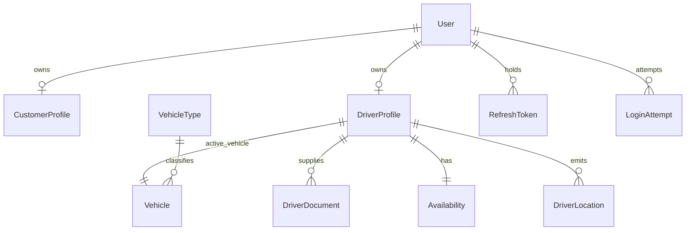
```mermaid
erDiagram
User ||--o| CustomerProfile : owns
User ||--o| DriverProfile : owns
DriverProfile ||--|| Vehicle : active_vehicle
VehicleType ||--o{ Vehicle : classifies
DriverProfile ||--o{ DriverDocument : supplies
DriverProfile ||--|| Availability : has
DriverProfile ||--o{ DriverLocation : emits
User ||--o{ RefreshToken : holds
User ||--o{ LoginAttempt : attempts
```

Các ID trỏ sang service khác là `logical ref`; không tạo foreign key vật lý.

#### Ride

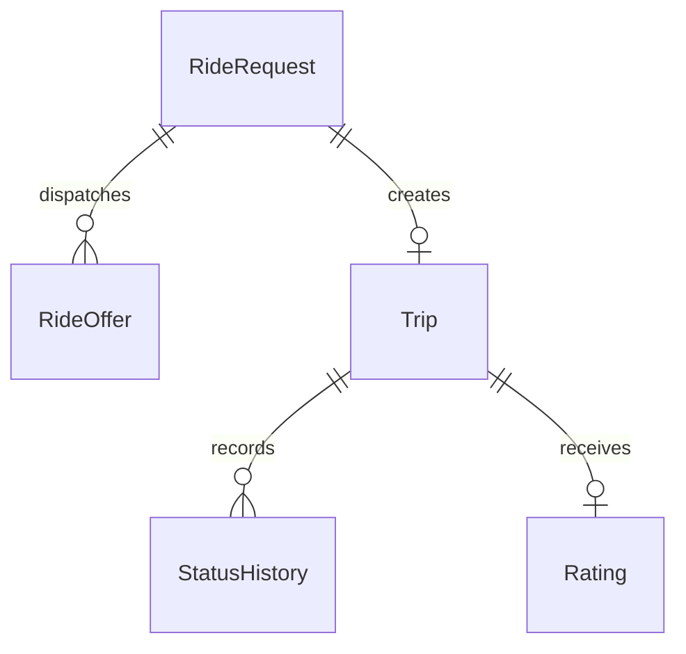
```mermaid
erDiagram
RideRequest ||--o{ RideOffer : dispatches
RideRequest ||--o| Trip : creates
Trip ||--o{ StatusHistory : records
Trip ||--o| Rating : receives
```

Các ID trỏ sang service khác là `logical ref`; không tạo foreign key vật lý.

#### Billing

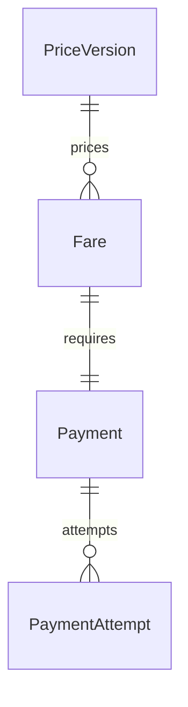
```mermaid
erDiagram
PriceVersion ||--o{ Fare : prices
Fare ||--|| Payment : requires
Payment ||--o{ PaymentAttempt : attempts
```

Các ID trỏ sang service khác là `logical ref`; không tạo foreign key vật lý.

#### Notification

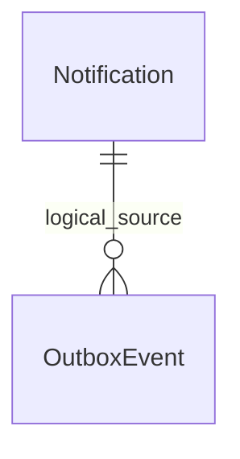
```mermaid
erDiagram
Notification ||--o{ OutboxEvent : logical_source
```

Các ID trỏ sang service khác là `logical ref`; không tạo foreign key vật lý.

#### Operations&Reporting

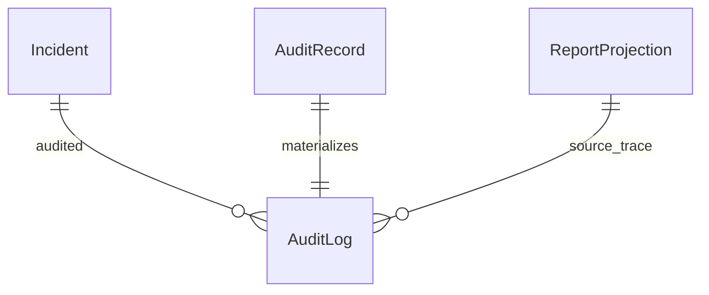
```mermaid
erDiagram
Incident ||--o{ AuditLog : audited
AuditRecord ||--|| AuditLog : materializes
ReportProjection ||--o{ AuditLog : source_trace
```

Các ID trỏ sang service khác là `logical ref`; không tạo foreign key vật lý.

### 9.4. State machines

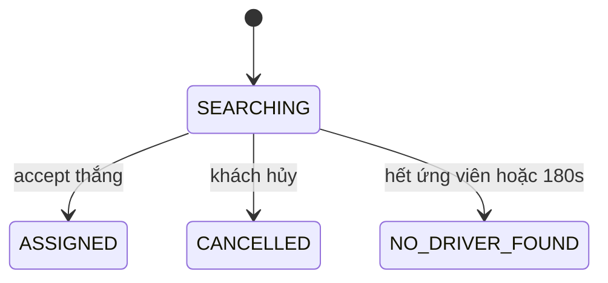
```mermaid
stateDiagram-v2
[*] --> SEARCHING
SEARCHING --> ASSIGNED: accept thắng
SEARCHING --> CANCELLED: khách hủy
SEARCHING --> NO_DRIVER_FOUND: hết ứng viên hoặc 180s
```

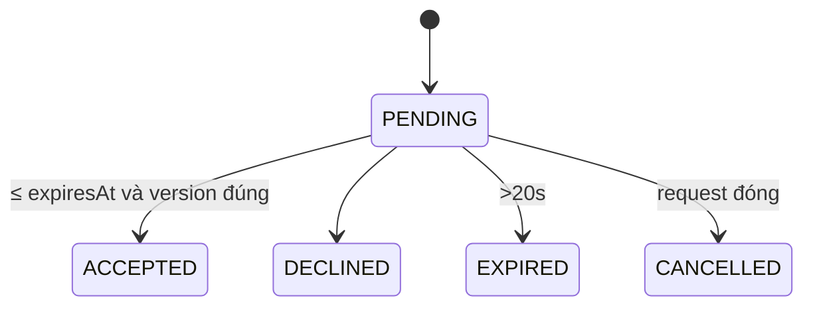
```mermaid
stateDiagram-v2
[*] --> PENDING
PENDING --> ACCEPTED: ≤ expiresAt và version đúng
PENDING --> DECLINED
PENDING --> EXPIRED: >20s
PENDING --> CANCELLED: request đóng
```

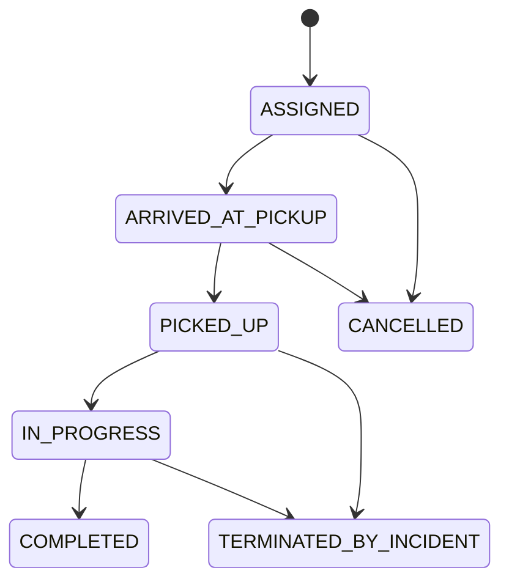
```mermaid
stateDiagram-v2
[*] --> ASSIGNED
ASSIGNED --> ARRIVED_AT_PICKUP
ARRIVED_AT_PICKUP --> PICKED_UP
PICKED_UP --> IN_PROGRESS
IN_PROGRESS --> COMPLETED
ASSIGNED --> CANCELLED
ARRIVED_AT_PICKUP --> CANCELLED
PICKED_UP --> TERMINATED_BY_INCIDENT
IN_PROGRESS --> TERMINATED_BY_INCIDENT
```

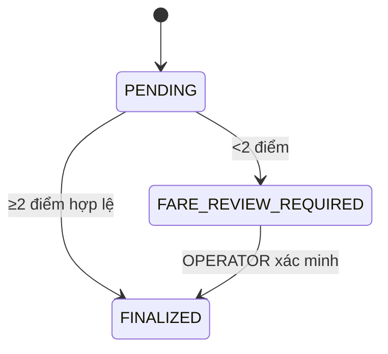
```mermaid
stateDiagram-v2
[*] --> PENDING
PENDING --> FINALIZED: ≥2 điểm hợp lệ
PENDING --> FARE_REVIEW_REQUIRED: <2 điểm
FARE_REVIEW_REQUIRED --> FINALIZED: OPERATOR xác minh
```

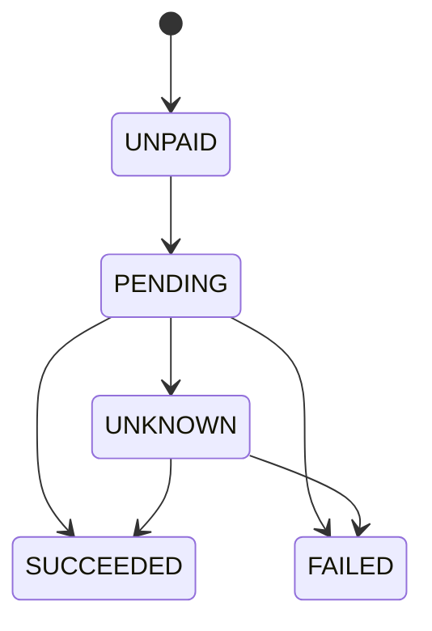
```mermaid
stateDiagram-v2
[*] --> UNPAID
UNPAID --> PENDING
PENDING --> SUCCEEDED
PENDING --> FAILED
PENDING --> UNKNOWN
UNKNOWN --> SUCCEEDED
UNKNOWN --> FAILED
```

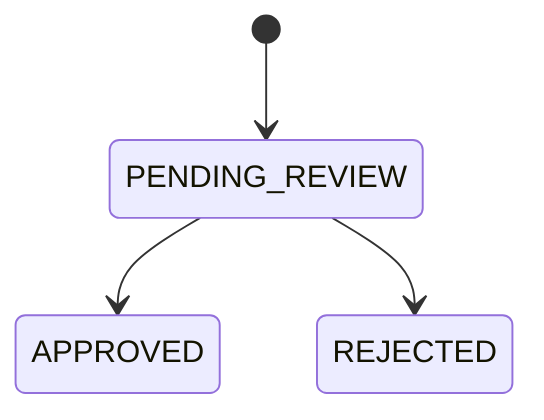
```mermaid
stateDiagram-v2
[*] --> PENDING_REVIEW
PENDING_REVIEW --> APPROVED
PENDING_REVIEW --> REJECTED
```

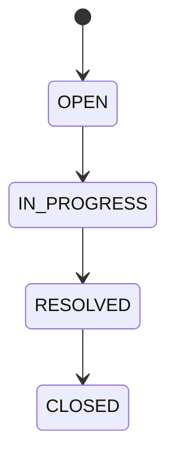
```mermaid
stateDiagram-v2
[*] --> OPEN
OPEN --> IN_PROGRESS
IN_PROGRESS --> RESOLVED
RESOLVED --> CLOSED
```

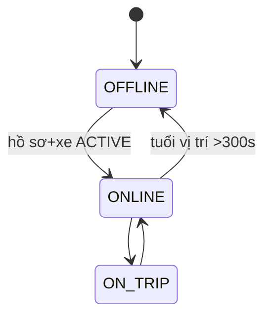
```mermaid
stateDiagram-v2
[*] --> OFFLINE
OFFLINE --> ONLINE: hồ sơ+xe ACTIVE
ONLINE --> ON_TRIP
ON_TRIP --> ONLINE
ONLINE --> OFFLINE: tuổi vị trí >300s
```

### 9.5. Nhất quán liên service (event)

| Event                          | Producer             | Consumer                 | Khóa idempotency     | Tác dụng                         |
| ------------------------------ | -------------------- | ------------------------ | -------------------- | -------------------------------- |
| DriverLocationUpdated          | Identity&Driver      | Ride; Operations         | eventId              | Cập nhật quãng đường/projection  |
| RideAssigned/TripStatusChanged | Ride                 | Identity; Notification; Operations | eventId+consumer | Availability, hộp thư và chuyến đang chạy |
| RideOfferCreated/Responded     | Ride                 | Notification; Operations | eventId+consumer     | Hộp thư và fact acceptance rate  |
| RideRequestNoDriverFound       | Ride                 | Notification; Operations | eventId+consumer     | Thông báo và fact find-driver    |
| RatingCreated                  | Ride                 | Identity; Operations     | eventId+consumer     | Rating trung bình và báo cáo     |
| TripCompleted                  | Ride                 | Billing; Operations      | tripId+statusVersion | Tạo Fare và báo cáo              |
| FareFinalized                  | Billing              | Notification; Operations | fareId+version       | Cho phép thanh toán/báo cáo      |
| PaymentStatusChanged           | Billing              | Notification; Operations | attemptId+status     | Thông báo và doanh thu           |
| AuditRecorded                  | Mỗi service          | Operations&Reporting     | eventId              | Ghi AuditLog đúng một lần        |
| IncidentResolved               | Operations&Reporting | Notification             | incidentId+version   | Thông báo kết quả; lệnh Ride dùng REST |

## 10. Use Case

### 10.1. Quy ước chung cho mọi UC

- **Main flow:** (1) Actor khởi phát UC bằng dữ liệu trigger; (2) Gateway/consumer xác thực actor, quyền, Idempotency-Key và version theo Rule/DEC của UC; (3) service quyết định kiểm tra tiền điều kiện; (4) service đọc/ghi entity trong database do chính nó sở hữu, service khác chỉ gọi API hoặc nhận event; (5) hoàn tất hậu điều kiện thành công, `OutboxEvent/AuditRecorded` ghi cùng transaction khi có thay đổi.
- **Alternate:** dữ liệu tùy chọn vắng mặt dùng mặc định trong data dictionary, không tự suy chính sách sản xuất.
- **Exception:** E1 validation/state sai → 422 hoặc 409, hậu điều kiện thất bại của UC; E2 thiếu xác thực/quyền → 401/403, không tiết lộ resource, không đổi dữ liệu.
- **Idempotency:** POST/PUT/PATCH thay đổi trạng thái theo DEC-34 và cột Idempotency của bảng API. GET không dùng `Idempotency-Key`; consumer sự kiện dùng khóa khử trùng lặp trong event catalog.
- **Ngưỡng:** áp dụng chính xác mọi mốc trong DEC được dẫn; biên bao gồm/loại trừ nêu tại BC.

### 10.2. Danh mục và đặc tả UC

| UC      | Tên                              | Actor chính (phụ)               | Service              | MoSCoW/Tuần | Trigger                              | Tiền điều kiện                                         | Hậu điều kiện thành công                              | Hậu điều kiện thất bại                         | FR                   | Rule/DEC                            |
| ------- | -------------------------------- | ------------------------------- | -------------------- | ----------- | ------------------------------------ | ------------------------------------------------------ | ----------------------------------------------------- | ---------------------------------------------- | -------------------- | ----------------------------------- |
| UC-01.1 | Đăng ký khách hàng               | CUSTOMER                        | Identity&Driver      | Must/T1     | Gửi phone, mật khẩu, họ tên hợp lệ   | phone chưa tồn tại                                     | Tạo User CUSTOMER ACTIVE và CustomerProfile           | Không tạo dữ liệu                              | FR-01/49             | BRULE-01; EX-01; DEC-29/33          |
| UC-01.2 | Đăng ký tài xế                   | DRIVER (OPERATOR)               | Identity&Driver      | Must/T1     | Gửi tài khoản, hồ sơ, xe và tài liệu | phone chưa tồn tại                                     | Tạo hồ sơ PENDING_REVIEW/OFFLINE                      | Không kích hoạt tài xế                         | FR-02/49             | BRULE-02; DEC-02/25/33              |
| UC-02   | Đăng nhập                        | Người dùng                      | Identity&Driver      | Must/T1     | Gửi phone và mật khẩu                | tài khoản ACTIVE, chưa bị khóa đăng nhập               | Cấp access/refresh token                              | Tăng LoginAttempt, có thể khóa 15 phút         | FR-04/49/50/51       | BRULE-01; EX-01; DEC-29/30          |
| UC-03.1 | Cập nhật hồ sơ chung             | CUSTOMER/DRIVER                 | Identity&Driver      | Must/T1     | PATCH trường cho phép                | đã xác thực, sở hữu hồ sơ                              | Lưu profile/version mới                               | Giữ version cũ                                 | FR-05                | BRULE-12; EX-02; DEC-34             |
| UC-03.2 | Đề nghị thay đổi hồ sơ tài xế    | DRIVER (OPERATOR)               | Identity&Driver      | Could/T3    | Gửi trường/tài liệu cần duyệt        | Driver APPROVED                                        | Tạo ChangeRequest PENDING_REVIEW                      | Dữ liệu hiệu lực không đổi                     | FR-06                | BRULE-02/12; DEC-34                 |
| UC-04   | Cập nhật trạng thái sẵn sàng     | DRIVER                          | Identity&Driver      | Must/T1     | PUT ONLINE/OFFLINE                   | User, application, vehicle ACTIVE; không Trip/offer mở | Availability đổi đúng version                         | Giữ trạng thái cũ                              | FR-06/47             | BRULE-02/04; EX-17; DEC-18/34       |
| UC-05.1 | Tạo yêu cầu đặt xe               | CUSTOMER (Billing)              | Ride                 | Must/T2     | Gửi pickup, destination, vehicleType | đã xác thực; điểm trong vùng; không request/trip mở    | RideRequest SEARCHING và giá ước tính                 | Không tạo request                              | FR-07–09/40/48/50    | BRULE-03; EX-03/04; DEC-19/23/34    |
| UC-05.2 | Hủy yêu cầu tìm tài xế           | CUSTOMER                        | Ride                 | Should/T2   | Hủy RideRequest SEARCHING            | sở hữu request; version đúng                           | Request và offer PENDING thành CANCELLED              | Kết quả commit thắng được giữ                  | FR-08/14/41          | BRULE-03/06; EX-07; DEC-34          |
| UC-06.1 | Chọn ứng viên tài xế             | Hệ thống (Identity&Driver)      | Ride                 | Must/T2     | RideRequest cần vòng điều phối       | SEARCHING; elapsed ≤160 giây                           | Danh sách tối đa 3 ứng viên chưa mời lại              | Không có ứng viên thì chuyển UC-06.3           | FR-10/11/47          | BRULE-04/05; EX-17; DEC-16–18       |
| UC-06.2 | Mời tài xế                       | Hệ thống (Notification)         | Ride                 | Must/T2     | Chọn ứng viên kế tiếp                | driver không có offer PENDING; elapsed ≤160 giây       | Offer PENDING hết hạn sau 20 giây và phát event       | Không tạo offer xung đột                       | FR-12/14             | BRULE-06/11; EX-06/07; DEC-16/17    |
| UC-06.3 | Kết thúc tìm tài xế              | Hệ thống (Notification)         | Ride                 | Must/T2     | Hết ứng viên hoặc đạt 180 giây       | RideRequest SEARCHING                                  | NO_DRIVER_FOUND và thông báo một lần                  | Không mở offer sau hard-stop                   | FR-14–16             | BRULE-06/11; EX-05; DEC-16          |
| UC-07.1 | Chấp nhận lời mời                | DRIVER (Notification)           | Ride                 | Must/T2     | ACCEPT offer                         | PENDING, chưa hết 20 giây, version đúng                | Một Trip ASSIGNED; offer khác CANCELLED               | 409, không đổi assignment                      | FR-13/14             | BRULE-06/07; EX-07; DEC-17/34       |
| UC-07.2 | Từ chối lời mời                  | DRIVER                          | Ride                 | Must/T2     | DECLINE offer                        | PENDING, version đúng                                  | Offer DECLINED; loại driver khỏi request              | 409 nếu offer đã đóng                          | FR-13/14             | BRULE-06; EX-06/07; DEC-16/34       |
| UC-08   | Cập nhật vị trí tài xế           | DRIVER (Ride)                   | Identity&Driver      | Must/T3     | PUT WGS84 và capturedAt              | ONLINE/ON_TRIP; bản tin mới hơn                        | Lưu vị trí; cộng distance nếu hợp lệ                  | Bỏ bản cũ/sai; không lùi dữ liệu               | FR-21/47/50          | BRULE-04; EX-17; DEC-18/22/30       |
| UC-09.1 | Cập nhật mốc chuyến              | DRIVER (Notification)           | Ride                 | Must/T3     | Gửi trạng thái kế tiếp               | được giao Trip; version đúng                           | Trip/History/event cập nhật nguyên tử                 | 409 khi sai thứ tự/version                     | FR-17–22/41          | BRULE-07; EX-08; DEC-34             |
| UC-09.2 | Hủy chuyến trước đón             | CUSTOMER/DRIVER (Notification)  | Ride                 | Should/T3   | Gửi lý do hủy                        | Trip trước PICKED_UP; version đúng                     | CANCELLED; không tự điều phối lại                     | Sau PICKED_UP yêu cầu Incident                 | FR-22/41/53          | BRULE-07; EX-09; DEC-20/21/34       |
| UC-10   | Theo dõi chuyến                  | CUSTOMER (Identity&Driver)      | Ride                 | Must/T3     | GET Trip đang hoạt động              | sở hữu Trip                                            | Trả trạng thái, ETA và dữ liệu tài xế đã lọc          | Không ETA nếu vị trí >60 giây                  | FR-15/18/21/39       | BRULE-07/12; EX-15; DEC-13/24       |
| UC-11   | Tính cước chuyến                 | Hệ thống (Identity&Driver)      | Billing              | Must/T4     | Nhận TripCompleted                   | Trip COMPLETED, PriceVersion cố định                   | Fare FINALIZED hoặc FARE_REVIEW_REQUIRED              | Không tạo số tiền nếu <2 điểm hợp lệ           | FR-23                | BRULE-08; EX-15; DEC-06/22/23       |
| UC-11.2 | Xác minh khoảng cách Fare review | OPERATOR (Operations&Reporting) | Billing              | Could/T4    | Nhập distanceMeters và lý do         | Fare FARE_REVIEW_REQUIRED; có quyền/version            | Fare FINALIZED và AuditRecorded                       | Không sửa Payment; 409 khi xung đột            | FR-34/44             | BRULE-08/12/14; DEC-22/34           |
| UC-12.1 | Xác nhận thanh toán tiền mặt     | DRIVER                          | Billing              | Must/T4     | Xác nhận đã nhận tiền                | được giao Trip; Fare FINALIZED; không attempt chờ      | Payment SUCCEEDED/CASH một lần                        | 409 nếu PENDING/UNKNOWN/SUCCEEDED              | FR-24/26/54          | BRULE-09/10; EX-10/11; DEC-07/28/34 |
| UC-12.2 | Khởi tạo thanh toán điện tử      | CUSTOMER (Mock Provider)        | Billing              | Should/T4   | Chọn sandboxScenario                 | Fare FINALIZED; không PENDING/UNKNOWN/SUCCEEDED        | PaymentAttempt PENDING và paymentUrl giả              | Không tạo attempt khi bị chặn                  | FR-24–27/54          | BRULE-09/10; DEC-27/28/34           |
| UC-12.3 | Nhận callback thanh toán         | Hệ thống (Mock Provider)        | Billing              | Should/T4   | Callback HMAC                        | attempt tồn tại; chữ ký hợp lệ                         | Dedupe và lưu trạng thái cuối                         | 401 chữ ký sai; không đổi Payment              | FR-25–27/54          | BRULE-09/10; EX-10/11; DEC-27/28    |
| UC-12.4 | Đối soát thanh toán UNKNOWN      | Hệ thống (Mock Provider)        | Billing              | Should/T4   | Scheduler truy vấn attempt UNKNOWN   | attempt UNKNOWN                                        | Chuyển SUCCEEDED/FAILED hoặc giữ UNKNOWN              | Không mở attempt/cash khi chưa cuối            | FR-25–27/54          | BRULE-09/10; EX-11; DEC-27/28       |
| UC-13.1 | Ghi thông báo từ sự kiện         | Hệ thống (service phát event)   | Notification         | Must/T5     | Consumer nhận event                  | eventType hỗ trợ                                       | Ghi một Notification và phát SSE                      | Retry 1/5/25 giây rồi dead-letter              | FR-09/15/18/26/41/56 | BRULE-11; EX-16; DEC-10/37          |
| UC-13.2 | Theo dõi sự kiện SSE             | CUSTOMER/DRIVER                 | Notification         | Should/T5   | Mở SSE với Last-Event-ID             | đã xác thực                                            | Nhận event ≤2 giây trong 95% mẫu                      | Reconnect rồi GET resource                     | FR-09/15/18/21       | BRULE-11/12; DEC-10/37              |
| UC-13.3 | Đọc hộp thông báo                | CUSTOMER/DRIVER                 | Notification         | Must/T5     | GET/PATCH Notification               | sở hữu recipientId                                     | Trả inbox hoặc đánh dấu READ                          | 403 khi khác chủ sở hữu                        | FR-09/15/18/26/41    | BRULE-11/12; EX-13; DEC-10/34       |
| UC-14   | Xem lịch sử chuyến               | CUSTOMER (Billing)              | Ride                 | Must/T3     | GET lịch sử                          | đã xác thực                                            | Trả Trip thuộc khách và Fare/Payment projection       | Không lộ dữ liệu người khác                    | FR-28/29             | BRULE-12; EX-13                     |
| UC-15   | Đánh giá tài xế                  | CUSTOMER                        | Ride                 | Should/T6   | POST score 1..5                      | Trip COMPLETED của khách, trong 7 ngày                 | Tạo một Rating                                        | 409 nếu đã đánh giá/quá hạn                    | FR-30                | BRULE-15; EX-12; DEC-34             |
| UC-16.1 | Tra cứu vận hành                 | OPERATOR (các service)          | Operations&Reporting | Should/T5   | GET bộ lọc vận hành                  | có permission                                          | Trả projection tối thiểu cần thiết                    | 403/404 không lộ resource                      | FR-31–34/42          | BRULE-12; EX-13; DEC-09/31          |
| UC-16.2 | Duyệt hồ sơ tài xế               | OPERATOR (Identity&Driver)      | Identity&Driver      | Must/T1     | APPROVE/REJECT với lý do             | Application PENDING_REVIEW; version đúng               | Application/Vehicle hiệu lực phù hợp                  | 409 khi đã quyết định                          | FR-02/03/06          | BRULE-02/12; DEC-02/34              |
| UC-16.3 | Quản lý quyền nội bộ             | ADMIN                           | Identity&Driver      | Could/T5    | Cấp/thu OPERATOR/EXECUTIVE           | ADMIN đã đổi mật khẩu đầu                              | Role đổi và audit                                     | Không tự bỏ ADMIN cuối cùng                    | FR-31/35/45          | BRULE-12/14; DEC-25/33/34           |
| UC-16.4 | Quản lý biểu giá                 | ADMIN                           | Billing              | Could/T4    | Tạo/kích hoạt PriceVersion           | tham số giá hợp lệ                                     | Chuyến mới dùng version mới                           | Chuyến cũ giữ version                          | FR-23/35             | BRULE-08/12/14; DEC-06/23/34        |
| UC-16.5 | Khóa hoặc mở tài khoản           | OPERATOR (Identity&Driver)      | Identity&Driver      | Should/T5   | Gửi action và lý do                  | target CUSTOMER/DRIVER; có quyền                       | Đổi User status, thu hồi token khi khóa, audit        | 403 target nội bộ; 409 version sai             | FR-43                | BRULE-12/14; DEC-26/34              |
| UC-16.6 | Tạo tài khoản nội bộ             | ADMIN                           | Identity&Driver      | Should/T1   | Tạo OPERATOR/EXECUTIVE               | ADMIN hợp lệ                                           | User ACTIVE, mustChangePassword=true                  | Không tạo DRIVER/ADMIN thứ hai trái quy trình  | FR-45                | BRULE-01/12/14; DEC-25/35           |
| UC-16.7 | Xem chuyến đang diễn ra          | OPERATOR (Ride/Identity&Driver) | Operations&Reporting | Should/T5   | GET active trips                     | có permission                                          | Trả Trip hoạt động, driver, vị trí và tuổi trạng thái | Dữ liệu thiếu có timestamp/UNAVAILABLE         | FR-42                | BRULE-12/16; DEC-31/32              |
| UC-17.1 | Báo sự cố chuyến                 | CUSTOMER/DRIVER/OPERATOR        | Operations&Reporting | Should/T5   | POST reason                          | actor thuộc Trip hoặc OPERATOR                         | Incident OPEN idempotent                              | 403/409 không tạo trùng                        | FR-34/35             | BRULE-14; EX-09; DEC-15/34          |
| UC-17.2 | Xử lý sự cố                      | OPERATOR (Ride/Billing)         | Operations&Reporting | Should/T5   | Ghi biện pháp/kết quả                | Incident OPEN/IN_PROGRESS; version đúng                | RESOLVED/CLOSED; có thể phát terminate/fare-review    | Không sửa Payment                              | FR-34/35/41/44/55    | BRULE-12/14; EX-09; DEC-20–22/34    |
| UC-17.3 | Phát hiện chuyến treo            | Hệ thống (Ride/Identity&Driver) | Operations&Reporting | Should/T5   | Scheduler quét ngưỡng                | Trip chưa kết thúc                                     | Tạo đúng một Incident SYSTEM                          | Đúng ngưỡng chưa tạo; dữ liệu mới hủy cảnh báo | FR-46                | BRULE-14; EX-09; DEC-32             |
| UC-18.1 | Xem báo cáo chuyến và doanh thu  | EXECUTIVE/ADMIN                 | Operations&Reporting | Should/T6   | GET kỳ báo cáo                       | from bao gồm, to loại trừ                              | Trả count/revenue/rates với asOf                      | null/N/A khi mẫu số 0                          | FR-36/37/52          | BRULE-16; EX-14; DEC-31             |
| UC-18.2 | Xem chỉ số vận hành              | OPERATOR                        | Operations&Reporting | Could/T6    | GET metrics theo quyền               | kỳ hợp lệ                                              | Trả find-driver/acceptance/completed/rating           | UNAVAILABLE cho projection thiếu               | FR-37/38/52          | BRULE-16; EX-14; DEC-31             |

### 10.3. Ma trận quyền actor × resource

Mặc định từ chối. `R/U/C/D` chỉ có hiệu lực trong phạm vi sở hữu và UC được nêu; không actor nào được sửa trực tiếp kết quả Payment.

| Resource                         | CUSTOMER                                | DRIVER                           | OPERATOR                                  | ADMIN                    | EXECUTIVE            |
| -------------------------------- | --------------------------------------- | -------------------------------- | ----------------------------------------- | ------------------------ | -------------------- |
| Hồ sơ CUSTOMER                   | R/U của mình                            | —                                | R; khóa/mở                                | R; quản trị role nội bộ  | —                    |
| Hồ sơ DRIVER/Vehicle/Document    | —                                       | R/U của mình                     | R; duyệt; khóa/mở                         | R; quản trị role         | —                    |
| RideRequest/Trip                 | C/R/U/hủy của mình                      | R/U trạng thái Trip được giao    | R và danh sách đang chạy; không sửa tùy ý | R                        | R báo cáo tổng hợp   |
| RideOffer                        | R offer của Trip                        | R; ACCEPT/DECLINE offer của mình | R phục vụ hỗ trợ                          | R                        | —                    |
| Fare/PriceVersion                | R Fare của Trip                         | R Fare Trip được giao            | R; xác minh khoảng cách qua UC-11.2       | C/R/U PriceVersion       | R tổng hợp           |
| Payment/PaymentAttempt           | C/R payment của Trip; không sửa kết quả | Xác nhận cash Trip được giao     | R lịch sử; không sửa kết quả              | R; không sửa kết quả     | R doanh thu tổng hợp |
| Notification                     | R/U read của mình                       | R/U read của mình                | —                                         | —                        | —                    |
| Incident                         | C/R của Trip                            | C/R của Trip                     | C/R/U xử lý                               | R                        | R tổng hợp           |
| AuditLog                         | —                                       | —                                | R theo quyền                              | R                        | —                    |
| ReportProjection/chỉ số vận hành | —                                       | —                                | R chỉ số vận hành UC-18.2                 | R mọi báo cáo            | R báo cáo lãnh đạo   |
| User role/tài khoản nội bộ       | —                                       | —                                | Không cấp role; chỉ khóa CUSTOMER/DRIVER  | C/R/U OPERATOR/EXECUTIVE | —                    |

## 11. Acceptance Criteria và Boundary Conditions

### 11.1. AC-01–AC-51

| AC ID | Loại          | FR              | UC           | Given                                                           | When                                           | Then                                                                                                             | Rule/Exception | Trạng thái           |
| ----- | ------------- | --------------- | ------------ | --------------------------------------------------------------- | ---------------------------------------------- | ---------------------------------------------------------------------------------------------------------------- | -------------- | -------------------- |
| AC-01 | Happy Path    | FR-01           | UC-01.1      | Người dùng chưa có tài khoản                                    | Nhập thông tin hợp lệ và đăng ký               | Tạo tài khoản thành công                                                                                         | BRULE-01       | [Nhu cầu khách hàng] |
| AC-02 | Validation    | FR-01           | UC-01.1      | Thông tin đã tồn tại                                            | Đăng ký trùng thông tin                        | Từ chối + thông báo lý do                                                                                        | BRULE-01       | [Nhu cầu khách hàng] |
| AC-03 | Happy Path    | FR-04           | UC-02        | Người dùng có tài khoản                                         | Nhập đúng thông tin đăng nhập                  | Xác thực thành công                                                                                              | BRULE-01       | [Nhu cầu khách hàng] |
| AC-04 | Validation    | FR-04           | UC-02        | Thông tin sai                                                   | Đăng nhập sai mật khẩu                         | Từ chối truy cập                                                                                                 | BRULE-01       | [Nhu cầu khách hàng] |
| AC-05 | Happy Path    | FR-06           | UC-04        | Tài xế đã xác thực                                              | Cập nhật ONLINE                                | Trạng thái sẵn sàng được lưu                                                                                     | BRULE-02       | [Nhu cầu khách hàng] |
| AC-06 | Happy Path    | FR-07/08        | UC-05.1      | Khách đã xác thực                                               | Nhập đủ điểm đón/đến/loại xe                   | Tạo yêu cầu + mã định danh, trả trạng thái                                                                       | BRULE-03       | [Nhu cầu khách hàng] |
| AC-07 | Validation    | FR-07/08        | UC-05.1      | Thiếu dữ liệu                                                   | Đặt xe thiếu điểm đón/đến                      | Từ chối + thông báo lý do                                                                                        | BRULE-03       | [Nhu cầu khách hàng] |
| AC-08 | Happy Path    | FR-10–12        | UC-06.1/06.2 | Có tài xế ONLINE vị trí hợp lệ                                  | Hệ thống matching                              | Gửi đề xuất tới tài xế phù hợp                                                                                   | BRULE-04       | [Đã chốt cho đồ án]  |
| AC-09 | Exception     | FR-14–16        | UC-06.3      | Không còn tài xế                                                | Matching hết tài xế                            | Kết thúc NO_DRIVER_FOUND, thông báo khách                                                                        | BRULE-06/EX-05 | [Nhu cầu khách hàng] |
| AC-10 | Happy Path    | FR-13/14        | UC-07.1      | Tài xế nhận đề xuất                                             | Chấp nhận chuyến                               | Tạo chuyến, gán tài xế, thông báo khách                                                                          | BRULE-06       | [Nhu cầu khách hàng] |
| AC-11 | Alternative   | FR-13/14        | UC-07.2      | Tài xế từ chối                                                  | Từ chối chuyến                                 | Chuyển sang tài xế khác, không tạo lại yêu cầu                                                                   | BRULE-06       | [Nhu cầu khách hàng] |
| AC-12 | Exception     | FR-12/14        | UC-06.2      | Tài xế không phản hồi                                           | Hết thời gian phản hồi                         | Chuyển tài xế khác                                                                                               | BRULE-06       | [Đã chốt cho đồ án]  |
| AC-13 | Happy Path    | FR-17–22        | UC-09.1      | Chuyến đang hoạt động                                           | Tài xế cập nhật đúng thứ tự trạng thái         | Ghi nhận trạng thái + phát sinh sự kiện                                                                          | BRULE-07       | [Nhu cầu khách hàng] |
| AC-14 | Exception     | FR-17–22        | UC-09.1      | Cập nhật sai thứ tự                                             | Cập nhật trạng thái không hợp lệ               | Từ chối, giữ nguyên trạng thái                                                                                   | BRULE-07/EX-09 | [Nhu cầu khách hàng] |
| AC-15 | Happy Path    | FR-24/26        | UC-12.1      | Khách chọn tiền mặt                                             | Tài xế xác nhận đã nhận tiền                   | Ghi nhận thanh toán thành công                                                                                   | BRULE-09       | [Đã chốt cho đồ án]  |
| AC-16 | Happy Path    | FR-25/26        | UC-12.2/12.3 | Khách chọn điện tử                                              | Hệ thống gửi tới Payment Provider              | Nhận kết quả thành công → ghi nhận                                                                               | BRULE-09/10    | [Nhu cầu khách hàng] |
| AC-17 | Exception     | FR-25–27        | UC-12.3      | Thanh toán điện tử thất bại                                     | Provider trả thất bại                          | Ghi nhận FAILED, thông báo, xử lý lại                                                                            | BRULE-09/EX-10 | [Đã chốt cho đồ án]  |
| AC-18 | Happy Path    | FR-28/29        | UC-14        | Khách đã xác thực                                               | Xem lịch sử chuyến                             | Trả lịch sử + số tiền của chính mình                                                                             | BRULE-12       | [Nhu cầu khách hàng] |
| AC-19 | Permission    | FR-29           | UC-14        | Khách truy cập chuyến khác                                      | Xem lịch sử                                    | Từ chối (chỉ chuyến của mình)                                                                                    | BRULE-12       | [Nhu cầu khách hàng] |
| AC-20 | Business Rule | FR-30           | UC-15        | Chuyến chưa hoàn thành                                          | Đánh giá tài xế                                | Từ chối đánh giá                                                                                                 | BRULE-13       | [Nhu cầu khách hàng] |
| AC-21 | Happy Path    | FR-30           | UC-15        | Chuyến đã hoàn thành                                            | Gửi đánh giá                                   | Lưu đánh giá gắn chuyến + tài xế                                                                                 | BRULE-13       | [Nhu cầu khách hàng] |
| AC-22 | Permission    | FR-31–35        | UC-16.1/17.2 | Người dùng không có quyền                                       | Thao tác quản trị                              | Từ chối, không đổi dữ liệu                                                                                       | BRULE-12/EX-13 | [Đã chốt cho đồ án]  |
| AC-23 | Happy Path    | FR-23           | UC-11        | Trip hoàn thành và có khoảng cách hợp lệ                        | Billing tính cước theo DEC-06                  | Lưu Fare FINALIZED; nếu thiếu khoảng cách thì FARE_REVIEW_REQUIRED, không trả số tiền cuối                       | BRULE-08       | [Đã chốt cho đồ án]  |
| AC-24 | NFR-related   | FR-25           | UC-12.2/12.3 | —                                                               | Kiểm tra lưu trữ thanh toán                    | Không lưu dữ liệu nhạy cảm                                                                                       | BRULE-10       | [Nhu cầu khách hàng] |
| AC-25 | Boundary      | FR-30           | UC-15        | Khách sở hữu chuyến hoàn thành chưa quá 7 ngày                  | Gửi điểm nguyên 1–5 lần đầu                    | Lưu một đánh giá; quá hạn, trùng hoặc điểm ngoài biên bị từ chối                                                 | BRULE-13       | Baseline dự án       |
| AC-26 | Concurrency   | FR-12–14        | UC-07.1      | Hai tài xế có phản hồi ACCEPT cạnh tranh cho cùng yêu cầu       | Hai phản hồi được xử lý                        | Chỉ một assignment/Trip được tạo; phản hồi còn lại không đổi dữ liệu và nhận kết quả xung đột                    | BRULE-06       | [Đã chốt cho đồ án]  |
| AC-27 | Boundary      | FR-12–14        | UC-07.1      | Lời mời còn chờ ở ngay mốc 20 giây theo thời gian máy chủ       | Tài xế phản hồi                                | Đúng mốc được xét; sau mốc bị từ chối và không gán tài xế                                                        | BRULE-06       | [Đã chốt cho đồ án]  |
| AC-28 | Concurrency   | FR-08/13/14     | UC-05.2/07.1 | Khách hủy trong khi tài xế chấp nhận                            | Hai thao tác cạnh tranh                        | Chỉ kết quả commit trước có hiệu lực; bên còn lại đọc được trạng thái cuối, không có request/trip mâu thuẫn      | BRULE-03/06    | [Đã chốt cho đồ án]  |
| AC-29 | Idempotency   | FR-08           | UC-05.1      | Cùng chủ thể gửi lại cùng yêu cầu sau lỗi mạng                  | Gửi lại cùng khóa chống trùng                  | Trả cùng requestId/kết quả, không tạo yêu cầu thứ hai                                                            | BRULE-03       | [Đã chốt cho đồ án]  |
| AC-30 | State         | FR-17–22        | UC-09.1      | Trip ở một trạng thái xác định                                  | Actor gửi trạng thái hợp lệ kế tiếp            | Ghi trạng thái mới và một lịch sử; thao tác lặp không tạo chuyển trạng thái thứ hai                              | BRULE-07       | [Đã chốt cho đồ án]  |
| AC-31 | State         | FR-17–22        | UC-09.1      | Trip đã kết thúc hoặc bước chuyển sai thứ tự                    | Actor cập nhật                                 | Từ chối và giữ nguyên trạng thái/lịch sử                                                                         | BRULE-07       | [Đã chốt cho đồ án]  |
| AC-32 | Idempotency   | FR-25–27        | UC-12.3      | Callback có cùng định danh giao dịch/sự kiện đã xử lý           | Callback đến lần nữa                           | Không tạo lần thử hoặc kết quả thành công thứ hai; trả kết quả nhất quán                                         | BRULE-09/10    | [Đã chốt cho đồ án]  |
| AC-33 | Exception     | FR-25–27        | UC-12.3      | Provider timeout hoặc trả `UNKNOWN`                             | Hệ thống nhận/không nhận kết quả               | Không đánh dấu đã thanh toán và không cho thu lại trước khi đối soát                                             | BRULE-09/10    | [Đã chốt cho đồ án]  |
| AC-34 | Permission    | FR-31–35        | UC-16.1/16.3 | Actor thiếu quyền hoặc ngoài phạm vi dữ liệu                    | Thực hiện thao tác quản trị                    | Từ chối, không đổi dữ liệu và ghi vết theo danh sách thao tác được xác nhận                                      | BRULE-12/14    | [Đã chốt cho đồ án]  |
| AC-35 | Approval      | FR-03/06        | UC-16.2      | Có yêu cầu phê duyệt đang chờ                                   | Người có quyền APPROVE/REJECT                  | Quyết định được ghi một lần cùng người/thời điểm/lý do; REJECT không đổi dữ liệu hiệu lực                        | BRULE-12       | [Đã chốt cho đồ án]  |
| AC-36 | NFR-related   | FR-38/NFR-01–03 | UC-05.1      | Tải giả lập 30 yêu cầu/phút trong 15 phút, 100 chuyến đồng thời | Chạy kiểm thử pilot                            | Đo và báo cáo p95; mục tiêu là ≥95% tiếp nhận trong 3 giây, lỗi payment/notification không chặn đặt xe           | BC-14          | [Đã chốt cho đồ án]  |
| AC-37 | Happy Path    | FR-02           | UC-01.2      | Số điện thoại chưa tồn tại; hồ sơ và phương tiện hợp lệ         | Tài xế gửi đăng ký                             | Tạo User `PENDING_APPROVAL`, hồ sơ `PENDING_REVIEW` và availability `OFFLINE`; chưa được nhận chuyến             | BRULE-02       | [Đã chốt cho đồ án]  |
| AC-38 | Happy Path    | FR-05           | UC-03.1      | Người dùng đã xác thực                                          | Cập nhật tên hoặc thông tin không cần duyệt    | Chỉ hồ sơ của chính actor được cập nhật; trả resource mới và ghi thời điểm cập nhật                              | BRULE-01/12    | [Đã chốt cho đồ án]  |
| AC-39 | Approval      | FR-05/06        | UC-03.2      | Tài xế có hồ sơ đang hiệu lực                                   | Đề nghị đổi trường hồ sơ/phương tiện cần duyệt | Tạo một ChangeRequest `PENDING_REVIEW`; dữ liệu hiệu lực chỉ đổi sau APPROVED                                    | BRULE-02/12    | [Đã chốt cho đồ án]  |
| AC-40 | Happy Path    | FR-08/09        | UC-05.2      | RideRequest của khách còn `SEARCHING`                           | Khách hủy yêu cầu                              | Request chuyển `CANCELLED`, mọi Offer `PENDING` chuyển `CANCELLED`, không tạo Trip và thông báo được ghi một lần | BRULE-03/11    | [Đã chốt cho đồ án]  |
| AC-41 | Boundary      | FR-21           | UC-08        | Tài xế ACTIVE/ONLINE gửi vị trí WGS84 hợp lệ                    | Driver Service nhận vị trí                     | Chỉ bản có `receivedAt` mới hơn được lưu; bản quá 60 giây không dùng cho matching hoặc ETA                       | BRULE-04       | [Đã chốt cho đồ án]  |
| AC-42 | State         | FR-17/22/34     | UC-09.2      | Trip chưa hoặc đã qua `PICKED_UP`                               | Khách/tài xế yêu cầu hủy                       | Trước `PICKED_UP` chuyển `CANCELLED` và lưu lý do; từ `PICKED_UP` trở đi tạo Incident, không hủy trực tiếp Trip  | BRULE-07/EX-09 | [Đã chốt cho đồ án]  |
| AC-43 | Happy Path    | FR-18/21        | UC-10        | Khách sở hữu Trip đang hoạt động                                | Mở màn hình theo dõi                           | Trả trạng thái, vị trí mới nhất và ETA từ adapter; vị trí thiếu/quá 60 giây trả `Chưa có ETA`                    | BRULE-07       | [Đã chốt cho đồ án]  |
| AC-44 | Idempotency   | FR-09/15/18/26  | UC-13.1      | Một event nghiệp vụ được consumer nhận một hoặc nhiều lần       | Notification ghi thông báo                     | Chỉ một Notification tồn tại theo `(recipientId,eventId)`; actor chỉ đọc/đánh dấu thông báo của mình             | BRULE-11/12    | [Đã chốt cho đồ án]  |
| AC-45 | NFR-related   | FR-09/15/18/21  | UC-13.2      | 100 client mở SSE trong tải pilot                               | Phát sự kiện và kiểm tra reconnect             | Ít nhất 95% sự kiện tới trong 2 giây; reconnect dùng `Last-Event-ID`, sau đó GET resource để xác nhận trạng thái | NFR-17/BC-17   | [Đã chốt cho đồ án]  |
| AC-46 | Versioning    | FR-32/33        | UC-16.4      | ADMIN có quyền và PriceVersion mới hợp lệ                       | Kích hoạt biểu giá mới                         | Chuyến mới dùng version mới; RideRequest/Trip đã tạo giữ version cũ; thao tác được audit                         | BRULE-12/14    | [Đã chốt cho đồ án]  |
| AC-47 | Happy Path    | FR-34/35        | UC-17.1      | Khách hoặc tài xế thuộc Trip hợp lệ                             | Báo sự cố với reason hợp lệ                    | Tạo một Incident `OPEN` gắn Trip và người báo; thao tác gửi lặp cùng khóa trả cùng Incident                      | BRULE-14/EX-09 | [Đã chốt cho đồ án]  |
| AC-48 | Happy Path    | FR-34/35        | UC-17.2      | OPERATOR có quyền với Incident `OPEN/IN_PROGRESS`               | Ghi biện pháp và kết quả xử lý                 | Incident chuyển đúng thứ tự đến `RESOLVED/CLOSED`, có lịch sử/audit và không sửa trực tiếp dữ liệu Billing       | BRULE-12/14    | [Đã chốt cho đồ án]  |
| AC-49 | Reporting     | FR-36/37        | UC-18.1      | EXECUTIVE chọn kỳ ngày/tháng hợp lệ                             | Yêu cầu báo cáo chuyến và doanh thu            | Chỉ tổng hợp Trip `COMPLETED` đã thanh toán theo Asia/Ho_Chi_Minh; dữ liệu thiếu trả `UNAVAILABLE`               | BRULE-16       | [Đã chốt cho đồ án]  |
| AC-50 | Reporting     | FR-37/38        | UC-18.2      | Actor có quyền chọn kỳ báo cáo hợp lệ                           | Xem chỉ số vận hành                            | Trả số chuyến hoàn thành/hủy và hiệu quả tài xế từ snapshot có thời điểm; mẫu số 0 không gây chia cho 0          | BRULE-16       | [Đã chốt cho đồ án]  |
| AC-51 | Permission    | FR-31/32/35     | UC-16.3      | ADMIN có quyền; tài khoản đích thuộc OPERATOR hoặc EXECUTIVE    | Cấp hoặc thu hồi role                          | Role mới được lưu một lần, có audit trước/sau; không cho ADMIN tự bỏ quyền quản trị cuối cùng của hệ thống       | BRULE-12/14    | [Đã chốt cho đồ án]  |

### 11.2. AC bổ sung Given/When/Then (AC-52–AC-131)

| AC     | UC      | Loại        | Given/When/Then                                                                                                                                                                               | FR                   | Rule/DEC                            |
| ------ | ------- | ----------- | --------------------------------------------------------------------------------------------------------------------------------------------------------------------------------------------- | -------------------- | ----------------------------------- |
| AC-52  | UC-01.1 | Happy       | Given phone chưa tồn tại; When Gửi phone, mật khẩu, họ tên hợp lệ; Then Tạo User CUSTOMER ACTIVE và CustomerProfile.                                                                          | FR-01/49             | BRULE-01; EX-01; DEC-29/33          |
| AC-53  | UC-01.1 | Validation  | Given tiền điều kiện hoặc version không hợp lệ; When CUSTOMER yêu cầu đăng ký khách hàng; Then Không tạo dữ liệu, trả 409/422 và không phát event thành công.                                 | FR-01/49             | BRULE-01; EX-01; DEC-29/33          |
| AC-54  | UC-01.2 | Happy       | Given phone chưa tồn tại; When Gửi tài khoản, hồ sơ, xe và tài liệu; Then Tạo hồ sơ PENDING_REVIEW/OFFLINE.                                                                                   | FR-02/49             | BRULE-02; DEC-02/25/33              |
| AC-55  | UC-01.2 | Validation  | Given tiền điều kiện hoặc version không hợp lệ; When DRIVER yêu cầu đăng ký tài xế; Then Không kích hoạt tài xế, trả 409/422 và không phát event thành công.                                  | FR-02/49             | BRULE-02; DEC-02/25/33              |
| AC-56  | UC-02   | Happy       | Given tài khoản ACTIVE, chưa bị khóa đăng nhập; When Gửi phone và mật khẩu; Then Cấp access/refresh token.                                                                                    | FR-04/49/50/51       | BRULE-01; EX-01; DEC-29/30          |
| AC-57  | UC-02   | Validation  | Given tiền điều kiện hoặc version không hợp lệ; When Người dùng yêu cầu đăng nhập; Then Tăng LoginAttempt, có thể khóa 15 phút, trả 409/422 và không phát event thành công.                   | FR-04/49/50/51       | BRULE-01; EX-01; DEC-29/30          |
| AC-58  | UC-03.1 | Happy       | Given đã xác thực, sở hữu hồ sơ; When PATCH trường cho phép; Then Lưu profile/version mới.                                                                                                    | FR-05                | BRULE-12; EX-02; DEC-34             |
| AC-59  | UC-03.1 | Validation  | Given tiền điều kiện hoặc version không hợp lệ; When CUSTOMER/DRIVER yêu cầu cập nhật hồ sơ chung; Then Giữ version cũ, trả 409/422 và không phát event thành công.                           | FR-05                | BRULE-12; EX-02; DEC-34             |
| AC-60  | UC-03.2 | Happy       | Given Driver APPROVED; When Gửi trường/tài liệu cần duyệt; Then Tạo ChangeRequest PENDING_REVIEW.                                                                                             | FR-06                | BRULE-02/12; DEC-34                 |
| AC-61  | UC-03.2 | Validation  | Given tiền điều kiện hoặc version không hợp lệ; When DRIVER yêu cầu đề nghị thay đổi hồ sơ tài xế; Then Dữ liệu hiệu lực không đổi, trả 409/422 và không phát event thành công.               | FR-06                | BRULE-02/12; DEC-34                 |
| AC-62  | UC-04   | Happy       | Given User, application, vehicle ACTIVE; không Trip/offer mở; When PUT ONLINE/OFFLINE; Then Availability đổi đúng version.                                                                    | FR-06/47             | BRULE-02/04; EX-17; DEC-18/34       |
| AC-63  | UC-04   | Validation  | Given tiền điều kiện hoặc version không hợp lệ; When DRIVER yêu cầu cập nhật trạng thái sẵn sàng; Then Giữ trạng thái cũ, trả 409/422 và không phát event thành công.                         | FR-06/47             | BRULE-02/04; EX-17; DEC-18/34       |
| AC-64  | UC-05.1 | Happy       | Given đã xác thực; điểm trong vùng; không request/trip mở; When Gửi pickup, destination, vehicleType; Then RideRequest SEARCHING và giá ước tính.                                             | FR-07–09/40/48/50    | BRULE-03; EX-03/04; DEC-19/23/34    |
| AC-65  | UC-05.1 | Validation  | Given tiền điều kiện hoặc version không hợp lệ; When CUSTOMER yêu cầu tạo yêu cầu đặt xe; Then Không tạo request, trả 409/422 và không phát event thành công.                                 | FR-07–09/40/48/50    | BRULE-03; EX-03/04; DEC-19/23/34    |
| AC-66  | UC-05.2 | Happy       | Given sở hữu request; version đúng; When Hủy RideRequest SEARCHING; Then Request và offer PENDING thành CANCELLED.                                                                            | FR-08/14/41          | BRULE-03/06; EX-07; DEC-34          |
| AC-67  | UC-05.2 | Concurrency | Given tiền điều kiện hoặc version không hợp lệ; When CUSTOMER yêu cầu hủy yêu cầu tìm tài xế; Then Kết quả commit thắng được giữ, trả 409/422 và không phát event thành công.                 | FR-08/14/41          | BRULE-03/06; EX-07; DEC-34          |
| AC-68  | UC-06.1 | Happy       | Given SEARCHING; elapsed ≤160 giây; When RideRequest cần vòng điều phối; Then Danh sách tối đa 3 ứng viên chưa mời lại.                                                                       | FR-10/11/47          | BRULE-04/05; EX-17; DEC-16–18       |
| AC-69  | UC-06.1 | Validation  | Given tiền điều kiện hoặc version không hợp lệ; When Hệ thống yêu cầu chọn ứng viên tài xế; Then Không có ứng viên thì chuyển UC-06.3, trả 409/422 và không phát event thành công.            | FR-10/11/47          | BRULE-04/05; EX-17; DEC-16–18       |
| AC-70  | UC-06.2 | Happy       | Given driver không có offer PENDING; elapsed ≤160 giây; When Chọn ứng viên kế tiếp; Then Offer PENDING hết hạn sau 20 giây và phát event.                                                     | FR-12/14             | BRULE-06/11; EX-06/07; DEC-16/17    |
| AC-71  | UC-06.2 | Validation  | Given tiền điều kiện hoặc version không hợp lệ; When Hệ thống yêu cầu mời tài xế; Then Không tạo offer xung đột, trả 409/422 và không phát event thành công.                                  | FR-12/14             | BRULE-06/11; EX-06/07; DEC-16/17    |
| AC-72  | UC-06.3 | Happy       | Given RideRequest SEARCHING; When Hết ứng viên hoặc đạt 180 giây; Then NO_DRIVER_FOUND và thông báo một lần.                                                                                  | FR-14–16             | BRULE-06/11; EX-05; DEC-16          |
| AC-73  | UC-06.3 | Validation  | Given tiền điều kiện hoặc version không hợp lệ; When Hệ thống yêu cầu kết thúc tìm tài xế; Then Không mở offer sau hard-stop, trả 409/422 và không phát event thành công.                     | FR-14–16             | BRULE-06/11; EX-05; DEC-16          |
| AC-74  | UC-07.1 | Happy       | Given PENDING, chưa hết 20 giây, version đúng; When ACCEPT offer; Then Một Trip ASSIGNED; offer khác CANCELLED.                                                                               | FR-13/14             | BRULE-06/07; EX-07; DEC-17/34       |
| AC-75  | UC-07.1 | Concurrency | Given tiền điều kiện hoặc version không hợp lệ; When DRIVER yêu cầu chấp nhận lời mời; Then 409, không đổi assignment, trả 409/422 và không phát event thành công.                            | FR-13/14             | BRULE-06/07; EX-07; DEC-17/34       |
| AC-76  | UC-07.2 | Happy       | Given PENDING, version đúng; When DECLINE offer; Then Offer DECLINED; loại driver khỏi request.                                                                                               | FR-13/14             | BRULE-06; EX-06/07; DEC-16/34       |
| AC-77  | UC-07.2 | Validation  | Given tiền điều kiện hoặc version không hợp lệ; When DRIVER yêu cầu từ chối lời mời; Then 409 nếu offer đã đóng, trả 409/422 và không phát event thành công.                                  | FR-13/14             | BRULE-06; EX-06/07; DEC-16/34       |
| AC-78  | UC-08   | Happy       | Given ONLINE/ON_TRIP; bản tin mới hơn; When PUT WGS84 và capturedAt; Then Lưu vị trí; cộng distance nếu hợp lệ.                                                                               | FR-21/47/50          | BRULE-04; EX-17; DEC-18/22/30       |
| AC-79  | UC-08   | Validation  | Given tiền điều kiện hoặc version không hợp lệ; When DRIVER yêu cầu cập nhật vị trí tài xế; Then Bỏ bản cũ/sai; không lùi dữ liệu, trả 409/422 và không phát event thành công.                | FR-21/47/50          | BRULE-04; EX-17; DEC-18/22/30       |
| AC-80  | UC-09.1 | Happy       | Given được giao Trip; version đúng; When Gửi trạng thái kế tiếp; Then Trip/History/event cập nhật nguyên tử.                                                                                  | FR-17–22/41          | BRULE-07; EX-08; DEC-34             |
| AC-81  | UC-09.1 | Validation  | Given tiền điều kiện hoặc version không hợp lệ; When DRIVER yêu cầu cập nhật mốc chuyến; Then 409 khi sai thứ tự/version, trả 409/422 và không phát event thành công.                         | FR-17–22/41          | BRULE-07; EX-08; DEC-34             |
| AC-82  | UC-09.2 | Happy       | Given Trip trước PICKED_UP; version đúng; When Gửi lý do hủy; Then CANCELLED; không tự điều phối lại.                                                                                         | FR-22/41/53          | BRULE-07; EX-09; DEC-20/21/34       |
| AC-83  | UC-09.2 | Validation  | Given tiền điều kiện hoặc version không hợp lệ; When CUSTOMER/DRIVER yêu cầu hủy chuyến trước đón; Then Sau PICKED_UP yêu cầu Incident, trả 409/422 và không phát event thành công.           | FR-22/41/53          | BRULE-07; EX-09; DEC-20/21/34       |
| AC-84  | UC-10   | Happy       | Given sở hữu Trip; When GET Trip đang hoạt động; Then Trả trạng thái, ETA và dữ liệu tài xế đã lọc.                                                                                           | FR-15/18/21/39       | BRULE-07/12; EX-15; DEC-13/24       |
| AC-85  | UC-10   | Validation  | Given tiền điều kiện hoặc version không hợp lệ; When CUSTOMER yêu cầu theo dõi chuyến; Then Không ETA nếu vị trí >60 giây, trả 409/422 và không phát event thành công.                        | FR-15/18/21/39       | BRULE-07/12; EX-15; DEC-13/24       |
| AC-86  | UC-11   | Happy       | Given Trip COMPLETED, PriceVersion cố định; When Nhận TripCompleted; Then Fare FINALIZED hoặc FARE_REVIEW_REQUIRED.                                                                           | FR-23                | BRULE-08; EX-15; DEC-06/22/23       |
| AC-87  | UC-11   | Validation  | Given tiền điều kiện hoặc version không hợp lệ; When Hệ thống yêu cầu tính cước chuyến; Then Không tạo số tiền nếu <2 điểm hợp lệ, trả 409/422 và không phát event thành công.                | FR-23                | BRULE-08; EX-15; DEC-06/22/23       |
| AC-88  | UC-11.2 | Happy       | Given Fare FARE_REVIEW_REQUIRED; có quyền/version; When Nhập distanceMeters và lý do; Then Fare FINALIZED và AuditRecorded.                                                                   | FR-34/44             | BRULE-08/12/14; DEC-22/34           |
| AC-89  | UC-11.2 | Concurrency | Given tiền điều kiện hoặc version không hợp lệ; When OPERATOR yêu cầu xác minh khoảng cách fare review; Then Không sửa Payment; 409 khi xung đột, trả 409/422 và không phát event thành công. | FR-34/44             | BRULE-08/12/14; DEC-22/34           |
| AC-90  | UC-12.1 | Happy       | Given được giao Trip; Fare FINALIZED; không attempt chờ; When Xác nhận đã nhận tiền; Then Payment SUCCEEDED/CASH một lần.                                                                     | FR-24/26/54          | BRULE-09/10; EX-10/11; DEC-07/28/34 |
| AC-91  | UC-12.1 | Concurrency | Given tiền điều kiện hoặc version không hợp lệ; When DRIVER yêu cầu xác nhận thanh toán tiền mặt; Then 409 nếu PENDING/UNKNOWN/SUCCEEDED, trả 409/422 và không phát event thành công.         | FR-24/26/54          | BRULE-09/10; EX-10/11; DEC-07/28/34 |
| AC-92  | UC-12.2 | Happy       | Given Fare FINALIZED; không PENDING/UNKNOWN/SUCCEEDED; When Chọn sandboxScenario; Then PaymentAttempt PENDING và paymentUrl giả.                                                              | FR-24–27/54          | BRULE-09/10; DEC-27/28/34           |
| AC-93  | UC-12.2 | Validation  | Given tiền điều kiện hoặc version không hợp lệ; When CUSTOMER yêu cầu khởi tạo thanh toán điện tử; Then Không tạo attempt khi bị chặn, trả 409/422 và không phát event thành công.            | FR-24–27/54          | BRULE-09/10; DEC-27/28/34           |
| AC-94  | UC-12.3 | Happy       | Given attempt tồn tại; chữ ký hợp lệ; When Callback HMAC; Then Dedupe và lưu trạng thái cuối.                                                                                                 | FR-25–27/54          | BRULE-09/10; EX-10/11; DEC-27/28    |
| AC-95  | UC-12.3 | Validation  | Given tiền điều kiện hoặc version không hợp lệ; When Hệ thống yêu cầu nhận callback thanh toán; Then 401 chữ ký sai; không đổi Payment, trả 409/422 và không phát event thành công.           | FR-25–27/54          | BRULE-09/10; EX-10/11; DEC-27/28    |
| AC-96  | UC-12.4 | Happy       | Given attempt UNKNOWN; When Scheduler truy vấn attempt UNKNOWN; Then Chuyển SUCCEEDED/FAILED hoặc giữ UNKNOWN.                                                                                | FR-25–27/54          | BRULE-09/10; EX-11; DEC-27/28       |
| AC-97  | UC-12.4 | Validation  | Given tiền điều kiện hoặc version không hợp lệ; When Hệ thống yêu cầu đối soát thanh toán unknown; Then Không mở attempt/cash khi chưa cuối, trả 409/422 và không phát event thành công.      | FR-25–27/54          | BRULE-09/10; EX-11; DEC-27/28       |
| AC-98  | UC-13.1 | Happy       | Given eventType hỗ trợ; When Consumer nhận event; Then Ghi một Notification và phát SSE.                                                                                                      | FR-09/15/18/26/41/56 | BRULE-11; EX-16; DEC-10/37          |
| AC-99  | UC-13.1 | Validation  | Given tiền điều kiện hoặc version không hợp lệ; When Hệ thống yêu cầu ghi thông báo từ sự kiện; Then Retry 1/5/25 giây rồi dead-letter, trả 409/422 và không phát event thành công.           | FR-09/15/18/26/41/56 | BRULE-11; EX-16; DEC-10/37          |
| AC-100 | UC-13.2 | Happy       | Given đã xác thực; When Mở SSE với Last-Event-ID; Then Nhận event ≤2 giây trong 95% mẫu.                                                                                                      | FR-09/15/18/21       | BRULE-11/12; DEC-10/37              |
| AC-101 | UC-13.2 | Validation  | Given tiền điều kiện hoặc version không hợp lệ; When CUSTOMER/DRIVER yêu cầu theo dõi sự kiện sse; Then Reconnect rồi GET resource, trả 409/422 và không phát event thành công.               | FR-09/15/18/21       | BRULE-11/12; DEC-10/37              |
| AC-102 | UC-13.3 | Happy       | Given sở hữu recipientId; When GET/PATCH Notification; Then Trả inbox hoặc đánh dấu READ.                                                                                                     | FR-09/15/18/26/41    | BRULE-11/12; EX-13; DEC-10/34       |
| AC-103 | UC-13.3 | Validation  | Given tiền điều kiện hoặc version không hợp lệ; When CUSTOMER/DRIVER yêu cầu đọc hộp thông báo; Then 403 khi khác chủ sở hữu, trả 409/422 và không phát event thành công.                     | FR-09/15/18/26/41    | BRULE-11/12; EX-13; DEC-10/34       |
| AC-104 | UC-14   | Happy       | Given đã xác thực; When GET lịch sử; Then Trả Trip thuộc khách và Fare/Payment projection.                                                                                                    | FR-28/29             | BRULE-12; EX-13                     |
| AC-105 | UC-14   | Validation  | Given tiền điều kiện hoặc version không hợp lệ; When CUSTOMER yêu cầu xem lịch sử chuyến; Then Không lộ dữ liệu người khác, trả 409/422 và không phát event thành công.                       | FR-28/29             | BRULE-12; EX-13                     |
| AC-106 | UC-15   | Happy       | Given Trip COMPLETED của khách, trong 7 ngày; When POST score 1..5; Then Tạo một Rating.                                                                                                      | FR-30                | BRULE-15; EX-12; DEC-34             |
| AC-107 | UC-15   | Validation  | Given tiền điều kiện hoặc version không hợp lệ; When CUSTOMER yêu cầu đánh giá tài xế; Then 409 nếu đã đánh giá/quá hạn, trả 409/422 và không phát event thành công.                          | FR-30                | BRULE-15; EX-12; DEC-34             |
| AC-108 | UC-16.1 | Happy       | Given có permission; When GET bộ lọc vận hành; Then Trả projection tối thiểu cần thiết.                                                                                                       | FR-31–34/42          | BRULE-12; EX-13; DEC-09/31          |
| AC-109 | UC-16.1 | Validation  | Given tiền điều kiện hoặc version không hợp lệ; When OPERATOR yêu cầu tra cứu vận hành; Then 403/404 không lộ resource, trả 409/422 và không phát event thành công.                           | FR-31–34/42          | BRULE-12; EX-13; DEC-09/31          |
| AC-110 | UC-16.2 | Happy       | Given Application PENDING_REVIEW; version đúng; When APPROVE/REJECT với lý do; Then Application/Vehicle hiệu lực phù hợp.                                                                     | FR-02/03/06          | BRULE-02/12; DEC-02/34              |
| AC-111 | UC-16.2 | Validation  | Given tiền điều kiện hoặc version không hợp lệ; When OPERATOR yêu cầu duyệt hồ sơ tài xế; Then 409 khi đã quyết định, trả 409/422 và không phát event thành công.                             | FR-02/03/06          | BRULE-02/12; DEC-02/34              |
| AC-112 | UC-16.3 | Happy       | Given ADMIN đã đổi mật khẩu đầu; When Cấp/thu OPERATOR/EXECUTIVE; Then Role đổi và audit.                                                                                                     | FR-31/35/45          | BRULE-12/14; DEC-25/33/34           |
| AC-113 | UC-16.3 | Validation  | Given tiền điều kiện hoặc version không hợp lệ; When ADMIN yêu cầu quản lý quyền nội bộ; Then Không tự bỏ ADMIN cuối cùng, trả 409/422 và không phát event thành công.                        | FR-31/35/45          | BRULE-12/14; DEC-25/33/34           |
| AC-114 | UC-16.4 | Happy       | Given tham số giá hợp lệ; When Tạo/kích hoạt PriceVersion; Then Chuyến mới dùng version mới.                                                                                                  | FR-23/35             | BRULE-08/12/14; DEC-06/23/34        |
| AC-115 | UC-16.4 | Validation  | Given tiền điều kiện hoặc version không hợp lệ; When ADMIN yêu cầu quản lý biểu giá; Then Chuyến cũ giữ version, trả 409/422 và không phát event thành công.                                  | FR-23/35             | BRULE-08/12/14; DEC-06/23/34        |
| AC-116 | UC-16.5 | Happy       | Given target CUSTOMER/DRIVER; có quyền; When Gửi action và lý do; Then Đổi User status, thu hồi token khi khóa, audit.                                                                        | FR-43                | BRULE-12/14; DEC-26/34              |
| AC-117 | UC-16.5 | Validation  | Given tiền điều kiện hoặc version không hợp lệ; When OPERATOR yêu cầu khóa hoặc mở tài khoản; Then 403 target nội bộ; 409 version sai, trả 409/422 và không phát event thành công.            | FR-43                | BRULE-12/14; DEC-26/34              |
| AC-118 | UC-16.6 | Happy       | Given ADMIN hợp lệ; When Tạo OPERATOR/EXECUTIVE; Then User ACTIVE, mustChangePassword=true.                                                                                                   | FR-45                | BRULE-01/12/14; DEC-25/35           |
| AC-119 | UC-16.6 | Validation  | Given tiền điều kiện hoặc version không hợp lệ; When ADMIN yêu cầu tạo tài khoản nội bộ; Then Không tạo DRIVER/ADMIN thứ hai trái quy trình, trả 409/422 và không phát event thành công.      | FR-45                | BRULE-01/12/14; DEC-25/35           |
| AC-120 | UC-16.7 | Happy       | Given có permission; When GET active trips; Then Trả Trip hoạt động, driver, vị trí và tuổi trạng thái.                                                                                       | FR-42                | BRULE-12/16; DEC-31/32              |
| AC-121 | UC-16.7 | Validation  | Given tiền điều kiện hoặc version không hợp lệ; When OPERATOR yêu cầu xem chuyến đang diễn ra; Then Dữ liệu thiếu có timestamp/UNAVAILABLE, trả 409/422 và không phát event thành công.       | FR-42                | BRULE-12/16; DEC-31/32              |
| AC-122 | UC-17.1 | Happy       | Given actor thuộc Trip hoặc OPERATOR; When POST reason; Then Incident OPEN idempotent.                                                                                                        | FR-34/35             | BRULE-14; EX-09; DEC-15/34          |
| AC-123 | UC-17.1 | Validation  | Given tiền điều kiện hoặc version không hợp lệ; When CUSTOMER/DRIVER/OPERATOR yêu cầu báo sự cố chuyến; Then 403/409 không tạo trùng, trả 409/422 và không phát event thành công.             | FR-34/35             | BRULE-14; EX-09; DEC-15/34          |
| AC-124 | UC-17.2 | Happy       | Given Incident OPEN/IN_PROGRESS; version đúng; When Ghi biện pháp/kết quả; Then RESOLVED/CLOSED; có thể phát terminate/fare-review.                                                           | FR-34/35/41/44/55    | BRULE-12/14; EX-09; DEC-20–22/34    |
| AC-125 | UC-17.2 | Validation  | Given tiền điều kiện hoặc version không hợp lệ; When OPERATOR yêu cầu xử lý sự cố; Then Không sửa Payment, trả 409/422 và không phát event thành công.                                        | FR-34/35/41/44/55    | BRULE-12/14; EX-09; DEC-20–22/34    |
| AC-126 | UC-17.3 | Happy       | Given Trip chưa kết thúc; When Scheduler quét ngưỡng; Then Tạo đúng một Incident SYSTEM.                                                                                                      | FR-46                | BRULE-14; EX-09; DEC-32             |
| AC-127 | UC-17.3 | Validation  | Given tiền điều kiện hoặc version không hợp lệ; When Hệ thống yêu cầu phát hiện chuyến treo; Then Đúng ngưỡng chưa tạo; dữ liệu mới hủy cảnh báo, trả 409/422 và không phát event thành công. | FR-46                | BRULE-14; EX-09; DEC-32             |
| AC-128 | UC-18.1 | Happy       | Given from bao gồm, to loại trừ; When GET kỳ báo cáo; Then Trả count/revenue/rates với asOf.                                                                                                  | FR-36/37/52          | BRULE-16; EX-14; DEC-31             |
| AC-129 | UC-18.1 | Validation  | Given tiền điều kiện hoặc version không hợp lệ; When EXECUTIVE/ADMIN yêu cầu xem báo cáo chuyến và doanh thu; Then null/N/A khi mẫu số 0, trả 409/422 và không phát event thành công.         | FR-36/37/52          | BRULE-16; EX-14; DEC-31             |
| AC-130 | UC-18.2 | Happy       | Given kỳ hợp lệ; When GET metrics theo quyền; Then Trả find-driver/acceptance/completed/rating.                                                                                               | FR-37/38/52          | BRULE-16; EX-14; DEC-31             |
| AC-131 | UC-18.2 | Validation  | Given tiền điều kiện hoặc version không hợp lệ; When OPERATOR yêu cầu xem chỉ số vận hành; Then UNAVAILABLE cho projection thiếu, trả 409/422 và không phát event thành công.                 | FR-37/38/52          | BRULE-16; EX-14; DEC-31             |

### 11.3. Boundary Conditions BC-01–BC-17

Quy ước: `BC` là Boundary Condition. Số ở “ngay dưới/đúng ngưỡng/ngay trên” là dữ liệu thử cho `baseline đồ án đã chốt`, **không phải** chính sách khách hàng đã xác nhận; thời điểm máy chủ quyết định ngưỡng. Với định dạng sai, thiếu field và lỗi phụ thuộc ngoài, lập test case riêng cho từng FR có liên quan.

| BC    | Ngữ cảnh, input kiểm thử                                                                                                    | Kết quả kỳ vọng và truy xuất                                                                                                         |
| ----- | --------------------------------------------------------------------------------------------------------------------------- | ------------------------------------------------------------------------------------------------------------------------------------ |
| BC-01 | Tọa độ latitude -90 / 90 / -90.000001 / 90.000001; longitude -180 / 180 / 180.000001; null, NaN, chuỗi, điểm đón = điểm đến | Hai biên hợp lệ, ngoài biên và sai kiểu bị từ chối; cùng điểm bị từ chối. FR-07, FR-08, FR-21, BRULE-04.                             |
| BC-02 | Bán kính 4.999 / 5.000 / 5.001 m tính từ điểm đón theo khoảng cách thẳng WGS84                                              | Hai giá trị đầu đủ điều kiện, cuối loại. FR-10, FR-11, BRULE-04.                                                                     |
| BC-03 | Tuổi vị trí 59 / 60 / 61 giây; vị trí mới có timestamp cũ hơn bản đã lưu                                                    | 59/60 dùng, 61 bỏ; không ghi đè bản mới bằng bản cũ. FR-10, FR-21.                                                                   |
| BC-04 | Phản hồi ở 19.999 / 20.000 / 20.001 giây; 2 tài xế ACCEPT đồng thời                                                         | Hai đầu được xét nếu offer chưa kết thúc, >20 từ chối; đúng một tài xế được gán. FR-12–FR-14, BRULE-06.                              |
| BC-05 | 9/10/11 ứng viên; điều phối ở 179/180/181 giây; không có ứng viên                                                           | Không mời hơn 10; dừng tại 180 giây hoặc khi hết ứng viên; yêu cầu NO_DRIVER_FOUND, thông báo một lần. FR-10–FR-16, BRULE-06.        |
| BC-06 | Xe máy 0/2.000/2.001 m; ô tô 2.000/2.001 m; khoảng cách thiếu; dữ liệu ước tính/thực khác nhau                              | Kiểm tra công thức DEC-06; khi thiếu khoảng cách thực có căn cứ phải FARE_REVIEW_REQUIRED, không chốt giá. FR-23, BRULE-08.          |
| BC-07 | 1 request gửi 2 lần cùng Idempotency-Key và payload; cùng khóa payload khác; 2 khóa khác khi khách đang SEARCHING           | Trường hợp 1 trả cùng ID; hai trường hợp xung đột không tạo yêu cầu thứ hai. FR-08, EX-04, NFR-14.                                   |
| BC-08 | Chuyển ARRIVED_AT_PICKUP→PICKED_UP hợp lệ; ASSIGNED→IN_PROGRESS, COMPLETED→CANCELLED; khách hủy trước/sau PICKED_UP         | Chỉ nhánh hợp lệ được lưu; sau PICKED_UP là sự cố vận hành theo DEC-05. FR-17, FR-19, FR-20, FR-22, BRULE-07.                        |
| BC-09 | 0/1/2/3 lần thử lại sau thất bại; callback trùng; callback thành công đến sau timeout; yêu cầu thanh toán khi UNKNOWN       | Tối đa 2 lần retry; callback trùng không thu đôi; UNKNOWN phải đối soát. FR-24–FR-27, BRULE-09.                                      |
| BC-10 | Điểm rating 0/1/5/6/1.5; lúc 7 ngày - 1 giây / đúng 7 ngày / +1 giây; gửi lần hai                                           | Kiểm tra thang điểm/thời hạn đã chốt và không cho đánh giá trùng. FR-30, BRULE-15.                                                   |
| BC-11 | Ngày đầu/cuối kỳ báo cáo; kỳ trống, mẫu số 0; doanh thu chuyến hoàn thành chưa thanh toán                                   | Không bịa doanh thu; công thức/mốc thời gian theo DEC-11. FR-36, FR-37, BRULE-16.                                                    |
| BC-12 | `page` 0/1/1000/1001, `size` 0/1/100/101, khoảng ngày 366/367 ngày                                                          | Kiểm tra giới hạn phân trang/khoảng ngày của contract API pilot; các giới hạn là contract pilot đã chốt. FR-29, FR-32, FR-34, FR-37. |
| BC-13 | Token hết hạn, khách xem chuyến người khác, vận hành tự cấp quyền, lãnh đạo xem vị trí                                      | Từ chối, không rò rỉ và không thay đổi dữ liệu; mã HTTP thuộc contract API. FR-04, FR-29, FR-31–FR-34.                               |
| BC-14 | 30 yêu cầu/phút trong 15 phút và 100 chuyến đồng thời; cổng thông báo/payment mock lỗi                                      | p95 tiếp nhận ≤3 giây, không tạo hai chuyến/thanh toán, đặt xe vẫn nhận hợp lệ. NFR-01–03.                                           |
| BC-15 | Mất mạng trước/đúng sau khi máy chủ ghi request, phản hồi offer, rating, payment                                            | Tra cứu trước khi gửi lại, giữ cùng khóa; dữ liệu cuối chỉ một bản ghi hoặc một kết quả hợp lệ. EX-02/04/07/08/12, NFR-14.           |
| BC-16 | Tài khoản bị khóa, phương tiện bị khóa, tài xế có chuyến mở, khách có yêu cầu mở                                            | Không bật ONLINE hoặc tạo yêu cầu thứ hai; lỗi trạng thái không thay đổi bản ghi. FR-06, FR-08.                                      |
| BC-17 | 100 kết nối SSE; sự kiện trạng thái chuyến; ngắt mạng trước/sau khi nhận event; reconnect bằng `Last-Event-ID`              | Ít nhất 95% sự kiện tới client trong 2 giây; không nhân đôi tác động nghiệp vụ; sau reconnect tải bù và GET resource nguồn. NFR-17.  |

### 11.4. Boundary Conditions bổ sung BC-18–BC-31

| BC    | Input                                                                                  | Kết quả kỳ vọng cụ thể                                       | FR/AC/DEC                      |
| ----- | -------------------------------------------------------------------------------------- | ------------------------------------------------------------ | ------------------------------ |
| BC-18 | Offer tại 159 giây                                                                     | Được mở; expiresAt ≤179 giây                                 | FR-12/14; DEC-16               |
| BC-19 | Offer tại đúng 160 giây                                                                | Được mở; expiresAt đúng 180 giây                             | FR-12/14; DEC-16               |
| BC-20 | Offer tại 161 giây                                                                     | Không mở; chờ/hard-stop NO_DRIVER_FOUND                      | FR-14/16; DEC-16               |
| BC-21 | Driver đã DECLINED trong request                                                       | Không được mời lại ở vòng sau                                | FR-10–14; DEC-16               |
| BC-22 | Driver đã có một offer PENDING                                                         | Bị loại khỏi request khác; không có offer thứ hai            | FR-10–14; DEC-17               |
| BC-23 | Tuổi vị trí 299/300/301 giây                                                           | 299 và 300 vẫn ONLINE; 301 tự OFFLINE và audit               | FR-47; DEC-18                  |
| BC-24 | Pickup lat 10.349999                                                                   | HTTP 422; không tạo RideRequest                              | FR-48; DEC-19                  |
| BC-25 | Trip ASSIGNED 30:00/30:00.001                                                          | Đúng 30 phút chưa tạo; lớn hơn tạo một Incident              | FR-46; DEC-32                  |
| BC-26 | Login sai lần 4/5/6 trong 15 phút                                                      | Lần 4 báo sai; lần 5 khóa 15 phút; lần 6 bị chặn             | FR-49; DEC-29                  |
| BC-27 | Login thứ 10/11 trong cửa sổ phút                                                      | Thứ 10 xử lý; thứ 11 trả 429 + Retry-After                   | FR-50; DEC-30                  |
| BC-28 | Cùng Idempotency-Key, payload khác                                                     | HTTP 409; không đổi dữ liệu                                  | FR thay đổi trạng thái; DEC-34 |
| BC-29 | Version thấp hơn version hiện tại                                                      | HTTP 409 và trả version hiện tại                             | FR thay đổi trạng thái; DEC-34 |
| BC-30 | sandboxScenario SUCCESS/FAIL/TIMEOUT_THEN_SUCCESS/TIMEOUT_THEN_FAIL/DUPLICATE_CALLBACK | Kết quả lần lượt theo scenario; callback trùng không thu đôi | FR-54; DEC-27                  |
| BC-31 | Đổi phương thức khi attempt PENDING                                                    | HTTP 409; giữ phương thức và attempt                         | FR-54; DEC-28                  |

#### BC-06 — Bảng tính cước số chi tiết

| Loại xe    | Khoảng cách | Từng bước tính                       | Sau làm tròn lên 1.000đ |
| ---------- | ----------- | ------------------------------------ | ----------------------- |
| Xe máy     | 0 m         | 10,000 + 0/1000 × 4,000 = 10,000     | 10,000 VND              |
| Xe máy     | 1999 m      | 10,000 + 0/1000 × 4,000 = 10,000     | 10,000 VND              |
| Xe máy     | 2000 m      | 10,000 + 0/1000 × 4,000 = 10,000     | 10,000 VND              |
| Xe máy     | 2001 m      | 10,000 + 1/1000 × 4,000 = 10,004     | 11,000 VND              |
| Xe máy     | 3000 m      | 10,000 + 1000/1000 × 4,000 = 14,000  | 14,000 VND              |
| Ô tô 4 chỗ | 0 m         | 25,000 + 0/1000 × 10,000 = 25,000    | 25,000 VND              |
| Ô tô 4 chỗ | 1999 m      | 25,000 + 0/1000 × 10,000 = 25,000    | 25,000 VND              |
| Ô tô 4 chỗ | 2000 m      | 25,000 + 0/1000 × 10,000 = 25,000    | 25,000 VND              |
| Ô tô 4 chỗ | 2001 m      | 25,000 + 1/1000 × 10,000 = 25,010    | 26,000 VND              |
| Ô tô 4 chỗ | 3000 m      | 25,000 + 1000/1000 × 10,000 = 35,000 | 35,000 VND              |

> Độ nhảy 1 m: xe máy 2.001 m → 11.000 VND; ô tô 2.001 m → 26.000 VND.

## 12. API và Integration Contract

Dispatch và tính cước cuối là xử lý nội bộ; không có endpoint client để ép matching hoặc chốt Fare.

### 12.1. Endpoint

| API    | Service              | Method | Path                                    | UC           | Role                     | Request                   | Response          | HTTP | Lỗi         | Idempotency    | Rate limit    |
| ------ | -------------------- | ------ | --------------------------------------- | ------------ | ------------------------ | ------------------------- | ----------------- | ---- | ----------- | -------------- | ------------- |
| API-01 | Identity&Driver      | POST   | /api/v1/auth/register                   | UC-01.1      | Public                   | RegisterRequest           | UserResponse      | 201  | 400/409/422 | key            | 10/min/IP     |
| API-02 | Identity&Driver      | POST   | /api/v1/auth/driver-registrations       | UC-01.2      | Public                   | DriverRegistrationRequest | DriverApplication | 201  | 400/409/422 | key            | 10/min/IP     |
| API-03 | Identity&Driver      | POST   | /api/v1/auth/login                      | UC-02        | Public                   | LoginRequest              | AuthTokens        | 200  | 401/423/429 | none           | 10/min/IP     |
| API-04 | Identity&Driver      | POST   | /api/v1/auth/refresh                    | UC-02        | Public (refresh token)   | RefreshRequest            | AuthTokens        | 200  | 401/409     | key            | 20/min/IP     |
| API-05 | Identity&Driver      | PATCH  | /api/v1/me/profile                      | UC-03.1      | CUSTOMER/DRIVER          | ProfilePatch              | Profile           | 200  | 403/409/422 | key+version    | 100/min/user  |
| API-06 | Identity&Driver      | PUT    | /api/v1/drivers/me/availability         | UC-04        | DRIVER                   | AvailabilityRequest       | Availability      | 200  | 403/409/422 | key+version    | 100/min/user  |
| API-07 | Identity&Driver      | PUT    | /api/v1/drivers/me/location             | UC-08        | DRIVER                   | LocationRequest           | Location          | 200  | 409/422/429 | newer-wins     | 12/min/driver |
| API-08 | Identity&Driver      | POST   | /api/v1/operations/internal-users       | UC-16.6      | ADMIN                    | InternalUserCreate        | User              | 201  | 403/409/422 | key            | 100/min/user  |
| API-09 | Identity&Driver      | POST   | /api/v1/operations/accounts/{id}/lock   | UC-16.5      | OPERATOR                 | AccountAction             | User              | 200  | 403/404/409 | key+version    | 100/min/user  |
| API-10 | Identity&Driver      | POST   | /api/v1/operations/accounts/{id}/unlock | UC-16.5      | OPERATOR                 | AccountAction             | User              | 200  | 403/404/409 | key+version    | 100/min/user  |
| API-11 | Ride                 | POST   | /api/v1/ride-requests                   | UC-05.1      | CUSTOMER                 | RideRequestCreate         | RideRequest       | 201  | 409/422/429 | key            | 5/min/user    |
| API-12 | Ride                 | POST   | /api/v1/ride-requests/{id}/cancellation | UC-05.2      | CUSTOMER                 | Cancellation              | RideRequest       | 200  | 403/409     | key+version    | 100/min/user  |
| API-13 | Ride                 | POST   | /api/v1/ride-offers/{id}/responses      | UC-07.1/07.2 | DRIVER                   | OfferDecision             | RideOffer         | 200  | 403/409/410 | key+version    | 100/min/user  |
| API-14 | Ride                 | PUT    | /api/v1/trips/{id}/status               | UC-09.1      | DRIVER                   | TripStatusUpdate          | Trip              | 200  | 403/409/422 | key+version    | 100/min/user  |
| API-15 | Ride                 | POST   | /api/v1/trips/{id}/cancellation         | UC-09.2      | CUSTOMER/DRIVER          | Cancellation              | Trip              | 200  | 403/409/422 | key+version    | 100/min/user  |
| API-16 | Ride                 | GET    | /api/v1/trips/{id}                      | UC-10        | CUSTOMER/DRIVER          | —                         | Trip              | 200  | 403/404     | none           | 100/min/user  |
| API-17 | Ride                 | POST   | /api/v1/trips/{id}/ratings              | UC-15        | CUSTOMER                 | RatingCreate              | Rating            | 201  | 403/409/422 | key            | 100/min/user  |
| API-18 | Billing              | POST   | /api/v1/fare-estimates                  | UC-05.1      | CUSTOMER                 | FareEstimateRequest       | FareEstimate      | 200  | 422/429     | key            | 100/min/user  |
| API-19 | Billing              | GET    | /api/v1/trips/{id}/fare                 | UC-11        | CUSTOMER/DRIVER          | —                         | Fare              | 200  | 403/404     | none           | 100/min/user  |
| API-20 | Billing              | POST   | /api/v1/fares/{id}/reviews              | UC-11.2      | OPERATOR                 | FareReviewRequest         | Fare              | 200  | 403/409/422 | key+version    | 100/min/user  |
| API-21 | Billing              | POST   | /api/v1/trips/{id}/payments             | UC-12.2      | CUSTOMER                 | PaymentCreate             | Payment           | 201  | 409/422     | key            | 100/min/user  |
| API-22 | Billing              | POST   | /api/v1/payments/{id}/cash-confirmation | UC-12.1      | DRIVER                   | CashConfirmation          | Payment           | 200  | 403/409     | key+version    | 100/min/user  |
| API-23 | Billing              | POST   | /api/v1/payments/provider-callbacks     | UC-12.3      | Mock Provider            | ProviderCallback          | Payment           | 200  | 401/404/409 | provider-event | provider      |
| API-24 | Notification         | GET    | /api/v1/notifications                   | UC-13.3      | CUSTOMER/DRIVER          | —                         | NotificationPage  | 200  | 401         | none           | 100/min/user  |
| API-25 | Notification         | PATCH  | /api/v1/notifications/{id}              | UC-13.3      | CUSTOMER/DRIVER          | NotificationPatch         | Notification      | 200  | 403/409     | key+version    | 100/min/user  |
| API-26 | Notification         | GET    | /api/v1/me/events                       | UC-13.2      | CUSTOMER/DRIVER          | Last-Event-ID             | SSE               | 200  | 401/429     | event-id       | 100/min/user  |
| API-27 | Operations&Reporting | GET    | /api/v1/operations/trips/active         | UC-16.7      | OPERATOR                 | filters                   | ActiveTripPage    | 200  | 403         | none           | 100/min/user  |
| API-28 | Operations&Reporting | POST   | /api/v1/trips/{id}/incidents            | UC-17.1      | CUSTOMER/DRIVER/OPERATOR | IncidentCreate            | Incident          | 201  | 403/409/422 | key            | 100/min/user  |
| API-29 | Operations&Reporting | PATCH  | /api/v1/operations/incidents/{id}       | UC-17.2      | OPERATOR                 | IncidentUpdate            | Incident          | 200  | 403/409/422 | key+version    | 100/min/user  |
| API-30 | Operations&Reporting | GET    | /api/v1/reports/operations              | UC-18.1/18.2 | OPERATOR/ADMIN/EXECUTIVE | query                     | Report            | 200  | 403/422     | none           | 100/min/user  |

Version bắt buộc nếu cập nhật; PUT vị trí dùng `receivedAt` mới hơn thắng.

#### 12.1.1. Baseline DTO đã chốt

Các DTO dưới đây là contract chính thức của bản pilot. Field không ghi “tùy chọn” là bắt buộc. Field trùng entity dùng đúng kiểu, độ dài, nullability và enum tại mục 9; response không bao giờ trả `passwordHash`, `tokenHash` hoặc bí mật xác thực/thanh toán.

| DTO | Field contract |
| --- | --- |
| `RegisterRequest` | `phone`, `password`, `fullName` |
| `UserResponse` | `id`, `phone`, `roles`, `status` |
| `DriverRegistrationRequest` | `phone`, `password`, `fullName`, `vehicleTypeId`, `plate`, `documents[]`; mỗi document có `type`, `fileKey`, `maskedValue` |
| `LoginRequest` | `phone`, `password` |
| `AuthTokens` | `accessToken`, `refreshToken`, `tokenType="Bearer"`, `expiresIn` tính bằng giây |
| `RefreshRequest` | `refreshToken` |
| `ProfilePatch` | `version`; `fullName` tùy chọn |
| `Profile` | `userId`, `fullName`, `version` |
| `AvailabilityRequest` | `status` thuộc `{ONLINE, OFFLINE}`, `version` |
| `LocationRequest` | `lat`, `lng`, `receivedAt`; `tripId` tùy chọn |
| `Location` | `driverId`, `lat`, `lng`, `receivedAt`, `accepted` |
| `InternalUserCreate` | `phone`, `fullName`, `role` thuộc `{OPERATOR, EXECUTIVE}`, `temporaryPassword` |
| `AccountAction` | `reason`, `version` |
| `RideRequestCreate` | `pickup`, `destination`, `vehicleTypeId` |
| `Cancellation` | `reason`, `version` |
| `OfferDecision` | `decision` thuộc `{ACCEPT, DECLINE}`, `version` |
| `TripStatusUpdate` | `status` thuộc `{ARRIVED_AT_PICKUP, PICKED_UP, IN_PROGRESS, COMPLETED}`, `version` |
| `RatingCreate` | `score`; `comment` tùy chọn |
| `FareEstimateRequest` | `pickup`, `destination`, `vehicleTypeId` |
| `FareEstimate` | `estimated=true`, `distanceMeters`, `quotedFareVnd`, `priceVersionId` |
| `FareReviewRequest` | `distanceMeters > 0`, `reason`, `version` |
| `PaymentCreate` | `method="SANDBOX"`, `sandboxScenario` thuộc tập tại DEC-27 |
| `CashConfirmation` | `received=true`, `version` |
| `ProviderCallback` | `providerEventId`, `attemptId`, `status` thuộc `{SUCCEEDED, FAILED, UNKNOWN}`, `occurredAt` |
| `NotificationPage` | `items: Notification[]`, `page`, `size`, `total` |
| `NotificationPatch` | `read=true`, `version` |
| `ActiveTripPage` | `items: Trip[]`, `asOf` |
| `IncidentCreate` | `reason` |
| `IncidentUpdate` | `status`, `version`; `resolution`, `note` tùy chọn |
| `Report` | `from`, `to`, `timezone="Asia/Ho_Chi_Minh"`, `tripCount`, `revenueVnd`, `asOf`; `completionRate`, `cancellationRate`, `findDriverRate`, `acceptanceRate`, `averageRating` có thể `null` khi không có mẫu |

Response mang tên entity (`User`, `DriverApplication`, `Availability`, `RideRequest`, `RideOffer`, `Trip`, `Rating`, `Fare`, `Payment`, `Notification`, `Incident`) dùng field contract của entity tương ứng tại mục 9. `User` trong response loại `passwordHash`; các field bí mật hoặc `writeOnly` không xuất hiện trong response.

#### 12.1.2. Baseline wire contract đã chốt

- Mật khẩu thô dài từ 8 đến 128 ký tự, có ít nhất một chữ và một số; quy tắc lưu hash theo DEC-29.
- `accessToken` và `refreshToken` là chuỗi opaque/JWT dài tối thiểu 20 ký tự. `expiresIn` là số nguyên dương tính bằng giây; TTL cụ thể là cấu hình triển khai và client không được suy ra ngoài giá trị response.
- Callback API-23 dùng header bắt buộc `X-Signature: sha256=<hex>`. Chữ ký là HMAC-SHA256 trên đúng byte UTF-8 của request body, dùng bí mật cấu hình; so sánh constant-time. `providerEventId` là khóa chống trùng.
- API phân trang mặc định `page=1`, `size=20`; biên hợp lệ `page=1..1000`, `size=1..100` theo BC-12. `NotificationPage` dùng `items/page/size/total`; `ActiveTripPage` dùng `items/asOf` vì là snapshot vận hành.
- API-25 chỉ cho chuyển thông báo sang READ bằng `read=true` cùng `version`; không hỗ trợ đổi ngược về chưa đọc.
- SSE API-26 dùng UTF-8 và mỗi event gồm các dòng `id: <eventId>`, `event: <eventType>`, `data: <JSON một dòng>`, kết thúc bằng một dòng trống. Web dùng fetch-based SSE để gửi bearer header. Server đóng stream không muộn hơn `exp` của access JWT; client refresh token, gửi lại `Last-Event-ID` khi reconnect và GET resource nguồn để xác nhận.
- `IncidentUpdate.resolution` thuộc `{CONTINUE_TRIP, CANCEL_TRIP, TERMINATE_TRIP, FARE_REVIEW}`. Giá trị phải phù hợp với `status` và quy tắc DEC-20–22.
- Thời gian trong API dùng ISO-8601 có offset. Báo cáo dùng một JSON object `Report` như bảng DTO; `from` bao gồm, `to` loại trừ và múi giờ cố định `Asia/Ho_Chi_Minh` theo DEC-31.
- Mọi lỗi dùng `{code, message}`. Catalog code cấp HTTP gồm `BAD_REQUEST`, `UNAUTHORIZED`, `FORBIDDEN`, `NOT_FOUND`, `CONFLICT`, `GONE`, `UNPROCESSABLE_ENTITY`, `LOCKED`, `TOO_MANY_REQUESTS`; service có thể dùng mã con tiếng Anh ổn định như `VERSION_CONFLICT`, nhưng không được thay đổi ý nghĩa sau khi phát hành trong cùng major version.

### 12.2. Event catalog

| eventType            | Producer             | Consumers                         | Payload schema                                             | Khóa consumer      | UC                |
| -------------------- | -------------------- | --------------------------------- | ---------------------------------------------------------- | ------------------ | ----------------- |
| RideRequested        | Ride                 | Notification; Operations          | eventId,rideRequestId,vehicleTypeId,pickup,occurredAt      | eventId+consumer   | UC-05.1/06.1/13.1 |
| RideOfferCreated     | Ride                 | Notification; Operations          | eventId,offerId,rideRequestId,driverId,expiresAt           | eventId+consumer   | UC-06.2/13.1      |
| RideOfferResponded   | Ride                 | Operations                        | eventId,offerId,rideRequestId,driverId,outcome,occurredAt  | eventId            | UC-06.2/07.1/07.2 |
| RideAssigned         | Ride                 | Identity; Notification; Operations | eventId,tripId,customerId,driverId,version                | eventId+consumer   | UC-07.1/10/16.7   |
| RideRequestCancelled | Ride                 | Notification; Operations          | eventId,rideRequestId,customerId,affectedDriverIds,actorId,version | eventId+consumer | UC-05.2/13.1 |
| RideRequestNoDriverFound | Ride             | Notification; Operations          | eventId,rideRequestId,customerId,occurredAt,reason         | eventId            | UC-06.3/13.1/18.1 |
| TripStatusChanged    | Ride                 | Identity; Notification; Operations | eventId,tripId,customerId,driverId,from,to,version,occurredAt | eventId+consumer | UC-09.1/09.2 |
| TripCompleted        | Ride                 | Billing; Operations               | eventId,tripId,customerId,driverId,vehicleTypeId,priceVersionId,distanceMeters,distanceSource,validPointCount,version | tripId+version | UC-11 |
| RatingCreated        | Ride                 | Identity; Operations              | eventId,ratingId,tripId,driverId,score                     | eventId+consumer   | UC-15/18.1        |
| FareFinalized        | Billing              | Notification; Operations          | eventId,fareId,tripId,customerId,driverId,amountVnd,status,version | fareId+version | UC-11/11.2 |
| FareReviewRequired   | Billing              | Notification; Operations          | eventId,fareId,tripId,customerId,driverId,reason,version   | fareId+version     | UC-11/11.2        |
| PaymentStatusChanged | Billing              | Notification; Operations          | eventId,paymentId,attemptId,tripId,customerId,driverId,amountVnd,status,paidAt | attemptId+status | UC-12.1–12.4 |
| IncidentResolved     | Operations&Reporting | Notification                      | eventId,incidentId,tripId,customerId,driverId,resolution,version | incidentId+version | UC-17.2 |
| AuditRecorded        | Mỗi service          | Operations&Reporting              | eventId,actorId,action,targetId,occurredAt,maskedDiff      | eventId            | UC-03–18          |

OutboxEvent ghi cùng transaction. Broker giao at-least-once; consumer dedupe trước side effect. Notification retry sau lần đầu tại 1/5/25 giây, sau đó dead-letter và log. Thứ tự chỉ được bảo đảm theo aggregateId; consumer dùng version để bỏ event cũ.

### 12.3. Xác thực service/Gateway

Gateway xác thực JWT, kiểm role/ownership sơ bộ và áp rate limit DEC-30. Service quyết định kiểm lại quyền nghiệp vụ. Gọi nội bộ dùng service identity ngắn hạn qua TLS ≥1.2; không tin role do client tự gửi. Callback mock dùng HMAC DEC-27.

### 12.4. Sequence diagrams

#### Đặt xe → điều phối → ACCEPT cạnh tranh hủy

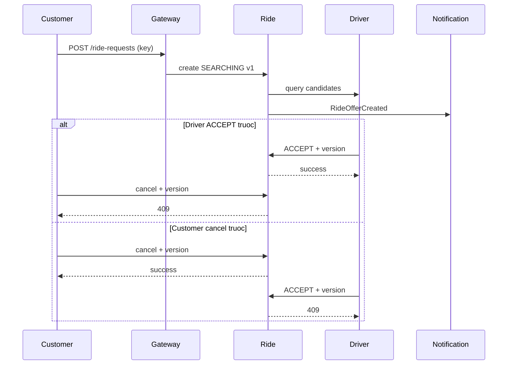
```mermaid
sequenceDiagram
Customer->>Gateway: POST /ride-requests (key)
Gateway->>Ride: create SEARCHING v1
Ride->>Driver: query candidates
Ride->>Notification: RideOfferCreated
alt Driver ACCEPT truoc
 Driver->>Ride: ACCEPT + version
 Ride-->>Driver: success
 Customer->>Ride: cancel + version
 Ride-->>Customer: 409
else Customer cancel truoc
 Customer->>Ride: cancel + version
 Ride-->>Customer: success
 Driver->>Ride: ACCEPT + version
 Ride-->>Driver: 409
end
```

#### Thanh toán điện tử → callback → đối soát

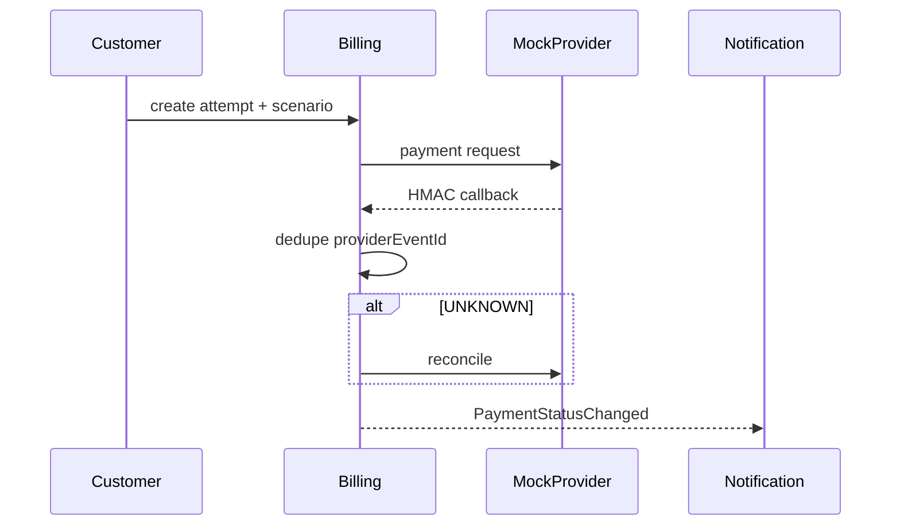
```mermaid
sequenceDiagram
Customer->>Billing: create attempt + scenario
Billing->>MockProvider: payment request
MockProvider-->>Billing: HMAC callback
Billing->>Billing: dedupe providerEventId
alt UNKNOWN
 Billing->>MockProvider: reconcile
end
Billing-->>Notification: PaymentStatusChanged
```

#### Duyệt hồ sơ tài xế

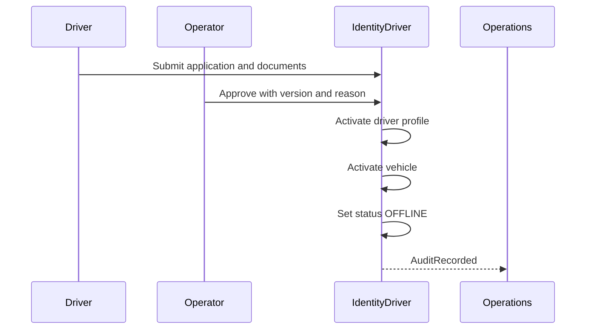
```mermaid
sequenceDiagram
participant Driver
participant Operator
participant IdentityDriver
participant Operations

Driver->>IdentityDriver: Submit application and documents
Operator->>IdentityDriver: Approve with version and reason
IdentityDriver->>IdentityDriver: Activate driver profile
IdentityDriver->>IdentityDriver: Activate vehicle
IdentityDriver->>IdentityDriver: Set status OFFLINE
IdentityDriver-->>Operations: AuditRecorded
```

#### Fare review

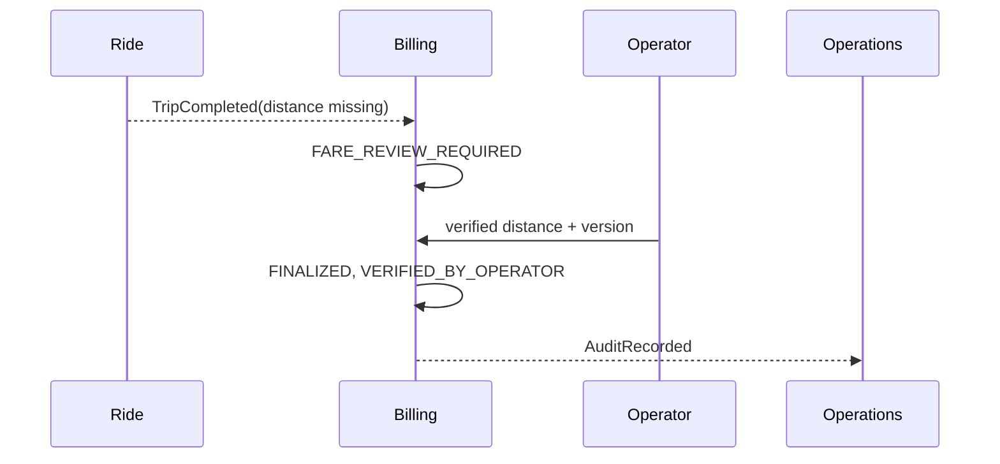
```mermaid
sequenceDiagram
Ride-->>Billing: TripCompleted(distance missing)
Billing->>Billing: FARE_REVIEW_REQUIRED
Operator->>Billing: verified distance + version
Billing->>Billing: FINALIZED, VERIFIED_BY_OPERATOR
Billing-->>Operations: AuditRecorded
```

### 12.5. Sơ đồ kiến trúc và nghiệp vụ

#### Use case diagram — Customer

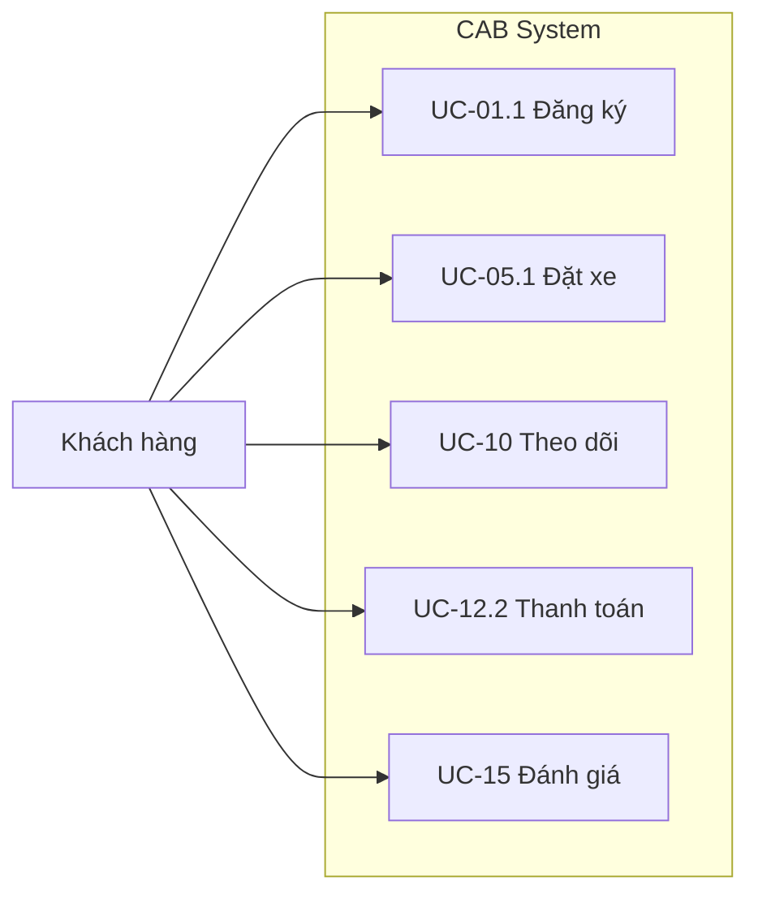
```mermaid
flowchart LR
    C["Khách hàng"]

    subgraph CAB["CAB System"]
        UC01["UC-01.1 Đăng ký"]
        UC05["UC-05.1 Đặt xe"]
        UC10["UC-10 Theo dõi"]
        UC12["UC-12.2 Thanh toán"]
        UC15["UC-15 Đánh giá"]
    end

    C --> UC01
    C --> UC05
    C --> UC10
    C --> UC12
    C --> UC15
```

#### Use case diagram — Driver

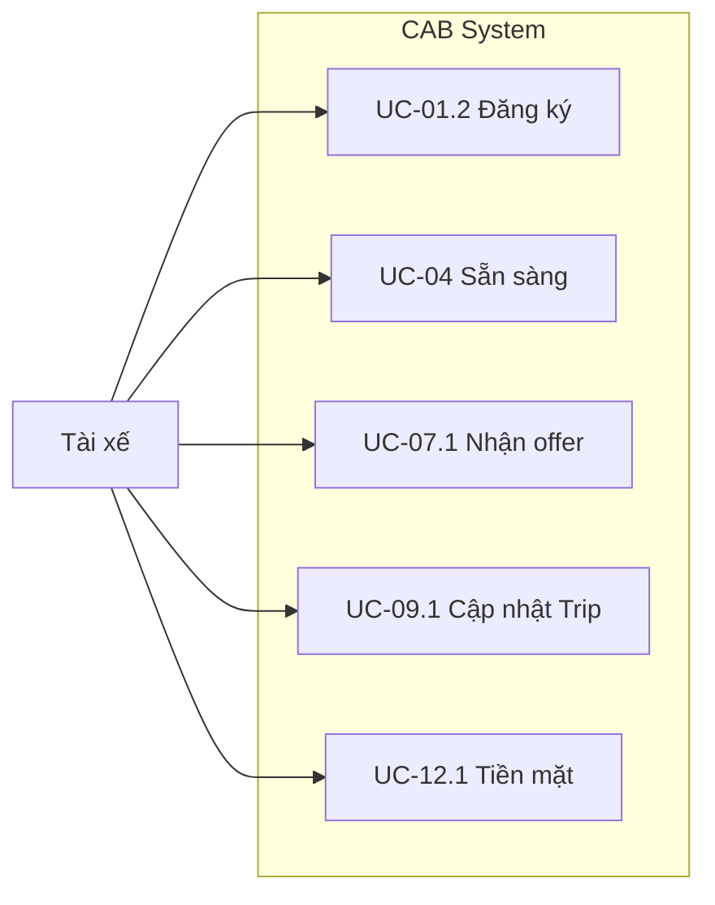
```mermaid
flowchart LR
    D["Tài xế"]

    subgraph CAB["CAB System"]
        UC01["UC-01.2 Đăng ký"]
        UC04["UC-04 Sẵn sàng"]
        UC07["UC-07.1 Nhận offer"]
        UC09["UC-09.1 Cập nhật Trip"]
        UC12["UC-12.1 Tiền mặt"]
    end

    D --> UC01
    D --> UC04
    D --> UC07
    D --> UC09
    D --> UC12
```

#### Use case diagram — Operator/Admin

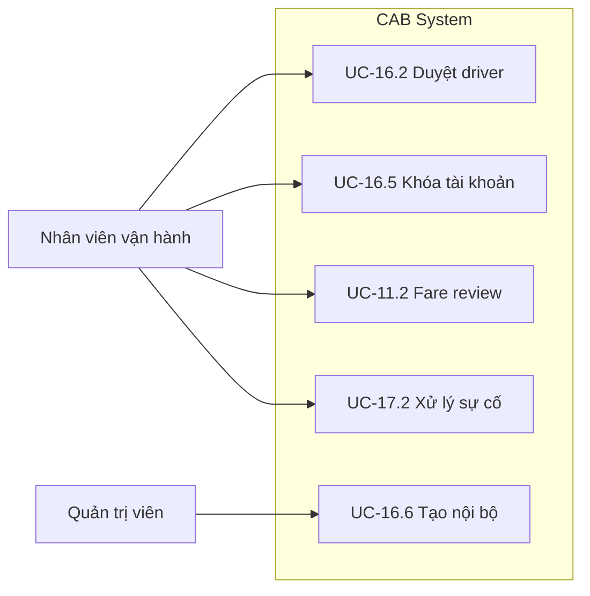
```mermaid
flowchart LR
    O["Nhân viên vận hành"]
    A["Quản trị viên"]

    subgraph CAB["CAB System"]
        UC16_2["UC-16.2 Duyệt driver"]
        UC16_5["UC-16.5 Khóa tài khoản"]
        UC11_2["UC-11.2 Fare review"]
        UC17_2["UC-17.2 Xử lý sự cố"]
        UC16_6["UC-16.6 Tạo nội bộ"]
    end

    O --> UC16_2
    O --> UC16_5
    O --> UC11_2
    O --> UC17_2
    A --> UC16_6
```

#### Use case diagram — Executive

```mermaid
flowchart LR
    E["Ban điều hành"]

    subgraph CAB["CAB System"]
        UC18["UC-18.1 Xem báo cáo"]
    end

    E --> UC18
```

#### Activity BP-03 — điều phối

```mermaid
flowchart TD
    A([Bắt đầu]) --> B["Ride: Query lại ứng viên"]
    B --> C{"Thời gian đã trôi qua ≤ 160 giây?"}
    C -- Có --> D["Ride: Tạo offer 20 giây"]
    D --> E{"Driver ACCEPT?"}
    E -- Có --> F["Ride: CAS version, tạo Trip"]
    F --> G([Kết thúc])
    E -- "DECLINE hoặc EXPIRE" --> H["Ride: Loại driver khỏi request"]
    H --> B
    C -- Không --> I["Ride: NO_DRIVER_FOUND trong 180 giây"]
    I --> G
```

#### Activity BP-05 — cước và thanh toán

```mermaid
flowchart TD
    A([Bắt đầu]) --> B["Billing: Tính Fare"]
    B --> C{"Fare FINALIZED?"}
    C -- Không --> D["Billing: FARE_REVIEW_REQUIRED"]
    D --> Z([Kết thúc])
    C -- Có --> E["Billing: Tạo PaymentAttempt"]
    E --> F["Mock Provider: Callback SUCCESS, FAILED hoặc UNKNOWN"]
    F --> G{"Kết quả callback?"}
    G -- UNKNOWN --> H["Billing: Đối soát; chặn attempt mới và thanh toán tiền mặt"]
    G -- FAILED --> I["Billing: Cho tạo attempt mới khi không còn pending"]
    G -- SUCCESS --> Z
    H --> Z
    I --> Z
```

#### Component diagram

```mermaid
flowchart LR
    CW["Customer Web"] --> GW["API Gateway"]
    DW["Driver Web"] --> GW
    OW["Operations Web"] --> GW

    GW --> ID["Identity & Driver"]
    GW --> R["Ride"]
    GW --> B["Billing"]
    GW --> N["Notification"]
    GW --> O["Operations & Reporting"]

    ID --> IDB[("Identity DB")]
    R --> RDB[("Ride DB")]
    B --> BDB[("Billing DB")]
    N --> NDB[("Notification DB")]
    O --> ODB[("Operations DB")]

    ID --> BO["Broker / Outbox"]
    R --> BO
    B --> BO
    N --> BO
    O --> BO

    B --> MP["Mock Provider"]
```

## 13. Câu hỏi cho triển khai sản xuất

Các câu hỏi dưới đây phục vụ triển khai sản xuất thật; baseline đồ án đã được quyết định và không cần hỏi lại trong phạm vi 7 tuần.

| ID   | Vấn đề                               | Nguồn trong `cus.md`                                        | DEC áp dụng  | Câu hỏi nên gửi Công ty ABC nếu làm sản xuất thật                                                     | Rủi ro nếu giả định sai                             | Trạng thái                                                     |
| ---- | ------------------------------------ | ----------------------------------------------------------- | ------------ | ----------------------------------------------------------------------------------------------------- | --------------------------------------------------- | -------------------------------------------------------------- |
| Q-01 | Công thức cước thương mại            | Nguồn khách hàng nêu thiếu chi tiết cho chính sách sản xuất | DEC-06/22/23 | Công thức theo loại xe, km, thời gian, phụ phí, thuế và quy tắc làm tròn nào có hiệu lực?             | Thu sai cước, sai báo cáo và tranh chấp             | Đồ án: [Đã chốt cho đồ án]; sản xuất: [Ngoài phạm vi sản xuất] |
| Q-02 | Tiêu chí và thứ tự ưu tiên tài xế    | “tiêu chí ưu tiên tài xế”                                   | DEC-16/17    | Ngoài khoảng cách và availability, có ưu tiên khu vực, hạng xe, rating hay công bằng phân phối không? | Phân công không công bằng hoặc giảm tỷ lệ nhận      | Đồ án: [Đã chốt cho đồ án]; sản xuất: [Ngoài phạm vi sản xuất] |
| Q-03 | Thời gian phản hồi và trần điều phối | “thời gian tài xế phải phản hồi”                            | DEC-16       | Thời hạn offer và tổng thời gian tìm tài xế theo khu vực/giờ cao điểm là bao nhiêu?                   | Chờ lâu, bỏ lỡ tài xế hoặc quá tải notification     | Đồ án: [Đã chốt cho đồ án]; sản xuất: [Ngoài phạm vi sản xuất] |
| Q-04 | Chính sách hủy và xử lý sự cố        | “chính sách hủy chuyến”                                     | DEC-20/21/35 | Ai được hủy ở từng trạng thái; có phí, bồi hoàn, phạt hay điều phối lại không?                        | Sai doanh thu, KPI và quyền lợi các bên             | Đồ án: [Đã chốt cho đồ án]; sản xuất: [Ngoài phạm vi sản xuất] |
| Q-05 | Mất kết nối và khôi phục tác vụ      | “cách xử lý khi mất kết nối mạng”                           | DEC-28/34/37 | Client được retry thao tác nào, trong bao lâu, và SLA đồng bộ trạng thái là gì?                       | Giao dịch trùng, trạng thái lệch hoặc thông báo mất | Đồ án: [Đã chốt cho đồ án]; sản xuất: [Ngoài phạm vi sản xuất] |
| Q-06 | Thời gian lưu trữ và xóa dữ liệu     | “thời gian lưu trữ dữ liệu”                                 | DEC-12/29    | Thời hạn giữ/xóa/ẩn danh cho hồ sơ, vị trí, giao dịch, audit và backup là bao lâu?                    | Vi phạm pháp lý, thiếu bằng chứng hoặc tăng chi phí | Đồ án: [Đã chốt cho đồ án]; sản xuất: [Ngoài phạm vi sản xuất] |

## 14. Tài liệu truy vết

Luồng BP chi tiết, NEED/STK/SCOPE/DATA, RTM và bảng kiểm tra lỗi còn mở được giữ tại [SRS-REFERENCE.md](SRS-REFERENCE.md). Khi triển khai đồ án, áp dụng DEC/FR/UC/AC trong SRS này.
