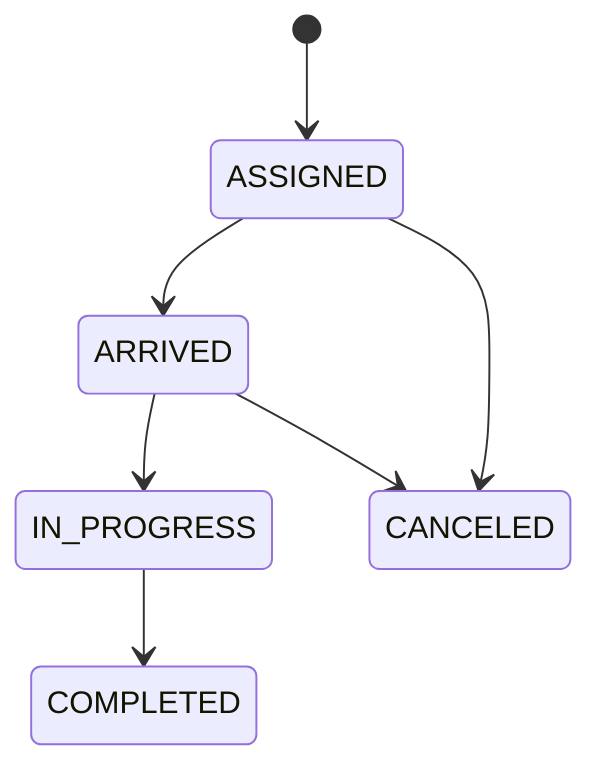
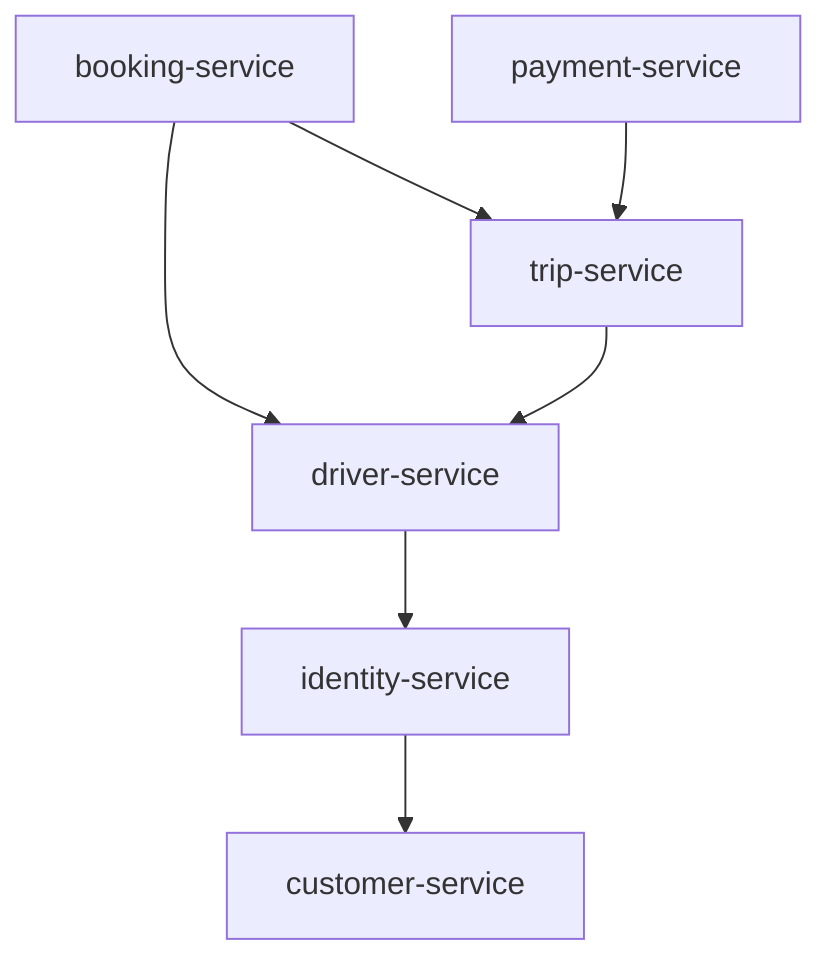

# CAB System — Software Requirements Specification

## Mục lục

- [1. Mục tiêu](#section-1)
- [2. Stakeholders](#section-2)
- [3. Actors](#section-3)
- [4. Business Goals](#section-4)
- [5. Scope](#section-5)
- [6. Business Workflows](#section-6)
- [7. State Machine](#section-7)
- [8. Use Cases](#section-8)
- [9. Functional Requirements theo Actor](#section-9)
- [10. Business Rules theo Actor](#section-10)
- [11. Audit Requirements](#section-11)
- [12. Notification Requirements](#section-12)
- [13. Data Model](#section-13)
- [14. Deployment Components](#section-14)
- [15. Microservice Ownership](#section-15)
- [16. Non-functional Requirements](#section-16)
- [17. Traceability PC1–PC30](#section-17)
- [18. Quy tắc quyền và dữ liệu](#section-18)
- [19. Lịch sử thay đổi](#section-19)

Phiên bản 3.4 · 01/10/2026 · Hoàn thiện các lệch còn lại trong audit1.md: enum Driver, registrationToken, tariff snapshot, timeout, XSS, event catalog, Booking/Trip, PC24 và Compose init.

<a id="section-1"></a>

# 1. Mục tiêu

Xác định yêu cầu theo Actor → UC → FR → BR/BRULE, và truy vết đủ PC1–PC30. P1 đúng ranh giới service đã chốt; P2 không làm phình Compose. Đây là sửa baseline có thay đổi hành vi theo prompt, không phải chỉ đổi mapping service. Các mã UC-01–21, FR-01–32, BR-01–08, BRULE-01–24, NFR-01–08 được giữ; nội dung/phạm vi thay đổi ghi §19.

<a id="section-2"></a>

# 2. Stakeholders

| Stakeholder | Vai trò | Mối quan tâm |
|---|---|---|
| **Customer** | Người đặt xe và sử dụng dịch vụ | Đặt xe, theo dõi lộ trình và vị trí tài xế, hủy chuyến theo quy tắc, thanh toán an toàn, đánh giá chuyến đi, nhận thông báo |
| **Driver** | Người nhận và thực hiện chuyến xe | Đăng ký hồ sơ (CCCD/GPLX/xe), nhận offer cuốc xe, cập nhật trạng thái/vị trí thời gian thực, hủy chuyến theo quy tắc, xem lịch sử và doanh thu |
| **Employee** | Nhân viên vận hành hệ thống | Quản lý người dùng, tài xế, điều phối booking/trip, xử lý khiếu nại (incident), đối soát giao dịch thanh toán |
| **Administrator** | Quản trị hệ thống | Quản lý tài khoản, gán role/permission (RBAC), xét duyệt hồ sơ tài xế, bảo mật và cấu hình hệ thống |
| **Board of Directors** | Ban giám đốc (Read-only) | Dashboard, giám sát KPI, doanh thu, tỷ lệ hoàn thành/hủy chuyến, hiệu quả vận hành theo thời gian và khu vực |
| **Payment Provider** | Cổng thanh toán bên ngoài | Xử lý giao dịch thanh toán trực tuyến, gửi webhook callback, bảo đảm an toàn giao dịch và chống thanh toán trùng lặp (Idempotency) |
| **Map Provider** | Dịch vụ bản đồ bên ngoài | Geocoding, reverse geocoding, tính toán khoảng cách lộ trình (distance) và thời gian di chuyển dự kiến (ETA) |
| **SMS/Notification Provider** | Dịch vụ tin nhắn & thông báo bên ngoài | Gửi mã OTP xác minh qua SMS, chuyển phát thông báo đẩy (push notification) tới người dùng và tài xế |
| **Kafka** | Event streaming backbone | Publish/subscribe sự kiện nghiệp vụ và phân phối thông báo bất đồng bộ giữa các microservices |

<a id="section-3"></a>

# 3. Actors

| Actor | Phạm vi | UC |
| --- | --- | --- |
| Customer | P1 | UC-02/03/04/05/09–12/15–17/19 |
| Driver | P1 | UC-03/05–08/13–15/19 |
| Admin | P1 duyệt hồ sơ; account/role (P2) | UC-03/07; đọc đúng ma trận |
| Operator/Employee (P2) | Vận hành qua `backoffice-service` (P2) | UC-20 (P2) |
| Executive/Board (P2) | Báo cáo qua `backoffice-service` (P2) | UC-21 (P2) |
| Payment Provider | Hệ thống ngoài qua adapter | UC-17/18 |
| Map Provider | Hệ thống ngoài qua adapter | UC-10; tính Fare trong UC-13 |
| SMS/Notification Provider | Ngoài hệ thống; adapter OTP/delivery | UC-06/19 |

Service, scheduler và Kafka không phải actor người dùng. Một user có đúng một role. Gateway xác minh token và owner kiểm quyền tài nguyên.

<a id="section-4"></a>

# 4. Business Goals

| BR | Mục tiêu | Kết quả | FR | Quy tắc |
| --- | --- | --- | --- | --- |
| BR-01 | Cung cấp tài khoản và xác thực theo vai trò | Customer đăng ký; Driver xác minh phone và nộp hồ sơ; 5 vai trò đăng nhập an toàn. | FR-02–08 | BRULE-01–05 |
| BR-02 | Kiểm soát tài xế đủ điều kiện hoạt động | Admin duyệt hồ sơ; tài xế được duyệt quản lý nhận chuyến/vị trí. | FR-09–12 | BRULE-05–06, BRULE-14 |
| BR-03 | Kết nối khách với tài xế phù hợp | Tìm tài xế theo khu vực, báo giá, tạo Booking và điều phối offer. | FR-13–19 | BRULE-07–12 |
| BR-04 | Theo dõi và kết thúc chuyến | Các bên xem Trip; tài xế cập nhật trạng thái/vị trí; hủy đúng điều kiện và lý do. | FR-20–23 | BRULE-13–16 |
| BR-05 | Ghi nhận chất lượng dịch vụ | Khách đánh giá chuyến đã hoàn thành; điểm tài xế được cập nhật. | FR-24–25 | BRULE-17 |
| BR-06 | Thu tiền online an toàn | Xử lý phiên/callback, ghi nhận đã thanh toán; chống xử lý lặp và thu đôi. | FR-26–29 | BRULE-18–21 |
| BR-07 | Thông báo kết quả nghiệp vụ | Lưu thông báo chuyến, hồ sơ, thanh toán; người nhận tra cứu được. | FR-30 | BRULE-22–23 |
| BR-08 | Hỗ trợ vận hành và theo dõi hệ thống | Health P1; tra cứu/report vận hành và Audit Log thuộc `backoffice-service` (P2). | FR-01, FR-31–32 | BRULE-03, BRULE-23–24 |

<a id="section-5"></a>

# 5. Scope

| P1 bắt buộc | Ngoài P1 / P2 |
| --- | --- |
| Đăng ký/login Customer, OTP/hồ sơ/duyệt Driver | Quản lý account/role, refresh/logout (P2) |
| nearby, Booking/offer/assignment/Trip/Fare/Review | Incident, Employee Operations (P2) |
| Thanh toán online sau `COMPLETED`, callback/idempotency | payment_methods/customer_activity (P2) |
| Kafka/outbox/inbox, Redis, bảo mật PC24–30 | Board dashboard/report và Audit Log (P2) |

<a id="section-6"></a>

# 6. Business Workflows

### 6.1 Account và Customer

Customer đăng ký → Gateway → `identity-service` kiểm tra email/phone, hash password và mã hóa thông tin liên hệ → `identity-service` gọi `customer-service` tạo profile theo userId. Identity lưu trạng thái phối hợp; lỗi profile giữ yêu cầu để retry cùng registration id, không tạo Account trùng và không trả thành công quá sớm. Login email/phone đều lookup blind index, so hash, kiểm trạng thái rồi ký JWT theo scope ở §16.2.1. Profile đọc tại `customer-service`, Account ở `identity-service`.

### 6.2 Đăng ký Driver

`driver-service` nhận phone, tạo OTP hash trong DB và chỉ mục TTL tại Redis; adapter SMS mock bên ngoài gửi mã, không gọi ngược `notification-service`. Verify đúng tạo registrationToken là JWT HS256 ký bởi `driver-service` bằng `REGISTRATION_TOKEN_KEY`, TTL 15 phút, claims cố định `sub` (driverId đã preallocate), `phoneHash`, `purpose=DRIVER_REGISTRATION`, `challengeId`, `jti`, `iss=driver-service`, `aud=identity-service`, `iat`, `exp`. Token này không phải access token. `driver-service` nhận hồ sơ CCCD/bằng lái/xe, gọi `identity-service` tạo Account bằng token gắn phone; `identity-service` hash password/mã hóa email/phone, kiểm unique và registration jti. `driver-service` mã hóa CCCD/bằng lái, lưu hồ sơ `PENDING_APPROVAL`. DB challenge `consumed_at` và account `registration_id` chống dùng token tạo hai tài khoản.

### 6.3 Duyệt Driver

Admin gọi danh sách/chi tiết Driver rồi approve hoặc reject qua Gateway → `driver-service`. Driver còn `PENDING_APPROVAL` mới được quyết định; reject bắt buộc reason. `driver-service` commit profile `OFFLINE`/`REJECTED` + outbox `driver.application.decided`; `identity-service` consume kích hoạt hoặc từ chối Account, `notification-service` consume báo kết quả. Driver được duyệt chỉ `ONLINE` khi JWT mới có accountStatus=`ACTIVE` và vị trí hợp lệ; nếu dùng token hạn chế trước duyệt thì login lại. Chưa đồng bộ xong trả 409/503 có thể thử lại, không cho tài xế chưa được Identity kích hoạt nhận chuyến.

### 6.4 Availability, Location và nearby

`driver-service` cập nhật status và vị trí. Postgres là nguồn bền vững, Redis GEO/TTL hỗ trợ tìm nhanh; response về vị trí thành công sau DB/outbox commit. nearby lọc radius bằng khoảng cách thực, status mặc định `ONLINE` và phân trang; offline/busy/pending bị loại mặc định. Trong điều phối, `driver-service` loại reservation đang hiệu lực; `trip-service` nhận `driver.location.updated` để cập nhật vị trí Trip `IN_PROGRESS` và cache Redis.

### 6.5 Ước tính và Booking

`booking-service` gọi Map adapter lấy distance/ETA, đọc tariff projection được seed/cùng nguồn để báo giá estimate. Booking không sở hữu Fare chính thức. Booking dùng khóa cục bộ theo customerId và unique index bảo vệ một Booking đang xử lý; gọi `trip-service` kiểm Trip hoạt động rồi tạo `SEARCHING` và outbox. Worker lấy ứng viên `driver-service`, preallocate offerId và reserve Driver tại owner trước khi ghi Offer `PENDING` + outbox; reserve thất bại thì chọn ứng viên tiếp. Chỉ tạo offer tuần tự; timer chuyển `EXPIRED`, reject chuyển `REJECTED`. Không ứng viên/hết giới hạn ghi `NO_DRIVER_FOUND` và notification. Báo giá chỉ ước tính; tariff cuối được `trip-service` tính và khóa lúc tạo Trip.

### 6.6 Offer, Assignment và tạo Trip

Driver accept → `booking-service` khóa Offer/Booking, kiểm owner và thời hạn, ghi assignment đang phối hợp và commandKey bền vững; không giữ DB transaction khi gọi mạng. Reservation đã được tạo lúc gửi Offer; accept dùng lại reservation đó; `booking-service` gọi `trip-service` POST /internal/trips với bookingId,offerId,reservationId,customerId,driverId,pickup,dropoff,vehicleType và snapshot. `trip-service` xác nhận reservation qua `driver-service`, kiểm unique Trip hoạt động, tính/khóa Fare và tạo Trip `ASSIGNED` + `trip.assigned` trong một transaction tại Trip. `booking-service` hoàn tất Offer `ACCEPTED`/Booking `ASSIGNED`/assignment và phát `booking.assigned`. Response mất thì retry cùng key/bookingId lấy cùng tripId; assignment chưa rõ kết quả không release để đưa người khác vào. Reservation hết hạn không đủ để kết luận Trip không tồn tại: kiểm/reconcile bằng bookingId trước dispatch tiếp. Không gói hai DB vào cùng transaction. Kafka `trip.assigned` hỗ trợ phục hồi Booking/Driver/Notification. Contract reservation và assignment được chuẩn hóa tại §14.1/§16.2.1 và Micro §2/§9.6; backend phải đối chiếu implementation với các contract này.

### 6.7 Hành trình và hoàn thành

Driver chuyển Trip `ASSIGNED`→`ARRIVED`→`IN_PROGRESS`→`COMPLETED` tại `trip-service`; transition + outbox nguyên tử. Trong hành trình Driver gửi vị trí tới `driver-service`, `trip-service` cập nhật từ event mới hơn recordedAt/version. Khi hoàn thành `trip-service` phát `trip.completed` kèm Fare đã khóa; `driver-service` chuyển `BUSY`→`ONLINE`, `booking-service` `ASSIGNED`→`COMPLETED` và giải phóng khóa Customer. Booking bảo vệ một yêu cầu hoạt động bằng trạng thái/phối hợp cục bộ, không chỉ dựa projection Driver eventual consistency.

### 6.8 Hủy Booking/Trip

Customer hủy Booking `SEARCHING` với reason tại `booking-service`; đóng offer/reservation và phát `booking.canceled`. Trip `ASSIGNED` hoặc `ARRIVED` được chủ Customer hoặc Driver được gán hủy tại `trip-service`; commit `CANCELED`, canceledBy,reason và `trip.canceled`. Driver/Booking/Notification consume để trả `ONLINE`, Booking `CANCELED` và thông báo. Không có Payment cho Trip bị hủy, không tự điều phối lại và không hủy khi `IN_PROGRESS` trở đi. Cancel đua với accept phải khóa Booking; assignment đang phối hợp được reconcile trước xác nhận hủy, không vừa báo hủy vừa tạo Trip hoạt động.

### 6.9 Các luồng sau chuyến

Thanh toán/review chỉ sau khi Trip đủ điều kiện; thông báo không quyết định kết quả nghiệp vụ nguồn.

### 6.9.1 Khởi tạo thanh toán

Customer POST /payments {tripId,method:`ONLINE`} có Idempotency-Key → `payment-service` gọi `trip-service` /payable lấy Trip `COMPLETED`,`UNPAID`,Fare và `customerId`; đối chiếu trực tiếp với `JWT.profileId`. Payment tạo một bản ghi `PENDING` + một attempt, gọi Payment Provider qua adapter lấy paymentUrl/providerTxnRef. Client không gửi amount; provider nhận số tiền từ server. `FAILED` được retry bằng key mới trên cùng Payment; `PENDING`/`COMPLETED` không tạo phiên mới. Timeout provider có thể chưa rõ kết quả, giữ `PENDING` và không tự thử lại; cần xác nhận về timeout/reconciliation.

### 6.9.2 Callback

Provider callback qua Gateway → `payment-service`. Kiểm HMAC/timestamp/providerTxnRef/amountVnd, khóa Payment và dedupe providerEventId. SUCCESS chuyển `COMPLETED` + outbox `payment.completed`; `FAILED` chuyển `FAILED` + `payment.failed`; phiên cũ không làm đổi attempt đang hiệu lực và `COMPLETED` không bị hạ trạng thái. Trùng providerEventId trả nguyên kết quả đã lưu. `trip-service` consume `payment.completed` ghi paymentStatus=`PAID`; `notification-service` báo kết quả. Provider call phải có provider idempotency reference ổn định; cam kết này chỉ mô phỏng ở mock, provider thật chưa chốt.

### 6.9.3 Review

Customer chủ Trip `COMPLETED` POST Review với stars/comment → `trip-service` kiểm owner, unique tripId, escape comment và commit Review + `trip.review.created`. `driver-service` inbox dedupe trước cộng ratingSum/ratingCount; không dùng cộng lặp như thao tác idempotent. Customer đọc review qua owner API.

### 6.9.4 Notification và vận hành P2

`notification-service` subscribe event ở §12, MongoDB transaction ghi processed_events và notifications cùng phiên; unique(recipient_role,recipient_id,event_id) chặn trùng. Delivery qua adapter; lỗi delivery không rollback giao dịch nguồn; retry có kiểm soát và dead-letter. User chỉ xem/read inbox với recipient_role=JWT.role và recipient_id=JWT.profileId; không so profileId với JWT.sub. Tra cứu vận hành, Incident, báo cáo, Audit Log thuộc `backoffice-service` (P2), không triển khai route/service P2 trong Compose P1.

<a id="section-7"></a>

# 7. State Machine

| Aggregate | Owner | Trạng thái chuẩn / transitions |
| --- | --- | --- |
| Driver | `driver-service` | `PENDING_APPROVAL`→`OFFLINE` khi duyệt; →`REJECTED` khi từ chối; `OFFLINE`↔`ONLINE`; `ONLINE`→`BUSY`; `BUSY`→`ONLINE` khi Trip kết thúc |
| Booking | `booking-service` | `SEARCHING`→`ASSIGNED`/`NO_DRIVER_FOUND`/`CANCELED`; `ASSIGNED`→`COMPLETED`/`CANCELED` theo Trip |
| Offer | `booking-service` | `PENDING`→`ACCEPTED`/`REJECTED`/`EXPIRED`/`CANCELED` |
| Trip | `trip-service` | `ASSIGNED`→`ARRIVED`→`IN_PROGRESS`→`COMPLETED`; `ASSIGNED`/`ARRIVED`→`CANCELED` |
| Payment | `payment-service` | `PENDING`→`COMPLETED`/`FAILED`; `FAILED`→`PENDING` khi retry an toàn; `COMPLETED` terminal |
| Account | `identity-service` | `PENDING_APPROVAL`→`ACTIVE`/`REJECTED`; CUSTOMER mới `ACTIVE` |
| Trip.paymentStatus | `trip-service` | `UNPAID`→`PAID` khi `payment.completed` hợp lệ |
| Notification | `notification-service` | read_at null→timestamp; delivery `PENDING`/`SENT`/`FAILED` |

Fare khóa lúc tạo Trip; enum Fare riêng cần C03 nếu backend có thêm trạng thái, không tự thêm trạng thái hoàn tiền. Booking `ASSIGNED` chưa phải `COMPLETED` chỉ vì Trip đã được tạo. Không gộp Account.status và Driver.status.


```mermaid
stateDiagram-v2
  [*] --> ASSIGNED
  ASSIGNED --> ARRIVED
  ARRIVED --> IN_PROGRESS
  IN_PROGRESS --> COMPLETED
  ASSIGNED --> CANCELED
  ARRIVED --> CANCELED
```

<a id="section-8"></a>

# 8. Use Cases

| UC | Tên | Actor | Scope | FR | Workflow |
| --- | --- | --- | --- | --- | --- |
| UC-01 | Kiểm tra sức khỏe | Operator/Admin; không đăng nhập | P1 | FR-01 | 16.0 |
| UC-02 | Đăng ký khách hàng | Customer | P1 | FR-02 | 6.1 |
| UC-03 | Đăng nhập | Customer/Driver/Admin; Operator/Executive (P2) | P1 | FR-03 | 6.1 |
| UC-04 | Xem thông tin khách | Customer(owner),Admin | P1 | FR-04 | 6.1 |
| UC-05 | Xem thông tin tài xế | Driver(owner),Customer(public),Admin | P1 | FR-05 | 6.2 |
| UC-06 | Đăng ký tài xế | Driver | P1 | FR-06,FR-07,FR-08 | 6.2 |
| UC-07 | Duyệt tài xế | Admin | P1 | FR-09,FR-10 | 6.3 |
| UC-08 | Cập nhật trạng thái và vị trí | Driver | P1 | FR-11,FR-12 | 6.4 |
| UC-09 | Tìm tài xế gần | Customer,Admin | P1 | FR-13 | 6.4 |
| UC-10 | Ước tính giá | Customer | P1 | FR-14 | 6.5 |
| UC-11 | Đặt xe | Customer | P1 | FR-15,FR-16,FR-17 | 6.5 |
| UC-12 | Xem Booking | Customer(owner),Admin | P1 | FR-17 | 6.5 |
| UC-13 | Phản hồi offer | Driver | P1 | FR-18,FR-19,FR-20 | 6.6 |
| UC-14 | Cập nhật chuyến | Driver(assigned) | P1 | FR-12,FR-20,FR-21 | 6.7 |
| UC-15 | Hủy yêu cầu đặt xe | Customer/Driver | P1 | FR-22,FR-23 | 6.8 |
| UC-16 | Đánh giá chuyến | Customer(owner) | P1 | FR-24,FR-25 | 6.9.3 |
| UC-17 | Thanh toán online | Customer(owner) | P1 | FR-26,FR-27,FR-29 | 6.9.1 |
| UC-18 | Xử lý callback | Payment Provider | P1 | FR-28 | 6.9.2 |
| UC-19 | Xem thông báo | User(owner) | P1 | FR-30 | 6.9.4 |
| UC-20 | Tra cứu chuyến | Operator/Admin (P2) | P2 | FR-31 | 6.9.4 |
| UC-21 | Xem báo cáo | Executive/Admin (P2) | P2 | FR-32 | 6.9.4 |

### UC-01 Kiểm tra sức khỏe

**Actor:** Người kiểm tra hệ thống; endpoint public, không đăng nhập. **FR:** FR-01. **Phạm vi:** P1.

**Tiền điều kiện:** Hệ thống được triển khai.

**Luồng chính:**

1. Actor gọi /health; Gateway trả trạng thái tiến trình.
2. Actor gọi /ready; Gateway kiểm các dependency bắt buộc.
3. Actor gọi /health/services; nhận trạng thái từng service và Kafka/DB/Redis liên quan.

**Hậu điều kiện:** Trả trạng thái service/hạ tầng.

**Alternative/Exception:** /health vẫn 200 khi process sống; dependency DOWN làm /ready trả 503, /health/services ghi DOWN.

**AC-01.1:** Given tiền điều kiện, When luồng chính, Then Trả trạng thái service/hạ tầng.

**AC-01.2:** Given GET health/ready/services; thành phần DOWN trả 503, Then từ chối/xử lý đúng hợp đồng, không tạo side effect trái quyền hoặc giao dịch trùng.

### UC-02 Đăng ký khách hàng

**Actor:** Customer. **FR:** FR-02. **Phạm vi:** P1.

**Tiền điều kiện:** Email/phone chưa có tài khoản.

**Luồng chính:**

1. Customer gửi fullName/email/phone/password và key.
2. Identity kiểm dữ liệu, tính duy nhất và tạo Account theo workflow §6.1.
3. Identity gọi Customer tạo profile; hoàn tất phối hợp và trả customerId/userId.

**Hậu điều kiện:** Account/profile sẵn sàng; đăng nhập được.

**Alternative/Exception:** Thiếu email/phone 400; trùng 409; profile chưa xong không trả 201.

**AC-02.1:** Given tiền điều kiện, When luồng chính, Then Account/profile sẵn sàng; đăng nhập được.

**AC-02.2:** Given Thiếu email/phone 400; trùng 409; profile chưa xong không trả 201, Then từ chối/xử lý đúng hợp đồng, không tạo side effect trái quyền hoặc giao dịch trùng.

### UC-03 Đăng nhập

**Actor:** Customer/Driver/Admin; Operator/Executive (P2). **FR:** FR-03. **Phạm vi:** P1.

**Tiền điều kiện:** Account tồn tại; `ACTIVE` dùng scope nghiệp vụ, Driver `PENDING_APPROVAL`/`REJECTED` chỉ dùng scope hạn chế.

**Luồng chính:**

1. Actor nhập email hoặc phone và password.
2. Identity kiểm định dạng, tìm blind index, so password hash và trạng thái Account.
3. `identity-service` trả JWT `RS256`, expiry, role, profileId, accountStatus và scope; Driver chờ duyệt dùng scope hạn chế theo §16.2.1.

**Hậu điều kiện:** JWT hợp lệ được cấp theo trạng thái và scope; Driver chờ duyệt chỉ xem hồ sơ/inbox.

**Alternative/Exception:** Sai định dạng 400; sai credentials 401; Driver chờ duyệt chỉ token hạn chế; SQLi không token; quá hạn/rate theo §16.

**AC-03.1:** Given tiền điều kiện, When luồng chính, Then JWT hợp lệ được cấp theo trạng thái và scope; Driver chờ duyệt chỉ xem hồ sơ/inbox.

**AC-03.2:** Given Sai định dạng 400; sai credentials 401; Driver chờ duyệt chỉ token hạn chế; SQLi không token; quá hạn/rate theo §16, Then từ chối/xử lý đúng hợp đồng, không tạo side effect trái quyền hoặc giao dịch trùng.

### UC-04 Xem thông tin khách

**Actor:** Customer(owner),Admin. **FR:** FR-04. **Phạm vi:** P1.

**Tiền điều kiện:** Token hợp lệ.

**Luồng chính:**

1. Customer gọi /customers/{id} với JWT.
2. Customer service kiểm sub/role/ownership.
3. Trả profile của chính Customer; Admin đọc theo ma trận §16.3.

**Hậu điều kiện:** Trả profile được phép.

**Alternative/Exception:** Người khác 403; tài nguyên không tồn tại 404; token sửa 401.

**AC-04.1:** Given tiền điều kiện, When luồng chính, Then Trả profile được phép.

**AC-04.2:** Given Người khác 403; không có 404; token sửa 401, Then từ chối/xử lý đúng hợp đồng, không tạo side effect trái quyền hoặc giao dịch trùng.

### UC-05 Xem thông tin tài xế

**Actor:** Driver(owner),Customer(public),Admin. **FR:** FR-05. **Phạm vi:** P1.

**Tiền điều kiện:** Token hợp lệ.

**Luồng chính:**

1. Actor gọi /drivers/{id} với JWT.
2. Driver kiểm quyền đọc và chọn các trường theo role.
3. Trả hồ sơ được phép; dữ liệu giấy tờ được che.

**Hậu điều kiện:** Trả hồ sơ theo quyền.

**Alternative/Exception:** Customer không nhận email/phone/CCCD; Driver khác 403.

**AC-05.1:** Given tiền điều kiện, When luồng chính, Then Trả hồ sơ theo quyền.

**AC-05.2:** Given Customer không nhận email/phone/CCCD; Driver khác 403, Then từ chối/xử lý đúng hợp đồng, không tạo side effect trái quyền hoặc giao dịch trùng.

### UC-06 Đăng ký tài xế

**Actor:** Driver. **FR:** FR-06,FR-07,FR-08. **Phạm vi:** P1.

**Tiền điều kiện:** Phone chưa dùng.

**Luồng chính:**

1. Driver request OTP và nhận challengeId.
2. Driver verify code, nhận registrationToken gắn phone.
3. Driver gửi hồ sơ CCCD/bằng lái/xe cùng token/password.
4. Driver phối hợp Identity tạo Account, lưu hồ sơ `PENDING_APPROVAL` và trả ID.

**Hậu điều kiện:** Driver `PENDING_APPROVAL`; Account chờ duyệt.

**Alternative/Exception:** OTP sai/hết hạn 422; quá thử 429; token replay 401; thiếu giấy tờ 400.

**AC-06.1:** Given tiền điều kiện, When luồng chính, Then Driver `PENDING_APPROVAL`; Account chờ duyệt.

**AC-06.2:** Given OTP sai/hết hạn 422; quá thử 429; token replay 401; thiếu giấy tờ 400, Then từ chối/xử lý đúng hợp đồng, không tạo side effect trái quyền hoặc giao dịch trùng.

### UC-07 Duyệt tài xế

**Actor:** Admin. **FR:** FR-09,FR-10. **Phạm vi:** P1.

**Tiền điều kiện:** Driver `PENDING_APPROVAL`.

**Luồng chính:**

1. Admin mở danh sách Driver `PENDING_APPROVAL`.
2. Admin xem hồ sơ/giấy tờ/xe của Driver.
3. Admin chọn approve và gửi request có key.
4. Driver ghi `OFFLINE` và outbox; Identity kích hoạt Account, Notification báo kết quả.

**Hậu điều kiện:** `OFFLINE` hoặc `REJECTED` và thông báo.

**Alternative/Exception:** Admin có thể chọn reject với reason, thay bước approve;  Thiếu lý do từ chối 400; không còn chờ 409; role khác 403.

**AC-07.1:** Given tiền điều kiện, When luồng chính, Then `OFFLINE` hoặc `REJECTED` và thông báo.

**AC-07.2:** Given Thiếu lý do từ chối 400; không còn chờ 409; role khác 403, Then từ chối/xử lý đúng hợp đồng, không tạo side effect trái quyền hoặc giao dịch trùng.

### UC-08 Cập nhật trạng thái và vị trí

**Actor:** Driver. **FR:** FR-11,FR-12. **Phạm vi:** P1.

**Tiền điều kiện:** Driver đã duyệt.

**Luồng chính:**

1. Driver đã duyệt gửi vị trí hợp lệ.
2. Driver chọn `ONLINE`; owner kiểm Account/Driver/vị trí/Trip/reservation.
3. Owner lưu status và updatedAt; nhận chuyến mới khi đủ điều kiện.

**Hậu điều kiện:** Availability/vị trí ghi đúng.

**Alternative/Exception:** Driver `ONLINE` có thể chọn `OFFLINE` nếu không `BUSY` và không còn Offer `PENDING`/reservation `HELD`; nếu còn Offer thì trả 409 `ACTIVE_OFFER_EXISTS`. Chưa duyệt 403; `BUSY` đổi availability 409; vị trí thiếu/quá cũ 422.

**AC-08.1:** Given tiền điều kiện, When luồng chính, Then Availability/vị trí ghi đúng.

**AC-08.2:** Given Chưa duyệt 403; `BUSY` đổi availability 409; vị trí thiếu/quá cũ 422, Then từ chối/xử lý đúng hợp đồng, không tạo side effect trái quyền hoặc giao dịch trùng.

### UC-09 Tìm tài xế gần

**Actor:** Customer,Admin. **FR:** FR-13. **Phạm vi:** P1.

**Tiền điều kiện:** Token và tọa độ hợp lệ.

**Luồng chính:**

1. Customer gửi lat/lng và bộ lọc radius/status/page/limit.
2. Driver service tìm theo GEO và xác minh khoảng cách/trạng thái từ nguồn owner.
3. Trả items và metadata phân trang.

**Hậu điều kiện:** Danh sách trong radius có page/limit.

**Alternative/Exception:** Sai tọa độ/radius/paging 400/422; lọc đúng trạng thái.

**AC-09.1:** Given tiền điều kiện, When luồng chính, Then Danh sách trong radius có page/limit.

**AC-09.2:** Given Sai tọa độ/radius/paging 400/422; lọc đúng trạng thái, Then từ chối/xử lý đúng hợp đồng, không tạo side effect trái quyền hoặc giao dịch trùng.

### UC-10 Ước tính giá

**Actor:** Customer. **FR:** FR-14. **Phạm vi:** P1.

**Tiền điều kiện:** Token và hai tọa độ hợp lệ.

**Luồng chính:**

1. Customer gửi pickup/dropoff/vehicleType.
2. Booking kiểm vùng phục vụ và gọi Map adapter lấy distance/ETA.
3. Booking tính estimate theo tariff tham khảo và trả báo giá có nhãn ước tính.

**Hậu điều kiện:** Estimate và ETA, chưa phải Fare cuối.

**Alternative/Exception:** Ngoài vùng 422; map lỗi dùng Haversine; nếu snapshot tariff không khả dụng thì trả 503 `TARIFF_NOT_CONFIGURED` và không tạo Booking/Trip.

**AC-10.1:** Given tiền điều kiện, When luồng chính, Then Estimate và ETA, chưa phải Fare cuối.

**AC-10.2:** Given Ngoài vùng 422 hoặc snapshot tariff không khả dụng, Then trả đúng 422/503 theo hợp đồng, không tạo side effect trái quyền hoặc giao dịch trùng.

### UC-11 Đặt xe

**Actor:** Customer. **FR:** FR-15,FR-16,FR-17. **Phạm vi:** P1.

**Tiền điều kiện:** Không Booking/Trip hoạt động.

**Luồng chính:**

1. Customer gửi Booking và Idempotency-Key.
2. Booking kiểm không có yêu cầu/chuyến hoạt động, lưu `SEARCHING` và trả bookingId.
3. Worker lấy Driver gần phù hợp, tạo Offer `PENDING` và thông báo.
4. Customer đọc /bookings/{id} để theo dõi kết quả.

**Hậu điều kiện:** `SEARCHING` rồi offer hoặc `NO_DRIVER_FOUND`.

**Alternative/Exception:** Thiếu key 400; đang có Booking/Trip 409; replay cùng key cùng bookingId; rate 429.

**AC-11.1:** Given tiền điều kiện, When luồng chính, Then `SEARCHING` rồi offer hoặc `NO_DRIVER_FOUND`.

**AC-11.2:** Given Thiếu key 400; đang có Booking/Trip 409; replay cùng key cùng bookingId; rate 429, Then từ chối/xử lý đúng hợp đồng, không tạo side effect trái quyền hoặc giao dịch trùng.

### UC-12 Xem Booking

**Actor:** Customer(owner),Admin. **FR:** FR-17. **Phạm vi:** P1.

**Tiền điều kiện:** Token hợp lệ.

**Luồng chính:**

1. Customer gọi GET /bookings với page/limit.
2. Booking scope dữ liệu theo sub, sắp (requestedAt giảm dần, id tăng dần).
3. Trả items/page/limit/total và chi tiết Booking được phép.

**Hậu điều kiện:** Danh sách đúng chủ và paging.

**Alternative/Exception:** CustomerId khác 403; paging sai 400.

**AC-12.1:** Given tiền điều kiện, When luồng chính, Then Danh sách đúng chủ và paging.

**AC-12.2:** Given CustomerId khác 403; paging sai 400, Then từ chối/xử lý đúng hợp đồng, không tạo side effect trái quyền hoặc giao dịch trùng.

### UC-13 Phản hồi offer

**Actor:** Driver. **FR:** FR-18,FR-19,FR-20. **Phạm vi:** P1.

**Tiền điều kiện:** Offer `PENDING` còn hạn, thuộc Driver.

**Luồng chính:**

1. Driver nhận thông báo và đọc thông tin Offer của mình.
2. Driver chọn accept trước expiresAt và gửi key.
3. Booking xử lý reserve/assignment/tạo Trip theo workflow §6.6.
4. Trả tripId/driverId; Customer xem snapshot Driver và nhận thông báo.

**Hậu điều kiện:** Booking `ASSIGNED`, Trip `ASSIGNED`; reject thì dispatch tiếp.

**Alternative/Exception:** Driver có thể chọn reject; Offer `REJECTED` và dispatch tiếp.  Hết hạn/đã đóng 409; khác chủ 403; timeout tạo Trip chưa rõ kết quả không gán tài xế mới.

**AC-13.1:** Given tiền điều kiện, When luồng chính, Then Booking `ASSIGNED`, Trip `ASSIGNED`; reject thì dispatch tiếp.

**AC-13.2:** Given Hết hạn/đã đóng 409; khác chủ 403; timeout tạo Trip chưa rõ kết quả không gán tài xế mới, Then từ chối/xử lý đúng hợp đồng, không tạo side effect trái quyền hoặc giao dịch trùng.

### UC-14 Cập nhật chuyến

**Actor:** Driver(assigned). **FR:** FR-12,FR-20,FR-21. **Phạm vi:** P1.

**Tiền điều kiện:** Trip thuộc Driver.

**Luồng chính:**

1. Driver được gán chuyển `ASSIGNED` sang ARRIVED.
2. Driver bắt đầu chuyến, chuyển `IN_PROGRESS` và cập nhật vị trí qua Driver service.
3. Driver hoàn thành chuyến; Trip chuyển `COMPLETED` và phát event.

**Hậu điều kiện:** `ARRIVED`→`IN_PROGRESS`→`COMPLETED`; vị trí được cập nhật.

**Alternative/Exception:** Nhảy bước 409; khác tài xế 403; Kafka lag đọc owner để xác nhận.

**AC-14.1:** Given tiền điều kiện, When luồng chính, Then `ARRIVED`→`IN_PROGRESS`→`COMPLETED`; vị trí được cập nhật.

**AC-14.2:** Given Nhảy bước 409; khác tài xế 403; Kafka lag đọc owner để xác nhận, Then từ chối/xử lý đúng hợp đồng, không tạo side effect trái quyền hoặc giao dịch trùng.

### UC-15 Hủy yêu cầu đặt xe

**Actor:** Customer/Driver. **FR:** FR-22,FR-23. **Phạm vi:** P1.

**Tiền điều kiện:** `SEARCHING` hoặc Trip `ASSIGNED`/ARRIVED.

**Luồng chính:**

1. Actor chọn Booking/Trip cần hủy, nhập reason và xác nhận.
2. Owner kiểm quyền và thời điểm hủy.
3. Owner lưu `CANCELED`/lý do/người hủy và event; Notification báo các bên.

**Hậu điều kiện:** `CANCELED`; các bên nhận thông báo.

**Alternative/Exception:** Reason thiếu 400; `IN_PROGRESS` trở đi 409; chưa rõ assignment giữ khóa để reconcile.

**AC-15.1:** Given tiền điều kiện, When luồng chính, Then `CANCELED`; các bên nhận thông báo.

**AC-15.2:** Given Reason thiếu 400; `IN_PROGRESS` trở đi 409; chưa rõ assignment giữ khóa để reconcile, Then từ chối/xử lý đúng hợp đồng, không tạo side effect trái quyền hoặc giao dịch trùng.

### UC-16 Đánh giá chuyến

**Actor:** Customer(owner). **FR:** FR-24,FR-25. **Phạm vi:** P1.

**Tiền điều kiện:** Trip `COMPLETED`, chưa Review.

**Luồng chính:**

1. Customer chủ Trip `COMPLETED` gửi stars/comment và key.
2. Trip kiểm điều kiện, escape comment và tạo Review một lần.
3. Trả Review gắn tripId; event cập nhật điểm Driver.

**Hậu điều kiện:** Review lưu và gắn Trip.

**Alternative/Exception:** Stars ngoài biên 400; trùng 409; XSS được escape.

**AC-16.1:** Given tiền điều kiện, When luồng chính, Then Review lưu và gắn Trip.

**AC-16.2:** Given Stars ngoài biên 400; trùng 409; XSS được escape, Then từ chối/xử lý đúng hợp đồng, không tạo side effect trái quyền hoặc giao dịch trùng.

### UC-17 Thanh toán online

**Actor:** Customer(owner). **FR:** FR-26,FR-27,FR-29. **Phạm vi:** P1.

**Tiền điều kiện:** Trip `COMPLETED` và `UNPAID`.

**Luồng chính:**

1. Customer chọn `ONLINE`, gửi tripId/method và key, không gửi amount.
2. Payment kiểm payable/Fare/Customer và tạo session.
3. Customer thanh toán tại provider hoặc sandbox-confirm.
4. Customer đọc Payment và Trip để xác nhận `COMPLETED`/`PAID` sau callback.

**Hậu điều kiện:** Payment `PENDING` rồi `COMPLETED`/`FAILED` qua callback.

**Alternative/Exception:** Client gửi amount 400; sai chủ 403; `PENDING` khóa khác 409; đã trả 409.

**AC-17.1:** Given tiền điều kiện, When luồng chính, Then Payment `PENDING` rồi `COMPLETED`/`FAILED` qua callback.

**AC-17.2:** Given Client gửi amount 400; sai chủ 403; `PENDING` khóa khác 409; đã trả 409, Then từ chối/xử lý đúng hợp đồng, không tạo side effect trái quyền hoặc giao dịch trùng.

### UC-18 Xử lý callback

**Actor:** Payment Provider. **FR:** FR-28. **Phạm vi:** P1.

**Tiền điều kiện:** Payment/phiên tham chiếu tồn tại.

**Luồng chính:**

1. Provider gửi callback và HMAC/timestamp qua Gateway.
2. Payment kiểm chữ ký, thời gian, số tiền, phiên và providerEventId.
3. Payment lưu kết quả và outbox nguyên tử; consumer cập nhật Trip/inbox.
4. Trả response cho provider; duplicate trả kết quả cũ.

**Hậu điều kiện:** Kết quả lưu một lần; Trip `PAID` qua event.

**Alternative/Exception:** Chữ ký/timestamp sai 401; amountVnd lệch 422; event trùng 200 response cũ.

**AC-18.1:** Given tiền điều kiện, When luồng chính, Then Kết quả lưu một lần; Trip `PAID` qua event.

**AC-18.2:** Given Chữ ký/timestamp sai 401; amountVnd lệch 422; event trùng 200 response cũ, Then từ chối/xử lý đúng hợp đồng, không tạo side effect trái quyền hoặc giao dịch trùng.

### UC-19 Xem thông báo

**Actor:** User(owner). **FR:** FR-30. **Phạm vi:** P1.

**Tiền điều kiện:** Đã đăng nhập.

**Luồng chính:**

1. Notification consume event và tạo inbox của recipient.
2. User gọi danh sách thông báo của mình.
3. User chọn đánh dấu đọc; owner cập nhật readAt idempotent.

**Hậu điều kiện:** Inbox riêng và readAt lưu.

**Alternative/Exception:** Khác recipient 403; provider lỗi không đảo nghiệp vụ.

**AC-19.1:** Given tiền điều kiện, When luồng chính, Then Inbox riêng và readAt lưu.

**AC-19.2:** Given Khác recipient 403; provider lỗi không đảo nghiệp vụ, Then từ chối/xử lý đúng hợp đồng, không tạo side effect trái quyền hoặc giao dịch trùng.

### UC-20 Tra cứu chuyến (P2)

**Actor:** Operator/Admin (P2). **FR:** FR-31. **Phạm vi:** P2.

**Tiền điều kiện:** Được cấp quyền vận hành (P2).

**Luồng chính:**

1. Operator/Admin (P2) mở chức năng tra cứu Trip.
2. `backoffice-service` (P2) lọc projection theo quyền và điều kiện.
3. Trả kết quả phân trang; API cụ thể cần xác nhận C09.

**Hậu điều kiện:** Projection tra cứu theo kỳ/bộ lọc.

**Alternative/Exception:** Ngoài P1; chưa có API chuẩn thì không tạo route mới.

**AC-20.1:** Given tiền điều kiện, When luồng chính, Then Projection tra cứu theo kỳ/bộ lọc.

**AC-20.2:** Given Ngoài P1; chưa có API chuẩn thì không tạo route mới, Then từ chối/xử lý đúng hợp đồng, không tạo side effect trái quyền hoặc giao dịch trùng.

### UC-21 Xem báo cáo (P2)

**Actor:** Executive/Admin (P2). **FR:** FR-32. **Phạm vi:** P2.

**Tiền điều kiện:** Được cấp quyền báo cáo (P2).

**Luồng chính:**

1. Executive/Admin (P2) chọn kỳ báo cáo.
2. `backoffice-service` (P2) tính chỉ tiêu từ projection đúng nguồn.
3. Trả báo cáo; kỳ/quyền/API chi tiết cần xác nhận C09.

**Hậu điều kiện:** Doanh thu/Trip/Booking đúng phạm vi.

**Alternative/Exception:** Ngoài P1; quyền sai 403; contract P2 cần xác nhận.

**AC-21.1:** Given tiền điều kiện, When luồng chính, Then Doanh thu/Trip/Booking đúng phạm vi.

**AC-21.2:** Given Ngoài P1; quyền sai 403; contract P2 cần xác nhận, Then từ chối/xử lý đúng hợp đồng, không tạo side effect trái quyền hoặc giao dịch trùng.


### Dữ liệu biên và tiêu chí bổ sung

| Nhóm | Kiểm tra | Kết quả |
| --- | --- | --- |
| nearby | Khoảng cách nhỏ hơn, bằng, lớn hơn radius | Giữ hai trường hợp đầu; loại trường hợp cuối |
| paging | page dưới PAGE_DEFAULT; limit ngoài LIMIT_MAX | 400; metadata tổng không thay theo kích thước trang |
| OTP/offer | Đúng trước expiry và tại/sau expiry | Chỉ sử dụng trước expiry; reject đúng lỗi |
| Review | stars ngoài/đúng biên; comment quá giới hạn | 400 hoặc 201 theo BRULE-17 |
| Payment replay | Cùng key/body; key cũ body khác; callback trùng/cũ | Response cũ; 422; không giao dịch/event thanh toán trùng |
| XSS | script vào comment/reason | Output escaped, không execute |
| Token | Đổi role/sub hoặc thuật toán token | 401, không dữ liệu |

<a id="section-9"></a>

# 9. Functional Requirements theo Actor

Giữ mã FR cũ; chuẩn hóa hành vi theo prompt. FR-31/32 thuộc **P2**. Các FR xuyên service có owner quyết định, service phụ chỉ cung cấp dữ liệu/side effect.

### Customer

| FR | Actor | Yêu cầu | UC | BRULE |
| --- | --- | --- | --- | --- |
| FR-02 | Customer | `identity-service` phải tạo tài khoản CUSTOMER từ email+phone, hash/mã hóa tại Identity và gọi `customer-service` tạo profile idempotent; chỉ trả 201 sau profile thành công. | UC-02 | BRULE-01, BRULE-02 |
| FR-04 | Customer/Admin | Hệ thống phải trả hồ sơ khách theo mã, kiểm tra vai trò và quyền sở hữu, che phone theo vai trò. | UC-04 | BRULE-03 |
| FR-13 | Customer/Admin | `driver-service` phải tìm tài xế trong radius, mặc định `ONLINE`, sắp khoảng cách; có page/limit theo §16.1 và ít nhất dữ liệu seed §16.5. | UC-09 | BRULE-07, BRULE-08, BRULE-23 |
| FR-14 | Customer | `booking-service` phải tính báo giá và ETA bằng Map adapter hoặc Haversine; báo giá chưa phải Fare chính thức do `trip-service` khóa lúc tạo Trip. | UC-10 | BRULE-08, BRULE-09 |
| FR-15 | Customer | `booking-service` phải tạo Booking `SEARCHING` có Idempotency-Key, kiểm Customer không có Booking/Trip hoạt động. | UC-11 | BRULE-08, BRULE-09, BRULE-10, BRULE-21 |
| FR-16 | Điều phối nội bộ | `booking-service` phải điều phối tuần tự, quản lý offer và reservation; hết ứng viên ghi `NO_DRIVER_FOUND`; phát event qua outbox. | UC-11 | BRULE-11, BRULE-12, BRULE-22 |
| FR-17 | Customer/Admin | Hệ thống phải trả danh sách Booking phân trang theo khách và chi tiết Booking; khách chỉ xem của mình. | UC-11, UC-12 | BRULE-03, BRULE-23 |
| FR-22 | Customer | `booking-service` phải hủy Booking `SEARCHING` với reason, đóng offer và reservation, phát `booking.canceled`. | UC-15 | BRULE-15, BRULE-16, BRULE-22 |
| FR-24 | Customer | `trip-service` phải tạo Review một lần cho Trip `COMPLETED`, stars/comment hợp lệ, phát `trip.review.created` để Driver cập nhật điểm. | UC-16 | BRULE-03, BRULE-17 |
| FR-25 | Customer/Driver/Admin | Hệ thống phải trả Review của Trip theo quyền đọc Trip liên quan. | UC-16 | BRULE-03, BRULE-17 |
| FR-26 | Customer | `payment-service` phải nhận tripId/method, đọc Trip.fare và customerId từ `trip-service` qua INT-09, xác nhận Customer khớp với `JWT.profileId`; tạo phiên Payment `PENDING` hoặc thử lại `FAILED`; client không gửi amount. Nguồn sự thật điều kiện tài xế là `driver-service` DB. | UC-17 | BRULE-18, BRULE-19, BRULE-21 |
| FR-27 | Customer/Admin | Hệ thống phải trả Payment theo mã, kiểm tra quyền sở hữu/quyền đọc. | UC-17 | BRULE-03, BRULE-19 |
| FR-29 | Customer (sandbox) | `payment-service` phải cho chủ Payment sandbox-confirm trong sandbox; mock gọi callback qua Gateway theo cùng hợp đồng chữ ký. | UC-17, UC-18 | BRULE-03, BRULE-19, BRULE-20 |

### Driver

| FR | Actor | Yêu cầu | UC | BRULE |
| --- | --- | --- | --- | --- |
| FR-05 | Driver/Customer/Admin | Hệ thống phải trả hồ sơ tài xế theo mã, giới hạn trường theo vai trò và quyền sở hữu. | UC-05 | BRULE-03 |
| FR-06 | Driver | `driver-service` phải tạo/gửi OTP, kiểm code và số lần thử, cấp registrationToken gắn phone/purpose, dùng một lần. | UC-06 | BRULE-04 |
| FR-07 | Driver | `driver-service` phải nộp hồ sơ CCCD/bằng lái/xe, gọi `identity-service` tạo Account DRIVER và lưu Driver `PENDING_APPROVAL`; trạng thái khởi tạo hồ sơ không dùng enum cũ. | UC-06 | BRULE-01, BRULE-02, BRULE-04, BRULE-05 |
| FR-08 | Driver | Hệ thống phải cho tài xế đã đăng nhập xem trạng thái hồ sơ của mình. | UC-06 | BRULE-03, BRULE-05 |
| FR-11 | Driver | `driver-service` phải ghi nhận `OFFLINE`/`ONLINE`; `BUSY` chỉ do assignment/Trip; tài xế chưa duyệt hoặc `BUSY` không tự thay availability; đang có Offer `PENDING`/reservation `HELD` trả 409 `ACTIVE_OFFER_EXISTS`. | UC-08 | BRULE-05, BRULE-06 |
| FR-12 | Driver | `driver-service` phải lưu vị trí và `driver.location.updated`; `trip-service` nhận vị trí cho Trip `IN_PROGRESS`, Redis cache không thay owner DB. | UC-08, UC-14 | BRULE-14 |
| FR-18 | Driver | `booking-service` phải cho Driver xem, từ chối (`REJECTED`) offer của mình và tiếp tục dispatch. | UC-13 | BRULE-03, BRULE-12, BRULE-23 |
| FR-19 | Driver | `booking-service` phải nhận offer hợp lệ, xác nhận reservation Driver đã giữ, tạo assignment và gọi `trip-service` tạo Trip một lần; trả `ASSIGNED` kèm driverId/tripId và thông báo Customer. | UC-13 | BRULE-12, BRULE-13, BRULE-22 |
| FR-20 | Customer/Driver/Admin | Hệ thống phải trả Trip liên quan, thông tin tài xế, trạng thái, vị trí và trạng thái thanh toán. | UC-13, UC-14 | BRULE-03, BRULE-13, BRULE-14 |
| FR-21 | Driver | `trip-service` phải đổi `ASSIGNED`→`ARRIVED`→`IN_PROGRESS`→`COMPLETED` đúng thứ tự, lưu timestamps; Fare đã khóa không được Payment tính lại. | UC-14 | BRULE-09, BRULE-13, BRULE-22 |
| FR-23 | Customer/Driver | `trip-service` phải hủy Trip `ASSIGNED`/`ARRIVED` với reason, lưu `CANCELED` và phát `trip.canceled` cho Driver/Booking/Notification. | UC-15 | BRULE-15, BRULE-16, BRULE-22 |

### Admin

| FR | Actor | Yêu cầu | UC | BRULE |
| --- | --- | --- | --- | --- |
| FR-09 | Admin | Hệ thống phải cung cấp danh sách phân trang và chi tiết hồ sơ cho Admin; quyền vận hành khác thuộc P2. | UC-07 | BRULE-03, BRULE-05, BRULE-23 |
| FR-10 | Admin | `driver-service` phải cho Admin duyệt hoặc từ chối hồ sơ, lưu người/thời gian/lý do; duyệt chuyển Driver `OFFLINE`, phát `driver.application.decided` để Identity đổi Account và Notification báo kết quả. | UC-07 | BRULE-05, BRULE-22 |

### Mọi actor/Provider

| FR | Actor | Yêu cầu | UC | BRULE |
| --- | --- | --- | --- | --- |
| FR-01 | Vận hành | Hệ thống phải cung cấp health, readiness và danh sách trạng thái các service P1/broker; thành phần lỗi trả 503. | UC-01 | — |
| FR-03 | Mọi vai trò | `identity-service` phải nhận email hoặc phone cùng password, kiểm định dạng/trạng thái và cấp access JWT; Driver đăng nhập bằng phone, email tùy chọn. | UC-03 | BRULE-01, BRULE-02, BRULE-05 |
| FR-28 | Payment Provider | `payment-service` phải xác thực/dedupe callback, cập nhật Payment và outbox; `trip-service` nhận `payment.completed` ghi `PAID`; phiên cũ không cập nhật phiên mới. | UC-18 | BRULE-19, BRULE-20, BRULE-21, BRULE-22 |
| FR-30 | Mọi vai trò | `notification-service` phải consume Kafka, lưu inbox MongoDB, liệt kê page/limit và đánh dấu đọc của chính recipient. | UC-19 | BRULE-03, BRULE-22, BRULE-23 |

### Vận hành / Executive (P2)

| FR | Actor | Yêu cầu | UC | BRULE |
| --- | --- | --- | --- | --- |
| FR-31 | Operator (P2)/Admin | `backoffice-service` (P2) cung cấp tra cứu Trip cho Operator/Admin qua projection, không đọc DB nguồn. | UC-20 | BRULE-03, BRULE-23 |
| FR-32 | Executive/Admin | `backoffice-service` (P2) cung cấp báo cáo cho Executive/Admin; chỉ tính doanh thu của Trip `COMPLETED` và `PAID`. | UC-21 | BRULE-03, BRULE-24 |

### Yêu cầu Audit Log kế thừa tính năng (P2)

| Mã | Yêu cầu | Scope |
| --- | --- | --- |
| FR-E14 | `backoffice-service` (P2) phải cho người có quyền xem Audit Log append-only, lọc actor/target/time; dữ liệu đã che. | P2 |

<a id="section-10"></a>

# 10. Business Rules theo Actor

| BRULE | Nhóm | Quy tắc | UC |
| --- | --- | --- | --- |
| BRULE-01 | Tài khoản | Customer bắt buộc email và phone duy nhất; Driver bắt buộc phone, email tùy chọn. Đăng nhập nhận email hoặc phone. Mật khẩu theo §16.1. | UC-02, UC-03, UC-06 |
| BRULE-02 | Vai trò | Người dùng có đúng một vai trò; đăng ký công khai chỉ tạo CUSTOMER hoặc DRIVER. ADMIN được seed ở P1; OPERATOR/EXECUTIVE và quản lý account/role thuộc P2. | UC-02, UC-03, UC-06 |
| BRULE-03 | Quyền sở hữu | Khách chỉ xem/sửa tài nguyên của mình; tài xế chỉ thực hiện chuyến/offer được gán. Admin có quyền đọc theo ma trận API; Operator chỉ đọc qua chức năng vận hành (P2). | UC-04, UC-05, UC-12, UC-13, UC-14, UC-15, UC-16, UC-17 |
| BRULE-04 | OTP | OTP, số lần thử và token đăng ký theo §16.1; token gắn phone/purpose, dùng một lần; Driver sở hữu OTP. | UC-06 |
| BRULE-05 | Hồ sơ tài xế | Driver mới `PENDING_APPROVAL`; Admin duyệt chuyển `OFFLINE` hoặc từ chối `REJECTED` với lý do. Identity cập nhật Account từ event đã xác thực. | UC-06, UC-07, UC-08 |
| BRULE-06 | Nhận chuyến | Driver đã duyệt chỉ `ONLINE` khi Account `ACTIVE` và vị trí đủ mới theo §16.1; không tự đặt `BUSY` hoặc đổi availability khi `BUSY`. | UC-08 |
| BRULE-07 | Tìm tài xế | API nearby mặc định `ONLINE`, radius theo NEARBY_RADIUS_DEFAULT; chỉ kết quả trong bán kính, sắp khoảng cách, lọc trạng thái/loại xe. | UC-09 |
| BRULE-08 | Vùng phục vụ | Pickup/dropoff nằm trong SERVICE_AREA ở §16.1; ngoài vùng trả 422. | UC-09, UC-10, UC-11 |
| BRULE-09 | Giá chuyến | Booking tạo estimate; `trip-service` tính và khóa Fare lúc tạo Trip theo tariff snapshot. Payment.amountVnd = Trip.fare; client không gửi amount. | UC-10, UC-11, UC-14, UC-17 |
| BRULE-10 | Booking hoạt động | Mỗi khách tối đa một Booking `SEARCHING` hoặc một Trip chưa kết thúc. Kiểm tra và ghi nhận phải ngăn được yêu cầu đồng thời. | UC-11, UC-13 |
| BRULE-11 | Điều phối | Ứng viên `ONLINE`, cùng loại xe, trong DISPATCH_RADIUS và LOCATION_MAX_AGE; không có Trip/reservation/offer hoạt động. Chọn gần nhất, tuần tự theo DISPATCH_MAX_OFFERS. | UC-11 |
| BRULE-12 | Offer | Offer có hạn theo §16.1. Mỗi Driver một offer/reservation hoạt động; nhận offer idempotent. Giao dịch phân tán phục hồi bằng assignment; không tuyên bố Booking/Trip cùng một DB transaction. | UC-11, UC-13 |
| BRULE-13 | Chuyến đi | Một Booking tối đa một Trip; tài xế tối đa một Trip hoạt động. Trình tự `ASSIGNED` → `ARRIVED` → `IN_PROGRESS` → `COMPLETED`. | UC-13, UC-14 |
| BRULE-14 | Vị trí chuyến | Driver sở hữu vị trí; `trip-service` cập nhật Trip `IN_PROGRESS` qua `driver.location.updated`. Tần suất/độ mới theo §16.1. | UC-08, UC-14 |
| BRULE-15 | Hủy | Khách hủy Booking `SEARCHING`; khách hoặc tài xế được gán hủy Trip `ASSIGNED`/ARRIVED. Không hủy khi `IN_PROGRESS` trở đi; không tự điều phối lại sau hủy Trip. | UC-15 |
| BRULE-16 | Lý do hủy | reason bắt buộc; lý do tự do tối đa COMMENT_REASON_MAX ở §16.1. Lưu actor/thời gian/lý do và thông báo các bên. | UC-15, UC-19 |
| BRULE-17 | Đánh giá | Customer chủ Trip `COMPLETED` đánh giá một lần; stars là số nguyên 1–5, comment giới hạn COMMENT_REASON_MAX. | UC-16 |
| BRULE-18 | Điều kiện thanh toán | Chỉ chủ Trip `COMPLETED` và `UNPAID` thanh toán; số tiền lấy từ Trip, không chấp nhận trường amount từ client; chỉ đối chiếu amountVnd do provider gửi trong callback. | UC-17 |
| BRULE-19 | Giao dịch thanh toán | Một Trip có tối đa một Payment. `PENDING` không tạo phiên mới; `COMPLETED` không được thu lại; `FAILED` được thử lại bằng khóa mới trên cùng Payment, tăng attemptCount. | UC-17, UC-18 |
| BRULE-20 | Callback | Kiểm chữ ký HMAC và timestamp trong ngưỡng CALLBACK_CLOCK_SKEW ở §16.1, đối chiếu số tiền/phiên thanh toán; callback trùng không xử lý lại. `COMPLETED` không bị hạ trạng thái. | UC-18 |
| BRULE-21 | Chống xử lý lặp | Mọi lệnh ghi quan trọng có Idempotency-Key. Cùng key/body trả response cũ; body khác 422; `IN_PROGRESS` 409. TTL theo §16.1. | UC-11, UC-17, UC-18 |
| BRULE-22 | Thông báo | Hộp thông báo là nguồn tra cứu; một event chỉ tạo một thông báo cho mỗi người nhận. Provider lỗi không hoàn tác nghiệp vụ. | UC-07, UC-11, UC-13, UC-14, UC-15, UC-17, UC-18, UC-19 |
| BRULE-23 | Phân trang | Danh sách có page/limit, metadata items/page/limit/total; ngưỡng theo §16.1. | UC-07, UC-09, UC-12, UC-13, UC-19, UC-20 |
| BRULE-24 | Báo cáo | (P2) Doanh thu chỉ gồm Trip `COMPLETED` và `PAID`; báo cáo theo Asia/Ho_Chi_Minh, đầu kỳ bao gồm, cuối kỳ loại trừ. | UC-21 |

| BR bổ sung | Quy tắc | Scope |
| --- | --- | --- |
| BR-A02 | Audit Log append-only; không được sửa/xóa bởi actor nghiệp vụ; không ghi secret. `backoffice-service` (P2) sở hữu view. | P2 |

<a id="section-11"></a>

# 11. Audit Requirements

**Toàn bộ tính năng Audit Log ở mục này thuộc P2**; access/diagnostic log phục vụPC3/4/7 ở P1 vẫn cần.

| Nội dung | Yêu cầu P2 |
| --- | --- |
| Owner | `backoffice-service` (P2) lưu/view Audit Log; các owner nguồn tạo record sau hành động nghiệp vụ (P2) |
| Sự kiện | AuditRecorded trong nguồn được chuẩn hóa audit.recorded (P2); topic P2 cần xác nhận, không thêm topic P1 |
| Record | eventId,actorId/role,action,targetType/targetId,beforeAfter masked,occurredAt,correlationId |
| Lưu trữ | audit_logs append-only (P2), processed_events dedupe (P2); incidents/report_projections (P2) |
| Quyền | Employee/Operator/Admin được cấp quyền; Board chỉ đọc đúng policy (P2); contract chi tiết C09 |
| Retention | Cần xác nhận; không tự đặt số ngày (P2) |

<a id="section-12"></a>

# 12. Notification Requirements

### 12.1 Kafka topics và catalog

| Event type | Kafka topic | Producer | Consumer | Payload tối thiểu | Partition key |
| --- | --- | --- | --- | --- | --- |
| `driver.application.decided` | `driver.events` | `driver-service` | `identity-service`,`notification-service` | driverId,accountId,decision,reason? | driverId |
| `driver.location.updated` | `driver.events` | `driver-service` | `trip-service` | driverId,lat,lng,recordedAt | driverId |
| `booking.offer.created` | `booking.events` | `booking-service` | `notification-service` | offerId,bookingId,driverId,customerId,pickup,dropoff,expiresAt | bookingId |
| `booking.assigned` | `booking.events` | `booking-service` | `driver-service`,`notification-service` | bookingId,tripId,driverId,customerId | bookingId |
| `booking.canceled` | `booking.events` | `booking-service` | `driver-service`,`notification-service` | bookingId,customerId,driverId?,reason,reservationId? | bookingId |
| `booking.no_driver_found` | `booking.events` | `booking-service` | `notification-service` | bookingId,customerId | bookingId |
| `trip.assigned` | `trip.events` | `trip-service` | `booking-service`,`driver-service`,`notification-service` | tripId,bookingId,customerId,driverId,driverSnapshot,fare | tripId |
| `trip.status.changed` | `trip.events` | `trip-service` | `notification-service` | tripId,customerId,driverId,from,to | tripId |
| `trip.completed` | `trip.events` | `trip-service` | `booking-service`,`driver-service`,`notification-service` | tripId,bookingId,customerId,driverId,fare | tripId |
| `trip.canceled` | `trip.events` | `trip-service` | `booking-service`,`driver-service`,`notification-service` | tripId,bookingId,customerId,driverId,reason,canceledBy | tripId |
| `trip.review.created` | `trip.events` | `trip-service` | `driver-service` | reviewId,tripId,driverId,stars | driverId |
| `payment.completed` | `payment.events` | `payment-service` | `trip-service`,`notification-service` | paymentId,tripId,customerId,amountVnd,paidAt | tripId |
| `payment.failed` | `payment.events` | `payment-service` | `notification-service` | paymentId,tripId,customerId,reason | tripId |

Các producer/consumer `backoffice-service` **(P2)** nếu triển khai Audit/Incident/report phải ghi P2, không nằm trong subscription P1.

### 12.2 Envelope

```json
{
  "eventId": "uuid",
  "eventType": "trip.completed",
  "version": 1,
  "aggregateId": "tripId",
  "aggregateVersion": 3,
  "occurredAt": "UTC ISO-8601",
  "producer": "trip-service",
  "correlationId": "requestId",
  "payload": {
    "tripId": "uuid",
    "bookingId": "uuid",
    "customerId": "uuid",
    "driverId": "uuid",
    "fare": {"amountVnd": 25000, "currency": "VND", "tariffVersion": "demo-version"}
  }
}
```

Số version ở ví dụ là version schema, không phải TTL/config tải. Envelope không chứa password, token, CCCD, phone plaintext.

### 12.3 Flow và recipients

`notification-service` subscribe event ở §12, MongoDB transaction ghi processed_events và notifications cùng phiên; unique(recipient_role,recipient_id,event_id) chặn trùng. Delivery qua adapter; lỗi delivery không rollback giao dịch nguồn; retry có kiểm soát và dead-letter. User chỉ xem/read inbox với recipient_role=JWT.role và recipient_id=JWT.profileId; không so profileId với JWT.sub. Tra cứu vận hành, Incident, báo cáo, Audit Log thuộc `backoffice-service` (P2), không triển khai route/service P2 trong Compose P1.
Offer→Driver; TripAssigned→Customer; status→Customer; cancel→các bên; hồ sơ→Driver; payment→Customer. Inbox nguồn sự thật; push/email chỉ delivery.

PostgreSQL: transaction nghiệp vụ + outbox_events; publisher chỉ đánh published_at sau Kafka xác nhận. Crash giữa publish và đánh dấu có thể phát trùng; consumer xử lý processed_events UNIQUE và side effect cùng transaction rồi mới commit offset. Không nói Kafka tự bảo đảm exactly-once cho DB/provider ngoài.

MongoDB Notification: dùng replica-set và transaction ghi processed_events + notifications/outbox cùng phiên; unique(recipient_role,recipient_id,event_id) là lớp chống trùng thứ hai. Chỉ commit offset khi transaction thành công. Retry hết cấu hình vào `cab.dead-letter`, giữ eventId/type/payload/correlationId, thêm metadata lỗi/caller. Replay giữ eventId để side effect không trùng.

Event order chỉ có trong cùng partition. Consumer kiểm version theo (producer, aggregateId), không so version Booking với Trip; location so recordedAt và version của Driver. Chỉ bỏ event cũ nếu side effect đã được phản ánh; phát hiện version gap thì giữ retry/rebuild thay vì đánh processed và bỏ mất hiệu ứng; không dùng arrival order của nhiều topic để xác định trạng thái Trip. Trip đã kết thúc không bị `trip.assigned` cũ đổi ngược `BUSY`; Driver giữ activeTripId/version để chỉ giải phóng đúng chuyến. Consumer review phải inbox dedupe trước cộng điểm. Outbox/inbox là schema cục bộ từng owner, không có central DB dùng chung.

### 12.3.1 Recipient matrix v3.1

| Event | Thông báo nghiệp vụ | recipient_role / recipient_id |
| --- | --- | --- |
| `driver.application.decided` | Kết quả duyệt/từ chối hồ sơ | DRIVER / driverId |
| `booking.offer.created` | Offer có chuyến | DRIVER / driverId |
| `booking.no_driver_found` | Không tìm được tài xế | CUSTOMER / customerId |
| `booking.canceled` | Hủy yêu cầu; chỉ Driver nếu offer đã gửi | CUSTOMER / customerId; DRIVER / driverId nếu có |
| `booking.assigned` | Chỉ nhận để projection/log, không tạo thông báo gán thứ hai | Không inbox nghiệp vụ trùng với trip.assigned |
| `trip.assigned` | Gán chuyến và snapshot tài xế | CUSTOMER / customerId; DRIVER / driverId |
| `trip.status.changed` | Thay đổi ARRIVED/IN_PROGRESS | CUSTOMER / customerId |
| `trip.completed` | Chuyến hoàn thành | CUSTOMER / customerId; DRIVER / driverId |
| `trip.canceled` | Chuyến đã hủy/lý do | CUSTOMER / customerId; DRIVER / driverId |
| `payment.completed` / `payment.failed` | Kết quả thanh toán | CUSTOMER / customerId |

`driver.location.updated` và `trip.review.created` không tạo inbox P1; dùng cho tracking/rating. Notifications không chứa giấy tờ/OTP/password. Provider delivery lỗi giữ inbox; delivery token/device/contact chưa chốt thì dùng inbox polling cho đường kiểm chứng P1, không coi external push đã chạy.

<a id="section-13"></a>

# 13. Data Model

### 13.1 Nguyên tắc

Mỗi owner DB riêng, không FK/read/join xuyên service; ID UUID và thời gian UTC. Redis không chứa secret plaintext. Dữ liệu mã hóa theo §16.4.

### 13.2 Bảng/collection P1

### `identity-service`

| Bảng/collection | Field chính | Ràng buộc |
| --- | --- | --- |
| users | id uuid PK; profile_id uuid NULL UNIQUE; email_enc?,email_hash? UNIQUE; phone_enc,phone_hash UNIQUE; password_hash; role; status; provisioning_phase?; key_id; registration_id UNIQUE | `profile_id` NULL cho ADMIN; Customer/Driver có profile owner; chỉ `identity-service` hash password |

### `customer-service`

| Bảng/collection | Field chính | Ràng buộc |
| --- | --- | --- |
| customer_profiles | id uuid PK; user_id uuid UNIQUE; full_name; email_enc; phone_enc; key_id; created_at,updated_at | user_id là tham chiếu, không FK sang Identity; chỉ Customer sở hữu profile |

### `driver-service`

| Bảng/collection | Field chính | Ràng buộc |
| --- | --- | --- |
| driver_applications | id uuid PK; driver_id uuid UNIQUE FK nội bộ; user_id uuid UNIQUE; decision; status; citizen_id_enc; license_number_enc; key_id; submitted_at,reviewed_at,reviewed_by,reject_reason | CCCD/bằng lái mã hóa; decision là APPROVE/REJECT hoặc null; status ghi kết quả duyệt PENDING_APPROVAL/OFFLINE/REJECTED; availability ONLINE/BUSY/OFFLINE chỉ ở profile |
| driver_profiles | id uuid PK; user_id uuid UNIQUE; full_name; status; active_trip_id?; last_terminal_trip_id?; rating_sum,rating_count; version | Trạng thái nghiệp vụ Driver theo SRS §7 |
| vehicles | id uuid PK; driver_id uuid UNIQUE FK nội bộ; vehicle_type; plate UNIQUE; vehicle_model | Thông tin xe; một xe của Driver trong phạm vi P1 |
| driver_locations | driver_id uuid PK FK nội bộ; lat,lng; recorded_at; version | Nguồn bền vững; Redis GEO là chỉ mục/cache, không thay DB |
| otp_challenges | id uuid PK; phone_hash; code_hash; purpose; attempts; expires_at; verified_at; consumed_at; registration_jti?; token_response_enc?; key_id? | Hash OTP; Driver sở hữu, Redis hỗ trợ TTL và đếm nguyên tử |
| driver_reservations | id uuid PK; driver_id uuid; booking_id uuid; offer_id uuid; status; token_hash; expires_at; confirmed_trip_id?; command_key; version | Kỹ thuật phân tách service: chỉ một reservation hoạt động/driver; xác nhận idempotent |

### `booking-service`

| Bảng/collection | Field chính | Ràng buộc |
| --- | --- | --- |
| bookings | id uuid PK; customer_id,driver_id?,trip_id? UNIQUE; assignment_phase?; vehicle_type; pickup/dropoff; quoted_fare_vnd; distance_m; status; requested_at; cancel_reason? | Không có FK xuyên service; một Booking hoạt động/customer được khóa theo customerId |
| offers | id uuid PK; booking_id uuid FK nội bộ; driver_id; reservation_id; sequence; status; expires_at; responded_at | Offer `PENDING` duy nhất cho Driver và cho vòng dispatch; điều kiện hết hạn kiểm trong transaction |
| assignments | id uuid PK; booking_id uuid UNIQUE FK nội bộ; offer_id uuid UNIQUE; driver_id; trip_id?; reservation_id; command_key; status; last_error?; updated_at | Bản ghi phối hợp tạo Trip, phục hồi khi response bị mất; chưa biết kết quả không điều phối người khác |
| tariff_snapshots | id uuid PK; vehicle_type; base_vnd; included_distance_m; per_km_vnd; snapshot_version; source_price_version; created_at | Projection local của bảng giá do `trip-service` sở hữu; Booking/estimate chỉ đọc, đồng bộ idempotent theo `snapshot_version`; không phải Fare cuối |

### `trip-service`

| Bảng/collection | Field chính | Ràng buộc |
| --- | --- | --- |
| trips | id uuid PK; booking_id uuid UNIQUE; customer_id,driver_id; driver_snapshot jsonb; status; payment_status; last_lat,last_lng,last_location_at; assigned_at,arrived_at,started_at,completed_at,canceled_at; cancel_reason?; version | Một Trip hoạt động/driver và customer; booking_id không FK sang Booking |
| fares | id uuid PK; trip_id uuid UNIQUE FK nội bộ; distance_m; vehicle_type; tariff_snapshot jsonb; amount_vnd; locked_at | Trip sở hữu và tính/khóa Fare khi tạo Trip; Payment chỉ đọc |
| reviews | id uuid PK; trip_id uuid UNIQUE FK nội bộ; customer_id,driver_id; stars; comment; created_at | stars CHECK 1–5; review chỉ sau `COMPLETED` |
| price_versions | id uuid PK; vehicle_type; base_vnd; included_distance_m; per_km_vnd; active_from; snapshot_version | Danh mục giá do Trip sở hữu; seed BIKE/SEDAN/SUV theo §16.5; Booking đồng bộ sang `tariff_snapshots` |

### `payment-service`

| Bảng/collection | Field chính | Ràng buộc |
| --- | --- | --- |
| payments | id uuid PK; trip_id uuid UNIQUE; customer_id; amount_vnd; status; method; attempt_count; provider_txn_ref; payment_url; paid_at; failed_reason? | Amount sao chép Fare đã khóa; `PENDING`/`COMPLETED`/`FAILED`; một Payment/Trip |
| payment_attempts | id uuid PK; payment_id uuid FK nội bộ; attempt_no; provider_txn_ref UNIQUE; provider_request_id UNIQUE; status; definitively_failed; created_at; UNIQUE(payment_id,attempt_no) | Theo dõi phiên cũ để callback không sửa lần thử mới; đã có trong tài liệu micro cũ |
| provider_events | provider_event_id text PK; payment_id uuid FK nội bộ; request_hash; result jsonb; received_at | Dedupe callback và lưu kết quả cũ nguyên tử |

### `notification-service`

| Bảng/collection | Field chính | Ràng buộc |
| --- | --- | --- |
| notifications | _id UUID; recipient_id; recipient_role; event_id; type; title; body; resource; delivery_status; read_at?; created_at | MongoDB unique(recipient_role,recipient_id,event_id); recipient_id là profileId; chỉ recipient đọc |

### Cấu trúc kỹ thuật cục bộ

| Bảng/collection | Field | Ràng buộc |
| --- | --- | --- |
| idempotency_records | subject_id,endpoint,key; request_hash; state; operation_ref?; workflow_payload_enc?; response_code,response_body_enc?; key_id?; expires_at; UNIQUE(subject_id,endpoint,key) | Mỗi owner lệnh ghi có bản ghi cục bộ; không dùng chung DB |
| outbox_events | event_id PK; aggregate_id; aggregate_version; event_type; schema_version; payload; occurred_at; sequence bigint; published_at? | Commit cùng transaction nghiệp vụ; publish xong mới đánh dấu |
| processed_events | consumer_name,event_id; topic,partition,offset; event_type; aggregate_id,aggregate_version; processed_at; UNIQUE(consumer_name,event_id) | Inbox chống trùng; commit cùng side effect trước khi commit Kafka offset |

PostgreSQL dùng uuid, timestamptz UTC, bigint VND và FK chỉ cùng DB. MongoDB giữ cùng tên trường kỹ thuật; unique indexes theo bảng. Redis là cache/TTL/lease, không phải database nghiệp vụ thứ tám. Snapshot chứa driverId/fullName/plate/vehicleType/ratingAverage; không đưa CCCD, password hay khóa vào Kafka.

### 13.3 Projection/cache

Redis namespace Gateway rate; Driver OTP/GEO/reservation; Trip vị trí. Payload GEO/vị trí chỉ driverId/tọa độ/thời gian, không CCCD/password. Restore cache từ owner DB, không đọc DB của service khác.

### 13.4 Audit Logs (P2)

`backoffice-service` (P2): audit_logs, incidents, report_projections và processed_events (P2). payment_methods và customer_activity thuộc `customer-service` (P2), schema/API cần xác nhận; không migration/seed P1.

<a id="section-14"></a>

# 14. Deployment Components

### 14.1 Call graph và giao tiếp


```mermaid
flowchart TD
  I["identity-service"] --> C["customer-service"]
  D["driver-service"] --> I
  B["booking-service"] --> D
  B --> T["trip-service"]
  T --> D
  P["payment-service"] --> T
```

### Bảng Context Map & Phân loại Subdomain (AUD-08)

| Quan hệ Upstream → Downstream | Giao tiếp | Pattern DDD | Phân loại Subdomain |
| --- | --- | --- | --- |
| `identity-service` → `customer-service` | REST INT-01 | Customer–Supplier | Generic Subdomain (Identity) → Supporting (Customer) |
| `driver-service` → `identity-service` | REST INT-02 | Customer–Supplier (tạo account) + Conformist (event duyệt) | Supporting Subdomain (Driver) → Generic (Identity) |
| `booking-service` → `driver-service` | REST INT-03..05 | Customer–Supplier + Reservation Saga | Core Subdomain (Booking/Dispatch) → Supporting (Driver) |
| `booking-service` → `trip-service` | REST INT-06, 07 | Customer–Supplier + Saga Orchestrator | Core Subdomain (Booking) → Core Subdomain (Trip) |
| `trip-service` → `driver-service` | REST INT-08 | Customer–Supplier (confirm reservation) | Core Subdomain (Trip) → Supporting (Driver) |
| `payment-service` → `trip-service` | REST INT-09 | Conformist / ACL (đọc cước khóa) | Generic Subdomain (Payment) → Core (Trip) |
| `notification-service` (subscriber) | Kafka Pub/Sub | Published Language (Event Catalog) | Generic Subdomain (Notification) |
| Map / Payment / SMS Providers | REST Adapters | Anti-Corruption Layer (ACL) | External Systems |

Đây là đồ thị lời gọi nghiệp vụ đồng bộ **không có vòng**. Gateway gọi service đích nằm ngoài đồ thị này. Cập nhật ngược chiều (kết quả duyệt, Trip kết thúc, Payment thành công) dùng Kafka. Adapter provider ngoài không tạo cạnh giữa hai service P1.
Internal REST dùng X-Service-Token: JWT `HS256`, claim iss (service gọi), aud (service nhận), iat, exp, jti. TTL lấy từ SRS §16.1. Service nhận kiểm chữ ký, thuật toán, hạn, aud và allowlist iss theo endpoint. JWT user `RS256` được chuyển tiếp trong Authorization đối với request từ Gateway; quyền actor lấy từ token user đã xác minh, không lấy từ body/header tự khai.

Gateway có credential với iss=`gateway` và aud=owner cho route API/health cho phép. Mọi /internal/** bị Gateway trả 404 cho client. Thiếu hoặc sai credential trả 401 kể cả truy cập mạng Docker trực tiếp. Credential hợp lệ nhưng caller không có trong allowlist trả 403. Service token không tự cho quyền đọc dữ liệu người dùng; lệnh nội bộ truyền subject đã xác thực và owner vẫn kiểm quan hệ tài nguyên.

Các endpoint credential chỉ tồn tại trên mạng cab-internal. Chỉ Gateway publish port. Key ký JWT nội bộ tách khỏi access-token key, callback secret, pepper, blind-index key và encryption key.
| Mã | Caller | Owner | Internal REST | Hợp đồng |
| --- | --- | --- | --- | --- |
| INT-01 | `identity-service` | `customer-service` | POST /internal/customers | Tạo Customer profile bằng userId; idempotent theo userId |
| INT-02 | `driver-service` | `identity-service` | POST /internal/accounts/drivers | Tạo tài khoản DRIVER theo registrationToken; hash password tại `identity-service` |
| INT-03 | `booking-service` | `driver-service` | GET /internal/drivers/nearby | Ứng viên `ONLINE` cùng loại xe, vị trí mới; không có reservation |
| INT-04 | `booking-service` | `driver-service` | POST /internal/drivers/{id}/reservations | Tạo HELD trước Offer với {bookingId,offerId}; 201 {reservationId,token,expiresAt}; owner khóa Driver; replay 200/response đã lưu |
| INT-05 | `booking-service` | `driver-service` | DELETE /internal/drivers/{id}/reservations/{reservationId} | Release HELD/đã biết tạo Trip thất bại; CONFIRMED chưa rõ kết quả trả 409; DELETE lặp cùng trạng thái trả 200 |
| INT-06 | `booking-service` | `trip-service` | POST /internal/trips | Tạo hoặc phục hồi Trip cùng bookingId/commandKey; 201 lần đầu, replay response cũ; không thử tạo mới khi kết quả chưa rõ |
| INT-07 | `booking-service` | `trip-service` | GET /internal/customers/{id}/active-trip | Xác nhận không có Trip hoạt động trước tạo Booking |
| INT-08 | `trip-service` | `driver-service` | POST /internal/drivers/{id}/reservations/{reservationId}/confirm | Confirm {tripId,bookingId,offerId,token,commandKey}; HELD→CONFIRMED; 200 {tripId,driverSnapshot,vehicleType}; sai/hết hạn 409; không tự expiry CONFIRMED |
| INT-09 | `payment-service` | `trip-service` | GET /internal/trips/{id}/payable | Trả customerId,status,fare,paymentStatus; nguồn xác nhận số tiền (thay thế hoàn toàn INT-10) |

### 14.2 Phạm vi P1/P2

| Container | Vai trò | Cổng | Publish host | Readiness |
| --- | --- | --- | --- | --- |
| `gateway` | Public API/routing | SRS §16.1 | Có, duy nhất | Redis + service health |
| `identity-service` | Backend owner | Port nội bộ C01 | Không | DB riêng + Kafka; Redis nếu sử dụng |
| `customer-service` | Backend owner | Port nội bộ C01 | Không | DB riêng + Kafka; Redis nếu sử dụng |
| `driver-service` | Backend owner | Port nội bộ C01 | Không | DB riêng + Kafka; Redis nếu sử dụng |
| `booking-service` | Backend owner | Port nội bộ C01 | Không | DB riêng + Kafka; Redis nếu sử dụng |
| `trip-service` | Backend owner | Port nội bộ C01 | Không | DB riêng + Kafka; Redis nếu sử dụng |
| `payment-service` | Backend owner | Port nội bộ C01 | Không | DB riêng + Kafka; Redis nếu sử dụng |
| `notification-service` | Backend owner | Port nội bộ C01 | Không | DB riêng + Kafka; Redis nếu sử dụng |
| postgres | Server chứa 6 DB PostgreSQL logic | DB nội bộ | Không | Health DB |
| `mongodb` | Notification DB; replica-set phục vụ transaction | DB nội bộ | Không | Primary/transaction ready |
| `redis` | Rate / OTP / GEO / reservation / vị trí | Cache nội bộ | Không | PING |
| `kafka` | Event backbone | Listener nội bộ | Không | Topic publish/consume ready |
| `kafka-init` | Tạo 5 topic Kafka | One-shot | Không | Thoát code 0 sau khi tạo topic |
| `mongo-init` | Khởi tạo MongoDB replica set `rs0` | One-shot | Không | Thoát code 0 sau khi `rs.initiate()` thành công |

Registry container của profile P1 được định nghĩa duy nhất ở micro §10.2. Mô hình một PostgreSQL server chứa các DB logic kế thừa SRS cũ cần xác nhận bằng Compose thực tế (C01/C10); không sửa backend để khớp giả định tài liệu.

<a id="section-15"></a>

# 15. Microservice Ownership

### 15.1 Bảy service P1

| Service | Bounded Context / mã | Database P1 | Sở hữu |
| --- | --- | --- | --- |
| `identity-service` | Identity / BC01 | PostgreSQL cab_identity_db | Account, Authentication, RBAC |
| `customer-service` | Customer / BC02 | PostgreSQL cab_customer_db | Customer profile |
| `driver-service` | Driver/Fleet / BC03 | PostgreSQL cab_driver_db | Driver, Vehicle, Availability, Location, OTP |
| `booking-service` | Booking + Dispatch/Assignment / BC04, BC05 | PostgreSQL cab_booking_db | Booking, Offer, Assignment |
| `trip-service` | Trip Operations + Fare + Feedback / BC06, BC08 | PostgreSQL cab_trip_db | Trip, Tracking, Fare, Review |
| `payment-service` | Billing/Payment / BC07 | PostgreSQL cab_payment_db | Payment, callback |
| `notification-service` | Notification / BC09 | MongoDB cab_notification_db | Inbox, delivery, consumer/producer |

### 15.2 Quy tắc sở hữu

### 15.3 Quyết định kiến trúc (ADR) gom Bounded Context
- **Ngữ cảnh:** BC04 (Booking) + BC05 (Dispatch) gom vào `booking-service`; BC06 (Trip Operations) + BC08 (Fare & Review) gom vào `trip-service`.
- **Lý do:** Giảm độ phức tạp giao dịch phân tán giữa Offer Accept và Trip Creation trong thời gian đồ án 7 tuần, tiết kiệm tài nguyên container (giữ đúng 7 service P1).
- **Ràng buộc nội bộ:** Mỗi BC được cấu trúc thành một package/module độc lập bên trong service (`src/booking/` và `src/dispatch/` trong `booking-service`; `src/trip/`, `src/fare/`, `src/review/` trong `trip-service`). Tuyệt đối cấm import domain chéo module; giao tiếp liên BC nội bộ phải qua Application Service Interface / Port.

`backoffice-service` **(P2)** sở hữu Employee Operations, Incident, Board dashboard/report và xem Audit Log; không có trong Compose P1. Quản lý account/role bởi Admin, refresh/logout, payment_methods và customer_activity đều **(P2)**.

Booking quyết định Offer/Assignment; Trip quyết định trạng thái, Fare/Review; Payment chỉ xử lý số tiền của Fare. Thông báo/báo cáo không làm rollback state owner. Schema kỹ thuật nằm cục bộ. Identity nhận quyền cập nhật Account từ event Driver được xác thực, không choAdmin/Customer trực tiếp sửa status.

<a id="section-16"></a>

# 16. Non-functional Requirements

### 16.0 Health, chất lượng và bảo mật

| Mã | Yêu cầu |
| --- | --- |
| NFR-01 | Mỗi service /health,/ready; sẵn sàng cần DB/Kafka và Redis nếu sử dụng; Gateway trả 503 khi một route P1 bắt buộc chưa sẵn sàng. |
| NFR-02 | X-Request-Id/correlationId xuyên REST, Kafka và log. |
| NFR-03 | Cấu hình bằng môi trường; Docker Compose dựng profile P1; không có component P2. |
| NFR-04 | Migration và seed idempotent; seed chỉ phát triển theo §16.5. |
| NFR-05 | Danh sách dùng page/limit và metadata; giới hạn theo §16.1. |
| NFR-06 | Kafka at-least-once; transactional outbox và inbox; message lỗi đưa cab.dead-letter. |
| NFR-07 | Timeout nội bộ/Gateway theo §16.1; retry lệnh ghi chỉ với cùng idempotency key, không suy diễn timeout = thất bại nghiệp vụ. |
| NFR-08 | Kiểm thử quy tắc cạnh tranh, trạng thái, callback, bảo mật; bằng chứng 30 PC ở §17 và micro §11. |

| Mã | Yêu cầu |
| --- | --- |
| SEC-01 | `identity-service` băm password bằng Argon2id với pepper bên ngoài DB. Không mã hóa password có thể giải mã. |
| SEC-02 | `identity-service` mã hóa email/phone; `customer-service` mã hóa email/phone profile; `driver-service` mã hóa CCCD/bằng lái. AES-256-GCM, nonce ngẫu nhiên mỗi lần ghi, keyId, authentication tag; key không trong DB/repo. |
| SEC-03 | SQL prepared statements/ORM parameters; allowlist sort/filter. Injection vào login trả 400/401, không token, không lộ DB. MongoDB cũng không nhận operator tùy ý từ body. |
| SEC-04 | Lưu raw text sau khi kiểm độ dài/Unicode; contextual HTML-escape đúng một lần tại output boundary của DTO/UI (JSON + nosniff, UI dùng textContent). Không escape khi ghi và không double-escape khi đọc. |
| SEC-05 | Gateway và service kiểm `RS256` signature, exp, iss, aud; sửa sub/role hoặc alg=none trả 401. |
| SEC-06 | RBAC ở Gateway và ownership ở owner; sai role trả 403 không dữ liệu. Driver chưa duyệt không gọi API nhận chuyến. |
| SEC-07 | Redis rate counter tại Gateway; vượt cấu hình trả 429 + Retry-After, chặn trước owner; hệ thống không sập. |
| SEC-08 | Lệnh ghi quan trọng/lệnh tạo (register, create/cancel booking, accept/reject offer, cancel trip, review, payment) bắt buộc header Idempotency-Key (thiếu key trả 400 MISSING_IDEMPOTENCY_KEY). Lệnh tự idempotent theo trạng thái/thời gian (cập nhật vị trí location, availability, status transition) KHÔNG bắt buộc Idempotency-Key để tránh phình bảng idempotency_records. |
| SEC-09 | Callback HMAC-SHA256(timestamp + '.' + rawBody), X-Signature, X-Timestamp; kiểm thời gian hằng định, lệch quá cấu hình từ chối 401; body amountVnd phải khớp Fare đã sao chép. |
| SEC-10 | Log requestId, method, endpoint, status, latency; không password/token/OTP/CCCD; mask email/phone, không stack trace ra client. |

### 16.1 Cấu hình kiểm thử duy nhất

| Key | Giá trị mặc định / chưa chốt | Nguồn |
| --- | --- | --- |
| GATEWAY_PORT | 8080 | Cấu hình triển khai host theo máy thực tế |
| ACCESS_JWT_TTL | 60 phút | SRS cũ DEC-06; `RS256` |
| INTERNAL_JWT_TTL | 60 giây | Prompt quyết định #4; `HS256` |
| INTERNAL_TIMEOUT_HOP_INNER | 1.5 giây | Quyết định thiết kế v3.3; Trip → Driver reservation confirm |
| INTERNAL_TIMEOUT_HOP_OUTER | 4.0 giây | Quyết định thiết kế v3.3; Booking → Trip (bao gồm hop trong + buffer) |
| GATEWAY_TIMEOUT | 10.0 giây | Quyết định thiết kế v3.3; Gateway chờ chuỗi dài nhất |
| PASSWORD_MIN_LENGTH | 6 ký tự | SRS cũ DEC-05 |
| OTP_TTL | 5 phút | SRS cũ UC-06 |
| OTP_MAX_ATTEMPTS | 5 | SRS cũ UC-06 |
| REGISTRATION_TOKEN_TTL | 15 phút | SRS cũ UC-06 |
| OFFER_TTL | 20 giây (mặc định) · **90 giây (demo)** | SRS cũ UC-11; demo tăng để giảng viên kịp đổi token và accept |
| DISPATCH_RADIUS | 5000 m | SRS cũ BRULE-11 |
| DISPATCH_MAX_OFFERS | 5 | SRS cũ BRULE-11 |
| LOCATION_MAX_AGE | 60 giây | SRS cũ UC-08/11 |
| LOCATION_SEND_INTERVAL | 5 giây | SRS cũ UC-08; rate cho phép |
| OFFER_SCAN_INTERVAL | 2 giây | SRS cũ §4.3.1 |
| NEARBY_RADIUS_DEFAULT | 1000 m | Prompt quyết định #5 |
| PAGE_DEFAULT | 1 | SRS cũ DEC-18 |
| LIMIT_DEFAULT | 20 | SRS cũ DEC-18; size đổi tên limit |
| LIMIT_MAX | 50 | Prompt quyết định #5; dùng nhất quán danh sách P1 |
| IDEMPOTENCY_TTL | 24 giờ | SRS cũ SEC-08 |
| CALLBACK_CLOCK_SKEW | 5 phút | SRS cũ SEC-09 |
| KAFKA_RETRY_DELAYS | 1 / 5 / 25 giây | micro cũ notification retry; giữ làm cấu hình chung |
| RATE_LOGIN | 10/phút/IP | SRS cũ SEC-07 |
| RATE_OTP | 3/5 phút/phone+IP | SRS cũ SEC-07 |
| RATE_BOOKING | 5/phút/userId | SRS cũ SEC-07 |
| RATE_LOCATION | 12/phút/userId | SRS cũ SEC-07 |
| RATE_PAYMENT | 10/phút/userId | SRS cũ SEC-07 |
| RATE_GENERAL | 100/phút/userId; public theo IP | SRS cũ SEC-07 |
| REQUEST_BODY_MAX | 1 MB | SRS cũ Gateway |
| SERVICE_AREA | lat 10.35–11.20; lng 106.35–107.05 | SRS cũ DEC-17 |
| COMMENT_REASON_MAX | 500 ký tự | SRS cũ UC-15/16 |
| IDEMPOTENCY_KEY_LENGTH | 16–64 ký tự | SRS cũ API |
| RESERVATION_TTL | 150 giây (demo) · OFFER_TTL + 60 s | Bao phủ offer + hoàn tất assignment; audit §9.1 |
| RESERVATION_HELD_TTL | 150 giây (demo) · RESERVATION_TTL | HELD tự hết hạn dưới row lock; không áp dụng cho CONFIRMED |
| RESERVATION_RENEW_INTERVAL | 30 giây | Worker chỉ renew HELD khi Assignment còn `CREATING_TRIP`; không renew CONFIRMED |
| ASSIGNMENT_RETRY_DELAYS | 1 / 5 / 25 giây | Retry INT-06 cùng `commandKey`; sau lần cuối chuyển sang reconcile |
| ASSIGNMENT_MAX_RETRIES | 3 | Không tạo command mới; giữ operation để reconcile khi chưa có kết quả |
| ASSIGNMENT_RECONCILE_INTERVAL | 10 giây | Worker kiểm tra Trip/assignment theo bookingId/commandKey |
| PROVIDER_RECONCILE_INTERVAL | 30 giây | Chỉ query provider khi Payment `PENDING` và provider hỗ trợ query; không tự tạo attempt mới |
| CIRCUIT_BREAKER_FAILURE_THRESHOLD; CIRCUIT_BREAKER_WINDOW; CIRCUIT_BREAKER_HALF_OPEN_AFTER | 5 lỗi; 30 giây; 10 giây | Áp dụng cho dependency REST/provider; không thay thế idempotency/recovery |
| KAFKA_PARTITIONS | 3 (mặc định) · 1 (`cab.dead-letter`) | KRaft single-node; 5 topic; audit §9.3 |
| KAFKA_RETENTION | 7 ngày | Mặc định Kafka; đủ debug demo |
| OUTBOX_POLL_BATCH | 100 | Batch outbox mỗi lần poll; đủ demo |
| SANDBOX_MODE | true (demo) · false (production) | Bật mock OTP/Payment/SMS; audit §9.4 |
| OTP_MOCK_CODE | 123456 (chỉ khi SANDBOX_MODE=true) | Mã OTP cố định cho demo; audit §9.4 |
| JWT_INTERNAL_REPLAY_POLICY | Không chống replay credential ở P1; idempotency nghiệp vụ bắt buộc | Idempotency nghiệp vụ vẫn bắt buộc |

Mọi ngưỡng trong micro phải tham chiếu mục này, không định nghĩa lại. Giá seed cố định ở §16.5 là dữ liệu nghiệp vụ demo, không cấu hình hạ tầng.

### 16.2 Endpoint chuẩn

Catalog dưới đây là **hợp đồng tài liệu chuẩn hóa theo prompt**, chưa phải kết quả trích từ code backend. Các đường public bắt buộc theo prompt; endpoint kỹ thuật reservation/account/profile được chuẩn hóa theo trách nhiệm và call graph đã chốt. Backend phải đối chiếu implementation với catalog này khi có source; tài liệu hiện hành là v3.4. Không thêm loại event AssignmentAccepted hay nghiệp vụ mới.

Base URL qua Gateway theo port §16.1; paths không tự thêm /api/v1. Client không gọi /internal/**. Lệnh ghi quan trọng ở catalog cần Idempotency-Key; callback dùng providerEventId/HMAC.

| Method | Endpoint Gateway | Owner | Quyền | UC/FR | Hợp đồng |
| --- | --- | --- | --- | --- | --- |
| GET | `/health` | `gateway` | PUBLIC | UC-01 / FR-01 | 200 healthy; không gọi phụ thuộc |
| GET | `/ready` | `gateway` | PUBLIC | UC-01 / FR-01 | 200 ready hoặc 503 not_ready |
| GET | `/health/services` | `gateway` | PUBLIC | UC-01 / FR-01 | 7 service và Kafka/Redis/database; không lộ secret |
| POST | `/auth/register` | `identity-service` | PUBLIC | UC-02 / FR-02 | fullName,email,phone,password; 201 {customerId,userId}; đăng nhập được |
| POST | `/auth/login` | `identity-service` | PUBLIC | UC-03 / FR-03 | email hoặc phone,password; 200 {accessToken,tokenType,expiresIn,role,accountStatus,scope} |
| GET | `/customers/{id}` | `customer-service` | CUSTOMER(owner), ADMIN | UC-04 / FR-04 | 200 hồ sơ; không token 401; khác chủ 403 |
| GET | `/drivers/{id}` | `driver-service` | DRIVER(owner), CUSTOMER(public fields), ADMIN | UC-05 / FR-05 | 200 hồ sơ theo vai trò; email/phone/CCCD không trả cho Customer |
| POST | `/drivers/otp/request` | `driver-service` | PUBLIC | UC-06 / FR-06 | phone,purpose=DRIVER_REGISTRATION; 202 {challengeId} |
| POST | `/drivers/otp/verify` | `driver-service` | PUBLIC | UC-06 / FR-06 | challengeId,phone,code; 200 {registrationToken} |
| POST | `/drivers/register` | `driver-service` | PUBLIC + registrationToken | UC-06 / FR-07 | phone,password,email?,fullName,citizenId,licenseNumber,vehicleType,plate,vehicleModel; 201 `PENDING_APPROVAL` |
| GET | `/drivers/me/application` | `driver-service` | DRIVER(owner) | UC-06 / FR-08 | 200 hồ sơ/trạng thái duyệt; cho phép DRIVER scope hạn chế |
| GET | `/admin/drivers` | `driver-service` | ADMIN | UC-07 / FR-09 | status?,page,limit; 200 danh sách chờ duyệt |
| GET | `/admin/drivers/{id}` | `driver-service` | ADMIN | UC-07 / FR-09 | 200 hồ sơ/giấy tờ được che phù hợp |
| POST | `/admin/drivers/{id}/approve` | `driver-service` | ADMIN | UC-07 / FR-10 | 200; replay cùng key trả lại response; driver `OFFLINE`; thông báo kết quả |
| POST | `/admin/drivers/{id}/reject` | `driver-service` | ADMIN | UC-07 / FR-10 | reason bắt buộc; 200 `REJECTED`; thông báo kết quả |
| PUT | `/drivers/me/availability` | `driver-service` | DRIVER(accountStatus=ACTIVE, decision=APPROVE) | UC-08 / FR-11 | status=`ONLINE`/`OFFLINE`; không đổi `BUSY` |
| PUT | `/drivers/me/location` | `driver-service` | DRIVER(accountStatus=ACTIVE, decision=APPROVE) | UC-08,UC-14 / FR-12 | lat,lng,recordedAt?; 200; event cập nhật Trip |
| GET | `/drivers/nearby` | `driver-service` | CUSTOMER, ADMIN | UC-09 / FR-13 | lat,lng,radius,status,vehicleType?,page,limit; {items,page,limit,total} |
| POST | `/fare-estimates` | `booking-service` | CUSTOMER | UC-10 / FR-14 | pickup,dropoff,vehicleType; trả estimate, không phải Fare cuối |
| POST | `/bookings` | `booking-service` | CUSTOMER | UC-11 / FR-15,FR-16 | pickup,dropoff,vehicleType; 201 {bookingId,status:`SEARCHING`}; Idempotency-Key |
| GET | `/bookings` | `booking-service` | CUSTOMER(owner), ADMIN | UC-12 / FR-17 | status?,page,limit; scope customerId từ JWT |
| GET | `/bookings/{id}` | `booking-service` | CUSTOMER(owner), ADMIN | UC-11,UC-12 / FR-17 | 200 status và tripId khi đã gán |
| POST | `/bookings/{id}/cancel` | `booking-service` | CUSTOMER(owner) | UC-15 / FR-22 | reason bắt buộc; 200 `CANCELED` nếu `SEARCHING` |
| GET | `/offers` | `booking-service` | DRIVER(owner) | UC-13 / FR-18 | status?,page,limit; chỉ offer của Driver |
| GET | `/offers/{id}` | `booking-service` | DRIVER(owner) | UC-13 / FR-18 | pickup,dropoff,estimate,expiresAt; không lộ bí mật |
| POST | `/offers/{id}/accept` | `booking-service` | DRIVER(owner) | UC-13 / FR-19 | Idempotency-Key; 200 {bookingId,tripId,driverId,status:`ASSIGNED`} |
| POST | `/offers/{id}/reject` | `booking-service` | DRIVER(owner) | UC-13 / FR-18 | 200 `REJECTED`; worker tìm người tiếp |
| GET | `/trips/{id}` | `trip-service` | CUSTOMER/DRIVER(owner), ADMIN | UC-13,UC-14 / FR-20 | snapshot tài xế, trạng thái, vị trí, fare, paymentStatus |
| PATCH | `/trips/{id}/status` | `trip-service` | DRIVER(assigned) | UC-14 / FR-21 | status=`ARRIVED`/`IN_PROGRESS`/`COMPLETED`; 200; sai thứ tự 409 |
| POST | `/trips/{id}/cancel` | `trip-service` | CUSTOMER/DRIVER(owner) | UC-15 / FR-23 | reason bắt buộc; 200 `CANCELED`; thông báo hai bên |
| POST | `/trips/{id}/reviews` | `trip-service` | CUSTOMER(owner) | UC-16 / FR-24 | stars,comment; 201 gắn tripId; một Review/Trip |
| GET | `/trips/{id}/review` | `trip-service` | CUSTOMER/DRIVER(owner), ADMIN | UC-16 / FR-25 | 200 review; chưa có Review trả 404 |
| POST | `/payments` | `payment-service` | CUSTOMER(owner) | UC-17 / FR-26 | {tripId,method:`ONLINE`}; client không gửi amount; 201 `PENDING`,paymentUrl |
| GET | `/payments/{id}` | `payment-service` | CUSTOMER(owner), ADMIN | UC-17 / FR-27 | 200 paymentId,status,amountVnd,tripId |
| POST | `/payments/callback` | `payment-service` | PROVIDER(HMAC) | UC-18 / FR-28 | providerEventId,providerTxnRef,status,amountVnd; chữ ký; 200 kết quả |
| POST | `/payments/{id}/sandbox-confirm` | `payment-service` | CUSTOMER(owner), sandbox only | UC-17,UC-18 / FR-29 | scenario=SUCCESS/FAIL/DUPLICATE_CALLBACK; mock gọi callback qua Gateway |
| GET | `/notifications` | `notification-service` | CUSTOMER/DRIVER(owner, scope hợp lệ) | UC-19 / FR-30 | unread?,page,limit; thông báo theo role/profileId |
| PATCH | `/notifications/{id}/read` | `notification-service` | CUSTOMER/DRIVER(owner, scope hợp lệ) | UC-19 / FR-30 | 200; đọc lặp không tạo side effect mới |

| Mã | Caller | Owner | Internal REST | Hợp đồng |
| --- | --- | --- | --- | --- |
| INT-01 | `identity-service` | `customer-service` | POST /internal/customers | Tạo Customer profile bằng userId; idempotent theo userId |
| INT-02 | `driver-service` | `identity-service` | POST /internal/accounts/drivers | Tạo tài khoản DRIVER theo registrationToken; hash password tại `identity-service` |
| INT-03 | `booking-service` | `driver-service` | GET /internal/drivers/nearby | Ứng viên `ONLINE` cùng loại xe, vị trí mới; không có reservation |
| INT-04 | `booking-service` | `driver-service` | POST /internal/drivers/{id}/reservations | Tạo HELD trước Offer với {bookingId,offerId}; 201 {reservationId,token,expiresAt}; owner khóa Driver; replay 200/response đã lưu |
| INT-05 | `booking-service` | `driver-service` | DELETE /internal/drivers/{id}/reservations/{reservationId} | Release HELD/đã biết tạo Trip thất bại; CONFIRMED chưa rõ kết quả trả 409; DELETE lặp cùng trạng thái trả 200 |
| INT-06 | `booking-service` | `trip-service` | POST /internal/trips | Tạo hoặc phục hồi Trip cùng bookingId/commandKey; 201 lần đầu, replay response cũ; không thử tạo mới khi kết quả chưa rõ |
| INT-07 | `booking-service` | `trip-service` | GET /internal/customers/{id}/active-trip | Xác nhận không có Trip hoạt động trước tạo Booking |
| INT-08 | `trip-service` | `driver-service` | POST /internal/drivers/{id}/reservations/{reservationId}/confirm | Confirm {tripId,bookingId,offerId,token,commandKey}; HELD→CONFIRMED; 200 {tripId,driverSnapshot,vehicleType}; sai/hết hạn 409; không tự expiry CONFIRMED |
| INT-09 | `payment-service` | `trip-service` | GET /internal/trips/{id}/payable | Trả customerId,status,fare,paymentStatus; nguồn xác nhận số tiền (thay thế hoàn toàn INT-10) |

| HTTP | Ý nghĩa |
| --- | --- |
| 400 | Validation không hợp lệ, thiếu key hoặc client gửi amount không được phép |
| 401 | Token, credential, chữ ký hoặc timestamp không hợp lệ |
| 403 | Sai role, quyền sở hữu hoặc caller |
| 404 | Không tìm thấy hoặc route nội bộ bị ẩn |
| 409 | Conflict,request đang xử lý,offer hết hạn,transition sai,Payment đang xử lý / đã thanh toán |
| 422 | OTP sai / ngoài vùng/amount callback không khớp/cùng key nhưng body khác |
| 429 | Rate limit + Retry-After |
| 503 | Dependency unavailable; không suy diễn timeout = thất bại |

### 16.2.1 Hợp đồng bổ sung sau audit v3.1

Các quy định dưới đây sửa khoảng trống của v3.0 để có thể triển khai P1; đây là yêu cầu thiết kế, chưa phải bằng chứng source đã làm. Paths/role/event giữ catalog ở §16.2 và §12. Không thêm service hoặc nghiệp vụ P1.

**Identity, token và định danh**

- `JWT.sub` là `users.id` (Account); `profileId` là Customer ID hoặc Driver ID do owner tạo. Lệnh đăng ký Driver preallocate driverId tại `driver-service`, gửi driverId sang Identity cùng registrationToken; Identity không nhận role/profileId do client tự chọn. Customer ID trả về từ `POST /internal/customers`. Profile mapping bất biến và nằm trong `users.profile_id`.
- Login nhận đúng một trong email/phone cùng password; cả hai cùng có hoặc cùng thiếu trả 400. Canonical email và phone E.164 dùng nhất quán khi lookup/OTP/token binding.
- Access JWT gồm `iss`, `aud`, `sub`, `role`, `profileId`, `accountStatus`, `scope`, `iat`, `exp`, `jti`; JOSE header có `kid`; `RS256` allowlist. Cấu hình issuer/audience phải trùng Gateway và 7 owner; không chỉ decode. `ACTIVE` có scope tương ứng role; Driver `PENDING_APPROVAL`/`REJECTED` chỉ có `driver.application.read` và `notifications.read`. `ADMIN` không nhận profileId của Customer/Driver; không dùng endpoint inbox P1 nếu chưa có recipient mapping riêng.
- Driver chờ duyệt/từ chối được login phone để xem `/drivers/me/application` và inbox; gọi offers/location/availability/Trip bị 403. Sau approve, Identity consume quyết định thành công; Driver login lại lấy accountStatus=`ACTIVE`. Driver owner kiểm cả JWT scope/accountStatus và `driver_profiles.status`; không cần vòng REST Identity→Driver để kích hoạt.
- RegistrationToken gồm claims đã nêu ở §6.2; là JWT HS256 ký bởi `driver-service` bằng `REGISTRATION_TOKEN_KEY`, TTL 15 phút; Identity chỉ allowlist HS256 và key tương ứng. OTP verify lưu registration_jti và encrypted response của cùng challenge để không tạo token khác mỗi lần verify lại. phoneHash trong registrationToken dùng HMAC của phone E.164 với REGISTRATION_BINDING_KEY dùng riêng cho Driver→Identity; không so với blind index DB mỗi owner. Startup từ chối khi thiếu key/issuer/audience hoặc cấu hình không đúng. Một `challengeId/jti` chỉ gắn một driverId/registration operation. Replay **cùng Idempotency-Key và body** của lệnh register trả kết quả cũ; token dùng tạo operation/key khác trả 401. Phân biệt replay hợp lệ với đăng ký lần hai.
- `notification-service` dùng `(recipient_role, recipient_id)=(role, profileId)` từ token đã xác minh. Payload Driver/Customer dùng driverId/customerId; inbox không so những ID này với Account `sub`. `driver.application.decided` nhận diện Driver bằng driverId; accountId dùng riêng cho Identity activation.

**DTO và phân trang**

| Nhóm | Hợp đồng bắt buộc |
| --- | --- |
| Tọa độ | `pickup`/`dropoff` là `{lat,lng,address?}`; số hữu hạn, không chuỗi/NaN; trong vùng theo §16.1. `vehicleType` allowlist BIKE/SEDAN/SUV; loại chưa có tariff trả 503 `TARIFF_NOT_CONFIGURED`, không tạo Booking/Trip. |
| Danh sách | `page` và `limit` là số nguyên trong §16.1; mặc định theo cấu hình; `{items,page,limit,total}`. `total` là toàn bộ kết quả sau authorization/filter, trước cắt trang; page vượt tổng trả `items:[]`. |
| Nearby | `{id,fullName,vehicleType,status,distanceM,location:{lat,lng,recordedAt}}`; lọc radius bằng Haversine trên vị trí owner, sắp `(distanceM,id)` tăng. API công khai nearby không áp `LOCATION_MAX_AGE` (AUD-04); chỉ INT-03 dùng cho dispatch mới lọc vị trí <= 60s. |
| Customer Profile (AUD-22) | So khớp path `{id}` với `JWT.profileId`. Chủ sở hữu (owner) và ADMIN nhận đầy đủ: `{id,fullName,email,phone,createdAt}`. Người khác bị từ chối 403. |
| Driver Profile (AUD-22) | So khớp path `{id}` với `JWT.profileId`. Owner và ADMIN nhận đủ: `{id,fullName,phone,email,citizenId,licenseNumber,vehicle:{type,plate,model},ratingAverage,status}`. Khách hàng (Customer) chỉ nhận trường công khai: `{id,fullName,vehicleType,vehiclePlate,ratingAverage}`, các trường nhạy cảm (phone, email, CCCD) bị ẩn/mask. |
| Booking/Offer (AUD-14) | `GET /bookings/{id}` trả về: `{bookingId,customerId,status,vehicleType,tariffVersion,cancelable,cancelVia,activeTripId,driverId}` trong đó `cancelVia` thuộc `BOOKING`/`TRIP`/`NONE`. Nếu khách gọi `POST /bookings/{id}/cancel` khi chuyến đã gán Trip, trả 409 Conflict với mã `TRIP_ALREADY_CREATED` và `cancelEndpoint: "/trips/{tripId}/cancel"`. Offer có `{offerId,bookingId,pickup,dropoff,estimate,expiresAt,status}`. |
| Trip/Fare | Trip response có `{tripId,bookingId,status,driverSnapshot,location,fare,paymentStatus}`; `fare={amountVnd,currency:'VND',tariffVersion}` là view từ bảng `fares`, khóa cước lúc tạo. Driver snapshot: `{driverId,fullName,plate,vehicleType,ratingAverage}`. |
| Review | `stars` là integer trong BRULE-17, `comment` là chuỗi giới hạn theo §16.1. `GET /trips/{id}/review` trả 404 khi chưa có; POST trùng khác key 409. |
| Payment | Request chỉ `{tripId,method:'ONLINE'}`; response `{paymentId,tripId,status,amountVnd,paymentUrl?}`. `paymentUrl` là dữ liệu nhạy cảm phải che log và mã hóa cache. GET trả trạng thái mới; replay POST trả response khởi tạo cũ dù callback đã thay trạng thái. |
| Callback | `{providerEventId,providerTxnRef,status,amountVnd}`; status phía provider là SUCCESS/FAILED, không nhầm enum Payment. Ký `X-Signature`/`X-Timestamp` trên raw body theo SEC-09 trước parse/escape. |
| Notification | `{id,type,title,body,resource,readAt,createdAt}`; chỉ người nhận; mark read idempotent. Inbox polling qua API P1 đáp ứng PC16/18/22; push trực tiếp là adapter bổ trợ. |
| Lỗi | `{error:{code,message},requestId}`; HTTP theo §16.2; không SQL/stack trace, token hay giấy tờ. `Retry-After` là số giây đến thời điểm cửa sổ rate được mở lại. |

**Ràng buộc ghi, bảo mật và readiness**

- **Phạm vi Idempotency-Key (AUD-05, AUD-06):** Header `Idempotency-Key` (16–64 ký tự) là **bắt buộc** đối với các lệnh tạo và chuyển đổi trạng thái không tự idempotent: `POST /auth/register` (PC9), `POST /drivers/register` (PC21), `POST /admin/drivers/{id}/approve`, `POST /admin/drivers/{id}/reject` (PC22), `POST /bookings` (PC15), `POST /bookings/{id}/cancel`, `POST /offers/{id}/accept` (PC16), `POST /offers/{id}/reject`, `POST /trips/{id}/cancel` (PC18), `POST /trips/{id}/reviews` (PC20), `POST /payments` (PC19, PC30), `POST /payments/{id}/sandbox-confirm`. Thiếu header này trả về `400 Bad Request` (`{"code": "MISSING_IDEMPOTENCY_KEY"}`). Các lệnh tự idempotent theo trạng thái/thời gian (`PUT /drivers/me/location`, `PUT /drivers/me/availability`, `PATCH /trips/{id}/status`) **KHÔNG** bắt buộc Idempotency-Key để tránh phình bảng lưu trữ.
- Rate limiter tại Gateway chạy counter + expiry nguyên tử trên Redis; check token/role trước key theo userId, endpoint public theo IP/phone. Redis lỗi trả 503 cho route cần rate control; không fail-open. PC29 spam đúng `POST /bookings`; `/booking` trong phiếu là ví dụ hành vi, không một route alias được tự thêm. Load thực hành phải đạt mức của phiếu chấm, ghi RPS/thời lượng/máy chạy và tỷ lệ 429; hiện chưa có số đo.
- `/health` kiểm process, không phụ thuộc DB/Kafka; `/ready` kiểm DB, topic producer/consumer và Redis mà owner sử dụng. Gateway readiness tổng hợp các route bắt buộc; dependency lỗi trả 503. `/health/services` có `{services:[{name,status,dependencies}],checkedAt}` cho đủ service P1, không secret/connection string. Runtime phải chứng minh 503 rồi hồi phục 200 khi dependency lên lại.
- **Chính sách XSS (AUD-15):** Thống nhất lưu trữ dữ liệu thô (raw) an toàn trong cơ sở dữ liệu; thực hiện contextual HTML escaping tại ranh giới xuất (output boundary) của response DTO đối với các trường văn bản tự do (`fullName`, `comment`, `reason`). Khi đăng ký khách hàng, `identity-service` chuyển dữ liệu raw sang `customer-service` (INT-01), `customer-service` lưu raw và escape khi trả API. Ví dụ đầu vào `<script>alert(1)</script>` được lưu thô nhưng response API trả về `&lt;script&gt;alert(1)&lt;/script&gt;`; tên riêng như `O'Brien` được bảo toàn nguyên vẹn, không bị hỏng hiển thị hay double-escape.
- Token internal HS256 theo §16.1, khóa riêng cho từng cặp caller→owner; chỉ cấp caller quyền endpoint cần có. Key rotation theo kid; không dùng một secret toàn hệ thống để service bất kỳ giả làm Gateway. Gateway loại X-Service-Token/X-User-Id/X-Role từ client và gắn credential của chính Gateway; owner tự verify user JWT khi route cần actor.

### 16.3 Ma trận quyền

| Role | Cho phép P1 | Bị chặn |
| --- | --- | --- |
| PUBLIC | Health/register/login/Driver OTP/register; callback chỉ HMAC | API JWT khác |
| CUSTOMER | Profile mình, Driver công khai, nearby, estimate, Booking/Trip liên quan, Payment, Review, inbox mình | Availability/location/accept offer/Admin Driver →403 |
| DRIVER | Application/profile mình,availability/location,offer mình,Trip được gán, cancel hợp lệ, inbox mình | Booking/payment của Customer/Admin Driver →403 |
| ADMIN | List/detail/approve/reject Driver; đọc tài nguyên theo cột Quyền | Không trực tiếp đổi Payment/Trip bằng quyền Admin |
| OPERATOR/EMPLOYEE (P2) | `backoffice-service` (P2) theo permission | Không quyền approve Driver P1 |
| EXECUTIVE/BOARD (P2) | Báo cáo `backoffice-service` (P2) | Không quyền ghi nghiệp vụ |
| PROVIDER | Payment callback có HMAC | Không dùng token user để bỏ qua chữ ký |

### 16.4 Key management và credential

`identity-service` nhận plaintext password chỉ trong request/transient memory, băm Argon2id với pepper riêng; `driver-service` không hash lần nữa trước gọi Identity. `identity-service`/`customer-service` mã hóa email/phone của bản ghi mình sở hữu; `driver-service` mã hóa citizenId/licenseNumber. Không lưu plaintext từ request đăng ký trong idempotency response, log hoặc outbox.

AES-256-GCM với nonce ngẫu nhiên 12 byte, keyId và tag. Định dạng keyId.nonce.ciphertext.tag; email/phone lookup dùng HMAC-SHA256 canonical value với BLIND_INDEX_KEY riêng. Pepper, blind-index key, AES key, callback secret, internal-JWT key và private `RS256` key khác nhau; key chỉ secret mount/env, không cùng DB ciphertext. Thêm keyId mới, đổi active key, mã hóa lại dần, giữ key cũ cho đọc trong chuyển tiếp; đổi pepper cần chiến lược rehash khi login/đổi mật khẩu, không giả định đổi pepper làm mọi hash cũ hợp lệ.

Admin xem CCCD/bằng lái masked; Customer chỉ thấy driver snapshot công khai. Thuộc tính name/comment/address escape theo SEC-04; không truyền giấy tờ/password qua Kafka. Các thông số thuật toán bắt buộc ở đây là định dạng bảo mật; cấu hình tải/thời hạn tham chiếu SRS §16.1.
Internal REST dùng X-Service-Token: JWT `HS256`, claim iss (service gọi), aud (service nhận), iat, exp, jti. TTL lấy từ SRS §16.1. Service nhận kiểm chữ ký, thuật toán, hạn, aud và allowlist iss theo endpoint. JWT user `RS256` được chuyển tiếp trong Authorization đối với request từ Gateway; quyền actor lấy từ token user đã xác minh, không lấy từ body/header tự khai.

Gateway có credential với iss=`gateway` và aud=owner cho route API/health cho phép. Mọi /internal/** bị Gateway trả 404 cho client. Thiếu hoặc sai credential trả 401 kể cả truy cập mạng Docker trực tiếp. Credential hợp lệ nhưng caller không có trong allowlist trả 403. Service token không tự cho quyền đọc dữ liệu người dùng; lệnh nội bộ truyền subject đã xác thực và owner vẫn kiểm quan hệ tài nguyên.

Các endpoint credential chỉ tồn tại trên mạng cab-internal. Chỉ Gateway publish port. Key ký JWT nội bộ tách khỏi access-token key, callback secret, pepper, blind-index key và encryption key.

### 16.5 Seed và kiểm thử

Các ID cố định phải là UUID v4 hợp lệ. Password seed lấy từ `SEED_PASSWORD`/`ADMIN_PASSWORD` trong `.env`. Tâm tham chiếu P0 tại Bưu điện TP.HCM (`10.7725, 106.6980`).

#### Bảng tài khoản người dùng & Khách hàng Seed (AUD-01)

| Nhãn | User ID (`users.id` / `JWT.sub`) | Profile ID (`customer_profiles.id` / `JWT.profileId`) | Phone E.164 | Email | Account Status | Password |
| --- | --- | --- | --- | --- | --- | --- |
| C1 | `21000000-0000-4000-8000-000000000001` | `20000000-0000-4000-8000-000000000001` | `+84901111111` | `customer1@cab.local` | `ACTIVE` | `SEED_PASSWORD` |
| C2 | `21000000-0000-4000-8000-000000000002` | `20000000-0000-4000-8000-000000000002` | `+84902222222` | `customer2@cab.local` | `ACTIVE` | `SEED_PASSWORD` |
| C3 | `21000000-0000-4000-8000-000000000003` | `20000000-0000-4000-8000-000000000003` | `+84903333333` | `customer3@cab.local` | `ACTIVE` | `SEED_PASSWORD` |
| A1 | `31000000-0000-4000-8000-000000000001` | `—` | `+84909999999` | `admin@cab.local` | `ACTIVE` | `ADMIN_PASSWORD` |

#### Bảng tài khoản Tài xế Seed (D1–D9) (AUD-01, AUD-10)

| Driver | User ID (`users.id` / `JWT.sub`) | Profile ID (`driver_profiles.id` / `JWT.profileId`) | Phone E.164 | Loại xe | Tọa độ | Account Status | Application Decision | Availability Status | Mục đích test |
| --- | --- | --- | --- | --- | --- | --- | --- | --- | --- |
| D1 | `11000000-0000-4000-8000-000000000001` | `10000000-0000-4000-8000-000000000001` | `+84911000001` | BIKE | 10.7735, 106.6990 | `ACTIVE` | `APPROVE` | `ONLINE` | Trong 1 km (156 m); nhận chuyến PC16/17 |
| D2 | `11000000-0000-4000-8000-000000000002` | `10000000-0000-4000-8000-000000000002` | `+84911000002` | BIKE | 10.7700, 106.6960 | `ACTIVE` | `APPROVE` | `ONLINE` | Trong 1 km (354 m); ứng viên tiếp theo |
| D3 | `11000000-0000-4000-8000-000000000003` | `10000000-0000-4000-8000-000000000003` | `+84911000003` | SEDAN | 10.7790, 106.7020 | `ACTIVE` | `APPROVE` | `ONLINE` | Trong 1 km (845 m); khác loại xe |
| D4 | `11000000-0000-4000-8000-000000000004` | `10000000-0000-4000-8000-000000000004` | `+84911000004` | BIKE | 10.7730, 106.6985 | `ACTIVE` | `APPROVE` | `OFFLINE` | Gần nhưng OFFLINE, không dispatch |
| D5 | `11000000-0000-4000-8000-000000000005` | `10000000-0000-4000-8000-000000000005` | `+84911000005` | SEDAN | 10.7800, 106.7100 | `ACTIVE` | `APPROVE` | `ONLINE` | Ngoài 1 km; không trả nearby mặc định |
| D6 | `11000000-0000-4000-8000-000000000006` | `10000000-0000-4000-8000-000000000006` | `+84911000006` | SEDAN | 10.7715, 106.6975 | `ACTIVE` | `APPROVE` | `BUSY` | Đang chạy Trip T6 của C2 |
| D7 | `11000000-0000-4000-8000-000000000007` | `10000000-0000-4000-8000-000000000007` | `+84911000007` | BIKE | Chưa có vị trí | `PENDING_APPROVAL` | `—` | `OFFLINE` | Dùng test Admin duyệt ở PC22/PC23 |
| D8 | `11000000-0000-4000-8000-000000000008` | `10000000-0000-4000-8000-000000000008` | `+84911000008` | BIKE | Chưa có vị trí | `REJECTED` | `REJECT` | `OFFLINE` | Bị từ chối; login chỉ xem kết quả |
| D9 | `11000000-0000-4000-8000-000000000009` | `10000000-0000-4000-8000-000000000009` | `+84911000009` | BIKE | 10.7740, 106.6995 | `ACTIVE` | `APPROVE` | `BUSY` | Gắn Trip T7 của C3 (phục vụ PC18 hủy) |

*Mọi tài xế D1–D9 dùng mật khẩu đăng nhập `SEED_PASSWORD`.*

#### Bảng Booking & Trip Seed (AUD-01)

| Booking | Booking ID | Booking Status | Trip ID | Trip Status | Payment / Review | Ghi chú |
| --- | --- | --- | --- | --- | --- | --- |
| B1 | `40000000-0000-4000-8000-000000000001` | `COMPLETED` | `50000000-0000-4000-8000-000000000001` | `COMPLETED` | Payment `COMPLETED` (`PAID`), có Review 5 sao | C1 / D1 |
| B2 | `40000000-0000-4000-8000-000000000002` | `COMPLETED` | `50000000-0000-4000-8000-000000000002` | `COMPLETED` | Chưa thanh toán (`UNPAID`), chưa Review | C1 / D2; dùng test PC30 |
| B3 | `40000000-0000-4000-8000-000000000003` | `CANCELED` | `50000000-0000-4000-8000-000000000003` | `CANCELED` | Không có Payment | C1 / D3 |
| B4 | `40000000-0000-4000-8000-000000000004` | `NO_DRIVER_FOUND` | — | — | Không có Trip | C1 |
| B5 | `40000000-0000-4000-8000-000000000005` | `CANCELED` | — | — | Hủy khi `SEARCHING` | C1 |
| B6 | `40000000-0000-4000-8000-000000000006` | `ASSIGNED` | `50000000-0000-4000-8000-000000000006` | `IN_PROGRESS` | `UNPAID`; reservation CONFIRMED | C2 / D6 |
| B7 | `40000000-0000-4000-8000-000000000007` | `ASSIGNED` | `50000000-0000-4000-8000-000000000007` | `ASSIGNED` | `UNPAID`; reservation CONFIRMED | C3 / D9 (phục vụ PC18) |

#### Phân bổ fixture theo từng PC (AUD-01)

| PC | Dữ liệu dùng | Credential đăng nhập Postman | Ghi chú nghiệm thu |
| --- | --- | --- | --- |
| 9 | Email và SĐT mới | Header: `Idempotency-Key` | Đăng ký Customer mới |
| 10, 11 | C1 | `phone: "+84901111111"`, `password: SEED_PASSWORD` | Lấy JWT C1, xem profile C1 |
| 12, 13 | D1–D8 | `GET /drivers/10000000-0000-4000-8000-000000000001` | Xem D1; nearby trả D1, D2, D3 (`total=3`) |
| 14 | C1 (B1–B5) | Token C1, `GET /bookings?page=1&limit=2` | Tổng đúng 5 booking của C1 |
| 15 | C1 đặt BIKE | Token C1, `POST /bookings` | D1 gửi vị trí mới trước khi đặt |
| 16, 17 | D1 nhận chuyến | `phone: "+84911000001"`, `password: SEED_PASSWORD` | Login D1, accept offer, status ARRIVED → IN_PROGRESS → COMPLETED |
| 18 | C3 / D9 (T7) | `phone: "+84903333333"`, `password: SEED_PASSWORD` | C3 hủy T7 (`POST /trips/{T7}/cancel`) |
| 19, 20 | C1 thanh toán T vừa xong | Token C1 từ PC17 | Tạo Payment, sandbox-confirm, review |
| 21 | SĐT mới | Header: `Idempotency-Key` | OTP verify → registrationToken → register |
| 22, 23 | Admin A1 và D7 | `email: "admin@cab.local"`, `password: ADMIN_PASSWORD`; sau đó login D7 `+84911000007` | A1 approve D7; D7 login lại đặt ONLINE |
| 24 | D7 và C1 | `docker compose exec postgres psql ...` rồi truy vấn đúng DB owner: `cab_identity_db.users(password_hash)`, `cab_customer_db.customer_profiles(email_enc)`, `cab_driver_db.driver_applications(citizen_id_enc)` | Password hash Argon2id; ciphertext AES-256-GCM có keyId/nonce; key nằm ngoài DB |
| 25, 27, 28 | C1 | Token C1 | SQLi, JWT tampering, gọi API Driver |
| 26 | C1 mới | `fullName: "<script>alert(1)</script>"` | Lưu raw, đọc lại trả `&lt;script&gt;` |
| 29 | C1 | Token C1 | Autocannon flood `POST /bookings` |
| 30 | T2 (COMPLETED + UNPAID) | Token C1, `POST /payments` | Kịch bản 4 bước |

#### Bảng biểu cước Biểu giá Seed (AUD-02, C03 chốt)

| VehicleType | Tariff seed | Nguồn |
| --- | --- | --- |
| `BIKE` | base = 10.000 VND gồm 2.000 m; sau đó 4.000 VND/km; làm tròn lên 1.000 VND | Đã chốt theo baseline |
| `SEDAN` | base = 25.000 VND gồm 2.000 m; sau đó 10.000 VND/km; làm tròn lên 1.000 VND | Đã chốt theo baseline |
| `SUV` | base = 30.000 VND gồm 2.000 m; sau đó 12.000 VND/km; làm tròn lên 1.000 VND | Quyết định thiết kế v3.3 (Đóng C03) |
<a id="section-17"></a>

# 17. Traceability PC1–PC30

| PC | Nội dung | UC/FR | Endpoint / bằng chứng | Service | Kết quả mong đợi | Seed | Đã chạy / PASS-FAIL |
| --- | --- | --- | --- | --- | --- | --- | --- |
| 1 | Tổ chức source | UC-01 / FR-01 | Cây source micro §10.1 | `gateway` + 7 service | Thư mục độc lập, `api/application/domain/infrastructure` theo DDD; README/shared/mocks/docs | Không cần seed | — |
| 2 | .gitignore/.env | UC-01 / FR-01 | `git ls-files .env` trống; `.env.example` đủ biến; `git log --all -- .env` không kết quả | Repo | Không .env/secret thật/node_modules trong Git | Không cần seed | — |
| 3 | Gateway | UC-01 / FR-01 | Routing/JWT/RBAC/rate/tracing | `gateway` | Gateway thực thi đúng nhiệm vụ | Account các role | — |
| 4 | IPC | UC-11,UC-13 / FR-16,FR-19 | Internal REST SRS §14.1; Kafka SRS §12 | Các owner P1 | Credential kiểm đúng; gọi đồng bộ và event có bằng chứng | C1 + D1 | — |
| 5 | Compose/container | UC-01 / FR-01 | `docker compose ps -a`; micro §10.2 | Profile P1 | 12 container chạy + 2 init (`kafka-init`,`mongo-init`) đã thoát code 0; chỉ Gateway publish port 8080 | Seed profile demo | — |
| 6 | Health | UC-01 / FR-01 | GET /health, /ready, /health/services | `gateway` + tất cả | 200 healthy/ready; dừng 1 container → `/ready` trả 503; bật lại → 200 | Không cần seed | — |
| 7 | Kafka | UC-19 / FR-30 | `kafka-topics --list`; consumer groups; event `booking.offer.created` | `kafka` + producers/consumers | 5 topic (`driver.events`, `booking.events`, `trip.events`, `payment.events`, `cab.dead-letter`); outbox publish, inbox consume; log correlationId | C1 + D1 `ONLINE` | — |
| 8 | Chỉ Gateway | UC-01 / FR-01 | Host service port fail; thiếu X-Service-Token | `gateway` + tất cả | Không publish port; mạng nội bộ thiếu token → 401 | Không cần seed | — |
| 9 | Đăng ký Customer | UC-02 / FR-02 | POST /auth/register | `identity-service` → `customer-service` | 201; đăng nhập được | Email/phone mới | — |
| 10 | Login Customer | UC-03 / FR-03 | POST /auth/login | `identity-service` | 200 accessToken | C1 `ACTIVE` | — |
| 11 | Customer theo mã | UC-04 / FR-04 | GET /customers/{id} | `customer-service` | Token chủ 200; khác chủ 403 | C1/C2 | — |
| 12 | Driver theo mã | UC-05 / FR-05 | GET /drivers/{id} | `driver-service` | Token hợp lệ; trường theo role | D1 | — |
| 13 | Driver trong 1 km | UC-09 / FR-13 | GET /drivers/nearby?radius=1000&page=1&limit=2 | `driver-service` | Mặc định `ONLINE`: D1 (156 m), D2 (354 m), D3 (845 m) → `total=3`; `limit=2` trang 1 có 2 item, trang 2 có 1 item. D4 (`OFFLINE`) và D6 (`BUSY`) chỉ hiện khi truyền `status` tương ứng | D1–D8 đủ trạng thái | — |
| 14 | Booking của Customer | UC-12 / FR-17 | GET /bookings?page=1&limit=2 | `booking-service` | Chỉ booking đúng khách; `total=5`, trang 3 có 1 item. Sau PC15 `total` tăng | C1 + B1–B5 | — |
| 15 | Đặt xe | UC-10,UC-11 / FR-14,FR-15,FR-16 | POST /bookings (header `Idempotency-Key`) | `booking-service`,`driver-service` | 201 `SEARCHING`; tìm ứng viên/gửi Offer. **Trước đó:** D1 gửi `PUT /drivers/me/location` để vị trí ≤60 giây | C1 rảnh; D1 `ONLINE` vị trí mới | — |
| 16 | Nhận chuyến | UC-13 / FR-18,FR-19,FR-20 | GET /offers; POST /offers/{id}/accept (header `Idempotency-Key`) | `booking-service`,`trip-service`,`driver-service` | Một Trip `ASSIGNED`; Customer nhận thông tin Driver. Accept trong OFFER_TTL (demo 90 s) | Offer mới chưa hết hạn | — |
| 17 | Trạng thái/vị trí | UC-08,UC-14 / FR-12,FR-21 | PATCH /trips/{id}/status; PUT /drivers/me/location | `trip-service`,`driver-service` | `ARRIVED`→`IN_PROGRESS`→`COMPLETED`; vị trí cập nhật | Trip của D1 từ PC16 | — |
| 18 | Hủy chuyến | UC-15 / FR-23 | POST /trips/{T7}/cancel `{reason}` | `trip-service`,`notification-service` | `CANCELED`; thông báo các bên; dùng token C3 | **Seed C3/D9/B7/T7** — Trip `ASSIGNED` riêng | — |
| 19 | Thanh toán | UC-17,UC-18 / FR-26,FR-28 | POST /payments; POST /payments/{id}/sandbox-confirm; GET /trips/{id} | `payment-service`,`trip-service` | Payment `COMPLETED`; chờ event Kafka → Trip `PAID` | Trip vừa hoàn thành ở PC17 | — |
| 20 | Review | UC-16 / FR-24 | POST /trips/{id}/reviews | `trip-service` | Review lưu stars/comment và tripId | Trip vừa hoàn thành ở PC17 (sau PC19) | — |
| 21 | Đăng ký Driver | UC-06 / FR-06,FR-07 | POST /drivers/otp/request, /otp/verify; POST /drivers/register | `driver-service`,`identity-service` | OTP xác minh (SANDBOX_MODE: mã cố định 123456); `PENDING_APPROVAL` | Phone mới; hồ sơ/xe | — |
| 22 | Duyệt Driver | UC-07 / FR-09,FR-10 | GET /admin/drivers; POST approve/reject | `driver-service`,`identity-service`,`notification-service` | Cập nhật trạng thái; Driver nhận kết quả. Driver đăng nhập lại để token có `accountStatus=ACTIVE` | Admin A1 + D7 | — |
| 23 | `ONLINE`/`OFFLINE` | UC-08 / FR-11 | PUT /drivers/me/availability | `driver-service` | `OFFLINE`↔`ONLINE` ghi nhận. Trước đó: đăng nhập lại → gửi vị trí → đặt ONLINE | Driver approved vị trí mới | — |
| 24 | Encryption at rest | UC-02,UC-06 / FR-02,FR-07 | `docker compose exec postgres psql` vào từng DB owner; truy vấn `users.password_hash`, `customer_profiles.email_enc`, `driver_applications.citizen_id_enc` | `identity-service`,`customer-service`,`driver-service` | Hash Argon2id (không giải ngược); ciphertext AES-256-GCM có keyId/nonce; key nằm ngoài DB (env/secret) | Account/hồ sơ tạo mới | — |
| 25 | SQL injection | UC-03 / FR-03 | POST /auth/login với `email: "' OR 1=1 --"` | `gateway`,`identity-service` | 400/401; không bypass/lộ DB | Payload phiếu | — |
| 26 | XSS | UC-02 / FR-02 | POST /auth/register với `fullName: "<script>alert(1)</script>"` | `identity-service`,`customer-service` | Output escaped; `<` → `&lt;` khi đọc lại; không execute | Nhập khi chạy (không cần fixture) | — |
| 27 | JWT tampering | UC-04 / FR-04 | Sửa `sub: admin_001`, `role: ADMIN`, `alg: none` rồi GET /customers/{id} | `gateway` + service | 401; không data | Token C1 | — |
| 28 | Trái quyền | UC-08 / FR-11 | Customer PUT /drivers/me/availability | `gateway`,`driver-service` | 403; không thay dữ liệu | Token C1 | — |
| 29 | Rate limit | UC-11 / FR-15 | Spam `POST /bookings` bằng `npx autocannon -m POST -R 1000 -d 10 -c 50` | `gateway` | 429 + `Retry-After`; ghi RPS thực đo, thời lượng, tỷ lệ 429. Song song `GET /health` vẫn 200. Phiếu dùng `/booking`, route thật là `POST /bookings` | Token C1; key mới. **Lưu ý:** sau khi chạy, C1 bị chặn `POST /bookings` trong 1 phút | — |
| 30 | Replay | UC-17,UC-18 / FR-26,FR-28 | **Bước 1:** `POST /payments` với payload `{user_id, amount}` → 400 Bad Request (client không được chọn amount). **Bước 2:** `POST /payments {tripId, method}` cùng `Idempotency-Key` × 2 lần → lần 2 trả lại response cũ. **Bước 3:** Cùng tripId, gửi key khác khi Payment `PENDING` → 409 Conflict. **Bước 4:** Gửi callback trùng bằng `POST /payments/{id}/sandbox-confirm scenario=DUPLICATE_CALLBACK` → 200 trả kết quả cũ, Kafka chỉ phát đúng 1 event `payment.completed` | `payment-service` | Response cũ; DB chỉ tạo 1 payment record và 1 attempt thành công cho Trip | T2 `COMPLETED` `UNPAID` — **không dùng cho PC19** | — |

Bảng chứng minh **độ bao phủ đặc tả**, không tự xác nhận đạt 30 tiêu chí thực hành. Cột "Đã chạy / PASS-FAIL" điền sau khi có bằng chứng thực thi từ micro §11.

<a id="section-18"></a>

# 18. Quy tắc quyền và dữ liệu

Owner xác minh sub/role và quan hệ tài nguyên, không nhận userId từ client thay sub. Dữ liệu khách/tài xế phản hồi đúng ma trận; license/CCCD masked. Mật khẩu/OTP/private key không xuất hiện trong Kafka, logs hoặc response idempotency; response chứa token reservation/paymentUrl chỉ lưu mã hóa và trả lại cho actor hợp lệ theo §16.2.1. Các record kỹ thuật không liên kết FK xuyên DB. Cơ chế callback và reservation phải giữ nguồn sự thật của owner khi projection/cache trễ.

| Mã | Cần xác nhận | Ảnh hưởng |
| --- | --- | --- |
| C01 | Chưa có source/Compose/OpenAPI backend; xác nhận paths/ports/container/image tags thực tế | Không thể tuyên bố tài liệu trùng backend đã dựng hoặc đạt điểm thực hành |
| C02 | **ĐÃ ĐÓNG (v3.4):** registrationToken là JWT HS256 ký bởi `driver-service` bằng `REGISTRATION_TOKEN_KEY`, TTL 15 phút; claims `sub,phoneHash,purpose,challengeId,jti,iss,aud,iat,exp`. | Không còn là điểm chờ xác nhận. |
| C03 | **ĐÃ ĐÓNG (v3.4):** Tariff SUV chốt base 30k + 12k/km. Booking lưu tariff_snapshots (projection từ trip-service), estimate trả tariffVersion, Trip khóa cước chính thức. | Đồng bộ cả hai file. |
| C04 | Đã chốt ở §16.1: HELD TTL 150s, renew 30s trong `CREATING_TRIP`, retry 1/5/25s tối đa 3 lần và reconcile 10s | Runtime phải chứng minh không gán trùng khi cạnh tranh/timeout |
| C05 | Đã chốt topic/group/partition/retention/outbox/DLQ trong §12, §16.1 và Micro §7 | Runtime phải kiểm broker metadata, crash/restart và dedupe |
| C06 | Giảng viên chấp nhận Payment/Map/SMS mock; provider thật hỗ trợ idempotency gì | Mock đủ đường smoke; không cam kết chống thu lặp ở provider thật chưa chọn |
| C07 | Callback/provider timeout, query đối soát `PENDING` và chính sách sau hết idempotency TTL | Không tự tạo phiên khi chưa biết kết quả; vẫn UNIQUE tripId |
| C08 | Notification MongoDB replica-set/transaction và cách cập nhật Redis atomic thực tế | Cần cấu hình DB để inbox+side effect nguyên tử |
| C09 | API P2, thời hạn Audit Logs, FR-E14/BR-A02 và role Employee thực tế | Nguồn SRS gửi không có các ID này; bản chuẩn bổ sung đúng tính năng Audit P2, không tuyên bố giữ nguyên mã cũ không tồn tại |
| C10 | Giả định 1 PostgreSQL server chứa 6 DB logic trong profile tài liệu; Redis/Kafka đơn node demo | Giữ mô hình server chung từ SRS cũ; cần đối chiếu Compose backend trước chốt số container vật lý |

### 18.1 Điều kiện xây backend sau audit v3.1

Kiến trúc 7 service và call graph được giữ nguyên. Việc triển khai phải tuân SRS §16.2.1 và thuật toán transaction/recovery trong micro §9.6. Schema ở §13 gồm các field kỹ thuật cần phục hồi, không chỉ các field trả API. Không dùng Redis TTL làm quyền giải phóng reservation đã được confirm; không bỏ inbox event thiếu hiệu ứng; không lấy response idempotency cũ làm state resource mới.

Các gate G01–G07 của micro §9.6 là điều kiện hoàn tất backend: cấu hình thực, assignment recovery, messaging, provider và bằng chứng 30 PC. C02 (RegistrationToken) và C03 (tariff) đã đóng ở lớp thiết kế; C01/C04–C10 còn cần triển khai hoặc đối chiếu runtime. Provider thật không phải bằng chứng mock. Thiếu nguồn hiện tại không chứng minh thiết kế thất bại, nhưng không được đánh PASS runtime.

PC24 hash password là biện pháp thích hợp cho mật khẩu; dữ liệu định danh cần giải mã dùng AES. PC26 kiểm output escaped, không chỉ JSON parse thành công. PC29 phải chạy tải đúng phiếu. PC30 dùng payload hợp lệ `{tripId,method}` và replay; payload minh họa `user_id/amount` của phiếu không được mở quyền chọn user/số tiền, phải bị từ chối.

<a id="section-19"></a>

# 19. Lịch sử thay đổi

| Phiên bản | Ngày | Thay đổi |
| --- | --- | --- |
| 2.1 | 30/09/2026 | Baseline SRS theo Actor/BR/BRULE/FR/UC từ nguồn gửi |
| 3.0 | 01/10/2026 | Tái cấu trúc 19 mục; giữ mã FR/UC/BR/BRULE/NFR; sửa nghiệp vụ theo prompt (phone-first,CCCD,Fare,enum,paths,paging); ranh giới 7 service, Kafka/Redis, Mongo; P2; outbox/inbox; không sửa backend |
| 3.1 | 01/10/2026 | Audit tài liệu theo template 30 PC: sửa client amount, login hạn chế Driver, profileId/recipient, reserve trước offer, recovery, schema, DTO và gate triển khai; chưa chạy backend |
| 3.2 | 01/10/2026 | Sửa theo audit v3.2: SRS-01 trỏ source §10.1; SRS-02 chốt OFFER_TTL/RESERVATION_TTL/Kafka demo; SRS-03 thêm seed C3/D9/B7/T7 và bảng phân bổ fixture; SRS-04 viết lại PC29 (autocannon) và PC30 (kịch bản hai bước); SRS-05 thêm cột PASS-FAIL; SRS-06 kết quả cụ thể PC13/PC14; tạo .env/.env.example; cập nhật .gitignore; chuẩn hóa §2 Stakeholders theo chuẩn SE. |
| 3.3 | 01/10/2026 | Hoàn thiện theo audit1.md (P0–P2): AUD-01 bổ sung đầy đủ credential đăng nhập cho D1–D9/C1–C3/A1 (userId, profileId, phone E.164, Account.status); AUD-02 chốt đồng bộ tariff qua tariff_snapshots và đóng C03; AUD-03 đóng C02 với cơ chế ký registrationToken chuẩn JWT HS256; AUD-04 phân tách nearby công khai không lọc LOCATION_MAX_AGE; AUD-05/06 chuẩn hóa phạm vi Idempotency-Key; AUD-08 bổ sung bảng Context Map & Subdomain; AUD-09 thêm ADR gom BC; AUD-10 phân tách DriverApplication vs DriverAvailability; AUD-11 cấu hình chuỗi timeout; AUD-12 loại bỏ INT-10; AUD-14 cải thiện UX hủy chuyến (cancelVia); AUD-15 thống nhất chính sách raw storage + contextual HTML escaping XSS; AUD-16 kịch bản PC30 4 bước; AUD-19 chuẩn hóa 12 container + 2 init; AUD-20 chuẩn hóa partition key Kafka; AUD-23 xử lý 409 khi offline lúc có offer; AUD-24 mô tả recovery workers; AUD-25 đồng bộ phiên bản v3.3. |
| 3.4 | 01/10/2026 | Sửa các lệch audit1 còn sót: enum Driver, claims registrationToken, tariff snapshot, timeout, XSS, event catalog, thứ tự Booking/Trip, PC24 và 12 container + 2 init; chưa có backend nên PC vẫn PENDING. |

**Không đổi:** nghiệp vụ đặt/nhận/thực hiện/hủy/đánh giá/thanh toán sau Trip và 30 tiêu chí. **Có đổi:** hợp đồng và quyết định thiết kế được prompt chốt mới; không tuyên bố giữ nguyên nội dung FR/UC.

| Vị trí cũ | Lỗi / mâu thuẫn | Đã sửa |
| --- | --- | --- |
| SRS cũ §11/12; micro Phần I/II | Ranh giới gom service và broker khác | Thay bằng 7 service theo prompt; Kafka, Redis và MongoDB Notification |
| SRS cũ §6/10/12 | Login chỉ email; Driver thiếu CCCD | Phone-first Driver, login email hoặc phone; CCCD/bằng lái/xe |
| SRS cũ §6/8 | Trạng thái không trùng prompt | Chuẩn hóa Driver `BUSY`, Trip `ARRIVED`, Offer `REJECTED`, Booking `COMPLETED` |
| SRS cũ §4/12; micro context Billing | Fare ownership sai bản chuẩn | Trip tính/khóa Fare; Payment đọc Trip.fare; client không amount |
| SRS cũ §9; micro security | Outbox/inbox không thống nhất; rate memory | Outbox/inbox P1; Redis counter; keyId/pepper tách |
| micro Phần VI/VII | PC14 seed không đủ cùng một khách; Admin duyệt bị alias Operator; enum thanh toán alias | Seed ít nhất 5 Booking của một Customer; Admin đúng actor; `CANCELED`/`COMPLETED` chuẩn |
| SRS cũ §6/14; micro operations | Vận hành/report lẫn P1 | Giữ mã FR-31/32,UC-20/21 nhưng gắn P2; bổ sung Audit Requirements P2 theo nguồn |
| SRS/micro cũ cross-reference | Catalog API/event/table không cùng baseline | Hai file được đối chiếu bằng script kiểm tra; endpoint/enum/event/table đối chiếu tự động |

