# Thiết kế DDD và microservices — CAB System

**Nguồn:** `SRS.md` CAB System do người dùng cung cấp và bản SRS cùng cấu trúc đã cập nhật trong cuộc trò chuyện ngày 23/09/2026. Repository được chỉ định: https://github.com/HHT777/23659411_HuynhHuuTuan_CABsystem. Không truy cập được phiên bản GitHub trong lượt này; đây là thiết kế theo bản SRS đã có, **chưa xác nhận trùng với commit mới nhất trên GitHub**.

**Quy ước nguồn:** dùng `BR-01`–`BR-30` (Business Requirement), `FR-01`–`FR-38` ở **Bước 08 của SRS**, `BP-01`–`BP-08` và `UC-01`–`UC-18`. Không đồng nhất các mã này với `BR01`, `FR01` hoặc `BR_01` xuất hiện ở những bảng được đánh số theo đợt khác trong SRS. Các con số về giá, bán kính, thời gian, retry và lưu giữ lấy từ **baseline nhóm dự án tại mục 05.IV**, không phải phê duyệt thương mại của Công ty ABC. Path thêm ngoài mục API của SRS được gắn **[Đề xuất]**.

**Ranh giới tổng quan:** tám BC được chọn theo quyền sở hữu quy tắc và vòng đời: Danh tính, Năng lực tài xế, Điều phối, Chuyến đi, Cước & thanh toán, Thông báo, Vận hành, Báo cáo. Mỗi BC có đúng một microservice và một database chính. Các service chỉ truy cập database của mình; tham chiếu ID từ BC khác không phải khóa ngoại vật lý. Đây là cách triển khai theo ràng buộc 1 BC = 1 MS của đồ án, không khẳng định tám service là bắt buộc cho mọi hệ thống đặt xe.

## BC-01 — Danh tính và tài khoản

### Bước 1 — Xác định BC

BC sở hữu tài khoản, thông tin đăng nhập, phiên và phân quyền. Không sở hữu phương tiện hay quyền nhận chuyến. **Có thể phân rã** xác thực khỏi hồ sơ khi nhiều sản phẩm dùng chung danh tính; trong đồ án chúng chia sẻ vòng đời tài khoản nên giữ chung. Căn cứ BR-02, BR-23, BR-27, BR-28; BP-01.

### Bước 2 — Mô tả BC

BC tiếp nhận đăng ký, xác thực, cập nhật hồ sơ khách, tạo tài khoản tài xế theo quyền và quản lý vai trò. Workflow: trước BP-02/BP-03, client đăng nhập tại BP-01; token và vai trò đi cùng các yêu cầu sau; BC khác tự kiểm tra quyền và sở hữu dữ liệu bằng ID trong token.

| FR của Bước 08 | Chức năng thuộc BC                                                   | BP/UC         |
| -------------- | -------------------------------------------------------------------- | ------------- |
| FR-01          | Đăng ký tài khoản khách.                                             | BP-01 / UC-01 |
| FR-02          | Tiếp nhận thông tin tài khoản tài xế; **hồ sơ xe thuộc BC-02**.      | BP-01 / UC-01 |
| FR-03          | Tạo/khóa tài khoản tài xế theo quyền của vận hành.                   | BP-01 / UC-16 |
| FR-04          | Xác thực khách và tài xế.                                            | BP-01 / UC-02 |
| FR-05          | Cập nhật thông tin cá nhân khách.                                    | BP-01 / UC-03 |
| FR-31          | Cấp quyền truy cập chức năng vận hành; quyết định quyền nằm tại đây. | BP-07 / UC-16 |

| Thuật ngữ      | Định nghĩa                  | Ghi chú/Ví dụ                                           |
| -------------- | --------------------------- | ------------------------------------------------------- |
| Tài khoản      | Danh tính có thể đăng nhập. | `accountId` dùng xuyên hệ thống.                        |
| Vai trò        | Tập quyền được cấp.         | `CUSTOMER`, `DRIVER`, `OPERATOR`, `ADMIN`, `EXECUTIVE`. |
| Phiên          | Lần xác thực có thời hạn.   | Logout thu hồi phiên.                                   |
| Khóa tài khoản | Ngừng quyền đăng nhập.      | Khác tắt trạng thái sẵn sàng.                           |

### Bước 3 — Microservice

`identity-service`; sở hữu database logic `identity_db`. Công bố `AccountCreated`, `AccountLocked`, `RoleChanged`; các service dùng ID và quyền, không đọc bảng tài khoản trực tiếp.

### Bước 4 — Thiết kế microservice

**a) API**

| Method    | Path                                      | Mục đích             | Quyền            | Input → Output                         | Nguồn                 |
| --------- | ----------------------------------------- | -------------------- | ---------------- | -------------------------------------- | --------------------- |
| POST      | `/api/v1/auth/register`                   | Đăng ký khách        | Công khai        | phone, name, password → accountId      | FR-01/UC-01           |
| POST      | `/api/v1/auth/login`                      | Đăng nhập            | Công khai        | phone, password → access/refresh token | FR-04/UC-02           |
| POST      | `/api/v1/auth/refresh` **[Đề xuất]**      | Gia hạn phiên        | Có refresh token | token → token mới                      | FR-04/UC-02           |
| POST      | `/api/v1/auth/logout` **[Đề xuất]**       | Thu hồi phiên        | Chủ phiên        | refresh token → 204                    | FR-04/UC-02           |
| GET/PATCH | `/api/v1/me/profile`                      | Xem/sửa hồ sơ mình   | Chủ tài khoản    | name, phone → profile                  | FR-05/UC-03           |
| POST      | `/internal/driver-accounts` **[Đề xuất]** | Tạo tài khoản tài xế | Vận hành         | thông tin tài khoản → accountId        | FR-02/03/UC-16        |
| PATCH     | `/api/v1/admin/roles/{accountId}`         | Cấp/thu hồi quyền    | ADMIN            | role → quyền mới                       | SRS 18.9; FR-31/UC-16 |

Sai thông tin đăng nhập trả 401, trùng số điện thoại 409, không quyền 403. API nội bộ không thay thế kiểm tra quyền của người thực hiện.

**b) Mô hình dữ liệu logic trước khi chọn DB**

| Entity/VO                | Thuộc tính chính                      | Quan hệ/bất biến                                                  | BR/FR              |
| ------------------------ | ------------------------------------- | ----------------------------------------------------------------- | ------------------ |
| Account (aggregate root) | id, phone, name, status, credential   | phone duy nhất; khóa thì không cấp phiên mới.                     | BR-02/27; FR-01–05 |
| RoleAssignment           | accountId, role, grantedBy, grantedAt | Một account có nhiều vai trò; chỉ ADMIN được thay quyền vận hành. | BR-23; FR-31       |
| Session                  | id, accountId, expiresAt, revokedAt   | Chỉ phiên còn hiệu lực được gia hạn.                              | BR-27; FR-04       |
| IdentityAudit            | actorId, action, targetId, at         | Ghi cấp quyền/khóa, không ghi bí mật.                             | BR-29; FR-31       |

**c) Database Type.** **PostgreSQL**: quan hệ tài khoản–vai trò–phiên, unique số điện thoại và thao tác cấp quyền cần transaction nhất quán. Database chính duy nhất `identity_db`.

**d) Mô hình vật lý và ERD**

| Bảng               | Cột/khóa chính                                                                                                                   | Ràng buộc/index                                                               | Nguồn logic         |
| ------------------ | -------------------------------------------------------------------------------------------------------------------------------- | ----------------------------------------------------------------------------- | ------------------- |
| `accounts`         | `id uuid PK`, `phone text`, `name text`, `password_hash text`, `status text`                                                     | `unique(phone)`                                                               | Account             |
| `role_assignments` | `id uuid PK`, `account_id uuid FK`, `role text`, `granted_by uuid FK`                                                            | `unique(account_id,role)`                                                     | RoleAssignment      |
| `sessions`         | `id uuid PK`, `account_id uuid FK`, `refresh_hash text`, `expires_at timestamptz`                                                | index account_id                                                              | Session             |
| `identity_audit`   | `id uuid PK`, `actor_id uuid FK`, `target_id uuid FK`, `action text`                                                             | index actor_id, occurred_at                                                   | IdentityAudit       |
| `outbox_events`    | `id uuid PK`, `aggregate_id uuid`, `event_type text`, `payload jsonb`, `created_at timestamptz`, `published_at timestamptz NULL` | index published_at; aggregate_id tham chiếu logic, không FK đa loại aggregate | Outbox domain event |

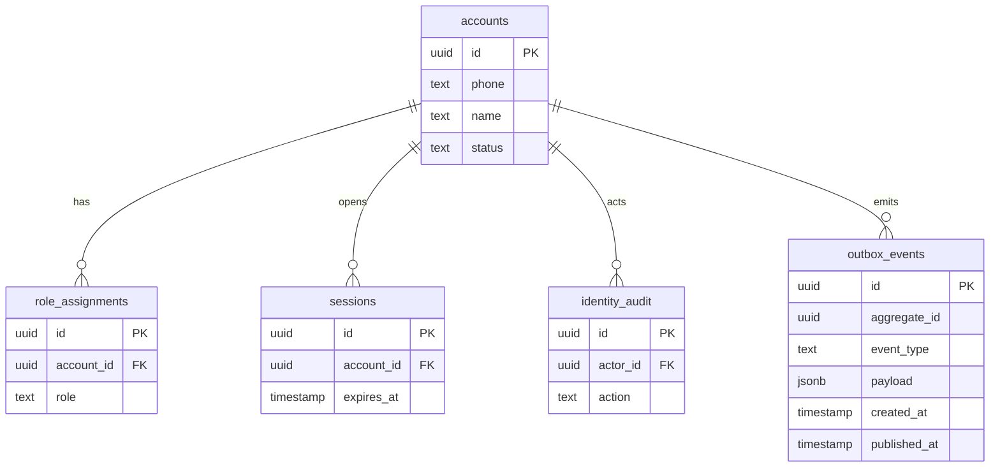

## BC-02 — Năng lực và vị trí tài xế

### Bước 1 — Xác định BC

BC sở hữu hồ sơ tài xế, phương tiện, trạng thái sẵn sàng và vị trí mới nhất; không quyết định ai được phân công cho một yêu cầu. **Có thể phân rã** luồng vị trí tần suất cao khỏi hồ sơ khi tải tăng; bản thí điểm giữ chung vì vị trí và điều kiện sẵn sàng cùng tạo năng lực nhận chuyến. BR-07, BR-08, BR-14; BP-01/BP-04.

### Bước 2 — Mô tả BC

Sau khi Identity tạo account, tài xế/bộ phận vận hành hoàn thiện hồ sơ và xe. Khi tài xế ONLINE, BC nhận vị trí; BP-03 yêu cầu BC cung cấp ứng viên sẵn sàng có vị trí mới tối đa 60 giây, đúng loại xe. BC xử lý trạng thái **được phép nhận chuyến**, không quản lý lời mời.

| FR của Bước 08 | Chức năng thuộc BC                                                            | BP/UC              |
| -------------- | ----------------------------------------------------------------------------- | ------------------ |
| FR-06          | Cập nhật hồ sơ, xe, trạng thái hoạt động.                                     | BP-01/UC-04        |
| FR-21          | **Phần vị trí tài xế**; phần ETA hiển thị do BC-04 phối hợp nguồn định tuyến. | BP-04/UC-08, UC-10 |
| FR-33          | Cung cấp trạng thái tài xế cho vận hành, chỉ bản chiếu cho BC-07.             | BP-07/UC-16        |

| Thuật ngữ       | Định nghĩa                              | Ghi chú/Ví dụ                        |
| --------------- | --------------------------------------- | ------------------------------------ |
| Hồ sơ tài xế    | Dữ liệu đủ điều kiện cung cấp dịch vụ.  | `ACTIVE` khác `ONLINE`.              |
| Phương tiện     | Xe được gắn với tài xế và loại dịch vụ. | Xe máy hoặc ô tô 4 chỗ.              |
| Sẵn sàng        | Cho phép nhận lời mời chuyến.           | Có chuyến mở thì không bật sẵn sàng. |
| Vị trí mới nhất | Tọa độ hợp lệ gần nhất BC nhận được.    | Quá 60 giây không dùng điều phối.    |

### Bước 3 — Microservice

`driver-service`; sở hữu `driver_db`. Đồng bộ trả ứng viên/kiểm tra khả dụng cho `dispatch-service`; phát `DriverAvailabilityChanged`, `DriverLocationUpdated` khi cần.

### Bước 4 — Thiết kế microservice

**a) API**

| Method      | Path                                               | Mục đích                         | Quyền               | Input → Output                       | Nguồn       |
| ----------- | -------------------------------------------------- | -------------------------------- | ------------------- | ------------------------------------ | ----------- |
| GET/PATCH   | `/api/v1/drivers/me` **[Đề xuất]**                 | Xem/sửa hồ sơ và xe              | Tài xế sở hữu       | profile/vehicle → driver             | FR-06/UC-03 |
| PATCH       | `/api/v1/drivers/me/availability`                  | Bật/tắt sẵn sàng                 | Tài xế              | ONLINE/OFFLINE → trạng thái          | FR-06/UC-04 |
| PUT         | `/api/v1/drivers/me/location`                      | Nhận vị trí                      | Tài xế ONLINE       | lat,lon → thời điểm nhận             | FR-21/UC-08 |
| GET         | `/internal/drivers/candidates` **[Đề xuất]**       | Trả ứng viên phù hợp             | Dispatch            | type,pickup,radius → driverId/vị trí | FR-10/UC-06 |
| POST/DELETE | `/internal/drivers/{id}/reservation` **[Đề xuất]** | Giữ/nhả năng lực cho một request | Dispatch            | requestId → kết quả độc quyền        | FR-10/UC-06 |
| PATCH       | `/api/v1/operations/drivers/{id}`                  | Khóa/mở hồ sơ                    | Vận hành đúng quyền | status → driver                      | FR-32/UC-16 |

**b) Mô hình dữ liệu logic**

| Entity/VO                      | Thuộc tính chính                          | Quan hệ/bất biến                                                              | BR/FR           |
| ------------------------------ | ----------------------------------------- | ----------------------------------------------------------------------------- | --------------- |
| DriverProfile (aggregate root) | driverId, accountId, status, availability | Một tài xế có một account; chỉ ACTIVE, chưa có reservation/chuyến mới ONLINE. | BR-07/08; FR-06 |
| Vehicle                        | vehicleId, driverId, type, plate, status  | Chỉ xe ACTIVE đúng loại mới được đề xuất.                                     | BR-07; FR-06    |
| CurrentLocation                | driverId, coordinates, receivedAt         | Một bản mới nhất/tài xế; bản cũ không ghi đè.                                 | BR-14; FR-21    |
| DriverReservation              | driverId, requestId, expiresAt            | Tối đa một reservation hoạt động/tài xế.                                      | BR-09/10; FR-10 |

**c) Database Type.** **PostgreSQL** với PostGIS trong `driver_db`: hồ sơ/xe/reservation cần ràng buộc, vị trí cần tìm trong bán kính mét. `geography` cùng `ST_DWithin` hỗ trợ truy vấn bán kính; chỉ lưu vị trí mới nhất trong bảng này, còn lịch sử vị trí nếu thật sự cần thì phải có chính sách lưu riêng. [Tài liệu PostGIS về truy vấn bán kính](https://postgis.net/documentation/tips/st-dwithin/).

**d) Mô hình vật lý và ERD**

| Bảng                  | Cột/khóa chính                                                                                                                   | Ràng buộc/index                                                               | Nguồn logic         |
| --------------------- | -------------------------------------------------------------------------------------------------------------------------------- | ----------------------------------------------------------------------------- | ------------------- |
| `drivers`             | `id uuid PK`, `account_id uuid`, `status`, `availability`                                                                        | unique account_id; account_id là external reference                           | DriverProfile       |
| `vehicles`            | `id uuid PK`, `driver_id uuid FK`, `vehicle_type`, `plate`, `status`                                                             | index driver_id                                                               | Vehicle             |
| `current_locations`   | `driver_id uuid PK/FK`, `position geography(Point,4326)`, `received_at timestamptz`                                              | GiST position                                                                 | CurrentLocation     |
| `driver_reservations` | `driver_id uuid PK/FK`, `request_id uuid`, `expires_at`                                                                          | một reservation/tài xế; request_id là external reference                      | DriverReservation   |
| `outbox_events`       | `id uuid PK`, `aggregate_id uuid`, `event_type text`, `payload jsonb`, `created_at timestamptz`, `published_at timestamptz NULL` | index published_at; aggregate_id tham chiếu logic, không FK đa loại aggregate | Outbox domain event |

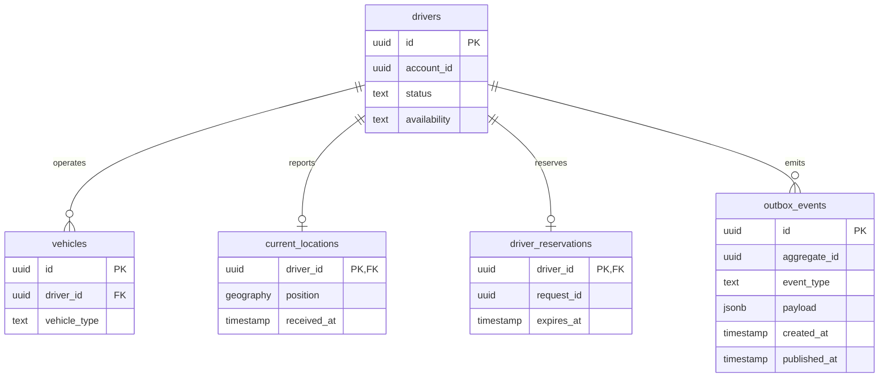

`account_id` thuộc Identity, `request_id` thuộc Dispatch; không có FK xuyên DB.

## BC-03 — Đặt xe và điều phối

### Bước 1 — Xác định BC

Sở hữu vòng đời yêu cầu từ `SEARCHING` đến `ASSIGNED/NO_DRIVER/CANCELLED`, lời mời và quyết định phân công. Không sở hữu chuyến đã bắt đầu. **Có thể phân rã** yêu cầu đặt xe và thuật toán điều phối nếu chúng thay đổi/tăng tải khác nhau; giữ chung ở bản 7 tuần vì lời mời và kết quả tìm là phần vòng đời của một yêu cầu. BR-03, BR-09–12; BP-02/BP-03.

### Bước 2 — Mô tả BC

BP-02 khách nhập hai điểm và loại xe, tạo yêu cầu; BP-03 lọc tài xế từ BC-02, ưu tiên theo khoảng cách, mời từng người, ghi chấp nhận hoặc chuyển người tiếp theo; kết thúc ở phân công hoặc không tìm được. Một khách có tối đa một yêu cầu/chuyến mở; 20 giây/offer, tối đa 10 ứng viên hoặc 180 giây. Event `DriverAssigned` là đầu vào tạo chuyến ở BC-04.

| FR của Bước 08 | Chức năng thuộc BC                                       | BP/UC       |
| -------------- | -------------------------------------------------------- | ----------- |
| FR-07, FR-08   | Nhận điểm, loại xe và tạo yêu cầu.                       | BP-02/UC-05 |
| FR-10, FR-11   | Lọc và xếp ứng viên; lấy khả dụng/vị trí từ BC-02.       | BP-03/UC-06 |
| FR-12, FR-13   | Gửi và ghi phản hồi offer.                               | BP-03/UC-07 |
| FR-14          | Mời ứng viên kế tiếp.                                    | BP-03/UC-06 |
| FR-16          | Kết thúc NO_DRIVER; việc hiển thị thông báo thuộc BC-06. | BP-03/UC-06 |

| Thuật ngữ      | Định nghĩa                                   | Ghi chú/Ví dụ                 |
| -------------- | -------------------------------------------- | ----------------------------- |
| Yêu cầu đặt xe | Đề nghị tìm tài xế từ khách.                 | Có thể không tạo được chuyến. |
| Ứng viên       | Tài xế đủ điều kiện tại thời điểm xét.       | Chưa phải tài xế được gán.    |
| Lời mời        | Đề xuất chuyến có thời hạn cho một ứng viên. | PENDING trong 20 giây.        |
| Phân công      | Kết quả chọn một tài xế hợp lệ.              | Tạo đúng một chuyến ở BC-04.  |

### Bước 3 — Microservice

`dispatch-service`; sở hữu `dispatch_db`. Đồng bộ hỏi/giữ chỗ tài xế ở Driver; phát `RideRequestCreated`, `DriverAssigned`, `NoDriverFound` cho Trip/Notification/Reporting.

### Bước 4 — Thiết kế microservice

**a) API**

| Method | Path                                                | Mục đích                    | Quyền                 | Input → Output                                           | Nguồn           |
| ------ | --------------------------------------------------- | --------------------------- | --------------------- | -------------------------------------------------------- | --------------- |
| POST   | `/api/v1/ride-requests`                             | Tạo yêu cầu                 | Khách                 | pickup,destination,vehicleType,Idempotency-Key → request | FR-07/08, UC-05 |
| GET    | `/api/v1/ride-requests/{id}`                        | Xem tình trạng yêu cầu      | Chủ yêu cầu           | id → trạng thái                                          | FR-08/UC-05     |
| GET    | `/api/v1/drivers/me/offers` **[Đề xuất]**           | Xem lời mời còn hiệu lực    | Tài xế được mời       | → offer                                                  | FR-12/UC-07     |
| POST   | `/api/v1/ride-offers/{id}/responses`                | Nhận/từ chối                | Tài xế được mời       | ACCEPT/DECLINE,Idempotency-Key → kết quả                 | FR-13/UC-07     |
| POST   | `/internal/ride-requests/{id}/dispatch`             | Tiếp tục điều phối          | Nội bộ, không public  | requestId → tiến độ                                      | FR-10–14/UC-06  |
| POST   | `/internal/ride-requests/{id}/cancel` **[Đề xuất]** | Hủy yêu cầu trước phân công | Chính chủ qua gateway | reason → CANCELLED                                       | BR-03/UC-05     |

**b) Mô hình logic**

| Entity/VO                    | Thuộc tính                                                          | Quan hệ/bất biến                                             | BR/FR              |
| ---------------------------- | ------------------------------------------------------------------- | ------------------------------------------------------------ | ------------------ |
| RideRequest (aggregate root) | id, customerId, pickup, destination, vehicleType, status, createdAt | Tối đa một yêu cầu SEARCHING/khách; một kết quả phân công.   | BR-03; FR-07/08    |
| Candidate                    | requestId, driverId, rank, locationAge                              | Danh sách tại một lượt tìm; không sở hữu tài xế.             | BR-09; FR-10/11    |
| RideOffer                    | id, requestId, driverId, sentAt, expiresAt, status                  | Một offer PENDING/yêu cầu; phản hồi muộn không phân công.    | BR-10/12; FR-12–14 |
| Assignment                   | requestId, driverId, acceptedAt                                     | Một assignment/request; cập nhật cùng transaction với offer. | BR-10/12; FR-13    |

**c) Database Type.** **PostgreSQL** trong `dispatch_db`: điều kiện duy nhất cho assignment, chuyển trạng thái cạnh tranh và lịch sử offer cần transaction. Không dùng database Driver trực tiếp để chọn người.

**d) Mô hình vật lý và ERD**

| Bảng              | Cột/khóa                                                                                                                         | Ràng buộc/index                                                               | Nguồn logic         |
| ----------------- | -------------------------------------------------------------------------------------------------------------------------------- | ----------------------------------------------------------------------------- | ------------------- |
| `ride_requests`   | `id uuid PK`, `customer_id uuid`, `pickup_lat/lon`, `destination_lat/lon`, `vehicle_type`, `status`, `created_at`                | unique có điều kiện cho customer_id khi SEARCHING; customer_id external       | RideRequest         |
| `ride_candidates` | `id uuid PK`, `request_id uuid FK`, `driver_id uuid`, `rank int`                                                                 | unique(request_id,driver_id)                                                  | Candidate           |
| `ride_offers`     | `id uuid PK`, `request_id uuid FK`, `driver_id uuid`, `sent_at`, `expires_at`, `status`                                          | index request_id/status; một PENDING/request                                  | RideOffer           |
| `assignments`     | `request_id uuid PK/FK`, `driver_id uuid`, `accepted_at`                                                                         | unique request_id; driver_id external                                         | Assignment          |
| `outbox_events`   | `id uuid PK`, `aggregate_id uuid`, `event_type text`, `payload jsonb`, `created_at timestamptz`, `published_at timestamptz NULL` | index published_at; aggregate_id tham chiếu logic, không FK đa loại aggregate | Outbox domain event |

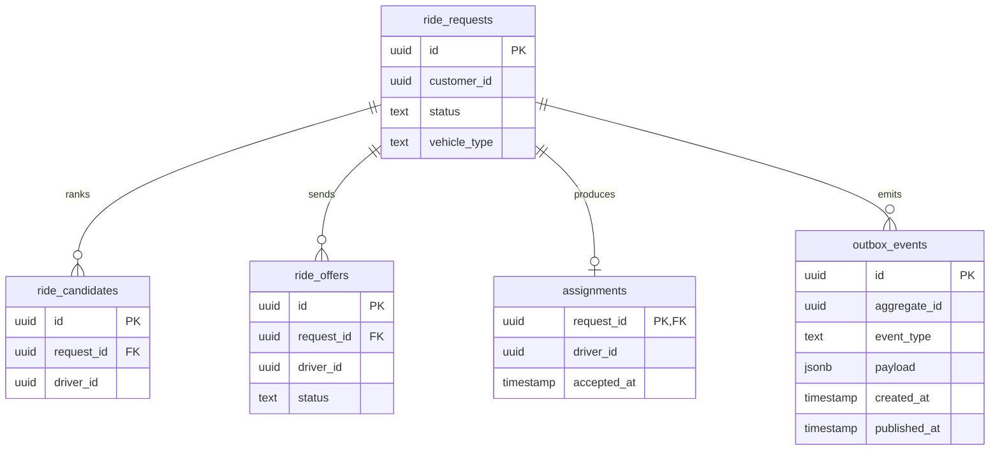

`customer_id` từ Identity và `driver_id` từ Driver là external reference, không có FK liên DB. Cần một outbox event trong `dispatch_db` để không mất `DriverAssigned` sau khi đã commit phân công.

## BC-04 — Chuyến đi và đánh giá

### Bước 1 — Xác định BC

Sở hữu vòng đời chuyến, trạng thái thực hiện, hủy và đánh giá; không sở hữu yêu cầu trước khi phân công hoặc giá tiền. **Có thể phân rã** đánh giá về sau nếu có nhiều đối tượng được đánh giá; ở bản thí điểm đánh giá chỉ tồn tại theo chuyến hoàn thành. BR-04–06, BR-13; BP-04/BP-06.

### Bước 2 — Mô tả BC

Nhận `DriverAssigned` của BC-03, tạo chuyến đúng một lần, tài xế đổi trạng thái `ASSIGNED → ARRIVED → PICKED_UP → MOVING → COMPLETED`. Khách xem chuyến và ETA; thiếu tuyến thì ETA null. Khách sở hữu chuyến đánh giá một lần, điểm 1–5 nguyên, trong 7 ngày. Hoàn thành chuyến phát event cho BC-05 tính cước và BC-08 báo cáo.

| FR của Bước 08             | Chức năng thuộc BC                                             | BP/UC       |
| -------------------------- | -------------------------------------------------------------- | ----------- |
| FR-17, FR-19, FR-20, FR-22 | Ghi bốn mốc tài xế thực hiện.                                  | BP-04/UC-09 |
| FR-21                      | **Phần ETA và theo dõi chuyến**; vị trí gốc do BC-02 cung cấp. | BP-04/UC-10 |
| FR-28, FR-29               | Lưu và trả lịch sử chuyến; cước lấy từ bản chiếu BC-05.        | BP-06/UC-14 |
| FR-30                      | Ghi đánh giá tài xế sau chuyến.                                | BP-06/UC-15 |

| Thuật ngữ  | Định nghĩa                             | Ghi chú/Ví dụ                    |
| ---------- | -------------------------------------- | -------------------------------- |
| Chuyến đi  | Việc vận chuyển sau phân công.         | Một request tạo tối đa một trip. |
| Mốc chuyến | Một trạng thái tiến trình đã ghi nhận. | ARRIVED.                         |
| Hoàn thành | Kết thúc việc vận chuyển.              | Không đồng nghĩa đã thu tiền.    |
| Đánh giá   | Điểm khách cho tài xế.                 | Một rating/chuyến.               |

### Bước 3 — Microservice

`trip-service`; sở hữu `trip_db`. Tiêu thụ `DriverAssigned`; phát `TripArrived`, `TripCompleted`, `TripCancelled`, `RatingCreated` cho Billing, Driver, Notification, Reporting.

### Bước 4 — Thiết kế microservice

**a) API**

| Method | Path                                            | Mục đích                         | Quyền                          | Input → Output   | Nguồn                 |
| ------ | ----------------------------------------------- | -------------------------------- | ------------------------------ | ---------------- | --------------------- |
| PATCH  | `/api/v1/trips/{id}/status`                     | Đổi mốc chuyến                   | Tài xế được giao               | status → trip    | FR-17/19/20/22, UC-09 |
| GET    | `/api/v1/trips/{id}`                            | Xem chuyến, vị trí gần nhất, ETA | Chủ chuyến/tài xế              | id → trip/ETA    | FR-21/UC-10           |
| POST   | `/api/v1/trips/{id}/cancellation` **[Đề xuất]** | Hủy hợp lệ                       | Khách/tài xế/vận hành đúng mốc | reason → trip    | BR-13/UC-09           |
| GET    | `/api/v1/me/trips`                              | Lịch sử khách                    | Chủ chuyến                     | page,size → list | FR-28/29, UC-14       |
| POST   | `/api/v1/trips/{id}/rating`                     | Gửi đánh giá                     | Khách sở hữu                   | score → rating   | FR-30/UC-15           |

**b) Mô hình logic**

| Entity/VO             | Thuộc tính                                                         | Quan hệ/bất biến                                 | BR/FR           |
| --------------------- | ------------------------------------------------------------------ | ------------------------------------------------ | --------------- |
| Trip (aggregate root) | id, requestId, customerId, driverId, status, distance, completedAt | Một request/trip; đổi mốc đúng thứ tự.           | BR-13; FR-17–22 |
| TripStatusEvent       | tripId, from, to, actorId, at                                      | Lịch sử bất biến.                                | BR-13; FR-17–22 |
| Cancellation          | tripId, actorId, reason, at                                        | Hủy đúng mốc; sau đón khách cần vận hành xử lý.  | BR-13; UC-09    |
| Rating                | tripId, customerId, driverId, score, at                            | Một rating/trip, chỉ khách của chuyến.           | BR-06; FR-30    |
| FareSnapshot          | tripId, amount, paymentStatus, updatedAt                           | Bản chiếu chỉ để xem lịch sử; nguồn gốc ở BC-05. | BR-05; FR-29    |

**c) Database Type.** **PostgreSQL** trong `trip_db`: trạng thái/hủy/rating có ràng buộc chặt, lịch sử chuyến cần truy vấn theo khách và thời gian. Event nguồn được xử lý chống trùng theo `eventId`.

**d) Mô hình vật lý và ERD**

| Bảng                 | Cột/khóa                                                                                                                         | Ràng buộc/index                                                               | Nguồn logic         |
| -------------------- | -------------------------------------------------------------------------------------------------------------------------------- | ----------------------------------------------------------------------------- | ------------------- |
| `trips`              | `id uuid PK`, `request_id uuid`, `customer_id uuid`, `driver_id uuid`, `status`, `completed_at`                                  | unique request_id; index customer_id/completed_at                             | Trip                |
| `trip_status_events` | `id uuid PK`, `trip_id uuid FK`, `from_status`, `to_status`, `actor_id`, `at`                                                    | index trip_id/at                                                              | TripStatusEvent     |
| `trip_cancellations` | `trip_id uuid PK/FK`, `actor_id`, `reason`, `at`                                                                                 | một cancellation/trip                                                         | Cancellation        |
| `ratings`            | `trip_id uuid PK/FK`, `customer_id`, `driver_id`, `score int`, `at`                                                              | check score 1–5                                                               | Rating              |
| `fare_snapshots`     | `trip_id uuid PK/FK`, `amount_vnd bigint`, `payment_status`                                                                      | đồng bộ từ Billing                                                            | FareSnapshot        |
| `outbox_events`      | `id uuid PK`, `aggregate_id uuid`, `event_type text`, `payload jsonb`, `created_at timestamptz`, `published_at timestamptz NULL` | index published_at; aggregate_id tham chiếu logic, không FK đa loại aggregate | Outbox domain event |

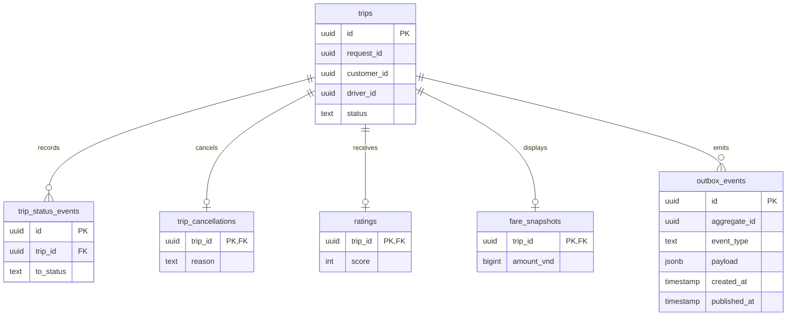

Các ID request/customer/driver là tham chiếu ngoài; `fare_snapshots` là bản sao phục vụ đọc, không được dùng chốt tiền.

## BC-05 — Cước và thanh toán

### Bước 1 — Xác định BC

Sở hữu biểu giá, giá dự kiến, cước chốt và giao dịch thanh toán. **Có thể phân rã** pricing khỏi payment khi nhiều chính sách giá/cổng thanh toán phát triển độc lập; bản thí điểm hai loại xe và một adapter sandbox giữ một BC nhưng hai mô-đun nội bộ. BR-15–17/20; BP-05.

### Bước 2 — Mô tả BC

Trước BP-02, cung cấp giá dự kiến với phiên bản biểu giá; sau `TripCompleted` ở BP-05 tính cước chốt, khách chọn CASH/ELECTRONIC, ghi kết quả. Tiền mặt chỉ thành công khi tài xế xác nhận đã nhận; điện tử chỉ thành công từ callback xác thực. UNKNOWN phải tra cứu trước retry; không có hai thanh toán thành công/chuyến. Không lưu số thẻ/CVV.

| FR của Bước 08 | Chức năng thuộc BC                                        | BP/UC       |
| -------------- | --------------------------------------------------------- | ----------- |
| FR-23          | Tính cước sau chuyến.                                     | BP-05/UC-11 |
| FR-24          | Chọn phương thức.                                         | BP-05/UC-12 |
| FR-25          | Phối hợp provider điện tử.                                | BP-05/UC-12 |
| FR-26, FR-27   | Ghi kết quả, xử lý retry; hiển thị notification do BC-06. | BP-05/UC-12 |

| Thuật ngữ          | Định nghĩa                         | Ghi chú/Ví dụ                           |
| ------------------ | ---------------------------------- | --------------------------------------- |
| Giá dự kiến        | Ước lượng khi khách đặt xe.        | Lưu phiên bản giá.                      |
| Cước chốt          | Số tiền sau khi hoàn thành chuyến. | Có thể khác dự kiến.                    |
| Lần thử thanh toán | Một yêu cầu thu tiền.              | Nhiều lần FAILED, tối đa một SUCCEEDED. |
| Chưa xác định      | Chưa rõ cổng đã thu hay chưa.      | Tra cứu trước thử lại.                  |

### Bước 3 — Microservice

`billing-service`; sở hữu `billing_db`. Nhận `TripCompleted`, phát `FareCalculated`, `PaymentSucceeded`, `PaymentFailed`, `PaymentUnknown` cho Trip/Notification/Reporting. Payment provider là hệ thống ngoài, không phải MS CAB.

### Bước 4 — Thiết kế microservice

**a) API**

| Method | Path                                      | Mục đích                    | Quyền             | Input → Output                   | Nguồn                     |
| ------ | ----------------------------------------- | --------------------------- | ----------------- | -------------------------------- | ------------------------- |
| GET    | `/api/v1/fare-quotes` **[Đề xuất]**       | Dự kiến giá trước đặt       | Khách             | type,route → quote               | BR-15/UC-05               |
| GET    | `/api/v1/trips/{id}/fare`                 | Đọc cước chốt               | Chủ chuyến        | id → amount/source               | SRS 18.9; FR-23/UC-11     |
| POST   | `/api/v1/trips/{id}/payments`             | Khởi tạo payment            | Khách sở hữu      | method,Idempotency-Key → attempt | FR-24/25, UC-12           |
| POST   | `/api/v1/payments/provider-callbacks`     | Nhận callback               | Provider xác thực | providerRef/status → kết quả     | FR-25/26, UC-12           |
| GET    | `/api/v1/trips/{id}/payments`             | Tra cứu khi timeout/UNKNOWN | Chủ chuyến        | id → status                      | SRS 18.9; FR-26/27, UC-12 |
| POST   | `/api/v1/payments/{id}/cash-confirmation` | Xác nhận đã nhận tiền       | Tài xế chuyến     | attemptId → SUCCEEDED            | SRS 18.9; FR-24/26, UC-12 |
| POST   | `/api/v1/admin/fares`                     | Tạo phiên bản biểu giá      | ADMIN             | rates/effectiveFrom → policy     | SRS 18.9; BR-15/UC-16     |

**b) Mô hình logic**

| Entity/VO                  | Thuộc tính                                                   | Quan hệ/bất biến                                             | BR/FR                 |
| -------------------------- | ------------------------------------------------------------ | ------------------------------------------------------------ | --------------------- |
| PricePolicy                | id, type, openingFare, includedDistance, rate, effectiveFrom | Lưu lịch sử phiên bản; không sửa ngược giá cũ.               | BR-15; FR-23          |
| FareQuote                  | requestId, policyId, estimatedDistance, amount               | Một báo giá theo thời điểm đặt, nguồn số liệu rõ ràng.       | BR-15; UC-05          |
| FinalFare (aggregate)      | tripId, policyId, distance, distanceSource, amount           | Một cước chốt/trip.                                          | BR-15; FR-23          |
| PaymentAttempt (aggregate) | id, tripId, method, status, providerRef, attemptNo           | Tối đa một SUCCEEDED/trip; callback trùng không tạo thu đôi. | BR-16/17/20; FR-24–27 |
| ProviderEvent              | providerEventId, attemptId, status, receivedAt               | Mã event nhà cung cấp duy nhất.                              | BR-17; FR-25          |

**c) Database Type.** **PostgreSQL** trong `billing_db`: giao dịch, lịch sử phiên bản, ràng buộc cước và tính duy nhất của payment thành công cần transaction ACID. Đây là database chính duy nhất.

**d) Mô hình vật lý và ERD**

| Bảng               | Cột/khóa                                                                                                                         | Ràng buộc/index                                                               | Nguồn logic         |
| ------------------ | -------------------------------------------------------------------------------------------------------------------------------- | ----------------------------------------------------------------------------- | ------------------- |
| `price_policies`   | `id uuid PK`, `vehicle_type`, `opening_vnd bigint`, `included_m int`, `per_km_vnd bigint`, `effective_from`                      | index type/effective_from                                                     | PricePolicy         |
| `fare_quotes`      | `request_id uuid PK`, `policy_id uuid FK`, `amount_vnd bigint`, `estimated_m int`                                                | requestId external                                                            | FareQuote           |
| `final_fares`      | `trip_id uuid PK`, `policy_id uuid FK`, `distance_m int`, `source text`, `amount_vnd bigint`                                     | tripId external                                                               | FinalFare           |
| `payment_attempts` | `id uuid PK`, `trip_id uuid`, `method`, `status`, `attempt_no`, `provider_ref`, `idempotency_key`                                | unique(trip_id) khi SUCCEEDED; unique provider_ref và actor/key               | PaymentAttempt      |
| `provider_events`  | `id uuid PK`, `payment_id uuid FK`, `provider_event_id text unique`, `status`                                                    | unique provider_event_id                                                      | ProviderEvent       |
| `outbox_events`    | `id uuid PK`, `aggregate_id uuid`, `event_type text`, `payload jsonb`, `created_at timestamptz`, `published_at timestamptz NULL` | index published_at; aggregate_id tham chiếu logic, không FK đa loại aggregate | Outbox domain event |

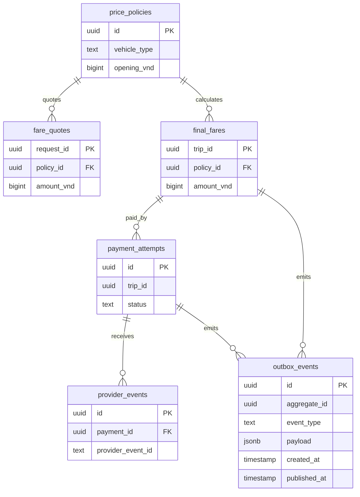

`trip_id` và `request_id` thuộc BC khác, không phải FK vật lý. Provider thật, chữ ký và sandbox cụ thể chưa có trong SRS; adapter mock là phạm vi đồ án.

## BC-06 — Thông báo

### Bước 1 — Xác định BC

Sở hữu thông báo được tạo từ sự kiện, người nhận, trạng thái đọc/gửi; không quyết định sự kiện nghiệp vụ gốc có thành công không. **Có thể phân rã** theo kênh SMS/push/email khi mở rộng; bản thí điểm chỉ thông báo trong ứng dụng nên một BC. BR-11, BR-18–20, BR-25; BP-02–05.

### Bước 2 — Mô tả BC

Khi yêu cầu được tiếp nhận, tài xế được mời/gán, tài xế đến, chuyến kết thúc hoặc thanh toán có kết quả, BC-06 ghi thông báo đúng người. Ghi trùng cùng `eventId`/người nhận chỉ tạo một bản; lỗi gửi retry tối đa ba lần và không hoàn tác nghiệp vụ nguồn.

| FR của Bước 08 | Chức năng thuộc BC                                                      | BP/UC       |
| -------------- | ----------------------------------------------------------------------- | ----------- |
| FR-09          | Thông báo tiếp nhận yêu cầu.                                            | BP-02/UC-13 |
| FR-15, FR-16   | Kết quả tìm tài xế/không có tài xế.                                     | BP-03/UC-13 |
| FR-18          | Tài xế đến điểm đón.                                                    | BP-04/UC-13 |
| FR-26, FR-27   | Thông báo kết quả/thất bại thanh toán; **trạng thái tiền thuộc BC-05**. | BP-05/UC-13 |

| Thuật ngữ      | Định nghĩa                          | Ghi chú/Ví dụ             |
| -------------- | ----------------------------------- | ------------------------- |
| Sự kiện nguồn  | Kết quả đã commit tại service khác. | `TripArrived`.            |
| Thông báo      | Nội dung lưu cho một người nhận.    | Tài xế đã đến.            |
| Gửi thành công | Kênh đã tiếp nhận thông báo.        | Khác “người dùng đã đọc”. |
| Đã đọc         | Người dùng đã mở thông báo.         | `readAt` có giá trị.      |

### Bước 3 — Microservice

`notification-service`; sở hữu `notification_db`. Tiêu thụ các domain event qua message queue, không gọi trực tiếp sang DB nguồn; phát `NotificationDeliveryFailed` cho giám sát nếu gửi quá số lần.

### Bước 4 — Thiết kế microservice

**a) API**

| Method | Path                                                                                                                                   | Mục đích               | Quyền            | Input → Output           | Nguồn                     |
| ------ | -------------------------------------------------------------------------------------------------------------------------------------- | ---------------------- | ---------------- | ------------------------ | ------------------------- |
| GET    | `/api/v1/notifications`                                                                                                                | Xem thông báo của mình | Chủ người nhận   | page,size → danh sách    | FR-09/15/18/26, UC-13     |
| PATCH  | `/api/v1/notifications/{id}`                                                                                                           | Đánh dấu đã đọc        | Chủ người nhận   | read=true → notification | SRS 18.9; BR-18/19, UC-13 |
| Event  | `RideRequestCreated`, `RideOfferCreated`, `DriverAssigned`, `NoDriverFound`, `TripArrived`, `TripCompleted`, `PaymentSucceeded/Failed` | Ghi thông báo          | Nội bộ qua queue | event → record           | FR-09/15/16/18/26/27      |

**b) Mô hình logic**

| Entity/VO                     | Thuộc tính                                                 | Quan hệ/bất biến                                   | BR/FR                    |
| ----------------------------- | ---------------------------------------------------------- | -------------------------------------------------- | ------------------------ |
| Notification (aggregate root) | id, eventId, recipientId, type, content, createdAt, readAt | Duy nhất người nhận/event.                         | BR-18/19; FR-09/15/18/26 |
| DeliveryAttempt               | notificationId, attemptNo, status, at                      | Một notification có tối đa ba lần retry sau lỗi.   | BR-25; FR-26             |
| Template                      | type, version, body                                        | Sự kiện dùng mẫu tương ứng, không ghi dữ liệu thẻ. | BR-18–20; FR-27          |

**c) Database Type.** **MongoDB** trong `notification_db`: mỗi notification là một document chủ yếu đọc theo người nhận, thông tin hiển thị có thể đổi theo loại sự kiện; nhúng danh sách lần gửi nhỏ và giới hạn. Unique index `(recipientId,eventId)` vẫn cần để chống trùng. Đây là **database chính**, không dùng Redis làm nguồn thông báo.

**d) Mô hình collection và sơ đồ dữ liệu**

| Collection         | Document/ID                                                                                                    | Index và ràng buộc                                              | Entity logic                       |
| ------------------ | -------------------------------------------------------------------------------------------------------------- | --------------------------------------------------------------- | ---------------------------------- |
| `notifications`    | `_id`, `recipientId`, `eventId`, `type`, `content`, `createdAt`, `readAt`, `attempts: [{attemptNo,status,at}]` | unique `(recipientId,eventId)`; index `(recipientId,createdAt)` | Notification nhúng DeliveryAttempt |
| `templates`        | `_id=type:version`, `type`, `version`, `body`                                                                  | unique `(type,version)`                                         | Template                           |
| `processed_events` | `_id=eventId:recipientId`, `processedAt`                                                                       | `_id` unique; không xử lý trùng                                 | Bản ghi chống trùng                |
| `outbox_events`    | `_id`, `id`, `aggregate_id`, `event_type`, `payload`, `created_at`, `published_at`                             | unique id; document phát sự kiện                                | Outbox của Notification            |

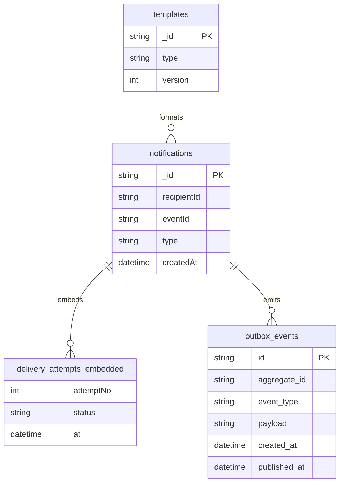

Sơ đồ trên biểu diễn **quan hệ logic**, không phải FK của MongoDB; `recipientId` là ID ngoài từ Identity. `DeliveryAttempt` là embedded document trong `notifications`.

## BC-07 — Hỗ trợ vận hành

### Bước 1 — Xác định BC

Sở hữu vụ việc, ghi chú, quyết định xử lý và audit vận hành; không sở hữu hồ sơ/chuyến/thanh toán gốc. **Có thể phân rã** audit tập trung khi yêu cầu tuân thủ tăng; hiện audit thao tác hỗ trợ là một phần của vòng đời vụ việc. BR-21–23, BR-29; BP-07.

### Bước 2 — Mô tả BC

Nhân viên có quyền xem chuyến đang diễn ra và tài xế, tra cứu giao dịch, nhận sự cố, xử lý/đóng vụ việc. Muốn khóa tài xế thì gửi lệnh đến Driver; muốn xem payment thì gọi Billing; không sửa số tiền đã thu. Sự kiện xử lý quan trọng được lưu vết.

| FR của Bước 08 | Chức năng thuộc BC                                                        | BP/UC       |
| -------------- | ------------------------------------------------------------------------- | ----------- |
| FR-31          | Kiểm tra quyền qua Identity; không sở hữu quyền nguồn.                    | BP-07/UC-16 |
| FR-32          | Điều phối thao tác quản lý theo quyền; entity gốc do BC tương ứng sở hữu. | BP-07/UC-16 |
| FR-33          | Màn hình giám sát là bản chiếu của Trip/Driver.                           | BP-07/UC-16 |
| FR-34          | Tiếp nhận/hỗ trợ chuyến lỗi, tra cứu payment.                             | BP-07/UC-17 |
| FR-35          | Audit xử lý sự cố và thao tác vận hành.                                   | BP-07/UC-17 |

| Thuật ngữ    | Định nghĩa                          | Ghi chú/Ví dụ                      |
| ------------ | ----------------------------------- | ---------------------------------- |
| Sự cố        | Vấn đề cần tiếp nhận từ một chuyến. | Khách báo không tiếp tục được.     |
| Vụ việc      | Hồ sơ xử lý sự cố hoặc hỗ trợ.      | Có người phụ trách.                |
| Hành động    | Bước xử lý được ghi vết.            | Ghi chú, chuyển người xử lý, đóng. |
| Đóng vụ việc | Kết thúc hỗ trợ với kết quả.        | Không xóa chuyến.                  |

### Bước 3 — Microservice

`operations-service`; sở hữu `operations_db`. Đồng bộ xem dữ liệu qua API của Driver/Trip/Billing theo quyền; phát `IncidentOpened`, `IncidentClosed`, `DriverLockRequested`.

### Bước 4 — Thiết kế microservice

**a) API**

| Method | Path                                            | Mục đích                                                                   | Quyền                      | Input → Output            | Nguồn                    |
| ------ | ----------------------------------------------- | -------------------------------------------------------------------------- | -------------------------- | ------------------------- | ------------------------ |
| GET    | `/api/v1/operations/trips` **[Đề xuất]**        | Giám sát chuyến                                                            | OPERATOR/ADMIN             | filter → trip summaries   | FR-33/UC-16              |
| GET    | `/api/v1/operations/drivers`                    | Danh sách tài xế cho vận hành; gọi đồng bộ `driver-service` để lấy dữ liệu | OPERATOR/ADMIN             | filter → driver summaries | SRS 18.9; FR-32/33/UC-16 |
| GET    | `/api/v1/operations/transactions` **[Đề xuất]** | Tra cứu payment                                                            | OPERATOR/ADMIN             | tripId → trạng thái       | FR-34/UC-17              |
| POST   | `/api/v1/trips/{id}/incidents` **[Đề xuất]**    | Báo sự cố                                                                  | Chủ chuyến/tài xế/vận hành | reason,note → incident    | FR-34/UC-17              |
| GET    | `/api/v1/operations/incidents`                  | Danh sách vụ việc                                                          | OPERATOR/ADMIN             | filter → list             | FR-34/UC-17              |
| PATCH  | `/api/v1/operations/incidents/{id}`             | Ghi hành động/đóng                                                         | Người được phân quyền      | status,note → incident    | FR-34/35, UC-17          |

**b) Mô hình logic**

| Entity/VO                 | Thuộc tính                                                      | Quan hệ/bất biến                                   | BR/FR              |
| ------------------------- | --------------------------------------------------------------- | -------------------------------------------------- | ------------------ |
| Incident (aggregate root) | id, tripId, reporterId, reason, status, assignedTo              | Một chuyến có thể có nhiều sự cố; đóng có kết quả. | BR-22; FR-34       |
| IncidentAction            | incidentId, actorId, action, note, at                           | Lịch sử bất biến của incident.                     | BR-29; FR-35       |
| OperationsView            | external IDs, tripStatus, driverStatus, paymentStatus, syncedAt | Bản chiếu đọc; không là nguồn dữ liệu gốc.         | BR-21/22; FR-32/33 |

**c) Database Type.** **PostgreSQL** trong `operations_db`: vụ việc/hành động có quan hệ và cần truy vết thay đổi theo trình tự; bản chiếu có thể được cập nhật từ event.

**d) Mô hình vật lý và ERD**

| Bảng               | Cột/khóa                                                                                                                         | Ràng buộc/index                                                               | Nguồn logic         |
| ------------------ | -------------------------------------------------------------------------------------------------------------------------------- | ----------------------------------------------------------------------------- | ------------------- |
| `incidents`        | `id uuid PK`, `trip_id uuid`, `reporter_id uuid`, `reason`, `status`, `assigned_to uuid`                                         | index trip_id/status                                                          | Incident            |
| `incident_actions` | `id uuid PK`, `incident_id uuid FK`, `actor_id uuid`, `action`, `note`, `at`                                                     | index incident_id/at                                                          | IncidentAction      |
| `operations_views` | `trip_id uuid PK`, `driver_id uuid`, `trip_status`, `payment_status`, `synced_at`                                                | chỉ bản chiếu đọc                                                             | OperationsView      |
| `outbox_events`    | `id uuid PK`, `aggregate_id uuid`, `event_type text`, `payload jsonb`, `created_at timestamptz`, `published_at timestamptz NULL` | index published_at; aggregate_id tham chiếu logic, không FK đa loại aggregate | Outbox domain event |

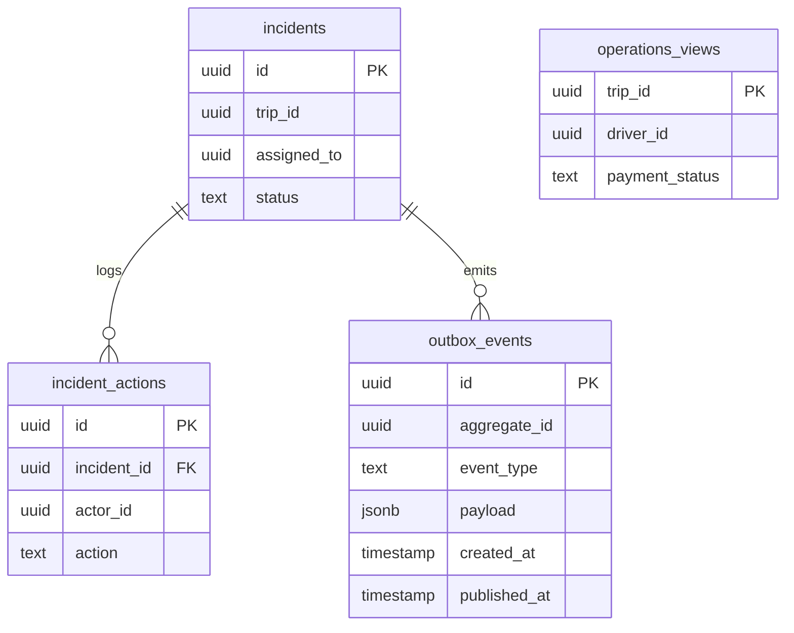

`trip_id`, `driver_id`, `actor_id` là ID ngoài; chỉ `incident_id` là FK nội bộ.

## BC-08 — Báo cáo hoạt động

### Bước 1 — Xác định BC

Sở hữu định nghĩa chỉ số và bảng tổng hợp theo kỳ; không sở hữu giao dịch/chuyến nguồn. **Có thể phân rã** báo cáo doanh thu với vận hành tài xế khi các định nghĩa, người dùng và nhịp cập nhật khác nhau; phạm vi hiện tại gộp cùng mục đích quản trị. BR-24, BR-01/25/26/30 ở mức theo dõi; BP-08.

### Bước 2 — Mô tả BC

Nhận sự kiện từ Dispatch, Trip, Billing và Driver; tính số yêu cầu, chuyến hoàn thành/hủy, doanh thu đã thu, hiệu quả tài xế theo ngày/tháng hoặc khoảng ngày Asia/Ho_Chi_Minh. Khi mẫu số 0, trả `null` và nhãn `N/A`, không chia 0. Dữ liệu có thể cập nhật sau vài giây/phút vì nhất quán sau cùng; response phải ghi `updatedAt`.

| FR của Bước 08 | Chức năng thuộc BC                                                                                    | BP/UC       |
| -------------- | ----------------------------------------------------------------------------------------------------- | ----------- |
| FR-36          | Tập hợp sự kiện hoạt động vào bản chiếu báo cáo.                                                      | BP-08/UC-18 |
| FR-37          | Tính và cung cấp báo cáo chỉ số.                                                                      | BP-08/UC-18 |
| FR-38          | Thông tin theo dõi chỉ tiêu quy mô/ổn định; chỉ số hạ tầng lấy từ monitoring, không bịa từ doanh thu. | BP-08/UC-18 |

| Thuật ngữ         | Định nghĩa                                       | Ghi chú/Ví dụ          |
| ----------------- | ------------------------------------------------ | ---------------------- |
| Số yêu cầu        | Yêu cầu hợp lệ ghi trong kỳ.                     | Gồm NO_DRIVER.         |
| Chuyến hoàn thành | Chuyến ở trạng thái COMPLETED.                   | Chưa chắc đã trả tiền. |
| Doanh thu đã thu  | Cước chuyến hoàn thành và payment SUCCEEDED.     | Không tính PENDING.    |
| Hiệu quả tài xế   | Số chuyến hoàn thành và tỷ lệ nhận offer hợp lệ. | Mẫu số 0 trả N/A.      |

### Bước 3 — Microservice

`reporting-service`; sở hữu `reporting_db`. Nhận event bất đồng bộ từ Dispatch/Trip/Billing/Driver, chỉ trả báo cáo đọc cho EXECUTIVE/ADMIN.

### Bước 4 — Thiết kế microservice

**a) API**

| Method | Path                                                                                     | Mục đích           | Quyền            | Input → Output                      | Nguồn           |
| ------ | ---------------------------------------------------------------------------------------- | ------------------ | ---------------- | ----------------------------------- | --------------- |
| GET    | `/api/v1/reports/operations`                                                             | Báo cáo hoạt động  | EXECUTIVE/ADMIN  | from,to,groupBy → metrics,updatedAt | FR-36/37, UC-18 |
| GET    | `/api/v1/reports/drivers` **[Đề xuất]**                                                  | Hiệu quả tài xế    | EXECUTIVE/ADMIN  | from,to,page → driver metrics       | FR-37/UC-18     |
| Event  | `RideRequestCreated`, `TripCompleted/Cancelled`, `PaymentSucceeded`, `RideOfferAccepted` | Cập nhật bản chiếu | Nội bộ qua queue | eventId,payload → projection        | FR-36/UC-18     |

**b) Mô hình logic**

| Entity/VO       | Thuộc tính                                                     | Quan hệ/bất biến                                                    | BR/FR           |
| --------------- | -------------------------------------------------------------- | ------------------------------------------------------------------- | --------------- |
| ReportingPeriod | start, end, timezone, groupBy                                  | Đầu kỳ gồm/cuối kỳ loại.                                            | BR-24; FR-37    |
| ActivityMetric  | period, requests, completed, cancelled, paidRevenue, updatedAt | Một dòng/kỳ; doanh thu chỉ khi đủ TripCompleted + PaymentSucceeded. | BR-24; FR-36/37 |
| DriverMetric    | period, driverId, completed, validOffers, acceptedOffers       | Một dòng/tài xế/kỳ.                                                 | BR-24; FR-37    |
| ProcessedEvent  | eventId, source, processedAt                                   | Một event tính đúng một lần.                                        | BR-24; FR-36    |

**c) Database Type.** **PostgreSQL** trong `reporting_db`: nhiều phép nhóm theo kỳ, tổng hợp theo tài xế, kiểm soát trùng event và tra cứu có phân trang. Đây là dữ liệu bản chiếu, có thể tái tạo từ event nếu nguồn còn lưu.

**d) Mô hình vật lý và ERD**

| Bảng                | Cột/khóa                                                                                       | Ràng buộc/index                  | Nguồn logic     |
| ------------------- | ---------------------------------------------------------------------------------------------- | -------------------------------- | --------------- |
| `reporting_periods` | `id uuid PK`, `start_at`, `end_at`, `timezone`, `group_by`                                     | unique(start_at,end_at,group_by) | ReportingPeriod |
| `activity_metrics`  | `period_id uuid PK/FK`, `requests`, `completed`, `cancelled`, `paid_revenue_vnd`, `updated_at` | không cộng event trùng           | ActivityMetric  |
| `driver_metrics`    | `period_id uuid FK`, `driver_id uuid`, `completed`, `valid_offers`, `accepted_offers`          | PK(period_id,driver_id)          | DriverMetric    |
| `processed_events`  | `event_id uuid PK`, `source`, `processed_at`                                                   | unique event_id                  | ProcessedEvent  |

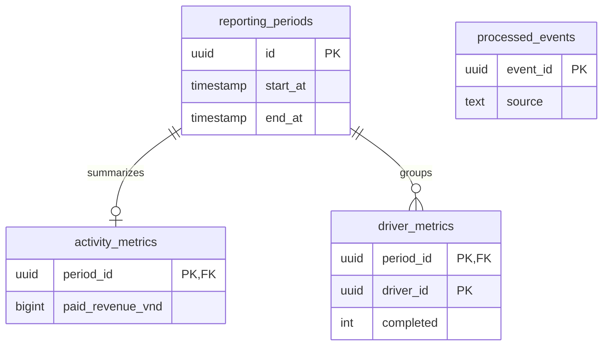

`driver_id` là ID ngoài, không có FK sang Driver. `processed_events` là bảng chống xử lý lặp, không bắt buộc liên kết FK tới kỳ.

## Bước 5 — Luồng End-to-End sau khi hoàn tất tám BC

**Hạ tầng giao tiếp [Đề xuất kiến trúc]:** API gateway kiểm tra token và định tuyến nhưng không sở hữu BC/database. Message broker chuyển domain event; mỗi service ghi **outbox** cùng transaction cập nhật trạng thái rồi worker gửi event. Bên nhận lưu `eventId` để xử lý trùng. Broker và gateway không được tính là microservice nghiệp vụ thứ chín. `202/201 SEARCHING` là kết quả tiếp nhận yêu cầu, còn phân công là kết quả bất đồng bộ.

### E2E-01 — Khách đặt xe, tìm tài xế và tạo chuyến

**Trigger:** khách đăng nhập và gửi điểm đón/đến, loại xe; một khách không có yêu cầu/chuyến mở. **Kết quả:** nhận mã request ngay; sau đó một Trip được tạo hoặc request chuyển `NO_DRIVER`.

| Thứ tự | Bên gọi → bên nhận             | API/event                                                   | Kiểu               | Đọc/ghi database                                      | Kết quả                                              |
| -----: | ------------------------------ | ----------------------------------------------------------- | ------------------ | ----------------------------------------------------- | ---------------------------------------------------- |
|      1 | Client → Identity/Gateway      | token đăng nhập                                             | Đồng bộ            | Identity đọc `identity_db`                            | Xác thực khách.                                      |
|      2 | Client → Dispatch              | `POST /api/v1/ride-requests`, Idempotency-Key               | Đồng bộ            | Dispatch ghi `dispatch_db.ride_requests` và outbox    | Trả 201 `SEARCHING`, requestId.                      |
|      3 | Dispatch → Driver              | `GET /internal/drivers/candidates`                          | Đồng bộ            | Driver đọc `driver_db`                                | Danh sách đúng xe, ONLINE, vị trí ≤60 giây và ≤5 km. |
|      4 | Dispatch → chính nó            | Xếp ứng viên, ghi Offer                                     | Nội bộ             | Dispatch ghi `ride_candidates`, `ride_offers`         | Mời một người, 20 giây.                              |
|      5 | Driver app → Dispatch          | `POST /api/v1/ride-offers/{id}/responses`                   | Đồng bộ            | Dispatch đọc offer; Driver app không ghi DB           | Nhận ACCEPT/DECLINE.                                 |
|      6 | Dispatch → Driver              | `POST /internal/drivers/{id}/reservation`                   | Đồng bộ            | Driver ghi `driver_reservations`                      | Giữ tài xế cho request; xung đột thì mời người tiếp. |
|      7 | Dispatch → chính nó            | Commit `Assignment` + outbox `DriverAssigned`               | Transaction nội bộ | Dispatch ghi `assignments`/outbox trong `dispatch_db` | Một tài xế/request. Nếu commit lỗi, nhả reservation. |
|      8 | Queue → Trip                   | `DriverAssigned(eventId,requestId,driverId,customerId)`     | Bất đồng bộ        | Trip ghi `trip_db.trips` unique requestId             | Một Trip; ACK event sau commit.                      |
|      9 | Queue → Notification/Reporting | `RideRequestCreated`, `DriverAssigned` hoặc `NoDriverFound` | Bất đồng bộ        | Mỗi service ghi DB riêng                              | Thông báo và số liệu cập nhật sau.                   |

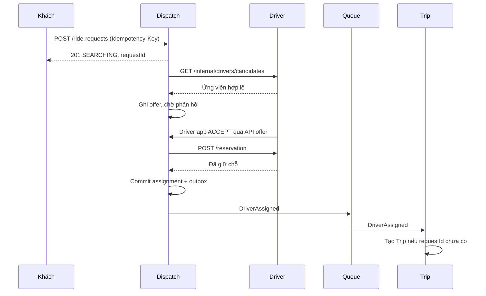

Sơ đồ gom ứng dụng tài xế vào đường phản hồi của Driver để giữ số participant gọn; **HTTP offer thực tế đi từ ứng dụng tài xế trực tiếp tới Dispatch**, như dòng 5 của bảng.

**Nhất quán:** transaction trong Dispatch bảo đảm một `Assignment`; unique `requestId` ở Trip bảo đảm một chuyến. Giữ chỗ tại Driver và commit Dispatch là chuỗi phân tán nhỏ: nếu không commit assignment, gọi nhả chỗ; nếu Trip chưa tạo do queue lỗi, outbox gửi lại, không tạo chuyến thứ hai. Nếu tài xế từ chối, hết 20 giây, hết 10 người hoặc 180 giây, Dispatch thử người tiếp hoặc commit `NO_DRIVER`, phát một event thông báo. Không dùng transaction xuyên ba database.

### E2E-02 — Hoàn thành chuyến, tính cước và thanh toán

**Trigger:** tài xế được giao hoàn thành chuyến theo thứ tự hợp lệ. **Kết quả:** một cước chốt, rồi CASH được tài xế xác nhận hoặc ELECTRONIC được provider xác nhận. Chuyến hoàn thành **không tự động có nghĩa đã thanh toán**.

| Thứ tự | Bên gọi → bên nhận                  | API/event                                      | Kiểu                     | Đọc/ghi database                                           | Kết quả                                       |
| -----: | ----------------------------------- | ---------------------------------------------- | ------------------------ | ---------------------------------------------------------- | --------------------------------------------- |
|      1 | Tài xế → Trip                       | `PATCH /api/v1/trips/{id}/status` COMPLETED    | Đồng bộ                  | Trip ghi trạng thái/event/outbox vào `trip_db`             | 200 COMPLETED.                                |
|      2 | Queue → Billing                     | `TripCompleted`                                | Bất đồng bộ              | Billing ghi `billing_db.final_fares`; đọc `price_policies` | Cước chốt với phiên bản giá, distanceSource.  |
|      3 | Billing → Queue → Trip/Notification | `FareCalculated`                               | Bất đồng bộ              | Trip ghi `fare_snapshots`; Notification ghi document       | Khách xem tiền cần trả.                       |
|      4 | Khách → Billing                     | `POST /api/v1/trips/{id}/payments`             | Đồng bộ                  | Billing ghi `payment_attempts`                             | CASH: chờ xác nhận; ELECTRONIC: chờ provider. |
|     5a | Tài xế → Billing                    | `POST /api/v1/payments/{id}/cash-confirmation` | Đồng bộ                  | Billing đổi attempt sang SUCCEEDED                         | Ghi nhận đã nhận tiền mặt.                    |
|     5b | Billing ↔ Provider                  | Yêu cầu thanh toán/callback xác thực           | Đồng bộ ngoài + callback | Billing ghi `provider_events` và trạng thái attempt        | Chỉ callback hợp lệ mới xác nhận điện tử.     |
|      6 | Queue → Trip/Notification/Reporting | `PaymentSucceeded`                             | Bất đồng bộ              | Ba service cập nhật bản chiếu trong DB riêng               | Lịch sử, thông báo, doanh thu cập nhật sau.   |

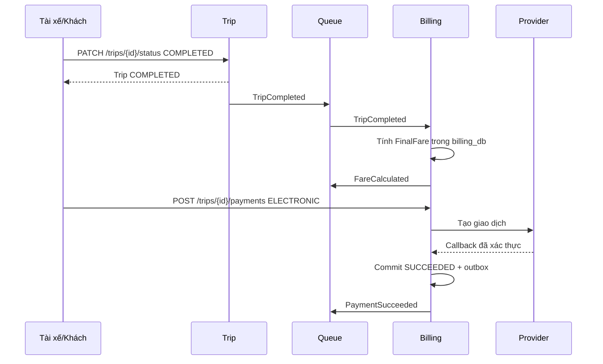

Với CASH, thay nhánh Provider bằng tài xế gọi `cash-confirmation`; không ghi SUCCEEDED ngay lúc khách chỉ chọn CASH. **Nhất quán:** Trip là nguồn trạng thái chuyến, Billing là nguồn cước và payment. Bản chiếu Trip/Reporting đến sau theo eventual consistency; UI hiển thị trạng thái payment từ Billing nếu bản chiếu chưa cập nhật. Billing unique một `FinalFare/trip` và tối đa một `SUCCEEDED/trip`; mỗi event được xử lý theo `eventId`. Không cần bù trừ để “hoàn tác chuyến đã hoàn thành” khi thanh toán lỗi: chuyến vẫn hoàn thành, tiền ở trạng thái chưa trả.

### E2E-03 — Thanh toán điện tử lỗi hoặc chưa xác định

**Lý do chọn:** đây là ngoại lệ có nguy cơ thu tiền trùng nếu client gửi lại sau timeout. **Trigger:** provider trả FAILED, callback đến muộn hoặc không phản hồi. **Kết quả:** khách thấy kết quả thật sau tra cứu; chỉ thử lại khi lần trước đã xác định FAILED.

| Thứ tự | Bên gọi → bên nhận                       | API/event                                              | Kiểu          | Đọc/ghi database                                    | Kết quả                                                   |
| -----: | ---------------------------------------- | ------------------------------------------------------ | ------------- | --------------------------------------------------- | --------------------------------------------------------- |
|      1 | Khách → Billing                          | `POST /api/v1/trips/{id}/payments` với Idempotency-Key | Đồng bộ       | Billing ghi một `payment_attempt` PENDING và outbox | Trả attemptId.                                            |
|      2 | Billing → Provider                       | Yêu cầu thu tiền với mã tham chiếu duy nhất            | Đồng bộ ngoài | Chỉ Billing ghi `billing_db`                        | Provider xử lý.                                           |
|     3a | Provider → Billing                       | Callback FAILED có chữ ký hợp lệ                       | Callback      | Billing ghi `provider_events`, đổi FAILED           | Có thể cho khách thử lại trong giới hạn.                  |
|     3b | Không có callback                        | Timeout → UNKNOWN                                      | Nội bộ        | Billing đổi UNKNOWN                                 | **Không tạo lần thu mới.**                                |
|      4 | Billing → Provider                       | Tra cứu providerReference                              | Đồng bộ ngoài | Billing cập nhật kết quả xác thực                   | SUCCEEDED hoặc FAILED; UNKNOWN thì tiếp tục chờ/đối soát. |
|      5 | Khách → Billing                          | `GET /api/v1/trips/{id}/payments`                      | Đồng bộ       | Billing đọc trạng thái nguồn                        | Khách biết kết quả trước khi retry.                       |
|      6 | Billing → Queue → Notification/Reporting | `PaymentFailed` hoặc `PaymentSucceeded`                | Bất đồng bộ   | Các service cập nhật DB riêng                       | Thông báo một lần theo eventId.                           |

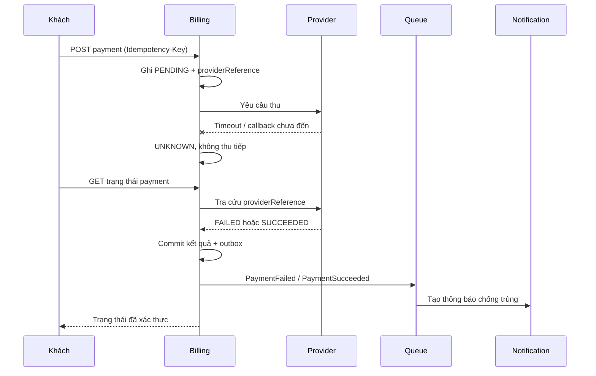

**Nhất quán và xử lý lỗi:** trạng thái ở Billing là nguồn sự thật; `UNKNOWN` không đồng nghĩa FAILED. Callback trùng được lọc bằng `providerEventId`; cùng Idempotency-Key trả cùng attempt. Chỉ khi FAILED đã xác nhận, khách mới thử lại tối đa hai lần hoặc chọn tiền mặt nếu chưa có SUCCEEDED. Nếu provider trả SUCCEEDED muộn, khóa duy nhất theo trip ngăn payment thứ hai thành công; nếu đã phát sinh giao dịch ngoài trái mong đợi, ghi sự cố để vận hành đối soát, **không tự xóa dữ liệu hoặc âm thầm ghi nhận hai lần thu**. Đây là quy trình đối soát chứ không phải Saga bù trừ tự động, vì hệ thống không thể tự đảo giao dịch tại provider khi chưa có contract hoàn tiền.

## Tổng hợp sau Bước 5

| BC                        | Microservice           | Database chính                   | Quy tắc sở hữu dữ liệu                         |
| ------------------------- | ---------------------- | -------------------------------- | ---------------------------------------------- |
| Danh tính và tài khoản    | `identity-service`     | PostgreSQL `identity_db`         | Account, role, session                         |
| Năng lực và vị trí tài xế | `driver-service`       | PostgreSQL + PostGIS `driver_db` | Driver, vehicle, current location, reservation |
| Đặt xe và điều phối       | `dispatch-service`     | PostgreSQL `dispatch_db`         | Request, offer, assignment                     |
| Chuyến đi và đánh giá     | `trip-service`         | PostgreSQL `trip_db`             | Trip, status history, rating                   |
| Cước và thanh toán        | `billing-service`      | PostgreSQL `billing_db`          | Price policy, fare, payment                    |
| Thông báo                 | `notification-service` | MongoDB `notification_db`        | Notification, delivery attempts                |
| Hỗ trợ vận hành           | `operations-service`   | PostgreSQL `operations_db`       | Incident, actions, operations read model       |
| Báo cáo hoạt động         | `reporting-service`    | PostgreSQL `reporting_db`        | Metrics and processed events                   |

**Kiểm tra bao phủ:** FR-01–FR-38 thuộc Bước 08 đều được nêu ít nhất một lần; các FR xuyên BC được tách rõ _nguồn quyết định_ và _bản chiếu/hiển thị_ (FR-09/15/16/18/21/26/27/31–33). Tám BC = tám MS = tám database chính; không có FK liên database. Các endpoint có nhãn **[Đề xuất]** là phần bổ sung để khép kín workflow, cần cập nhật SRS/API document nếu chọn triển khai. Repo GitHub chưa được đối chiếu trực tiếp, vì vậy trước khi code cần so bản này với commit SRS hiện hành.
