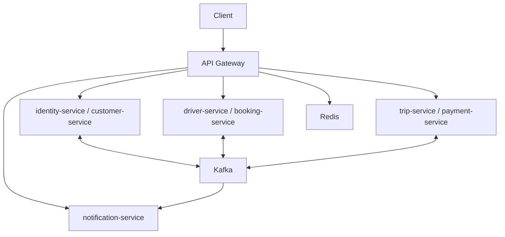
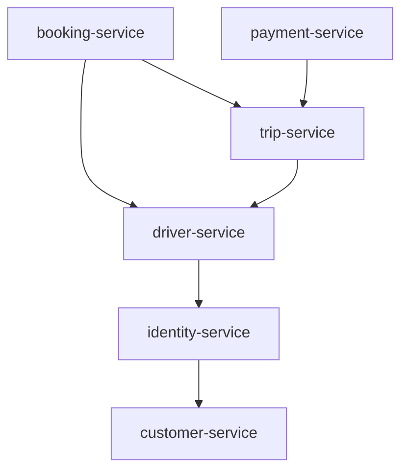
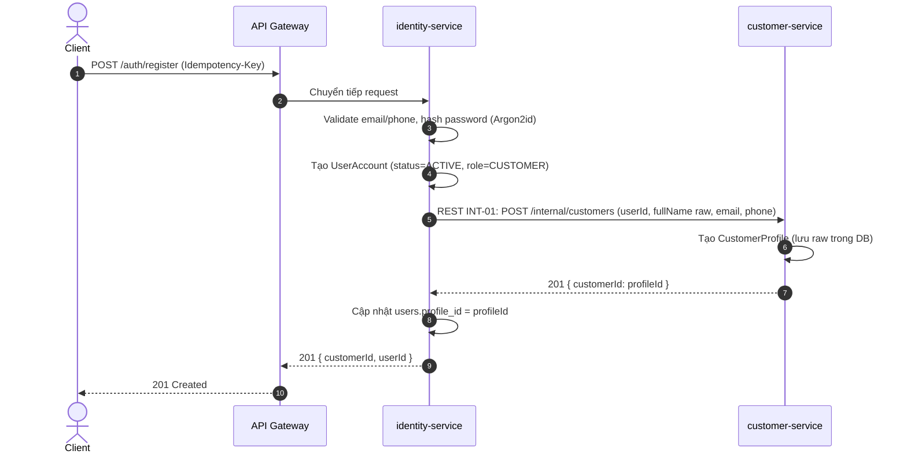
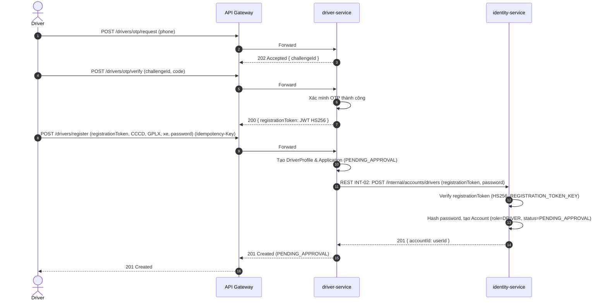
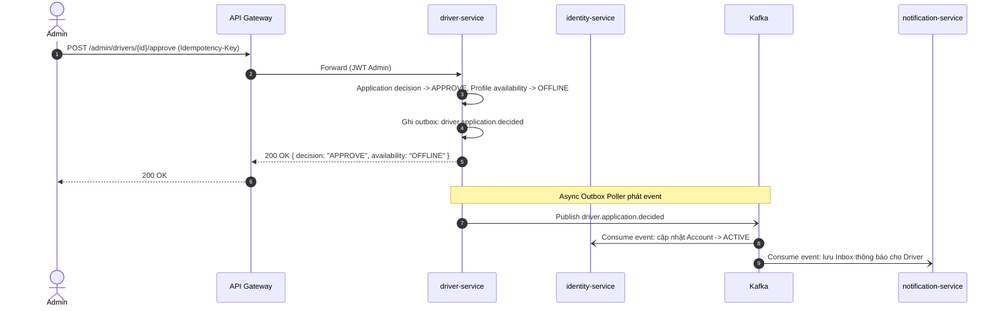
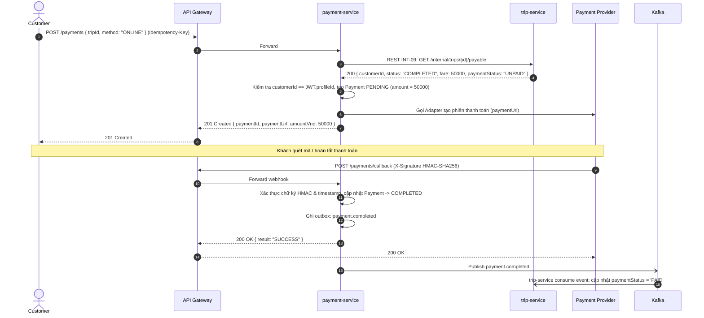
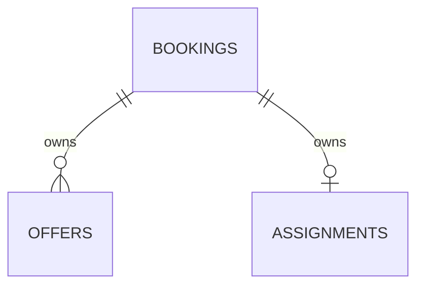
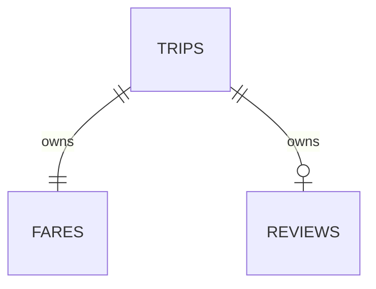
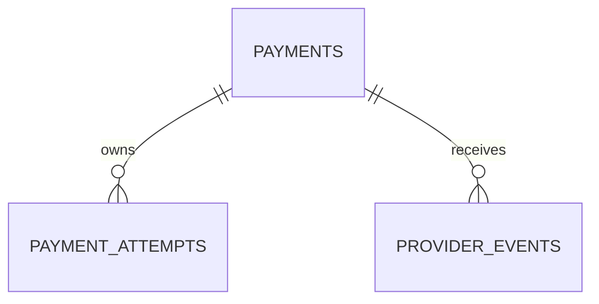

# CAB System — Microservice Design

## Mục lục

- [1. Tổng quan](#section-1)
- [2. Context Map, Internal REST và Kafka](#section-2)
- [3. Ngôn ngữ chung](#section-3)
- [4. Loại database](#section-4)
- [5. Thiết kế từng service](#section-5)
- [6. Luồng liên service](#section-6)
- [7. Kafka topics và event catalog](#section-7)
- [8. ERD và data dictionary](#section-8)
- [9. Cross-cutting](#section-9)
- [10. Project, Compose, môi trường, mock và seed](#section-10)
- [11. Kiểm chứng 30 tiêu chí](#section-11)
- [12. Quyết định, điểm lệch và thay đổi](#section-12)

Phiên bản 3.4 · 01/10/2026 · Đồng bộ các lệch còn lại trong audit1.md: enum Driver, registrationToken, tariff snapshot, timeout, XSS, event catalog, Booking/Trip, PC24 và Compose init.

<a id="section-1"></a>

## 1. Tổng quan

### 1.1 Thành phần

| Service | Bounded Context / mã | Database P1 | Sở hữu |
| --- | --- | --- | --- |
| `identity-service` | Identity / BC01 | PostgreSQL cab_identity_db | Account, Authentication, RBAC |
| `customer-service` | Customer / BC02 | PostgreSQL cab_customer_db | Customer profile |
| `driver-service` | Driver/Fleet / BC03 | PostgreSQL cab_driver_db | Driver, Vehicle, Availability, Location, OTP |
| `booking-service` | Booking + Dispatch/Assignment / BC04, BC05 | PostgreSQL cab_booking_db | Booking, Offer, Assignment |
| `trip-service` | Trip Operations + Fare + Feedback / BC06, BC08 | PostgreSQL cab_trip_db | Trip, Tracking, Fare, Review |
| `payment-service` | Billing/Payment / BC07 | PostgreSQL cab_payment_db | Payment, callback |
| `notification-service` | Notification / BC09 | MongoDB cab_notification_db | Inbox, delivery, consumer/producer |

### 1.2 Sơ đồ chuẩn



Các node gộp chỉ để sơ đồ dễ đọc, không phải service vật lý mới. DB riêng theo §4; call graph chi tiết ở §2. Catalog §7 xác định service publish/consume thực tế; sơ đồ không cấp subscription toàn bộ.

### 1.3 Quy ước

Tên service dùng kebab-case; event dùng dotted name; JSON dùng camelCase, cột DB dùng snake_case; ID là UUID, thời gian UTC, tiền VND. BC là Bounded Context; dữ liệu biên ghi đầy đủ Boundary Condition. PC là tiêu chí chấm; FR/UC là yêu cầu phần mềm.

### 1.4 Đối chiếu SRS

SRS §7 ↔ micro §3: trạng thái; SRS §12 ↔ micro §7: Kafka; SRS §13 ↔ micro §8: DB; SRS §14–15 ↔ micro §1.6/2/5: ranh giới. SRS §16.1 là nguồn cấu hình; SRS §16.2 ↔ micro §5/9: API; SRS §17 ↔ micro §11: 30 PC.

### 1.5 Phạm vi

Đúng bảy service vật lý ở P1. BC04/BC05 cùng trong `booking-service`; BC06/BC08 cùng trong `trip-service`. Gateway, Kafka, Redis và database là hạ tầng.

**ADR Gom Bounded Context (AUD-09):**
- *Lý do:* Giảm độ phức tạp điều phối phân tán giữa nhận Offer và khởi tạo Trip trong thời gian đồ án 7 tuần, tối ưu tài nguyên container máy phát triển sinh viên.
- *Ràng buộc nội bộ:* Mỗi BC được tổ chức thành một package/module độc lập bên trong service (`src/booking/` và `src/dispatch/` trong `booking-service`; `src/trip/`, `src/fare/`, `src/review/` trong `trip-service`). Tuyệt đối cấm import domain chéo module; giao tiếp liên BC nội bộ phải qua Application Service / Port interface.

`backoffice-service` **(P2)** sở hữu Employee Operations, Incident, Board dashboard/report và xem Audit Log; không có trong Compose P1. Quản lý account/role bởi Admin, refresh/logout, payment_methods và customer_activity đều **(P2)**.

### 1.6 Ranh giới 7 service
Ranh giới và quyền sở hữu bảy service được định nghĩa duy nhất tại §1.1; BC04/BC05 cùng trong `booking-service`, BC06/BC08 cùng trong `trip-service`. Gateway, Kafka, Redis và database là hạ tầng, không phải service nghiệp vụ.

<a id="section-2"></a>

## 2. Context Map, Internal REST và Kafka



Đây là đồ thị lời gọi nghiệp vụ đồng bộ **không có vòng** (đã loại bỏ INT-10 theo AUD-12).

### Bảng Context Map & Phân loại Subdomain (AUD-08)

| Quan hệ Upstream → Downstream | Giao tiếp | Pattern DDD | Phân loại Subdomain |
| --- | --- | --- | --- |
| `identity-service` → `customer-service` | REST INT-01 | Customer–Supplier | Generic Subdomain (Identity) → Supporting (Customer) |
| `driver-service` → `identity-service` | REST INT-02 | Customer–Supplier (tạo account) + Conformist (event duyệt) | Supporting Subdomain (Driver) → Generic (Identity) |
| `booking-service` → `driver-service` | REST INT-03..05 | Customer–Supplier + Reservation Saga | Core Subdomain (Booking/Dispatch) → Supporting (Driver) |
| `booking-service` → `trip-service` | REST INT-06, 07 | Customer–Supplier + Saga Orchestrator | Core Subdomain (Booking) → Core Subdomain (Trip) |
| `trip-service` → `driver-service` | REST INT-08 | Customer–Supplier (confirm reservation) | Core Subdomain (Trip) → Supporting (Driver) |
| `payment-service` → `trip-service` | REST INT-09 | Conformist / ACL (đọc cước khóa) | Generic Subdomain (Payment) → Core (Trip) |
| `notification-service` (subscriber) | Kafka Pub/Sub | Published Language (Event Catalog) | Generic Subdomain (Notification) |
| Map / Payment / SMS Providers | REST Adapters | Anti-Corruption Layer (ACL) | External Systems | Gateway gọi service đích nằm ngoài đồ thị này. Cập nhật ngược chiều (kết quả duyệt, Trip kết thúc, Payment thành công) dùng Kafka. Adapter provider ngoài không tạo cạnh giữa hai service P1.
Internal REST dùng X-Service-Token: JWT `HS256`, claim iss (service gọi), aud (service nhận), iat, exp, jti. TTL lấy từ SRS §16.1. Service nhận kiểm chữ ký, thuật toán, hạn, aud và allowlist iss theo endpoint. JWT user `RS256` được chuyển tiếp trong Authorization đối với request từ Gateway; quyền actor lấy từ token user đã xác minh, không lấy từ body/header tự khai.

Gateway có credential với iss=`gateway` và aud=owner cho route API/health cho phép. Mọi /internal/** bị Gateway trả 404 cho client. Thiếu hoặc sai credential trả 401 kể cả truy cập mạng Docker trực tiếp. Credential hợp lệ nhưng caller không có trong allowlist trả 403. Service token không tự cho quyền đọc dữ liệu người dùng; lệnh nội bộ truyền subject đã xác thực và owner vẫn kiểm quan hệ tài nguyên.

Các endpoint credential chỉ tồn tại trên mạng cab-internal. Chỉ Gateway publish port. Key ký JWT nội bộ tách khỏi access-token key, callback secret, pepper, blind-index key và encryption key.
| Mã | Caller | Owner | Internal REST | Hợp đồng |
| --- | --- | --- | --- | --- |
| INT-01 | `identity-service` | `customer-service` | POST /internal/customers | Tạo Customer profile bằng userId; idempotent theo userId |
| INT-02 | `driver-service` | `identity-service` | POST /internal/accounts/drivers | Tạo tài khoản DRIVER theo registrationToken; hash password tại `identity-service` |
| INT-03 | `booking-service` | `driver-service` | GET /internal/drivers/nearby | Ứng viên `ONLINE` cùng loại xe, vị trí mới; không có reservation |
| INT-04 | `booking-service` | `driver-service` | POST /internal/drivers/{id}/reservations | Tạo HELD trước Offer với {bookingId,offerId}; 201 {reservationId,token,expiresAt}; owner khóa Driver; replay 200/response đã lưu |
| INT-05 | `booking-service` | `driver-service` | DELETE /internal/drivers/{id}/reservations/{reservationId} | Release HELD/đã biết tạo Trip thất bại; CONFIRMED chưa rõ kết quả trả 409; DELETE lặp cùng trạng thái trả 200 |
| INT-06 | `booking-service` | `trip-service` | POST /internal/trips | Tạo hoặc phục hồi Trip cùng bookingId/commandKey; 201 lần đầu, replay response cũ; không thử tạo mới khi kết quả chưa rõ |
| INT-07 | `booking-service` | `trip-service` | GET /internal/customers/{id}/active-trip | Xác nhận không có Trip hoạt động trước tạo Booking |
| INT-08 | `trip-service` | `driver-service` | POST /internal/drivers/{id}/reservations/{reservationId}/confirm | Confirm {tripId,bookingId,offerId,token,commandKey}; HELD→CONFIRMED; 200 {tripId,driverSnapshot,vehicleType}; sai/hết hạn 409; không tự expiry CONFIRMED |
| INT-09 | `payment-service` | `trip-service` | GET /internal/trips/{id}/payable | Trả customerId,status,fare,paymentStatus; nguồn xác nhận số tiền (thay thế hoàn toàn INT-10) |


Catalog dưới đây là **hợp đồng tài liệu chuẩn hóa theo prompt**, chưa phải kết quả trích từ code backend. Các đường public bắt buộc theo prompt; endpoint kỹ thuật reservation/account/profile được chuẩn hóa theo trách nhiệm và call graph đã chốt. Backend phải đối chiếu implementation với catalog này khi có source; tài liệu hiện hành là v3.4. Không thêm loại event AssignmentAccepted hay nghiệp vụ mới.

Identity cung cấp Account; Driver cung cấp Candidate/reservation; Booking phối hợp Assignment; Trip là nguồn Fare; Payment đọc Fare; Notification tích hợp bằng Published Language. Kafka cập nhật ngược chiều để đồ thị REST không có vòng. Redis hỗ trợ cache/lease, không chia sẻ quyền sở hữu aggregate.

<a id="section-3"></a>

## 3. Ngôn ngữ chung

| Aggregate | Owner | Trạng thái chuẩn / transitions |
| --- | --- | --- |
| DriverApplication | `driver-service` | `PENDING_APPROVAL`→decision `APPROVE` (duyệt) / `REJECT` (từ chối). Quản lý hồ sơ đăng ký. |
| DriverAvailability | `driver-service` | `OFFLINE`↔`ONLINE`; `ONLINE`→`BUSY` (khi confirm Trip); `BUSY`→`ONLINE` (khi Trip kết thúc). Quản lý trạng thái hoạt động thực tế. |
| Driver (API View) | `driver-service` | Ánh xạ: application decision `null`/`REJECT` trả trạng thái chờ/từ chối; decision `APPROVE` trả availability (`OFFLINE`/`ONLINE`/`BUSY`). |
| Booking | `booking-service` | `SEARCHING`→`ASSIGNED`/`NO_DRIVER_FOUND`/`CANCELED`; `ASSIGNED`→`COMPLETED`/`CANCELED` theo Trip |
| Offer | `booking-service` | `PENDING`→`ACCEPTED`/`REJECTED`/`EXPIRED`/`CANCELED` |
| Trip | `trip-service` | `ASSIGNED`→`ARRIVED`→`IN_PROGRESS`→`COMPLETED`; `ASSIGNED`/`ARRIVED`→`CANCELED` |
| Payment | `payment-service` | `PENDING`→`COMPLETED`/`FAILED`; `FAILED`→`PENDING` khi retry an toàn; `COMPLETED` terminal |
| Account | `identity-service` | `PENDING_APPROVAL`→`ACTIVE`/`REJECTED`; CUSTOMER mới `ACTIVE` |
| Trip.paymentStatus | `trip-service` | `UNPAID`→`PAID` khi `payment.completed` hợp lệ |
| Notification | `notification-service` | read_at null→timestamp; delivery `PENDING`/`SENT`/`FAILED` |

| Thuật ngữ | Nghĩa |
| --- | --- |
| Booking | Yêu cầu đặt xe, thuộc `booking-service` |
| Assignment | Phối hợp offer/driver/trip thuộc `booking-service` |
| Fare | Cước chính thức của Trip do `trip-service` tính/khóa |
| Estimate | Báo giá tham khảo của Booking; client không quyết định số tiền |
| Review | Đánh giá Trip; `trip-service` sở hữu |
| Payment | Một giao dịch/Trip; số tiền sao chép Fare |
| Reservation | Lease kỹ thuật ngăn Driver nhận trùng; phải kiểm tra kết quả Trip trước khi giải phóng |

<a id="section-4"></a>

## 4. Loại database

| Service | Bounded Context / mã | Database P1 | Sở hữu |
| --- | --- | --- | --- |
| `identity-service` | Identity / BC01 | PostgreSQL cab_identity_db | Account, Authentication, RBAC |
| `customer-service` | Customer / BC02 | PostgreSQL cab_customer_db | Customer profile |
| `driver-service` | Driver/Fleet / BC03 | PostgreSQL cab_driver_db | Driver, Vehicle, Availability, Location, OTP |
| `booking-service` | Booking + Dispatch/Assignment / BC04, BC05 | PostgreSQL cab_booking_db | Booking, Offer, Assignment |
| `trip-service` | Trip Operations + Fare + Feedback / BC06, BC08 | PostgreSQL cab_trip_db | Trip, Tracking, Fare, Review |
| `payment-service` | Billing/Payment / BC07 | PostgreSQL cab_payment_db | Payment, callback |
| `notification-service` | Notification / BC09 | MongoDB cab_notification_db | Inbox, delivery, consumer/producer |

Redis có namespace rate của Gateway, OTP/GEO/reservation của Driver và vị trí của Trip. PostgreSQL dùng FK/transaction trong cùng owner. MongoDB Notification dùng replica-set transaction và unique recipient/event. Không dùng shared table hoặc join xuyên service. Mô hình server vật lý cần xác nhận C10; PostgreSQL dùng chung server vẫn có DB/user riêng.

<a id="section-5"></a>

## 5. Thiết kế từng service

### 5.0 Gateway

Gateway định tuyến theo catalog §9, không chứa nghiệp vụ. Kiểm JWT user, gắn service credential, dùng Redis rate limit, tổng hợp health và truyền requestId. Không route /internal/** cho client. /payments/callback không cần user JWT nhưng Payment bắt buộc kiểm HMAC. Port theo SRS §16.1.

### 5.1 `identity-service`

**Trách nhiệm:** theo SRS §15.1. **FR:** FR-02, FR-03. **UC:** UC-02, UC-03.

| Method | Public Gateway | Quyền | UC/FR | Contract |
| --- | --- | --- | --- | --- |
| POST | `/auth/register` | PUBLIC | UC-02/FR-02 | fullName,email,phone,password; 201 {customerId,userId}; đăng nhập được |
| POST | `/auth/login` | PUBLIC | UC-03/FR-03 | email hoặc phone,password; 200 {accessToken,tokenType,expiresIn,role,accountStatus,scope} |

**Internal REST cung cấp**

| ID | Caller | Owner | Path | Contract |
| --- | --- | --- | --- | --- |
| INT-02 | `driver-service` | `identity-service` | POST /internal/accounts/drivers | Tạo tài khoản DRIVER theo registrationToken; hash password tại `identity-service` |


**Internal REST gọi đi**

| ID | Caller | Owner | Path | Contract |
| --- | --- | --- | --- | --- |
| INT-01 | `identity-service` | `customer-service` | POST /internal/customers | Tạo Customer profile bằng userId; idempotent theo userId |


**Kafka publish:** Chưa có event nghiệp vụ riêng được catalog nguồn chốt; không tự tạo topic/event mới.

**Kafka subscribe:** `driver.application.decided`.

**Database/bảng:**

| Bảng/collection | Field chính | Quy tắc |
| --- | --- | --- |
| users | id uuid PK; profile_id uuid NULL UNIQUE; email_enc?,email_hash? UNIQUE; phone_enc,phone_hash UNIQUE; password_hash; role; status; provisioning_phase?; key_id; registration_id UNIQUE | `profile_id` NULL cho ADMIN; Customer/Driver có profile owner; chỉ `identity-service` hash password |

Outbox/inbox/idempotency cục bộ theo §9.1; cấu hình lấy SRS §16.1; quyền lấy SRS §16.3.

**Quy tắc riêng:** Chỉ Identity hash password; phone lấy từ token xác minh. Đăng ký Customer giữ trạng thái phối hợp đến khi profile commit. Không gọi ngược Driver; Account activation qua Kafka. Identity lưu profile_id từ lệnh phối hợp và ký profileId trong JWT; không để client tự chọn role/scope.

### 5.2 `customer-service`

**Trách nhiệm:** theo SRS §15.1. **FR:** FR-04. **UC:** UC-04.

| Method | Public Gateway | Quyền | UC/FR | Contract |
| --- | --- | --- | --- | --- |
| GET | `/customers/{id}` | CUSTOMER(owner), ADMIN | UC-04/FR-04 | 200 hồ sơ; không token 401; khác chủ 403 |

**Internal REST cung cấp**

| ID | Caller | Owner | Path | Contract |
| --- | --- | --- | --- | --- |
| INT-01 | `identity-service` | `customer-service` | POST /internal/customers | Tạo Customer profile bằng userId; idempotent theo userId |


**Internal REST gọi đi**

Không gọi đồng bộ service khác; provider adapter không tính là lời gọi service P1.

**Kafka publish:** Chưa có event nghiệp vụ riêng được catalog nguồn chốt; không tự tạo topic/event mới.

**Kafka subscribe:** Không có subscription nghiệp vụ P1 theo catalog.

**Database/bảng:**

| Bảng/collection | Field chính | Quy tắc |
| --- | --- | --- |
| customer_profiles | id uuid PK; user_id uuid UNIQUE; full_name; email_enc; phone_enc; key_id; created_at,updated_at | user_id là tham chiếu, không FK sang Identity; chỉ Customer sở hữu profile |

Outbox/inbox/idempotency cục bộ theo §9.1; cấu hình lấy SRS §16.1; quyền lấy SRS §16.3.

**Quy tắc riêng:** userId UNIQUE; đọc profile theo owner. Payment đọc profile bằng credential có allowlist. Identity tạo profile qua Internal REST; không thêm event đăng ký chưa được nguồn chốt.

### 5.3 `driver-service`

**Trách nhiệm:** theo SRS §15.1. **FR:** FR-05, FR-06, FR-07, FR-08, FR-09, FR-10, FR-11, FR-12, FR-13. **UC:** UC-05, UC-06, UC-07, UC-08, UC-09, UC-14.

| Method | Public Gateway | Quyền | UC/FR | Contract |
| --- | --- | --- | --- | --- |
| GET | `/drivers/{id}` | DRIVER(owner), CUSTOMER(public fields), ADMIN | UC-05/FR-05 | 200 hồ sơ theo vai trò; email/phone/CCCD không trả cho Customer |
| POST | `/drivers/otp/request` | PUBLIC | UC-06/FR-06 | phone,purpose=DRIVER_REGISTRATION; 202 {challengeId} |
| POST | `/drivers/otp/verify` | PUBLIC | UC-06/FR-06 | challengeId,phone,code; 200 {registrationToken} |
| POST | `/drivers/register` | PUBLIC + registrationToken | UC-06/FR-07 | phone,password,email?,fullName,citizenId,licenseNumber,vehicleType,plate,vehicleModel; 201 `PENDING_APPROVAL` |
| GET | `/drivers/me/application` | DRIVER(owner) | UC-06/FR-08 | 200 hồ sơ/trạng thái duyệt; cho phép DRIVER scope hạn chế |
| GET | `/admin/drivers` | ADMIN | UC-07/FR-09 | status?,page,limit; 200 danh sách chờ duyệt |
| GET | `/admin/drivers/{id}` | ADMIN | UC-07/FR-09 | 200 hồ sơ/giấy tờ được che phù hợp |
| POST | `/admin/drivers/{id}/approve` | ADMIN | UC-07/FR-10 | 200; replay cùng key trả lại response; driver `OFFLINE`; thông báo kết quả |
| POST | `/admin/drivers/{id}/reject` | ADMIN | UC-07/FR-10 | reason bắt buộc; 200 `REJECTED`; thông báo kết quả |
| PUT | `/drivers/me/availability` | DRIVER(accountStatus=ACTIVE, decision=APPROVE) | UC-08/FR-11 | status=`ONLINE`/`OFFLINE`; không đổi `BUSY` |
| PUT | `/drivers/me/location` | DRIVER(accountStatus=ACTIVE, decision=APPROVE) | UC-08,UC-14/FR-12 | lat,lng,recordedAt?; 200; event cập nhật Trip |
| GET | `/drivers/nearby` | CUSTOMER, ADMIN | UC-09/FR-13 | lat,lng,radius,status,vehicleType?,page,limit; {items,page,limit,total} |

Đổi `ONLINE` → `OFFLINE` khi còn Offer `PENDING` hoặc reservation `HELD` trả 409 `ACTIVE_OFFER_EXISTS`; chỉ cho đổi sau khi Offer terminal/released. Worker recovery/reconcile xử lý các assignment `CREATING_TRIP`, response timeout và outbox chưa publish theo §9.6, không tự giải phóng reservation `CONFIRMED`.

**Internal REST cung cấp**

| ID | Caller | Owner | Path | Contract |
| --- | --- | --- | --- | --- |
| INT-03 | `booking-service` | `driver-service` | GET /internal/drivers/nearby | Ứng viên `ONLINE` cùng loại xe, vị trí mới; không có reservation |
| INT-04 | `booking-service` | `driver-service` | POST /internal/drivers/{id}/reservations | Tạo HELD trước Offer với {bookingId,offerId}; 201 {reservationId,token,expiresAt}; owner khóa Driver; replay 200/response đã lưu |
| INT-05 | `booking-service` | `driver-service` | DELETE /internal/drivers/{id}/reservations/{reservationId} | Release HELD/đã biết tạo Trip thất bại; CONFIRMED chưa rõ kết quả trả 409; DELETE lặp cùng trạng thái trả 200 |
| INT-08 | `trip-service` | `driver-service` | POST /internal/drivers/{id}/reservations/{reservationId}/confirm | Confirm {tripId,bookingId,offerId,token,commandKey}; HELD→CONFIRMED; 200 {tripId,driverSnapshot,vehicleType}; sai/hết hạn 409; không tự expiry CONFIRMED |


**Internal REST gọi đi**

| ID | Caller | Owner | Path | Contract |
| --- | --- | --- | --- | --- |
| INT-02 | `driver-service` | `identity-service` | POST /internal/accounts/drivers | Tạo tài khoản DRIVER theo registrationToken; hash password tại `identity-service` |


**Kafka publish:** `driver.application.decided`, `driver.location.updated`.

**Kafka subscribe:** `booking.assigned`, `booking.canceled`, `trip.assigned`, `trip.completed`, `trip.canceled`, `trip.review.created`.

**Database/bảng:**

| Bảng/collection | Field chính | Quy tắc |
| --- | --- | --- |
| driver_applications | id uuid PK; driver_id uuid UNIQUE FK nội bộ; user_id uuid UNIQUE; decision; status; citizen_id_enc; license_number_enc; key_id; submitted_at,reviewed_at,reviewed_by,reject_reason | CCCD/bằng lái mã hóa; decision là APPROVE/REJECT hoặc null; status ghi kết quả duyệt PENDING_APPROVAL/OFFLINE/REJECTED; availability ONLINE/BUSY/OFFLINE chỉ ở profile |
| driver_profiles | id uuid PK; user_id uuid UNIQUE; full_name; status; active_trip_id?; last_terminal_trip_id?; rating_sum,rating_count; version | Trạng thái nghiệp vụ Driver theo SRS §7 |
| vehicles | id uuid PK; driver_id uuid UNIQUE FK nội bộ; vehicle_type; plate UNIQUE; vehicle_model | Thông tin xe; một xe của Driver trong phạm vi P1 |
| driver_locations | driver_id uuid PK FK nội bộ; lat,lng; recorded_at; version | Nguồn bền vững; Redis GEO là chỉ mục/cache, không thay DB |
| otp_challenges | id uuid PK; phone_hash; code_hash; purpose; attempts; expires_at; verified_at; consumed_at; registration_jti?; token_response_enc?; key_id? | Hash OTP; Driver sở hữu, Redis hỗ trợ TTL và đếm nguyên tử |
| driver_reservations | id uuid PK; driver_id uuid; booking_id uuid; offer_id uuid; status; token_hash; expires_at; confirmed_trip_id?; command_key; version | Kỹ thuật phân tách service: chỉ một reservation hoạt động/driver; xác nhận idempotent |

Outbox/inbox/idempotency cục bộ theo §9.1; cấu hình lấy SRS §16.1; quyền lấy SRS §16.3.

**Quy tắc riêng:** Driver sở hữu OTP, CCCD/giấy tờ, GEO/reservation; Admin duyệt P1. Khóa hàng Driver và reservation trong PostgreSQL để quyết định; Redis chỉ là cache có thể tái dựng, không có transaction nguyên tử bao trùm PostgreSQL và Redis; timestamp mới hơn thắng. Đối với nghiệp vụ nhận chuyến, Account claim trong JWT phải `ACTIVE`; API xem application/inbox cho phép scope hạn chế; trạng thái Driver và reservation kiểm từ DB owner; không phụ thuộc projection Identity không có event.

### 5.4 `booking-service`

**Trách nhiệm:** theo SRS §15.1. **FR:** FR-14, FR-15, FR-16, FR-17, FR-18, FR-19, FR-22. **UC:** UC-10, UC-11, UC-12, UC-13, UC-15.

| Method | Public Gateway | Quyền | UC/FR | Contract |
| --- | --- | --- | --- | --- |
| POST | `/fare-estimates` | CUSTOMER | UC-10/FR-14 | pickup,dropoff,vehicleType; trả estimate, không phải Fare cuối |
| POST | `/bookings` | CUSTOMER | UC-11/FR-15,FR-16 | pickup,dropoff,vehicleType; 201 {bookingId,status:`SEARCHING`}; Idempotency-Key |
| GET | `/bookings` | CUSTOMER(owner), ADMIN | UC-12/FR-17 | status?,page,limit; scope customerId từ JWT |
| GET | `/bookings/{id}` | CUSTOMER(owner), ADMIN | UC-11,UC-12/FR-17 | 200 status và tripId khi đã gán |
| POST | `/bookings/{id}/cancel` | CUSTOMER(owner) | UC-15/FR-22 | reason bắt buộc; 200 `CANCELED` nếu `SEARCHING` |
| GET | `/offers` | DRIVER(owner) | UC-13/FR-18 | status?,page,limit; chỉ offer của Driver |
| GET | `/offers/{id}` | DRIVER(owner) | UC-13/FR-18 | pickup,dropoff,estimate,expiresAt; không lộ bí mật |
| POST | `/offers/{id}/accept` | DRIVER(owner) | UC-13/FR-19 | Idempotency-Key; 200 {bookingId,tripId,driverId,status:`ASSIGNED`} |
| POST | `/offers/{id}/reject` | DRIVER(owner) | UC-13/FR-18 | 200 `REJECTED`; worker tìm người tiếp |

**Internal REST cung cấp**

Không cung cấp endpoint nghiệp vụ nội bộ trong catalog; health có credential.

**Internal REST gọi đi**

| ID | Caller | Owner | Path | Contract |
| --- | --- | --- | --- | --- |
| INT-03 | `booking-service` | `driver-service` | GET /internal/drivers/nearby | Ứng viên `ONLINE` cùng loại xe, vị trí mới; không có reservation |
| INT-04 | `booking-service` | `driver-service` | POST /internal/drivers/{id}/reservations | Tạo HELD trước Offer với {bookingId,offerId}; 201 {reservationId,token,expiresAt}; owner khóa Driver; replay 200/response đã lưu |
| INT-05 | `booking-service` | `driver-service` | DELETE /internal/drivers/{id}/reservations/{reservationId} | Release HELD/đã biết tạo Trip thất bại; CONFIRMED chưa rõ kết quả trả 409; DELETE lặp cùng trạng thái trả 200 |
| INT-06 | `booking-service` | `trip-service` | POST /internal/trips | Tạo hoặc phục hồi Trip cùng bookingId/commandKey; 201 lần đầu, replay response cũ; không thử tạo mới khi kết quả chưa rõ |
| INT-07 | `booking-service` | `trip-service` | GET /internal/customers/{id}/active-trip | Xác nhận không có Trip hoạt động trước tạo Booking |


**Kafka publish:** `booking.offer.created`, `booking.assigned`, `booking.canceled`, `booking.no_driver_found`.

**Kafka subscribe:** `trip.assigned`, `trip.completed`, `trip.canceled`.

**Database/bảng:**

| Bảng/collection | Field chính | Quy tắc |
| --- | --- | --- |
| bookings | id uuid PK; customer_id,driver_id?,trip_id? UNIQUE; assignment_phase?; vehicle_type; pickup/dropoff; quoted_fare_vnd; distance_m; status; requested_at; cancel_reason? | Không có FK xuyên service; một Booking hoạt động/customer được khóa theo customerId |
| offers | id uuid PK; booking_id uuid FK nội bộ; driver_id; reservation_id; sequence; status; expires_at; responded_at | Offer `PENDING` duy nhất cho Driver và cho vòng dispatch; điều kiện hết hạn kiểm trong transaction |
| assignments | id uuid PK; booking_id uuid UNIQUE FK nội bộ; offer_id uuid UNIQUE; driver_id; trip_id?; reservation_id; command_key; status; last_error?; updated_at | Bản ghi phối hợp tạo Trip, phục hồi khi response bị mất; chưa biết kết quả không điều phối người khác |
| tariff_snapshots | id uuid PK; vehicle_type; base_vnd; included_distance_m; per_km_vnd; snapshot_version; source_price_version; created_at | Projection local từ `trip-service`; đồng bộ idempotent theo `snapshot_version`; chỉ phục vụ estimate/Booking, không thay Fare cuối |

Outbox/inbox/idempotency cục bộ theo §9.1; cấu hình lấy SRS §16.1; quyền lấy SRS §16.3.

**Quy tắc riêng:** Booking không tính Fare chính thức. Offer/Assignment thuộc Booking. Accept/cancel dùng khóa cục bộ; assignment hỗ trợ phục hồi khi mất response Trip. Worker không chọn Driver tiếp khi kết quả assignment chưa rõ.

### 5.5 `trip-service`

**Trách nhiệm:** theo SRS §15.1. **FR:** FR-20, FR-21, FR-23, FR-24, FR-25. **UC:** UC-13, UC-14, UC-15, UC-16.

| Method | Public Gateway | Quyền | UC/FR | Contract |
| --- | --- | --- | --- | --- |
| GET | `/trips/{id}` | CUSTOMER/DRIVER(owner), ADMIN | UC-13,UC-14/FR-20 | snapshot tài xế, trạng thái, vị trí, fare, paymentStatus |
| PATCH | `/trips/{id}/status` | DRIVER(assigned) | UC-14/FR-21 | status=`ARRIVED`/`IN_PROGRESS`/`COMPLETED`; 200; sai thứ tự 409 |
| POST | `/trips/{id}/cancel` | CUSTOMER/DRIVER(owner) | UC-15/FR-23 | reason bắt buộc; 200 `CANCELED`; thông báo hai bên |
| POST | `/trips/{id}/reviews` | CUSTOMER(owner) | UC-16/FR-24 | stars,comment; 201 gắn tripId; một Review/Trip |
| GET | `/trips/{id}/review` | CUSTOMER/DRIVER(owner), ADMIN | UC-16/FR-25 | 200 review; chưa có Review trả 404 |

**Internal REST cung cấp**

| ID | Caller | Owner | Path | Contract |
| --- | --- | --- | --- | --- |
| INT-06 | `booking-service` | `trip-service` | POST /internal/trips | Tạo hoặc phục hồi Trip cùng bookingId/commandKey; 201 lần đầu, replay response cũ; không thử tạo mới khi kết quả chưa rõ |
| INT-07 | `booking-service` | `trip-service` | GET /internal/customers/{id}/active-trip | Xác nhận không có Trip hoạt động trước tạo Booking |
| INT-09 | `payment-service` | `trip-service` | GET /internal/trips/{id}/payable | Trả customerId,status,fare,paymentStatus; nguồn xác nhận số tiền |


**Internal REST gọi đi**

| ID | Caller | Owner | Path | Contract |
| --- | --- | --- | --- | --- |
| INT-08 | `trip-service` | `driver-service` | POST /internal/drivers/{id}/reservations/{reservationId}/confirm | Confirm {tripId,bookingId,offerId,token,commandKey}; HELD→CONFIRMED; 200 {tripId,driverSnapshot,vehicleType}; sai/hết hạn 409; không tự expiry CONFIRMED |


**Kafka publish:** `trip.assigned`, `trip.status.changed`, `trip.completed`, `trip.canceled`, `trip.review.created`.

**Kafka subscribe:** `driver.location.updated`, `payment.completed`.

**Database/bảng:**

| Bảng/collection | Field chính | Quy tắc |
| --- | --- | --- |
| trips | id uuid PK; booking_id uuid UNIQUE; customer_id,driver_id; driver_snapshot jsonb; status; payment_status; last_lat,last_lng,last_location_at; assigned_at,arrived_at,started_at,completed_at,canceled_at; cancel_reason?; version | Một Trip hoạt động/driver và customer; booking_id không FK sang Booking |
| fares | id uuid PK; trip_id uuid UNIQUE FK nội bộ; distance_m; vehicle_type; tariff_snapshot jsonb; amount_vnd; locked_at | Trip sở hữu và tính/khóa Fare khi tạo Trip; Payment chỉ đọc |
| reviews | id uuid PK; trip_id uuid UNIQUE FK nội bộ; customer_id,driver_id; stars; comment; created_at | stars CHECK 1–5; review chỉ sau `COMPLETED` |
| price_versions | id uuid PK; vehicle_type; base_vnd; included_distance_m; per_km_vnd; active_from; snapshot_version | Danh mục giá do Trip sở hữu; seed BIKE/SEDAN/SUV theo §16.5; Booking đồng bộ sang `tariff_snapshots` |

Outbox/inbox/idempotency cục bộ theo §9.1; cấu hình lấy SRS §16.1; quyền lấy SRS §16.3.

**Quy tắc riêng:** booking_id UNIQUE; mỗi Driver/Customer có tối đa một Trip hoạt động. Xác nhận reservation chuyển HELD→CONFIRMED trước tạo Trip, gắn tripId đã preallocate; ghi Trip/Fare/outbox trong transaction. Fare đã khóa không đổi; Review UNIQUE tripId. Không gọi Booking đồng bộ.

### 5.6 `payment-service`

**Trách nhiệm:** theo SRS §15.1. **FR:** FR-26, FR-27, FR-28, FR-29. **UC:** UC-17, UC-18.

| Method | Public Gateway | Quyền | UC/FR | Contract |
| --- | --- | --- | --- | --- |
| POST | `/payments` | CUSTOMER(owner) | UC-17/FR-26 | {tripId,method:`ONLINE`}; client không gửi amount; 201 `PENDING`,paymentUrl |
| GET | `/payments/{id}` | CUSTOMER(owner), ADMIN | UC-17/FR-27 | 200 paymentId,status,amountVnd,tripId |
| POST | `/payments/callback` | PROVIDER(HMAC) | UC-18/FR-28 | providerEventId,providerTxnRef,status,amountVnd; chữ ký; 200 kết quả |
| POST | `/payments/{id}/sandbox-confirm` | CUSTOMER(owner), sandbox only | UC-17,UC-18/FR-29 | scenario=SUCCESS/FAIL/DUPLICATE_CALLBACK; mock gọi callback qua Gateway |

**Internal REST cung cấp**

Không cung cấp endpoint nghiệp vụ nội bộ trong catalog; health có credential.

**Internal REST gọi đi**

| ID | Caller | Owner | Path | Contract |
| --- | --- | --- | --- | --- |
| INT-09 | `payment-service` | `trip-service` | GET /internal/trips/{id}/payable | Trả customerId,status,fare,paymentStatus; nguồn xác nhận số tiền (thay thế hoàn toàn INT-10) |


**Kafka publish:** `payment.completed`, `payment.failed`.

**Kafka subscribe:** Không có subscription nghiệp vụ P1 theo catalog.

**Database/bảng:**

| Bảng/collection | Field chính | Quy tắc |
| --- | --- | --- |
| payments | id uuid PK; trip_id uuid UNIQUE; customer_id; amount_vnd; status; method; attempt_count; provider_txn_ref; payment_url; paid_at; failed_reason? | Amount sao chép Fare đã khóa; `PENDING`/`COMPLETED`/`FAILED`; một Payment/Trip |
| payment_attempts | id uuid PK; payment_id uuid FK nội bộ; attempt_no; provider_txn_ref UNIQUE; provider_request_id UNIQUE; status; definitively_failed; created_at; UNIQUE(payment_id,attempt_no) | Theo dõi phiên cũ để callback không sửa lần thử mới; đã có trong tài liệu micro cũ |
| provider_events | provider_event_id text PK; payment_id uuid FK nội bộ; request_hash; result jsonb; received_at | Dedupe callback và lưu kết quả cũ nguyên tử |

Outbox/inbox/idempotency cục bộ theo §9.1; cấu hình lấy SRS §16.1; quyền lấy SRS §16.3.

**Quy tắc riêng:** Không nhận amount từ client; đọc Trip.fare. Provider chưa rõ kết quả thì giữ `PENDING`, không tự retry; `COMPLETED` là terminal. Kiểm callback eventId/amount/signature; attempt cũ không sửa attempt mới.

### 5.7 `notification-service`

**Trách nhiệm:** theo SRS §15.1. **FR:** FR-30. **UC:** UC-19.

| Method | Public Gateway | Quyền | UC/FR | Contract |
| --- | --- | --- | --- | --- |
| GET | `/notifications` | CUSTOMER/DRIVER(owner, scope hợp lệ) | UC-19/FR-30 | unread?,page,limit; thông báo theo role/profileId |
| PATCH | `/notifications/{id}/read` | CUSTOMER/DRIVER(owner, scope hợp lệ) | UC-19/FR-30 | 200; đọc lặp không tạo side effect mới |

**Internal REST cung cấp**

Không cung cấp endpoint nghiệp vụ nội bộ trong catalog; health có credential.

**Internal REST gọi đi**

Không gọi đồng bộ service khác; provider adapter không tính là lời gọi service P1.

**Kafka publish:** Chưa có event nghiệp vụ riêng được catalog nguồn chốt; không tự tạo topic/event mới.

**Kafka subscribe:** `driver.application.decided`, `booking.offer.created`, `booking.assigned`, `booking.canceled`, `booking.no_driver_found`, `trip.assigned`, `trip.status.changed`, `trip.completed`, `trip.canceled`, `payment.completed`, `payment.failed`.

**Database/bảng:**

| Bảng/collection | Field chính | Quy tắc |
| --- | --- | --- |
| notifications | _id UUID; recipient_id; recipient_role; event_id; type; title; body; resource; delivery_status; read_at?; created_at | MongoDB unique(recipient_role,recipient_id,event_id); recipient_id là profileId; chỉ recipient đọc |

Outbox/inbox/idempotency cục bộ theo §9.1; cấu hình lấy SRS §16.1; quyền lấy SRS §16.3.

**Quy tắc riêng:** MongoDB transaction ghi inbox và notification; unique recipient/event. Inbox không phụ thuộc push thành công. OTP đăng ký qua Driver SMS adapter ngoài, không tạo cạnh nội bộ trái call graph.

### 5.8 Mô hình miền chiến thuật (Tactical Domain Model — AUD-07)

Mỗi Bounded Context định nghĩa rõ ràng Aggregate Root, Entity, Value Object, Invariants nghiệp vụ (BRULE), Domain Event nội bộ và Repository Port:

| Service / BC | Aggregate Root | Entity nội bộ | Value Object (VO) | Invariant nghiệp vụ (BRULE) | Domain Event nội bộ | Integration Event (Kafka) | Repository Port |
| --- | --- | --- | --- | --- | --- | --- |
| `identity-service` (BC01) | **UserAccount** | Credential, RoleAssignment | `PhoneNumber`, `EmailAddress`, `HashedPassword` | BRULE-01, 02, 05 (Phone/email hợp lệ; mật khẩu chuẩn; role phân định) | `UserRegisteredDomainEvent`, `AccountStatusChangedDomainEvent` | *(Chưa phát event P1)* | `UserAccountRepository` |
| `customer-service` (BC02) | **CustomerProfile** | — | `FullName`, `PhoneNumber`, `EmailAddress` | BRULE-01 (Mỗi userId chỉ có đúng một profile) | `CustomerProfileCreatedDomainEvent` | *(Chưa phát event P1)* | `CustomerProfileRepository` |
| `driver-service` (BC03) | **DriverProfile** & **DriverApplication** | Vehicle, DocumentVerification | `Coordinate`, `LicensePlate`, `VehicleType`, `CitizenId` | BRULE-05, 06, 14 (Duyệt mới ONLINE; location <= 60s; không offline khi HELD) | `DriverApprovedDomainEvent`, `DriverLocationRecordedDomainEvent` | `driver.application.decided`, `driver.location.updated` | `DriverProfileRepository`, `DriverApplicationRepository`, `DriverLocationCachePort` (Redis) |
| `booking-service` (BC04, BC05) | **Booking** & **Offer** | DispatchCandidate, TariffSnapshot | `Coordinate`, `Money/Fare`, `IdempotencyKey` | BRULE-07..12 (Khách tối đa 1 cuốc active; dispatch 5km; 1 Offer active/tài xế) | `BookingCreatedDomainEvent`, `OfferAcceptedDomainEvent` | `booking.offer.created`, `booking.assigned`, `booking.canceled`, `booking.no_driver_found` | `BookingRepository`, `OfferRepository`, `TariffSnapshotRepository` |
| `trip-service` (BC06, BC08) | **Trip** & **TripReview** | RouteTracking, LockedFare | `Coordinate`, `Money/Fare`, `RatingStars` | BRULE-13..17 (Trip state machine; Fare khóa cứng; review 1 lần/Trip completed) | `TripArrivedDomainEvent`, `TripCompletedDomainEvent`, `ReviewSubmittedDomainEvent` | `trip.assigned`, `trip.status.changed`, `trip.completed`, `trip.canceled`, `trip.review.created` | `TripRepository`, `PriceVersionRepository`, `ReviewRepository` |
| `payment-service` (BC07) | **Payment** | PaymentAttempt | `Money/Fare`, `TransactionRef`, `HmacSignature` | BRULE-18..21 (Payment = Trip.fare; 1 payment/Trip; callback idempotent) | `PaymentCompletedDomainEvent`, `PaymentFailedDomainEvent` | `payment.completed`, `payment.failed` | `PaymentRepository`, `IdempotencyRecordRepository` |
| `notification-service` (BC09) | **NotificationInbox** | NotificationDelivery | `NotificationContent`, `RecipientIdentifier` | BRULE-22..23 (Deduplicate inbox theo recipient + eventId; xem đúng recipient) | `NotificationReceivedDomainEvent`, `NotificationMarkedReadDomainEvent` | *(Chỉ consume, đẩy dead-letter nếu lỗi)* | `NotificationInboxRepository` (Mongo) |

*Ghi chú:* Domain Event nội bộ dùng để trigger side-effect bên trong transaction của cùng service; Integration Event (Kafka) là sự kiện tích hợp liên service phát qua Outbox.

<a id="section-6"></a>

## 6. Luồng liên service

### 6.1 Account và Customer (AUD-21, AUD-25)



### 6.2 Đăng ký Driver (AUD-21, AUD-25)



### 6.3 Duyệt Driver (AUD-21, AUD-25)



### 6.4 Availability, Location và Nearby (AUD-25)
Driver gửi `PUT /drivers/me/location` (12 lần/phút) lên `driver-service`. `driver-service` lưu vị trí vào Redis (`GEOADD`) và Postgres, phát event `driver.location.updated` lên Kafka để `trip-service` cập nhật vị trí hành trình. `GET /drivers/nearby` là API công khai bán kính mặc định 1 km (không áp `LOCATION_MAX_AGE`); dispatch nội bộ dùng `DISPATCH_RADIUS=5000` m.

### 6.5 Ước tính và Booking (AUD-02, AUD-25)
Customer gọi `POST /fare-estimates`. `booking-service` đọc bảng `tariff_snapshots` cục bộ và gọi Map Provider để tính quãng đường/ETA, trả về `estimated_fare` kèm `tariffVersion`. Khi Customer gọi `POST /bookings` (header `Idempotency-Key`), `booking-service` tạo Booking trạng thái `SEARCHING`.

### 6.6 Offer, Assignment và tạo Trip (AUD-21, AUD-25)

```mermaid
sequenceDiagram
  autonumber
  actor Driver
  participant G as API Gateway
  participant B as booking-service
  participant D as driver-service
  participant T as trip-service
  participant K as Kafka

  Note over B,D: 1. Dispatching: B tạo HELD reservation tại D (INT-04) và phát Offer
  Driver->>G: POST /offers/{id}/accept (Idempotency-Key)
  G->>B: Forward (JWT Driver)
  B->>B: Offer -> ACCEPTED; Booking vẫn SEARCHING
  B->>T: REST INT-06: POST /internal/trips (bookingId, offerId, reservationId, driverId, customerId)
  T->>T: Đọc price_versions, tính & khóa Fare chính thức
  T->>D: REST INT-08: POST /internal/drivers/{id}/reservations/{resId}/confirm
  D->>D: Chuyển reservation sang CONFIRMED, Driver -> BUSY
  D-->>T: 200 OK (driverSnapshot)
  T-->>B: 201 Created { tripId, driverSnapshot, fare }
  B->>B: Ghi outbox: booking.assigned; Booking -> ASSIGNED
  B-->>G: 200 OK { bookingId, tripId, status: "ASSIGNED" }
  G-->>Driver: 200 OK
  T-)K: Publish trip.assigned (producer duy nhất)
  B-)K: Publish booking.assigned
```

### 6.7 Hành trình và hoàn thành (AUD-25)
Driver cập nhật trạng thái chuyến qua `PATCH /trips/{id}/status`: `ARRIVED` → `IN_PROGRESS` → `COMPLETED`; mỗi lần cập nhật phải kèm/được đối chiếu vị trí mới nhất từ `PUT /drivers/me/location` (eventual consistency, demo chờ consumer rồi GET lại). Khi hoàn thành, `trip-service` ghi nhận Trip `COMPLETED`, `paymentStatus = 'UNPAID'`, phát event `trip.completed` lên Kafka. `driver-service` consume event giải phóng tài xế về `ONLINE`.

### 6.8 Hủy Booking/Trip (AUD-14, AUD-25)
- Nếu cuốc xe đang `SEARCHING`: Customer gọi `POST /bookings/{id}/cancel` (Idempotency-Key), Booking chuyển `CANCELED`, hủy các Offer đang chờ.
- Nếu cuốc xe đã `ASSIGNED` và Trip đã tạo: `GET /bookings/{id}` chỉ rõ `cancelVia = "TRIP"`. Customer gọi `POST /trips/{id}/cancel` (Idempotency-Key). Nếu gọi nhầm Booking cancel, hệ thống trả `409 TRIP_ALREADY_CREATED` kèm endpoint hướng dẫn.

### 6.9.1 Khởi tạo thanh toán & Callback (AUD-21, AUD-25)



### 6.9.2 Review và Đánh giá (AUD-25)
Customer gửi `POST /trips/{id}/reviews` (Idempotency-Key) với `stars` và `comment` lên `trip-service`. `trip-service` lưu review, phát `trip.review.created` lên Kafka để `driver-service` cập nhật điểm đánh giá trung bình.

### 6.9.3 Notification và vận hành P2 (AUD-25)
`notification-service` consume các event từ Kafka, lưu vào MongoDB collection `notifications` theo mô hình Idempotent Inbox (unique `(recipient_role, recipient_id, event_id)`), hỗ trợ User xem qua `GET /notifications`. Các tính năng tra cứu vận hành, Incident, báo cáo Ban giám đốc và Audit Log view thuộc `backoffice-service` **(P2)** nằm ngoài Compose P1.
<a id="section-7"></a>

## 7. Kafka topics và event catalog

Catalog dưới đây là **hợp đồng tài liệu chuẩn hóa theo prompt**, chưa phải kết quả trích từ code backend. Các đường public bắt buộc theo prompt; endpoint kỹ thuật reservation/account/profile được chuẩn hóa theo trách nhiệm và call graph đã chốt. Backend phải đối chiếu implementation với catalog này khi có source; tài liệu hiện hành là v3.4. Không thêm loại event AssignmentAccepted hay nghiệp vụ mới.

| Event type | Kafka topic | Producer | Consumer | Payload tối thiểu | Partition key |
| --- | --- | --- | --- | --- | --- |
| `driver.application.decided` | `driver.events` | `driver-service` | `identity-service`,`notification-service` | driverId,accountId,decision,reason? | driverId |
| `driver.location.updated` | `driver.events` | `driver-service` | `trip-service` | driverId,lat,lng,recordedAt | driverId |
| `booking.offer.created` | `booking.events` | `booking-service` | `notification-service` | offerId,bookingId,driverId,customerId,pickup,dropoff,expiresAt | bookingId |
| `booking.assigned` | `booking.events` | `booking-service` | `driver-service`,`notification-service` | bookingId,tripId,driverId,customerId | bookingId |
| `booking.canceled` | `booking.events` | `booking-service` | `driver-service`,`notification-service` | bookingId,customerId,driverId?,reason,reservationId? | bookingId |
| `booking.no_driver_found` | `booking.events` | `booking-service` | `notification-service` | bookingId,customerId | bookingId |
| `trip.assigned` | `trip.events` | `trip-service` | `booking-service`,`driver-service`,`notification-service` | tripId,bookingId,customerId,driverId,driverSnapshot,fare | tripId |
| `trip.status.changed` | `trip.events` | `trip-service` | `notification-service` | tripId,customerId,driverId,from,to | tripId |
| `trip.completed` | `trip.events` | `trip-service` | `booking-service`,`driver-service`,`notification-service` | tripId,bookingId,customerId,driverId,fare | tripId |
| `trip.canceled` | `trip.events` | `trip-service` | `booking-service`,`driver-service`,`notification-service` | tripId,bookingId,customerId,driverId,reason,canceledBy | tripId |
| `trip.review.created` | `trip.events` | `trip-service` | `driver-service` | reviewId,tripId,driverId,stars | driverId |
| `payment.completed` | `payment.events` | `payment-service` | `trip-service`,`notification-service` | paymentId,tripId,customerId,amountVnd,paidAt | tripId |
| `payment.failed` | `payment.events` | `payment-service` | `notification-service` | paymentId,tripId,customerId,reason | tripId |


| Service consumer | Group ID chuẩn P1 | Nhiệm vụ |
| --- | --- | --- |
| `identity-service` | `identity-service.v1` | Chỉ consume `driver.application.decided`; group riêng, manual commit |
| `driver-service` | `driver-service.v1` | Consume `booking.assigned`, `booking.canceled`, `trip.assigned`, `trip.completed`, `trip.canceled`, `trip.review.created`; group riêng, manual commit |
| `booking-service` | `booking-service.v1` | Consume `trip.assigned`, `trip.completed`, `trip.canceled`; group riêng, manual commit |
| `trip-service` | `trip-service.v1` | Consume `driver.location.updated`, `payment.completed`; group riêng, manual commit |
| `notification-service` | `notification-service.v1` | Consume các event notification trong catalog; group riêng, manual commit |

**Cấu hình topic và consumer P1 (nguồn chuẩn của tài liệu):**

| Topic | Partitions | Retention | Key | DLQ |
|---|---:|---|---|---|
| `driver.events` | 3 | 7 ngày | `driverId` | `cab.dead-letter` |
| `booking.events` | 3 | 7 ngày | `bookingId` | `cab.dead-letter` |
| `trip.events` | 3 | 7 ngày | `tripId` | `cab.dead-letter` |
| `payment.events` | 3 | 7 ngày | `tripId` | `cab.dead-letter` |
| `cab.dead-letter` | 1 | 7 ngày | `eventId` | Không retry tiếp |

Consumer dùng `enable.auto.commit=false`, `auto.offset.reset=earliest` cho local/demo, commit offset sau transaction inbox/side effect thành công. Retry theo `KAFKA_RETRY_DELAYS=1s,5s,25s`; hết 3 lần đưa DLQ, giữ nguyên `eventId` và thêm metadata lỗi. Schema envelope bắt buộc `eventId,eventType,version,aggregateId,aggregateVersion,occurredAt,producer,correlationId,payload`; event payload tối thiểu theo bảng catalog và phải validate `version` trước khi xử lý.


Envelope đúng SRS §12.2: eventId,eventType,version,aggregateId,aggregateVersion,occurredAt,producer,correlationId,payload. Không có event Identity tổng quát trong catalog P1 và không tạo subscription ngoài catalog. Notification chỉ là consumer P1.

PostgreSQL: transaction nghiệp vụ + outbox_events; publisher chỉ đánh published_at sau Kafka xác nhận. Crash giữa publish và đánh dấu có thể phát trùng; consumer xử lý processed_events UNIQUE và side effect cùng transaction rồi mới commit offset. Không nói Kafka tự bảo đảm exactly-once cho DB/provider ngoài.

MongoDB Notification: dùng replica-set và transaction ghi processed_events + notifications/outbox cùng phiên; unique(recipient_role,recipient_id,event_id) là lớp chống trùng thứ hai. Chỉ commit offset khi transaction thành công. Retry hết cấu hình vào `cab.dead-letter`, giữ eventId/type/payload/correlationId, thêm metadata lỗi/caller. Replay giữ eventId để side effect không trùng.

Event order chỉ có trong cùng partition. Consumer kiểm version theo (producer, aggregateId), không so version Booking với Trip; location so recordedAt và version của Driver. Chỉ bỏ event cũ nếu side effect đã được phản ánh; phát hiện version gap thì giữ retry/rebuild thay vì đánh processed và bỏ mất hiệu ứng; không dùng arrival order của nhiều topic để xác định trạng thái Trip. Trip đã kết thúc không bị `trip.assigned` cũ đổi ngược `BUSY`; Driver giữ activeTripId/version để chỉ giải phóng đúng chuyến. Consumer review phải inbox dedupe trước cộng điểm. Outbox/inbox là schema cục bộ từng owner, không có central DB dùng chung.

Recipient matrix và chống thông báo gán trùng theo SRS §12.3.1; token recipient mapping theo SRS §16.2.1.

Audit/Incident và `backoffice-service` **(P2)** dùng catalog P2 sau khi xác nhận; không nằm trong danh sách consumer P1.

<a id="section-8"></a>

## 8. ERD và data dictionary







ERD chỉ liên kết bảng trong cùng owner. bookings.trip_id, trips.booking_id, customerId/driverId/userId là reference UUID qua biên service, không vẽ FK thật xuyên DB. notifications/processed_events dùng MongoDB unique indexes, không có SQL FK.
### `identity-service`

| Bảng/collection | Field chính | Ràng buộc |
| --- | --- | --- |
| users | id uuid PK; profile_id uuid UNIQUE; email_enc?,email_hash? UNIQUE; phone_enc,phone_hash UNIQUE; password_hash; role; status; provisioning_phase?; key_id; registration_id UNIQUE | Phone duy nhất; CUSTOMER cần email; DRIVER email tùy chọn; chỉ `identity-service` hash password |

### `customer-service`

| Bảng/collection | Field chính | Ràng buộc |
| --- | --- | --- |
| customer_profiles | id uuid PK; user_id uuid UNIQUE; full_name; email_enc; phone_enc; key_id; created_at,updated_at | user_id là tham chiếu, không FK sang Identity; chỉ Customer sở hữu profile |

### `driver-service`

| Bảng/collection | Field chính | Ràng buộc |
| --- | --- | --- |
| driver_applications | id uuid PK; driver_id uuid UNIQUE FK nội bộ; user_id uuid UNIQUE; decision; status; citizen_id_enc; license_number_enc; key_id; submitted_at,reviewed_at,reviewed_by,reject_reason | CCCD/bằng lái mã hóa; decision là APPROVE/REJECT hoặc null; status ghi kết quả duyệt PENDING_APPROVAL/OFFLINE/REJECTED; availability ONLINE/BUSY/OFFLINE chỉ ở profile |
| driver_profiles | id uuid PK; user_id uuid UNIQUE; full_name; status; active_trip_id?; last_terminal_trip_id?; rating_sum,rating_count; version | Trạng thái nghiệp vụ Driver theo SRS §7 |
| vehicles | id uuid PK; driver_id uuid UNIQUE FK nội bộ; vehicle_type; plate UNIQUE; vehicle_model | Thông tin xe; một xe của Driver trong phạm vi P1 |
| driver_locations | driver_id uuid PK FK nội bộ; lat,lng; recorded_at; version | Nguồn bền vững; Redis GEO là chỉ mục/cache, không thay DB |
| otp_challenges | id uuid PK; phone_hash; code_hash; purpose; attempts; expires_at; verified_at; consumed_at; registration_jti?; token_response_enc?; key_id? | Hash OTP; Driver sở hữu, Redis hỗ trợ TTL và đếm nguyên tử |
| driver_reservations | id uuid PK; driver_id uuid; booking_id uuid; offer_id uuid; status; token_hash; expires_at; confirmed_trip_id?; command_key; version | Kỹ thuật phân tách service: chỉ một reservation hoạt động/driver; xác nhận idempotent |

### `booking-service`

| Bảng/collection | Field chính | Ràng buộc |
| --- | --- | --- |
| bookings | id uuid PK; customer_id,driver_id?,trip_id? UNIQUE; assignment_phase?; vehicle_type; pickup/dropoff; quoted_fare_vnd; distance_m; status; requested_at; cancel_reason? | Không có FK xuyên service; một Booking hoạt động/customer được khóa theo customerId |
| offers | id uuid PK; booking_id uuid FK nội bộ; driver_id; reservation_id; sequence; status; expires_at; responded_at | Offer `PENDING` duy nhất cho Driver và cho vòng dispatch; điều kiện hết hạn kiểm trong transaction |
| assignments | id uuid PK; booking_id uuid UNIQUE FK nội bộ; offer_id uuid UNIQUE; driver_id; trip_id?; reservation_id; command_key; status; last_error?; updated_at | Bản ghi phối hợp tạo Trip, phục hồi khi response bị mất; chưa biết kết quả không điều phối người khác |
| tariff_snapshots | id uuid PK; vehicle_type; base_vnd; included_distance_m; per_km_vnd; snapshot_version; source_price_version; created_at | Projection local từ `trip-service`; unique `snapshot_version`/`vehicle_type`; estimate và Booking chỉ đọc, đồng bộ idempotent theo `snapshot_version`; không thay Fare cuối |

### `trip-service`

| Bảng/collection | Field chính | Ràng buộc |
| --- | --- | --- |
| trips | id uuid PK; booking_id uuid UNIQUE; customer_id,driver_id; driver_snapshot jsonb; status; payment_status; last_lat,last_lng,last_location_at; assigned_at,arrived_at,started_at,completed_at,canceled_at; cancel_reason?; version | Một Trip hoạt động/driver và customer; booking_id không FK sang Booking |
| fares | id uuid PK; trip_id uuid UNIQUE FK nội bộ; distance_m; vehicle_type; tariff_snapshot jsonb; amount_vnd; locked_at | Trip sở hữu và tính/khóa Fare khi tạo Trip; Payment chỉ đọc |
| reviews | id uuid PK; trip_id uuid UNIQUE FK nội bộ; customer_id,driver_id; stars; comment; created_at | stars CHECK 1–5; review chỉ sau `COMPLETED` |
| price_versions | id uuid PK; vehicle_type; base_vnd; included_distance_m; per_km_vnd; active_from; snapshot_version | Danh mục giá do Trip sở hữu; seed BIKE/SEDAN/SUV theo §16.5; Booking đồng bộ sang `tariff_snapshots` |

### `payment-service`

| Bảng/collection | Field chính | Ràng buộc |
| --- | --- | --- |
| payments | id uuid PK; trip_id uuid UNIQUE; customer_id; amount_vnd; status; method; attempt_count; provider_txn_ref; payment_url; paid_at; failed_reason? | Amount sao chép Fare đã khóa; `PENDING`/`COMPLETED`/`FAILED`; một Payment/Trip |
| payment_attempts | id uuid PK; payment_id uuid FK nội bộ; attempt_no; provider_txn_ref UNIQUE; provider_request_id UNIQUE; status; definitively_failed; created_at; UNIQUE(payment_id,attempt_no) | Theo dõi phiên cũ để callback không sửa lần thử mới; đã có trong tài liệu micro cũ |
| provider_events | provider_event_id text PK; payment_id uuid FK nội bộ; request_hash; result jsonb; received_at | Dedupe callback và lưu kết quả cũ nguyên tử |

### `notification-service`

| Bảng/collection | Field chính | Ràng buộc |
| --- | --- | --- |
| notifications | _id UUID; recipient_id; recipient_role; event_id; type; title; body; resource; delivery_status; read_at?; created_at | MongoDB unique(recipient_role,recipient_id,event_id); recipient_id là profileId; chỉ recipient đọc |

### Cấu trúc kỹ thuật cục bộ

| Bảng/collection | Field | Ràng buộc |
| --- | --- | --- |
| idempotency_records | subject_id,endpoint,key; request_hash; state; operation_ref?; workflow_payload_enc?; response_code,response_body_enc?; key_id?; expires_at; UNIQUE(subject_id,endpoint,key) | Mỗi owner lệnh ghi có bản ghi cục bộ; không dùng chung DB |
| outbox_events | event_id PK; aggregate_id; aggregate_version; event_type; schema_version; payload; occurred_at; sequence bigint; published_at? | Commit cùng transaction nghiệp vụ; publish xong mới đánh dấu |
| processed_events | consumer_name,event_id; topic,partition,offset; event_type; aggregate_id,aggregate_version; processed_at; UNIQUE(consumer_name,event_id) | Inbox chống trùng; commit cùng side effect trước khi commit Kafka offset |

PostgreSQL dùng uuid, timestamptz UTC, bigint VND và FK chỉ cùng DB. MongoDB giữ cùng tên trường kỹ thuật; unique indexes theo bảng. Redis là cache/TTL/lease, không phải database nghiệp vụ thứ tám. Snapshot chứa driverId/fullName/plate/vehicleType/ratingAverage; không đưa CCCD, password hay khóa vào Kafka.

<a id="section-9"></a>

## 9. Cross-cutting

### 9.1 Outbox / inbox / idempotency

PostgreSQL: transaction nghiệp vụ + outbox_events; publisher chỉ đánh published_at sau Kafka xác nhận. Crash giữa publish và đánh dấu có thể phát trùng; consumer xử lý processed_events UNIQUE và side effect cùng transaction rồi mới commit offset. Không nói Kafka tự bảo đảm exactly-once cho DB/provider ngoài.

MongoDB Notification: dùng replica-set và transaction ghi processed_events + notifications/outbox cùng phiên; unique(recipient_role,recipient_id,event_id) là lớp chống trùng thứ hai. Chỉ commit offset khi transaction thành công. Retry hết cấu hình vào `cab.dead-letter`, giữ eventId/type/payload/correlationId, thêm metadata lỗi/caller. Replay giữ eventId để side effect không trùng.

Event order chỉ có trong cùng partition. Consumer kiểm version theo (producer, aggregateId), không so version Booking với Trip; location so recordedAt và version của Driver. Chỉ bỏ event cũ nếu side effect đã được phản ánh; phát hiện version gap thì giữ retry/rebuild thay vì đánh processed và bỏ mất hiệu ứng; không dùng arrival order của nhiều topic để xác định trạng thái Trip. Trip đã kết thúc không bị `trip.assigned` cũ đổi ngược `BUSY`; Driver giữ activeTripId/version để chỉ giải phóng đúng chuyến. Consumer review phải inbox dedupe trước cộng điểm. Outbox/inbox là schema cục bộ từng owner, không có central DB dùng chung.

Mỗi lệnh ghi không tự idempotent (đăng ký, quyết định hồ sơ, Booking, Offer, Trip cancel/review, Payment) có key và response cache; callback dùng providerEventId. Các lệnh tự idempotent `PUT /drivers/me/location`, `PUT /drivers/me/availability` và `PATCH /trips/{id}/status` không bắt buộc key. Không lưu password/OTP/private key trong response cache; response chứa paymentUrl hoặc token reservation phải được mã hóa theo §9.6/SRS §16.2.1. `IN_PROGRESS` ngăn request cạnh tranh; chỉ đổi `FAILED` khi biết kết quả; replay request cũ không tạo lần thử mới.

### 9.2 Bảo mật dữ liệu và quản lý khóa

`identity-service` nhận plaintext password chỉ trong request/transient memory, băm Argon2id với pepper riêng; `driver-service` không hash lần nữa trước gọi Identity. `identity-service`/`customer-service` mã hóa email/phone của bản ghi mình sở hữu; `driver-service` mã hóa citizenId/licenseNumber. Không lưu plaintext từ request đăng ký trong idempotency response, log hoặc outbox.

AES-256-GCM với nonce ngẫu nhiên 12 byte, keyId và tag. Định dạng keyId.nonce.ciphertext.tag; email/phone lookup dùng HMAC-SHA256 canonical value với BLIND_INDEX_KEY riêng. Pepper, blind-index key, AES key, callback secret, internal-JWT key và private `RS256` key khác nhau; key chỉ secret mount/env, không cùng DB ciphertext. Thêm keyId mới, đổi active key, mã hóa lại dần, giữ key cũ cho đọc trong chuyển tiếp; đổi pepper cần chiến lược rehash khi login/đổi mật khẩu, không giả định đổi pepper làm mọi hash cũ hợp lệ.

Admin xem CCCD/bằng lái masked; Customer chỉ thấy driver snapshot công khai. Thuộc tính name/comment/address escape theo SEC-04; không truyền giấy tờ/password qua Kafka. Các thông số thuật toán bắt buộc ở đây là định dạng bảo mật; cấu hình tải/thời hạn tham chiếu SRS §16.1.
| Mã | Yêu cầu |
| --- | --- |
| SEC-01 | `identity-service` băm password bằng Argon2id với pepper bên ngoài DB. Không mã hóa password có thể giải mã. |
| SEC-02 | `identity-service` mã hóa email/phone; `customer-service` mã hóa email/phone profile; `driver-service` mã hóa CCCD/bằng lái. AES-256-GCM, nonce ngẫu nhiên mỗi lần ghi, keyId, authentication tag; key không trong DB/repo. |
| SEC-03 | SQL prepared statements/ORM parameters; allowlist sort/filter. Injection vào login trả 400/401, không token, không lộ DB. MongoDB cũng không nhận operator tùy ý từ body. |
| SEC-04 | Lưu raw text sau khi kiểm độ dài/Unicode; contextual HTML-escape đúng một lần tại output boundary của DTO/UI (JSON + nosniff, UI dùng textContent). Không escape khi ghi và không double-escape khi đọc. |
| SEC-05 | Gateway và service kiểm `RS256` signature, exp, iss, aud; sửa sub/role hoặc alg=none trả 401. |
| SEC-06 | RBAC ở Gateway và ownership ở owner; sai role trả 403 không dữ liệu. Driver chưa duyệt không gọi API nhận chuyến. |
| SEC-07 | Redis rate counter tại Gateway; vượt cấu hình trả 429 + Retry-After, chặn trước owner; hệ thống không sập. |
| SEC-08 | Lệnh ghi quan trọng có Idempotency-Key; cùng key/body trả đúng status/body cũ; khác body 422; đang xử lý 409; TTL ở §16.1. Payment trip_id UNIQUE và provider_event_id UNIQUE. |
| SEC-09 | Callback HMAC-SHA256(timestamp + '.' + rawBody), X-Signature, X-Timestamp; kiểm thời gian hằng định, lệch quá cấu hình từ chối 401; body amountVnd phải khớp Fare đã sao chép. |
| SEC-10 | Log requestId, method, endpoint, status, latency; không password/token/OTP/CCCD; mask email/phone, không stack trace ra client. |

Internal REST dùng X-Service-Token: JWT `HS256`, claim iss (service gọi), aud (service nhận), iat, exp, jti. TTL lấy từ SRS §16.1. Service nhận kiểm chữ ký, thuật toán, hạn, aud và allowlist iss theo endpoint. JWT user `RS256` được chuyển tiếp trong Authorization đối với request từ Gateway; quyền actor lấy từ token user đã xác minh, không lấy từ body/header tự khai.

Gateway có credential với iss=`gateway` và aud=owner cho route API/health cho phép. Mọi /internal/** bị Gateway trả 404 cho client. Thiếu hoặc sai credential trả 401 kể cả truy cập mạng Docker trực tiếp. Credential hợp lệ nhưng caller không có trong allowlist trả 403. Service token không tự cho quyền đọc dữ liệu người dùng; lệnh nội bộ truyền subject đã xác thực và owner vẫn kiểm quan hệ tài nguyên.

Các endpoint credential chỉ tồn tại trên mạng cab-internal. Chỉ Gateway publish port. Key ký JWT nội bộ tách khỏi access-token key, callback secret, pepper, blind-index key và encryption key.

### 9.3 Timeout / retry / validation

Thông số dùng SRS §16.1. Retry GET tối đa 3 lần theo `ASSIGNMENT_RETRY_DELAYS`; retry POST/PUT/PATCH giữ cùng key. Kafka retry/dead-letter giữ eventId. Timeout khi tạo Trip hoặc gọi provider không chứng minh lệnh chưa xử lý. HTTP 503 phản ánh dependency lỗi; không tự đổi Driver/phiên thanh toán. Validate UUID/email/phone/enum/range; từ chối trường amount trong request payment. Circuit breaker mở sau 5 lỗi liên tiếp trong 30 giây và thử half-open sau 10 giây; trạng thái breaker không thay thế idempotency/recovery.

### 9.4 Hợp đồng API chuẩn

DTO, scope token, recipient mapping, mutation headers và error envelope theo SRS §16.2.1; không định nghĩa khác ở service riêng.

| Method | Endpoint Gateway | Owner | Quyền | UC/FR | Hợp đồng |
| --- | --- | --- | --- | --- | --- |
| GET | `/health` | `gateway` | PUBLIC | UC-01 / FR-01 | 200 healthy; không gọi phụ thuộc |
| GET | `/ready` | `gateway` | PUBLIC | UC-01 / FR-01 | 200 ready hoặc 503 not_ready |
| GET | `/health/services` | `gateway` | PUBLIC | UC-01 / FR-01 | 7 service và Kafka/Redis/database; không lộ secret |
| POST | `/auth/register` | `identity-service` | PUBLIC | UC-02 / FR-02 | fullName,email,phone,password; 201 {customerId,userId}; đăng nhập được |
| POST | `/auth/login` | `identity-service` | PUBLIC | UC-03 / FR-03 | email hoặc phone,password; 200 {accessToken,tokenType,expiresIn,role,accountStatus,scope} |
| GET | `/customers/{id}` | `customer-service` | CUSTOMER(owner), ADMIN | UC-04 / FR-04 | 200 hồ sơ; không token 401; khác chủ 403 |
| GET | `/drivers/{id}` | `driver-service` | DRIVER(owner), CUSTOMER(public fields), ADMIN | UC-05 / FR-05 | 200 hồ sơ theo vai trò; email/phone/CCCD không trả cho Customer |
| POST | `/drivers/otp/request` | `driver-service` | PUBLIC | UC-06 / FR-06 | phone,purpose=DRIVER_REGISTRATION; 202 {challengeId} |
| POST | `/drivers/otp/verify` | `driver-service` | PUBLIC | UC-06 / FR-06 | challengeId,phone,code; 200 {registrationToken} |
| POST | `/drivers/register` | `driver-service` | PUBLIC + registrationToken | UC-06 / FR-07 | phone,password,email?,fullName,citizenId,licenseNumber,vehicleType,plate,vehicleModel; 201 `PENDING_APPROVAL` |
| GET | `/drivers/me/application` | `driver-service` | DRIVER(owner) | UC-06 / FR-08 | 200 hồ sơ/trạng thái duyệt; cho phép DRIVER scope hạn chế |
| GET | `/admin/drivers` | `driver-service` | ADMIN | UC-07 / FR-09 | status?,page,limit; 200 danh sách chờ duyệt |
| GET | `/admin/drivers/{id}` | `driver-service` | ADMIN | UC-07 / FR-09 | 200 hồ sơ/giấy tờ được che phù hợp |
| POST | `/admin/drivers/{id}/approve` | `driver-service` | ADMIN | UC-07 / FR-10 | 200; replay cùng key trả lại response; driver `OFFLINE`; thông báo kết quả |
| POST | `/admin/drivers/{id}/reject` | `driver-service` | ADMIN | UC-07 / FR-10 | reason bắt buộc; 200 `REJECTED`; thông báo kết quả |
| PUT | `/drivers/me/availability` | `driver-service` | DRIVER(accountStatus=ACTIVE, decision=APPROVE) | UC-08 / FR-11 | status=`ONLINE`/`OFFLINE`; không đổi `BUSY` |
| PUT | `/drivers/me/location` | `driver-service` | DRIVER(accountStatus=ACTIVE, decision=APPROVE) | UC-08,UC-14 / FR-12 | lat,lng,recordedAt?; 200; event cập nhật Trip |
| GET | `/drivers/nearby` | `driver-service` | CUSTOMER, ADMIN | UC-09 / FR-13 | lat,lng,radius,status,vehicleType?,page,limit; {items,page,limit,total} |
| POST | `/fare-estimates` | `booking-service` | CUSTOMER | UC-10 / FR-14 | pickup,dropoff,vehicleType; trả estimate, không phải Fare cuối |
| POST | `/bookings` | `booking-service` | CUSTOMER | UC-11 / FR-15,FR-16 | pickup,dropoff,vehicleType; 201 {bookingId,status:`SEARCHING`}; Idempotency-Key |
| GET | `/bookings` | `booking-service` | CUSTOMER(owner), ADMIN | UC-12 / FR-17 | status?,page,limit; scope customerId từ JWT |
| GET | `/bookings/{id}` | `booking-service` | CUSTOMER(owner), ADMIN | UC-11,UC-12 / FR-17 | 200 status và tripId khi đã gán |
| POST | `/bookings/{id}/cancel` | `booking-service` | CUSTOMER(owner) | UC-15 / FR-22 | reason bắt buộc; 200 `CANCELED` nếu `SEARCHING` |
| GET | `/offers` | `booking-service` | DRIVER(owner) | UC-13 / FR-18 | status?,page,limit; chỉ offer của Driver |
| GET | `/offers/{id}` | `booking-service` | DRIVER(owner) | UC-13 / FR-18 | pickup,dropoff,estimate,expiresAt; không lộ bí mật |
| POST | `/offers/{id}/accept` | `booking-service` | DRIVER(owner) | UC-13 / FR-19 | Idempotency-Key; 200 {bookingId,tripId,driverId,status:`ASSIGNED`} |
| POST | `/offers/{id}/reject` | `booking-service` | DRIVER(owner) | UC-13 / FR-18 | 200 `REJECTED`; worker tìm người tiếp |
| GET | `/trips/{id}` | `trip-service` | CUSTOMER/DRIVER(owner), ADMIN | UC-13,UC-14 / FR-20 | snapshot tài xế, trạng thái, vị trí, fare, paymentStatus |
| PATCH | `/trips/{id}/status` | `trip-service` | DRIVER(assigned) | UC-14 / FR-21 | status=`ARRIVED`/`IN_PROGRESS`/`COMPLETED`; 200; sai thứ tự 409 |
| POST | `/trips/{id}/cancel` | `trip-service` | CUSTOMER/DRIVER(owner) | UC-15 / FR-23 | reason bắt buộc; 200 `CANCELED`; thông báo hai bên |
| POST | `/trips/{id}/reviews` | `trip-service` | CUSTOMER(owner) | UC-16 / FR-24 | stars,comment; 201 gắn tripId; một Review/Trip |
| GET | `/trips/{id}/review` | `trip-service` | CUSTOMER/DRIVER(owner), ADMIN | UC-16 / FR-25 | 200 review; chưa có Review trả 404 |
| POST | `/payments` | `payment-service` | CUSTOMER(owner) | UC-17 / FR-26 | {tripId,method:`ONLINE`}; client không gửi amount; 201 `PENDING`,paymentUrl |
| GET | `/payments/{id}` | `payment-service` | CUSTOMER(owner), ADMIN | UC-17 / FR-27 | 200 paymentId,status,amountVnd,tripId |
| POST | `/payments/callback` | `payment-service` | PROVIDER(HMAC) | UC-18 / FR-28 | providerEventId,providerTxnRef,status,amountVnd; chữ ký; 200 kết quả |
| POST | `/payments/{id}/sandbox-confirm` | `payment-service` | CUSTOMER(owner), sandbox only | UC-17,UC-18 / FR-29 | scenario=SUCCESS/FAIL/DUPLICATE_CALLBACK; mock gọi callback qua Gateway |
| GET | `/notifications` | `notification-service` | CUSTOMER/DRIVER(owner, scope hợp lệ) | UC-19 / FR-30 | unread?,page,limit; thông báo theo role/profileId |
| PATCH | `/notifications/{id}/read` | `notification-service` | CUSTOMER/DRIVER(owner, scope hợp lệ) | UC-19 / FR-30 | 200; đọc lặp không tạo side effect mới |

| Mã | Caller | Owner | Internal REST | Hợp đồng |
| --- | --- | --- | --- | --- |
| INT-01 | `identity-service` | `customer-service` | POST /internal/customers | Tạo Customer profile bằng userId; idempotent theo userId |
| INT-02 | `driver-service` | `identity-service` | POST /internal/accounts/drivers | Tạo tài khoản DRIVER theo registrationToken; hash password tại `identity-service` |
| INT-03 | `booking-service` | `driver-service` | GET /internal/drivers/nearby | Ứng viên `ONLINE` cùng loại xe, vị trí mới; không có reservation |
| INT-04 | `booking-service` | `driver-service` | POST /internal/drivers/{id}/reservations | Tạo HELD trước Offer với {bookingId,offerId}; 201 {reservationId,token,expiresAt}; owner khóa Driver; replay 200/response đã lưu |
| INT-05 | `booking-service` | `driver-service` | DELETE /internal/drivers/{id}/reservations/{reservationId} | Release HELD/đã biết tạo Trip thất bại; CONFIRMED chưa rõ kết quả trả 409; DELETE lặp cùng trạng thái trả 200 |
| INT-06 | `booking-service` | `trip-service` | POST /internal/trips | Tạo hoặc phục hồi Trip cùng bookingId/commandKey; 201 lần đầu, replay response cũ; không thử tạo mới khi kết quả chưa rõ |
| INT-07 | `booking-service` | `trip-service` | GET /internal/customers/{id}/active-trip | Xác nhận không có Trip hoạt động trước tạo Booking |
| INT-08 | `trip-service` | `driver-service` | POST /internal/drivers/{id}/reservations/{reservationId}/confirm | Confirm {tripId,bookingId,offerId,token,commandKey}; HELD→CONFIRMED; 200 {tripId,driverSnapshot,vehicleType}; sai/hết hạn 409; không tự expiry CONFIRMED |
| INT-09 | `payment-service` | `trip-service` | GET /internal/trips/{id}/payable | Trả customerId,status,fare,paymentStatus; nguồn xác nhận số tiền (thay thế hoàn toàn INT-10) |

### 9.5 Health và log

/health là liveness không gọi phụ thuộc; /ready kiểm DB, Kafka và Redis nếu có dùng. Gateway kiểm các service P1, trả 503 khi chưa ready. Health nội bộ có credential. JSON phản hồi trạng thái/latency; log có cùng requestId qua REST/Kafka, không secret. Không lộ connection string/host/key.

### 9.6 Giao dịch phân tán, recovery và ràng buộc triển khai

SRS §16.2.1 là hợp đồng public/authorization; các cơ chế sau thực hiện FR/BRULE hiện có. Các trạng thái HELD/CONFIRMED/RELEASED/EXPIRED, PREPARING/CREATING_TRIP/DONE/ABORTED là **trạng thái kỹ thuật** của reservation/assignment, không thay enum Driver/Booking/Offer/Trip/Payment. C02/C03 đã chốt ở lớp thiết kế; các thông số triển khai còn lại dùng SRS §16.1 và chỉ cần đối chiếu runtime khi có backend.

**Ghi cục bộ và constraint**

| Owner | Cơ chế triển khai bắt buộc |
| --- | --- |
| Identity | UNIQUE phone_hash/email_hash/registration_id/profile_id. `users` có provisioning operation gắn registration_id, profile_id; giữ payload phối hợp đã mã hóa trong state kỹ thuật để retry profile, không lưu password gốc. Không cấp JWT nghiệp vụ hoặc 201 Customer khi profile chưa commit. |
| Driver | `SELECT ... FOR UPDATE` trên Driver/reservation khi reserve/confirm/release/availability; partial UNIQUE driver_id cho reservation HELD/CONFIRMED. `CONFIRMED` gắn một confirmed_trip_id bất biến. `active_trip_id`, terminal marker chống event gán đến muộn. |
| Booking | Partial UNIQUE customer_id khi Booking SEARCHING/ASSIGNED; không nhả guard khi assignment chưa có kết quả. UNIQUE booking_id/offer_id trong assignments; partial UNIQUE driver_id và booking_id với Offer PENDING; CREATING_TRIP phải chặn Offer timer đổi trạng thái. Lock Offer/Booking trước kiểm expiry; timer/reject/accept cạnh tranh dùng cùng lock. |
| Trip | UNIQUE booking_id; partial UNIQUE driver_id và customer_id khi ASSIGNED/ARRIVED/IN_PROGRESS. Khóa Trip cho transition/review/payment event; Fare UNIQUE trip_id và immutable snapshot; Review UNIQUE trip_id và CHECK stars. |
| Payment | UNIQUE trip_id và provider_request_id/provider_txn_ref/provider_event_id; lock Payment khi tạo attempt/callback. Ghi Payment/attempt, idempotency, outbox trong transaction cục bộ; API provider gọi ngoài transaction. |
| Notification | Replica-set MongoDB; transaction inbox+notifications; unique(recipient_role,recipient_id,event_id). read filter có recipient_role/recipient_id. Delivery chạy sau commit và không ảnh hưởng transaction nguồn. |

Partial index predicate chỉ dùng cột trạng thái ổn định, không dùng `expires_at > now()` trong predicate. Timer đổi HELD→EXPIRED dưới lock trước cấp reservation mới. Row lock chỉ có tác dụng trong DB owner; không có khóa hàng xuyên database. Không giữ SQL transaction lâu qua REST/provider: ghi operation trước, commit, gọi mạng, rồi transaction hoàn tất. Conflict unique chuyển HTTP409 đúng error envelope; không lộ lỗi SQL.

**Offer → Assignment → Trip**

1. Booking preallocate offerId, gọi INT-04 với bookingId/offerId/key ổn định. Driver kiểm ONLINE, location, active_trip_id và reservation, ghi HELD rồi trả reservationId/token/expiresAt. Booking commit Offer PENDING + outbox `booking.offer.created`. Nếu crash sau reserve nhưng trước commit Offer, HELD hết hạn sau `RESERVATION_HELD_TTL` dưới row lock; không tự chuyển BUSY khi còn HELD. Không gửi offer trước khi có reservation.
2. Accept khóa Booking/Offer, kiểm role/owner/expiry; chỉ một operation được chuyển assignment sang CREATING_TRIP. Booking vẫn SEARCHING nhưng không timer/cancel/dispatch mới trong phase này. Commit operation; worker/handler gọi INT-06 bằng commandKey cố định, không giữ khóa DB khi gọi mạng.
3. Trip tra idempotency/booking_id **trước** confirm reservation: đã có Trip thì trả kết quả cũ. Chưa có thì preallocate tripId, lưu command operation cùng key, gọi INT-08. Driver confirm nguyên tử HELD→CONFIRMED và gắn tripId/bookingId/offerId; cùng transaction đặt profile BUSY và active_trip_id=tripId để ngăn nhận chuyến ngay; token khớp hash. Response confirm chứa snapshot/vehicleType từ Driver DB; Trip không tin snapshot hoặc loại xe do client tự khai. Replay confirm cùng binding trả 200; binding khác 409. CONFIRMED không được timer/Redis expiry tự giải phóng.
4. Trip tạo Fare/Trip/outbox nguyên tử dưới constraint. Response thành công hoặc `trip.assigned` giúp Booking hoàn tất Offer ACCEPTED/Booking ASSIGNED/assignment DONE. Driver confirm đã chặn nhận offer khác ngay cả trước khi Kafka chuyển profile BUSY. Kafka event và REST response có thể đến theo thứ tự bất kỳ; Booking phải converge cùng tripId.
5. Mất response/worker crash: replay INT-06 cùng bookingId/key để tiếp tục operation hoặc trả Trip đã commit. Không coi timeout/404 GET active-trip là chứng minh operation cũ không thể commit. Không release CONFIRMED để chọn tài xế khác khi còn operation chưa terminal. Trip command được serialize bằng idempotency operation; chỉ sau quyết định ABORTED bền vững, không thể tiếp tục tạo Trip và có response thất bại xác định, Booking mới giải phóng theo INT-05. Driver release CONFIRMED yêu cầu binding commandKey/tripId và kết quả ABORTED của caller tin cậy; request đang mơ hồ trả 409. Khi Trip command đã ABORTED bền vững và release được xác nhận, Booking đóng Offer CANCELED, assignment ABORTED và Booking NO_DRIVER_FOUND, phát event tương ứng; không tái dùng assignment booking_id để thử một Driver khác với cùng command. Customer có thể tạo Booking mới sau terminal; operation cũ vẫn không được resume.
6. Nếu thiếu kết quả ABORTED/Trip terminal thì giữ khóa và retry/reconcile theo `ASSIGNMENT_RETRY_DELAYS`, `ASSIGNMENT_MAX_RETRIES` và `ASSIGNMENT_RECONCILE_INTERVAL`, báo 409/503; ưu tiên an toàn hơn tự gán trùng. HELD được renew mỗi `RESERVATION_RENEW_INTERVAL` chỉ khi còn `CREATING_TRIP`; TTL HELD/timeout không được dùng làm timeout của CONFIRMED. Đây là hợp đồng cấu hình assignment, còn stress test là bằng chứng runtime.
7. Hủy Booking đua accept: hủy thắng trước phase thì đóng Offer, release HELD và commit CANCELED; accept thắng thì cancel trả 409 đang phối hợp, Customer đợi tripId rồi gọi API Trip cancel. Trip cancel/complete phát event; Driver release đúng reservation/tripId và cập nhật BUSY→ONLINE, Booking đổi trạng thái terminal. Terminal event đến trước assigned được ghi marker theo từng tripId trong processed_events có event_type/aggregate_id; không chỉ giữ last_terminal_trip_id vì có thể có chuyến mới. assigned muộn không phục hồi BUSY; giữ các marker cần cho dedupe/recovery đến khi chốt retention C05.

**Đăng ký và duyệt hồ sơ**

Customer: Identity tạo operation và accountId ổn định; dữ liệu để gọi Customer mã hóa at rest với keyId, password chỉ còn hash. Retry INT-01 cùng userId/customerId không tạo profile khác. Customer 201 chỉ sau hai owner commit; profile timeout 503 nhưng operation còn recoverable. Driver: preallocate driverId/operation, Identity bind registration jti với driverId; crash sau tạo Account thì retry cùng operation tạo lại hồ sơ Driver/Vehicle còn thiếu. Same key/body phải trả kết quả cũ kể cả registrationToken đã hết hạn **sau lần nhận hợp lệ**; new operation vẫn phải verify token mới. Hash đăng ký có password dùng HMAC với key riêng, không lưu SHA plaintext có thể dò mật khẩu. OTP lưu HMAC-SHA256(OTP_HASH_KEY, challengeId + code), không hash không khóa của mã entropy thấp; verify constant-time dưới lock và tăng attempts nguyên tử.

Application có `decision=null/APPROVE/REJECT`, `status` ghi kết quả duyệt PENDING_APPROVAL/OFFLINE/REJECTED và reviewed metadata. `driver_profiles.status` là availability hoạt động; không đặt application ONLINE/BUSY theo mỗi lần bật nhận chuyến. Khi approval event trễ, token hạn chế chỉ xem hồ sơ/inbox; cần login lại sau Identity activation. Điều này đáp ứng xem trạng thái chờ duyệt mà không cấp quyền nhận chuyến sớm.

**Thanh toán và idempotency**

- Thứ tự: verify actor → tìm key cũ → nếu replay hợp lệ trả response đã lưu → nếu key mới kiểm Trip payable/Fare/Customer → lock/create Payment+attempt+provider_request_id → commit → gọi adapter với reference ổn định → lưu paymentUrl/response. Provider_request_id tạo trước gọi provider, giữ nguyên khi worker/HTTP retry; mock phải dedupe trên reference này. Không tạo reference khác vì timeout.
- Callback raw body verify trước khi parse. Dedupe providerEventId + hash payload; cùng ID/payload trả response cũ, cùng ID/body khác 422. Timestamp ngoài ngưỡng vẫn 401 dù event từng hợp lệ. Callback có thể tới trước response create-session; map qua providerTxnRef đã preallocate, lock Payment, áp transition; handler create-session sau đó không đưa COMPLETED về PENDING.
- Chỉ retry FAILED bằng key mới khi provider/mock đã xác nhận **thất bại terminal và không thu tiền** (`definitively_failed=true`). Không biết kết quả vẫn PENDING, không mở phiên mới. Provider thật phải có idempotent create hoặc query theo reference; chưa chọn provider thì không cam kết tài chính ngoài mock (C06/C07). Callback thành công từ attempt cũ đã được tuyên bố thất bại terminal là vi phạm contract provider, đưa reconciliation, không âm thầm sửa attempt mới hay tự thu thêm.
- Anonymous register dùng subject scope là server HMAC canonical email/phone hoặc challengeId đã verify; scope không lấy user_id tùy ý từ client. Khi có JWT, subject là Account sub đã verify. State kỹ thuật IN_PROGRESS/DONE/REJECTED phân biệt với Payment.status.
- Idempotency record có request_hash, state, operation_ref, encrypted response/kid và expires_at. INSERT UNIQUE(subject,method+route,key) claim operation trước side effect; transaction outcome commit cùng cached response/outbox. Canonical JSON gồm method/path/body/actor và không gồm token/timestamp header. Responses nhạy cảm mã hóa at rest; HMAC hash cho payload có password. Login không lưu accessToken trong response cache.
- IN_PROGRESS chưa terminal không được TTL job xóa. Sau crash cùng key tiếp tục operation_ref, không restart provider/Trip command; request cạnh tranh nhận 409. Completed replay giữ đúng HTTP/body cũ; GET resource mới là cách xem state hiện tại. Sau IDEMPOTENCY_TTL có thể xóa response cache, nhưng UNIQUE trip_id/provider reference và processed callback không bị xóa tùy tiện; không double charge. Quyền actor vẫn verify trước trả cache.

**Kafka, Redis và projection**

- Outbox đủ event_id/type/schema_version/aggregate_id/aggregate_version/occurred_at/payload/correlation_id và publisher state. Ghi event với aggregate update; outbox sequence xác định thứ tự các event cùng transaction/version. Publisher giữ thứ tự từng aggregate; không chọn hàng sau rồi bỏ qua hàng chưa publish của cùng aggregate. `enable.auto.commit=false`; offset chỉ commit sau DB transaction. Message lỗi retry giữ eventId, khi hết retry đưa DLQ có xác nhận broker trước commit offset, lưu source topic/partition/offset/reason; không ghi password/token/payload giấy tờ.
- Version là namespace của owner aggregate; payload location phải có recordedAt, envelope aggregateVersion=version Driver. Consumer Trip giữ version đã áp **cho mỗi Driver**, không so nó với version Trip. Không bỏ event với hiệu ứng chưa áp chỉ vì event loại khác/version sau đã thấy. Gap liên quan lifecycle giữ pending và retry/rebuild; review dùng eventId, không bỏ rating increment vì Trip event khác có version lớn hơn.
- Booking `booking.assigned` và Trip `trip.assigned` đều có thể báo nhận chuyến nhưng Notification chỉ dùng `trip.assigned` làm thông báo gán Driver cho Customer; `booking.assigned` dùng cập nhật trạng thái/projection, không tạo thêm thông báo cùng loại. Recipient matrix bổ sung SRS §12.3.1; mỗi event chỉ subscribe đúng owner cần dùng.
- Redis GEO không có paging đầy đủ hoặc metadata total theo các filter nghiệp vụ. P1 lấy candidate set trong radius, join trạng thái/vị trí từ **DB của Driver**, lọc freshness/vehicle/reservation và sort distance/id rồi tính total/slice. Redis mất index thì rebuild/fallback query local Driver DB; không đọc DB Trip. Redis EXPIRE áp key, không mặc nhiên tự hết hạn từng member GEO; kiểm recordedAt, dọn member stale qua job/cache update. DB là source of truth.
- PostgreSQL+Redis không có một transaction chung. Outbox/worker local cập nhật cache idempotent theo version sau DB commit. Gateway Redis rate script counter+expiry nguyên tử; Driver cache không cấp reservation dựa riêng Redis. Cache Trip có thể trả stale nhưng resource state/Fare/paymentStatus đọc từ owner khi xác nhận kết quả.

**Cổng triển khai và nghiệm thu**

| Gate | Điều kiện trước hoàn tất | PC |
| --- | --- | --- |
| G01 | Kiểm tra runtime triển khai theo registry §10.2 và Compose profile chuẩn: stack/image/ports, network/volume/health, Mongo replica-set, Kafka metadata mode/listener; source đầy đủ không thư mục rỗng | 1,2,5,6,7,8 |
| G02 | Xác minh implementation dùng đúng RegistrationToken JWT HS256, `REGISTRATION_TOKEN_KEY`, claims/TTL/binding đã chốt; mọi JWT issuer/audience/key allowlist và mapping profileId nhất quán; pending Driver token bị giới hạn | 4,10,21,22,23,27,28 |
| G03 | Tariff Trip và estimate Booking cùng `snapshot_version=demo-v1`; BIKE/SEDAN/SUV đều có seed giá cố định; chỉ dùng snapshot đồng bộ, không tự bịa cước | 15,16,19 |
| G04 | Kiểm tra runtime lease HELD và command recovery theo các giá trị SRS §16.1; reproduce accept/expiry/cancel/timeout race mà không gán trùng | 15,16,17,18 |
| G05 | Kiểm tra runtime topics/groups/partitions/outbox/DLQ theo catalog §7; fault test DB commit rồi crash, restart consume đúng một hiệu ứng | 4,7,16,18,19,22 |
| G06 | Mock Map/Payment/SMS chạy được; provider reference/HMAC/callback/failure terminal/replay có test, chốt C06/C07 nếu dùng provider thật | 19,21,30 |
| G07 | Seed idempotent theo SRS §16.5; run Postman/security/load/DB evidence PC1–PC30, gắn commit và cấu hình | Tất cả |

Có thể bắt đầu backend theo lớp infrastructure/DB/contract; các gate còn lại là điều kiện kiểm chứng runtime, không phải khoảng trống của hợp đồng tài liệu. Không coi đủ 30 hàng là đạt 30 điểm runtime. Nghiệm thu v3.4 cần đủ bằng chứng ở audit đã điền, không chỉ skeleton.

**Cơ sở kỹ thuật đã kiểm tra**

- [PostgreSQL partial indexes](https://www.postgresql.org/docs/current/indexes-partial.html): unique subset cho trạng thái hoạt động; [row/advisory locks](https://www.postgresql.org/docs/current/explicit-locking.html): phạm vi lock cục bộ theo transaction.
- [Kafka delivery semantics](https://kafka.apache.org/design/): broker không tự tạo transaction bao trùm DB/provider ngoài.
- [MongoDB transactions](https://www.mongodb.com/docs/manual/core/transactions-production-consideration/): multi-document transaction yêu cầu replica-set/sharded deployment.
- [Redis GEOSEARCH](https://redis.io/docs/latest/commands/geosearch/): filter/radius/order/COUNT là primitives, application phải hoàn thiện pagination theo rule.

<a id="section-10"></a>

## 10. Project, Compose, môi trường, mock và seed

### 10.1 Cấu trúc project (AUD-17, AUD-18)

Cấu trúc monorepo chuẩn theo kiến trúc Layered Architecture (DDD):

```text
cab-system/
  gateway/                          # API Gateway (Express/Fastify reverse proxy, JWT, RBAC, Redis rate limiter)
    src/
      routes/                       # Public routing definitions
      middlewares/                  # auth.middleware (RS256 verify), rate-limit.middleware, tracing.middleware
      services/                     # service-credential.service (sinh HS256 X-Service-Token)
    Dockerfile
  services/
    booking-service/                # Mẫu kiến trúc 4 lớp DDD Bounded Context
      src/
        api/                        # Presentation Layer: Controllers, Request/Response DTOs, Validation
          controllers/              # booking.controller.ts, offer.controller.ts
          dto/                      # create-booking.dto.ts, estimate.dto.ts
        application/                # Application Layer: Use Cases, Sagas, Application Services, Ports
          usecases/                 # create-booking.usecase.ts, accept-offer.usecase.ts
          ports/                    # driver-service.port.ts, trip-service.port.ts, map-provider.port.ts
        domain/                     # Domain Layer: Aggregates, Entities, Value Objects, Domain Events
          booking/                  # Booking aggregate, BookingStatus VO
          dispatch/                 # Offer aggregate, DispatchRule invariant
          events/                   # booking-created.domain-event.ts
        infrastructure/             # Infrastructure Layer: Repositories, Database, Kafka, External Adapters
          repositories/             # booking.repository.ts, tariff-snapshot.repository.ts
          kafka/                    # booking-outbox.publisher.ts, booking-inbox.consumer.ts
          adapters/                 # map-provider.adapter.ts (real + mock)
      Dockerfile
    identity-service/
    customer-service/
    driver-service/
    trip-service/
    payment-service/
    notification-service/
  shared/                           # Thư mục dùng chung (CHỈ chứa versioned DTO contracts và Event schemas)
    contracts/                      # events.v1.json, api-errors.v1.json
  mocks/                            # Shared mock test fixtures (không chứa business logic)
  infra/                            # Docker Compose, scripts khởi tạo DB, Kafka setup
  .env.example
  .gitignore
  docker-compose.yml
  README.md
```

**Mẫu cấu trúc bắt buộc cho mọi service P1:**

```text
services/<service>/
  src/
    api/              # route/controller, DTO, serializer, validation
    application/      # use case, command/query handler, ports
    domain/           # aggregate, entity, value object, invariant, domain event
    infrastructure/   # repository, migration adapter, Kafka/outbox/inbox, provider adapter
  migrations/         # SQL hoặc Mongo index/transaction setup của owner
  tests/              # unit domain, application contract, integration adapter
  Dockerfile
  README.md           # port, health, env, owned schema, consumed/published contracts
```

Áp dụng cùng cấu trúc cho `identity-service`, `customer-service`, `driver-service`, `booking-service`, `trip-service`, `payment-service` và `notification-service`; khác nhau chỉ ở module domain và adapter thuộc bounded context. `gateway` dùng `routes/middlewares/services`, không chứa aggregate nghiệp vụ. Mỗi service phải có executable entrypoint, migration/init script của database owner và test contract cho các INT/event mà service cung cấp.

**Quy tắc phụ thuộc và bảo mật mã nguồn:**
- *Luật phụ thuộc DDD:* `api` → `application` → `domain` ← `infrastructure`. Domain không phụ thuộc vào bất kỳ framework bên ngoài nào.
- *Cấm tuyệt đối:* Cấm import mã nguồn domain của service khác. Trao đổi dữ liệu liên service chỉ qua Internal REST hoặc Kafka event contract.
- *Cấu hình `.gitignore` chuẩn (AUD-18):*
```gitignore
# Environment & Secrets
.env
.env.*
.env*.local
!.env.example
*.pem
*.key
.secrets/

# Dependencies & Build outputs
node_modules/
dist/
build/
coverage/

# Local data & Volumes (chỉ ở gốc repo)
/data/
/volumes/

# IDE & OS
.idea/
.vscode/
.DS_Store
Thumbs.db
*.log
```
### 10.2 Container registry (AUD-19)

| Container | Vai trò | Cổng nội bộ | Publish host | Readiness / Lifecycle |
| --- | --- | --- | --- | --- |
| `gateway` | Public API Gateway, routing, rate limit | 8080 | **8080 (duy nhất)** | Redis + service health (Long-running) |
| `identity-service` | Account, Auth, RBAC | 3001 | Không | DB riêng + Kafka (Long-running) |
| `customer-service` | Customer profile | 3002 | Không | DB riêng + Kafka (Long-running) |
| `driver-service` | Driver, Fleet, Availability, OTP | 3003 | Không | DB riêng + Kafka; Redis (Long-running) |
| `booking-service` | Booking, Dispatch, Offer | 3004 | Không | DB riêng + Kafka; Redis (Long-running) |
| `trip-service` | Trip, Tracking, Fare, Review | 3005 | Không | DB riêng + Kafka; Redis (Long-running) |
| `payment-service` | Billing, Payment, Callback | 3006 | Không | DB riêng + Kafka (Long-running) |
| `notification-service` | Inbox, Delivery, Push | 3007 | Không | DB MongoDB + Kafka (Long-running) |
| `postgres` | Server chứa 6 DB PostgreSQL logic | 5432 | Không | Health DB (Long-running) |
| `mongodb` | Notification DB (single-node replica set) | 27017 | Không | Primary/transaction ready (Long-running) |
| `redis` | Rate / OTP / GEO / reservation / vị trí | 6379 | Không | PING (Long-running) |
| `kafka` | Event streaming backbone (KRaft) | 9092 | Không | Topic publish/consume ready (Long-running) |
| `kafka-init` | Tạo tự động 5 topics Kafka lúc startup | — | Không | One-shot init (tạo topic xong thoát code 0) |
| `mongo-init` | Khởi tạo replica set rs0 cho MongoDB | — | Không | One-shot init (rs.initiate() xong thoát code 0) |

**Tổng kết container:**
- **12 container chạy lâu dài (long-running)** duy trì toàn bộ hệ thống P1.
- **2 container khởi tạo one-shot (`kafka-init`, `mongo-init`)** thực hiện setup ban đầu rồi thoát với exit code 0.
- Chỉ duy nhất container `gateway` publish cổng 8080 ra ngoài máy host. Mọi microservice backend đều ẩn hoàn toàn trong Docker network `cab-internal`.
- Đối với tiêu chí PC24, không publish cổng DB: dùng `docker compose exec postgres psql` và truy vấn lần lượt DB owner `cab_identity_db.users(password_hash)`, `cab_customer_db.customer_profiles(email_enc)` và `cab_driver_db.driver_applications(citizen_id_enc)`.

**Compose profile chuẩn (hợp đồng triển khai tài liệu):**

- Tất cả container dùng network bridge `cab-internal`; chỉ `gateway` có `ports: "8080:8080"`. Các service nghiệp vụ chỉ khai báo `expose` cổng nội bộ tương ứng.
- `postgres`, `mongodb`, `redis`, `kafka` có healthcheck riêng; service nghiệp vụ dùng `depends_on: condition: service_healthy`; `kafka-init` phụ thuộc Kafka healthy và `mongo-init` phụ thuộc MongoDB healthy.
- Volume local bắt buộc: `postgres-data`, `mongodb-data`, `redis-data`, `kafka-data`; không bind-mount `.env`, private key hoặc thư mục source vào production profile.
- `kafka-init` phải tạo đúng 5 topic ở §7 rồi thoát code 0; `mongo-init` phải khởi tạo `rs0` rồi thoát code 0. Nếu init thất bại, readiness của profile phải fail.
- Readiness của Gateway gọi `/ready` của 7 service và kiểm Kafka/Redis/DB; liveness `/health` không phụ thuộc database. Không dùng `depends_on` để thay thế health/readiness runtime.
- Các giá trị image tag, credentials và secret path lấy từ environment/secret manager; không hardcode trong Dockerfile hoặc source.
### 10.3 Biến môi trường

| Nhóm | Biến bắt buộc | Nguyên tắc |
| --- | --- | --- |
| DB | POSTGRES_PASSWORD, IDENTITY_DB_PASSWORD,CUSTOMER_DB_PASSWORD,DRIVER_DB_PASSWORD,BOOKING_DB_PASSWORD,TRIP_DB_PASSWORD,PAYMENT_DB_PASSWORD,MONGO_URI | Mỗi owner user/DB riêng; chỉ cấu hình local có secret |
| Kafka/Redis | KAFKA_BOOTSTRAP_SERVERS,KAFKA_CLIENT_ID,KAFKA_GROUP_ID,REDIS_URL | Không publish host; readiness kiểm kết nối |
| User JWT | JWT_PRIVATE_KEY_PATH,JWT_PUBLIC_KEY_PATH | Identity giữ private; Gateway/services public |
| Service credential | INTERNAL_JWT_KEYS,INTERNAL_ACTIVE_KID | Key tách chức năng; allowlist issuer, audience; TTL ở SRS |
| Encryption | FIELD_ENCRYPTION_KEYS,FIELD_ENCRYPTION_ACTIVE_KID,BLIND_INDEX_KEY,PASSWORD_PEPPER,IDEMPOTENCY_HASH_KEY,OTP_HASH_KEY | Key riêng từng service; không chia sẻ plaintext; keyId cho xoay |
| Mock/seed | SANDBOX_MODE,OTP_MOCK_CODE,SEED_DEMO_DATA,SEED_PASSWORD,ADMIN_EMAIL,ADMIN_PASSWORD | Chỉ local/test; staging/prod không dùng OTP cố định; không log secret |
| Provider | PAYMENT_CALLBACK_SECRET,MAP_PROVIDER_MODE,PAYMENT_PROVIDER_MODE,SMS_PROVIDER_MODE | Secret callback tách khóa khác; provider contract thật C06 |
| Registration | REGISTRATION_TOKEN_KEY,REGISTRATION_BINDING_KEY | JWT HS256, TTL 15 phút; key bắt buộc và không hardcode |

#### Runtime defaults đồng bộ SRS §16.1

Các key dưới đây là hợp đồng cấu hình runtime. Giá trị trong bảng là default local/demo; production phải override bằng secret/config manager khi cần.

| Key | Giá trị local/demo | Nguồn/quy tắc |
| --- | --- | --- |
| GATEWAY_PORT | 8080 | Chỉ Gateway publish ra host |
| ACCESS_JWT_TTL; INTERNAL_JWT_TTL | 60m; 60s | User JWT và internal JWT |
| INTERNAL_TIMEOUT_HOP_INNER; INTERNAL_TIMEOUT_HOP_OUTER; GATEWAY_TIMEOUT | 1.5s; 4s; 10s | Timeout theo hop, không retry tùy tiện |
| PASSWORD_MIN_LENGTH; OTP_TTL; OTP_MAX_ATTEMPTS | 6; 5m; 5 | Chính sách Identity/OTP |
| REGISTRATION_TOKEN_TTL; OFFER_TTL; RESERVATION_TTL | 15m; 90s; 150s | Demo dùng offer 90s; reservation = offer + 60s |
| RESERVATION_HELD_TTL; RESERVATION_RENEW_INTERVAL | 150s; 30s | HELD hết hạn dưới lock; chỉ renew trong `CREATING_TRIP`, không renew CONFIRMED |
| ASSIGNMENT_RETRY_DELAYS; ASSIGNMENT_MAX_RETRIES; ASSIGNMENT_RECONCILE_INTERVAL | 1s,5s,25s; 3; 10s | Retry cùng commandKey rồi reconcile, không tạo command mới khi chưa rõ kết quả |
| PROVIDER_RECONCILE_INTERVAL | 30s | Query provider cho Payment PENDING nếu provider hỗ trợ; không tạo attempt mới |
| CIRCUIT_BREAKER_FAILURE_THRESHOLD; CIRCUIT_BREAKER_WINDOW; CIRCUIT_BREAKER_HALF_OPEN_AFTER | 5; 30s; 10s | Dependency REST/provider; breaker không thay thế idempotency/recovery |
| DISPATCH_RADIUS; DISPATCH_MAX_OFFERS; LOCATION_MAX_AGE | 5000m; 5; 60s | Dispatch chỉ dùng vị trí còn hạn |
| LOCATION_SEND_INTERVAL; OFFER_SCAN_INTERVAL; NEARBY_RADIUS_DEFAULT | 5s; 2s; 1000m | Chu kỳ worker và nearby mặc định |
| PAGE_DEFAULT; LIMIT_DEFAULT; LIMIT_MAX | 1; 20; 50 | Phân trang API |
| IDEMPOTENCY_TTL; CALLBACK_CLOCK_SKEW | 24h; 5m | Idempotency và callback payment |
| KAFKA_RETRY_DELAYS | 1s,5s,25s | Retry bounded; quá số lần chuyển DLQ |
| RATE_LOGIN; RATE_OTP; RATE_BOOKING; RATE_LOCATION; RATE_PAYMENT; RATE_GENERAL | 10/min/IP; 3/5min/phone+IP; 5/min/userId; 12/min/userId; 10/min/userId; 100/min/userId/public/IP | Rate limit theo endpoint/subject |
| REQUEST_BODY_MAX; SERVICE_AREA | 1MB; lat 10.35–11.20, lng 106.35–107.05 | Giới hạn request và vùng hoạt động |
| COMMENT_REASON_MAX; IDEMPOTENCY_KEY_LENGTH | 500; 16–64 | Validation input |
| KAFKA_PARTITIONS; KAFKA_DLQ_PARTITIONS; KAFKA_RETENTION; OUTBOX_POLL_BATCH | 3; 1; 7d; 100 | Topic thường 3 partition, DLQ 1 partition |
| JWT_INTERNAL_REPLAY_POLICY | disabled-p1 | P1 không triển khai replay store; thay đổi phải cập nhật SRS |

Cấu hình TTL/limit/rate lấy SRS §16.1. Các port nội bộ/tag image chưa có nguồn backend được ghi tại C01, không tự chọn. RegistrationToken và reservation dùng các giá trị đã chốt trong SRS; provider thật vẫn phải được xác nhận khi triển khai, còn mock dùng adapter contract §10.4. Mọi key bắt buộc phải được validate lúc khởi động; không có mặc định ngầm ngoài bảng này.

### 10.4 Mock provider & Adapter Architecture (AUD-13)

Hệ thống tuân thủ kiến trúc Ports & Adapters (Hexagonal Architecture) đối với các dịch vụ bên ngoài:
- **Port interfaces** được định nghĩa tại `application/ports/` (hoặc `domain/ports/`): `MapProviderPort`, `PaymentProviderPort`, `SmsProviderPort`.
- **Adapters** nằm tại `infrastructure/adapters/` của từng service:
  - `MapProviderAdapter`: `booking-service` và `trip-service` sử dụng. Chế độ cấu hình qua `MAP_PROVIDER_MODE=mock|real`. Ở chế độ `mock`, adapter tính khoảng cách Haversine và ETA giả lập trực tiếp.
  - `PaymentProviderAdapter`: `payment-service` sử dụng. Cấu hình qua `PAYMENT_PROVIDER_MODE=mock|real`. Ở chế độ `mock`, tạo paymentUrl trỏ về sandbox endpoint `/payments/{id}/sandbox-confirm`.
  - `SmsProviderAdapter`: `driver-service` sử dụng để gửi OTP. Cấu hình qua `SMS_PROVIDER_MODE=mock|real`. Ở chế độ `mock`, mã OTP cố định `123456` được in ra console log khi `SANDBOX_MODE=true`.
- Mock Webhook callback luôn được gửi xuyên qua API Gateway (endpoint `/payments/callback`) mang chữ ký điện tử HMAC-SHA256 hợp lệ, tuyệt đối không được phép can thiệp ghi cơ sở dữ liệu Payment trực tiếp.

### 10.5 Seed và thứ tự smoke (AUD-01)

Dữ liệu seed đồng bộ 100% với SRS §16.5.

#### Bảng tài khoản Khách hàng Seed (AUD-01)
| Nhãn | User ID (`users.id` / `JWT.sub`) | Profile ID (`customer_profiles.id` / `JWT.profileId`) | Phone E.164 | Email | Account Status | Password |
| --- | --- | --- | --- | --- | --- | --- |
| C1 | `21000000-0000-4000-8000-000000000001` | `20000000-0000-4000-8000-000000000001` | `+84901111111` | `customer1@cab.local` | `ACTIVE` | `SEED_PASSWORD` |
| C2 | `21000000-0000-4000-8000-000000000002` | `20000000-0000-4000-8000-000000000002` | `+84902222222` | `customer2@cab.local` | `ACTIVE` | `SEED_PASSWORD` |
| C3 | `21000000-0000-4000-8000-000000000003` | `20000000-0000-4000-8000-000000000003` | `+84903333333` | `customer3@cab.local` | `ACTIVE` | `SEED_PASSWORD` |
| A1 | `31000000-0000-4000-8000-000000000001` | `—` | `+84909999999` | `admin@cab.local` | `ACTIVE` | `ADMIN_PASSWORD` |

#### Bảng tài khoản Tài xế Seed (D1–D9) (AUD-01, AUD-10)
| Driver | User ID (`users.id` / `JWT.sub`) | Profile ID (`driver_profiles.id` / `JWT.profileId`) | Phone E.164 | Loại xe | Tọa độ | Account Status | Application Decision | Availability Status | Mục đích test |
| --- | --- | --- | --- | --- | --- | --- | --- | --- | --- |
| D1 | `11000000-0000-4000-8000-000000000001` | `10000000-0000-4000-8000-000000000001` | `+84911000001` | BIKE | 10.7735, 106.6990 | `ACTIVE` | `APPROVE` | `ONLINE` | Trong 1 km (156 m); nhận chuyến PC16/17 |
| D2 | `11000000-0000-4000-8000-000000000002` | `10000000-0000-4000-8000-000000000002` | `+84911000002` | BIKE | 10.7700, 106.6960 | `ACTIVE` | `APPROVE` | `ONLINE` | Trong 1 km (354 m); ứng viên tiếp theo |
| D3 | `11000000-0000-4000-8000-000000000003` | `10000000-0000-4000-8000-000000000003` | `+84911000003` | SEDAN | 10.7790, 106.7020 | `ACTIVE` | `APPROVE` | `ONLINE` | Trong 1 km (845 m); khác loại xe |
| D4 | `11000000-0000-4000-8000-000000000004` | `10000000-0000-4000-8000-000000000004` | `+84911000004` | BIKE | 10.7730, 106.6985 | `ACTIVE` | `APPROVE` | `OFFLINE` | Gần nhưng OFFLINE, không dispatch |
| D5 | `11000000-0000-4000-8000-000000000005` | `10000000-0000-4000-8000-000000000005` | `+84911000005` | SEDAN | 10.7800, 106.7100 | `ACTIVE` | `APPROVE` | `ONLINE` | Ngoài 1 km; không trả nearby mặc định |
| D6 | `11000000-0000-4000-8000-000000000006` | `10000000-0000-4000-8000-000000000006` | `+84911000006` | SEDAN | 10.7715, 106.6975 | `ACTIVE` | `APPROVE` | `BUSY` | Đang chạy Trip T6 của C2 |
| D7 | `11000000-0000-4000-8000-000000000007` | `10000000-0000-4000-8000-000000000007` | `+84911000007` | BIKE | Chưa có vị trí | `PENDING_APPROVAL` | `—` | `OFFLINE` | Dùng test Admin duyệt ở PC22/PC23 |
| D8 | `11000000-0000-4000-8000-000000000008` | `10000000-0000-4000-8000-000000000008` | `+84911000008` | BIKE | Chưa có vị trí | `REJECTED` | `REJECT` | `OFFLINE` | Bị từ chối; login chỉ xem kết quả |
| D9 | `11000000-0000-4000-8000-000000000009` | `10000000-0000-4000-8000-000000000009` | `+84911000009` | BIKE | 10.7740, 106.6995 | `ACTIVE` | `APPROVE` | `BUSY` | Gắn Trip T7 của C3 (phục vụ PC18 hủy) |

*Mọi tài xế D1–D9 dùng mật khẩu đăng nhập `SEED_PASSWORD`.*

#### Bảng Booking/Trip và fixture nghiệp vụ Seed (AUD-01, AUD-02)

| Booking | Booking ID | Status | Trip ID | Trip status | Customer/Driver | Payment/Review | Reservation/Assignment |
| --- | --- | --- | --- | --- | --- | --- | --- |
| B1 | `40000000-0000-4000-8000-000000000001` | `COMPLETED` | `50000000-0000-4000-8000-000000000001` | `COMPLETED` | C1 / D1 | Payment `COMPLETED`/`PAID`, Review 5 | CONFIRMED / DONE |
| B2 | `40000000-0000-4000-8000-000000000002` | `COMPLETED` | `50000000-0000-4000-8000-000000000002` | `COMPLETED` | C1 / D2 | `UNPAID`, chưa Review; fixture PC30 | CONFIRMED / DONE |
| B3 | `40000000-0000-4000-8000-000000000003` | `CANCELED` | `50000000-0000-4000-8000-000000000003` | `CANCELED` | C1 / D3 | Không có Payment | RELEASED / CANCELED |
| B4 | `40000000-0000-4000-8000-000000000004` | `NO_DRIVER_FOUND` | `—` | `—` | C1 / `—` | Không có Trip | Không có reservation |
| B5 | `40000000-0000-4000-8000-000000000005` | `CANCELED` | `—` | `—` | C1 / `—` | Hủy khi `SEARCHING` | HELD được release |
| B6 | `40000000-0000-4000-8000-000000000006` | `ASSIGNED` | `50000000-0000-4000-8000-000000000006` | `IN_PROGRESS` | C2 / D6 | `UNPAID` | `CONFIRMED` / ACTIVE |
| B7 | `40000000-0000-4000-8000-000000000007` | `ASSIGNED` | `50000000-0000-4000-8000-000000000007` | `ASSIGNED` | C3 / D9 | `UNPAID`; fixture PC18 | `CONFIRMED` / ACTIVE |

Các fixture kỹ thuật bắt buộc đi cùng bảng trên: mỗi B1–B7 có `offers`/`assignments` tương ứng; B6/B7 có `driver_reservations` với `confirmed_trip_id`; T1–T7 có `fares` khóa `tariff_snapshot` và `tariffVersion`; B1 có `payments`, `payment_attempts`, `reviews`; D1–D9 có `vehicles` và `driver_locations(recorded_at)`. Seed dùng `snapshot_version=demo-v1`, giá BIKE/SEDAN/SUV theo bảng tariff §10.5 của SRS, chạy idempotent theo ID cố định và không nhân đôi khi chạy lại.

#### Thứ tự smoke test (1–8):
1. Kiểm tra health/readiness, đăng nhập C1/Admin và liệt kê các Booking seed B1–B5.
2. Kiểm tra Nearby công khai (`radius=1000`), kiểm chứng D1, D2, D3 xuất hiện (`total=3`); refresh vị trí D1.
3. Tạo Booking mới bằng C1, Driver D1 đọc và accept Offer còn hạn, Customer nhận thông tin tài xế.
4. Chuyển trạng thái `ARRIVED` → `IN_PROGRESS` → `COMPLETED`, cập nhật vị trí hành trình và kiểm tra Fare bị khóa.
5. Tạo Payment cho Trip completed, kích hoạt sandbox-confirm, kiểm tra Payment `COMPLETED` và Trip `PAID`.
6. Dùng cuốc xe độc lập C3/D9/B7/T7 để test hủy chuyến (PC18); tạo Review trên Trip đã hoàn thành.
7. Đăng ký tài xế mới bằng SĐT qua OTP; Admin A1 duyệt/từ chối độc lập trên D7.
8. Kiểm tra bảo mật: Encryption at rest, SQLi, XSS, JWT tampering, RBAC, Rate limit và Idempotency replay 4 bước.
<a id="section-11"></a>

## 11. Kiểm chứng 30 tiêu chí

| PC | Nội dung | UC/FR | Endpoint / bằng chứng | Service | Kết quả mong đợi | Seed | Đã chạy / PASS-FAIL |
| --- | --- | --- | --- | --- | --- | --- | --- |
| 1 | Tổ chức source | UC-01 / FR-01 | Cây source micro §10.1 | `gateway` + 7 service | Thư mục độc lập, `api/application/domain/infrastructure` theo DDD; README/shared/mocks/docs | Không cần seed | — |
| 2 | .gitignore/.env | UC-01 / FR-01 | `git ls-files .env` trống; `.env.example` đủ biến; `git log --all -- .env` không kết quả | Repo | Không .env/secret thật/node_modules trong Git | Không cần seed | — |
| 3 | Gateway | UC-01 / FR-01 | Routing/JWT/RBAC/rate/tracing | `gateway` | Gateway thực thi đúng nhiệm vụ | Account các role | — |
| 4 | IPC | UC-11,UC-13 / FR-16,FR-19 | Internal REST SRS §14.1; Kafka SRS §12 | Các owner P1 | Credential kiểm đúng; gọi đồng bộ và event có bằng chứng | C1 + D1 | — |
| 5 | Compose/container | UC-01 / FR-01 | `docker compose ps -a`; micro §10.2 | Profile P1 | 12 container chạy + 2 init (`kafka-init`,`mongo-init`) đã thoát code 0; chỉ Gateway publish port 8080 | Seed profile demo | — |
| 6 | Health | UC-01 / FR-01 | GET /health, /ready, /health/services | `gateway` + tất cả | 200 healthy/ready; dừng 1 container → `/ready` trả 503; bật lại → 200 | Không cần seed | — |
| 7 | Kafka | UC-19 / FR-30 | `kafka-topics --list`; consumer groups; event `booking.offer.created` | `kafka` + producers/consumers | 5 topic (`driver.events`, `booking.events`, `trip.events`, `payment.events`, `cab.dead-letter`); outbox publish, inbox consume; log correlationId | C1 + D1 `ONLINE` | — |
| 8 | Chỉ Gateway | UC-01 / FR-01 | Host service port fail; thiếu X-Service-Token | `gateway` + tất cả | Không publish port; mạng nội bộ thiếu token → 401 | Không cần seed | — |
| 9 | Đăng ký Customer | UC-02 / FR-02 | POST /auth/register | `identity-service` → `customer-service` | 201; đăng nhập được | Email/phone mới | — |
| 10 | Login Customer | UC-03 / FR-03 | POST /auth/login | `identity-service` | 200 accessToken | C1 `ACTIVE` | — |
| 11 | Customer theo mã | UC-04 / FR-04 | GET /customers/{id} | `customer-service` | Token chủ 200; khác chủ 403 | C1/C2 | — |
| 12 | Driver theo mã | UC-05 / FR-05 | GET /drivers/{id} | `driver-service` | Token hợp lệ; trường theo role | D1 | — |
| 13 | Driver trong 1 km | UC-09 / FR-13 | GET /drivers/nearby?radius=1000&page=1&limit=2 | `driver-service` | Mặc định `ONLINE`: D1 (156 m), D2 (354 m), D3 (845 m) → `total=3`; `limit=2` trang 1 có 2 item, trang 2 có 1 item. D4 (`OFFLINE`) và D6 (`BUSY`) chỉ hiện khi truyền `status` tương ứng | D1–D8 đủ trạng thái | — |
| 14 | Booking của Customer | UC-12 / FR-17 | GET /bookings?page=1&limit=2 | `booking-service` | Chỉ booking đúng khách; `total=5`, trang 3 có 1 item. Sau PC15 `total` tăng | C1 + B1–B5 | — |
| 15 | Đặt xe | UC-10,UC-11 / FR-14,FR-15,FR-16 | POST /bookings (header `Idempotency-Key`) | `booking-service`,`driver-service` | 201 `SEARCHING`; tìm ứng viên/gửi Offer. **Trước đó:** D1 gửi `PUT /drivers/me/location` để vị trí ≤60 giây | C1 rảnh; D1 `ONLINE` vị trí mới | — |
| 16 | Nhận chuyến | UC-13 / FR-18,FR-19,FR-20 | GET /offers; POST /offers/{id}/accept (header `Idempotency-Key`) | `booking-service`,`trip-service`,`driver-service` | Một Trip `ASSIGNED`; Customer nhận thông tin Driver. Accept trong OFFER_TTL (demo 90 s) | Offer mới chưa hết hạn | — |
| 17 | Trạng thái/vị trí | UC-08,UC-14 / FR-12,FR-21 | PATCH /trips/{id}/status; PUT /drivers/me/location | `trip-service`,`driver-service` | `ARRIVED`→`IN_PROGRESS`→`COMPLETED`; vị trí cập nhật | Trip của D1 từ PC16 | — |
| 18 | Hủy chuyến | UC-15 / FR-23 | POST /trips/{T7}/cancel `{reason}` | `trip-service`,`notification-service` | `CANCELED`; thông báo các bên; dùng token C3 | **Seed C3/D9/B7/T7** — Trip `ASSIGNED` riêng | — |
| 19 | Thanh toán | UC-17,UC-18 / FR-26,FR-28 | POST /payments; POST /payments/{id}/sandbox-confirm; GET /trips/{id} | `payment-service`,`trip-service` | Payment `COMPLETED`; chờ event Kafka → Trip `PAID` | Trip vừa hoàn thành ở PC17 | — |
| 20 | Review | UC-16 / FR-24 | POST /trips/{id}/reviews | `trip-service` | Review lưu stars/comment và tripId | Trip vừa hoàn thành ở PC17 (sau PC19) | — |
| 21 | Đăng ký Driver | UC-06 / FR-06,FR-07 | POST /drivers/otp/request, /otp/verify; POST /drivers/register | `driver-service`,`identity-service` | OTP xác minh (SANDBOX_MODE: mã cố định 123456); `PENDING_APPROVAL` | Phone mới; hồ sơ/xe | — |
| 22 | Duyệt Driver | UC-07 / FR-09,FR-10 | GET /admin/drivers; POST approve/reject | `driver-service`,`identity-service`,`notification-service` | Cập nhật trạng thái; Driver nhận kết quả. Driver đăng nhập lại để token có `accountStatus=ACTIVE` | Admin A1 + D7 | — |
| 23 | `ONLINE`/`OFFLINE` | UC-08 / FR-11 | PUT /drivers/me/availability | `driver-service` | `OFFLINE`↔`ONLINE` ghi nhận. Trước đó: đăng nhập lại → gửi vị trí → đặt ONLINE | Driver approved vị trí mới | — |
| 24 | Encryption at rest | UC-02,UC-06 / FR-02,FR-07 | `docker compose exec postgres psql` vào từng DB owner; truy vấn `users.password_hash`, `customer_profiles.email_enc`, `driver_applications.citizen_id_enc` | `identity-service`,`customer-service`,`driver-service` | Hash Argon2id (không giải ngược); ciphertext AES-256-GCM có keyId/nonce; key nằm ngoài DB (env/secret) | Account/hồ sơ tạo mới | — |
| 25 | SQL injection | UC-03 / FR-03 | POST /auth/login với `email: "' OR 1=1 --"` | `gateway`,`identity-service` | 400/401; không bypass/lộ DB | Payload phiếu | — |
| 26 | XSS | UC-02 / FR-02 | POST /auth/register với `fullName: "<script>alert(1)</script>"` | `identity-service`,`customer-service` | Output escaped; `<` → `&lt;` khi đọc lại; không execute | Nhập khi chạy (không cần fixture) | — |
| 27 | JWT tampering | UC-04 / FR-04 | Sửa `sub: admin_001`, `role: ADMIN`, `alg: none` rồi GET /customers/{id} | `gateway` + service | 401; không data | Token C1 | — |
| 28 | Trái quyền | UC-08 / FR-11 | Customer PUT /drivers/me/availability | `gateway`,`driver-service` | 403; không thay dữ liệu | Token C1 | — |
| 29 | Rate limit | UC-11 / FR-15 | Spam `POST /bookings` bằng `npx autocannon -m POST -R 1000 -d 10 -c 50` | `gateway` | 429 + `Retry-After`; ghi RPS thực đo, thời lượng, tỷ lệ 429. Song song `GET /health` vẫn 200. Phiếu dùng `/booking`, route thật là `POST /bookings` | Token C1; key mới. **Lưu ý:** sau khi chạy, C1 bị chặn `POST /bookings` trong 1 phút | — |
| 30 | Replay | UC-17,UC-18 / FR-26,FR-28 | **Bước 1:** `POST /payments` với payload `{user_id, amount}` → 400 Bad Request (client không được chọn amount). **Bước 2:** `POST /payments {tripId, method}` cùng `Idempotency-Key` × 2 lần → lần 2 trả lại response cũ. **Bước 3:** Cùng tripId, gửi key khác khi Payment `PENDING` → 409 Conflict. **Bước 4:** Gửi callback trùng bằng `POST /payments/{id}/sandbox-confirm scenario=DUPLICATE_CALLBACK` → 200 trả kết quả cũ, Kafka chỉ phát đúng 1 event `payment.completed` | `payment-service` | Response cũ; DB chỉ tạo 1 payment record và 1 attempt thành công cho Trip | T2 `COMPLETED` `UNPAID` — **không dùng cho PC19** | — |

Mỗi PC cần lần chạy và bằng chứng request/response/log hoặc repo/Compose. Chưa có backend trong session nên **chưa thực thi** và không đánh dấu Passed.

| Kiểm tra cạnh tranh bổ sung | Bằng chứng cần có |
| --- | --- |
| Hai Driver hoặc hai lần accept | Một Trip/bookingId; không có hai Trip hoạt động của cùng Driver/Customer |
| Mất response tạo Trip | Replay cùng bookingId lấy tripId cũ; không dispatch mới |
| Approve nhưng Kafka trễ | Driver không nhận chuyến khi Account chưa kích hoạt |
| Callback trùng/cũ | Một event `payment.completed`; Trip `PAID` không bị hạ trạng thái |
| Review event trùng | ratingCount chỉ tăng một lần |
| Crash sau commit trước publish | Outbox còn lại được phát; Inbox không tạo side effect trùng |

<a id="section-12"></a>

## 12. Quyết định, điểm lệch và thay đổi

### 12.1 Quyết định chuẩn

Ưu tiên phiếu chấm → bất biến/quyết định prompt → ảnh thực tế → tài liệu cũ. Tài liệu v3.1 không đổi backend; chuẩn hóa hợp đồng theo prompt. Không tự chốt thông số thiếu nguồn.

| Mã | Cần xác nhận | Ảnh hưởng |
| --- | --- | --- |
| C01 | Chưa có source/Compose/OpenAPI backend; xác nhận paths/ports/container/image tags thực tế | Không thể tuyên bố tài liệu trùng backend đã dựng hoặc đạt điểm thực hành |
| C02 | **ĐÃ ĐÓNG (v3.4):** registrationToken là JWT HS256 ký bởi `driver-service` bằng `REGISTRATION_TOKEN_KEY`, TTL 15 phút; claims `sub,phoneHash,purpose,challengeId,jti,iss,aud,iat,exp`. | Không còn là điểm chờ xác nhận. |
| C03 | **ĐÃ ĐÓNG (v3.4):** Tariff SUV chốt base 30k + 12k/km. Booking lưu tariff_snapshots (projection từ trip-service), estimate trả tariffVersion, Trip khóa cước chính thức. | Đồng bộ cả hai file. |
| C04 | Đã chốt ở lớp tài liệu tại SRS §16.1: HELD TTL 150s, renew 30s trong `CREATING_TRIP`, retry 1/5/25s tối đa 3 lần và reconcile 10s | Runtime phải chứng minh không gán trùng khi cạnh tranh/timeout |
| C05 | Đã chốt catalog topic/group/partition/retention/outbox/DLQ tại Micro §7 và SRS §16.1 | Runtime phải kiểm broker metadata, crash/restart và dedupe |
| C06 | Giảng viên chấp nhận Payment/Map/SMS mock; provider thật hỗ trợ idempotency gì | Mock đủ đường smoke; không cam kết chống thu lặp ở provider thật chưa chọn |
| C07 | Callback/provider timeout, query đối soát `PENDING` và chính sách sau hết idempotency TTL | Không tự tạo phiên khi chưa biết kết quả; vẫn UNIQUE tripId |
| C08 | Notification MongoDB replica-set/transaction và cách cập nhật Redis atomic thực tế | Cần cấu hình DB để inbox+side effect nguyên tử |
| C09 | API P2, thời hạn Audit Logs, FR-E14/BR-A02 và role Employee thực tế | Nguồn SRS gửi không có các ID này; bản chuẩn bổ sung đúng tính năng Audit P2, không tuyên bố giữ nguyên mã cũ không tồn tại |
| C10 | Giả định 1 PostgreSQL server chứa 6 DB logic trong profile tài liệu; Redis/Kafka đơn node demo | Giữ mô hình server chung từ SRS cũ; cần đối chiếu Compose backend trước chốt số container vật lý |

### 12.2 Sơ đồ kiến trúc (hình) cần cập nhật

| Mục ảnh / nguồn | Quan sát thực tế | Bản chuẩn tài liệu | Căn cứ |
| --- | --- | --- | --- |
| IPC | Ảnh ghi gRPC ở Gateway và nội bộ | Internal REST /internal/** có credential | Prompt §3/§5; ảnh cần đổi nhãn |
| Notification DB | Ảnh thực tế có PostgreSQL, khác mô tả ảnh trong prompt | MongoDB cab_notification_db | Prompt §3 ưu tiên; cần đổi ảnh và đối chiếu backend |
| Redis | Ảnh thực tế không có Redis | Gateway dùng rate; Driver dùng OTP/GEO/reservation; Trip dùng cache vị trí | Prompt §3; bổ sung node/kết nối ảnh |
| OTP | Ảnh đặt OTP ở Identity | Driver sở hữu OTP; Identity sở hữu hash password/account | Prompt §4/§5 |
| Fare | Ảnh Booking báo giá; Trip chưa ghi quyền Fare | Booking estimate; Trip tính/khóa Fare; Payment chỉ đọc | Prompt §4.2 |
| Cổng Gateway | Ảnh không ghi; SRS cũ ghi 8080 | Cổng theo SRS §16.1 | Prompt quyết định #6 |
| Provider | Ảnh thực tế chỉ ghi adapter mock dưới chú thích | Booking và Trip Map adapter; Payment Provider callback qua Gateway | Prompt §3/#8 |
| Kafka | Ảnh thực tế nối tất cả service | Chỉ subscribe event cụ thể theo catalog SRS §12 / micro §7 | Không suy diễn mọi service consume mọi topic |
| Backoffice | Ảnh Trip có tra cứu/báo cáo | `backoffice-service` (P2); không Compose P1 | Prompt §4.3 |
| Thanh toán | Ảnh thực tế đã là thanh toán sau Trip, không có nghiệp vụ khác | Giữ Payment sau `COMPLETED`, không thêm hold/capture/refund/payout | Prompt §3; đây là kiểm tra phù hợp, không phải lỗi ảnh thực tế |
| Customer | Ảnh thực tế chỉ hồ sơ, không có ví | Giữ hồ sơ P1; payment_methods/customer_activity (P2) | Prompt §3; không khẳng định ảnh có nội dung không nhìn thấy |
| Map nối Driver | Không có đường Map→Driver trong ảnh thực tế | Driver không phụ thuộc Map; Booking/Trip gọi adapter | Prompt §3; cần bổ sung provider vào ảnh |

### 12.3 Log sửa lỗi và lịch sử

| Vị trí cũ | Lỗi | Sửa lại |
| --- | --- | --- |
| SRS cũ §11/12; micro Phần I/II | Ranh giới gom service và broker khác | Thay bằng 7 service theo prompt; Kafka, Redis và MongoDB Notification |
| SRS cũ §6/10/12 | Login chỉ email; Driver thiếu CCCD | Phone-first Driver, login email hoặc phone; CCCD/bằng lái/xe |
| SRS cũ §6/8 | Trạng thái không trùng prompt | Chuẩn hóa Driver `BUSY`, Trip `ARRIVED`, Offer `REJECTED`, Booking `COMPLETED` |
| SRS cũ §4/12; micro context Billing | Fare ownership sai bản chuẩn | Trip tính/khóa Fare; Payment đọc Trip.fare; client không amount |
| SRS cũ §9; micro security | Outbox/inbox không thống nhất; rate memory | Outbox/inbox P1; Redis counter; keyId/pepper tách |
| micro Phần VI/VII | PC14 seed không đủ cùng một khách; Admin duyệt bị alias Operator; enum thanh toán alias | Seed ít nhất 5 Booking của một Customer; Admin đúng actor; `CANCELED`/`COMPLETED` chuẩn |
| SRS cũ §6/14; micro operations | Vận hành/report lẫn P1 | Giữ mã FR-31/32,UC-20/21 nhưng gắn P2; bổ sung Audit Requirements P2 theo nguồn |
| SRS/micro cũ cross-reference | Catalog API/event/table không cùng baseline | Hai file được đối chiếu bằng script kiểm tra; endpoint/enum/event/table đối chiếu tự động |


Phiên bản 3.1 ngày 01/10/2026: sửa ranh giới và nghiệp vụ theo prompt; giữ mã UC/FR nhưng có thay đổi nội dung, kế thừa Audit Log P2. IPC gRPC trên ảnh được thay bằng Internal REST theo prompt. Ảnh không có bước hold/capture/refund/payout; không coi những bước đó là lỗi quan sát được trên ảnh.


### 12.4 Kết quả kiểm tra tài liệu

Các kiểm tra dưới đây được chạy trên cặp Markdown v3.4; không thay thế kiểm thử backend.

| Kiểm tra | Kết quả |
| --- | --- |
| Tên service bị cấm | Không có trong hai file |
| Thuật ngữ thiết kế cũ | Chỉ xuất hiện trong §12.2/§12.3; grep chuỗi còn khớp nhầm một phần từ Stakeholders trong SRS |
| Phạm vi Backoffice | Mọi dòng nhắc đều có P2 |
| Quyền tính Fare | Trip sở hữu; không có dòng gán Payment tính Fare |
| PC1–PC30 | 30 hàng ở SRS §17 và 30 hàng ở micro §11; các hàng giống nhau |
| API / event / dữ liệu | 38 hợp đồng API public giống nhau; 9 hợp đồng Internal REST (INT-01..09, đã loại bỏ INT-10 theo AUD-12) có trong cả hai; 13 event và data dictionary giống nhau |
| Call graph đồng bộ | Đúng các cạnh đã chốt, không có vòng |
| Compose registry thiết kế | Số dòng khớp số container định nghĩa ở §10.2; chỉ Gateway publish host port; Compose thực tế cần C01/C10 |
| Markdown | Đã rà soát cấu trúc; bảng/hàng mới giữ đúng số cột và code fence cân bằng; không coi đây là bằng chứng runtime |
| Đối chiếu FR/UC/BR/NFR | Giữ mã nguồn cũ. Nội dung có thay đổi theo quyết định prompt, nên phép diff toàn bộ dòng không rỗng; không áp dụng điều kiện “chỉ đồng bộ ranh giới” |
| Kiểm thử thực hành 30 tiêu chí | Chưa chạy vì chưa có source/backend; không đánh dấu Passed |

### 12.5 Lịch sử bổ sung v3.1 theo audit

Đối chiếu mẫu audit và phiếu chấm ngày 01/10/2026. Bản v3.4 sửa các lệch còn lại về enum Driver, registrationToken, tariff snapshot, timeout, XSS, event catalog, thứ tự Booking/Trip, PC24 và Compose init. Đánh giá 30 PC vẫn tách tài liệu khỏi source/runtime; không tự đổi PENDING thành PASS.


### 12.6 Cập nhật v3.2 theo audit và chuẩn hóa Stakeholders

Đã sửa theo audit và chuẩn hóa: SRS-01 trỏ source §10.1; SRS-02 chốt OFFER_TTL/RESERVATION_TTL/Kafka demo; SRS-03 thêm seed C3/D9/B7/T7 và bảng phân bổ fixture; SRS-04 viết lại PC29 (autocannon) và PC30 (kịch bản hai bước); SRS-05 thêm cột PASS-FAIL; SRS-06 kết quả cụ thể PC13/PC14; tạo .env/.env.example; cập nhật .gitignore; chuẩn hóa §2 Stakeholders theo chuẩn SE (Vai trò & Mối quan tâm, đồng bộ §3 Actors).


### 12.7 Cập nhật v3.4 theo audit1.md (P0–P2)

Hoàn thiện theo `audit1.md` ngày 01/10/2026:
- **P0:** AUD-01 bổ sung đầy đủ credential đăng nhập cho D1–D9/C1–C3/A1 (userId, profileId, phone E.164, Account.status, password); AUD-02 chốt đồng bộ tariff qua `tariff_snapshots` và đóng C03; AUD-03 đóng C02 với cơ chế ký `registrationToken` chuẩn JWT HS256; AUD-04 phân tách nearby công khai không lọc `LOCATION_MAX_AGE`; AUD-05/06 chuẩn hóa phạm vi `Idempotency-Key` (bắt buộc cho register/booking/offer/trip/payment, không áp dụng cho location/availability/status transition).
- **P1:** AUD-07 bổ sung mục §5.8 Tactical Domain Model đầy đủ cho 7 service; AUD-08 bổ sung bảng Context Map & phân loại Subdomain; AUD-09 thêm ADR gom BC; AUD-10 phân tách DriverApplication vs DriverAvailability; AUD-11 cấu hình chuỗi timeout `INTERNAL_TIMEOUT_CHAIN`; AUD-12 loại bỏ phụ thuộc thừa INT-10; AUD-13 cấu hình Ports & Adapters cho các bên ngoài; AUD-14 cải thiện UX hủy chuyến (`cancelVia`); AUD-15 thống nhất chính sách raw storage + contextual HTML escaping XSS; AUD-16 mở rộng kịch bản PC30 thành 4 bước replay.
- **P2:** AUD-17 mô tả chi tiết cây source layered DDD cho `booking-service`; AUD-18 chuẩn hóa `/data/`, `/volumes/` trong `.gitignore`; AUD-19 chuẩn hóa 12 container long-running + 2 container one-shot init (`kafka-init`, `mongo-init`); AUD-20 chuẩn hóa partition key Kafka theo Aggregate Root; AUD-21 bổ sung 4 sơ đồ tuần tự Mermaid trong §6; AUD-22 làm rõ DTO profile theo vai trò; AUD-23 xử lý 409 khi chuyển offline lúc có offer; AUD-24 mô tả recovery background workers; AUD-25 đồng bộ phiên bản v3.3.
